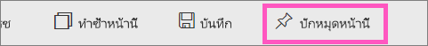
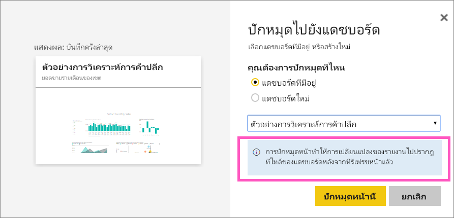
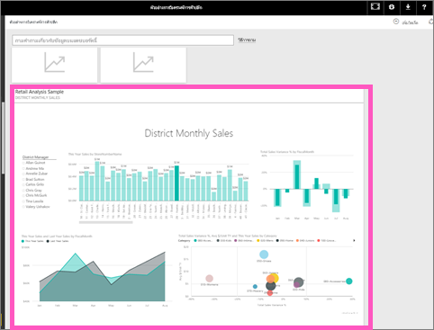

# ปักหมุดหน้ารายงานทั้งหน้าแบบไลฟ์ไทล์กับแดชบอร์ด Power BIPin an entire report page, as a live tile, to a Power BI dashboard
อีกวิธีในการเพิ่มใหม่[แดชบอร์ดไทล์](../consumer/end-user-tiles.md) คือการปักหมุดหน้ารายงานทั้งหน้าAnother way to add a new [dashboard tile](../consumer/end-user-tiles.md) is by pinning an entire report page. นี่คือวิธีง่ายๆ ในการปักหมุดการแสดงภาพมากกว่าหนึ่งครั้งThis is an easy way to pin more than one visualization at a time.  นอกจากนี้ เมื่อคุณปักหมุดทั้งหน้า ไทล์จะเป็นแบบ *live* คุณสามารถโต้ตอบกับพวกมันได้จากที่นั่นบนแดชบอร์ดAlso, when you pin an entire page, the tiles are *live*; you can interact with them right there on the dashboard. และเปลี่ยนแปลงที่คุณทำกับการแสดงภาพก่อนหน้านี้ในตัวแก้ไขรายงาน เช่นการเพิ่มตัวกรองหรือการเปลี่ยนแปลงเขตข้อมูลที่ใช้ในแผนภูมิ จะปรากฏในแดชบอร์ดไทล์เช่นกันAnd changes you make to any of the visualizations back in the report editor, like adding a filter or changing the fields used in the chart, are reflected in the dashboard tile as well.  

ปักหมุดไทล์แบบไลฟ์จากรายงานกับแดชบอร์ด สามารถใช้ได้ใน Power BI service (app.powerbi.com) เท่านั้นPinning live tiles from reports to dashboards is only available in Power BI service (app.powerbi.com).

> [!NOTE]
> คุณไม่สามารถปักหมุดไทล์จากรายงานที่ใช้ร่วมกันกับคุณได้You can't pin tiles from reports that are shared with you.
> 
> 

## ปักหมุดหน้ารายงานPin a report page
ดู Amanda ปักหมุดหน้ารายงานไว้กับแดชบอร์ด แล้วทำตามคำแนะนำทีละขั้นตอนด้านล่างวิดีโอเพื่อลองทำด้วยตนเองWatch Amanda pin a live report page to a dashboard and then follow the step-by-step instructions below the video to try it yourself.

<iframe width="560" height="315" src="https://www.youtube.com/embed/EzhfBpPboPA" frameborder="0" allowfullscreen></iframe>

1. เปิด[รายงานในมุมมองการแก้ไข](service-interact-with-a-report-in-editing-view.md)Open a report in [Editing view](service-interact-with-a-report-in-editing-view.md).
2. เนื่องจากการแสดงภาพไม่ได้ถูกเลือกจากแถบเมนู ให้เลือก **ปักหมุดหน้าแบบไลฟ์**With no visualizations selected, from the menubar, select **Pin Live Page**.
   
    
3. ปักหมุดไทล์ลงในแดชบอร์ดที่มีอยู่ หรือแดชบอร์ดใหม่Pin the tile to an existing dashboard or to a new dashboard. โปรดสังเกตว่า ข้อความที่ไฮไลท์ *การปักหมุดหน้าแบบไลฟ์สามารถทำให้รายงานปรากฏในแดชบอร์ดไทล์เปลี่ยนเมื่อมีการรีเฟรชหน้าได้*Notice the highlighted text: *Pin live page enables changes to reports to appear in the dashboard tile when the page is refreshed.*
   
   * แดชบอร์ดที่มีอยู่: เลือกชื่อของแดชบอร์ดจากรายการแบบหล่นลงExisting dashboard: select the name of the dashboard from the dropdown. แดชบอร์ดที่แชร์กับคุณจะไม่ปรากฏขึ้นที่นี่Dashboards that have been shared with you will not appear in the dropdown.
   * แดชบอร์ดใหม่ พิมพ์ชื่อของแดชบอร์ดใหม่New dashboard: type the name of the new dashboard.
     
     
4. เลือก **Pin live**Select **Pin live**. ข้อความว่าสำเร็จแล้ว (ใกล้กับมุมบนขวา) ช่วยให้คุณทราบว่า การหน้าถูกเพิ่มเป็นไทล์ ลงในแดชบอร์ดของคุณA Success message (near the top right corner) lets you know the page was added, as a tile, to your dashboard.

## เปิดแดชบอร์ดเพื่อดูไทล์ที่ถูกปักหมุดแบบไลฟ์Open the dashboard to see the pinned live tile
1. จากบานหน้าต่างนำทาง ให้เลือกแดชบอร์ดที่มีไทล์แบบสดอันใหม่From the nav pane, select the dashboard with the new live tile. ที่นั่น คุณสามารถทำสิ่งต่างๆ เช่น[เปลี่ยนชื่อ ปรับขนาด ลิงก์ และย้าย](service-dashboard-edit-tile.md)หน้ารายงานที่ปักหมุดไว้ได้There, you can do things like [rename, resize, link, and move](service-dashboard-edit-tile.md) the pinned report page.  
2. โต้ตอบกับไทล์รายงานแบบไลฟ์Interact with the live tile.  ในสกรีนช็อตด้านล่าง ให้เลือกแถบบนคอลัมน์ แผนภูมิมีตัวกรองแบบสลับ และแสดงภาพอื่นๆ บนไทล์แบบไฮไลท์สลับIn the screenshot below, selecting a bar on the column chart has cross-filtered and cross-highlighted the other visualizations on the tile.
   
    

## ขั้นตอนถัดไปNext steps
[แดชบอร์ดใน Power BIDashboards in Power BI](../consumer/end-user-dashboards.md)

มีคำถามเพิ่มเติมหรือไม่More questions? [ลองไปที่ชุมชน Power BITry the Power BI Community](https://community.powerbi.com/)
