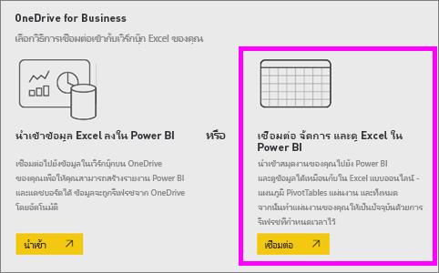
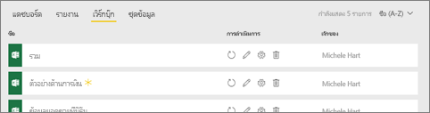
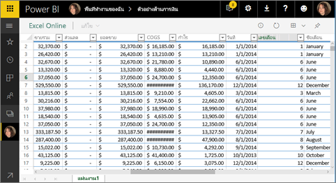
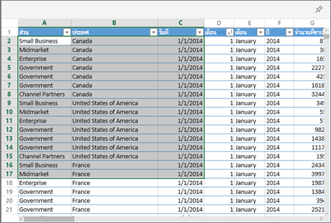
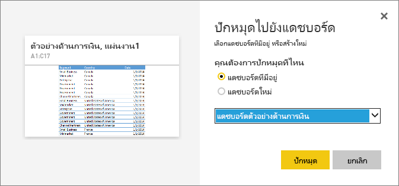

# ปักหมุดไทล์ไปที่แดชบอร์ด Power BI จาก ExcelPin a tile to a Power BI dashboard from Excel
ก่อนที่คุณสามารถปักหมุดไทล์จากสมุดงาน Excel ของคุณ คุณจะเชื่อมต่อเวิร์กบุ๊กนั้นกับเซอร์วิซ Power BI (app.powerbi.com)Before you can pin a tile from your Excel workbook, you'll connect that workbook to Power BI service (app.powerbi.com). การเชื่อมต่อเวิร์กบุ๊กโดยหลักๆ คือการนำลิงก์เวอร์ชันอ่านอย่างเดียวของเวิร์กบุ๊กนั้นลงในยังเซอร์วิซ Power BI และให้คุณสามารถปักหมุดช่วงในแดชบอร์ดได้Connecting a workbook essentially brings a linked read-only version of that workbook into Power BI service and allows you to pin ranges to dashboards. คุณสามารถแม้กระทั้งปักหมุดทั้งแผ่นงานกับยังแดชบอร์ดYou can even pin an entire worksheet to a dashboard.  
ถ้าเวิร์กบุ๊กได้แชร์กับคุณ คุณจะมีความสามารถในการดูไทล์ที่ปักโดยเจ้าของ แต่อย่าสร้างแดชบอร์ดไทล์ด้วยตัวคุณเองIf a workbook has been shared with you, you'll have the ability to view the tiles pinned by the owner, but not create any dashboard tiles yourself. 

สำหรับข้อมูลเชิงลึกเกี่ยวกับว่า Excel และ Power BI ทำงานร่วมกันอย่างไร ให้ดู[รับข้อมูลจากแฟ้มสมุดงาน Excel](https://go.microsoft.com/fwlink/?LinkID=521962)For in-depth information about how Excel and Power BI work together, see [Get data from Excel workbook files](https://go.microsoft.com/fwlink/?LinkID=521962).

Watch Will แสดงให้เห็นวิธีการนำเข้าข้อมูลหลายวิธีจาก และเชื่อมต่อไปยัง เวิร์กบุ๊ก ExcelWatch Will demonstrate several ways to import data from, and connect to, Excel workbooks.

<iframe width="560" height="315" src="https://www.youtube.com/embed/l8JoB7w0zJA" frameborder="0" allowfullscreen></iframe>

## เชื่อมต่อเวิร์กบุ๊ก Excel ของคุณจาก OneDrive for Business กับ Power BIConnect your Excel workbook from OneDrive for Business to Power BI
เมื่อคุณเลือกตัวเลือกนี้ **สมุดงานข** องคุณจะปรากฏใน Power BI เช่นเดียวกับที่ปรากฏใน Excel OnlineWhen you choose **Connect**, your workbook will appear in Power BI just like it would in Excel Online. แต่ไม่เหมือนกับ Excel Online เนื่องจากคุณจะมีคุณลักษณะบางอย่างที่ช่วยให้คุณสามารถปักหมุดองค์ประกอบต่าง ๆ จากแผ่นงานของคุณไปยังแดชบอร์ดได้ทันทีBut, unlike Excel Online, you’ll have some great features to help you pin elements from your worksheets right to your dashboards.

คุณไม่สามารถแก้ไขเวิร์กบุ๊กของคุณใน Power BI ได้You can’t edit your workbook in Power BI. แต่ถ้าคุณจำเป็นต้องทำการเปลี่ยนแปลงบางอย่าง คุณสามารถเลือกไอคอนดินสอจากแถบ **เวิ๊กบุ๊ก** ของพื้นที่การทำงานของคุณใน Excel Online หรือเปิดใน Excel บนคอมพิวเตอร์ของคุณBut if you need to make some changes, you can select the pencil icon from the **Workbooks** tab of your workspace, and then choose to edit your workbook in Excel Online or open it in Excel on your computer. การเปลี่ยนแปลงใด ๆ ที่คุณดำเนินการจะถูกบันทึกไปยังสมุดงานบน OneDriveAny changes you make are saved to the workbook on OneDrive.

1. อัปโหลดเวิร์กบุ๊กของคุณไปยัง OneDrive for Business ของคุณUpload your workbook to your OneDrive for Business.

2. จาก Power BI, [เชื่อมต่อกับสมุดงานนั้น](../connect-data/service-excel-workbook-files.md)โดยการเลือก **รับข้อมูล > ไฟล์ > OneDrive - ธุรกิจ** และไปยังตำแหน่งที่ตั้งคุณบันทึกไฟล์ ExcelFrom Power BI, [connect to that workbook](../connect-data/service-excel-workbook-files.md) by selecting **Get Data > Files > OneDrive - Business** and nagivating to the location where you saved the Excel file. เลือกไฟล์ แล้วเลือก **เชื่อมต่อ > เชื่อมต่อ**Select the file and choose **Connect > Connect**.

    

3. ใน Power BI เวิร์กบุ๊กจะถูกเพิ่มไปยังแท็บ **เวิร์กบุ๊ก** ของพื้นที่ทำงานของคุณIn Power BI, the workbook is added to the **Workbooks** tab of your workspace.  ไอคอนระบุว่านี่คือเวิร์กบุ๊ก Excel และเครื่องหมายดอกจันสีเหลืองบ่งชี้ว่าใหม่The  icon indicates this is an Excel workbook and a yellow asterisk indicates it's new.
    
    
4. เปิดเวิร์กบุ๊กใน Power BI โดยเลือกชื่อเวิร์กบุ๊กOpen the workbook in Power BI by selecting the workbook name.

    เปลี่ยนแปลงที่คุณทำกับเวิร์กบุ๊กใน Power BI จะไม่ถูกบันทึก และไม่มีผลต่อเวิร์กบุ๊กดั้งเดิมบน OneDrive for BusinessChanges you make to the workbook in Power BI are not saved and do not affect the original workbook on OneDrive for Business. ถ้าคุณเรียงลำดับ กรอง หรือเปลี่ยนค่าใน Power BI การเปลี่ยนแปลงเหล่านั้นไม่สามารถบันทึกหรือปักหมุดได้If you sort, filter, or change values in Power BI, those changes cannot be saved or pinned. ถ้าคุณจำเป็นต้องทำการเปลี่ยนแปลงที่จะถูกบันทึก เลือก **แก้ไข** จากมุมขวาบนเพื่อเปิดสำหรับการแก้ไขใน Excel Online หรือ ExcelIf you need to make changes that will be saved, select **Edit** from the upper-right corner to open it for editing in Excel Online or Excel. การเปลี่ยนแปลงด้วยวิธีนี้อาจใช้เวลาสักครู่เพื่อปรับปรุงไทล์บนแดชบอร์ดChanges made this way may take a few minutes to update the tiles on the dashboards.
   
    

## ปักหมุดช่วงของเซลกับแดชบอร์ดPin a range of cells to a dashboard
วิธีหนึ่งในการเพิ่ม[ไทล์แดชบอร์ด](../consumer/end-user-tiles.md)ใหม่ นั้นมาจากภายในเวิร์กบุ๊ก Excel ใน Power BIOne way to add a new [dashboard tile](../consumer/end-user-tiles.md) is from within an Excel workbook in Power BI. ช่วงที่ถูกปักหมุดจากเวิร์กบุ๊ก Excel ที่ได้รับการบันทึกใน OneDrive for Business หรือไลบรารีเอกสารที่แชร์กลุ่มอื่นRanges can be pinned from Excel workbooks that have been saved in your OneDrive for Business or another group-shared document library. ช่วงต่าง ๆ สามารถมีข้อมูล แผนภูมิ ตาราง Pivottable PivotCharts และส่วนอื่น ๆ ExcelThe ranges can contain data, charts, tables, PivotTables, PivotCharts, and other Excel parts.

1. การไฮไลท์เซลล์ที่คุณต้องการปักหมุดกับแดชบอร์ดHighlight the cells that you'd like to pin to a dashboard.
   
    
2. เลือกหมุดSelect the pin  icon.icon. 
3. ปักหมุดไทล์ลงในแดชบอร์ดที่มีอยู่ หรือแดชบอร์ดใหม่Pin the tile to an existing dashboard or to a new dashboard. 
   
   * แดชบอร์ดที่มีอยู่: เลือกชื่อของแดชบอร์ดจากรายการแบบหล่นลงExisting dashboard: select the name of the dashboard from the dropdown.
   * แดชบอร์ดใหม่ พิมพ์ชื่อของแดชบอร์ดใหม่New dashboard: type the name of the new dashboard.
   
     
4. เลือก **หมุด**Select **Pin**. ข้อความว่าสำเร็จแล้ว (ใกล้กับมุมบนขวา) ช่วยให้คุณทราบว่า การช่วงถูกเพิ่ม เป็นไทล์ ลงในแดชบอร์ดของคุณA Success message (near the top right corner) lets you know the range was added, as a tile, to your dashboard. 
   
    
5. เลือก **ไปยังแดชบอร์ด**Select **Go to dashboard**. จากที่นี่ คุณสามารถ[เปลี่ยนชื่อ ปรับขนาด ลิงก์ และย้าย](service-dashboard-edit-tile.md)การแสดงภาพที่ปักหมุดไว้ได้From here you can [rename, resize, link, and move](service-dashboard-edit-tile.md) the pinned visualization. ตามค่าเริ่มต้น การเลือกไทล์ที่ปักหมุดไว้นั้นเปิดสมุดงานใน Power BIBy default, selecting the pinned tile opens the workbook in Power BI.

## ปักหมุดทั้งตารางหรือ PivotTable ไปยังแดชบอร์ดPin an entire table or PivotTable to a dashboard
ทำตามขั้นตอนข้างบน ยกเว้นแทนที่จะเลือกช่วงของเซลล์ เลือกทั้งตารางหรือ PivotTableFollow the steps above except instead of selecting a range of cells, select an entire table or PivotTable.

เพื่อปักหมุดตาราง ให้เลือกช่วงทั้งหมดของตารางและอย่าลืมรวมส่วนหัวTo pin a table, select the entire range of the table and be sure to include the headers.  เพื่อปักหมุด PivotTable ตรวจสอบให้แน่ใจว่าได้รวมทุกส่วนที่มองเห็นได้ของ PivotTable รวมถึงตัวกรอง ถ้าใช้To pin a PivotTable, be sure to include every visible part of the PivotTable, including filters if used.

 

ไทล์ที่สร้างขึ้นจากตารางหรือ PivotTable จะแสดงทั้งตารางA tile created from a table or PivotTable will show the entire table.  ถ้าคุณเพิ่ม/ลบ/ตัวกรองแถวหรือคอลัมน์ในเวิร์กบุ๊กเดิม พวกมันจะเพิ่ม/ลบ/ถูกกรองในไทล์If you add/remove/filter rows or columns in the original workbook, they will also be added/removed/filtered in the tile.

## ดูสมุดงานที่เชื่อมโยงกับไทล์View the workbook linked to the tile
การเลือกไทล์เวิร์กบุ๊กได้เปิดเวิร์กบุ๊กที่ลิงก์ใน Power BISelecting a workbook tile opens the linked workbook in Power BI. เนื่องจากไฟล์เวิร์กบุ๊กอยู่บน OneDrive ของเจ้าของ OneDrive for Business การดูเวิร์กบุ๊กจำเป็นต้องมีสิทธิ์การอ่านเวิร์กบุ๊กSince the workbook file is located on the owner’s OneDrive for Business, viewing the workbook requires you have Read permissions for the workbook. ถ้าคุณไม่มีสิทธิ์ คุณจะได้รับข้อผิดพลาดIf you do not have permission, you will receive an error message.  

 

## ข้อควรพิจารณาและการแก้ไขปัญหาConsiderations and troubleshooting
ฟีเจอร์ที่ไม่รองรับ Power BI ใช้ Excel Services เพื่อรับไทล์ของเวิร์กบุ๊กUnsupported features: Power BI uses Excel Services to retrieve the workbook tiles. ดังนั้น เนื่องจากฟีเจอร์บางอย่างจาก Excel ไม่รองรับ Excel Services REST API มันจะมองไม่เห็นบนไทล์ใน Power BITherefore, since some features from Excel are not supported in Excel Services REST API, they will not be seen on tiles in Power BI. ตัวอย่างเช่น เส้นแบบประกายไฟ ไอคอนการตั้งค่าการจัดรูปแบบตามเงื่อนไข และตัวแบ่งส่วนข้อมูลเวลาFor example: Sparklines, icon set conditional formatting, and time slicers. สำหรับรายการทั้งหมดของฟีเจอร์ไม่รองรับ ให้ดู[ฟีเจอร์ที่ไม่รองรับใน Excel Services REST API](/sharepoint/dev/general-development/unsupported-features-in-excel-services-rest-api)For a full list of unsupported features see [Unsupported Features in Excel Services REST API](/sharepoint/dev/general-development/unsupported-features-in-excel-services-rest-api)

## ขั้นตอนถัดไปNext steps
[แชร์แดชบอร์ดที่เชื่อมโยงไปยังเวิร์กบุ๊ก ExcelShare a dashboard that has links to an Excel workbook](../collaborate-share/service-share-dashboard-that-links-to-excel-onedrive.md)

[รับข้อมูลจากเวิร์กบุ๊ก ExcelGet data from Excel workbooks](../connect-data/service-excel-workbook-files.md)

มีคำถามเพิ่มเติมหรือไม่More questions? [ลองไปที่ชุมชน Power BITry the Power BI Community](https://community.powerbi.com/)
