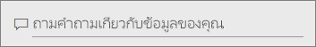
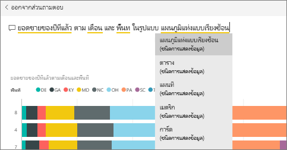
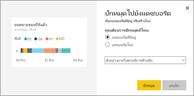
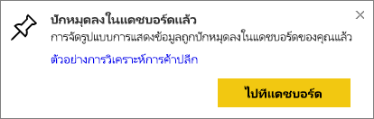
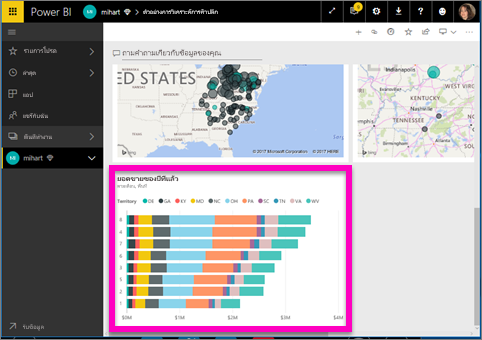
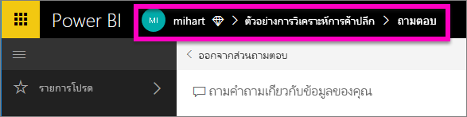

# ปักหมุดไทล์ที่แดชบอร์ดจาก Q&APin a tile to a dashboard from Q&A

Q&A เป็นเครื่องมือของ Power BI สำหรับการสำรวจข้อมูลของคุณโดยใช้ภาษาธรรมชาติQ&A is a Power BI tool for exploring your data using natural language. จำเป็นต้องค้นหาข้อมูลเชิงลึกที่เฉพาะเจาะจงหรือไม่Need to find a particular insight? ถามคำถามเกี่ยวกับข้อมูลของคุณ และรับคำตอบในรูปแบบการแสดงภาพAsk a question about your data, and receive an answer in the form of a visualization.

ในบทความวิธีการใช้งานนี้ เราเปิด[แดชบอร์ด](../consumer/end-user-dashboards.md)ในบริการ Power BI (app.powerbi.com) ถามคำถามโดยใช้ภาษาธรรมชาติเพื่อสร้างภาพ และปักหมุดการแสดงภาพนั้นที่แดชบอร์ดIn this how-to article, we open a [dashboard](../consumer/end-user-dashboards.md) in the Power BI service (app.powerbi.com), ask a question using natural language to create a visualization, and pin that visualization to the dashboard. แดชบอร์ดไม่พร้อมใช้งานใน Power BI DesktopDashboards aren't available in Power BI Desktop. สำหรับข้อมูลใน Q&A กับเครื่องมือและเนื้อหา Power BI อื่น ๆ ให้ดู[Q&A ของ Power BI โดยภาพรวม](../consumer/end-user-q-and-a.md)For information on using Q&A with other Power BI tools and content, see the [Power BI Q&A overview](../consumer/end-user-q-and-a.md). 

เพื่อการทำตาม ให้เปิด[แดชบอร์ดตัวอย่างวิเคราะห์ร้านค้าปลีก](sample-retail-analysis.md)To follow along, open the [Retail Analysis sample dashboard](sample-retail-analysis.md).

## วิธีการปักหมุดไทล์จาก Q&AHow to pin a tile from Q&A

1. เปิดแดชบอร์ดที่มีอย่างน้อยหนึ่งไทล์ที่ปักหมุดจากรายงานOpen a dashboard that has at least one tile pinned from a report. เมื่อคุณถามคำถาม Power BI จะค้นหาคำตอบในชุดข้อมูลใดๆ ที่มีไทล์ถูกปักในแดชบอร์ดนั้นWhen you ask a question, Power BI looks for the answer in any dataset that has a tile pinned to that dashboard.
2. ที่กล่องคำถามด้านบนในแดชบอร์ดของคุณ ให้เริ่มพิมพ์สิ่งที่คุณต้องการทราบเกี่ยวกับข้อมูลของคุณIn the question box at the top of your dashboard, start typing what you want to know about your data.  
   
3. ตัวอย่างเช่น พิมพ์ “ยอดขายของปีที่แล้วตามเดือนและพื้นที่”For example, as you type "last year sales by month and territory"...  
   

   กล่องคำถามให้คำแนะนำคุณthe question box gives you suggestions.
4. หากต้องการเพิ่มแผนภูมิไปยังแดชบอร์ดในรูปแบบไทล์ ให้เลือกปักหมุดTo add the chart to your dashboard as a tile, select the pin  ที่ด้านขวาบนของพื้นที่ทำงานon the top-right side of the canvas. ถ้ามีการแชร์แดชบอร์ดกับคุณ คุณจะไม่สามารถปักหมุดการสร้างการแสดงภาพใดได้If the dashboard has been shared with you, you won't be able to pin any visualizations.

5. ปักหมุดไทล์ลงในแดชบอร์ดที่มีอยู่ หรือแดชบอร์ดใหม่Pin the tile to an existing dashboard or to a new dashboard.

   

   * แดชบอร์ดที่มีอยู่ ให้เลือกชื่อของแดชบอร์ดจากรายการแบบดร๊อปดาวน์Existing dashboard: select the name of the dashboard from the dropdown. ตัวเลือกของคุณจะถูกจำกัดให้ใช้งานเฉพาะกับแดชบอร์ดดังกล่าวภายในพื้นที่ทำงานปัจจุบันYour choices will be limited to only those dashboards within the current workspace.
   * แดชบอร์ดใหม่ พิมพ์ชื่อของแดชบอร์ดใหม่ แล้วจะได้รับการเพิ่มไปยังพื้นที่ทำงานปัจจุบันของคุณNew dashboard: type the name of the new dashboard and it will be added to your current workspace.

6. เลือก **หมุด**Select **Pin**.

   ข้อความการดำเนินการสำเร็จ (ใกล้กับมุมบนขวา) ช่วยให้คุณทราบว่าได้เพิ่มการแสดงภาพเป็นไทล์ ลงในแดชบอร์ดของคุณแล้วA success message (near the top-right corner) lets you know the visualization was added, as a tile, to your dashboard.  

   
7. เลือก **ไปยังแดชบอร์ด** เมื่อต้องการดูไทล์ใหม่Select **Go to dashboard** to see the new tile. ที่นั่น คุณสามารถ[เปลี่ยนชื่อ ปรับขนาด เพิ่มลิงค์ และจัดตำแหน่งไทล์ใหม่ และอื่นๆ](service-dashboard-edit-tile.md) ในแดชบอร์ดของคุณได้There, you can [rename, resize, add a hyperlink, reposition the tile, and more](service-dashboard-edit-tile.md) on your dashboard.

   

## ข้อควรพิจารณาและการแก้ไขปัญหาConsiderations and troubleshooting
* เมื่อคุณเริ่มพิมพ์คำถาม Q&Aจะเริ่มค้นหาคำตอบที่ดีที่สุดจากชุดข้อมูลทั้งหมดที่เชื่อมโยงกับแดชบอร์ดปัจจุบันทันทีWhen you start typing a question, Q&A immediately begins searching for the best answer from all datasets associated with the current dashboard.  "แดชบอร์ดปัจจุบัน" เป็นแดชบอร์ดที่แสดงอยู่ในหน้าต่างนำทางด้านบนThe "current dashboard" is the dashboard listed in the top nav pane. ตัวอย่างเช่น คำถามนี้จะถูกถามในแดชบอร์ด **ตัวอย่างการวิเคราะห์ร้านค้าปลีก** ที่เป็นส่วนหนึ่งของพื้นที่ทำงาน **mihart**For example, this question is being asked in the **Retail Analysis Sample** dashboard that is part of the **mihart** workspace.

  
* **Q&A รู้ว่าจะใช้ข้อมูลชุดไหนได้อย่างไร****How does Q&A know which datasets to use**?  Q&A มีสิทธิ์เข้าถึงชุดข้อมูลทั้งหมดที่มีการแสดงภาพอย่างน้อยหนึ่งที่ ที่ปักหมุดที่แดชบอร์ดนั้นQ&A has access to all datasets that have at least one visualization pinned to that dashboard.

* **ไม่เห็นกล่องคำถาม หรือไม่** ่**Don't see the question box**? ตรวจสอบกับผู้ดูแลระบบ Power BI ของคุณCheck with your Power BI administrator. ผู้ดูแลระบบมีความสามารถในการปิดใช้งาน Q&AThe administrator has the ability to disable Q&A.

## ขั้นตอนถัดไปNext steps
[เปลี่ยนชื่อ ปรับขนาด เพิ่มไฮเปอร์ลิงก์ เปลี่ยนตำแหน่งไทล์ และอื่น ๆ ](service-dashboard-edit-tile.md)  [Rename, resize, add a hyperlink, reposition the tile, and more](service-dashboard-edit-tile.md)    
[แสดงแดชบอร์ดไทล์ของคุณในโหมดโฟกัส](../consumer/end-user-focus.md)   [Display your dashboard tile in Focus mode](../consumer/end-user-focus.md)     
[ภาพรวมของ Q&A ใน Power BIOverview of Q&A in Power BI](../consumer/end-user-q-and-a.md)  
มีคำถามเพิ่มเติมหรือไม่More questions? [ลองไปที่ชุมชน Power BITry the Power BI Community](https://community.powerbi.com/)
