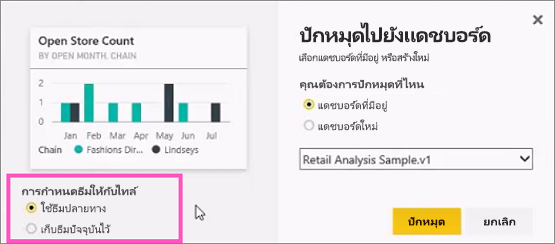
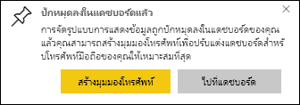

# ปักหมุดไทล์ไปยังแดชบอร์ด Power BI จากรายงานPin a tile to a Power BI dashboard from a report

วิธีหนึ่งในการเพิ่ม[ไทล์แดชบอร์ด](../consumer/end-user-tiles.md)ใหม นั้นมาจากภายใน [รายงาน Power BI](../consumer/end-user-reports.md)One way to add a [dashboard tile](../consumer/end-user-tiles.md) is from within a [Power BI report](../consumer/end-user-reports.md). เมื่อคุณเลือกหนึ่งในไทล์เหล่านี้ ไทล์จะเปิดขึ้นในรายงานWhen you select one of these tiles, it opens in the report.

หน้ารายงานทั้งหมดสามารถปักหมุดไปยังแดชบอร์ด ซึ่งเรียกว่าการปักหมุดไทล์ *สด*An entire report page can be pinned to a dashboard, which is called pinning a *live* tile. ที่เรียกกันว่าไทล์สดเนื่องจากคุณสามารถโต้ตอบกับไทล์บนแดชบอร์ดได้It's called a live tile because you can interact with the tile on the dashboard. การเปลี่ยนแปลงที่ทำในรายงานจะซิงค์กับแดชบอร์ดโดยอัตโนมัติ ซึ่งแตกต่างกับไทล์การแสดงข้อมูลด้วยภาพแต่ละรายการUnlike with individual visualization tiles, changes made in the report are automatically synced with the dashboard. สำหรับข้อมูลเพิ่มเติม ให้ดู[ปักหมุดหน้ารายงานทั้งหน้า](#pin-an-entire-report-page)For more information, see [Pin an entire report page](#pin-an-entire-report-page).

คุณไม่สามารถปักหมุดไทล์ จากรายงานที่มีการแชร์กับคุณ หรือจาก Power BI DesktopYou can't pin tiles from reports that have been shared with you or from Power BI Desktop. 

> [!TIP]
> เนื่องจากการแสดงข้อมูลด้วยภาพบางรายการมีการใช้ภาพพื้นหลัง การปักหมุดอาจไม่ทำงานหากภาพพื้นหลังมีขนาดใหญ่เกินไปBecause some visualizations use background images, pinning might not work if the background image is too large. ลองลดขนาดรูปภาพ หรือโดยใช้การบีบอัดรูปภาพTry reducing the image size or using image compression.  
> 
> 

## ปักหมุดไทล์จากรายงานPin a tile from a report
ดู Amanda สร้างแดชบอร์ดโดยการปักหมุดภาพและรูปภาพจากรายงาน Power BIWatch Amanda create a dashboard by pinning visuals and images from a Power BI report.
    

<iframe width="560" height="315" src="https://www.youtube.com/embed/lJKgWnvl6bQ" frameborder="0" allowfullscreen></iframe>

ในตอนนี้ ให้สร้างแดชบอร์ดของคุณเองโดยใช้หนึ่งในตัวอย่างรายงาน Power BINow create your own dashboard by using one of the Power BI sample reports.

1. ในรายงาน ให้วางเคอร์เซอร์เหนือการแสดงข้อมูลด้วยภาพที่คุณต้องการปักหมุด แล้วเลือกไอคอนเข็มหมุดIn the report, hover over the visualization you want to pin, and select the pin icon. . Power BI เปิดขึ้นในหน้าจอ **ปักหมุดลงในแดชบอร์ด**Power BI opens the **Pin to dashboard** screen.
   
     
2. เลือกว่า คุณต้องการปักหมุดไปยังแดชบอร์ดที่มีอยู่ หรือสร้างแดชบอร์ดใหม่Select whether to pin to an existing dashboard or new dashboard.
   
   * **แดชบอร์ดที่มีอยู่**: ให้เลือกชื่อของแดชบอร์ดจากรายการแบบดึงลง**Existing dashboard**: Select the name of the dashboard from the dropdown. แดชบอร์ดที่แชร์กับคุณจะไม่ปรากฏขึ้นที่นี่Dashboards that have been shared with you won't appear in the dropdown.
   * **แดชบอร์ดใหม่**: ป้อนชื่อของแดชบอร์ดใหม่**New dashboard**: Enter the name of the new dashboard.
3. ในบางกรณี รายการที่คุณปักหมุดอาจจะมี *ธีม* ที่ถูกนำไปใช้อยู่แล้วIn some cases, the item you're pinning might have a *theme* already applied. ตัวอย่างเช่น ภาพปักหมุดจากสมุดงาน ExcelFor example, visuals pinned from an Excel workbook. ถ้าเป็นเช่นนั้น เลือกชุดรูปแบบที่จะใช้กับไทล์If so, select which theme to apply to the tile.
4. เลือก **หมุด**Select **Pin**.
   
   ข้อความว่าสำเร็จแล้ว (ใกล้กับมุมบนขวา) ช่วยให้คุณทราบว่าได้เพิ่มการแสดงข้อมูลด้วยภาพเป็นไทล์ลงในแดชบอร์ดของคุณแล้วA success message (near the top-right corner) informs you the visualization was added, as a tile, to your dashboard.
   
   
5. จากบานหน้าต่างนำทาง ให้เลือกแดชบอร์ดที่มีไทล์ใหม่From the nav pane, select the dashboard with the new tile. [แก้ไขการแสดงไทล์และลักษณะการทำงาน](service-dashboard-edit-tile.md)หรือเลือกไทล์เพื่อกลับไปยังรายงาน[Edit the tile display and behavior](service-dashboard-edit-tile.md) or select the tile to return to the report.

## ปักหมุดทั้งหน้ารายงานPin an entire report page
อีกหนึ่งตัวเลือกก็คือ การปักหมุดหน้ารายงานทั้งหมดไปยังแดชบอร์ด ซึ่งเป็นวิธีง่าย ๆ ในการปักหมุดการแสดงข้อมูลด้วยภาพมากกว่าหนึ่งรายการในแต่ละครั้งAnother option is to pin an entire report page to a dashboard, which is an easy way to pin more than one visualization at a time. เมื่อคุณปักหมุดหน้ารายงานทั้งหน้า ไทล์จะเป็นแบบ *สด*When you pin an entire page, the tiles are *live*. นั่นก็คือ คุณสามารถโต้ตอบกับไทล์บนแดชบอร์ดได้That is, you can interact with them there on the dashboard. การเปลี่ยนแปลงที่คุณทำกับการแสดงข้อมูลลด้วยภาพในตัวแก้ไขรายงาน เช่นการเพิ่มตัวกรองหรือการเปลี่ยนแปลงเขตข้อมูลที่ใช้ในแผนภูมิ จะปรากฏในไทล์แดชบอร์ดด้วยเช่นกันChanges you make to any of the visualizations in the report editor, like adding a filter or changing the fields used in the chart, are reflected in the dashboard tile as well.  

สำหรับข้อมูลเพิ่มเติม ให้ดู[ปักหมุดหน้ารายงานทั้งหน้า](service-dashboard-pin-live-tile-from-report.md)For more information, see [Pin an entire report page](service-dashboard-pin-live-tile-from-report.md).

## ข้อจำกัดLimitations
ตัวเลือกการจัดรูปแบบรายงานหรือธีมบางอย่างจะไม่นำไปใช้กับวิชวลเมื่อคุณปักหมุดไว้ที่แดชบอร์ดSome report formatting options or themes aren't applied to visuals when you pin them to a dashboard.
- การตั้งค่าเส้นขอบ เงา และพื้นหลังจะถูกละเว้นในไทล์ที่ปักหมุดไว้Border, shadow, and background settings are ignored in the pinned tile.
- สำหรับวิชวลการ์ดจะมีการแสดงข้อความที่ใช้สำหรับค่าในแดชบอร์ดโดยใช้ตระกูลฟอนต์ 'DIN' พร้อมข้อความสีดำFor card visuals, the text used for the value is shown in dashboards using the 'DIN' font family, with black text. คุณสามารถเปลี่ยนสีข้อความสำหรับไทล์ทั้งหมดบนแดชบอร์ดได้โดย[การสร้างธีมแดชบอร์ดที่กำหนดเอง](service-dashboard-themes.md)You can change the text color for all the tiles on a dashboard by [creating a custom dashboard theme](service-dashboard-themes.md).
- การจัดรูปแบบตามเงื่อนไขในตารางไม่ถูกนำมาใช้Conditional formatting isn't applied.
- วิชวลจะปรับขนาดของตัวเองให้พอดีกับขนาดของไทล์Visuals will adjust their size to fit the size of the tile. ซึ่งอาจส่งผลให้เกิดความแตกต่างในเค้าโครง ราวกับว่ามีการปรับขนาดวิชวลใหม่อีกครั้งบนรายงานThis can result in differences in layout as if the visual had been resized on the report.

## ขั้นตอนถัดไปNext steps
- [แดชบอร์ดสำหรับผู้บริโภคบริการของ Power BIDashboards for Power BI service consumers](../consumer/end-user-dashboards.md)
- [ไทล์แดชบอร์ดใน Power BIDashboard tiles in Power BI](../consumer/end-user-tiles.md)
- [รายงานใน Power BIReports in Power BI](../consumer/end-user-reports.md)
- [การรีเฟรชข้อมูลใน Power BIData refresh in Power BI](../connect-data/refresh-data.md)
- [แนวคิดพื้นฐานสำหรับนักออกแบบในบริการ Power BIBasic concepts for designers in the Power BI service](../fundamentals/service-basic-concepts.md)

มีคำถามเพิ่มเติมหรือไม่More questions? [ลองไปที่ชุมชน Power BITry the Power BI Community](https://community.powerbi.com/)
