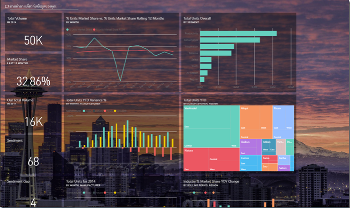
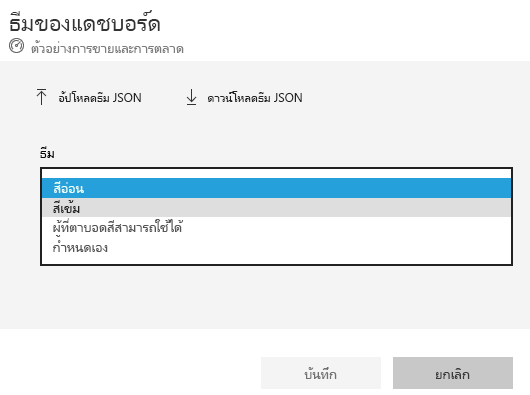
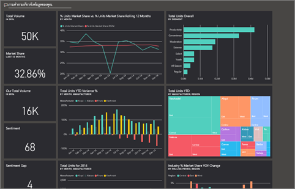
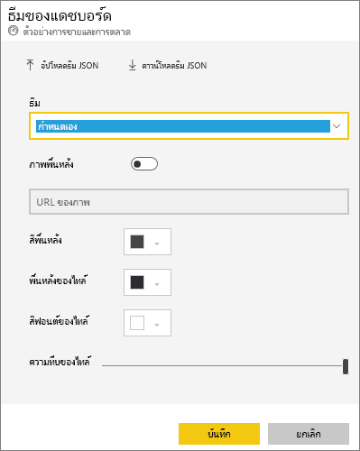
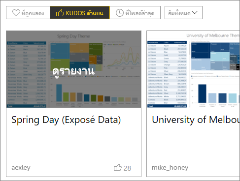
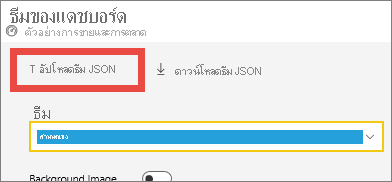
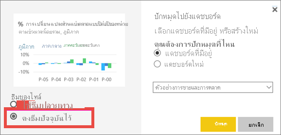
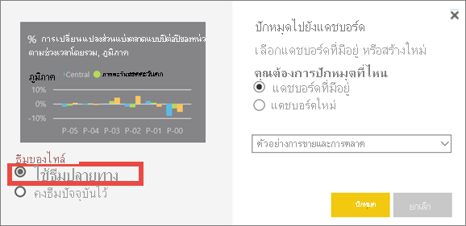

# <a name="use-dashboard-themes-in-the-power-bi-service"></a>ใช้ธีมแดชบอร์ดในบริการของ Power BI
ด้วย **ธีมแดชบอร์ด** คุณสามารถใช้ธีมสีกับทั้งแดชบอร์ดของคุณ เช่น สีขององค์กร การกำหนดสีตามฤดูกาล หรือธีมสีอื่น ๆ ที่คุณอาจต้องการนำไปใช้ เมื่อคุณใช้ธีมแดชบอร์ด วิชวลทั้งหมดบนแดชบอร์ดของคุณจะใช้สีจากธีมที่คุณเลือก มีข้อยกเว้นบางประการซึ่งอธิบายไว้ในส่วน[ข้อควรพิจารณาและข้อจำกัด](#considerations-and-limitations)ของบทความนี้



การเปลี่ยนสีของวิชวลรายงานบนแดชบอร์ดจะไม่มีผลกับวิชวลในรายงานที่เกี่ยวข้อง นอกจากนี้ เมื่อคุณปักหมุดไทล์จากรายงานที่[ใช้ธีมรายงานอยู่แล้ว](desktop-report-themes.md) คุณสามารถเลือกเพื่อเก็บธีมปัจจุบัน หรือใช้ธีมแดชบอร์ด


## <a name="prerequisites"></a>สิ่งที่จำเป็นต้องมี
* เพื่อทดลองทำตาม เปิด[ตัวอย่างแดชบอร์ดการขายและการตลาด](sample-datasets.md)


## <a name="how-dashboard-themes-work"></a>วิธีการทำงานของธีมแดชบอร์ด
หากต้องการเริ่มต้นใช้งาน ให้เปิดแดชบอร์ดที่คุณสร้างขึ้น หรือสามารถแก้ไขได้ เลือก **แก้ไข** > **ธีมแดชบอร์ด** 


ในบานหน้าต่างแดชบอร์ดที่ปรากฏขึ้น เลือกหนึ่งในธีมที่สร้างไว้ล่วงหน้าแล้ว  ในตัวอย่างด้านล่าง เราได้เลือกสี **เข้ม**





## <a name="create-a-custom-theme"></a>สร้างธีมแบบกำหนดเอง

ธีมเริ่มต้นสำหรับแดชบอร์ด Power BI คือสี **อ่อน** ถ้าคุณต้องการกำหนดสี หรือสร้างธีมของคุณเอง เลือก **กำหนดเอง** ในรายการดรอปดาวน์ 



ใช้ตัวเลือกแบบกำหนดเองเพื่อสร้างธีมแดชบอร์ดของคุณเอง ถ้าต้องการเพิ่มรูปภาพพื้นหลัง เราขอแนะนำว่า รูปภาพของคุณมีความละเอียดอย่างน้อย 1920x1080 หากต้องการใช้รูปภาพเป็นพื้นหลัง ให้อัปโหลดรูปภาพไปยังเว็บไซต์สาธารณะ จากนั้นคัดลอก URL และวางลงในเขตข้อมูล **URL ของรูปภาพ** 

## <a name="use-a-json-theme"></a>ใช้ธีม JSON
อีกวิธีในการสร้างธีมแบบกำหนดเอง คือการอัปโหลดไฟล์ JSON ที่มีการตั้งค่าสำหรับสีทั้งหมดที่คุณต้องการใช้สำหรับแดชบอร์ดของคุณ ใน Power BI Desktop ผู้สร้างรายงานใช้ไฟล์ JSON [สร้างธีมสำหรับรายงาน](desktop-report-themes.md) คุณสามารถอัปโหลดไฟล์ JSON เดียวกันนี้สำหรับแดชบอร์ด หรือค้นหา และอัปโหลดไฟล์ JSON จาก[หน้าแกลเลอรีธีม](https://community.powerbi.com/t5/Themes-Gallery/bd-p/ThemesGallery)ในชุมชน Power BI ได้ 


คุณยังสามารถบันทึกธีมแบบกำหนดเองของคุณเป็นไฟล์ JSON และให้แชร์กับผู้สร้างแดชบอร์ดอื่น ๆ ได้ 

### <a name="use-a-theme-from-the-theme-gallery"></a>ใช้ธีมจากแกลเลอรีธีม

เช่นเดียวกับตัวเลือกมีอยู่ภายในและแบบกำหนดเอง เมื่อคุณอัปโหลดธีม สีจะถูกนำไปใช้กับไทล์ทั้งหมดในแดชบอร์ดโดยอัตโนมัติ 

1. โฮเวอร์เหนือธีม และเลือก **ดูรายงาน**

    

2. เลื่อนลง แล้วค้นหาลิงก์ไปยังไฟล์ JSON  เลือกไอคอนดาวน์โหลด และบันทึกไฟล์

    

3. กลับไปในบริการของ Power BI ในหน้าต่างธีมแดชบอร์ดแบบกำหนดเอง เลือก **อัปโหลดธีม JSON**

    

4. นำทางไปยังตำแหน่งที่คุณบันทึกไฟล์ธีม JSON และเลือก **เปิด**

5. บนหน้าธีมแดชบอร์ด เลือก **บันทึก** ธีมใหม่จะถูกนำมาใช้ในแดชบอร์ดของคุณ

    

## <a name="reports-and-dashboards-with-different-themes"></a>รายงานและแดชบอร์ดที่มีธีมที่แตกต่างกัน

ถ้ารายงานของคุณใช้ธีมที่แตกต่างจากธีมแดชบอร์ด ในกรณีส่วนใหญ่คุณสามารถควบคุมว่า วิชวลยังคงใช้ธีมของรายงานปัจจุบัน หรือใช้ธีมของแดชบอร์ด แต่อย่างไรก็ตาม วิชวลการ์ดในแดชบอร์ดใช้ตระกูลฟอนต์ 'DIN' พร้อมข้อความสีดำ คุณสามารถเปลี่ยนสีข้อความสำหรับไทล์ทั้งหมดบนแดชบอร์ดรวมถึงการ์ดได้โดยการสร้างธีมแดชบอร์ดที่กำหนดเอง

- เมื่อปักหมุดไทล์ไปยังแดชบอร์ด เลือก **คงชุดรูปแบบปัจจุบันไว้** เพื่อเก็บธีมรายงานไว้ วิชวลบนแดชบอร์ด จะคงธีมรายงาน รวมถึงการตั้งค่าความโปร่งใส

    ครั้งเดียวที่คุณจะเห็นตัวเลือก **การกำหนดธีมไทล์** คือ ถ้าคุณสร้างรายงานใน Power BI Desktop [เพิ่มธีมรายงาน](desktop-report-themes.md) แล้วเผยแพร่รายงานไปยังบริการของ Power BI

    

- ลองปักหมุดไทล์อีกครั้ง และเลือก **ใช้ธีมของแดชบอร์ด**

    

## <a name="dashboard-theme-json-file-format"></a>รูปแบบไฟล์ JSON ของธีมแดชบอร์ด

ในขั้นพื้นฐานที่สุด ธีมไฟล์ JSON มีบรรทัดที่จำเป็นต้องระบุเพียงหนึ่งรายการเท่านั้นคือ: **ชื่อ**

```json
{
    "name": "Custom Theme"
}
```

นอกเหนือจาก **ชื่อ** แล้ว สิ่งอื่นเป็นทางเลือก คุณสามารถเพิ่มคุณสมบัติเฉพาะที่คุณต้องการจัดรูปแบบสำหรับไฟล์ธีมได้ตามใจ และสามารถใช้ค่าเริ่มต้นของ Power BI สำหรับส่วนที่เหลือได้

ไฟล์ JSON สำหรับการกำหนดธีมแดชบอร์ดประกอบด้วย:

- ชื่อ: ชื่อธีม (เขตข้อมูลเดียวที่บังคับ)
- ฉากหน้าและพื้นหลัง: สีสำหรับแดชบอร์ด
- dataColors: รายการรหัสฐานสิบหกเพื่อใช้สำหรับข้อมูลในแผนภูมิ คุณสามารถรวมสีได้น้อยหรือมากตามที่คุณต้องการ
- ไทล์: การกำหนดค่าพื้นหลังและสีสำหรับแดชบอร์ด
- visualStyles: การจัดรูปแบบแบบละเอียดสำหรับวิชวล

นี่คือตัวอย่างธีม JSON สำหรับธีมสีอ่อนเริ่มต้น:

```json
{

"name":"Light",

"foreground":"#000000",

"background":"#EAEAEA",

"dataColors":["#01B8AA","#374649","#FD625E","#F2C80F","#5F6B6D","#8AD4EB","#FE9666","#A66999"],

"tiles":{"background":"#FFFFFF","color":"#000000"},

"visualStyles":{"*":{"*":{"*":[{"color":{"solid":{"color":"#000000"}}}]}}}

}
```

## <a name="considerations-and-limitations"></a>ข้อควรพิจารณาและข้อจำกัด

* คุณไม่สามารถใช้ธีมแดชบอร์ดได้กับรายงานสด ไทล์ iframe ไทล์ SSRS ไทล์เวิร์กบุ๊ก หรือรูปภาพที่ปักหมุดได้
* คุณเห็นธีมแดชบอร์ดได้บนอุปกรณ์เคลื่อนที่ แต่คุณสามารถสร้างธีมแดชบอร์ดได้ในบริการของ Power BI เท่านั้น
* ธีมแดชบอร์ดแบบกำหนดเองทำงานกับเฉพาะไทล์ที่ปักหมุดจากรายงาน

## <a name="next-steps"></a>ขั้นตอนถัดไป

- [นำธีมไปใช้กับรายงาน](desktop-report-themes.md)
