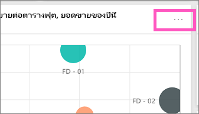
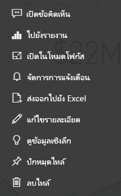

# แนะนำไทล์แดชบอร์ดสำหรับนักออกแบบ Power BIIntro to dashboard tiles for Power BI designers

ไทล์เป็นสแนปช็อตของข้อมูลของคุณที่ปักหมุดไปยังแดชบอร์ดA tile is a snapshot of your data, pinned to the dashboard. คุณสามารถสร้างไทล์จากรายงาน ชุดข้อมูล แดชบอร์ด กล่องคำถาม Q&A, Excel และรายงาน SQL Server Reporting Services (SSRS) และอื่น ๆ ได้A tile can be created from a report, dataset, dashboard, the Q&A box, Excel, SQL Server Reporting Services (SSRS) reports, and more.  ภาพถ่ายหน้าจอนี้แสดงไทล์ต่าง ๆ มากมายที่ปักหมุดไปยังแดชบอร์ดหนึ่งThis screenshot shows many different tiles pinned to a dashboard.

แดชบอร์ดและไทล์แดชบอร์ดเป็นคุณลักษณะของบริการ Power BI ไม่ใช่ของ Power BI DesktopDashboards and dashboard tiles are a feature of Power BI service, not Power BI Desktop. คุณไม่สามารถสร้างแดชบอร์ดบนอุปกรณ์มือถือ แต่คุณสามารถ [ดู และแชร์](../consumer/mobile/mobile-apps-view-dashboard.md) ได้You can't create dashboards on mobile devices but you can [view and share](../consumer/mobile/mobile-apps-view-dashboard.md) them there.

นอกจากการปักหมุดไทล์แล้ว คุณยังสามารถสร้างไทล์แบบเดี่ยวได้โดยตรงบนแดชบอร์ดโดยใช้ตัวควบคุม [เพิ่มไทล์](service-dashboard-add-widget.md)Besides pinning tiles, you can create standalone tiles directly on the dashboard by using the [Add tile](service-dashboard-add-widget.md) control. ไทล์แบบเดี่ยวรวมถึง: กล่องข้อความ รูปภาพ วิดีโอ ข้อมูลสตรีมมิ่ง และเนื้อหาบนเว็บStandalone tiles include: text boxes, images, videos, streaming data, and web content.

ต้องการความช่วยเหลือในการทำความเข้าใจเกี่ยวกับบล็อกที่ประกอบเป็น Power BI หรือไม่Need help with understanding the building blocks that make up Power BI? ดู[แนวคิดพื้นฐานสำหรับนักออกแบบในบริการของ Power BI](../fundamentals/service-basic-concepts.md)See [Basic concepts for designers in the Power BI service](../fundamentals/service-basic-concepts.md).

> [!NOTE]
> ถ้าการแสดงภาพต้นฉบับที่ใช้เพื่อสร้างไทล์เปลี่ยนแปลง ไทล์ดังกล่าวจะไม่เปลี่ยนแปลงไปด้วยIf the original visualization used to create the tile changes, the tile doesn't change.  ตัวอย่างเช่น ถ้าคุณปักหมุดแผนภูมิเส้นจากรายงาน จากนั้นคุณเปลี่ยนแผนภูมิเส้นเป็นแผนภูมิแท่ง ไทล์แดชบอร์ดจะยังคงแสดงแผนภูมิเส้นFor example, if you pinned a line chart from a report and then you changed the line chart to a bar chart, the dashboard tile continues to show a line chart. รีเฟรชข้อมูลแต่การชนิดแสดงภาพไม่เปลี่ยนThe data refreshes, but the visualization type does not.
> 
> 

## ปักหมุดไทล์Pin a tile
มีหลายวิธีในการเพิ่ม (PIN) ไทล์หนึ่ง ๆ ไปยังแดชบอร์ดหนึ่งThere are many different ways to add (pin) a tile to a dashboard. คุณสามารถปักหมุดไทล์จาก:You can pin tiles from:

* [การถามตอบสำหรับ Power BIPower BI Q&A](service-dashboard-pin-tile-from-q-and-a.md)
* [รายงานA report](service-dashboard-pin-tile-from-report.md)
* [แดชบอร์ดอื่นAnother dashboard](service-pin-tile-to-another-dashboard.md)
* [สมุดงาน Excel บน OneDrive for BusinessExcel workbook on OneDrive for Business](service-dashboard-pin-tile-from-excel.md)
* [Quick Insights (ข้อมูลเชิงลึกด่วน)Quick Insights](service-insights.md)
* [รายงานที่มีการแบ่งหน้าภายในองค์กรในเซิร์ฟเวอร์รายงาน Power BI หรือ SQL Server Reporting ServicesAn on-premises paginated report in Power BI Report Server or SQL Server Reporting Services](/sql/reporting-services/pin-reporting-services-items-to-power-bi-dashboards)

คุณสามารถสร้างไทล์แบบเดี่ยวสำหรับรูปภาพ กล่องข้อความ วิดีโอ ข้อมูลสตรีมมิ่ง และเนื้อหาบนเว็บได้โดยตรงบนแดชบอร์ดโดยใช้ตัวควบคุม [เพิ่มไทล์](service-dashboard-add-widget.md)You create standalone tiles for images, text boxes, videos, streaming data, and web content directly on the dashboard by using the [Add tile](service-dashboard-add-widget.md) control.

  

## โต้ตอบกับไทล์บนแดชบอร์ดInteract with tiles on a dashboard
หลังจากที่คุณได้เพิ่มไทล์ลงในแดชบอร์ดแล้ว คุณสามารถย้ายและปรับขนาดหรือเปลี่ยนลักษณะที่ปรากฏและลักษณะการทำงานได้After you've added a tile to a dashboard, you can move and resize it, or change its appearance and behavior.

### ย้ายและปรับขนาดไทล์Move and resize a tile
หยิบไทล์และ[ย้ายไปรอบ ๆ ในแดชบอร์ด](service-dashboard-edit-tile.md)Grab a tile and [move it around on the dashboard](service-dashboard-edit-tile.md). เลื่อนและเลือกด้ามจับเพื่อปรับขนาดไทล์Hover and select the handle  to resize the tile.

### เลื่อนเหนือไทล์เพื่อเปลี่ยนลักษณะปรากฏและลักษณะการทำงานHover over a tile to change the appearance and behavior
1. เลื่อนเหนือไทล์เพื่อแสดงจุดไข่ปลาHover over the tile to display the ellipsis.
   
    
2. เลือกจุดไข่ปลาเพื่อเปิดเมนูการดำเนินการของไทล์Select the ellipsis to open the tile action menu.
   
    
   
    จากตรงนี้คุณสามารถ:From here you can:
   
     * [เพิ่มความคิดเห็นในแดชบอร์ด](../consumer/end-user-comment.md)[Add comments to the dashboard](../consumer/end-user-comment.md).
     * [เปิดรายงานที่ใช้เพื่อสร้างไทล์นี้](../consumer/end-user-reports.md)[Open the report that was used to create this tile](../consumer/end-user-reports.md).  
     * [ดูในโหมดโฟกัส](../consumer/end-user-focus.md)[View in focus mode](../consumer/end-user-focus.md).   
     * [ส่งออกข้อมูลที่ใช้ในไทล์](../visuals/power-bi-visualization-export-data.md)[Export the data used in the tile](../visuals/power-bi-visualization-export-data.md).
     * [แก้ไขชื่อเรื่องและคำบรรยายและเพิ่มไฮเปอร์ลิงก์](service-dashboard-edit-tile.md)[Edit the title and subtitle and add a hyperlink](service-dashboard-edit-tile.md). 
     * [เรียกใช้ข้อมูลเชิงลึก](service-insights.md)[Run insights](service-insights.md). 
     * [ปักหมุดไทล์ไปยังแดชบอร์ดอื่น](service-pin-tile-to-another-dashboard.md)[Pin the tile to another dashboard](service-pin-tile-to-another-dashboard.md).
     * [ลบไทล์](service-dashboard-edit-tile.md)[Delete the tile](service-dashboard-edit-tile.md).

3. เมื่อต้องปิดเมนูการดำเนินการ เลือกพื้นที่ว่างในแดชบอร์ดTo close the action menu, select a blank area in the dashboard.

### เลือกไทล์Select a tile
เมื่อคุณเลือกไทล์หนึ่ง สิ่งที่จะเกิดขึ้นถัดไปขึ้นอยู่กับวิธีการที่คุณสร้างไทล์When you select a tile, what happens next depends on how you created the tile. มิฉะนั้น การเลือกไทล์จะนำคุณไปยังรายงาน เวิร์กบุ๊ก Excel Online รายงาน Reporting Services ที่อยู่ภายในองค์กร หรือคำถาม Q&A ที่ถูกใช้เพื่อสร้างไทล์ดังกล่าวOtherwise, selecting the tile takes you to the report, Excel Online workbook, on-premises Reporting Services report, or Q&A question that was used to create the tile. หากมี[ลิงก์แบบกำหนดเอง](service-dashboard-edit-tile.md) การเลือกไทล์จะนำคุณไปที่ลิงก์นั้นOr, if it has a [custom link](service-dashboard-edit-tile.md), selecting the tile takes you to that link.

> [!NOTE]
> ข้อยกเว้นคือไทล์วิดีโอที่สร้างขึ้นโดยตรงบนแดชบอร์ดโดยใช้ **เพิ่มไทล์**An exception is video tiles created directly on the dashboard by using **Add tile**. การเลือกไทล์วิดีโอ (ที่สร้างขึ้นด้วยวิธีนี้) ทำให้วิดีโอสามารถเล่นได้บนแดชบอร์ดดังกล่าวโดยตรงSelecting a video tile (that was created this way) causes the video to play directly on the dashboard.   
> 
> 

## ข้อควรพิจารณาและการแก้ไขปัญหาConsiderations and troubleshooting

* ถ้ามีการบันทึกรายงานที่ใช้เพื่อสร้างการแสดงภาพไม่ได้รับการบันทึก การเลือกไทล์จะไม่ก่อให้เกิดการดำเนินการใด ๆIf the report that was used to create the visualization wasn't saved, selecting the tile produces no action.
* ถ้าไทล์ถูกสร้างขึ้นจากเวิร์กบุ๊กใน Excel Online คุณต้องมีสิทธิ์การอ่านสำหรับเวิร์กบุ๊กนั้นเป็นอย่างน้อยIf the tile was created from a workbook in Excel Online, you need at least Read permissions for that workbook. มิฉะนั้น การเลือกไทล์จะไม่เปิดเวิร์กบุ๊กใน Excel OnlineOtherwise, selecting the tile won't open the workbook in Excel Online.
* สมมติว่าคุณสร้างไทล์โดยตรงบนแดชบอร์ดโดยใช้ **เพิ่มไทล์** และตั้งค่าไฮเปอร์ลิงก์แบบกำหนดเองสำหรับไทล์นั้นSay you create a tile directly on the dashboard by using **Add tile** and set a custom hyperlink for it. ถ้าเป็นเช่นนั้น เมื่อคุณเลือกชื่อเรื่อง คำบรรยาย หรือไทล์ จะเปิด URL นั้นIf so, when you select the title, subtitle, or tile, it opens that URL. มิฉะนั้นตามค่าเริ่มต้น เมื่อคุณเลือกไทล์ที่ถูกสร้างขึ้นโดยตรงบนแดชบอร์ดสำหรับรูปภาพหนึ่ง โค้ดของเว็บ หรือกล่องข้อความ จะไม่ก่อให้เกิดการดำเนินการใดOtherwise, by default, when you select a tile created directly on the dashboard for an image, web code, or text box, nothing happens.
* ไทล์สามารถสร้างได้จากรายงานที่มีการแบ่งหน้าภายในองค์กรในเซิร์ฟเวอร์รายงาน Power BI หรือ SQL Server Reporting ServicesTiles can be created from on-premises paginated reports in Power BI Report Server or SQL Server Reporting Services. ถ้าคุณไม่มีสิทธิ์ในการเข้าถึงรายงานภายในองค์กร การเลือกไทล์จะนำคุณไปยังหน้าที่ระบุว่าคุณไม่มีสิทธิ์เข้าถึง (rsAccessDenied)If you don't have permission to access the on-premises report, selecting the tile takes you to a page indicating you don't have access (rsAccessDenied).
* สมมติว่าคุณเลือกไทล์ที่สร้างจากรายงานที่มีการแบ่งหน้าภายในองค์กรในเซิร์ฟเวอร์รายงาน Power BI หรือ SQL Server Reporting ServicesSay you select a tile created from an on-premises paginated report in Power BI Report Server or SQL Server Reporting Services. ถ้าคุณไม่สามารถเข้าถึงเครือข่ายที่มีเซิร์ฟเวอร์รายงานนั้นอยู่ การเลือกไทล์ที่สร้างขึ้นจากรายงานที่มีการแบ่งหน้าจะนำคุณไปยังหน้าที่บ่งชี้ว่าไม่สามารถค้นหาเซิร์ฟเวอร์ (HTTP 404) ได้If you don't have access to the network where the report server is located, selecting a tile created from that paginated report takes you to a page that indicates it can't locate the server (HTTP 404). อุปกรณ์ของคุณจำเป็นต้องมีสิทธิ์เข้าถึงเครือข่ายไปยังเซิร์ฟเวอร์รายงานเพื่อดูรายงานดังกล่าวYour device needs network access to the report server to view the report.
* ถ้าการแสดงภาพต้นฉบับที่ใช้เพื่อสร้างไทล์เปลี่ยนแปลง ไทล์ดังกล่าวจะไม่เปลี่ยนแปลงไปด้วยIf the original visualization that's used to create the tile changes, the tile doesn't change. ตัวอย่างเช่น ถ้าคุณปักหมุดแผนภูมิเส้นจากรายงาน จากนั้นคุณเปลี่ยนแผนภูมิเส้นเป็นแผนภูมิแท่ง ไทล์แดชบอร์ดจะยังคงแสดงแผนภูมิเส้นFor example, if you pin a line chart from a report and then you change the line chart to a bar chart, the dashboard tile continues to show a line chart. ข้อมูลจะรีเฟรชแต่ชนิดการแสดงภาพไม่รีเฟรชThe data refreshes, but the visualization type doesn't.

## ขั้นตอนถัดไปNext steps
- [สร้างการ์ด (ไทล์ตัวเลขขนาดใหญ่) สำหรับแดชบอร์ดของคุณCreate a card (large number tile) for your dashboard](../visuals/power-bi-visualization-card.md)
- [บทนำแดชบอร์ดสำหรับนักออกแบบ Power BIIntroduction to dashboards for Power BI designers](service-dashboards.md)  
- [การรีเฟรชข้อมูลใน Power BIData refresh in Power BI](../connect-data/refresh-data.md)
- [แนวคิดพื้นฐานสำหรับนักออกแบบในบริการ Power BIBasic concepts for designers in the Power BI service](../fundamentals/service-basic-concepts.md)
- [การรวมไทล์ Power BI ลงในเอกสาร OfficeIntegrating Power BI tiles into Office documents](https://powerbi.microsoft.com/blog/integrating-power-bi-tiles-into-office-documents/)
- [ปักหมุดรายการ Reporting Services ไปยังแดชบอร์ด Power BIPin Reporting Services items to Power BI dashboards](/sql/reporting-services/pin-reporting-services-items-to-power-bi-dashboards)

มีคำถามเพิ่มเติมหรือไม่More questions? [ลองไปที่ชุมชน Power BI](https://community.powerbi.com/)[Try the Power BI Community](https://community.powerbi.com/).