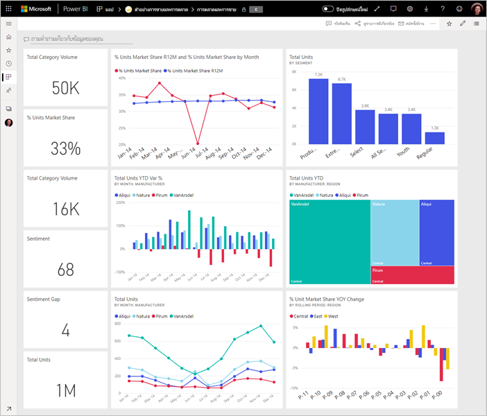

# เคล็ดลับสำหรับการออกแบบแดชบอร์ด Power BI ที่ยอดเยี่ยมTips for designing a great Power BI dashboard
หลังจากที่คุณสร้างแดชบอร์ด และเพิ่มไทล์บางตัวเข้าไป ให้คิดเกี่ยวกับวิธีการทำให้แดชบอร์ดของคุณไม่เพียงแค่สวยงามเท่านั้น แต่ยังทำงานNow that you've created a dashboard and added some tiles, think about how to make your dashboard not just pretty, but also functional. โดยทั่วไปหมายถึงการทำข้อมูลที่สำคัญมากสุดให้ออกมาโดดเด่น และทำให้สะอาด และเป็นระเบียบIn general, it means making the most important information stand out and making it clean and uncluttered.

> [!TIP]
> ชอบแดชบอร์ดนี้ไหม?Like this dashboard? คุณสามารถดาวน์โหลดแดชบอร์ดและรายงานที่เกี่ยวข้องจาก AppSourceYou can download it and related reports from AppSource. ไปที่ **รับข้อมูล** > **บริการ**Go to **Get data** > **Services**. ค้นหา **ตัวอย่างของ Microsoft - การขายและการตลาด**  > **รับทันที**Search for **Microsoft Sample - Sales & Marketing** > **Get it now**.

ต่อไปนี้คือเคล็ดลับบางอย่างสำหรับแดชบอร์ดHere are a few tips for dashboards.

## วิดีโอแนวทางปฏิบัติที่ดีที่สุดสำหรับการออกแบบแดชบอร์ดDashboard design best practices video

รับชมวิดีโอนี้เรื่อง [แนวทางปฏิบัติที่ดีที่สุดสำหรับการออกแบบแดชบอร์ดใน Power BI](https://www.youtube.com/watch?v=-tdkUYrzrio) สำหรับเคล็ดลับการออกแบบจาก Marco Russo ของ SQLBI.comWatch this video, [Dashboard design best practices in Power BI](https://www.youtube.com/watch?v=-tdkUYrzrio), for design tips from Marco Russo of SQLBI.com.

## ให้พิจารณาผู้ชมรายงานConsider your audience
อะไรคือตัววัดหลักที่จะช่วยให้พวกเขาทำการตัดสินใจWhat are the key metrics that will help them make decisions? วิธการใช้แดชบอร์ดHow will the dashboard be used? สิ่งที่ได้เรียนรู้หรือสมมติฐานทางวัฒนธรรมบริโภคนิยมอะไรส่งผลต่อตัวเลือกการออกแบบWhat learned or cultural assumptions may affect design choices? ข้อมูลใดที่ผู้ชมของคุณต้องทำให้สำเร็จWhat information does your audience need to be successful?

ให้จำไว้ว่า แดชบอร์ดคือภาพรวมหรือสถานที่เดียวที่สามารถตรวจสอบสถานะปัจจุบันของธุรกิจได้Keep in mind that the dashboard is an overview, a single place to monitor the current state of the data. แดชบอร์ดจะยึดตามรายงานและชุดข้อมูลพื้นฐาน และรายการเหล่านั้นมักจะมีรายละเอียดมากมายThe dashboard is based on underlying reports and datasets, and those items often contain loads of details. ผู้อ่านของคุณสามารถเจาะลึกเข้ารายงานจากแดชบอร์ดของคุณได้Your readers can drill into the reports from your dashboard. ดังนั้นอย่าใส่รายละเอียดในแดชบอร์ด เว้นแต่ว่านั่นคือสิ่งที่ผู้อ่านของคุณจำเป็นต้องตรวจสอบSo, don't put the detail on the dashboard unless that's what your readers need to monitor.

แดชบอร์จะถูกแสดงอย่างไรWhere is the dashboard going to be displayed? ถ้าแดชบอร์ดอยู่บนจอภาพขนาดใหญ่ คุณสามารถใส่เนื้อหาเพิ่มเติมได้If it's on a large monitor, you can put more content on it. แต่ถ้าผู้อ่านดูบนแท็บเล็ตของพวกเขา แดชบอร์ดที่มีไทล์น้อยกว่าจะช่วยให้อ่านได้ง่ายขึ้นBut if readers view it on their tablets, a dashboard with fewer tiles is more readable.

## บอกเล่าเรื่องราวบนหน้าจอเดียวTell a story on one screen
เนื่องจากแดชบอร์ดที่มีไว้เพื่อแสดงข้อมูลที่สำคัญอย่างรวดเร็ว หากมีไทล์ทั้งหมดบนหนึ่งหน้าจอจะดีที่สุดBecause dashboards are meant to show important information at a glance, having all the tiles on one screen is best. คุณสามารถหลีกเลี่ยงแถบเลื่อนบนแดชบอร์ดของคุณได้ไหมCan you avoid scroll bars on your dashboard?

มีแดชบอร์ดเกินไปอีกหรือไม่Is the dashboard too cluttered?  ลบข้อมูลที่จำเป็นทั้งหมด แต่อ่านและตีความได้อย่างง่ายดายRemove all but essential information that's easily read and interpreted.

## ทำให้ใช้โหมดเต็มหน้าจอMake use of full screen mode
เมื่อนำเสนอแดชบอร์ด ให้แสดงในโหมด[เต็มหน้าจอ](../consumer/end-user-focus.md) โดยไม่มีสิ่งอื่นรบกวนWhen presenting a dashboard, display it in [full screen mode](../consumer/end-user-focus.md), without distractions.

## เน้นข้อมูลที่สำคัญมากสุดAccent the most important information
ถ้าข้อความและการแสดงภาพบนแดชบอร์ดของคุณจะมีขนาดเท่ากันทั้งหมด ผู้อ่านของคุณจะหาสิ่งสำคัญมากที่สุดยากIf the text and visualizations on your dashboard are all the same size, your readers will have a hard time focusing on what's most important. ตัวอย่างเช่น แสดงภาพการ์ดเป็นวิธีดีในการแสดงหมายเลขสำคัญให้เป็นที่รู้จักFor example, card visualizations are a good way to display an important number prominently:  

แต่เช็คแน่ใจว่าคุณการให้บริบทBut be sure to provide context.  

อ่านเกี่ยวกับ[การสร้างไทล์ที่มีเพียงตัวเลขตัวเดียว](../visuals/power-bi-visualization-card.md)Read about [creating a tile with just a number](../visuals/power-bi-visualization-card.md).

## วางข้อมูลที่สำคัญมากสุดPlace the most important information
คนส่วนใหญ่อ่านจากบนลงล่างMost people read from top to bottom. ดังนั้นให้ใส่รายละเอียดที่มุมบนซ้ายและแสดงรายละเอียดเพิ่มเติมเมื่อคุณย้ายในทิศทางที่ผู้ชมใช้อ่าน (จากซ้ายไปขวา บนลงล่าง)So, put the highest level of data at the top left corner, and show more detail as you move in the direction the audience uses for reading (left-to-right, top-to-bottom).

## ใช้การแสดงข้อมูลด้วยภาพที่เหมาะสมสำหรับข้อมูลUse the right visualization for the data
หลีกเลี่ยงการแสดงภาพต่างๆ เพื่อให้มีความหลากหลายAvoid visualization variety for the sake of variety.  การแสดงภาพควรลงสีรูปภาพ และให้ "อ่าน" และแปลได้ง่ายVisualizations should paint a picture and be easy to "read" and interpret.  สำหรับข้อมูลและภาพบางอย่าง ภาพกราฟิกง่าย ๆ ก็เพียงพอFor some data and visualizations, a simple graphic visualization is enough. แต่อาจเรียกข้อมูลอื่นๆ เพื่อแสดงภาพที่ซับซ้อนมากขึ้น โปรดทำให้แน่ใจว่าได้ใช้ชื่อและป้ายชื่อและการกำหนดเองแบบอื่นๆ เพื่อช่วยผู้อ่านBut other data may call for a more-complex visualization - be sure to make use of titles and labels and other customization to help the reader.  

* ระวังการใช้ภาพวิชวลที่ดูสวยงามแต่ยากต่อการอ่าน เช่น แผนภูมิสามมิติBe careful using visuals that look pretty but are hard to read, such as 3-D charts. 
* ซึ่งอาจเป็นเรื่องน่าผิดหวังที่ต้องทราบว่าแผนภูมิวงกลม แผนภูมิโดนัท แผนภูมิหน้าปัด และชนิดแผนภูมิวงกลมอื่นๆ ไม่ใช่แนวปฏิบัติที่ดีที่สุดสำหรับการแสดงภาพข้อมูลIt may be a disappointment to learn that pie charts, donut charts, gauges, and other circular chart types aren't a data visualization best practice. แผนภูมิวงกลมนั้นดีที่สุดถ้าพวกมีน้อยกว่าแปดประเภทPie charts are best if they have fewer than eight categories. เนื่องจากมนุษย์ไม่สามารถเปรียบเทียบค่าที่อยู่เคียงข้างกัน ดังนั้นจึงยากที่จะเปรียบเทียบค่าในแผนภูมิวงกลมมากกว่าในแผนภูมิแท่งและคอลัมน์Because humans can't compare values side by side, it’s harder to compare values in a pie chart than in bar and column charts. แผนภูมิวงกลมนั้นเหมาะสำหรับการดูความสัมพันธ์จากส่วนย่อยไปส่วนทั้งหมด มากกว่าการเปรียบเทียบส่วนได้Pie charts can be good for viewing part-to-whole relationships rather than for comparing the parts. แผนภูมหน้าปัดนั้นยอดเยี่ยมสำหรับการแสดงสถานะปัจจุบันในบริบทของเป้าหมายAnd gauge charts are great for displaying the current status in the context of a goal.
* ทำให้มาตราส่วนแผนภูมิบนแกน การเรียงลำดับมิติแผนภูมิ และสีที่ใช้สำหรับค่ามิติภายในแผนภูมิสอดคล้องกันBe consistent with chart scales on axes, chart dimension ordering, and also the colors used for dimension values within charts.
* ให้ตรวจสอบการเข้ารหัสข้อมูลเชิงปริมาณอย่างดีBe sure to encode quantitative data nicely. ไม่เกินสามหรือสี่ตัวเลขเมื่อแสดงตัวเลขDon’t exceed three or four numerals when displaying numbers. แสดงหน่วยวัดหนึ่งหรือสองตัวเลขที่ด้านซ้ายจากจุดทศนิยมและมาตราส่วนสำหรับหลักพันหรือล้านนั่นคือ 3.4 ล้านไม่ใช่ 3,400,000Display measures to one or two numerals left of the decimal point and scale for thousands or millions, that is, 3.4 million not 3,400,000.
* แย่าผสมระดับของความแม่นยำกับเวลาDon’t mix levels of precision and time. ตรวจสอบให้แน่ใจว่ากรอบเวลานั้นความเข้าใจดีแล้วMake sure that time frames are well understood. อย่ามีแผนภูมิหนึ่งอันที่มีเดือนล่าสุดถัดจากแผนภูมิที่ถูกกรองจากเดือนเฉพาะเดิอนหนึ่งของปีDon’t have one chart that has last month next to filtered charts from a specific month of the year.
* อย่าผสมผสานหน่วยวัดขนาดใหญ่และขนาดเล็กในมาตราส่วนเดียวกัน เช่น บนแผนภูมิเส้นหรือแผนภูมิแท่งDon’t mix large and small measures on the same scale, such as on a line or bar chart. ตัวอย่างเช่น หน่วยวัดหนึ่งอาจเป็นหลักล้านและอีกหน่วยวัดหนึ่งเป็นหลักพันFor example, one measure can be in the millions and the other measure in the thousands. ด้วยมาตราส่วนขนาดใหญ่ ดังนั้นจึงเป็นการยากที่จะเห็นความแตกต่างของหน่วยวัดที่เป็นหลักพันWith such a large scale, it would be difficult to see the differences of the measure that's in the thousands. ถ้าคุณต้องการผสม ให้เลือกภาพที่อนุญาตให้ใช้แกนที่สองIf you need to mix, choose a visualization that allows the use of a second axis.
* อย่ากระจายป้ายชื่อข้อมูลที่ไม่จำเป็นในแผนภูมิของคุณDon’t clutter your charts with data labels that aren't needed. โดยปกติแล้ว ผู้อ่านสามารถเข้าใจค่าในแผนภูมิแท่งได้โดยไม่ต้องแสดงจำนวนที่แท้จริงThe values in bar charts are usually understood without displaying the actual number.
* ให้ความสนใจกับวิธีการชำระเงิน[แผนภูมิจะถูกเรียงลำดับ](../consumer/end-user-change-sort.md)Pay attention to how [charts are sorted](../consumer/end-user-change-sort.md). ถ้าคุณต้องการดึงดูดความสนใจไปยังหมายเลขสูงสุดหรือต่ำสุด ให้เรียงลำดับตามหน่วยวัดIf you want to draw attention to the highest or lowest number, sort by the measure. ถ้าคุณต้องการให้บุคคลสามารถค้นหาหมวดหมู่เฉพาะที่ต้องการท่ามกลางหมวดหมู่อื่นมากมายได้อย่างรวดเร็ว ให้เรียงลำดับตามแกนIf you want people to quickly find a particular category within many other categories, sort by the axis.  

สำหรับคำแนะนำเพิ่มเติมของการแสดงภาพแบบเฉพาะ ให้ดู[ชนิดการแสดงภาพใน Power BI](../visuals/power-bi-visualization-types-for-reports-and-q-and-a.md)For more visualization-specific guidance, see [Visualization types in Power BI](../visuals/power-bi-visualization-types-for-reports-and-q-and-a.md).  

## เรียนรู้เพิ่มเติมเกี่ยวกับการออกแบบแดชบอร์ดLearn more about dashboard design
เพื่อทำความเข้าใจศิลปะของการออกแบบแดชบอร์ดดีเยี่ยม ให้พิจารณาการเรียนรู้หลักการ Gestalt พื้นฐานของการได้รับรู้ถึงภาพและวิธีการติดต่อสื่อสารข้อมูลที่สามารถดำเนินการได้ในบริบทอย่างชัดเจนTo master the art of excellent dashboard design, consider learning basic Gestalt Principles of visual perception and how to clearly communicate actionable information in context. โชคดี ที่มีของแหล่งข้อมูลมากมายให้คุณสามารถค้นหาได้ รวมถึงข้อมูลภายในบล็อกของเราด้วยLuckily, there's a plethora of resources already widely available and sprinkled within our blogs. หนังสือที่เราชื่นชอบรวมถึงA few of our favorite books include:

* *Information Dashboard Design* โดย Stephen Few*Information Dashboard Design* by Stephen Few  
* *Show Me the Numbers* โดย Stephen Few*Show Me the Numbers* by Stephen Few  
* *Now You See It* โดย Stephen Few*Now You See It* by Stephen Few  
* *Envisioning Information* โดย Edward Tufte*Envisioning Information* by Edward Tufte  
* *Advanced Presentations* Design โดย Andrew Abela*Advanced Presentations* by Design by Andrew Abela   

## ขั้นตอนถัดไปNext steps
[สร้างแดชบอร์ดจากรายงานCreate a dashboard from a report](service-dashboard-create.md)  
[แนวคิดพื้นฐานสำหรับนักออกแบบในบริการของ Power BIBasic concepts for designers in the Power BI service](../fundamentals/service-basic-concepts.md)  
มีคำถามเพิ่มเติมหรือไม่More questions? [ลองไปที่ชุมชน Power BITry the Power BI Community](https://community.powerbi.com/)
