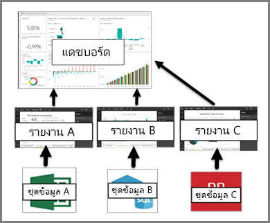

# การแนะนำไปยังแดชบอร์ดสำหรับนักออกแบบ Power BIIntroduction to dashboards for Power BI designers

*แดชบอร์ด* Power BI เป็นแบบหน้าเดียวหรือที่เรียกว่าพื้นที่รายงาน ซึ่งบอกเล่าเรื่องราวผ่านการสร้างภาพข้อมูลA Power BI *dashboard* is a single page, often called a canvas, that tells a story through visualizations. เนื่องจากถูกจำกัดอยู่เพียงหนึ่งหน้า แดชบอร์ดที่ออกแบบมาอย่างดีจะประกอบด้วยส่วนสำคัญที่สุดของเรื่องราวเท่านั้นBecause it's limited to one page, a well-designed dashboard contains only the highlights of that story. ผู้อ่านสามารถดูรายงานที่เกี่ยวข้องสำหรับรายละเอียดReaders can view related reports for the details.

แดชบอร์ดเป็นคุณลักษณะหนึ่งของบริการ Power BI เท่านั้นDashboards are a feature of the Power BI service only. แต่คุณไม่สามารถใช้แดชบอร์ดใน Power BI Desktop ได้They're not available in Power BI Desktop. ถึงแม้ว่าคุณไม่สามารถสร้างแดชบอร์ดบนอุปกรณ์มือถือ แต่คุณสามารถ [ดูและแชร์](../consumer/mobile/mobile-apps-view-dashboard.md) ได้Although you can't create dashboards on mobile devices, you can [view and share](../consumer/mobile/mobile-apps-view-dashboard.md) them there.

## ข้อมูลพื้นฐานเกี่ยวกับแดชบอร์ดDashboard basics 

การแสดงภาพที่คุณเห็นบนแดชบอร์ดเรียกว่า *ไทล์*The visualizations you see on the dashboard are called *tiles*. คุณ *ปักหมุด* ไทล์ไปยังแดชบอร์ดจากรายงานYou *pin* tiles to a dashboard from reports. หากคุณไม่คุ้นเคยกับ Power BI คุณสามารถเรียนรู้ข้อมูลพื้นฐานได้โดยการอ่าน[แนวคิดพื้นฐานสำหรับนักออกแบบในบริการ Power BI](../fundamentals/service-basic-concepts.md)If you're new to Power BI, you can get a good foundation by reading [Basic concepts for designers in the Power BI service](../fundamentals/service-basic-concepts.md).

การแสดงข้อมูลด้วยภาพบนแดชบอร์ดมาจากรายงาน และแต่ละรายงานจะยึดตามชุดข้อมูลหนึ่งชุดThe visualizations on a dashboard originate from reports and each report is based on a dataset. วิธีหนึ่งในการนึกภาพแดชบอร์ดคือทางเข้าไปยังรายงานและชุดข้อมูลพื้นฐานOne way to think of a dashboard is as an entryway to the underlying reports and datasets. การเลือกการแสดงภาพนำคุณไปยังรายงาน (และชุดข้อมูล) ที่อ้างอิงSelecting a visualization takes you to the report (and dataset) that it's based on.

## ข้อดีของแดชบอร์ดAdvantages of dashboards
แดชบอร์ดเป็นวิธีที่ยอดเยี่ยมในการตรวจดูธุรกิจของคุณและดูเมตริกซ์ที่สำคัญที่สุดของคุณอย่างรวดเร็วDashboards are a wonderful way to monitor your business and see all of your most important metrics at a glance. การแสดงข้อมูลด้วยภาพบนแดชบอร์ดอาจมาจากหนึ่งหรือหลายชุดข้อมูลพื้นฐาน และจากรายงานหนึ่งหรือหลายรายงานพื้นฐานThe visualizations on a dashboard can come from one underlying dataset or many, and from one underlying report or many. แดชบอร์ดรวมข้อมูลภายในองค์กรและข้อมูลบนระบบคลาวด์ ให้มุมมองแบบรวมโดยไม่คำนึงถึงตำแหน่งที่ข้อมูลอยู่A dashboard combines on-premises and cloud data, providing a consolidated view regardless of where the data lives.

แดชบอร์ดไม่ได้เป็นเพียงรูปภาพที่สวยงามเท่านั้นA dashboard isn't just a pretty picture. แดชบอร์ดยังมีความสามารถในการโต้ตอบได้สูงและมีการอัปเดตไทล์เมื่อมีการเปลี่ยนแปลงข้อมูลพื้นฐานIt's highly interactive and the tiles update as the underlying data changes.

## ใครบ้างที่สามารถสร้างแดชบอร์ดได้?Who can create a dashboard?
ความสามารถในการสร้างแดชบอร์ดถือเป็นคุณลักษณะสำหรับ *ผู้สร้าง* และจำเป็นต้องมีสิทธิ์ในการแก้ไขในรายงานThe ability to create a dashboard is considered a *creator* feature and requires edit permissions on the report. สิทธิ์ในการแก้ไขจะพร้อมใช้งานสำหรับผู้สร้างรายงานและผู้ร่วมงานที่ผู้สร้างให้สิทธิ์ในการเข้าถึงEdit permissions are available to report creators and to those colleagues the creator grants access. ตัวอย่างเช่น ถ้าเดวิดต้องสร้างรายงานในพื้นที่ทำงาน ABC และเพิ่มคุณเข้าไปเป็นสมาชิกของพื้นที่ทำงานนั้น ทั้งเดวิดและคุณจะมีสิทธิ์ในการแก้ไขรายงานนั้นFor example, if David creates a report in workspace ABC and adds you as a member of that workspace, you and David both have edit permissions. ในทางกลับกัน ถ้ามีการแชร์รายงานกับคุณโดยตรงหรือเป็นส่วนหนึ่งของ [แอปฯ Power BI](../collaborate-share/service-create-distribute-apps.md) คุณกำลัง *ใช้* รายงานOn the other hand, if a report has been shared with you directly or as part of a [Power BI app](../collaborate-share/service-create-distribute-apps.md), you're *consuming* the report. คุณอาจไม่สามารถปักหมุดไทล์ไปยังแดชบอร์ดได้You may not be able to pin tiles to a dashboard. 

> [!IMPORTANT]
> คุณจำเป็นต้องมีใบอนุญาต [Power BI Pro](../fundamentals/service-features-license-type.md) เพื่อสร้างแดชบอร์ดในพื้นที่ทำงานYou need a [Power BI Pro](../fundamentals/service-features-license-type.md) license to create dashboards in workspaces. คุณสามารถสร้างแดชบอร์ดในพื้นที่ทำงานของฉันโดยไม่ต้องมีใบอนุญาต Power BI ProYou can create dashboards in your own My Workspace without a Power BI Pro license.

## แดชบอร์ดเทียบกับรายงานDashboards versus reports
[รายงาน](../consumer/end-user-reports.md)และแดชบอร์ดดูเหมือนว่าคล้ายกันเนื่องจากพื้นที่รายงานของทั้งสองเต็มไปด้วยการสร้างภาพข้อมูล[Reports](../consumer/end-user-reports.md) and dashboards seem similar because they're both canvases filled with visualizations. แต่มีความแตกต่างที่สำคัญเท่าที่คุณสามารถดูได้ในตารางต่อไปนี้But there are major differences, as you can see in the following table.

| **ขีดความสามารถ****Capability** | **แดชบอร์ด****Dashboards** | **รายงาน****Reports** |
| --- | --- | --- |
| หน้าPages |หนึ่งหน้าOne page |อย่างน้อยหนึ่งหน้าOne or more pages |
| แหล่งข้อมูลData sources |อย่างน้อยหนึ่งรายงานและอย่างน้อยหนึ่งชุดข้อมูลต่อแดชบอร์ดOne or more reports and one or more datasets per dashboard |ชุดข้อมูลเดียวต่อรายงานA single dataset per report |
| พร้อมใช้งานใน Power BI DesktopAvailable in Power BI Desktop |ไม่ใช่No | ใช่Yes. สามารถสร้างและดูรายงานใน Power BI Desktop ได้Can build and view reports in Power BI Desktop |
| สมัครใช้งานSubscribe |ใช่Yes. สามารถสมัครใช้งานแดชบอร์ดได้Can subscribe to a dashboard |ใช่Yes. สามารถสมัครใช้งานหน้ารายงานCan subscribe to a report page |
| การกรองFiltering |หมายเลขNo. ไม่สามารถกรองหรือแบ่งส่วนแดชบอร์ดได้Can't filter or slice a dashboard. *สามารถ* กรอง[ไทล์แดชบอร์ดในโหมดโฟกัส](../consumer/end-user-focus.md#working-in-focus-mode)ได้ แต่ไม่สามารถบันทึกตัวกรองได้*Can* filter a [dashboard tile in focus mode](../consumer/end-user-focus.md#working-in-focus-mode), but can't save the filter. |ใช่Yes. มีหลายวิธีในการกรอง ทำไฮไลท์ และแบ่งส่วนMany different ways to filter, highlight, and slice |
| รายการเด่นFeatured |ใช่Yes. สามารถตั้งค่าแดชบอร์ดหนึ่งเป็นแดชบอร์ด *ที่แนะนำของคุณ* ได้Can set one dashboard as your *featured* dashboard |ไม่ใช่No |
| รายการโปรดFavorite | ใช่Yes. สามารถทำเครื่องหมายหลายแดชบอร์ดเป็น *รายการโปรด* ได้Can set multiple dashboards as *favorites* | ใช่Yes. สามารถตั้งค่าหลายรายงานเป็น *รายการโปรด* ได้Can set multiple reports as *favorites* |
| ตั้งค่าการแจ้งเตือนSet alerts |ใช่Yes. พร้อมใช้งานสำหรับแดชบอร์ดไทล์ในบางสถานการณ์Available for dashboard tiles in certain circumstances |ไม่ใช่No |
| แบบสอบถามภาษาธรรมชาติ (Q&A)Natural language queries (Q&A) |ใช่Yes | ใช่ ให้คุณมีสิทธิ์แก้ไขรายงานและชุดข้อมูลพื้นฐานของรายงานนั้นYes, provided you have edit permissions for the report and underlying dataset |
| สามารถดูตารางชุดข้อมูลพื้นฐานและพื้นที่ข้อมูลได้Can see underlying dataset tables and fields |หมายเลขNo. สามารถส่งออกข้อมูลได้ แต่ไม่สามารถมองเห็นตารางและเขตข้อมูลในแดชบอร์ดเองได้Can export data but can't see tables and fields in the dashboard itself |ใช่Yes |

## ขั้นตอนถัดไปNext steps
* สร้างความคุ้นเคยกับแดชบอร์ดโดยเข้าดูหนึ่งใน[ตัวอย่าง](sample-tutorial-connect-to-the-samples.md)ของเราGet comfortable with dashboards by taking a tour of one of our [sample dashboards](sample-tutorial-connect-to-the-samples.md).
* เรียนรู้เกี่ยวกับ[ไทล์แดชบอร์ด](service-dashboard-tiles.md)Learn about [dashboard tiles](service-dashboard-tiles.md).
* ต้องการติดตามไทล์แดชบอร์ดแต่ละรายการและได้รับอีเมลเมื่อถึงขีดจำกัดหนึ่งหรือไม่?Want to track an individual dashboard tile and receive an email when it reaches a certain threshold? [สร้างการแจ้งเตือนบนไทล์](service-set-data-alerts.md)[Create an alert on a tile](service-set-data-alerts.md).
* เรียนรู้วิธีใช้ [การถามตอบ Power BI](power-bi-tutorial-q-and-a.md) เพื่อถามคำถามเกี่ยวกับข้อมูลของคุณและรับคำตอบในรูปแบบการแสดงภาพLearn how to use [Power BI Q&A](power-bi-tutorial-q-and-a.md) to ask a question about your data and get the answer in the form of a visualization.
