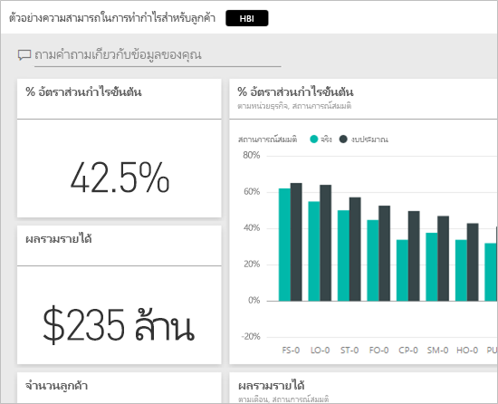
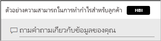
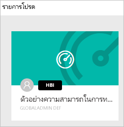
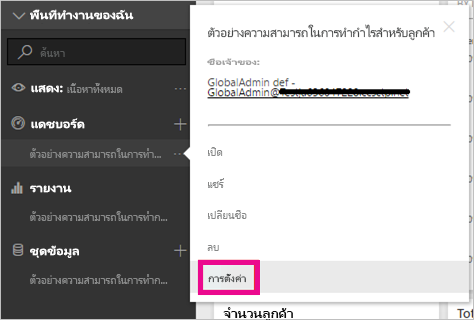
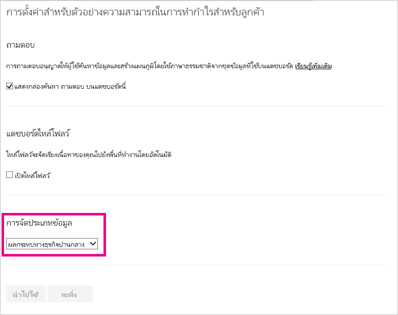
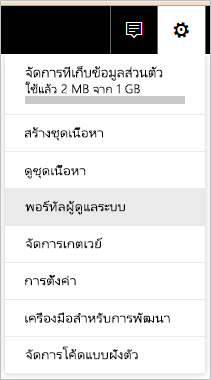
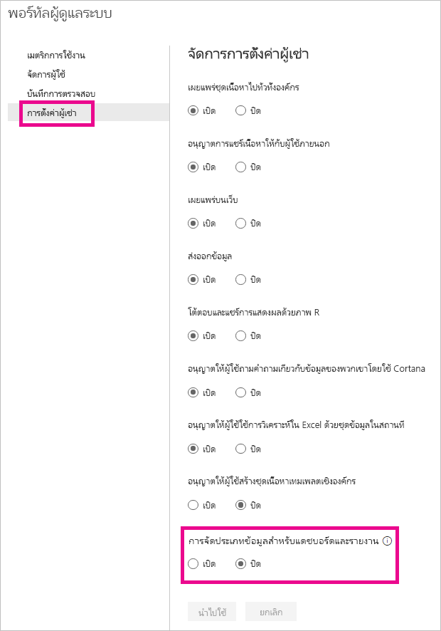
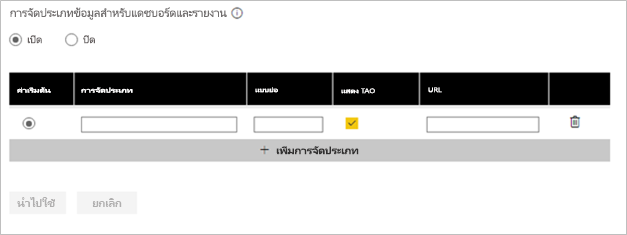
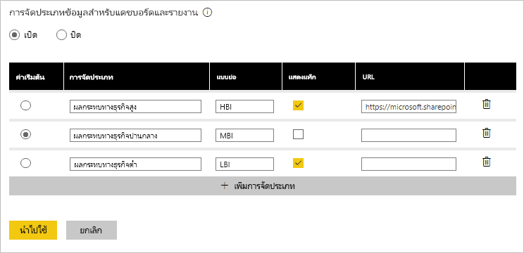

# การจัดประเภทข้อมูลของแดชบอร์ดDashboard data classification
แดชบอร์ดทุกตัวจะแตกต่างกันไป และขึ้นอยู่กับแหล่งข้อมูลที่เชื่อมต่อ คุณอาจจะเห็นว่าคุณและเพื่อนร่วมงานของคุณแชร์ความต้องการมาตรการที่แตกต่างกัน โดยขึ้นอยู่กับระดับความลับของข้อมูลEvery dashboard is different, and depending on the data source you are connecting to, you will likely find that you and the colleagues you share with will need to take different precautions depending on the sensitivity of the data. แดชบอร์ดบางตัวไม่ควรจะหรือพิมพ์หรือใช้ร่วมกันกับที่อยู่ภายนอกบริษัทของคุณ ในขณะที่ตัวอื่นๆสามารถแชร์ได้อย่างอิสระSome dashboards should never be shared with those outside your company or printed out, while others can be shared freely. โดยใช้การจัดประเภทข้อมูลแดชบอร์ด คุณจะสามารถสร้างความตระหนักให้กับบุคคลที่กำลังดูแดชบอร์ดของคุณ เกี่ยวกับระดับการรักษาความปลอดภัยใดควรใช้By using dashboard data classification, you will be able to raise awareness with those viewing your dashboards about what level of security should be used. คุณสามารถแท็กแดชบอร์ดของคุณ ด้วยการจัดประเภทที่กำหนดโดยแผนก IT ของบริษัทของคุณ ดังนั้นทุกคนที่ดูเนื้อหาจะมีการทำความเข้าใจเกี่ยวกับระดับความลับของข้อมูลในระดับเดียวกันได้You can tag your dashboards with classifications defined by your company’s IT department, so everyone viewing the content will have the same level of understanding around the sensitivity of the data.

## แท็กการจัดประเภทข้อมูลData classification tags
แท็กการจัดประเภทข้อมูลแสดงอยู่ถัดจากชื่อแดชบอร์ด เพื่อแจ้งให้ทุกคนที่ดูอยู่ทราบระดับความปลอดภัยที่ควรใช้กับแดชบอร์ดและข้อมูลที่มีData classification tags show up next to the dashboard name, letting anyone viewing it know the level of security that should be applied to the dashboard and the data it contains.

ซึ่งจะแสดงถัดจากแดชบอร์ดไทล์ในรายการโปรดของคุณด้วยIt will also show up next to the dashboard tile in your Favorites list.

เมื่อคุณวางเคอร์เซอร์เหนือแท็ก คุณจะเห็นชื่อเต็มของการจัดประเภทWhen you hover over the tag, you will see the full name of the classification.

ผู้ดูแลระบบยังสามารถตั้งค่าเป็น URL สำหรับแท็กที่ให้ข้อมูลเพิ่มเติมAdmins can also set an URL for a tag to provide additional information.

> [!NOTE]
> โดยขึ้นอยู่กับการตั้งค่าการจัดประเภท ที่ตั้งโดยผู้ดูแลระบบของคุณ การจัดประเภทบางชนิดอาจไม่แสดงเป็นแท็กบนแดชบอร์ดDepending the classification settings set by your admin, some classification types may not show as a tag on the dashboard. ถ้าคุณเป็นเจ้าของแดชบอร์ด คุณสามารถตรวจสอบชนิดการจัดประเภทแดชบอร์ดของคุณภายใต้การตั้งค่าแดชบอร์ดได้เสมอIf you are a dashboard owner, you can always check your dashboard classification type under the dashboard settings.
> 
> 

## ตั้งค่าการจัดประเภทของแดชบอร์ดSetting a dashboard’s classification
ถ้าการจัดประเภทข้อมูลถูกเปิดใช้งานสำหรับบริษัทของคุณ แดชบอร์ดทั้งหมดจะเริ่มด้วยการจัดประเภทชนิดเริ่มต้น แต่ในฐานะเจ้าของแดชบอร์ด คุณสามารถเปลี่ยนการจัดประเภทเพื่อให้ตรงกับระดับความปลอดภัยของแดชบอร์ดได้If data classification is turned on for your company, all dashboards start out with a default classification type, but as a dashboard owner, you can change the classification to match your dashboards security level.

เมื่อต้องเปลี่ยนชนิดการจัดประเภท ให้ทำสิ่งต่อไปนี้:To change the classification type, do the following:

1. ไปที่การตั้งค่าแดชบอร์ดโดยการเลือก **จุดไข่ปลา** ถัดจากชื่อแดชบอร์ดและเลือก **ตั้งค่า**Go to the dashboard settings by selecting the **ellipsis** next to the dashboard name and select **Settings**.
   
    
2. ภายใต้การตั้งค่าแดชบอร์ด คุณจะสามารถดูการจัดประเภทปัจจุบันของแดชบอร์ดของคุณ และใชดร๊อปดาวน์เพื่อเปลี่ยนชนิดการจัดประเภทUnder Dashboard settings, you will be able to see the current classification for your dashboard and use the drop down to change the classification type.
   
    
3. ให้เลือก **นำไปใช้** เมื่อทำเสร็จแล้วSelect **Apply** when finished.

หลังจากทีใช้การเปลี่ยนแปลง ทุกคนที่คุณแชร์ จะเห็นการปรับปรุงในครั้งถัดไปที่พวกเขารีโหลดแดชบอร์ดAfter you apply the change, anyone you shared with will see the update the next time they reload the dashboard.

## ทำงานกับแท็กการจัดประเภทข้อมูลในฐานะผู้ดูแลระบบWorking with data classification tags as an admin
จัดประเภทข้อมูลถูกตั้งค่าโดยผู้ดูแลระบบส่วนกลางสำหรับองค์กรของคุณData classification is set up by the global admin for your organization. เพื่อเปิดการจัดประเภทข้อมูล ให้ทำสิ่งต่อไปนี้To turn data classification on, do the following:

1. ให้เลือกเฟืองการตั้งค่า และเลือก **ผู้ดพอร์ทัล**Select the Settings gear and select **Admin Portal**.
   
    
2. เปลี่ยน **การจัดประเภทข้อมูลของแดชบอร์ดและรายงาน** เป็น *เปิด* ภายในแท็บ **การตั้งค่าผู้เช่า**Switch **Data classification for dashboards and reports** to *on* within the **Tenant settings** tab.
   
    

เมื่อเปิดใช้งาน คุณจะเห็นแบบฟอร์มเพื่อสร้างการแบ่งประเภทต่างๆ ในองค์กรของคุณOnce turned on, you will be presented with a form to create the various classifications in your organization.

แต่ละประเภทมี **ชื่อ** และ **ตัวย่อ** ซึ่งจะปรากฏในแดชบอร์ดEach classification has a **name** and a **shorthand** which will appear on the dashboard. สำหรับการจัดประเภทแต่ละตัว คุณสามารถตัดสินใจว่าจะให้แท็กอ้างอิงแบบย่อปรากฏในแดชบอร์ดหรือไม่ โดยการเลือก **แสดงแท็ก**For each classification, you can decide if the shorthand tag will appear on the dashboard or not by selecting **Show tag**. ถ้าคุณตัดสินใจไม่แสดงชนิดการจัดประเภทบนแดชบอร์ด เจ้าของจะยังคงสามารถดูชนิดได้โดยการตรวจสอบการตั้งค่าแดชบอร์ดIf you decide not to show the classification type on the dashboard, the owner will still be able to see the type by checking the dashboard settings. นอกจากนี้ คุณสามารถเลือกที่จะเพิ่มเป็น **URL** ที่มีข้อมูลเพิ่มเติมเกี่ยวกับแนวทางการจัดประเภทและความต้องการใช้งานขององค์กรของคุณได้Additionally, you can optionally add a **URL** that contains more information about your organization’s classification guidelines and usage requirements.  

สิ่งสุดท้ายที่คุณจำเป็นต้องตัดสินใจคือชนิดการจัดประเภทที่จะเป็นค่าเริ่มต้นThe last thing you need to decide is which classification type will be the default.  

เมื่อคุณกรอกแบบฟอร์มพร้อมกับชนิดของการจัดประเภท ให้เลือก **นำไปใช้** เพื่อบันทึกการเปลี่ยนแปลงOnce you fill in the form with your classification types, select **Apply** to save the changes.

ในตอนนี้ แดชบอร์ดทั้งหมดจะได้รับการกำหนดค่าการจัดประเภทเริ่มต้นAt this point, all dashboards will be assigned the default classification. เจ้าของแดชบอร์ดสามารถอัปเดตชนิดการจัดประเภทให้เหมาะสมกับเนื้อหาของตนได้ในขณะนี้Dashboard owners can now update the classification type to the one appropriate for their content. คุณสามารถกลับมาที่นี่ในอนาคตเมื่อต้องเพิ่มหรือลบชนิดการจัดประเภท หรือเปลี่ยนค่าเริ่มต้นYou can return here in the future to add or remove classification types or change the default.  

> [!NOTE]
> มีบางสิ่งที่สำคัญที่ต้องทราบเมื่อคุณกลับมาทำการเปลี่ยนแปลงThere are a few important things to remember when you come back to make changes:
> 
> * ถ้าคุณปิดใช้งานการจัดประเภทข้อมูล จะไม่จดจำแท็กIf you turn data classification off, none of the tags are remembered. คุณจะต้องเริ่มต้นใหม่ทั้งหมด ถ้าคุณตัดสินใจกลับไปเป็นเหมือนเก่าภายหลังYou will need to start over if you decide to turn it back on later.  
> * ถ้าคุณลบชนิดการจัดประเภท แดชบอร์ดใดๆที่ถูกกำหนด ชนิดการจัดประเภทที่ถูกลบออก จะถูกกำหนดให้กลับไปเป็นค่าเริ่มต้นจนกว่าเจ้าของจะตั้งค่าอีกครั้งIf you remove a classification type, any dashboards assigned the removed classification type will be assigned back to the default until the owner goes and sets it again.  
> * ถ้าคุณเปลี่ยนค่าเริ่มต้น แดชบอร์ดทั้งหมดที่ไม่ได้กำหนดชนิดการจัดประเภทโดยเจ้าของ จะเปลี่ยนเป็นค่าเริ่มต้นตัวใหม่If you change the default, all dashboards that weren’t already assigned a classification type by the owner will change to the new default.
> 
> 

