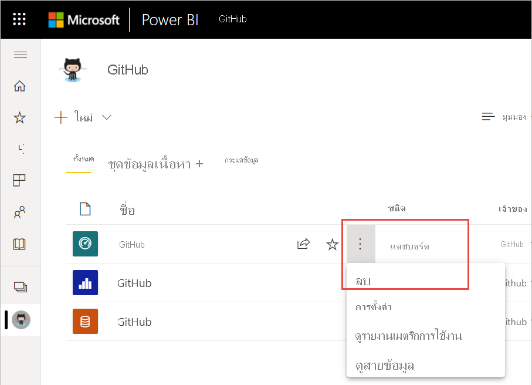
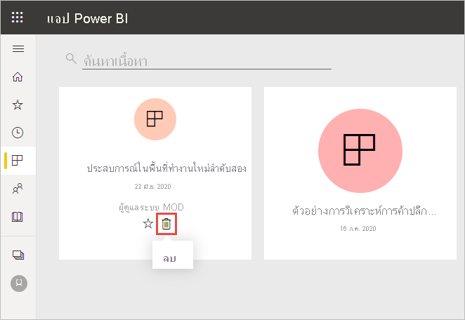
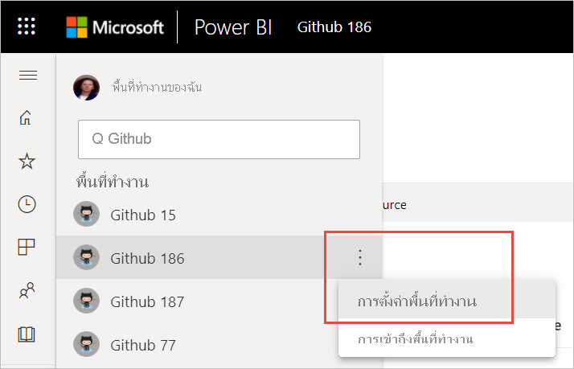
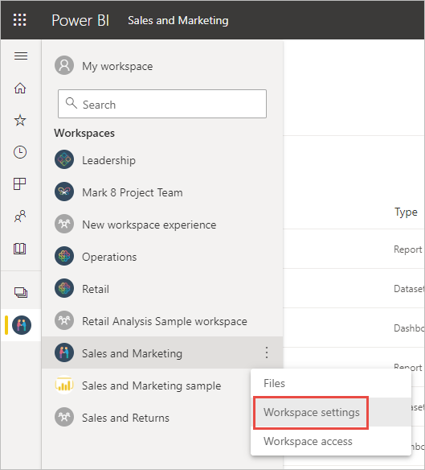

# ลบเกือบทุกสิ่งในบริการ Power BI
บทความนี้แสดงวิธีการลบแดชบอร์ด รายงาน เวิร์กบุ๊ก ชุดข้อมูล แอปฯ การแสดงผลข้อมูลด้วยภาพ หรือพื้นที่ทำงานในบริการ Power BI คุณสามารถลบเกือบทุกสิ่งในบริการ Power BI ได้ แต่มีข้อยกเว้นบางรายการ 

## ลบแดชบอร์ด รายงาน ชุดข้อมูล หรือเวิร์กบุ๊ก

1. ในพื้นที่ทำงานของคุณ ให้เลือกแถบ **ทั้งหมด**
1. เลือก **ตัวเลือกเพิ่มเติม (...)** ถัดจากแอสเซทที่คุณต้องการลบ แล้วเลือก **ลบ**

    

1. เลือก **ลบ** เพื่อยืนยันการลบ

## การลบแอปฯออกจากหน้ารายการแอปฯของคุณ

คุณสามารถลบแอปออกจากหน้ารายการแอปของคุณได้อย่างง่ายดาย การลบแอปจะไม่เป็นการลบแอปจากสมาชิกคนอื่น ๆ เฉพาะผู้ดูแลระบบหรือสมาชิกหรือพื้นที่ทำงานเท่านั้นที่สามารถลบแอปจากพื้นที่ทำงานนั้นได้อย่างถาวร

1. ในหน้าต่างนำทาง เลือก **Apps** เมื่อต้องเปิดหน้ารายการแอปฯ
2. เลื่อนไปยังแอปฯที่ต้องการลบ แล้วเลือกไอคอน:::image type="icon" source="media/service-delete/power-bi-delete-report2.png" border="false":::ลบ

   

   หากคุณเอาแอปฯออกโดยไม่ได้ตั้งใจ คุณมีหลายตัวเลือกสำหรับการเรียกคือแอปฯดังกล่าว  คุณสามารถขอให้ผู้สร้างแอปส่งแอปกลับมาใหม่ คุณสามารถค้นหาอีเมลต้นฉบับที่มีลิงก์ไปยังแอป คุณสามารถตรวจสอบ[ศูนย์การแจ้งเตือน](../consumer/end-user-notification-center.md)ของคุณเพื่อดูว่าแอปดังกล่าวยังคงอยู่ในรายการแจ้งเตือนหรือไม่ หรือคุณสามารถตรวจสอบ [ AppSource](../consumer/end-user-apps.md) ขององค์กรของคุณ

## นำพื้นที่ทำงานออกหรือลบออก

Power BI มีพื้นที่ทำงานสองประเภทที่แตกต่างกัน ได้แก่ พื้นที่ทำงานดั้งเดิมหรือ *คลาสสิก* และพื้นที่ทำงานใหม่ กระบวนการสำหรับการนำออกหรือลบพื้นที่ทำงานเหล่านั้นแตกต่างกัน อ่านเพิ่มเติมเกี่ยวกับ[พื้นที่ทำงานใหม่และคลาสสิก](../collaborate-share/service-new-workspaces.md)

### นำสมาชิกออกจากพื้นที่ทำงานใหม่

เฉพาะผู้ดูแลระบบพื้นที่ทำงานเท่านั้นที่สามารถนำบุคคลออกจากพื้นที่ทำงานใหม่ได้ ถ้าคุณเป็นผู้ดูแลระบบ คุณสามารถนำตัวเองหรือบุคคลอื่นออกได้ อย่างไรก็ตาม ถ้าคุณเป็นผู้ดูแลระบบเพียงคนเดียวสำหรับพื้นที่ทำงานหนึ่ง Power BI จะไม่อนุญาตให้คุณนำตัวเองออก

1. ในมุมมองรายการพื้นที่ทำงาน ให้เลือก **การเข้าถึง** ที่มุมบนขวา

    :::image type="content" source="media/service-delete/power-bi-select-access.png" alt-text="สกรีนช็อตของเลือกการเข้าถึง":::

1. ในบานหน้าต่าง **การเข้าถึง** ให้เลือก **ตัวเลือกเพิ่มเติม (... )** ถัดจากชื่อของบุคคลที่คุณต้องการอาออก และเลือก **นำออก**

    :::image type="content" source="media/service-delete/power-bi-access-remove.png" alt-text="สกรีนช็อตของบานหน้าต่างการเข้าถึง เลือกนำออก":::

### ลบพื้นที่ทำงานใหม่

เมื่อคุณสร้าง *พื้นที่ทำงานใหม่* หนึ่งรายการ คุณจะไม่ได้สร้างกลุ่ม Microsoft 365 ที่เกี่ยวข้อง ถ้าคุณเป็นผู้ดูแลระบบพื้นที่ทำงาน คุณสามารถลบพื้นที่ทำงานใหม่โดยไม่มีผลกับกลุ่ม Microsoft 365 ใดเลย อ่านเพิ่มเติมเกี่ยวกับ[พื้นที่ทำงานใหม่และคลาสสิก](../collaborate-share/service-new-workspaces.md)

ในฐานะผู้ดูแลระบบสำหรับพื้นที่ทำงาน คุณสามารถลบพื้นที่ทำงานดังกล่าวหรือนำออกจากรายการอื่นได้ เมื่อคุณลบพื้นที่ทำงาน แอปที่เชื่อมโยงสำหรับสมาชิกของกลุ่มทั้งหมดจะถูกลบไปด้วย และแอปก็ถูกนำออกจาก AppSource ด้วย 

1. จากบานหน้าต่างนำทาง ให้เลือก **พื้นที่ทำงาน**

2. เลือก **ตัวเลือกเพิ่มเติม** (...) ทางด้านขวาของพื้นที่ทำงานที่ต้องการลบ และเลือก **การตั้งค่าพื้นที่ทำงาน**

    

3. ในบานหน้าต่าง **การตั้งค่าพื้นที่ทำงาน** ให้เลือก **ลบพื้นที่ทำงาน** > **ลบ**

### นำพื้นที่ทำงานแบบคลาสสิกออกจากรายการของคุณ

หากคุณไม่ต้องการเป็นสมาชิกของพื้นที่ทำงานแบบคลาสสิกอีกต่อไป คุณสามารถ**_ออก_* จากพื้นที่ทำงานนั้น และระบบจะนำพื้นที่ทำงานออกจากรายการของคุณ การออกจากพื้นที่ทำงานจะมีอยู่แล้วสำหรับสมาชิกในพื้นที่ทำงานอื่น ๆ ทั้งหมด  

> [!NOTE]
> หากคุณเป็นผู้ดูแลระบบเพียงคนเดียวสำหรับพื้นที่ทำงาน Power BI จะไม่อนุญาตให้คุณออกจากพื้นที่ทำงาน
>

1. เริ่มต้นในพื้นที่ทำงานที่คุณต้องการลบ

2. ที่มุมบนขวา ให้เลือก *ตัวเลือกเพิ่มเติม** (...) แล้วเลือก **ออกจากพื้นที่ทำงาน** > **ออก**

      :::image type="content" source="media/service-delete/power-bi-leave-workspace.png" alt-text="สกรีนช็อตของตัวเลือกเพิ่มเติม ออกจากพื้นที่ทำงาน":::

   > [!NOTE]
   > ตัวเลือกที่คุณเห็นในรายการแบบเลื่อนลงขึ้นอยู่กับว่าคุณเป็นผู้ดูแลระบบหรือเป็นสมาชิกของพื้นที่ทำงานนั้น
   >

### ลบพื้นที่ทำงานแบบคลาสสิก

> [!WARNING]
> เมื่อคุณสร้างพื้นที่ทำงานแบบ *คลาสสิก* คุณจะสร้าง Microsoft 365 Group ด้วย เมื่อคุณลบพื้นที่ทำงานแบบคลาสสิก คุณจะลบ Microsoft 365 Group ดังกล่าวด้วย กลุ่มจะถูกลบออกจากผลิตภัณฑ์ Microsoft 365 อื่น ๆ เช่น SharePoint และ Microsoft Teams
> 

การลบพื้นที่ทำงานจะแตกต่างจากการออกจากพื้นที่ทำงาน คุณจำเป็นต้องเป็นผู้ดูแลระบบพื้นที่ทำงานเพื่อลบพื้นที่ทำงานนั้นออก เมื่อคุณลบพื้นที่ทำงาน แอปที่เชื่อมโยงสำหรับสมาชิกของกลุ่มทั้งหมดจะถูกลบไปด้วย และก็ถูกนำออกจาก AppSource ด้วย อย่างไรก็ตาม ถ้าคุณเป็นผู้ดูแลระบบเพียงคนเดียวสำหรับพื้นที่ทำงานหนึ่ง Power BI จะไม่อนุญาตให้คุณออกจากพื้นที่ทำงานดังกล่าว

1. จากบานหน้าต่างนำทาง ให้เลือก **พื้นที่ทำงาน**

2. ถัดจากพื้นที่ทำงานที่จะลบ ให้เลือก **ตัวเลือกเพิ่มเติม (...)**  > **การตั้งค่าพื้นที่ทำงาน**

    

3. ในบานหน้าต่าง **การตั้งค่า** ให้เลือก **ลบพื้นที่ทำงาน** จากนั้นยืนยัน **ลบ**

    

## ข้อควรพิจารณาและข้อจำกัด

- การนำ *แดชบอร์ด* ออกไม่ได้ลบชุดข้อมูลพื้นฐานหรือรายงานใดก็ตาม ที่เชื่อมโยงกับแดชบอร์ดนั้น
- หากคุณเป็น *เจ้าของแดชบอร์ดหรือรายงาน* คุณสามารถนำรายการดังกล่าวออกได้ ถ้าคุณแชร์กับเพื่อนร่วมงาน การนำออกจากพื้นที่ทำงาน Power BI ของคุณจะเป็นการนำออกจากพื้นที่ทำงาน Power BI ของพวกเขาด้วยเช่นกัน
- หากมีการแชร์ *แดชบอร์ดหรือรายงานกับคุณ* คุณจะไม่สามารถนำออกได้
- การลบรายงานจะไม่ลบชุดข้อมูลที่อ้างอิงตามรายงาน  การแสดงผลข้อมูลด้วยภาพใดก็ตามที่คุณปักหมุดไว้ในแดชบอร์ดจากรายงานก็ปลอดภัยเช่นกัน พวกเขาจะยังคงอยู่บนแดชบอร์ดจนกว่าคุณจะลบทีละรายการ
- คุณสามารถลบ *ชุดข้อมูล* ได้ อย่างไรก็ตาม การลบชุดข้อมูลจะลบรายงานและแผ่นแดชบอร์ดที่มีข้อมูลจากชุดข้อมูลนั้นทั้งหมดด้วย
- คุณสามารถลบ *เวิร์กบุ๊ก* ออกได้ อย่างไรก็ตาม การลบสมุดงานจะลบรายงานและแผ่นแดชบอร์ดที่ประกอบด้วยข้อมูลจากสมุดงานทั้งหมดี้ด้วย หากมีการจัดเก็บเวิร์กบุ๊กใน OneDrive for Business การลบเวิร์กบุ๊กออกจาก Power BI จะไม่ทำให้เวิร์กบุ๊กจาก OneDrive ถูกลบออกด้วย
- หาก *แดชบอร์ดหรือรายงาน* เป็นส่วนหนึ่งของ [ชุดเนื้อหาระดับองค์กร](../collaborate-share/service-organizational-content-pack-disconnect.md) คุณจะไม่สามารถลบได้โดยใช้วิธีนี้  ดู[การลบการเชื่อมต่อไปยังชุดเนื้อหาขององค์กร](../collaborate-share/service-organizational-content-pack-disconnect.md)
- หากชุดข้อมูลเป็นส่วนหนึ่งของ *ชุดเนื้อหาระดับองค์กร* อย่างน้อยหนึ่งชุด วิธีเดียวที่จะลบชุดข้อมูลจากชุดเนื้อหาที่กำลังมีการใช้งานอยู่คือ รอให้มีการประมวลผลเสร็จเรียบร้อย จากนั้นนั้นลองลบอีกครั้ง

## ขั้นตอนถัดไป

บทความนี้ครอบคลุมวิธีการลบบล็อคก่อสร้างหลักของบริการ Power BI สิ่งอื่น ๆ ที่คุณสามารถลบได้มีดังนี้  

- [ลบแดชบอร์ดที่แนะนำของคุณ](../consumer/end-user-featured.md)
- [ลบแดชบอร์ด (ที่ไม่ใช่รายการโปรด)](../consumer/end-user-favorite.md)
- [ลบแผ่นแดชบอร์ดหนึ่ง](service-dashboard-edit-tile.md)

มีคำถามเพิ่มเติมหรือไม่ [ลองไปที่ชุมชน Power BI](https://community.powerbi.com/)