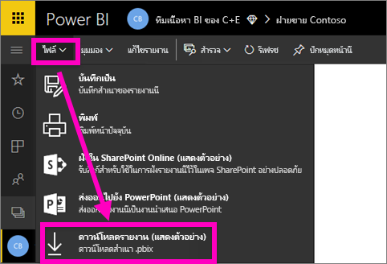
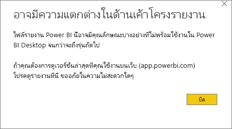
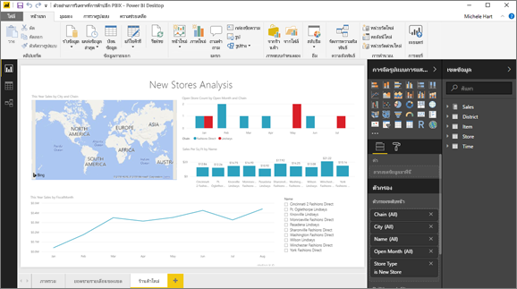

# ดาวน์โหลดรายงานจากบริการของ Power BI ไปยังไฟล์ Power BI Desktop (ตัวอย่าง)Download a report from the Power BI service to Power BI Desktop (preview)
      
ใน Power BI Desktop คุณสามารถเผยแพร่รายงาน (ไฟล์ *.pbix*) จากคอมพิวเตอร์ในเครื่องของคุณไปยังบริการของ Power BI ได้In Power BI Desktop, you can publish a report (a *.pbix* file) from your local computer to the Power BI service. รายงาน Power BI สามารถไปยังทิศทางอื่น ๆ ได้เช่นกัน: คุณสามารถดาวน์โหลดรายงานจากบริการของ Power BI ไปยังไฟล์ Power BI DesktopPower BI reports can go the other direction as well: You can download a report from the Power BI service to Power BI Desktop. ส่วนขยายสำหรับรายงาน Power BI ในกรณีใดก็ตามคือ .pbixThe extension for a Power BI report, in either case, is .pbix.

มีข้อจำกัดบางประการที่ควรคำนึงถึง ซึ่งจะกล่าวถึงในส่วน [ข้อควรพิจารณาและการแก้ไขปัญหา](#considerations-and-troubleshooting) ของบทความนี้There are a few limitations to keep in mind, which are discussed in the [Considerations and troubleshooting](#considerations-and-troubleshooting) section of this article.

## ดาวน์โหลดรายงานเป็นแบบ ไฟล์ .pbixDownload the report as a .pbix file

คุณสามารถดาวน์โหลดได้เฉพาะรายงาน [ที่สร้างขึ้นด้วย Power BI Desktop ](/learn/modules/publish-share-power-bi/2-publish-reports) หลังจากวันที่ 23 พฤศจิกายน 2016 และได้รับการปรับปรุงนับตั้งแต่จากนั้นYou can only download reports [created with Power BI Desktop](/learn/modules/publish-share-power-bi/2-publish-reports) after November 23, 2016, and updated since then. ถ้ามีการสร้างก่อน ตัวเลือกเมนู **ดาวน์โหลดรายงาน** ในบริการของ Power BI จะเป็นสีเทาIf it was created before then, the **Download report** menu option in the Power BI service is grayed out.

การดาวน์โหลดไฟล์ .pbix ให้ทำตามขั้นตอนเหล่านี้:To download the .pbix file, follow these steps:

1. ในบริการของ Power BI เปิดรายงานที่คุณต้องการดาวน์โหลดใน[มุมมองการแก้ไข](./service-interact-with-a-report-in-editing-view.md)In the Power BI service, open the report you want to download in [Editing view](./service-interact-with-a-report-in-editing-view.md).

2. จากบานหน้าต่างนำทางด้านบน ให้เลือก **ไฟล์ > ดาวน์โหลดรายงาน**From the top nav pane, select **File > Download report**.
   
3. ในขณะที่กำลังดาวน์โหลดรายงาน แบนเนอร์สถานะจะแสดงความคืบหน้าWhile the report is downloading, a status banner displays the progress. เมื่อไฟล์พร้อม คุณจะถูกขอให้เปิดหรือบันทึกไฟล์ .pbixWhen the file is ready, you're asked where to save the .pbix file. ชื่อค่าเริ่มต้นของไฟล์ตรงกับชื่อเรื่องของรายงานThe default name of the file matches the title of the report.
   
4. ถ้าคุณไม่พร้อม [ติดตั้ง Power BI Desktop ](../fundamentals/desktop-get-the-desktop.md) จากนั้นให้เปิดไฟล์ .pbix ใน Power BI DesktopIf you haven't already, [install Power BI Desktop](../fundamentals/desktop-get-the-desktop.md), then open the .pbix file in Power BI Desktop.
   
    เมื่อคุณเปิดรายงานใน Power BI Desktop คุณอาจเห็นข้อความแจ้งเตือนให้คุณทราบว่าบางคุณลักษณะที่พร้อมใช้งานในรายงานการบริการของ Power BI อาจไม่พร้อมใช้งานใน Power BI DesktopWhen you open the report in Power BI Desktop, you may see a warning message letting you know that some features available in the Power BI service report aren't available in Power BI Desktop.
   
    

5. ตัวแก้ไขรายงานใน Power BI Desktop จะคล้ายคลึงกันตัวแก้ไขรายงานในบริการของ Power BIThe report editor in Power BI Desktop is similar to the report editor in the Power BI service.  
   
    

## ข้อควรพิจารณาและการแก้ไขปัญหาConsiderations and troubleshooting

มีข้อควรพิจารณาและขีดจำกัดที่สำคัญสองสามข้อที่เชื่อมโยงกับการดาวน์โหลดไฟล์ .pbix จากบริการ Power BIThere are a few important considerations and limitations associated with downloading a .pbix file from the Power BI service.

* เมื่อต้องการดาวน์โหลดไฟล์ คุณต้องแก้ไขการเข้าถึงในรายงานTo download the file, you must have edit access to the report.
* ต้องมีการสร้างรายงานโดยใช้ Power BI Desktop และ *เผยแพร่* ไปยังบริการของ Power BI หรือไฟล์ .pbix ต้องได้รับ *การอัปโหลด* ไปยังบริการของ Power BIThe report must have been created by using Power BI Desktop and *published* to the Power BI service, or the .pbix file must have been *uploaded* to the Power BI service.
* ต้องมีการเผยแพร่หรืออัปเดตรายงานหลังจากวันที่ 23 พฤศจิกายน 2016Reports must be published or updated after November 23, 2016. รายงานที่เผยแพร่ก่อนหน้านี้ยังไม่สามารถดาวน์โหลดได้Reports published earlier aren't downloadable.
* คุณลักษณะนี้จะไม่สามารถใช้งานได้กับรายงานและชุดเนื้อหาที่สร้างขึ้นในบริการของ Power BIThis feature won't work with reports and content packs originally created in the Power BI service.
* ใช้เวอร์ชันล่าสุดของ Power BI Desktop เสมอเมื่อเปิดไฟล์ที่ดาวน์โหลดแล้วAlways use the latest version of Power BI Desktop when you open downloaded files. ไฟล์ .pbix ที่ดาวน์โหลดแล้วอาจไม่สามารถเปิดได้ในเวอร์ชันที่ไม่ใช่เวอร์ชั่นปัจจุบันของ Power BI DesktopDownloaded .pbix files might not open in non-current versions of Power BI Desktop. ตัวอย่างเช่น คุณไม่สามารถเปิดไฟล์ .pbix ที่ดาวน์โหลดโดยใช้เวอร์ชันเดสก์ท็อปที่ไม่รองรับการป้องกันข้อมูลได้For example, you cannot open downloaded .pbix files using a Desktop version that does not support information protection.
* หากผู้ดูแลระบบของคุณปิดใช้งานความสามารถในการดาวน์โหลดข้อมูล คุณลักษณะนี้จะไม่ปรากฏในบริการของ Power BIIf your administrator has turned off the ability to download data, this feature won't be visible in the Power BI service.
* ชุดข้อมูลที่มีการรีเฟรชแบบเพิ่มทีละหน่วยไม่สามารถดาวน์โหลดเป็นไฟล์ .pbix ได้Datasets with incremental refresh can't be downloaded to a .pbix file.
* ไม่สามารถดาวน์โหลดชุดข้อมูลที่เปิดใช้งานสำหรับ[แบบจำลองขนาดใหญ่](../admin/service-premium-large-models.md)ไปยังแฟ้ม .pbix ได้Datasets enabled for [large models](../admin/service-premium-large-models.md) can't be downloaded to a .pbix file.
* ไม่สามารถดาวน์โหลดชุดข้อมูลที่ปรับแก้โดยใช้[จุดสิ้นสุด XMLA](../admin/service-premium-connect-tools.md)ไปยังแฟ้ม .pbix ได้Datasets modified by using the [XMLA endpoint](../admin/service-premium-connect-tools.md) can't be downloaded to a .pbix file.
* หากคุณสร้างรายงาน Power BI โดยยึดตามชุดข้อมูลในพื้นที่ทำงานหนึ่งและเผยแพร่ไปยังพื้นที่ทำงานอื่น คุณและผู้ใช้ของคุณจะไม่สามารถดาวน์โหลดรายงานได้If you create a Power BI report based on a dataset in one workspace and publish to a different workspace, you and your users won't be able to download it. ในขณะนี้ คุณลักษณะการดาวน์โหลดไม่ได้รับการสนับสนุนในสถานการณ์นี้The download feature is currently not supported in this scenario.

## ขั้นตอนถัดไปNext steps

ดูวิดีโอความยาวหนึ่งนาที **Guy in a Cube** สำหรับคุณลักษณะนี้:View the **Guy in a Cube** one-minute video about this feature:

<iframe width="560" height="315" src="https://www.youtube.com/embed/ymWqU5jiUl0" frameborder="0" allowfullscreen></iframe>

ต่อไปนี้คือบทความเพิ่มเติมที่สามารถช่วยให้คุณเรียนรู้วิธีการใช้บริการของ Power BI:Here are some additional articles that can help you learn to use the Power BI service:

* [รายงานใน Power BIReports in Power BI](../consumer/end-user-reports.md)
* [แนวคิดพื้นฐานสำหรับนักออกแบบในบริการ Power BIBasic concepts for designers in the Power BI service](../fundamentals/service-basic-concepts.md)

เมื่อคุณได้ติดตั้ง Power BI Desktop แล้ว บทความต่อไปนี้สามารถช่วยให้คุณเริ่มต้น และใช้งานอย่างรวดเร็ว:After you've installed Power BI Desktop, see the following article to help you get up and running quickly:

* [เริ่มต้นใช้งาน Power BI DesktopGetting Started with Power BI Desktop](../fundamentals/desktop-getting-started.md)

มีคำถามเพิ่มเติมหรือไม่More questions? [ลองไปที่ชุมชน Power BI](https://community.powerbi.com/)[Try the Power BI Community](https://community.powerbi.com/).