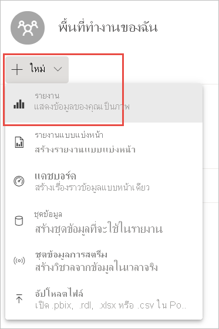
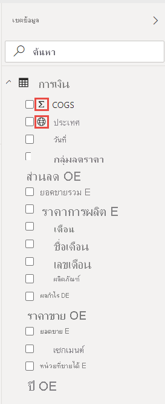
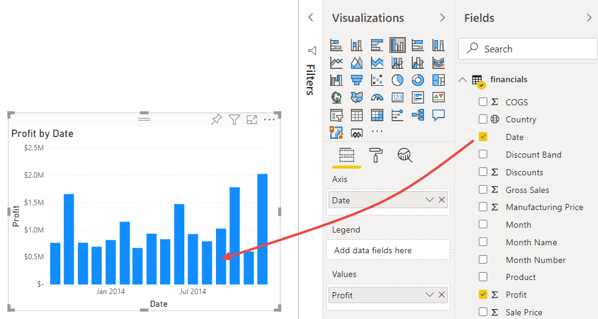
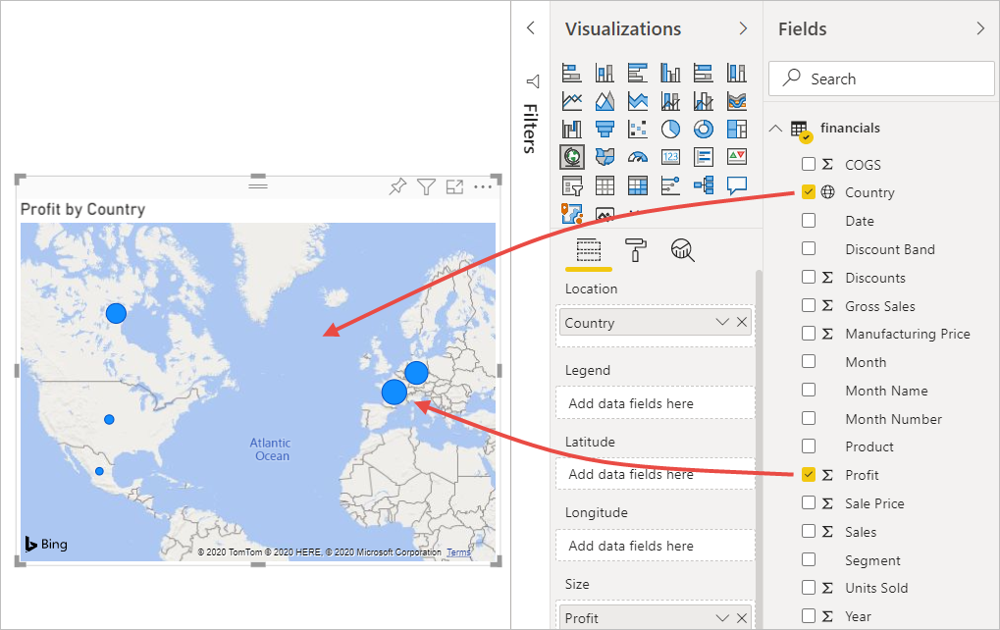
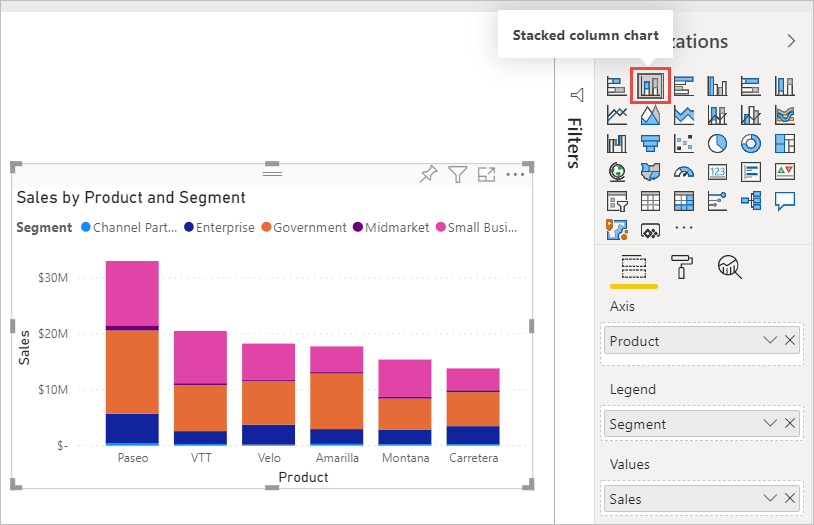
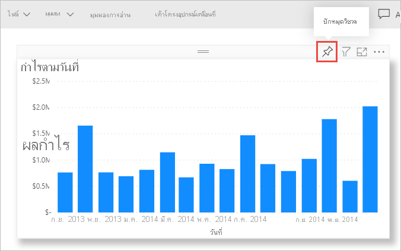
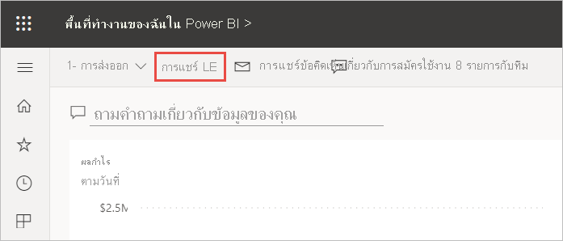
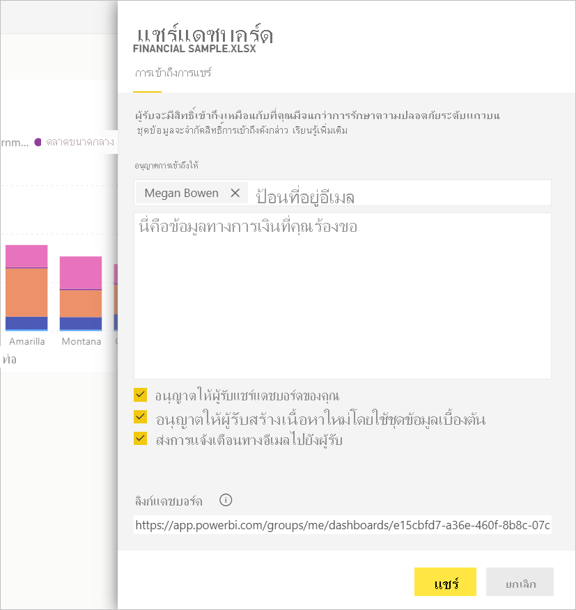
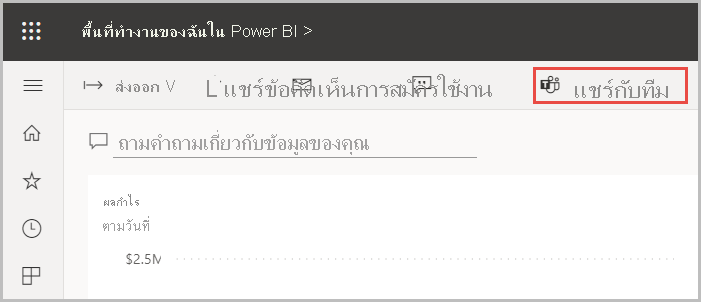
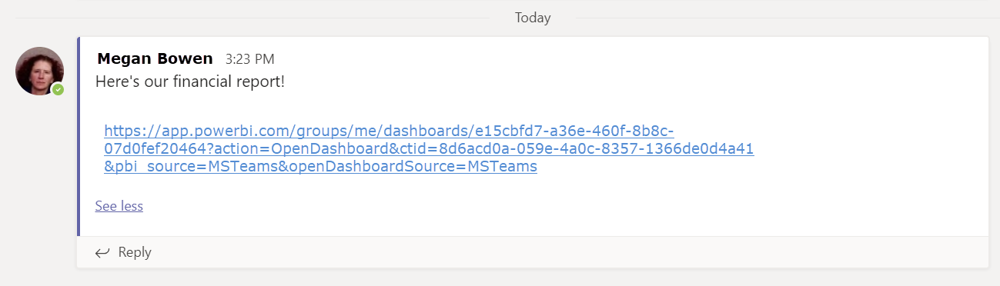

# บทช่วยสอน: จากสมุดงาน Excel ไปยังรายงานในบริการของ Power BI และต่อไปยัง Microsoft TeamsTutorial: From Excel workbook to a report in the Power BI service to Microsoft Teams
ผู้จัดการของคุณต้องการดูรายงานเกี่ยวกับยอดขายล่าสุดและตัวเลขกำไรของคุณภายในเย็นวันนี้Your manager wants to see a report on your latest sales and profit figures by the end of the day. แต่ข้อมูลล่าสุดอยู่ในไฟล์บนแล็ปท็อปของคุณBut the latest data is in files on your laptop. ในอดีตต้องใช้เวลาหลายชั่วโมงในการสร้างรายงานและคุณเริ่มรู้สึกตื่นตระหนกIn the past, it’s taken hours to create a report, and you’re beginning to feel anxious.

ไม่ต้องกังวลNo worries. ด้วย Power BI คุณสามารถสร้างรายงานที่สวยงามและแชร์รายงานใน Microsoft Teams ได้ในเวลาไม่นานWith Power BI, you can create a stunning report and share it in Microsoft Teams in no time!

:::image type="content" source="media/service-from-excel-to-stunning-report/power-bi-financial-report-service.png" alt-text="ภาพหน้าจอของรายงานตัวอย่างด้านการเงินที่เสร็จเรียบร้อยแล้ว":::

ในบทช่วยสอนนี้ เราจะอัปโหลดไฟล์ Excel สร้างรายงานใหม่ และแชร์กับเพื่อนร่วมงานใน Microsoft Teams ซึ่งทั้งหมดนี้ทำได้ภายใน Power BIIn this tutorial, we upload an Excel file, create a new report, and share it with colleagues in Microsoft Teams, all from within Power BI. คุณจะได้เรียนรู้วิธีการต่อไปนี้:You'll learn how to:

> [!div class="checklist"]
> * จัดเตรียมข้อมูลของคุณใน ExcelPrepare your data in Excel.
> * ดาวน์โหลดข้อมูลตัวอย่างDownload sample data.
> * สร้างรายงานในบริการของ Power BIBuild a report in the Power BI service.
> * ปักหมุดวิชวลรายงานไปยังแดชบอร์ดPin the report visuals to a dashboard.
> * แชร์ลิงก์ไปยังแดชบอร์ดShare a link to the dashboard.
> * แชร์แดชบอร์ดใน Microsoft TeamsShare the dashboard in Microsoft Teams

## ข้อกำหนดเบื้องต้นPrerequisites
- [ลงทะเบียนสำหรับบริการของ Power BI](../fundamentals/service-self-service-signup-for-power-bi.md)[Sign up for the Power BI service](../fundamentals/service-self-service-signup-for-power-bi.md). 
- ดาวน์โหลด [สมุดงานตัวอย่างด้านการเงิน](https://go.microsoft.com/fwlink/?LinkID=521962) และบันทึกลงในคอมพิวเตอร์ของคุณหรือลงใน OneDrive for BusinessDownload the [Financial Sample workbook](https://go.microsoft.com/fwlink/?LinkID=521962) and save it your computer or to OneDrive for Business.

## จัดเตรียมข้อมูลใน ExcelPrepare data in Excel
เราใช้ไฟล์ Excel ง่าย ๆ เพื่อแสดงเป็นตัวอย่างLet’s take a simple Excel file as an example. 

1. ก่อนที่คุณสามารถโหลดไฟล์ Excel ของคุณลงใน Power BI คุณต้องจัดระเบียบข้อมูลของคุณในตารางเดียวก่อนBefore you can load your Excel file into Power BI, you must organize your data in a flat table. ในตารางแบบคงที่ แต่ละคอลัมน์ประกอบด้วยข้อมูลประเภทเดียวกัน ตัวอย่างเช่น ข้อความ วันที่ ตัวเลข หรือสกุลเงินIn a flat table, each column contains the same data type; for example, text, date, number, or currency. ตารางของคุณควรมีแถวส่วนหัว แต่ไม่มีคอลัมน์หรือแถวที่แสดงผลรวมYour table should have a header row, but not any columns or rows that display totals.

   

2. ถัดไป จัดรูปแบบข้อมูลของคุณเป็นหนึ่งตารางNext, format your data as a table. ใน Excel ที่แถบ **หน้าแรก** ในกลุ่ม **สไตล์** เลือก **จัดรูปแบบเป็นตาราง**In Excel, on the **Home** tab, in the **Styles** group, select **Format as Table**. 

3. เลือกลักษณะตารางที่จะนำไปใช้กับแผ่นงานของคุณSelect a table style to apply to your worksheet. 

   ขณะนี้แผ่นงาน Excel ของคุณพร้อมที่จะโหลดลงใน Power BIYour Excel worksheet is now ready to load into Power BI.

   

## อัปโหลดไฟล์ Excel ของคุณไปยังบริการ Power BIUpload your Excel file to the Power BI service
บริการ Power BI เชื่อมต่อกับแหล่งข้อมูลจำนวนมาก รวมถึงไฟล์ Excel ที่อยู่บนคอมพิวเตอร์ของคุณThe Power BI service connects to many data sources, including Excel files that live on your computer.

1. ลงชื่อเข้าบริการ Power BI เพื่อเริ่มใช้งานTo get started, sign in to the Power BI service. หากคุณยังไม่ได้ลงทะเบียน[คุณสามารถทำได้โดยไม่มีค่าใช้จ่าย](https://powerbi.com)If you haven’t signed up, [you can do so for free](https://powerbi.com).
1. ใน **พื้นที่ทำงานของฉัน** ให้เลือก **ใหม่** > **อัปโหลดไฟล์**In **My workspace**, select **New** > **Upload a file**.

    :::image type="content" source="media/service-from-excel-to-stunning-report/power-bi-new-upload.png" alt-text="ภาพหน้าจอของตัวเลือกอัปโหลดไฟล์":::

1. เลือก **ไฟล์ภายในเครื่อง** เรียกดูตำแหน่งที่คุณบันทึกไฟล์ Excel ตัวอย่างการเงิน และเลือก **เปิด**Select **Local File**, browse to where you saved the Financial Sample Excel file, and select **Open**.
7. บนหน้า **ไฟล์ภายในเครื่อง** ให้เลือก **นำเข้า**On the **Local File** page, select **Import**.

    ในตอนนี้คุณมีชุดข้อมูลตัวอย่างการเงินแล้วNow you have a Financial Sample dataset. และ Power BI จะสร้างแดชบอร์ดว่างโดยอัตโนมัติPower BI also automatically created a blank dashboard. หากคุณไม่เห็นแดชบอร์ด ให้รีเฟรชเบราว์เซอร์ของคุณIf you don't see the dashboard, refresh your browser.

    :::image type="content" source="media/service-from-excel-to-stunning-report/power-bi-financial-dataset.png" alt-text="ภาพหน้าจอของพื้นที่ทำงานของฉันที่มีชุดข้อมูลตัวอย่างการเงิน":::

2. คุณต้องการสร้างรายงานYou want to create a report. ยังอยู่ใน **พื้นที่ทำงานของฉัน** ให้เลือก **รายงาน** > **ใหม่**Still in **My workspace**, select **New** > **Report**.

   

3. ในกล่องโต้ตอบ **เลือกชุดข้อมูลเพื่อสร้างรายงาน** ให้เลือกชุดข้อมูล **ตัวอย่างการเงิน** ของคุณ > **สร้าง**In the **Select a dataset to create a report** dialog box, select your **Financial Sample** dataset > **Create**.

   

## บันทึกรายงานของคุณBuild your report
 
รายงานเปิดขึ้นในมุมมองการแก้ไขและแสดงพื้นที่รายงานที่ว่างเปล่าThe report opens in Editing view and displays the blank report canvas. ที่ด้านขวาคือบานหน้าต่าง **การแสดงภาพ** **ตัวกรอง** และ **เขตข้อมูล**On the right are the **Visualizations**, **Filters**, and **Fields** panes. ข้อมูลในตารางสมุดงาน Excel ของคุณปรากฏขึ้นในบานหน้าต่าง **เขตข้อมูล**Your Excel workbook table data appears in the **Fields** pane. ที่ด้านบนคือชื่อของตาราง **การเงิน**At the top is the name of the table, **financials**. ที่ด้านล่างชื่อ Power BI จะแสดงรายการส่วนหัวของคอลัมน์เป็นแขตข้อมูลแต่ละช่องUnder that, Power BI lists the column headings as individual fields.

คุณเห็นสัญลักษณ์ซิกมาในรายการเขตข้อมูลหรือไม่You see the Sigma symbols in the Fields list? Power BI ตรวจพบว่าเขตข้อมูลเหล่านั้นเป็นตัวเลขPower BI has detected that those fields are numeric. Power BI ยังระบุเขตข้อมูลทางภูมิศาสตร์ที่มีสัญลักษณ์ลูกโลกPower BI also indicates a geographic field with a globe symbol.

1. หากต้องการที่ว่างสำหรับพื้นที่รายงาน ให้เลือก **ซ่อนบานหน้าต่างการนำทาง** และลดขนาดบานหน้าต่าง **ตัวกรอง**To have more room for the report canvas, select **Hide the navigation pane**, and minimize the **Filters** pane.

    :::image type="content" source="media/service-from-excel-to-stunning-report/power-bi-hide-nav-pane.png" alt-text="ภาพหน้าจอของการลดขนาดบานหน้าต่างการนำทาง"::: 

1. ตอนนี้คุณสามารถเริ่มต้นสร้างการแสดงภาพได้Now you can begin to create visualizations. สมมติว่าผู้จัดการของคุณต้องการเห็นผลกำไรเมื่อเวลาผ่านไปLet's say your manager wants to see profit over time. ในบานหน้าต่าง **เขตข้อมูล** ลาก **กำไร** ไปยังพื้นที่ของรายงานIn the **Fields** pane, drag **Profit** to the report canvas. 

   ตามค่าเริ่มต้น Power BI จะแสดงแผนภูมิคอลัมน์ที่มีคอลัมน์เดียวBy default, Power BI displays a column chart with one column. 

    :::image type="content" source="media/service-from-excel-to-stunning-report/power-bi-profit-column.png" alt-text="ภาพหน้าจอของแผนภูมิคอลัมน์ที่มีคอลัมน์เดียว":::

3. ลาก **วันที่** ไปยังพื้นที่ของรายงานDrag **Date** to the report canvas. 

   Power BI อัปเดตแผนภูมิคอลัมน์เพื่อแสดงกำไรตามวันที่Power BI updates the column chart to show profit by date.

   

    ธันวาคม 2014 เป็นเดือนที่มีกำไรมากที่สุดDecember 2014 was the most profitable month.
   
    > [!TIP]
    > หากค่าแผนภูมิของคุณไม่เหมือนกับที่คุณคาดไว้ ให้ตรวจสอบการรวมข้อมูลของคุณIf your chart values don't look as you expect, check your aggregations. ตัวอย่างเช่น ในบริเวณ **ค่า** เลือกเขตข้อมูล **กำไร** ที่คุณเพิ่งเพิ่มเข้ามา และตรวจสอบให้แน่ใจว่าการรวมข้อมูลดำเนินการตามวิธีที่คุณต้องการFor example, in the **Values** well, select the **Profit** field you just added and ensure the data is being aggregated the way you'd like it. ในตัวอย่างนี้ เรากำลังใช้ **ผลรวม**In this example, we're using **Sum**.
    > 

### สร้างแผนที่Create a map

ผู้จัดการของคุณต้องการทราบว่าประเทศใดทำกำไรมากที่สุดYour manager wants to know which countries are the most profitable. สร้างความประทับใจให้ผู้จัดการด้วยการแสดงภาพแผนที่Impress your manager with a map visualization. 

1. เลือกพื้นที่ว่างบนพื้นที่รายงานของคุณSelect a blank area on your report canvas. 

2. จากบานหน้าต่าง **เขตข้อมูล** ให้ลากเขตข้อมูล **ประเทศ** ไปยังพื้นที่รายงานของคุณ จากนั้นจึงลากเขตข้อมูล **กำไร** ไปยังแผนที่From the **Fields** pane, drag the **Country** field to your report canvas, then drag the **Profit** field to the map.

   Power BI สร้างภาพแผนที่พร้อมฟองอากาศที่เป็นตัวแทนผลกำไรของแต่ละพื้นที่Power BI creates a map visual with bubbles representing the relative profit of each location.

   

    ดูเหมือนว่าประเทศในแถบยุโรปจะมีประสิทธิภาพเหนือกว่าประเทศในอเมริกาเหนือLooks like the European countries are outperforming the North American countries.

### สร้างวิชวลที่แสดงยอดขายCreate a visual showing sales

คุณต้องการแสดงภาพที่นำเสนอยอดขายตามภาคส่วนผลิตภัณฑ์และการตลาดหรือไม่?What about displaying a visual showing sales by product and market segment? ทำได้ง่ายEasy. 

1. เลือกพื้นที่ว่างSelect the blank canvas.

1. ในบานหน้าต่าง **เขตข้อมูล** ให้เลือกเขตข้อมูล **การขาย**, **ผลิตภัณฑ์** และ **ภาคส่วน**In the **Fields** pane, select the **Sales**, **Product**, and **Segment** fields. 
   
   Power BI สร้างแผนภูมิคอลัมน์แบบคลัสเตอร์Power BI creates a clustered column chart. 

2. เปลี่ยนชนิดของแผนภูมิโดยการเลือกไอคอนใดไอคอนหนึ่งในเมนู **การแสดงข้อมูลด้วยภาพ**Change the type of chart by choosing one of the icons in the **Visualizations** menu. เช่น เปลี่ยนเป็น **แผนภูมิคอลัมน์แบบเรียงซ้อนกัน**For instance, change it to a **Stacked column chart**. 

   

3. เมื่อต้องการเรียงลำดับแผนภูมิ เลือก **ตัวเลือกเพิ่มเติม** (...) > **เรียงลำดับตาม**To sort the chart, select **More options** (...) > **Sort by**.

### จัดวิชวลให้เป็นระเบียบSpruce up the visuals

ทำการเปลี่ยนแปลงต่อไปนี้บนแท็บ **จัดรูปแบบ** ในบานหน้าต่างการแสดงภาพMake the following changes on the **Format** tab in the Visualizations pane.

:::image type="content" source="media/desktop-excel-stunning-report/power-bi-format-tab-visualizations.png" alt-text="ภาพหน้าจอของแท็บจัดรูปแบบในบานหน้าต่างการแสดงภาพ":::

1. เลือกแผนภูมิคอลัมน์ **กำไรตามวันที่**Select the **Profit by Date** column chart. ในส่วน **ชื่อเรื่อง** ให้เปลี่ยน **ขนาดข้อความ** เป็น **16 pt**In the **Title** section, change **Text size** to **16 pt**. ตั้งค่า **เงา** เป็น **เปิด**Toggle **Shadow** to **On**. 

1. เลือกแผนภูมิคอลัมน์แบบเรียงซ้อนของ **ยอดขายตามผลิตภัณฑ์และเซกเมนต์**Select the **Sales by Product and Segment** stacked column chart. ในส่วน **ชื่อเรื่อง** ให้เปลี่ยน **ขนาดข้อความ** ของชื่อเรื่องเป็น **16 pt**In the **Title** section, change title **Text size** to **16 pt**. ตั้งค่า **เงา** เป็น **เปิด**Toggle **Shadow** to **On**.

1. เลือกแผนที่ **กำไรตามประเทศ**Select the **Profit by Country** map. ในส่วน **ลักษณะแผนที่** ให้เปลี่ยน **ธีม** เป็น **โทนสีเทา**In the **Map styles** section, change **Theme** to **Grayscale**. ในส่วน **ชื่อเรื่อง** ให้เปลี่ยน **ขนาดข้อความ** ของชื่อเรื่องเป็น **16 pt**In the **Title** section, change title **Text size** to **16 pt**. ตั้งค่า **เงา** เป็น **เปิด**Toggle **Shadow** to **On**.

## ปักหมุดไปยังแดชบอร์ดPin to a dashboard

ในตอนนี้ คุณสามารถปักหมุดวิชวลทั้งหมดของคุณไปยังแดชบอร์ดว่างที่ Power BI สร้างขึ้นตามค่าเริ่มต้นNow you can pin all of your visuals to the blank dashboard that Power BI created by default. 

1. วางเมาส์เหนือวิชวลและเลือก **ปักหมุดวิชวล**Hover over a visual and select **Pin visual**.

   

1. คุณจะต้องบันทึกรายงานของคุณก่อน คุณจึงจะสามารถปักหมุดวิชวลไปยังแดชบอร์ดได้You need to save your report before you can pin a visual to the dashboard. ตั้งชื่อรายงานของคุณ และเลือก **บันทึก**Give your report a name and select **Save**.
1. ปักหมุดวิชวลแต่ละภาพไปยังแดชบอร์ดที่ Power BI สร้างขึ้น **ตัวอย่างการเงิน.xlsx**Pin each visual to the dashboard that Power BI created, **Financial Sample.xlsx**.
1. เมื่อคุณปักหมุดวิชวลล่าสุด ให้เลือก **ไปที่แดชบอร์ด**When you pin the last visual, select **Go to dashboard**.
1. Power BI เพิ่มไทล์ข้อความตัวอย่างสำหรับตัวอย่างการเงิน.xlsx ไปยังแดชบอร์ดโดยอัตโนมัติPower BI added a placeholder Financial Sample.xlsx tile to the dashboard automatically. เลือก **ตัวเลือกเพิ่มเติม (...)**  > **ลบไทล์**Select **More options (...)** > **Delete tile**.

    :::image type="content" source="media/service-from-excel-to-stunning-report/power-bi-tile-more-options.png" alt-text="ภาพหน้าจอของตัวเลือกเพิ่มเติมสำหรับไทล์":::

1. จัดเรียงใหม่และปรับขนาดไทล์ในแบบที่คุณต้องการRearrange and resize the tiles any way you want.

แดชบอร์ดและรายงานพร้อมแล้วThe dashboard and report are ready.

## แชร์ลิงก์ไปยังแดชบอร์ดของคุณShare a link to your dashboard

ในตอนนี้ก็ถึงเวลาที่จะแชร์แดชบอร์ดของคุณกับผู้จัดการแล้วNow it's time to share your dashboard with your manager. คุณสามารถแชร์แดชบอร์ดและรายงานที่สำคัญของคุณกับเพื่อนร่วมงานที่มีบัญชี Power BIYou can share your dashboard and underlying report with any colleague who has a Power BI account. บุคคลเหล่านี้สามารถโต้ตอบกับรายงานของคุณ แต่ไม่สามารถบันทึกการเปลี่ยนแปลงได้They can interact with your report, but can't save changes. หากคุณอนุญาต พวกเขาสามารถแชร์ต่อกับผู้อื่นหรือสร้างรายงานใหม่ที่ยึดตามชุดข้อมูลพื้นฐานได้If you allow it, they can reshare with others, or build a new report based on the underlying dataset.

1. เมื่อต้องการแชร์รายงานของคุณ ที่ด้านบนสุดของแดชบอร์ด ให้เลือก **แชร์**To share your report, at the top of the dashboard, select **Share**.

   

2. ในหน้า **แชร์แดชบอร์ด** ให้ป้อนที่อยู่อีเมลของผู้รับในกล่อง **ป้อนที่อยู่อีเมล** และเพิ่มข้อความในกล่องด้านล่างIn the **Share dashboard** page, enter the email addresses of the recipients in the **Enter email addresses** box and add a message in the box below it. 

3. ตัดสินใจว่าคุณต้องการใช้ตัวเลือกใด หากมี:Decide which of these options you want, if any:

    - **อนุญาตให้ผู้รับแชร์แดชบอร์ดของคุณ****Allow recipients to share your dashboard**. 
    - **อนุญาตให้ผู้รับสร้างเนื้อหาใหม่โดยใช้ชุดข้อมูลพื้นฐาน****Allow recipients to build new content using the underlying datasets**.
    - **ส่งการแจ้งเตือนทางอีเมลไปยังผู้รับ****Send an email notification to recipients.**

   

1. เลือก **แชร์**Select **Share**.

## แชร์ไปยัง Microsoft TeamsShare to Microsoft Teams

คุณยังสามารถแชร์รายงานและแดชบอร์ดให้เพื่อนร่วมงานของคุณได้โดยตรงใน Microsoft TeamsYou can also share reports and dashboards directly to your colleagues in Microsoft Teams.

1. หากต้องการแชร์ใน Teams ที่ด้านบนสุดของแดชบอร์ดให้เลือก **สนทนาในทีม**To share in Teams, at the top of the dashboard, select **Chat in Teams**.

   

2. Power BI แสดงกล่องโต้ตอบ **แชร์ไปยัง Teams**Power BI displays the **Share to Teams** dialog. ใส่ชื่อของบุคคล กลุ่ม หรือช่อง และเลือก **แชร์**Enter the name of a person, group, or channel and select **Share**. 
   
    :::image type="content" source="media/service-from-excel-to-stunning-report/power-bi-share-teams-dialog.png" alt-text="ภาพหน้าจอของกล่องโต้ตอบแชร์ไปยัง Teams":::

3. ลิงก์จะปรากฏใน **โพสต์** สำหรับบุคคล กลุ่ม หรือช่องดังกล่าวThe link appears in the **Posts** for that person, group, or channel.

   

## ขั้นตอนถัดไปNext steps

* ในตอนนี้คุณได้สร้างรายงานพื้นฐานในบริการของ Power BI แล้ววิธีการสร้างรายงานใน Power BI Desktop ล่ะ?Now that you've created a basic report in the Power BI service, how about creating a report in Power BI Desktop? ลองใช้บทช่วยสอน [จากเวิร์กบุ๊ก Excel ไปสู่รายงานอันน่าทึ่งใน Power BI Desktop](desktop-excel-stunning-report.md)Try the tutorial, [From Excel workbook to stunning report in Power BI Desktop](desktop-excel-stunning-report.md).

มีคำถามเพิ่มเติมหรือไม่More questions? [ลองไปที่ชุมชน Power BI](https://community.powerbi.com/)[Try the Power BI Community](https://community.powerbi.com/).
