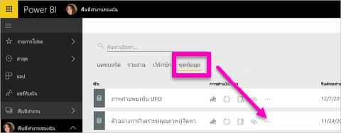
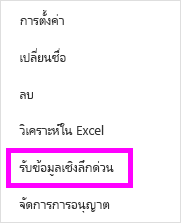
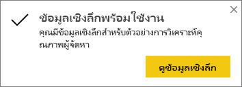
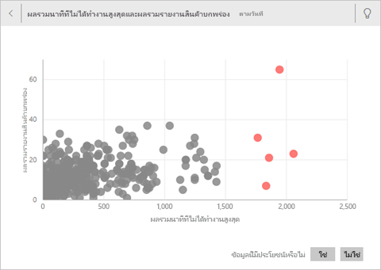
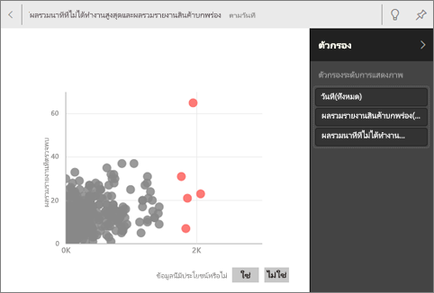
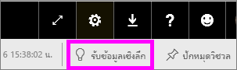
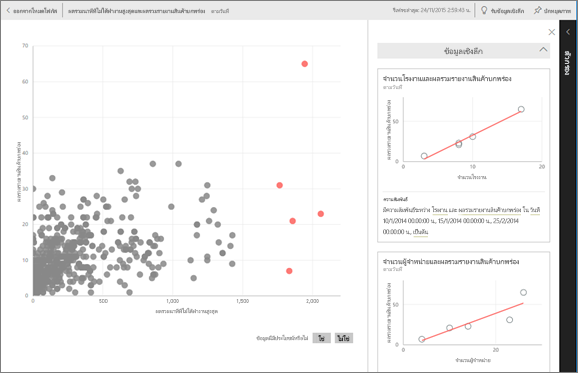

# สร้างข้อมูลเชิงลึกโดยอัตโนมัติด้วย Power BI
คุณมีชุดข้อมูลใหม่ และไม่แน่ใจว่าจะเริ่มใช้งานจากจุดไหนใช่หรือไม่  จำเป็นต้องสร้างแดชบอร์ดอย่างรวดเร็วใช่ไหม  ต้องการค้นหาข้อมูลเชิงลึกที่คุณอาจพลาดไปใช่หรือไม่

เรียกใช้ข้อมูลเชิงลึกด่วนเพื่อสร้างการแสดงภาพที่น่าสนใจโดยยึดตามข้อมูลของคุณ บทความนี้อธิบายวิธีการเรียกใช้ข้อมูลเชิงลึกด่วนบนชุดข้อมูลทั้งหมด (ข้อมูลเชิงลึกด่วน) คุณยังสามารถเรียกใช้ข้อมูลเชิงลึกด่วน [บนไทล์แดชบอร์ดที่เฉพาะเจาะจง](../consumer/end-user-insights.md) (คลุมข้อมูลเชิงลึก) แม้ว่าคุณสามารถเรียกใช้ข้อมูลเชิงลึกบนข้อมูลเชิงลึก

> [!NOTE]
> ข้อมูลเชิงลึกไม่สามารถใช้งานได้กับ DirectQuery ข้อมูลเชิงลึกสามารถใช้งานได้กับข้อมูลที่อัปโหลดไปยัง Power BI เท่านั้น
> 

เราได้สร้างคุณลักษณะเชิงลึกในชุด [ที่เพิ่มขึ้นของอัลกอริทึมเชิงวิเคราะห์ขั้นสูง](../consumer/end-user-insight-types.md) ที่เราพัฒนาขึ้นด้วยการวิจัยของ Microsoft เรายังคงใช้อัลกอริทึมเหล่านี้เพื่อช่วยให้บุคคลมากขึ้นในการค้นหาข้อมูลเชิงลึกในรูปแบบใหม่และใช้งานง่าย คุณอาจสนใจในการเรียนรู้วิธีการ [ปรับข้อมูลของคุณให้เหมาะสมสำหรับ](service-insights-optimize.md)ข้อมูลเชิงลึกด่วน

## เรียกใช้ข้อมูลเชิงลึกด่วนบนชุดข้อมูล
ดูอแมนด้าเรียกใช้ข้อมูลเชิงลึกด่วนบนชุดข้อมูลและเปิดความเข้าใจในโหมดโฟกัส อแมนด้าปักหมุดข้อมูลเชิงลึกเป็นไทล์บนแดชบอร์ดจากนั้นจะได้รับความเข้าใจสำหรับไทล์แดชบอร์ด

<iframe width="560" height="315" src="https://www.youtube.com/embed/et_MLSL2sA8" frameborder="0" allowfullscreen></iframe>

ในตอนนี้จะเปิดใช้งานของคุณ สำรวจข้อมูลเชิงลึกโดยใช้ [ตัวอย่างการวิเคราะห์คุณภาพผู้จัดหา](sample-supplier-quality.md)

1. จากแท็บ **ชุดข้อมูล** เลือก **ตัวเลือกเพิ่มเติม** (...) แล้วเลือก **รับข้อมูลเชิงลึกด่วน**
   
    
   
    
2. Power BI ใช้[อัลกอริธึมต่าง ๆ](../consumer/end-user-insight-types.md)เพื่อค้นหาแนวโน้มในชุดข้อมูลของคุณ
   
    
3. ภายในไม่กี่วินาที ข้อมูลเชิงลึกของคุณพร้อม  เลือก **ดูข้อมูลเชิงลึก** เพื่อแสดงภาพ
   
    
   
    > [!NOTE]
    > ชุดข้อมูลบางชุดไม่สามารถสร้างข้อมูลเชิงลึกได้เนื่องจากข้อมูลไม่มีนัยสำคัญทางสถิติ  เมื่อต้องการเรียนรู้เพิ่มเติม ดู[ข้อมูลของคุณสำหรับข้อมูลเชิงลึกที่ปรับให้เหมาะสม](service-insights-optimize.md)
    > 
    
4. แสดงภาพที่แสดงในพิเศษ **ข้อมูลเชิงลึกด่วน** ผืนผ้าใบกับบัตรข้อมูลเชิงลึกที่แยกต่างหาก 32 บัตรแต่ละใบมีแผนภูมิ หรือกราฟ และคำอธิบายสั้น ๆ
   
    

## โต้ตอบกับบัตรข้อมูลเชิงลึก

1. อีกทางหนึ่งคือ เลื่อนไปเหนือภาพแล้วเลือกไอคอนหมุดเพื่อเพิ่มการแสดงภาพไปยังแดชบอร์ด

2. วางเมาส์เหนือการ์ด เลือก **ตัวเลือกเพิ่มเติม** (...) แล้วเลือก **ดูข้อมูลเชิงลึก** 

    หน้าจอข้อมูลเชิงลึกจะเปิดขึ้นในโหมดโฟกัส
   
    
3. ในโหมดโฟกัสคุณสามารถ:
   
   * กรองการแสดงภาพ ถ้าบานหน้าต่างตั **วกรอง** ไม่ได้เปิดอยู่ให้ขยายโดยการเลือกลูกศรทางด้านขวาของหน้าต่าง

       
   * ปักหมุดการ์ดข้อมูลเชิงลึกในแดชบอร์ดโดยการเลือก **ปักหมุดวิชวล**
   * เรียกใช้ข้อมูลเชิงลึกบนการ์ดเองซึ่งมักจะเรียกว่า *ข้อมูลเชิงลึกคลุม* ที่มุมบนขวา เลือกไอคอนหลอดไฟ หรือ **รับข้อมูลเชิงลึก**
     
       
     
     ข้อมูลเชิงลึกจะแสดงทางด้านซ้าย การ์ดใหม่โดยยึดตามข้อมูลในเชิงลึกเดียวเท่านั้นให้แสดงตามด้านขวา
     
       
4. เมื่อต้องการกลับไปยังต้นฉบับข้อมูลเชิงลึกพื้นที่ ที่มุมบนซ้าย เลือก **โหมดโฟกัสออกจาก**

## ขั้นตอนถัดไป
- ถ้าคุณเป็นเจ้าของชุดข้อมูล[ปรับให้เหมาะสมสำหรับข้อมูลเชิงลึกด่วน](service-insights-optimize.md)
- เรียนรู้เกี่ยวกับ[ชนิดของข้อมูลเชิงลึกด่วนที่พร้อมใช้งาน](../consumer/end-user-insight-types.md)

มีคำถามเพิ่มเติมหรือไม่ [ลองไปที่ชุมชน Power BI](https://community.powerbi.com/)
