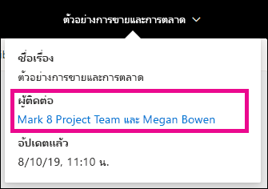
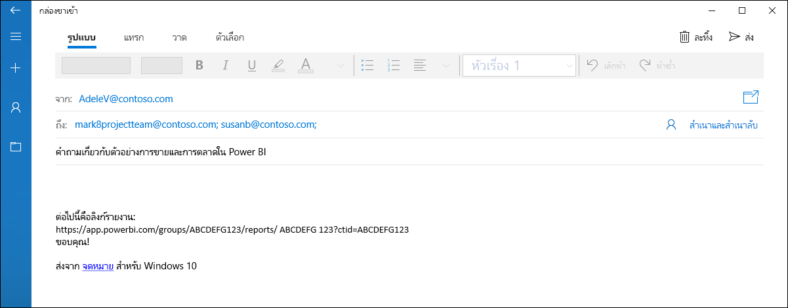
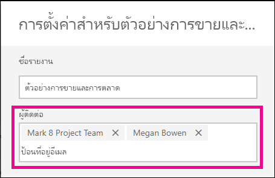
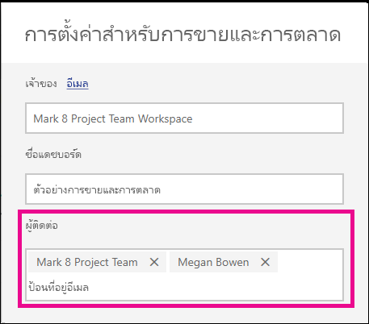

# ตั้งค่าข้อมูลติดต่อสำหรับรายงานและแดชบอร์ดในบริการของ Power BISet contact information for reports and dashboards in the Power BI service
บทความนี้สอนวิธีการตั้งค่าข้อมูลติดต่อสำหรับแดชบอร์ดหรือรายงานในบริการของ Power BIThis article teaches you how to set contact information for a dashboard or report in the Power BI service.

> [!NOTE]
> สามารถตั้งค่าข้อมูลติดต่อสำหรับรายการต่าง ๆ ในพื้นที่ทำงานแบบคลาสสิคหรือแบบใหม่ได้Contact information can be set for items in a classic or new workspace. คุณไม่สามารถตั้งค่าข้อมูลติดต่อสำหรับรายการต่าง ๆ ในพื้นที่ทำงานของฉันYou can't set contact information for items in your My Workspace. บัตรข้อมูลจะแสดงเมื่อดูรายงานหรือแดชบอร์ดใน[รูปลักษณ์ใหม่](../consumer/service-new-look.md)The info card is shown when viewing a report or dashboard in the [new look](../consumer/service-new-look.md).

คุณสามารถเพิ่มผู้ใช้หรือกลุ่มหลายรายลงในผู้ติดต่อสำหรับรายการต่าง ๆ ได้You can add multiple users or groups to the contact for an item. พวกเขาสามารถเป็น:They can be:
* บุคคลA person
* Microsoft 365 GroupA Microsoft 365 group
* อีเมลที่เปิดใช้งานกลุ่มความปลอดภัยAn email enabled security group
* รายการแจกจ่ายA distribution list

ตามค่าเริ่มต้น บุคคลที่สร้างรายงานหรือแดชบอร์ดใหม่คือผู้ติดต่อBy default the person who creates a new report or dashboard is the contact for it. หากคุณตั้งค่าค่าหนึ่ง ค่าดังกล่าวจะแทนที่ค่าเริ่มต้นIf you set a value, it overrides the default. แน่นอนว่าคุณสามารถลบบุคคลหรือกลุ่มทั้งหมดออกจากรายการผู้ติดต่อYou can of course remove all the people or groups from the contact list. เมื่อคุณทำเช่นนี้สำหรับพื้นที่ทำงานแบบคลาสสิก Microsoft 365 Group สำหรับพื้นที่ทำงานจะแสดงขึ้นมาWhen you do this, for classic workspaces, the Microsoft 365 group for the workspace will be shown. สำหรับพื้นที่ทำงานในประสบการณ์ในพื้นที่ทำงานใหม่ จะมีการใช้[รายการผู้ติดต่อของพื้นที่ทำงาน](../collaborate-share/service-create-the-new-workspaces.md#create-a-contact-list)For new workspace experience workspaces, the [workspace contact list](../collaborate-share/service-create-the-new-workspaces.md#create-a-contact-list) will be used. หากไม่ได้ตั้งค่ารายการผู้ติดต่อของพื้นที่ทำงาน ผู้ดูแลระบบพื้นที่ทำงานจะแสดงขึ้นมาIf the workspace contact list is not set, then workspace admins are shown.

ข้อมูลติดต่อจะแสดงบุคคลที่กำลังดูรายการThe contact information is shown to people viewing the item. 

 

เมื่อคุณคลิกที่รายชื่อผู้ติดต่อ จะมีการสร้างอีเมลเพื่อให้คุณสามารถถามข้อสงสัยหรือขอความช่วยเหลือได้When you click the list of contacts, an email is created so you can ask questions or get help. 

 
 
นอกจากนี้ ยังมีการใช้ข้อมูลรายการผู้ติดต่อในสถานที่อื่น ๆThe contact list information is also used in other places. ตัวอย่างเช่น จะปรากฏขึ้นในบางสถานการณ์ข้อผิดพลาดในกล่องโต้ตอบข้อผิดพลาดFor example, it is shown in some error scenarios in the error dialog box. ข้อความอีเมลแบบอัตโนมัติที่เกี่ยวข้องกับรายการจะถูกส่งไปยังรายการผู้ติดต่อ เช่น คำขอการเข้าถึงAutomated email messages related to the item, like access requests, are sent to the contact list. 

> [!NOTE]
> เมื่อเผยแพร่แอป ข้อมูลติดต่อที่ตั้งค่าไว้ในแต่ละรายการจะถูกตั้งค่าเป็นบุคคลที่เผยแพร่หรืออัปเดตแอปWhen publishing an app, the contact information set on individual items is set to the person who published or updated the app. คุณสามารถตั้งค่า URL การสนับสนุนแอปได้ เพื่อให้ผู้ใช้แอปสามารถขอความช่วยเหลือตามที่จำเป็นได้You can set the app support URL so app users get the help they need.

## ตั้งค่าข้อมูลติดต่อสำหรับรายงานSet contact information for a report
1. ในพื้นที่ทำงานของคุณ เลือกแถบ **รายงาน**In your workspace, select the **Reports** tab.
2. ค้นหารายงานที่ต้องการและเลือกไอคอน **การตั้งค่า**Locate the desired report and select the **Settings** icon.
3. ค้นหาเขตข้อมูลการป้อนข้อมูลของ **ผู้ติดต่อ** และตั้งค่าค่าLocate the **Contact** input field and set a value.

     

## ตั้งค่าข้อมูลติดต่อสำหรับแดชบอร์ดSet contact information for a dashboard
1. ในพื้นที่ทำงานของคุณ เลือกแถบ **แดชบอร์ด**In your workspace, select the **Dashboards** tab.
2. ค้นหาแดชบอร์ดที่ต้องการและเลือกไอคอน **การตั้งค่า**Locate the desired dashboard and select the **Settings** icon
3. ค้นหาเขตข้อมูลการป้อนข้อมูลของ **ผู้ติดต่อ** และตั้งค่าค่าLocate the **Contact** input field and set a value.

     

## ข้อจำกัดและข้อควรพิจารณาLimitations and considerations
* ผู้ติดต่อจะถูกตั้งค่าโดยอัตโนมัติสำหรับรายการใหม่ที่สร้างขึ้นในบริการของ Power BIThe contact is set automatically for new items created in the Power BI service. รายการที่มีอยู่จะแสดงค่าเริ่มต้นของพื้นที่ทำงานExisting items will show the workspace default.
* คุณสามารถตั้งค่าผู้ใช้หรือกลุ่มใด ๆ ในรายการผู้ติดต่อ แต่จะไม่ได้รับสิทธิ์กับรายการโดยอัตโนมัติYou can set any user or group in the contact list, but they will not be granted permission to the item automatically. ใช้การแชร์หรือให้ผู้ใช้ที่ต้องการเข้าถึงพื้นที่ทำงานผ่านบทบาทUse sharing or give user who need it access to the workspace through a role. 
* รายการผู้ติดต่อระดับรายการจะไม่ได้รับการส่งไปยังแอปเมื่อมีการเผยแพร่The item level contact list doesn’t get pushed into apps when they are published. ประสบการณ์การนำทางในแอปใหม่มี URL การสนับสนุนที่คุณกำหนดค่าเพื่อช่วยจัดการคำติชมจากผู้ใช้แอปจำนวนมากThe new app navigation experience provides a support URL you configure to help manage feedback from large number of app users.

## ขั้นตอนถัดไปNext steps

มีคำถามเพิ่มเติมหรือไม่More questions? [ลองไปที่ชุมชน Power BITry the Power BI Community](https://community.powerbi.com/)
