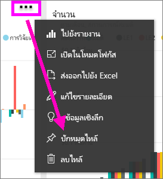
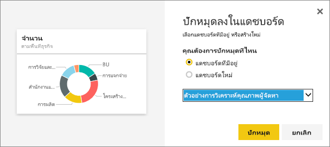
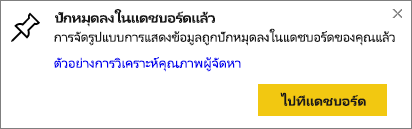

# ปักหมุดไทล์จากแดชบอร์ดหนึ่งไปยังอีกแดชบอร์ดPin a tile from one dashboard to another dashboard
วิธีหนึ่งในการเพิ่ม[แดชบอร์ดไทล์](../consumer/end-user-tiles.md)ใหม่คือ การคัดลอกจากแดชบอร์ดอื่นOne way to add a new [dashboard tile](../consumer/end-user-tiles.md) is by copying it from another dashboard. แต่ละไทล์เหล่านี้ เป็นลิงก์กลับไปยังตำแหน่งที่ถูกสร้างขึ้นเมื่อคลิก ใน Q&A หรือรายงานEach of these tiles, when clicked, is a link back to where it was created -- either in Q&A or a report. 

> [!NOTE]
> คุณไม่สามารถปักหมุดไทล์จากแดชบอร์ดทแชร์ได้You cannot pin tiles from shared dashboards.

## ปักหมุดไทล์ไปยังแดชบอร์ดอื่นPin a tile to another dashboard
1. [รับข้อมูล](../connect-data/service-get-data.md)[Get data](../connect-data/service-get-data.md). ตัวอย่างนี้จะใช้[ตัวอย่างการวิเคราะห IT Spend Analysis ](sample-it-spend.md)This example uses the [IT Spend Analysis sample](sample-it-spend.md).
2. เปิด[แดชบอร์ด](../consumer/end-user-dashboards.md)Open a [dashboard](../consumer/end-user-dashboards.md).
3. วางเมาส์เหนือที่ไทล์คุณต้องการปักหมุด เลือก **ตัวเลือกเพิ่มเติม** (...) และเลือก **ปักหมุดไทล์**Hover over the tile you want to pin, select **More options** (...) and choose **Pin tile**.  
   
   
4. ปักหมุดไทล์ลงในแดชบอร์ดที่มีอยู่ หรือแดชบอร์ดใหม่Pin the tile to an existing dashboard or to a new dashboard. 
   
   * **แดชบอร์ดที่มีอยู่** ให้เลือกชื่อของแดชบอร์ดจากรายการแบบดร๊อปดาวน์**Existing dashboard**: select the name of the dashboard from the dropdown.
   * **แดชบอร์ดใหม่** พิมพ์ชื่อของแดชบอร์ดใหม่**New dashboard**: type the name of the new dashboard.
   
   
5. เลือก **หมุด**Select **Pin**.
   ข้อความว่าสำเร็จแล้ว(ใกล้กับมุมบนขวา) ช่วยให้คุณทราบว่า การแสดงภาพถูกเพิ่มเป็นไทล์ ลงในแดชบอร์ดของคุณA Success message (near the top right corner) lets you know the visualization was added, as a tile, to the selected dashboard.
   
   
6. เลือก **ไปยังแดชบอร์ด** เพื่อดูไทล์ใหม่Select **Go to dashboard** to see the pinned tile. ที่นั่น คุณสามารถ[เปลี่ยนชื่อ ปรับขนาด ลิงก์ และย้าย](service-dashboard-edit-tile.md)การแสดงภาพที่ปักหมุดไว้ได้There, you can [rename, resize, link, and move](service-dashboard-edit-tile.md) the pinned visualization.

## ขั้นตอนถัดไปNext steps
[เปิด ใน Power BITiles in Power BI](../consumer/end-user-tiles.md)  
[แดชบอร์ดใน Power BIDashboards in Power BI](../consumer/end-user-dashboards.md)  
มีคำถามเพิ่มเติมหรือไม่More questions? [ลองไปที่ชุมชน Power BITry the Power BI Community](https://community.powerbi.com/)
