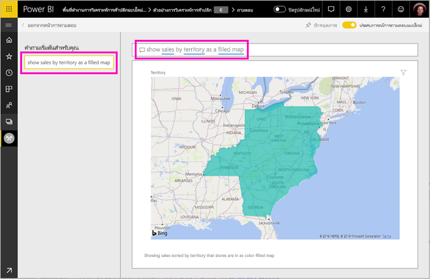

# สร้างคำถามที่น่าสนใจสำหรับ Power BI Q&A
หากคุณมีสิทธิ์แก้ไขสำหรับชุดข้อมูล คุณสามารถเพิ่มคำถามที่แนะนำของคุณเองในชุดข้อมูลนั้น Power BI Q&A จะแสดงคำถามเหล่านั้นให้เพื่อนร่วมงานที่ใช้แดชบอร์ดที่ยึดตามชุดข้อมูลของคุณ  คำถามที่แนะนำนั้นเพื่อให้เพื่อนร่วมงานของคุณมีความคิดเบื้องต้น เกี่ยวกับชนิดของคำถามที่พวกเขาสามารถสอบถามเกี่ยวกับชุดข้อมูล คำถามที่น่าสนใจที่คุณเพิ่มนั้นขึ้นกับคุณ -- เพิ่มคำถามยอดนิยม คำถามที่แสดงผลลัพธ์ที่น่าสนใจ หรือคำถามที่อาจเป็นเรื่องยากที่จะเขียนเป็นวลี

> [!NOTE]
> คำถามที่แนะนำของ Q&A จะพร้อมใช้งานใน[แอป Microsoft Power BI บน iPads, iPhones และอุปกรณ์ iPod Touch](../consumer/mobile/mobile-apps-ios-qna.md)และในบริการ Power BI (app.powerbi.com) การสร้างคำถามจะพร้อมใช้งานเฉพาะในบริการของ Power BI เท่านั้น
> 

## สร้างคำถามที่แนะนำ

บทเรียนนี้ใช้[ตัวอย่างการวิเคราะห์การค้าปลีก](sample-datasets.md) ทำตามคำแนะนำทีละขั้นตอนเหล่านี้เพื่อลองสำรวจชุดข้อมูลด้วยตนเอง

1. บนแดชบอร์ด เลือกกล่องคำถาม Q&A   โปรดสังเกตว่า Q&A ที่มีอยู่มีประโยชน์เพราะแสดงรายการของคำที่ปรากฏในชุดข้อมูล
2. เพื่อเพิ่มลงในรายการนี้ ให้เลือกไอคอนเฟืองที่มุมขวาบนของ Power BI  
   
3. เลือก **การตั้งค่า** &gt; **ชุดข้อมูล** &gt; **ตัวอย่างการวิเคราะห์ร้านค้าปลีก** &gt; **คำถามที่แนะนำใน Q&A**  
4. เลือก **เพิ่มคำถาม**
   
   
5. พิมพ์คำถามของคุณในกล่องข้อความ ตัวอย่างเช่น พิมพ์ "แสดงยอดขายปีที่แล้วตามพื้นที่เป็นแผนที่แถบสี" และเลือก **นำไปใช้**   อีกทางหนึ่งคือเพิ่มคำถามอื่นโดยการเลือก **เพิ่มคำถาม** อีกครั้ง  
   
6. นำทางกลับไปยังแดชบอร์ด Power BI สำหรับตัวอย่างการวิเคราะห์ร้านค้าปลีก และวางเคอร์เซอร์ของคุณในกล่องคำถาม Q&A   
   
7. คำถามแนะนำใหม่ **แสดงยอดขายปีที่แล้วตามพื้นที่เป็นแผนที่แถบสี** เป็นสิ่งแรกในรายการ เลือกมัน  
8. Power BI สร้างคำตอบและแสดงออกมาเป็นการแสดงภาพแผนที่แถบสี  
   

## ขั้นตอนถัดไป

- [การถามตอบสำหรับผู้ใช้](../consumer/end-user-q-and-a.md)  
- [ใช้การถามตอบในแดชบอร์ดและรายงาน](power-bi-tutorial-q-and-a.md)  
- [แนวคิดพื้นฐานสำหรับนักออกแบบในบริการ Power BI](../fundamentals/service-basic-concepts.md)  

มีคำถามเพิ่มเติมหรือไม่ [ลองไปที่ชุมชน Power BI](https://community.powerbi.com/)
