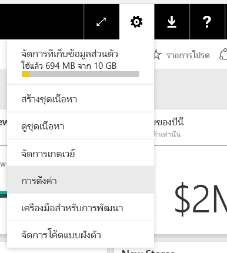
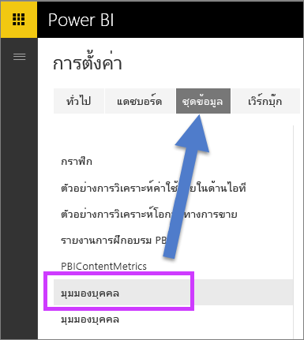

# เปิดใช้งาน Q&A กับการเชื่อมต่อแบบสดใน Power BIEnable Q&A for live connections in Power BI

คุณสามารถนำเข้าชุดข้อมูลมาใน Power BI หรือคุณสามารถสร้าง *การเชื่อมต่อแบบสด* ไปยังพวกนั้นได้You can import datasets into Power BI, or you can create a *live connection* to them. ชุดข้อมูลการเชื่อมต่อแบบสดมักจะอยู่ภายในองค์กรLive connection datasets are often on premises. ถ้าเป็นเช่นนั้น คุณจัดการการเชื่อมต่อแบบสดโดยใช้[เกตเวย์](../connect-data/service-gateway-onprem.md)If so, you manage live connections by using a [gateway](../connect-data/service-gateway-onprem.md). ข้อมูลและการสอบถามจะถูกส่งกลับมาโดยใช้คิวรีแบบสดData and inquiries are sent back and forth using live queries.

> [!NOTE]
> การเชื่อมต่อแบบสดยังสนับสนุนชุดข้อมูล Azure Analysis Services ซึ่งไม่จำเป็นต้องใช้เกตเวย์Live connections also support Azure Analysis Services datasets, which don't require a gateway.

## การถามตอบสำหรับชุดข้อมูลของเกตเวย์ข้อมูลภายในองค์กรQ&A for on-premises data gateway datasets
ถ้าคุณต้องการใช้ Q&A ที่มีชุดข้อมูลที่คุณเข้าถึงผ่านเกตเวย์ คุณจะต้องเปิดใช้งานมันก่อนIf you'd like to use Q&A with datasets you access through a gateway, you'll need to enable them first.

เมื่อเปิดใช้งาน Power BI สร้างดัชนีของแหล่งข้อมูลของคุณและอัปโหลดเซตย่อยของข้อมูลนั้นไปยัง Power BI เพื่อเปิดการใช้งานการถามคำถามOnce enabled, Power BI creates an index of your data source and uploads a subset of that data to Power BI to enable asking questions. ซึ่งอาจใช้เวลาหลายนาทีในการสร้างดัชนีเริ่มต้น และ Power BI รักษาและปรับปรุงดัชนีโดยอัตโนมัติเนื่องจากการเปลี่ยนแปลงของข้อมูลของคุณIt may take several minutes to create the initial index and Power BI maintains and updates the index automatically as your data changes. ใช้ Q&A กับชุดข้อมูลเหล่านี้ซึ่งทำงานเหมือนกับข้อมูลที่เผยแพร่ที่ Power BIUsing Q&A with these datasets behaves the same as with data published to Power BI. ชุดคุณลักษณะที่พร้อมใช้งานในประสบการณ์ถามตอบรองรับทั้งสองกรณีThe full set of features available in the Q&A experience is supported in both cases.

ขณะที่คุณถามคำถามใน Power BI Q&A กำหนดภาพที่ดีที่สุดเพื่อสร้างหรือรายงานแผ่นงานที่จะใช้เพื่อให้สามารถตอบคำถามของคุณโดยใช้ดัชนีของชุดข้อมูลของคุณAs you ask questions in Power BI, Q&A determines the best visual to construct or report sheet to use to answer your question using an index of your dataset. หลังจากพิจารณาคำตอบที่เป็นไปได้ที่ดีที่สุด Q&A ใช้ DirectQuery เพื่อดึงข้อมูลสดจากแหล่งข้อมูลผ่านทางเกตเวย์เพื่อวางข้อมูลในแผนภูมิและกราฟAfter determining the best potential answer, Q&A uses DirectQuery to fetch live data from the data source via the gateway to populate charts and graphs. ด้วยเหตุนี้ การถามตอบของ Power BI จะแสดงข้อมูลล่าสุดโดยตรงจากแหล่งข้อมูลต้นแบบเสมอAs a result, Power BI Q&A always shows the most up-to-date data directly from the underlying data source.

เนื่องจาก Power BI Q&A ใช้ข้อความและค่าโครงสร้างจากแหล่งข้อมูลของคุณเพื่อกำหนดวิธีการคิวรี่แบบจำลองที่เกี่ยวข้องเพื่อหาคำตอบ ค้นหาค่าข้อความโเฉพาะแบบใหม่ หรือลบค่าข้อความ (เช่นการสอบถามรายชื่อลูกค้าที่เกี่ยวข้องกับรายการข้อความที่เพิ่งเพิ่มเข้ามา) ขึ้นกับว่าอัชนีนั้นถูกอัปเดตด้วยค่าล่าสุดหรือไม่Since Power BI Q&A uses the text and schema values from your data source to determine how to query the underlying model for answers, searches for specific new or deleted text values (such as asking for a customer name related to a newly added text record) rely on the index being up-to-date with the latest values. Power BI จะรักษาดัชนีข้อความและเค้าร่างให้เป็นปัจจุบันโดยอัตโนมัติภายในหน้าต่าง 60 นาทีของการเปลี่ยนแปลงPower BI automatically keeps the text and schema index up to date within a 60-minute window of changes.

สำหรับข้อมูลเพิ่มเติม ให้ด:For more information, see:

* อะไรคือ [เกตเวย์ข้อมูลภายในองค์กร](../connect-data/service-gateway-onprem.md)What is the [on-premises data gateway](../connect-data/service-gateway-onprem.md)?
* [การถามตอบของ Power BI สำหรับผู้ใช้Power BI Q&A for consumers](../consumer/end-user-q-and-a.md)

## เปิดใช้งาน Q&AEnable Q&A
เมื่อคุณได้ติดตั้งเกตเวย์ข้อมูล ให้เชื่อมต่อกับข้อมูลของคุณจาก Power BIOnce you have the data gateway set up, connect to your data from Power BI.  สร้างแดชบอร์ดโดยใช้ข้อมูลภายในองค์กรของคุณ หรืออัปโหลดไฟล์.pbix ที่ใช้ข้อมูลภายในองค์กรEither create a dashboard using your on-premises data, or upload a .pbix file that uses on-premises data.  คุณอาจยังมีข้อมูลภายในองค์กรในแดชบอร์ด รายงาน และชุดข้อมูลที่แชร์กับคุณYou may also already have on-premises data in dashboards, reports, and datasets that have been shared with you.

1. ที่มุมขวาบนของ Power BI เลือกไอคอนเฟืองและเลือก **ตั้งค่า**In the upper-right corner of Power BI, select the cog icon  and choose **Settings**.
   
   
2. เลือก **ชุดข้อมูล** และเลือกชุดข้อมูลเพื่อเปิดการใช้งาน Q&ASelect **datasets** and choose the dataset to enable for Q&A.
   
   
3. ขยาย **การถามตอบ** เลือกกล่องกาเครื่องหมายเพื่อ **เปิดใช้งานการถามตอบสำหรับชุดข้อมูลนี้** แล้วเลือก **นำไปใช้**Expand **Q&A**, select the checkbox for **Turn on Q&A for this dataset**, and choose **Apply**.
   
    

## มีแคชข้อมูลอะไร และวิธีการป้องกันความเป็นส่วนตัวอย่างไรWhat data is cached and how is privacy protected?
เมื่อคุณเปิดใช้งาน Q&A สำหรับข้อมูลภายในองค์กรของคุณ เซตย่อยของข้อมูลของคุณจะถูกเก็บไว้ในเซอร์วิซWhen you enable Q&A for your on-premises data, a subset of your data is cached in the service. การแคชข้อมูลนี้ช่วยให้แน่ใจว่าการถามตอบทำงานด้วยประสิทธิภาพที่เหมาะสมThis caching ensures that Q&A works with a reasonable performance. Power BI แยกค่าที่ยาวกว่า 24 อักขระออกจากแคชPower BI excludes values longer than 24 characters from caching. แคชจะถูกลบภายในไม่กี่ชั่วโมงเมื่อคุณปิดใช้งาน Q&A โดยการยกเลิก **เปิดใช้งาน Q&A สำหรับข้อมูลนี้** หรือเมื่อคุณลบชุดข้อมูลของคุณThe cache is deleted within a few hours when you disable Q&A by unchecking **Turn on Q&A for this dataset**, or when you delete your dataset.

## ข้อควรพิจารณาและการแก้ไขปัญหาConsiderations and troubleshooting
คุณลักษณะมีข้อจำกัดบางอย่าง:The feature has some limitations:

* โดยเริ่มต้นฟีเจอร์เฉพาะสำหรับแหล่งข้อมูล SQL Server 2016 Analysis Services แบบตารางInitially the feature is only available for SQL Server 2016 Analysis Services Tabular data sources. ฟีเจอร์ที่ปรับให้เหมาะสมเพื่อทำงานกับข้อมูลแบบตารางThe feature is optimized to work with tabular data. ประสบการณ์การถามตอบยังไม่ได้รับการสนับสนุนสำหรับข้อมูลหลายมิติThe Q&A experience isn't yet supported for multi-dimensional. แหล่งข้อมูลเพิ่มเติมที่ได้รับการรองรับโดยเกตเวย์ข้อมูลภายในองค์กรจะมีการเผยแพร่เมื่อเวลาผ่านไปAdditional data sources supported by the on-premises data gateway will be rolled out over time.
* การรองรับแบบเต็มสำหรับความปลอดภัยระดับแถวที่กำหนดไว้ใน SQL Server Analysis Services นั้นเบื้องต้นไม่สามารถใช้งานได้Full support for row-level security defined in SQL Server Analysis Services isn't available initially. ในขณะที่การถามคำถามในการถามตอบ "การเติมคำแบบอัตโนมัติ" ของคำถามในขณะที่พิมพ์สามารถแสดงค่าสตริงที่ผู้ใช้ไม่สามารถเข้าถึงได้While asking questions in Q&A, the “autocomplete” of questions while typing can show string values a user doesn't have access to. อย่างไรก็ตาม RLS ที่กำหนดไว้ในแบบจำลองจะถูกทำในรายงานและแผนภูมิภาพเพื่อให้สามารถแสดงข้อมูลเป็นตัวเลขที่ไม่มีขีดเส้นใต้However, RLS defined in the model is respected for report and chart visuals so no underlying numerical data can be exposed. ตัวเลือกเพื่อควบคุมลักษณะการทำงานนี้จะถูกเผยแพร่ในการปรับปรุงที่จะมาถึงOptions to control this behavior will be released in coming updates.
* ไม่สนับสนุนการรักษาความปลอดภัยระดับออบเจ็กต์ (OLS)Object level security (OLS) isn't supported. การถามตอบไม่คำนึงถึงความปลอดภัยระดับออบเจ็กต์ และสามารถแสดงชื่อตารางหรือคอลัมน์ให้แก่ผู้ใช้ที่ไม่มีสิทธิเข้าถึงQ&A doesn't respect object level security and can reveal table or column names to users who don't have access to them. คุณควรเปิดใช้งาน RLS เพื่อให้แน่ใจว่า ค่าข้อมูลมีการรักษาความปลอดภัยอย่างเหมาะสมYou should enable RLS to ensure data values are secured appropriately as well. 
* การเชื่อมต่อแบบสดเท่านั้นที่ได้รับการรองรับด้วยเกตเวย์ข้อมูลภายในองค์กรLive connections are only supported with the on-premises data gateway. ดังนั้นคุณลักษณะนี้จึงไม่สามารถใช้กับเกตเวย์ส่วนบุคคลได้As a result, this feature can't be used with the personal gateway.

## ขั้นตอนถัดไปNext steps

- [On-premises data gateway (เกตเวย์ข้อมูลภายในองค์กร)On-premises data gateway](../connect-data/service-gateway-onprem.md)  
- [จัดการแหล่งข้อมูลของคุณ - Analysis ServicesManage your data source - Analysis Services](../connect-data/service-gateway-enterprise-manage-ssas.md)  
- [แนวคิดพื้นฐานสำหรับนักออกแบบในบริการ Power BIBasic concepts for designers in the Power BI service](../fundamentals/service-basic-concepts.md)  
- [ภาพรวม Power BI Q&APower BI Q&A Overview](../consumer/end-user-q-and-a.md)  

มีคำถามเพิ่มเติมหรือไม่More questions? [ลองถามชุมชน Power BITry asking the Power BI Community](https://community.powerbi.com/)
