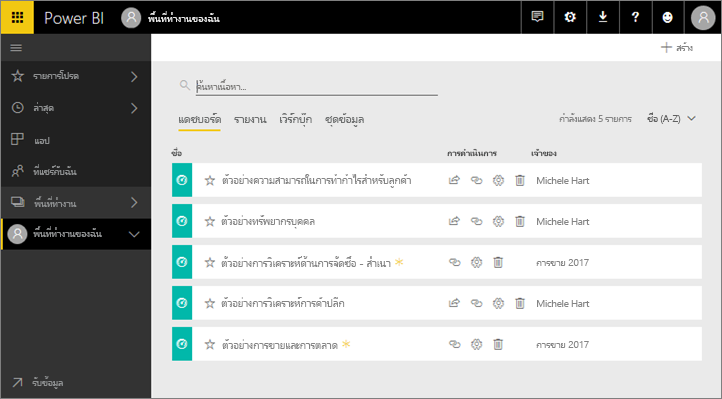
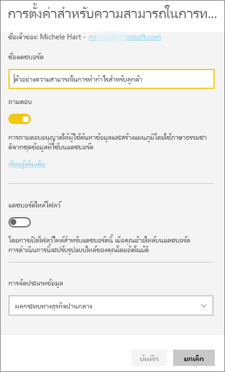
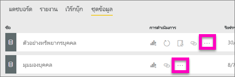
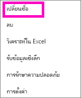
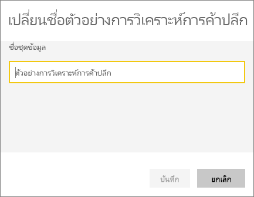
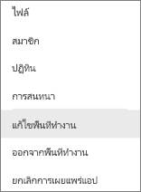
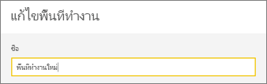
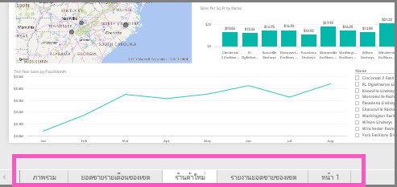
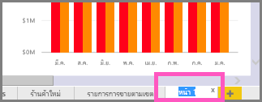
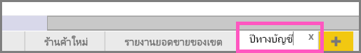

# เปลี่ยนชื่อเกือบทุกสิ่งใน Power BI serviceRename almost anything in Power BI service
บทความนี้สอนวิธีการเปลี่ยนชื่อแดชบอร์ด รายงาน หน้ารายงาน เวิร์กบุ๊ก ชุดข้อมูล แอปฯ และพื้นที่ทำงานในบริการ Power BI serviceThis article teaches you how to rename a dashboard, report, report page, workbook, dataset, app, and workspace in Power BI service.

**ฉันสามารถเปลี่ยนชื่อได้อย่างไร****Can I change the name?**

| ชนิดเนื้อหาContent type | ฉันเป็นผู้เขียนหรือผู้สร้างI'm the author or creator | แชร์กับฉันแล้วShared with me |
| --- | --- | --- |
| แดชบอร์ดในพื้นที่ทำงานDashboard in a workspace |ใช่Yes |ไม่ใช่No |
| รายงานในพื้นที่ทำงานReport in a workspace |ใช่Yes |ไม่ใช่No |
| สมุดงานในพื้นที่ทำงานWorkbook in a workspace |ใช่Yes |ไม่ใช่No |
| ชุดข้อมูลในพื้นที่ทำงานDataset in a workspace |ใช่Yes |ไม่ใช่No |
| พื้นที่ทำงานworkspace |ใช่ ถ้าคุณเป็นเจ้าของ หรือมีสิทธิ์ระดับผู้ดูแลระบบYes, if you are the owner or have Admin permissions |ไม่ใช่No |
| แอปที่เผยแพร่แล้วPublished apps |ไม่ใช่จากหน้าจอแอป แต่ชื่อแอปสามารถเปลี่ยนจากพื้นที่ทำงาน และเผยแพร่ใหม่ด้วยชื่อใหม่ถ้าคุณมีสิทธิ์ระดับผู้ดูแลระบบNot from the App screen, but the app name can be changed from the workspace and re-published with a new name if you have Admin permissions |ไม่ใช่No |
| เนื้อหาของแอป (แดชบอร์ด รายงาน เวิร์กบุ๊ก ชุดข้อมูล)App content (dashboard, report, workbook, dataset) |ไม่ใช่จากหน้าจอแอป แต่เนื้อหาของแอปสามารถเปลี่ยนชื่อได้จากพื้นที่ทำงาน และเผยแพร่ใหม่ด้วยชื่อใหม่ถ้าคุณมีสิทธิ์ระดับผู้ดูแลระบบNot from the App screen, but the app's content can be renamed from the workspace and re-published with a new name if you have Admin permissions |ไม่ใช่No |
| เนื้อหาใน **แชร์กับฉัน**Content in **Shared with me** |ไม่ใช่No |ไม่ใช่No |

## เปลี่ยนชื่อแดชบอร์ด รายงาน หรือเวิร์กบุ๊กRename a dashboard, report, or workbook
1. เริ่มต้นในพื้นที่ทำงานและเลือก **แดชบอร์ด** **รายงาน** หรือแท็บ **สมุดงาน** เลื่อนเมาส์หนือรายการที่จะเปลี่ยนชื่อ แล้วเลือกไอคอนรูปเฟืองStart in a workspace and select the **Dashboards**, **Reports**, or **Workbooks** tab. Hover over the item to rename, and select the gear icon . ถ้าไม่มีไม่มีไอคอนรูปเฟือง คุณไม่มีสิทธิ์ในการเปลี่ยนชื่อIf there is no gear icon, you do not have permissions to rename.
   
   
2. บนหน้าการตั้งค่า พิมพ์ชื่อใหม่ แล้วเลือก **บันทึก**On the Settings page, type the new name and select **Save**.
   
   

## เปลี่ยนชื่อชุดข้อมูลRename a dataset
1. เริ่มต้นในพื้นที่ทำงานและเลือกแท็บ **ชุดข้อมูล**Start in a workspace and select the **Datasets** tab.
   
   
2. วางเมาส์เหนือรายการที่จะเปลี่ยนชื่อ เลือก **ตัวเลือกเพิ่มเติม** (...) และเลือก **เปลี่ยนชื่อ**Hover over the item to rename, select **More options** (...), and choose **Rename**.  
   
      
   
   > [!NOTE]
   > ตัวเลือกในดรอปดาวน์ลงจะแตกต่างออกไปThe options in the dropdown will vary.
   > 
   > 
3. บนหน้าการตั้งค่า พิมพ์ชื่อใหม่ แล้วเลือก **บันทึก**On the Settings page, type a new name and select **Save**.
   
     

## เปลี่ยนชื่อพื้นที่ทำงานRename a workspace
ทุกคนที่มีสิทธิ์ระดับผู้ดูแลระบบสามารถเปลี่ยนชื่อพื้นที่ทำงานได้Anyone with Admin permissions can rename a workspace.

1. เริ่มในพื้นที่ทำงานแอปฯที่คุณต้องการเปลี่ยนชื่อStart in the workspace you'd like to rename.
2. ที่มุมบนขวา เลือก **ตัวเลือกเพิ่มเติม** (...) แล้วเลือก **แก้ไขพื้นที่ทำงาน**In the top-right corner, select **More options** (...) and choose **Edit workspace**. ถ้าคุณไม่เห็นตัวเลือกนี้ คุณไม่มีสิทธิ์ในการเปลี่ยนชื่อพื้นที่ทำงานนี้If you don't see this option, then you don't have permissions to rename this workspace. 
   
    
3. พิมพ์ชื่อพื้นที่ทำงานใหม่ และเลือก **บันทึก**Type a new workspace name and select **Save**.
   
   

## เปลี่ยนชื่อหน้าในรายงานRename a page in a report
ไม่ชอบชื่อของหน้าในรายงาน Power BI ของคุณใช่ไหมDon't like the name of a page in your Power BI report?  เปลี่ยนชื่อใหม่ เพียงคลิกเดียวA new name is just a click away. สามารถเปลี่ยนชื่อใน[มุมมองการแก้ไขรายงาน](service-interact-with-a-report-in-editing-view.md)ได้Pages can be renamed in [report Editing view ](service-interact-with-a-report-in-editing-view.md).

1. เปิดรายงานใน[มุมมองการแก้ไข](../consumer/end-user-reading-view.md)Open the report in [Editing View](../consumer/end-user-reading-view.md).
2. ค้นหาแท็บหน้ารายงานที่ด้านล่างของหน้าต่าง Power BILocate the report page tabs at the bottom of the Power BI window.
   
    
3. เปิดหน้ารายงานที่คุณต้องการเปลี่ยนชื่อ โดยเลือกแท็บOpen the report page that you'd like to rename by selecting the tab.
4. ดับเบิลคลิกชื่อบนแท็บเพื่อไฮไลต์Double-click the name on the tab to highlight it.  
   
    
5. พิมพ์ชื่อหน้ารายงานใหม่ แล้วเลือก ENTERType a new report page name and select ENTER.
   
    

## ข้อควรพิจารณาและการแก้ไขปัญหาConsiderations and troubleshooting
* ถ้ารายการที่ถูกเปลี่ยนชื่อได้แชร์กับคุณ หรือเป็นส่วนหนึ่งของชุดเนื้อหา คุณจะไม่เห็นไอคอนรูปเฟือง และคุณจะไม่สามารถเข้าถึงการตั้งค่าIf the item to be renamed has been shared with you, or is part of a content pack, you won't see the gear icon and you won't have access to Settings.
* บนแท็บ **ชุดข้อมูล** ถ้าคุณไม่เห็น **ตัวเลือกเพิ่มเติม** (...) ให้ขยายหน้าต่างเบราว์เซอร์ของคุณOn the **Datasets** tab, if you don't see **More options** (...), expand your browser window.

มีคำถามเพิ่มเติมหรือไม่More questions? [ลองไปที่ชุมชน Power BITry the Power BI Community](https://community.powerbi.com/)
