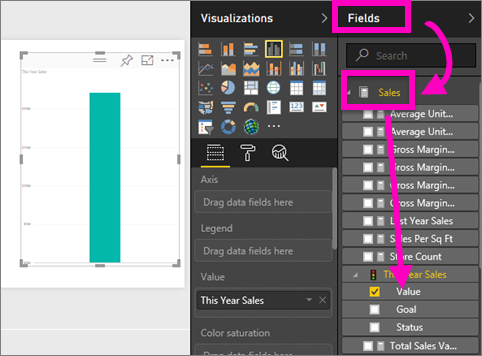
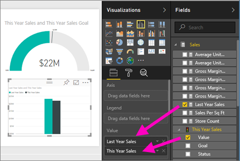
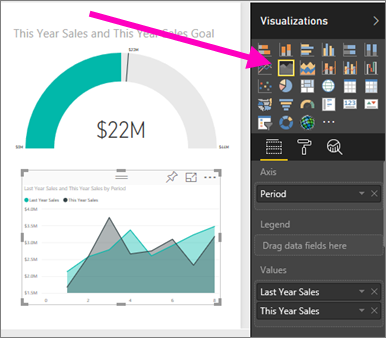

# สร้างรายงานจากไฟล์ Excel ในบริการของ Power BI
คุณได้อ่าน[รายงานใน Power BI](../consumer/end-user-reports.md)และตอนนี้ คุณต้องการสร้างรายงานของคุณเอง มีหลายวิธีในการสร้างรายงาน ในบทความนี้ เราจะเริ่มต้นด้วยการสร้างรายงานพื้นฐานในบริการของ Power BI จากไฟล์ Excel เมื่อคุณทำความเข้าใจพื้นฐานของการสร้างรายงาน ตรวจดู[ขั้นตอนถัดไป](#next-steps)ที่ด้านล่างสำหรับหัวข้อการรายงานขั้นสูงเพิ่มเติม  

## ข้อกำหนดเบื้องต้น
- [ลงทะเบียนสำหรับบริการของ Power BI](../fundamentals/service-self-service-signup-for-power-bi.md) 
- [ดาวน์โหลดไฟล์ Excel ตัวอย่างการวิเคราะห์การค้าปลีก](https://go.microsoft.com/fwlink/?LinkId=529778) และบันทึกลงในคอมพิวเตอร์ของคุณหรือไปยัง OneDrive for Business

## นำเข้าไฟล์ Excel
วิธีการสร้างรายงานนี้เริ่มต้น ด้วยไฟล์และพื้นทีรายงานที่ว่างเปล่า คุณสามารถทำตามในไฟล์ Excel ตัวอย่างของการวิเคราะห์ร้านค้าปลีก

1. ในบานหน้าต่างการนำทาง ให้เลือก **พื้นที่ทำงานของฉัน**
   
   :::image type="content" source="media/service-report-create-new/power-bi-select-my-workspace.png" alt-text="สกรีนช็อตของการเลือก พื้นที่ทำงานของฉัน":::
2. จากด้านล่างของบานหน้าต่างนำทาง เลือก **รับข้อมูล**
   
   
3. เลือก **แฟ้ม** และนำทางไปยังตำแหน่งที่คุณบันทึกตัวอย่างการวิเคราะห์ร้านค้าปลีก
   
    
4. สำหรับการดำเนินการนี้ เลือก **นำเข้า**
   
   
5. เลือก **เปิด**

   เมื่อนำเข้าไฟล์ Excel แล้ว ระบบจะแสดงเป็น *ชุดข้อมูล* ในรายการพื้นที่ทำงาน

1. เลือก **ตัวเลือกเพิ่มเติม (...)** ที่อยู่ถัดจากชุดข้อมูล แล้วเลือก **สร้างรายงาน**
   
   :::image type="content" source="media/service-report-create-new/power-bi-dataset-create-report.png" alt-text="สกรีนช็อตของการเลือก สร้างรายงาน":::
6. ตัวแก้ไขรายงานจะเปิดขึ้น 
   
   

> [!TIP]
> เลือกไอคอนเมนูเพื่อซ่อนบานหน้าต่างนำทาง เพื่อให้คุณมีพื้นที่มากขึ้น
> 
> :::image type="content" source="../media/power-bi-hide-navigation-pane.png" alt-text="สกรีนช็อตของเลือกไอคอนเมนู เพื่อซ่อนบานหน้าต่างนำทาง":::

## เพิ่มการวัดรัศมีลงในรายงาน
หลังจากที่ชุดข้อมูลของเราจะถูกนำเข้า มาเริ่มต้นการตอบคำถามบางอย่าง  เราหัวหน้าฝ่ายตลาดเจ้าหน้าที่ (CMO) ต้องการทราบเกี่ยวกับวิธีปิดเราที่การประชุมเป้าหมายการขายของปีนี้ การวัดจะเป็น[ตัวเลือกการแสดงภาพที่ดี](../visuals/power-bi-report-visualizations.md)สำหรับการแสดงข้อมูลชนิดนี้

1. ในบานหน้าต่างเขตข้อมูล เลือก **ยอดขาย** > **ค่ายอดขายของปี** > **นี้**
   
    
2. แปลงภาพเป็นการวัด โดยการเลือกเทมเพลวัดจาก **หน้าต่าง** แสดงภาพ
   
    
3. ลาก **ยอดขาย** > **เป้าหมายยอดขาย** > **ของปีนี้** เพื่อ **ค่าเป้าหมาย** กัน ดูเหมือนว่าเรากำลังใกล้เคียงกับเป้าหมายของเรามาก
   
    
4. ในตอนนี้เป็นเวลาที่เหมาะสมที่จะบันทึกรายงานของคุณ
   
   

## เพิ่มชาร์ตพื้นที่และ slicer ในรายงาน
CMO ของเรามีคำถามบางอย่างเพิ่มเติมให้แก่เรา พวกเขาต้องการทราบวิธีการเปรียบเทียบยอดขายของปีนี้กับปีที่แล้ว และพวกเขาต้องการดูผลลัพธ์ตามเขต

1. ก่อนอื่น มาสร้างพื้นที่ว่างในพื้นที่รายงานก่อน เลือกตัววัด และย้ายไปมุมบนขวา จากนั้น จับ และลากมุมหนึ่ง และทำให้เล็กลง
2. ยกเลิกเลือกตัววัด ในบานหน้าต่างเขตข้อมูล เลือก **ยอดขาย** > **ค่ายอดขายของปีนี้** > **นี้** เลือก **ขาย** > **ยอดขายของปีที่แล้ว**
   
    
3. แปลงภาพเป็นแผนภูมิพื้นที่โดยเลือกเทมเพลตแผนภูมิพื้นที่จาก **หน้าต่าง** แสดงภาพ
4. เลือก **เวลา** > **รอบระยะเวลา** เพื่อเพิ่มไปยัง **แกน** กัน
   
    
5. เมื่อต้องการเรียงลำดับการแสดงภาพ โดยรอบระยะเวลา เลือกจุดไข่ปลา แล้วเลือก **เรียงลำดับตามระยะเวลา**
6. ตอนนี้มาเพิ่มตัวแบ่งส่วนข้อมูล เลือกพื้นที่ว่างบนพื้นที่รายงาน และเลือกตัวแบ่งส่วนข้อมูล  แม่แบบ ตอนนี้เรามีตัวแบ่งส่วนข้อมูลที่ว่างเปล่าบนพื้นที่ทำงานของเรา
   
        
7. จากบานหน้าต่างเขตข้อมูล เลือก **เขต** > **เขต** ย้าย และปรับขนาดตัวแบ่งส่วนข้อมูล
   
      
8. ใช้ตัวแบ่งส่วนข้อมูลเพื่อค้นหารูปแบบและข้อมูลเชิงลึก โดยเขต
   
     

สำรวจข้อมูลของคุณ และเพิ่มการแสดงภาพต่อไป เมื่อคุณค้นหาข้อมูลเชิงลึกที่น่าสนใจโดยเฉพาะอย่างยิ่ง[ปักหมุดเหล่านั้นไปยังแดชบอร์ด](service-dashboard-pin-tile-from-report.md)

## ขั้นตอนถัดไป

* [ปักหมุดภาพไปยังแดชบอร์ด](service-dashboard-pin-tile-from-report.md)
* [เปลี่ยนการตั้งค่ารายงานในบริการของ Power BI](power-bi-report-settings.md)
* มีคำถามเพิ่มเติมหรือไม่ [ลองไปที่ชุมชน Power BI](https://community.powerbi.com/)
