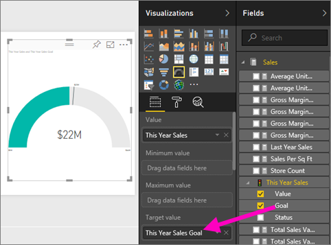

# สร้างรายงานจากไฟล์ Excel ในบริการของ Power BICreate a report from an Excel file in the Power BI service
คุณได้อ่าน[รายงานใน Power BI](../consumer/end-user-reports.md)และตอนนี้ คุณต้องการสร้างรายงานของคุณเองYou've read [Reports in Power BI](../consumer/end-user-reports.md) and now you want to create your own. มีหลายวิธีในการสร้างรายงานThere are different ways to create a report. ในบทความนี้ เราจะเริ่มต้นด้วยการสร้างรายงานพื้นฐานในบริการของ Power BI จากไฟล์ ExcelIn this article, we start by creating a basic report in the Power BI service from an Excel file. เมื่อคุณทำความเข้าใจพื้นฐานของการสร้างรายงาน ตรวจดู[ขั้นตอนถัดไป](#next-steps)ที่ด้านล่างสำหรับหัวข้อการรายงานขั้นสูงเพิ่มเติมOnce you understand the basics of creating a report, check out the [Next steps](#next-steps) at the end for more advanced report topics.  

## ข้อกำหนดเบื้องต้นPrerequisites
- [ลงทะเบียนสำหรับบริการของ Power BI](../fundamentals/service-self-service-signup-for-power-bi.md)[Sign up for the Power BI service](../fundamentals/service-self-service-signup-for-power-bi.md). 
- [ดาวน์โหลดไฟล์ Excel ตัวอย่างการวิเคราะห์การค้าปลีก](https://go.microsoft.com/fwlink/?LinkId=529778) และบันทึกลงในคอมพิวเตอร์ของคุณหรือไปยัง OneDrive for Business[Download the Retail Analysis sample Excel file](https://go.microsoft.com/fwlink/?LinkId=529778) and save it to your computer or to OneDrive for Business.

## นำเข้าไฟล์ ExcelImport the Excel file
วิธีการสร้างรายงานนี้เริ่มต้น ด้วยไฟล์และพื้นทีรายงานที่ว่างเปล่าThis method of creating a report starts with a file and a blank report canvas. คุณสามารถทำตามในไฟล์ Excel ตัวอย่างของการวิเคราะห์ร้านค้าปลีกYou can follow along in the Retail Analysis sample Excel file.

1. ในบานหน้าต่างการนำทาง ให้เลือก **พื้นที่ทำงานของฉัน**In the navigation pane, select **My Workspace**.
   
   :::image type="content" source="media/service-report-create-new/power-bi-select-my-workspace.png" alt-text="สกรีนช็อตของการเลือก พื้นที่ทำงานของฉัน":::
2. จากด้านล่างของบานหน้าต่างนำทาง เลือก **รับข้อมูล**From the bottom of the nav pane, select **Get data**.
   
   
3. เลือก **แฟ้ม** และนำทางไปยังตำแหน่งที่คุณบันทึกตัวอย่างการวิเคราะห์ร้านค้าปลีกSelect **Files** and navigate to the location where you saved the Retail Analysis sample.
   
    
4. สำหรับการดำเนินการนี้ เลือก **นำเข้า**For this exercise, select **Import**.
   
   
5. เลือก **เปิด**Select **Open**.

   เมื่อนำเข้าไฟล์ Excel แล้ว ระบบจะแสดงเป็น *ชุดข้อมูล* ในรายการพื้นที่ทำงานOnce the Excel file is imported, it's listed as a *dataset* in the workspace list.

1. เลือก **ตัวเลือกเพิ่มเติม (...)** ที่อยู่ถัดจากชุดข้อมูล แล้วเลือก **สร้างรายงาน**Select **More options (...)** next to the dataset, and select **Create report**.
   
   :::image type="content" source="media/service-report-create-new/power-bi-dataset-create-report.png" alt-text="สกรีนช็อตของการเลือก สร้างรายงาน":::
6. ตัวแก้ไขรายงานจะเปิดขึ้นThe report editor opens. 
   
   

> [!TIP]
> เลือกไอคอนเมนูเพื่อซ่อนบานหน้าต่างนำทาง เพื่อให้คุณมีพื้นที่มากขึ้นSelect the menu icon to hide the navigation pane, to give you more room.
> 
> :::image type="content" source="../media/power-bi-hide-navigation-pane.png" alt-text="สกรีนช็อตของเลือกไอคอนเมนู เพื่อซ่อนบานหน้าต่างนำทาง":::

## เพิ่มการวัดรัศมีลงในรายงานAdd a Radial Gauge to the report
หลังจากที่ชุดข้อมูลของเราจะถูกนำเข้า มาเริ่มต้นการตอบคำถามบางอย่างNow that our dataset is imported, let's start answering some questions.  เราหัวหน้าฝ่ายตลาดเจ้าหน้าที่ (CMO) ต้องการทราบเกี่ยวกับวิธีปิดเราที่การประชุมเป้าหมายการขายของปีนี้Our Chief Marketing Officer (CMO) wants to know how close we are to meeting this year's sales goals. การวัดจะเป็น[ตัวเลือกการแสดงภาพที่ดี](../visuals/power-bi-report-visualizations.md)สำหรับการแสดงข้อมูลชนิดนี้A Gauge is a [good visualization choice](../visuals/power-bi-report-visualizations.md) for displaying this type of information.

1. ในบานหน้าต่างเขตข้อมูล เลือก **ยอดขาย** > **ค่ายอดขายของปี** > **นี้**In the Fields pane, select **Sales** > **This Year Sales** > **Value**.
   
    
2. แปลงภาพเป็นการวัด โดยการเลือกเทมเพลวัดจาก **หน้าต่าง** แสดงภาพConvert the visual to a Gauge by selecting the Gauge template  from the **Visualizations** pane.
   
    
3. ลาก **ยอดขาย** > **เป้าหมายยอดขาย** > **ของปีนี้** เพื่อ **ค่าเป้าหมาย** กันDrag **Sales** > **This Year Sales** > **Goal** to the **Target value** well. ดูเหมือนว่าเรากำลังใกล้เคียงกับเป้าหมายของเรามากLooks like we're very close to our goal.
   
    
4. ในตอนนี้เป็นเวลาที่เหมาะสมที่จะบันทึกรายงานของคุณNow would be a good time to save your report.
   
   

## เพิ่มชาร์ตพื้นที่และ slicer ในรายงานAdd an area chart and slicer to the report
CMO ของเรามีคำถามบางอย่างเพิ่มเติมให้แก่เราOur CMO has some additional questions for us to answer. พวกเขาต้องการทราบวิธีการเปรียบเทียบยอดขายของปีนี้กับปีที่แล้วThey'd like to know how sales this year compare to last year. และพวกเขาต้องการดูผลลัพธ์ตามเขตAnd, they'd like to see the findings by district.

1. ก่อนอื่น มาสร้างพื้นที่ว่างในพื้นที่รายงานก่อนFirst, let's make some room on our canvas. เลือกตัววัด และย้ายไปมุมบนขวาSelect the Gauge and move it into the top-right corner. จากนั้น จับ และลากมุมหนึ่ง และทำให้เล็กลงThen grab and drag one of the corners and make it smaller.
2. ยกเลิกเลือกตัววัดDeselect the gauge. ในบานหน้าต่างเขตข้อมูล เลือก **ยอดขาย** > **ค่ายอดขายของปีนี้** > **นี้** เลือก **ขาย** > **ยอดขายของปีที่แล้ว**In the Fields pane, select **Sales** > **This Year Sales** > **Value** and select **Sales** > **Last Year Sales**.
   
    
3. แปลงภาพเป็นแผนภูมิพื้นที่โดยเลือกเทมเพลตแผนภูมิพื้นที่จาก **หน้าต่าง** แสดงภาพConvert the visual to an Area chart by selecting the Area chart template  from the **Visualizations** pane.
4. เลือก **เวลา** > **รอบระยะเวลา** เพื่อเพิ่มไปยัง **แกน** กันSelect **Time** > **Period** to add it to the **Axis** well.
   
    
5. เมื่อต้องการเรียงลำดับการแสดงภาพ โดยรอบระยะเวลา เลือกจุดไข่ปลา แล้วเลือก **เรียงลำดับตามระยะเวลา**To sort the visualization by time period, select the ellipses and choose **Sort by Period**.
6. ตอนนี้มาเพิ่มตัวแบ่งส่วนข้อมูลNow let's add the slicer. เลือกพื้นที่ว่างบนพื้นที่รายงาน และเลือกตัวแบ่งส่วนข้อมูลSelect an empty area on the canvas and choose the Slicer  แม่แบบtemplate. ตอนนี้เรามีตัวแบ่งส่วนข้อมูลที่ว่างเปล่าบนพื้นที่ทำงานของเราWe now have an empty slicer on our canvas.
   
        
7. จากบานหน้าต่างเขตข้อมูล เลือก **เขต** > **เขต**From the Fields pane, select **District** > **District**. ย้าย และปรับขนาดตัวแบ่งส่วนข้อมูลMove and resize the slicer.
   
      
8. ใช้ตัวแบ่งส่วนข้อมูลเพื่อค้นหารูปแบบและข้อมูลเชิงลึก โดยเขตUse the slicer to look for patterns and insights by District.
   
     

สำรวจข้อมูลของคุณ และเพิ่มการแสดงภาพต่อไปContinue exploring your data and adding visualizations. เมื่อคุณค้นหาข้อมูลเชิงลึกที่น่าสนใจโดยเฉพาะอย่างยิ่ง[ปักหมุดเหล่านั้นไปยังแดชบอร์ด](service-dashboard-pin-tile-from-report.md)When you find especially interesting insights, [pin them to a dashboard](service-dashboard-pin-tile-from-report.md).

## ขั้นตอนถัดไปNext steps

* [ปักหมุดภาพไปยังแดชบอร์ดPin visualizations to a dashboard](service-dashboard-pin-tile-from-report.md)
* [เปลี่ยนการตั้งค่ารายงานในบริการของ Power BIChange report settings in the Power BI service](power-bi-report-settings.md)
* มีคำถามเพิ่มเติมหรือไม่More questions? [ลองไปที่ชุมชน Power BITry the Power BI Community](https://community.powerbi.com/)
