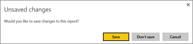
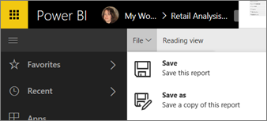
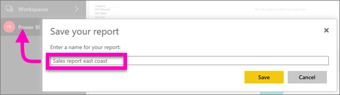

# จัดลำดับหน้าในรายงานในบริการ Power BI และ Power BI DesktopSave a report in Power BI service and Power BI Desktop
หลังจากที่คุณทำการเปลี่ยนแปลงไปยังรายงานใน Power BI คุณสามารถบันทึก บันทึก ด้วยชื่อใหม่ หรือเพียงแค่ปิดโดยไม่บันทึกการเปลี่ยนแปลงของคุณAfter you make changes to a report in Power BI, you can save it, save it with a new name, or just close it without saving your changes. เช่น คุณเปิดรายงาน สร้างภาพ และปักหมุดลงในแดชบอร์ดของคุณSay you open the report, create a visualization, and pin it to your dashboard. ถ้าคุณปิดเดี๋ยวนี้โดยไม่บันทึกการเปลี่ยนแปลงของคุณ ไทล์จะยังคงดำรงอยู่บนแดชบอร์ด แต่การแสดงภาพไม่ถูกบันทึกในรายงานIf you close it now without saving your changes, the tile remains on the dashboard, but the visualization isn't saved in the report. เมื่อคุณคลิกที่ไทล์ในแดชบอร์ด รายงานเปิดขึ้น แต่การแสดงภาพไม่มีข้อมูลในรายงานWhen you click that tile on the dashboard, the report opens, but the visualization doesn't exist in the report.

> [!TIP]
> ตั้งใจดูว่าที่พื้นที่ทำงานใดที่จะเปิดใช้งานเพื่อให้คุณสามารถค้นหารายงานบันทึกไว้Pay attention to which workspace is active so you can find the saved report. รายงานจะถูกบันทึกไปยังพื้นที่ทำงานที่มีการเคลื่อนไหวอยู่The report is saved to the active workspace.
> 
> 

### เมื่อต้องบันทึกรายงาน มีขั้นตอนดังนี้To save a report:
1. ถ้าคุณพยายามที่จะนำทางออกจากรายงาน และรายงานมีการเปลี่ยนแปลง Power BI จะแสดงข้อความเตือนขึ้นIf you attempt to navigate away from a report, and the report has changes, Power BI will display a prompt.
   
   
2. อีกวิธีหนึ่งในการบันทึกรายงานคือการเลือก **ไฟล์** \> **บันทึก** หรือ **บันทึกเป็น**Another way to save the report is to select **FILE** \> **Save** or **Save As**. ถ้าคุณอยู่ใน[มุมมองการอ่าน](../consumer/end-user-reading-view.md)คุณจะเห็นตัวเลือกในการบันทึกเป็นเฉพาะIf you are in [Reading view](../consumer/end-user-reading-view.md) you will only see the option to Save As. 
   
   
3. ถ้านี่เป็นรายงานใหม่ (บันทึก) หรือเวอร์ชันใหม่ของรายงานที่มีอยู่ (บันทึกเป็น) โปรดตั้งชื่อคำอธิบายให้แก่มันIf this is a new report (Save), or a new version of an existing report (Save as), give it a descriptive name.  **รายงานจะถูกบันทึกไปยังพื้นที่ทำงานที่มีการเคลื่อนไหวอยู่****The report will be added to the active workspace**.
   
    

### ขั้นตอนถัดไปNext steps
อ่านข้อมูลเพิ่มเติมเกี่ยวกับ[รายงานใน Power BI](../consumer/end-user-reports.md)Read more about [reports in Power BI](../consumer/end-user-reports.md)

[แนวคิดพื้นฐานสำหรับนักออกแบบในบริการ Power BIBasic concepts for designers in the Power BI service](../fundamentals/service-basic-concepts.md)

มีคำถามเพิ่มเติมหรือไม่More questions? [ลองไปที่ชุมชน Power BITry the Power BI Community](https://community.powerbi.com/)
