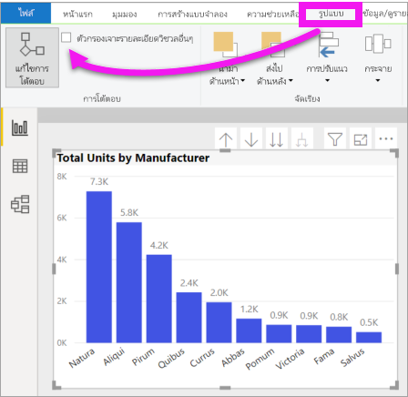

# เปลี่ยนวิธีการที่การแสดงผลด้วยภาพโต้ตอบในรายงาน Power BIChange how visuals interact in a Power BI report
ถ้าคุณมีสิทธิ์ในการแก้ไขรายงาน คุณสามารถใช้ **โต้ตอบแบบภาพ** เพื่อเปลี่ยนวิธีแสดงภาพบนหน้ารายงานมีผลกระทบต่อกันได้If you have edit permissions for a report, you can use **Visual interactions** to change how visualizations on a report page impact each other. 

## บทนำสู่การโต้ตอบกับภาพIntroduction to visual interactions
ตามค่าเริ่มต้น สามารถใช้การแสดงภาพบนหน้ารายงานเพื่อกรองแบบไขว้และไฮไลท์ข้ามไปยังแสดงภาพอื่น ๆ ในหน้าดังกล่าวBy default, visualizations on a report page can be used to cross-filter and cross-highlight the other visualizations on the page.
ตัวอย่างเช่น เลือกหนึ่งสถานะในการแสดงภาพของแผนที่เน้นแผนภูมิคอลัมน์และตัวกรองแผนภูมิเส้นเพื่อให้แสดงเฉพาะข้อมูลที่นำไปใช้กับหนึ่งสถานะดังกล่าวFor example, selecting a state on a map visualization highlights the column chart and filters the line chart to display only data that applies to that one state.
ดู[เกี่ยวกับการกรองและการเน้น](power-bi-reports-filters-and-highlighting.md)See [About filtering and highlighting](power-bi-reports-filters-and-highlighting.md). และหากคุณมีการแสดงภาพที่สนับสนุน[การเข้าถึงรายละเอียด](../consumer/end-user-drill.md)ตามค่าเริ่มต้น การเข้าถึงรายละเอียดข้อมูลแสดงภาพหนึ่งไม่มีผลกระทบต่อการแสดงภาพอื่น ๆ บนหน้ารายงานดังกล่าวAnd if you have a visualization that supports [drilling](../consumer/end-user-drill.md), by default, drilling one visualization has no impact on the other visualizations on the report page. แต่ลักษณะการทำงานที่เป็นค่าเริ่มต้นทั้งสองนี้สามารถแทนที่ได้ และโต้ตอบมีการตั้งค่าในแบบต่อหนึ่งการแสดงภาพBut both of these default behaviors can be overridden, and interactions set, on a per-visualization basis.

บทความนี้แสดงให้เห็นว่าคุณจะใช้ **การโต้ตอบกับภาพ** ใน Power BI Desktop ได้อย่างไรThis article shows you how to use **visual interactions** in Power BI Desktop. กระบวนการจะเหมือนกันกับในบริการ[มุมมองการแก้ไข](service-interact-with-a-report-in-editing-view.md)ของ Power BI The process is the same in the Power BI service [Editing view](service-interact-with-a-report-in-editing-view.md). ถ้ามีการแชร์รายงานกับคุณ คุณจะไม่สามารถเปลี่ยนการตั้งค่าการโต้ตอบแบบภาพได้If you only have Reading view access, or the report has been shared with you, you will not be able to change the visual interactions settings.

คำศัพท์ *ตัวกรองไขว้* และ *ไฮไลท์ข้าม* จะนำมาใช้เพื่อแยกความแตกต่างลักษณะการทำงานที่อธิบายไว้ที่นี่สำหรับสิ่งที่เกิดขึ้นเมื่อคุณใช้การพื้นที่ **ตัวกรอง** เพื่อ *กรอง* และ *เน้นการแสดงภาพ*The terms *cross-filter* and *cross-highlight* are used to distinguish the behavior described here from what happens when you use the **Filters** pane to *filter* and *highlight* visualizations.  

> [!NOTE]
> วิดีโอนี้ใช้เวอร์ชันเก่าของ Power BI Desktop และบริการของ Power BIThis video uses older versions of Power BI Desktop and the Power BI service. 
>
>

<iframe width="560" height="315" src="https://www.youtube.com/embed/N_xYsCbyHPw?list=PL1N57mwBHtN0JFoKSR0n-tBkUJHeMP2cP" frameborder="0" allowfullscreen></iframe>

## เปิดใช้งานตัวควบคุมการโต้ตอบกับภาพEnable the visual interaction controls
หากคุณมีสิทธิ์แก้ไขรายงาน คุณสามารถเปิดการควบคุมการโต้ตอบกับภาพและกำหนดวิธีการแสดงภาพประกอบเพลงในตัวกรองหน้ารายงานของคุณและไฮไลท์ซึ่งกันและกันIf you have edit permissions to a report, you can turn on the visual interaction controls and then customize how the visualizations on your  report page filter and highlight each other. 

1. เลือกการแสดงภาพเพื่อเปิดใช้งานSelect a visualization to make it active.  
2. แสดงตัวเลือก **การโต้ตอบแบบภาพ**Display the **Visual Interactions** options.
    

    - ที่เดสก์ท็อป เลือก **รูปแบบ > การโต้ตอบ**In Desktop, select **Format > Interactions**.

        

    - ในบริการ Power BI ให้เปิดรายงานในมุมมองการแก้ไขและเลือกรายการแบบเลื่อนลงจากแถบเมนูรายงานIn the Power BI service, open the report in Editing view and select the dropdown from the report menu bar.

        

3. เมื่อต้องการแสดงตัวควบคุมการแสดงภาพโต้ตอบ เลือก **แก้ไขการโต้ตอบ**To display the visualization interaction controls, select **Edit interactions**. Power BI เพิ่มตัวกรองและไฮไลท์ข้ามไปยังการแสดงภาพอื่นๆ ทั้งหมดบนหน้ารายงานPower BI adds filter and highlight icons to all of the other visualizations on the report page. เราจะเห็นได้ว่าแผนผังต้นไม้เป็นการกรองข้ามแผนภูมิแบบเส้นและแมป และเป็นการเน้นแบบข้ามแผนผังคอลัมน์We can see that the tree map is cross-filtering the line chart and the map, and is cross-highlighting the column chart. ตอนนี้คุณสามารถเปลี่ยนวิธีการสร้างภาพข้อมูลที่เลือกโต้ตอบกับการสร้างภาพข้อมูลอื่นๆ ในหน้ารายงานได้You can now change how the selected visualization interacts with the other visualizations on the report page.
   
    

## เปลี่ยนลักษณะการทำงานของการโต้ตอบChange the interaction behavior
ทำความคุ้นเคยกับการสร้างภาพข้อมูลของคุณโดยการเลือกการสร้างภาพแต่ละภาพในหน้ารายงานของคุณทีละครั้งGet familiar with how your visualizations interact by selecting each visualization on your report page, one at a time.  เลือกจุดข้อมูลหรือแถบหรือรูปร่างและดูผลกระทบต่อการสร้างภาพข้อมูลอื่นๆSelect a data point or a bar or a shape and watch the impact on the other visualizations. หากลักษณะการทำงานที่คุณเห็นไม่ใช่สิ่งที่คุณต้องการ คุณสามารถเปลี่ยนการโต้ตอบIf the behavior you see is not what you'd prefer, you can change the interactions. การเปลี่ยนแปลงเหล่านี้จะถูกบันทึกไว้ในรายงาน ดังนั้นคุณและผู้บริโภครายงานของคุณจะได้รับประสบการณ์การโต้ตอบกับภาพเดียวกันThese changes are saved with the report, so you and your report consumers will have the same visual interaction experience.

เริ่มต้นด้วยการเลือกการแสดงภาพเพื่อเปิดใช้งานStart by selecting a visualization to make it active.  โปรดสังเกตว่าการแสดงภาพอื่นๆ ทั้งหมดบนหน้าจะแสดงไอคอนโต้ตอบในขณะนี้Notice that all the other visualizations on the page now display interaction icons. ไอคอนหนาคือรายการที่จะถูกนำไปใช้The bolded icon is the one that is being applied. ถัดไป ให้พิจารณาว่าผลกระทบใดที่คุณต้องการให้ **การแสดงภาพที่เลือกไว้** มีผลต่อรายการอื่นNext, determine what impact you'd like the **selected visualization** to have on the others.  และมีอีกหนึ่งทางเลือกคือ ทำซ้ำสำหรับแสดงภาพอื่น ๆ ทั้งหมดบนหน้ารายงานAnd, optionally, repeat for all other visualizations on the report page.

ถ้าการแสดงภาพที่เลือกไว้:If the selected visualization should:
   
   * กรองข้ามการแสดงภาพอื่นๆ บนหน้า ให้เลือกไอคอน **ตัวกรอง** ในมุมบนขวาของ  ของการแสดงภาพนั้นcross-filter one of the other visualizations on the page, select the **filter** icon in the upper right corner of that visualization .
   * ไฮไลต์ข้ามหนึ่งในการแสดงภาพอื่นๆ บนหน้า ให้เลือกไอคอน **ไฮไลต์** cross-highlight one of the other visualizations on the page, select the **highlight** icon .
   * ไม่มีผลกระทบต่อการแสดงภาพอื่นๆ ภาพใดภาพหนึ่งบนหน้า ให้เลือกไอคอน **ไม่มีผลกระทบ** have no impact on one of the other visualizations on the page, select the **no impact** icon .

## เปลี่ยนการโต้ตอบของการแสดงภาพที่สามารถเจาะได้Change the interactions of drillable visualizations
[การแสดงภาพ Power BI บางอย่างสามารถเจาะได้](../consumer/end-user-drill.md)[Certain Power BI visualizations can be drilled](../consumer/end-user-drill.md). ตามค่าเริ่มต้นเมื่อคุณเจาะการสร้างภาพข้อมูลนั้นจะไม่มีผลกระทบต่อการสร้างภาพข้อมูลอื่นๆ ในหน้ารายงานBy default, when you drill a visualization, it has no impact on the other visualizations on the report page. แต่ลักษณะการทำงานนั้นสามารถเปลี่ยนแปลงได้But, that behavior can be changed. 

> [!TIP]
> ลองด้วยตัวคุณเองโดยใช้[ไฟล์ PBIX ตัวอย่างทรัพยากรบุคคล](https://download.microsoft.com/download/6/9/5/69503155-05A5-483E-829A-F7B5F3DD5D27/Human%20Resources%20Sample%20PBIX.pbix)Try it yourself using the [Human Resources sample PBIX file](https://download.microsoft.com/download/6/9/5/69503155-05A5-483E-829A-F7B5F3DD5D27/Human%20Resources%20Sample%20PBIX.pbix). มีแผนภูมิคอลัมน์พร้อมดริลล์ดาวน์บนแท็บ **จ้างใหม่**There's a column chart with drill down on the **New hires** tab.
>

1. บรรยายภาพที่เจาะได้เพื่อให้ใช้งานได้Select the drillable visual to make it active. 

2. เปิดใช้งานการดูข้อมูลแบบเจาะลึกโดยการเลือกไอคอนการดูรายละเอียดแนวลึกTurn on drill down by selecting the drill down icon.

    

2. จากแถบเมนู ให้เลือก **รูปแบบ** > **การเจาะตัวกรองภาพอื่น ๆ**From the menu bar, select **Format** > **Drilling filters other visuals**.  ในตอนนี้เมื่อคุณเจาะลึกลงรายละเอียด (และเจาะขึ้นมา) ในการแสดงภาพ การแสดงภาพอื่น ๆ บนหน้ารายงานจะเปลี่ยนเพื่อแสดงเลือกการเจาะลงรายละเอียดปัจจุบันของคุณNow when you drill down (and up) in a visualization, the other visualizations on the report page change to reflect your current drilling selection. 

    

3. หากลักษณะการทำงานที่คุณเห็นไม่ใช่สิ่งที่คุณต้องการ คุณสามารถเปลี่ยนการโต้ตอบได้ [ตามที่อธิบายไว้ข้างต้น](#change-the-interaction-behavior)If the behavior you see is not what you'd prefer, you can change the interactions [as described above](#change-the-interaction-behavior).

## ข้อควรพิจารณาและการแก้ไขปัญหาConsiderations and troubleshooting
ถ้าคุณสร้างเมทริกซ์ด้วยเขตข้อมูลจากตารางที่แตกต่างกัน จากนั้นลองเน้นแบบข้ามโดยการเลือกหลายรายการในระดับที่แตกต่างกันของลำดับชั้น คุณจะได้รับข้อผิดพลาดในการแสดงผลด้วยภาพอื่นๆIf you build a matrix with fields from different tables, then try to cross-highlight by selecting multiple items at different levels of the hierarchy, you get errors on the other visuals. 

    
## ขั้นตอนถัดไปNext steps
[ตัวกรองและการไฮไลท์ในรายงาน Power BIFiltering and highlighting in Power BI reports](power-bi-reports-filters-and-highlighting.md)