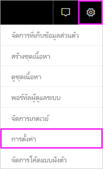

# การแจ้งเตือนข้อมูลในบริการของ Power BIData alerts in the Power BI service

ต้งค่าการแจ้งเตือน เมื่อมีข้อมูลในแดชบอร์ดของคุณเปลี่ยนเกินขีดจำกัดที่คุณตั้งไวSet alerts to notify you when data in your dashboards changes beyond limits you set.

คุณสามารถตั้งค่าการแจ้งเตือนบนตารางในพื้นที่ทำงานของฉันได้You can set alerts on tiles in your My Workspace. และคุณยังสามารถตั้งค่าการแจ้งเตือนถ้ามีคนแชร์แดชบอร์ดที่อยู่ใน[ความจุพรีเมียม](../admin/service-premium-what-is.md)ได้ด้วยYou can also set alerts if someone shares a dashboard that's in a [Premium capacity](../admin/service-premium-what-is.md). คุณสามารถตั้งค่าการแจ้งเตือนบนตารางพื้นที่ทำงานอื่น ๆ ได้ด้วยเช่นกันหากคุณมีสิทธิ์การใช้งาน Power BI ProIf you have a Power BI Pro license, you can set alerts on tiles in any other workspace, too. การแจ้งเตือนสามารถตั้งค่าบนหมุดไทล์ที่ปักหมุดจากวิชวลรายงานเท่านั้น และบนหน้าปัดวัด Kpi และการ์ดเท่านั้นAlerts can only be set on tiles pinned from report visuals, and only on gauges, KPIs, and cards. คุณสามารถตั้งค่าการแจ้งเตือนบนวิชวลที่สร้างขึ้นจากชุดข้อมูลการสตรีมที่คุณปักหมุดจากรายงานไปยังแดชบอร์ดได้Alerts can be set on visuals created from streaming datasets that you pin from a report to a dashboard. ไม่สามารถตั้งค่าการแจ้งเตือนบนไทล์การสตรีมที่สร้างขึ้นโดยตรงบนแดชบอร์ดโดยใช้ **เพิ่มไทล์** > **ข้อมูลการสตรีมแบบกำหนเอง**Alerts can't be set on streaming tiles created directly on the dashboard using **Add tile** > **Custom streaming data**.

มีเพียงคุณที่สามารถดูการแจ้งเตือนที่คุณตั้งไว้ แม้ว่าคุณได้แชร์แดชบอร์ดของคุณOnly you can see the alerts you set, even if you share your dashboard. แม้แต่เจ้าของแดชบอร์ดก็มองไม่เห็นการแจ้งเตือนที่คุณตั้งไว้ในมุมมองแดชบอร์ดของพวกเขาได้Even the dashboard owner can't see alerts you set on your view of their dashboard. การแจ้งเตือนข้อมูลจะถูกซิงโครไนซ์เต็มรูปแบบข้ามแพลตฟอร์ม ตั้งค่าและดูการแจ้งเตือนข้อมูลได้[ในแอป mobile Power BI](../consumer/mobile/mobile-set-data-alerts-in-the-mobile-apps.md)และใน Power BI serviceData alerts are fully synchronized across platforms; set and view data alerts [in the Power BI mobile apps](../consumer/mobile/mobile-set-data-alerts-in-the-mobile-apps.md) and in the Power BI service. ไม่สามารถใช้กับ Power BI Desktop ได้They aren't available for Power BI Desktop. คุณสามารถทำให้เป็นอัตโนมัติและรวมการแจ้งเตือนด้วย Power AutomateYou can even automate and integrate alerts with Power Automate. คุณสามารถลองใช้งานด้วยตัวคุณเองในบทความ [Power Automate และ Power BI ](../collaborate-share/service-flow-integration.md)นี้ได้You can try it yourself in this [Power Automate and Power BI](../collaborate-share/service-flow-integration.md) article.

> [!WARNING]
> การแจ้งเตือนข้อมูลแสดงข้อมูลของคุณData-driven alert notifications provide information about your data. ถ้าคุณดูข้อมูล Power BI ของคุณบนอุปกรณ์เคลื่อนที่ และอุปกรณ์ที่หายหรือถูกขโมย เราขอแนะนำให้ใช้บริการ Power BI เพื่อปิดการใช้งานแบบฎการแจ้งเตือนข้อมูลทั้งหมดIf you view your Power BI data on a mobile device and that device is lost or stolen, we recommend using the Power BI service to turn off all data-driven alert rules.

## ตั้งค่าการแจ้งเตือนข้อมูลใน Power BI serviceSet data alerts in the Power BI service

ดู Amanda เพิ่มการแจ้งเตือนบางอย่างไปยังไทล์บนแดชบอร์ดของเธอWatch Amanda add some alerts to tiles on the dashboard. แล้วทำตามคำแนะนำทีละขั้นตอนด้านล่างวิดีโอเพื่อลองทำด้วยตนเองThen follow the step-by-step instructions below the video to try it out yourself.

<iframe width="560" height="315" src="https://www.youtube.com/embed/JbL2-HJ8clE" frameborder="0" allowfullscreen></iframe>

ตัวอย่างนี้ใช้การ์ดไทล์จากแดชบอร์ดตัวอย่างการวิเคราะห์ร้านค้าปลีกThis example uses a card tile from the Retail Analysis sample dashboard. [รับตัวอย่างวิเคราะห์ร้านค้าปลีก](sample-retail-analysis.md#get-the-content-pack-for-this-sample)หากคุณต้องการติดตาม[Get the Retail Analysis sample](sample-retail-analysis.md#get-the-content-pack-for-this-sample) if you want to follow along.

1. เริ่มต้นกับแดชบอร์ดStart on a dashboard. จากไทล์ **ร้านค้ารวม** เลือกจุดไข่ปลาFrom the **Total stores** tile, select the ellipses.

   

1. เลือกไอคอนระฆังเพื่อเพิ่มการแจ้งเตือนอย่างน้อยหนึ่งตัวสำหรับ **ร้านค้ารวม**Select the bell icon  to add one or more alerts for **Total Stores**.

1. เมื่อต้องการเริ่มต้น ให้เลือก **+ เพิ่มกฎการแจ้งเตือน** ตรวจสอบให้แน่ใจว่าแถบเลื่อน **ใช้งานอยู่** ถูกตั้งค่าเป็น **เปิด** และตั้งชื่อให้การแจ้งเตือนของคุณTo start, select **+ Add alert rule**, ensure the **Active** slider is set to **On**, and give your alert a title. ชื่อช่วยให้คุณสามารถจดจำข้อความการแจ้งเตือนของคุณได้Titles help you easily recognize your alerts.

   

1. เลื่อนลง แล้วใส่รายละเอียดการแจ้งเตือนScroll down and enter the alert details.  ในตัวอย่างนี้ คุณสามารถสร้างการแจ้งเตือนที่แจ้งให้คุณทราบวันละครั้ง ถ้าหมายเลขของร้านค้ารวมมากกว่า 100 ร้านIn this example, you'll create an alert that notifies you once a day if the number of total stores goes above 100.

   

    ข้อความแจ้งเตือนจะปรากฏใน **ศูนย์การแจ้งเตือน**Alerts appear in your **Notification center**. Power BI ยังส่งอีเมลถึงคุณเกี่ยวกับการแจ้งเตือนถ้าคุณเลือกกล่องกาเครื่องหมายPower BI also sends you an email about the alert, if you select the check box.

1. เลือก **บันทึกและปิด**Select **Save and close**.

## การรับการแจ้งเตือนReceiving alerts

เมื่อข้อมูลที่ติดตามถึงหนึ่งในค่าเกณฑ์ที่คุณตั้งไว้ มีหลายสิ่งเกิดขึ้นWhen the tracked data reaches one of the thresholds you've set, several things happen. ลำดับแรก Power BI จะตรวจสอบเพื่อดูว่าเกินหนึ่งชั่วโมงหรือ 24 ชั่วโมงแล้วหรือไม่ (ขึ้นอยู่กับตัวเลือกที่คุณเลือก) นับตั้งแต่มีการส่งการแจ้งเตือนล่าสุดFirst, Power BI checks to see if it's been more than an hour or more than 24 hours (depending on the option you selected) since the last alert. หากข้อมูลเกินค่าเกณฑ์ คุณจะได้รับการแจ้งเตือนทุกชั่วโมงหรือทุกๆ 24 ชั่วโมงIf the data is past the threshold, you'll get an alert.

ถัดไป Power BI ส่งข้อความแจ้งเตือนไปยัง **ศูนย์การแจ้งเตือน** และหรือในอีเมลNext, Power BI sends an alert to your **Notification center** and, optionally, an email. แต่ละข้อความแจ้งเตือนประกอบด้วยการเชื่อมโยงโดยตรงกับข้อมูลของคุณEach alert contains a direct link to your data. เลือกลิงก์เพื่อดูไทล์เกี่ยวข้องที่คุณสามารถสำรวจ แชร์ และเรียนรู้เพิ่มเติมSelect the link to see the relevant tile where you can explore, share, and learn more.  

* ถ้าคุณได้ตั้งค่าการแจ้งเตือนให้ส่งอีเมล์ คุณจะพบสิ่งที่เหมือนสิ่งนี้้ในกล่องอีเมลเข้าของคุณIf you've set the alert to send you an email, you'll find something like this in your Inbox.

   

* Power BI จะเพิ่มข้อความไปยัง **ศูนย์การแจ้งเตือน** ของคุณและเพิ่มไอคอนการแจ้งเตือนใหม่ใหักับไทล์ที่เกี่ยวข้องPower BI adds a message to your **Notification center** and adds a new alert icon to the applicable tile.

   

* **ศูนย์การแจ้งเตือน** จะแสดงรายละเอียดการแจ้งเตือนYour **Notification center** displays the alert details.

    

   > [!NOTE]
   > การแจ้งเตือนจะทำงานกับข้อมูลที่รีเฟรชเท่านั้นAlerts only work on refreshed data. เมื่อมีการรีเฟรชข้อมูล Power BI จะค้นหาเพื่อดูว่าข้อความแจ้งเตือนถูกตั้งค่าสำหรับข้อมูลนั้นหรือไม่When data refreshes, Power BI looks to see if an alert is set for that data. ถ้าข้อมูลได้ถึงค่าเกณฑ์การแจ้งเตือน Power BI จะทริกเกอร์การแจ้งเตือนIf the data has reached an alert threshold, Power BI triggers an alert.

## การจัดการการแจ้งเตือนManaging alerts

มีหลายวิธีในการจัดการการแจ้งเตือนของคุณ:There are many ways to manage your alerts:

* จากไทล์แดชบอร์ดFrom the dashboard tile.

* จากเมนูการตั้งค่า Power BIFrom the Power BI Settings menu.

* บนไทล์ใน[แอป Power BI สำหรับอุปกรณ์เคลื่อนที่](../consumer/mobile/mobile-set-data-alerts-in-the-mobile-apps.md)On a tile in the [Power BI mobile apps](../consumer/mobile/mobile-set-data-alerts-in-the-mobile-apps.md).

### จากไทล์แดชบอร์ดFrom the dashboard tile

1. ถ้าคุณต้องการเปลี่ยนหรือลบการแจ้งเตือนสำหรับไทล์ ให้เปิดหน้าต่าง **จัดการการแจ้งเตือน** ใหม่อีกครั้ง โดยการเลือกไอคอนระฆัง If you need to change or remove an alert for a tile, reopen the **Manage alerts** window by selecting the bell icon .

    Power BI จะแสดงการแจ้งเตือนทั้งหมดที่คุณได้ตั้งค่าสำหรับไทล์Power BI displays the alert(s) that you've set for that tile.

    

1. เพื่อเปลี่ยนข้อความแจ้งเตือน ให้เลือกลูกศรทางด้านซ้ายของชื่อการแจ้งเตือนTo modify an alert, select the arrow to the left of the alert name.

    

1. เพื่อลบการแจ้งเตือน ให้เลือกถังขยะทางด้านขวาของชื่อการแจ้งเตือนTo delete an alert, select the trashcan to the right of the alert name.

      

### จากเมนูการตั้งค่า Power BIFrom the Power BI settings menu

1. เลือกไอคอนรูปเฟืองจากแถบเมนู Power BI และเลือก **การตั้งค่า**Select the gear icon from the Power BI menu bar and select **Settings**.

    ..

1. ภายใต้ **ตั้งค่า** ให้เลือก **การแจ้งเตือน**Under **Settings** select **Alerts**.

    

1. จากที่นี่ คุณสามารถเปิดหรือปิดข้อความแจ้งเตือน เปิดตัว **จัดการการแจ้งเตือน** เพื่อทำการเปลี่ยนแปลง หรือลบการแจ้งเตือนได้From here you can turn alerts on and off, open the **Manage alerts** window to make changes, or delete the alert.

## ข้อควรพิจารณาและการแก้ไขปัญหาConsiderations and troubleshooting

* การแจ้งเตือนไม่ได้สนับสนุนไทล์การ์ดที่มีหน่วยวัดวันที่/เวลาAlerts aren't supported for card tiles with date/time measures.
* การแจ้งเตือนจะทำงานกับข้อมูลตัวเลขเท่านั้นAlerts only work with numeric data types.
* การแจ้งเตือนจะทำงานกับข้อมูลที่รีเฟรชเท่านั้นAlerts only work on refreshed data. ข้อความแจ้งเตือนจะไม่ทำงานกับข้อมูลแบบคงที่They don't work on static data.
* การแจ้งเตือนจะทำงานกับชุดข้อมูลสตรีมมิ่งถ้าคุณสร้างวิชวลของรายงาน KPI, การ์ด หรือหน่วยวัด และปักหมุดวิชวลนั้นในแดชบอร์ดAlerts only work on streaming datasets if you build a KPI, card, or gauge report visual and then pin that visual to the dashboard.

## ขั้นตอนถัดไปNext steps

* [สร้าง Power Automate ที่มีการแจ้งเตือนข้อมูล](../collaborate-share/service-flow-integration.md)[Create a Power Automate that includes a data alert](../collaborate-share/service-flow-integration.md).

* [ตั้งค่าการแจ้งเตือนข้อมูลบนอุปกรณ์เคลื่อนที่ของคุณ](../consumer/mobile/mobile-set-data-alerts-in-the-mobile-apps.md)[Set data alerts on your mobile device](../consumer/mobile/mobile-set-data-alerts-in-the-mobile-apps.md).

* [Power BI คืออะไรWhat is Power BI?](../fundamentals/power-bi-overview.md)

มีคำถามเพิ่มเติมหรือไม่More questions? [ลองถามชุมชน Power BITry asking the Power BI Community](https://community.powerbi.com/)
