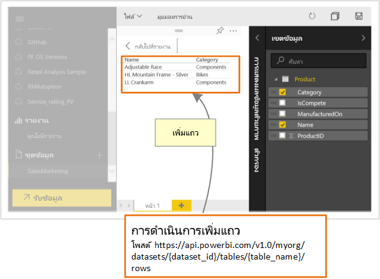

# นักพัฒนาสามารถใช้ Power BI API ทำอะไรได้บ้างWhat can developers do with the Power BI API?

การใช้ Power BI REST API คุณสามารถสร้างแอปที่รวมกับรายงาน แดชบอร์ด และไทล์ของ Power BIUsing Power BI REST API, you can create apps that integrate with Power BI reports, dashboards, and tiles.

ด้วย Power BI REST API คุณสามารถดำเนินการจัดการกับออบเจ็กต์ Power BI เช่น รายงาน ชุดข้อมูล และพื้นที่ทำงานWith Power BI REST API, it is possible to perform management tasks on Power BI objects like reports, datasets, and workspaces.

ต่อไปนี้เป็นตัวอย่าง สิ่งที่คุณสามารถทำได้ด้วย Power BI APIHere are some of the things you can do with the Power BI APIs.

| **เมื่อต้องการเรียนรู้เพิ่มเติม****To learn more** | **อ้างอิงข้อมูลนี้****Reference this information** |
|----------------------------------------------------------------------------------|------------------------------------------------------------------------------------|
| ฝังรายงาน แดชบอร์ด และไทล์สำหรับผู้ใช้ Power BI และผู้ที่ไม่ใช้ Power BIEmbed reports, dashboards, and tiles for Power BI users and Non-Power BI users. | [วิธีฝังแดชบอร์ด รายงานและไทล์ Power BI ของคุณHow to embed your Power BI dashboards, reports, and tiles ](../embedded/embed-sample-for-customers.md) |
| ดำเนินการจัดการกับออบเจ็กต์ Power BIPerform management tasks on Power BI objects. | [การอ้างอิง Power BI REST APIPower BI REST API reference](/rest/api/power-bi/) |
| ขยายเวิร์กโฟลว์ทางธุรกิจที่มีอยู่แล้ว โดยการพุชข้อมูลสำคัญลงในแดชบอร์ด Power BIExtend an existing business workflow to push key data into a Power BI dashboard. | [การพุชข้อมูลลงในแดชบอร์ดPush data into a dashboard ](walkthrough-push-data.md) |
| การรับรองความถูกต้องกับ Power BIAuthenticate to Power BI. | [การรับรองความถูกต้องกับ Power BIAuthenticate to Power BI ](../embedded/get-azuread-access-token.md) |

> [!NOTE]
> Power BI API ยังคงอ้างอิงถึงพื้นที่ทำงานเป็นกลุ่มThe Power BI APIs still refer to workspaces as groups. การอ้างอิงใด ๆ ถึงกลุ่มจะหมายความว่าคุณกำลังทำงานอยู่กับพื้นที่ทำงานAny references to groups mean that you are working with workspaces.

## เครื่องมือสำหรับนักพัฒนา APIAPI Developer tools

| เครื่องมือTool(s) | คำอธิบายDescription |
|---------|-------------|
| [เครื่องมือ PlaygroundPlayground tool](https://microsoft.github.io/PowerBI-JavaScript/demo) | ประสบการณ์การใช้งานตัวอย่าง Power BI JavaScript API แบบเต็มExperience a full sample of using the Power BI JavaScript APIs. เครื่องมือนี้คือ วิธีที่รวดเร็วเพื่อลองเล่นกับตัวอย่าง Power BI Embedded ชนิดต่าง ๆ กันอีกด้วยThis tool is also a quick way to play with different types of Power BI Embedded samples. |
| [วิกิสำหรับ Power BI JavaScriptPower BI JavaScript wiki](https://github.com/Microsoft/powerbi-javascript/wiki) | เพื่อรับข้อมูลเพิ่มเติมเกี่ยวกับ Power BI JavaScript APITo get more Information about the Power BI JavaScript APIs. |
| [PostmanPostman](https://www.getpostman.com/) | เรียกใช้คำขอ การทดสอบ แก้จุดบกพร่อง ตรวจสอบ เรียกใช้การทดสอบอัตโนมัติและอื่น ๆRun requests, test, debug, monitor, run automated tests and more. |

## ส่งข้อมูลไปยัง Power BIPush data into Power BI

คุณสามารถใช้ Power BI API เพื่อ[ส่งข้อมูลไปยังชุดข้อมูล ](walkthrough-push-data.md)You can use the Power BI API to [push data into a dataset](walkthrough-push-data.md). คุณลักษณะนี้ทำให้คุณสามารถเพิ่มแถวลงในตารางภายในชุดข้อมูลได้This feature allows you to add a row to a table within a dataset. จากนั้น ข้อมูลใหม่จะสะท้อนผลในไทล์บนแดชบอร์ด และในวิชวลภายในรายงานของคุณThe new data is then reflected in tiles on a dashboard and within visuals within your report.

## ที่เก็บ GitHubGitHub repositories

* [ตัวอย่างสำหรับนักพัฒนา Power BIPower BI Developer samples](https://github.com/Microsoft/PowerBI-Developer-Samples)
* [.NET SDK.NET SDK](https://github.com/Microsoft/PowerBI-CSharp)
* [JavaScript APIJavaScript API](https://github.com/Microsoft/PowerBI-JavaScript)

## ขั้นตอนถัดไปNext Steps

* [การพุชข้อมูลลงในชุดข้อมูลPush data into a dataset](walkthrough-push-data.md)
* [การพัฒนาวิชวลการ์ดวงกลมใน Power BIDeveloping a Power BI circle card visual](../visuals/develop-circle-card.md)
* [การอ้างอิง Power BI REST APIPower BI REST API Reference](rest-api-reference.md)
* [Power BI REST APIsPower BI REST APIs](/rest/api/power-bi/)

มีคำถามเพิ่มเติมหรือไม่More questions? [ลองถามชุมชน Power BITry asking the Power BI Community](https://community.powerbi.com/)