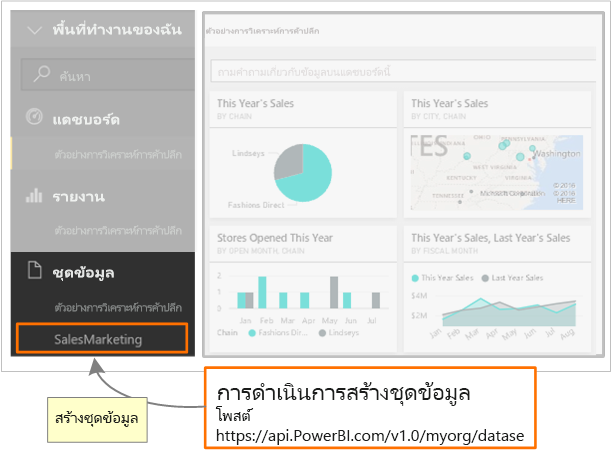

# <a name="step-3-create-a-dataset-in-power-bi"></a><span data-ttu-id="a3ade-104">ขั้นตอนที่ 3: สร้างชุดข้อมูลใน Power BI</span><span class="sxs-lookup"><span data-stu-id="a3ade-104">Step 3: Create a dataset in Power BI</span></span>
<span data-ttu-id="a3ade-105">บทความนี้เป็นส่วนหนึ่งของคำแนะนำทีละขั้นตอนเพื่อ[ส่งข้อมูลไปยังชุดข้อมูล](walkthrough-push-data.md)</span><span class="sxs-lookup"><span data-stu-id="a3ade-105">This article is part of a step-by-step walkthrough to [push data into a dataset](walkthrough-push-data.md).</span></span>

<span data-ttu-id="a3ade-106">ใน **ขั้นตอนที่ 2** ของการฝึกปฏิบัติ พุชข้อมูลลงในชุดข้อมูล เรื่อง [รับโทเคนการเข้าถึงการรับรองความถูกต้อง](walkthrough-push-data-get-token.md) คุณได้รับโทเค็นการรับรองความถูกต้องกับ **Azure AD** แล้ว</span><span class="sxs-lookup"><span data-stu-id="a3ade-106">In **step 2** of Push data into a dataset, [Get an authentication access token](walkthrough-push-data-get-token.md), you got a token to authenticate to **Azure AD**.</span></span> <span data-ttu-id="a3ade-107">ในขั้นตอนนี้ คุณจะใช้โทเค็นเพื่อเรียกการดำเนินการ [โพสต์ชุดข้อมูล](/rest/api/power-bi/pushdatasets)</span><span class="sxs-lookup"><span data-stu-id="a3ade-107">In this step, you use the token to call the [PostDataset](/rest/api/power-bi/pushdatasets) operation.</span></span>

<span data-ttu-id="a3ade-108">เพื่อเรียกไปยังทรัพยากร REST คุณใช้ url ที่ระบุตำแหน่งทรัพยากร และคุณส่งสตริง JavaScript Object Notation (JSON) ซึ่งอธิบายชุดข้อมูล ไปยังทรัพยากรของ บริการของ Power BI</span><span class="sxs-lookup"><span data-stu-id="a3ade-108">To make a call to a REST resource, you use a url that locates the resource, and you send a JavaScript Object Notation (JSON) string, which describes the dataset, to the Power BI service resource.</span></span> <span data-ttu-id="a3ade-109">ทรัพยากร REST ระบุส่วนของบริการของ Power BI ที่คุณต้องการทำงานด้วย</span><span class="sxs-lookup"><span data-stu-id="a3ade-109">A REST resource identifies the part of the Power BI service you want to work with.</span></span> <span data-ttu-id="a3ade-110">เพื่อพุชข้อมูลลงในชุดข้อมูล ทรัพยากรเป้าหมาย คือ **ชุดข้อมูล**</span><span class="sxs-lookup"><span data-stu-id="a3ade-110">To push data into the dataset, the target resource is a **Dataset**.</span></span> <span data-ttu-id="a3ade-111">URL ที่ระบุชุดข้อมูลคือ `https://api.PowerBI.com/v1.0/myorg/datasets`</span><span class="sxs-lookup"><span data-stu-id="a3ade-111">The URL that identifies a dataset is `https://api.PowerBI.com/v1.0/myorg/datasets`.</span></span> <span data-ttu-id="a3ade-112">ถ้าคุณกำลังพุชข้อมูลภายในกลุ่ม ค่า URL คือ `https://api.PowerBI.com/v1.0/myorg/groups/{group_id}/datasets`</span><span class="sxs-lookup"><span data-stu-id="a3ade-112">If you are pushing data within a group, the url is `https://api.PowerBI.com/v1.0/myorg/groups/{group_id}/datasets`.</span></span>

<span data-ttu-id="a3ade-113">เพื่อรับรองความถูกต้องของการดำเนินการ Power BI REST คุณเพิ่มโทเค็นคุณที่คุณได้รับจาก[รับโทเคนการเข้าถึงการรับรองความถูกต้อง](walkthrough-push-data-get-token.md) เข้าไปในส่วนหัวของคำขอ:</span><span class="sxs-lookup"><span data-stu-id="a3ade-113">To authenticate a Power BI REST operation, you add the token you got in [Get an authentication access token](walkthrough-push-data-get-token.md) to a request header:</span></span>

<span data-ttu-id="a3ade-114">เมื่อคุณเรียกใช้การดำเนินการ[โพสต์ชุดข้อมูล](/rest/api/power-bi/pushdatasets) ชุดข้อมูลใหม่จะถูกสร้างขึ้น</span><span class="sxs-lookup"><span data-stu-id="a3ade-114">When you call the [PostDataset](/rest/api/power-bi/pushdatasets) operation, a new dataset is created.</span></span> 



<span data-ttu-id="a3ade-116">นี่คือวิธีการสร้างชุดข้อมูลใน Power BI</span><span class="sxs-lookup"><span data-stu-id="a3ade-116">Here's how to create a dataset in Power BI.</span></span>

## <a name="create-a-dataset-in-power-bi"></a><span data-ttu-id="a3ade-117">สร้างชุดข้อมูลใน Power BI</span><span class="sxs-lookup"><span data-stu-id="a3ade-117">Create a dataset in Power BI</span></span>
> [!NOTE]
> <span data-ttu-id="a3ade-118">ก่อนที่คุณจะเริ่มต้น ตรวจสอบให้แน่ใจว่า คุณดำเนินตามขั้นตอนก่อนหน้านี้ในการฝึกปฏิบัติ[พุชข้อมูลลงในชุดข้อมูล](walkthrough-push-data.md)แล้ว</span><span class="sxs-lookup"><span data-stu-id="a3ade-118">Before you get started, make sure you have followed the previous steps in the [push data into a dataset](walkthrough-push-data.md) walkthrough.</span></span>
> 
> 

1. <span data-ttu-id="a3ade-119">ในโครงการแอปพลิเคชันคอนโซลที่คุณสร้างขึ้นใน [ขั้นตอนที่ 2 - รับโทเค็นการเข้าถึงการรับรองความถูกต้อง](walkthrough-push-data-get-token.md) เพิ่ม **using System.Net;** และ **using System.IO;** ลงใน Program.cs</span><span class="sxs-lookup"><span data-stu-id="a3ade-119">In the Console Application project you created in [Step 2 - Get an authentication access token](walkthrough-push-data-get-token.md), add **using System.Net;**, and **using System.IO;** to Program.cs.</span></span>
2. <span data-ttu-id="a3ade-120">ใน Program.cs เพิ่มรหัสด้านล่าง</span><span class="sxs-lookup"><span data-stu-id="a3ade-120">In Program.cs, add the code below.</span></span>
3. <span data-ttu-id="a3ade-121">เรียกใช้แอปคอนโซลนี้ และเข้าสู่ระบบด้วยบัญชี Power BI ของคุณ</span><span class="sxs-lookup"><span data-stu-id="a3ade-121">Run the Console App, and login to your Power BI account.</span></span> <span data-ttu-id="a3ade-122">คุณควรเห็น **Dataset Created** ในหน้าต่างคอนโซล</span><span class="sxs-lookup"><span data-stu-id="a3ade-122">You should see **Dataset Created** in the Console Window.</span></span> <span data-ttu-id="a3ade-123">นอกจากนี้ คุณยังสามารถเข้าสู่ระบบไปยัง Power BI เพื่อดูชุดข้อมูลใหม่</span><span class="sxs-lookup"><span data-stu-id="a3ade-123">Also, you can login to Power BI to see the new dataset.</span></span>

<span data-ttu-id="a3ade-124">**ตัวอย่างพุชข้อมูลลงในชุดข้อมูล**</span><span class="sxs-lookup"><span data-stu-id="a3ade-124">**Sample push data into a dataset**</span></span>

<span data-ttu-id="a3ade-125">เพิ่มรหัสนี้ลงใน Program.cs</span><span class="sxs-lookup"><span data-stu-id="a3ade-125">Add this code into Program.cs.</span></span>

* <span data-ttu-id="a3ade-126">ใน static void Main(string[] args):</span><span class="sxs-lookup"><span data-stu-id="a3ade-126">In static void Main(string[] args):</span></span>
  
    ```csharp
    static void Main(string[] args)
    {
        //Get an authentication access token
        token = GetToken();
  
        //Create a dataset in Power BI
        CreateDataset();
    }
    ```
* <span data-ttu-id="a3ade-127">เพิ่มเมธอด CreateDataset():</span><span class="sxs-lookup"><span data-stu-id="a3ade-127">Add a CreateDataset() method:</span></span>
  
    ```csharp
    #region Create a dataset in Power BI
    private static void CreateDataset()
    {
        //TODO: Add using System.Net and using System.IO
  
        string powerBIDatasetsApiUrl = "https://api.powerbi.com/v1.0/myorg/datasets";
        //POST web request to create a dataset.
        //To create a Dataset in a group, use the Groups uri: https://api.PowerBI.com/v1.0/myorg/groups/{group_id}/datasets
        HttpWebRequest request = System.Net.WebRequest.Create(powerBIDatasetsApiUrl) as System.Net.HttpWebRequest;
        request.KeepAlive = true;
        request.Method = "POST";
        request.ContentLength = 0;
        request.ContentType = "application/json";
  
        //Add token to the request header
        request.Headers.Add("Authorization", String.Format("Bearer {0}", token));
  
        //Create dataset JSON for POST request
        string datasetJson = "{\"name\": \"SalesMarketing\", \"tables\": " +
            "[{\"name\": \"Product\", \"columns\": " +
            "[{ \"name\": \"ProductID\", \"dataType\": \"Int64\"}, " +
            "{ \"name\": \"Name\", \"dataType\": \"string\"}, " +
            "{ \"name\": \"Category\", \"dataType\": \"string\"}," +
            "{ \"name\": \"IsCompete\", \"dataType\": \"bool\"}," +
            "{ \"name\": \"ManufacturedOn\", \"dataType\": \"DateTime\"}" +
            "]}]}";
  
        //POST web request
        byte[] byteArray = System.Text.Encoding.UTF8.GetBytes(datasetJson);
        request.ContentLength = byteArray.Length;
  
        //Write JSON byte[] into a Stream
        using (Stream writer = request.GetRequestStream())
        {
            writer.Write(byteArray, 0, byteArray.Length);
  
            var response = (HttpWebResponse)request.GetResponse();
  
            Console.WriteLine(string.Format("Dataset {0}", response.StatusCode.ToString()));
  
            Console.ReadLine();
        }
    }
    #endregion
    ```

<span data-ttu-id="a3ade-128">ขั้นตอนถัดไปจะแสดงวิธีการ[รับชุดข้อมูลเพื่อเพิ่มแถวลงในตาราง Power BI](walkthrough-push-data-get-datasets.md)</span><span class="sxs-lookup"><span data-stu-id="a3ade-128">The next step shows you how to [get a dataset to add rows into a Power BI table](walkthrough-push-data-get-datasets.md).</span></span>

<span data-ttu-id="a3ade-129">ด้านล่างนี้คือการ[รายการหัสที่สมบูรณ์](#code)</span><span class="sxs-lookup"><span data-stu-id="a3ade-129">Below is the [complete code listing](#code).</span></span>

<a name="code"/>

## <a name="complete-code-listing"></a><span data-ttu-id="a3ade-130">รายการรหัสเสร็จสมบูรณ์</span><span class="sxs-lookup"><span data-stu-id="a3ade-130">Complete code listing</span></span>

```csharp
using System;
using Microsoft.IdentityModel.Clients.ActiveDirectory;
using System.Net;
using System.IO;

namespace walkthrough_push_data
{
    class Program
    {
        private static string token = string.Empty;

        static void Main(string[] args)
        {

            //Get an authentication access token
            token = GetToken();

            //Create a dataset in Power BI
            CreateDataset();

        }

        #region Get an authentication access token
        private static string GetToken()
        {
            // TODO: Install-Package Microsoft.IdentityModel.Clients.ActiveDirectory -Version 2.21.301221612
            // and add using Microsoft.IdentityModel.Clients.ActiveDirectory

            //The client id that Azure AD created when you registered your client app.
            string clientID = "{Client_ID}";

            //RedirectUri you used when you register your app.
            //For a client app, a redirect uri gives Azure AD more details on the application that it will authenticate.
            // You can use this redirect uri for your client app
            string redirectUri = "https://login.live.com/oauth20_desktop.srf";

            //Resource Uri for Power BI API
            string resourceUri = "https://analysis.windows.net/powerbi/api";

            //OAuth2 authority Uri
            string authorityUri = "https://login.microsoftonline.com/common/";

            //Get access token:
            // To call a Power BI REST operation, create an instance of AuthenticationContext and call AcquireToken
            // AuthenticationContext is part of the Active Directory Authentication Library NuGet package
            // To install the Active Directory Authentication Library NuGet package in Visual Studio,
            //  run "Install-Package Microsoft.IdentityModel.Clients.ActiveDirectory" from the nuget Package Manager Console.

            // AcquireToken will acquire an Azure access token
            // Call AcquireToken to get an Azure token from Azure Active Directory token issuance endpoint
            AuthenticationContext authContext = new AuthenticationContext(authorityUri);
            string token = authContext.AcquireToken(resourceUri, clientID, new Uri(redirectUri)).AccessToken;

            Console.WriteLine(token);
            Console.ReadLine();

            return token;
        }

        #endregion


        #region Create a dataset in Power BI
        private static void CreateDataset()
        {
            //TODO: Add using System.Net and using System.IO

            string powerBIDatasetsApiUrl = "https://api.powerbi.com/v1.0/myorg/datasets";
            //POST web request to create a dataset.
            //To create a Dataset in a group, use the Groups uri: https://api.PowerBI.com/v1.0/myorg/groups/{group_id}/datasets
            HttpWebRequest request = System.Net.WebRequest.Create(powerBIDatasetsApiUrl) as System.Net.HttpWebRequest;
            request.KeepAlive = true;
            request.Method = "POST";
            request.ContentLength = 0;
            request.ContentType = "application/json";

            //Add token to the request header
            request.Headers.Add("Authorization", String.Format("Bearer {0}", token));

            //Create dataset JSON for POST request
            string datasetJson = "{\"name\": \"SalesMarketing\", \"tables\": " +
                "[{\"name\": \"Product\", \"columns\": " +
                "[{ \"name\": \"ProductID\", \"dataType\": \"Int64\"}, " +
                "{ \"name\": \"Name\", \"dataType\": \"string\"}, " +
                "{ \"name\": \"Category\", \"dataType\": \"string\"}," +
                "{ \"name\": \"IsCompete\", \"dataType\": \"bool\"}," +
                "{ \"name\": \"ManufacturedOn\", \"dataType\": \"DateTime\"}" +
                "]}]}";

            //POST web request
            byte[] byteArray = System.Text.Encoding.UTF8.GetBytes(datasetJson);
            request.ContentLength = byteArray.Length;

            //Write JSON byte[] into a Stream
            using (Stream writer = request.GetRequestStream())
            {
                writer.Write(byteArray, 0, byteArray.Length);

                var response = (HttpWebResponse)request.GetResponse();

                Console.WriteLine(string.Format("Dataset {0}", response.StatusCode.ToString()));

                Console.ReadLine();
            }
        }
        #endregion
    }
}
```

[<span data-ttu-id="a3ade-131">ขั้นตอนถัดไป ></span><span class="sxs-lookup"><span data-stu-id="a3ade-131">Next Step ></span></span>](walkthrough-push-data-get-datasets.md)

## <a name="next-steps"></a><span data-ttu-id="a3ade-132">ขั้นตอนถัดไป</span><span class="sxs-lookup"><span data-stu-id="a3ade-132">Next steps</span></span>
* [<span data-ttu-id="a3ade-133">รับชุดข้อมูลเพื่อเพิ่มแถวลงในตาราง Power BI</span><span class="sxs-lookup"><span data-stu-id="a3ade-133">Get a dataset to add rows into a Power BI table</span></span>](walkthrough-push-data-get-datasets.md)  
* [<span data-ttu-id="a3ade-134">รับโทเค็นการเข้าถึงการรับรองความถูกต้อง</span><span class="sxs-lookup"><span data-stu-id="a3ade-134">Get an authentication access token</span></span>](walkthrough-push-data-get-token.md)  
* [<span data-ttu-id="a3ade-135">โพสต์ชุดข้อมูล</span><span class="sxs-lookup"><span data-stu-id="a3ade-135">PostDataset</span></span>](/rest/api/power-bi/pushdatasets/datasets_postdataset)  
[<span data-ttu-id="a3ade-136">โพสต์ชุดข้อมูลในกลุ่ม</span><span class="sxs-lookup"><span data-stu-id="a3ade-136">PostDatasetInGroup</span></span>](/rest/api/power-bi/pushdatasets/datasets_postdatasetingroup)  
* [<span data-ttu-id="a3ade-137">พุชข้อมูลลงในแดชบอร์ด Power BI</span><span class="sxs-lookup"><span data-stu-id="a3ade-137">Push data into a Power BI Dashboard</span></span>](walkthrough-push-data.md)  
* [<span data-ttu-id="a3ade-138">ภาพรวมของ Power BI REST API</span><span class="sxs-lookup"><span data-stu-id="a3ade-138">Overview of Power BI REST API</span></span>](overview-of-power-bi-rest-api.md)  
* [<span data-ttu-id="a3ade-139">การอ้างอิง Power BI REST API</span><span class="sxs-lookup"><span data-stu-id="a3ade-139">Power BI REST API reference</span></span>](/rest/api/power-bi/)  

<span data-ttu-id="a3ade-140">คุณมีคำถามเพิ่มเติมหรือไม่</span><span class="sxs-lookup"><span data-stu-id="a3ade-140">More questions?</span></span> [<span data-ttu-id="a3ade-141">ลองไปที่ชุมชน Power BI</span><span class="sxs-lookup"><span data-stu-id="a3ade-141">Try the Power BI Community</span></span>](https://community.powerbi.com/)