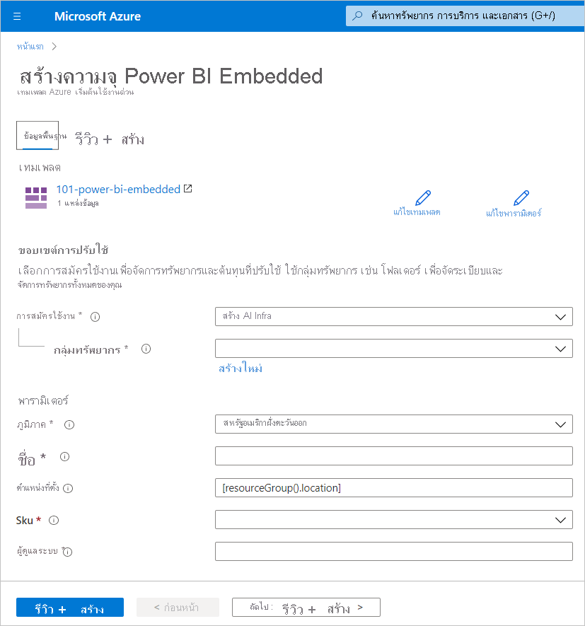
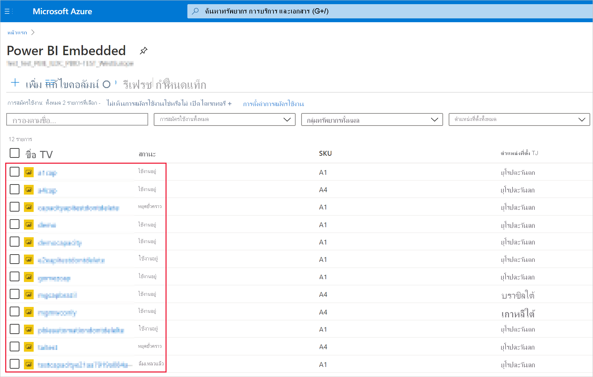
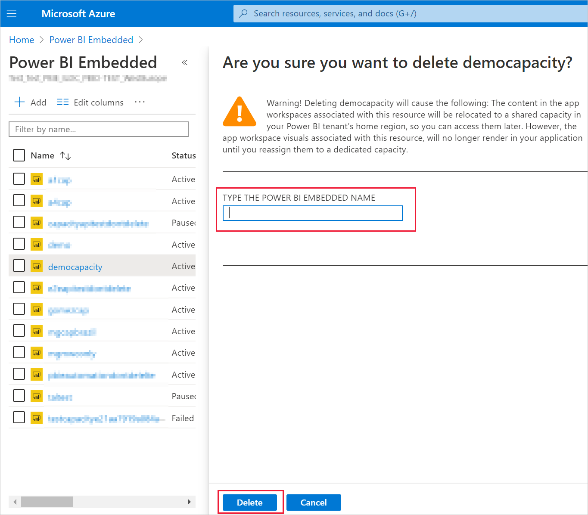

# <a name="create-power-bi-embedded-capacity-in-the-azure-portal"></a><span data-ttu-id="cecf6-103">สร้างความจุ Power BI Embedded ในพอร์ทัล Azure</span><span class="sxs-lookup"><span data-stu-id="cecf6-103">Create Power BI Embedded capacity in the Azure portal</span></span>

<span data-ttu-id="cecf6-104">บทความนี้แนะนำเกี่ยวกับวิธีการสร้างความจุ [Power BI Embedded](azure-pbie-what-is-power-bi-embedded.md) ใน Microsoft Azure</span><span class="sxs-lookup"><span data-stu-id="cecf6-104">This article walks through how to create a [Power BI Embedded](azure-pbie-what-is-power-bi-embedded.md) capacity in Microsoft Azure.</span></span> <span data-ttu-id="cecf6-105">Power BI Embedded ช่วยลดความสามารถของ Power BI ด้วยการช่วยให้คุณสามารถเพิ่มภาพ รายงาน และแดชบอร์ดที่สวยงามลงในแอปพลิเคชันของคุณได้อย่างรวดเร็ว</span><span class="sxs-lookup"><span data-stu-id="cecf6-105">Power BI Embedded simplifies Power BI capabilities by helping you quickly add stunning visuals, reports, and dashboards to your apps.</span></span>

## <a name="before-you-begin"></a><span data-ttu-id="cecf6-106">ก่อนที่คุณเริ่มต้น</span><span class="sxs-lookup"><span data-stu-id="cecf6-106">Before you begin</span></span>

<span data-ttu-id="cecf6-107">เมื่อต้องการทำตามการเริ่มต้นใช้งานด่วน คุณจำเป็นต้อง:</span><span class="sxs-lookup"><span data-stu-id="cecf6-107">To complete this quickstart, you need:</span></span>

* <span data-ttu-id="cecf6-108">**สมัครใช้งาน azure:** เยี่ยมชม [ Azure รุ่นทดลองใช้ฟรี](https://azure.microsoft.com/free/)เพื่อสร้างบัญชีผู้ใช้</span><span class="sxs-lookup"><span data-stu-id="cecf6-108">**Azure subscription:** Visit [Azure Free Trial](https://azure.microsoft.com/free/) to create an account.</span></span>

* <span data-ttu-id="cecf6-109">**Azure Active Directory:** การสมัครใช้งานของคุณต้องเชื่อมโยงกับผู้เช่าของ Azure Active Directory (Azure AD)</span><span class="sxs-lookup"><span data-stu-id="cecf6-109">**Azure Active Directory:** Your subscription must be associated with an Azure Active Directory (Azure AD) tenant.</span></span> <span data-ttu-id="cecf6-110">นอกจากนี้ \**_คุณจะต้องลงชื่อเข้าใช้ Azure ด้วยบัญชีผู้เช่า_* _</span><span class="sxs-lookup"><span data-stu-id="cecf6-110">Also, \**_you need to be signed in to Azure with an account in that tenant_* _.</span></span> <span data-ttu-id="cecf6-111">บัญชี Microsoft ไม่ได้รับการสนับสนุน</span><span class="sxs-lookup"><span data-stu-id="cecf6-111">Microsoft accounts aren't supported.</span></span> <span data-ttu-id="cecf6-112">หากต้องการเรียนรู้เพิ่มเติม ดู[การรับรองความถูกต้องและสิทธิ์ผู้ใช้](/azure/analysis-services/analysis-services-manage-users)</span><span class="sxs-lookup"><span data-stu-id="cecf6-112">To learn more, see [Authentication and user permissions](/azure/analysis-services/analysis-services-manage-users).</span></span>

<span data-ttu-id="cecf6-113">_ **Power BI ผู้เช่า:** ค้องมีบัญชีในผู้เช่า Azure AD ของคุณอย่างน้อยหนึ่งบัญชีที่ลงชื่อสมัครใช้งาน Power BI</span><span class="sxs-lookup"><span data-stu-id="cecf6-113">_ **Power BI tenant:** At least one account in your Azure AD tenant must have signed up for Power BI.</span></span>

* <span data-ttu-id="cecf6-114">**กลุ่มทรัพยากร:** ใช้กลุ่มทรัพยากรที่คุณมีอยู่หรือ [สร้างกลุ่มใหม่](/azure/azure-resource-manager/resource-group-overview)</span><span class="sxs-lookup"><span data-stu-id="cecf6-114">**Resource group:** Use a resource group you already have or [create a new one](/azure/azure-resource-manager/resource-group-overview).</span></span>

## <a name="create-a-capacity"></a><span data-ttu-id="cecf6-115">สร้างความจุ</span><span class="sxs-lookup"><span data-stu-id="cecf6-115">Create a capacity</span></span>

<span data-ttu-id="cecf6-116">ก่อนที่จะสร้างความจุ Power BI Embedded ตรวจสอบให้แน่ใจว่าคุณได้ลงชื่อเข้าใช้ Power BI อย่างน้อยหนึ่งครั้ง</span><span class="sxs-lookup"><span data-stu-id="cecf6-116">Before creating a Power BI Embedded capacity, make sure you have signed into Power BI at least once.</span></span>

# <a name="portal"></a>[<span data-ttu-id="cecf6-117">พอร์ทัล</span><span class="sxs-lookup"><span data-stu-id="cecf6-117">Portal</span></span>](#tab/portal)

1. <span data-ttu-id="cecf6-118">ลงชื่อเข้าใช้[พอร์ทัล Azure](https://portal.azure.com/)</span><span class="sxs-lookup"><span data-stu-id="cecf6-118">Sign into the [Azure portal](https://portal.azure.com/).</span></span>

2. <span data-ttu-id="cecf6-119">ในกล่องค้นหา ค้นหาสำหรับ *Power BI Embedded*</span><span class="sxs-lookup"><span data-stu-id="cecf6-119">In the search box, search for *Power BI Embedded*.</span></span>

3. <span data-ttu-id="cecf6-120">ภายใน Power BI Embedded เลือก **เพิ่ม**</span><span class="sxs-lookup"><span data-stu-id="cecf6-120">Within Power BI Embedded, select **Add**.</span></span>

4. <span data-ttu-id="cecf6-121">กรอกข้อมูลที่จำเป็น จากนั้นเลือก **ตรวจสอบ + สร้าง**</span><span class="sxs-lookup"><span data-stu-id="cecf6-121">Fill in the required information and then click **Review + Create**.</span></span>

    >[!div class="mx-imgBorder"]
    ><span data-ttu-id="cecf6-122"></span><span class="sxs-lookup"><span data-stu-id="cecf6-122"></span></span>

    * <span data-ttu-id="cecf6-123">**การสมัครใช้งาน** - การสมัครใช้งานที่คุณต้องการสร้างความจุด้วย</span><span class="sxs-lookup"><span data-stu-id="cecf6-123">**Subscription** - The subscription you would like to create the capacity against.</span></span>

    * <span data-ttu-id="cecf6-124">**กลุ่มทรัพยากร** - กลุ่มทรัพยากรที่ประกอบด้วยความจุใหม่นี้</span><span class="sxs-lookup"><span data-stu-id="cecf6-124">**Resource group** - The resource group that contains this new capacity.</span></span> <span data-ttu-id="cecf6-125">เลือกจากกลุ่มทรัพยากรที่มีอยู่แล้วหรือสร้างกลุ่มอื่น</span><span class="sxs-lookup"><span data-stu-id="cecf6-125">Pick from an existing resource group, or create another.</span></span> <span data-ttu-id="cecf6-126">สำหรับข้อมูลเพิ่มเติม ให้ดู[ภาพรวม Azure Resource Manager](/azure/azure-resource-manager/resource-group-overview)</span><span class="sxs-lookup"><span data-stu-id="cecf6-126">For more information, see [Azure Resource Manager overview](/azure/azure-resource-manager/resource-group-overview).</span></span>

    * <span data-ttu-id="cecf6-127">**ชื่อทรัพยากร** - ชื่อทรัพยากรของความจุ</span><span class="sxs-lookup"><span data-stu-id="cecf6-127">**Resource name** - The resource name of the capacity.</span></span>

    * <span data-ttu-id="cecf6-128">**ตำแหน่งที่ตั้ง** - ตำแหน่งที่ตั้งที่มีโฮสต์ Power BI สำหรับผู้เช่าของคุณ</span><span class="sxs-lookup"><span data-stu-id="cecf6-128">**Location** - The location where Power BI is hosted for your tenant.</span></span> <span data-ttu-id="cecf6-129">ตำแหน่งเริ่มต้นของคุณคือ ภูมิภาคบ้านของคุณ แต่คุณสามารถเปลี่ยนตำแหน่งที่ตั้งโดยใช้[ตัวเลือก Multi-Geo](embedded-multi-geo.md)</span><span class="sxs-lookup"><span data-stu-id="cecf6-129">Your default location is your home region, but you can change the location using [Multi-Geo options](embedded-multi-geo.md).</span></span>

    * <span data-ttu-id="cecf6-130">**ขนาด**-[SKU](../../admin/service-admin-premium-purchase.md#purchase-a-skus-for-testing-and-other-scenarios) ที่คุณต้องการ</span><span class="sxs-lookup"><span data-stu-id="cecf6-130">**Size** - The [A SKU](../../admin/service-admin-premium-purchase.md#purchase-a-skus-for-testing-and-other-scenarios) you require.</span></span> <span data-ttu-id="cecf6-131">สำหรับข้อมูลเพิ่มเติมดู [หน่วยความจำ SKU และกำลังสำหรับการประมวลผล](./embedded-capacity.md)</span><span class="sxs-lookup"><span data-stu-id="cecf6-131">For more information, see [SKU memory and computing power](./embedded-capacity.md).</span></span>

    * <span data-ttu-id="cecf6-132">**ผู้ดูแลระบบความจุของ Power BI**-ผู้ดูแลระบบสำหรับความจุ</span><span class="sxs-lookup"><span data-stu-id="cecf6-132">**Power BI capacity administrator** - An admin for the capacity.</span></span>
        >[!NOTE]
        >* <span data-ttu-id="cecf6-133">ตามค่าเริ่มต้นผู้ดูแลระบบความจุคือผู้ใช้ที่สร้างความจุ</span><span class="sxs-lookup"><span data-stu-id="cecf6-133">By default, the capacity administrator is the user creating the capacity.</span></span>
        >* <span data-ttu-id="cecf6-134">คุณสามารถเลือกผู้ใช้อื่นหรือบริการหลักเป็นผู้ดูแลระบบความจุ</span><span class="sxs-lookup"><span data-stu-id="cecf6-134">You can select a different user or service principal, as capacity administrator.</span></span>
        >* <span data-ttu-id="cecf6-135">ผู้ดูแลระบบความจุต้องเป็นสมาชิกของผู้เช่าที่มีการเตรียมใช้งานความจุ</span><span class="sxs-lookup"><span data-stu-id="cecf6-135">The capacity administrator must belong to the tenant where the capacity is provisioned.</span></span> <span data-ttu-id="cecf6-136">ผู้ใช้ทางธุรกิจไปยังธุรกิจ (B2B) ไม่สามารถเป็นผู้ดูแลระบบความจุได้</span><span class="sxs-lookup"><span data-stu-id="cecf6-136">Business to business (B2B) users cannot be capacity administrators.</span></span>

# <a name="azure-cli"></a>[<span data-ttu-id="cecf6-137">Azure CLI</span><span class="sxs-lookup"><span data-stu-id="cecf6-137">Azure CLI</span></span>](#tab/CLI)

### <a name="use-azure-cloud-shell"></a><span data-ttu-id="cecf6-138">ใช้ Azure Cloud Shell</span><span class="sxs-lookup"><span data-stu-id="cecf6-138">Use Azure Cloud Shell</span></span>

<span data-ttu-id="cecf6-139">Azure ให้บริการระบบ Azure Cloud Shell ซึ่งเป็นสภาพแวดล้อมของ Shell แบบโต้ตอบที่คุณสามารถใช้ผ่านเบราว์เซอร์ของคุณ</span><span class="sxs-lookup"><span data-stu-id="cecf6-139">Azure hosts Azure Cloud Shell, an interactive shell environment that you can use through your browser.</span></span> <span data-ttu-id="cecf6-140">คุณสามารถใช้ Bash หรือ PowerShell กับ Cloud Shell เพื่อทำงานร่วมกับบริการต่าง ๆ ของ Azure ได้</span><span class="sxs-lookup"><span data-stu-id="cecf6-140">You can use either Bash or PowerShell with Cloud Shell to work with Azure services.</span></span> <span data-ttu-id="cecf6-141">คุณสามารถใช้คำสั่ง Cloud Shell ที่ติดตั้งไว้ล่วงหน้าเพื่อเรียกใช้รหัสในบทความนี้ได้โดยไม่จำเป็นต้องติดตั้งสิ่งใดๆในสภาพแวดล้อมภายในที่ตั้งของคุณ</span><span class="sxs-lookup"><span data-stu-id="cecf6-141">You can use the Cloud Shell preinstalled commands to run the code in this article without having to install anything on your local environment.</span></span>

<span data-ttu-id="cecf6-142">การเริ่มใช้ Azure Cloud Shell</span><span class="sxs-lookup"><span data-stu-id="cecf6-142">To start Azure Cloud Shell:</span></span>

| <span data-ttu-id="cecf6-143">ตัวเลือก</span><span class="sxs-lookup"><span data-stu-id="cecf6-143">Option</span></span> | <span data-ttu-id="cecf6-144">ตัวอย่าง/การเชื่อมโยง</span><span class="sxs-lookup"><span data-stu-id="cecf6-144">Example/Link</span></span> |
|-----------------------------------------------|---|
| <span data-ttu-id="cecf6-145">เลือก **ลอง** ที่มุมบนขวาของบล็อกรหัส</span><span class="sxs-lookup"><span data-stu-id="cecf6-145">Select **Try It** in the upper-right corner of a code block.</span></span> <span data-ttu-id="cecf6-146">การเลือก **ลอง** จะไม่คัดลอกรหัสไปยัง Cloud Shell โดยอัตโนมัติ</span><span class="sxs-lookup"><span data-stu-id="cecf6-146">Selecting **Try It** doesn't automatically copy the code to Cloud Shell.</span></span> |  |
| <span data-ttu-id="cecf6-148">ไปที่ [https://shell.azure.com](https://shell.azure.com)หรือเลือกปุ่ม **เปิดใช้งานระบบ Cloud Shell** เพื่อเปิดระบบ Cloud Shell ในเบราว์เซอร์ของคุณ</span><span class="sxs-lookup"><span data-stu-id="cecf6-148">Go to [https://shell.azure.com](https://shell.azure.com), or select the **Launch Cloud Shell** button to open Cloud Shell in your browser.</span></span> | <span data-ttu-id="cecf6-149">[](https://shell.azure.com)</span><span class="sxs-lookup"><span data-stu-id="cecf6-149">[](https://shell.azure.com)</span></span> |
| <span data-ttu-id="cecf6-150">เลือกปุ่ม **Cloud Shell** บนแถบเมนูที่มุมขวาบนใน [พอร์ทัล Azure](https://portal.azure.com)</span><span class="sxs-lookup"><span data-stu-id="cecf6-150">Select the **Cloud Shell** button on the menu bar at the upper right in the [Azure portal](https://portal.azure.com).</span></span> |  |

<span data-ttu-id="cecf6-152">เมื่อต้องการเรียกใช้โค้ดในบทความนี้ใน Azure Cloud Shell:</span><span class="sxs-lookup"><span data-stu-id="cecf6-152">To run the code in this article in Azure Cloud Shell:</span></span>

1. <span data-ttu-id="cecf6-153">เริ่มระบบ Cloud Shell</span><span class="sxs-lookup"><span data-stu-id="cecf6-153">Start Cloud Shell.</span></span>

2. <span data-ttu-id="cecf6-154">เลือกปุ่ม **คัดลอก** บนบล็อกรหัสเพื่อคัดลอกโค้ด</span><span class="sxs-lookup"><span data-stu-id="cecf6-154">Select the **Copy** button on a code block to copy the code.</span></span>

3. <span data-ttu-id="cecf6-155">วางรหัสลงในเซสชันของ Cloud Shell โดยการเลือก **Ctrl**+**Shift**+**V** บน Windows และ Linux หรือโดยการเลือก **Cmd**+**Shift**+**V** บน macOS</span><span class="sxs-lookup"><span data-stu-id="cecf6-155">Paste the code into the Cloud Shell session by selecting **Ctrl**+**Shift**+**V** on Windows and Linux or by selecting **Cmd**+**Shift**+**V** on macOS.</span></span>

4. <span data-ttu-id="cecf6-156">เลือก **ใส่** เพื่อเรียกใช้รหัส</span><span class="sxs-lookup"><span data-stu-id="cecf6-156">Select **Enter** to run the code.</span></span>

## <a name="prepare-your-environment"></a><span data-ttu-id="cecf6-157">เตรียมสภาพแวดล้อมของคุณ</span><span class="sxs-lookup"><span data-stu-id="cecf6-157">Prepare your environment</span></span>

<span data-ttu-id="cecf6-158">คำสั่งความจุ Power BI embedded จำเป็นต้องใช้เวอร์ชัน 2.3.1 หรือใหม่กว่าของ Azure CLI</span><span class="sxs-lookup"><span data-stu-id="cecf6-158">Power BI embedded capacity commands require version 2.3.1 or later of the Azure CLI.</span></span> <span data-ttu-id="cecf6-159">เรียกใช้ `az --version` เพื่อค้นหารุ่นและไลบรารีขึ้นต่อกันที่ติดตั้งอยู่</span><span class="sxs-lookup"><span data-stu-id="cecf6-159">Run `az --version` to find the version and dependent libraries that are installed.</span></span> <span data-ttu-id="cecf6-160">หากต้องการติดตั้งหรืออัปเกรดดู [ติดตั้ง Azure CLI](/cli/azure/install-azure-cli)</span><span class="sxs-lookup"><span data-stu-id="cecf6-160">To install or upgrade, see [Install Azure CLI](/cli/azure/install-azure-cli).</span></span>

1. <span data-ttu-id="cecf6-161">ลงชื่อเข้าใช้</span><span class="sxs-lookup"><span data-stu-id="cecf6-161">Sign in.</span></span>

   <span data-ttu-id="cecf6-162">ลงชื่อเข้าใช้ด้วยคำสั่งการเข้าสู่ระบบ [az](/cli/azure/reference-index#az-login) หากคุณกำลังใช้การติดตั้ง CLI ภายในเครื่อง</span><span class="sxs-lookup"><span data-stu-id="cecf6-162">Sign in using the [az login](/cli/azure/reference-index#az-login) command if you're using a local install of the CLI.</span></span>

    ```azurecli
    az login
    ```

    <span data-ttu-id="cecf6-163">ทำตามขั้นตอนที่แสดงในเครื่องของคุณเพื่อดำเนินกระบวนการตรวจสอบสิทธิ์ให้เสร็จสมบูรณ์</span><span class="sxs-lookup"><span data-stu-id="cecf6-163">Follow the steps displayed in your terminal to complete the authentication process.</span></span>

2. <span data-ttu-id="cecf6-164">ติดตั้งส่วนขยาย Azure CLI</span><span class="sxs-lookup"><span data-stu-id="cecf6-164">Install the Azure CLI extension.</span></span>

    <span data-ttu-id="cecf6-165">เมื่อทำงานกับการอ้างอิงส่วนขยายสำหรับ Azure CLI คุณต้องติดตั้งส่วนขยายก่อน</span><span class="sxs-lookup"><span data-stu-id="cecf6-165">When working with extension references for the Azure CLI, you must first install the extension.</span></span>  <span data-ttu-id="cecf6-166">ส่วนขยาย Azure CLI ช่วยให้คุณสามารถเข้าถึงคำสั่งแบบทดลองและรุ่นก่อนวางจำหน่ายที่ยังไม่ได้ส่งเป็นส่วนหนึ่งของแกนหลัก CLI</span><span class="sxs-lookup"><span data-stu-id="cecf6-166">Azure CLI extensions give you access to experimental and pre-release commands that have not yet shipped as part of the core CLI.</span></span>  <span data-ttu-id="cecf6-167">หากต้องการเรียนรู้เพิ่มเติมเกี่ยวกับส่วนขยายรวมทั้งการอัปเดตและการถอนการติดตั้งดู [ใช้ส่วนขยายกับ Azure CLI](/cli/azure/azure-cli-extensions-overview)</span><span class="sxs-lookup"><span data-stu-id="cecf6-167">To learn more about extensions including updating and uninstalling, see [Use extensions with Azure CLI](/cli/azure/azure-cli-extensions-overview).</span></span>

    <span data-ttu-id="cecf6-168">ติดตั้งส่วนขยายสำหรับความจุแบบฝังตัวของ Power BI โดยการเรียกใช้คำสั่งต่อไปนี้:</span><span class="sxs-lookup"><span data-stu-id="cecf6-168">Install the extension for Power BI embedded capacity by running the following command:</span></span>

    ```azurecli
    az extension add --name powerbidedicated
    ```

### <a name="create-a-capacity-with-azure-cli"></a><span data-ttu-id="cecf6-169">สร้างความจุด้วย Azure CLI</span><span class="sxs-lookup"><span data-stu-id="cecf6-169">Create a capacity with Azure CLI</span></span>

<span data-ttu-id="cecf6-170">ใช้การสร้างคำสั่ง [az Power BI embedded-capacity ](/cli/azure/ext/powerbidedicated/powerbi/embedded-capacity#ext-powerbidedicated-az-powerbi-embedded-capacity-create) เพื่อสร้างความจุ</span><span class="sxs-lookup"><span data-stu-id="cecf6-170">Use the [az Power BI embedded-capacity create](/cli/azure/ext/powerbidedicated/powerbi/embedded-capacity#ext-powerbidedicated-az-powerbi-embedded-capacity-create) command to create a capacity.</span></span>

```azurecli
az powerbi embedded-capacity create --location westeurope
                                    --name
                                    --resource-group
                                    --sku-name "A1"
                                    --sku-tier "PBIE_Azure"
```

### <a name="delete-a-capacity-with-azure-cli"></a><span data-ttu-id="cecf6-171">การลบความจุด้วย Azure CLI</span><span class="sxs-lookup"><span data-stu-id="cecf6-171">Delete a capacity with Azure CLI</span></span>

<span data-ttu-id="cecf6-172">หากต้องการลบความจุโดยใช้ Azure CLI ให้ใช้คำสั่งการลบ [az powerbi embedded - capacity](/cli/azure/ext/powerbidedicated/powerbi/embedded-capacity#ext-powerbidedicated-az-powerbi-embedded-capacity-delete)</span><span class="sxs-lookup"><span data-stu-id="cecf6-172">To delete a capacity using Azure CLI, use the [az powerbi embedded-capacity delete](/cli/azure/ext/powerbidedicated/powerbi/embedded-capacity#ext-powerbidedicated-az-powerbi-embedded-capacity-delete) command.</span></span>

```azurecli
az powerbi embedded-capacity delete --name
                                    --resource-group
```

### <a name="manage-your-capacity-with-azure-cli"></a><span data-ttu-id="cecf6-173">การจัดการความจุด้วย Azure CLI</span><span class="sxs-lookup"><span data-stu-id="cecf6-173">Manage your capacity with Azure CLI</span></span>

<span data-ttu-id="cecf6-174">คุณสามารถดูคำสั่ง Power BI Embedded Azure CLI ทั้งหมดใน [az powerbi](/cli/azure/ext/powerbidedicated/powerbi)</span><span class="sxs-lookup"><span data-stu-id="cecf6-174">You can view all the Power BI Embedded Azure CLI commands, in [az powerbi](/cli/azure/ext/powerbidedicated/powerbi).</span></span>

# <a name="arm-template"></a>[<span data-ttu-id="cecf6-175">เทมเพลต ARM</span><span class="sxs-lookup"><span data-stu-id="cecf6-175">ARM template</span></span>](#tab/ARM-template)

### <a name="use-resource-manager-template"></a><span data-ttu-id="cecf6-176">ใช้เทมเพลตของตัวจัดการทรัพยากร</span><span class="sxs-lookup"><span data-stu-id="cecf6-176">Use Resource Manager template</span></span>

<span data-ttu-id="cecf6-177">[เทมเพลตของตัวจัดการทรัพยากร](/azure/azure-resource-manager/templates/overview) เป็นแฟ้ม JavaScript Object Notation (JSON) ที่กำหนดโครงสร้างพื้นฐานและการกำหนดค่าสำหรับโครงการของคุณ</span><span class="sxs-lookup"><span data-stu-id="cecf6-177">[Resource Manager template](/azure/azure-resource-manager/templates/overview) is a JavaScript Object Notation (JSON) file that defines the infrastructure and configuration for your project.</span></span> <span data-ttu-id="cecf6-178">เทมเพลตนี้ใช้ไวยากรณ์ที่เปิดเผยซึ่งช่วยให้คุณสามารถระบุสิ่งที่คุณต้องการปรับใช้ได้โดยไม่ต้องเขียนลำดับของคำสั่งการเขียนโปรแกรมเพื่อสร้างขึ้น</span><span class="sxs-lookup"><span data-stu-id="cecf6-178">The template uses declarative syntax, which lets you state what you intend to deploy without having to write the sequence of programming commands to create it.</span></span> <span data-ttu-id="cecf6-179">หากคุณต้องการเรียนรู้เพิ่มเติมเกี่ยวกับการพัฒนาเทมเพลตตัวจัดการทรัพยากร ดูที่ [คู่มือของตัวจัดการทรัพยากร](/azure/azure-resource-manager/) และที่ [อ้างอิงเทมเพลต](/azure/templates/)</span><span class="sxs-lookup"><span data-stu-id="cecf6-179">If you want to learn more about developing Resource Manager templates, see [Resource Manager documentation](/azure/azure-resource-manager/) and the [template reference](/azure/templates/).</span></span>

<span data-ttu-id="cecf6-180">ถ้าคุณยังไม่มีการสมัครใช้งาน Azure สร้าง[บัญชีฟรี](https://azure.microsoft.com/free/)ก่อนที่คุณจะเริ่ม</span><span class="sxs-lookup"><span data-stu-id="cecf6-180">If you don't have an Azure subscription, create a [free](https://azure.microsoft.com/free/) account before you begin.</span></span>

### <a name="review-the-template"></a><span data-ttu-id="cecf6-181">ตรวจสอบเทมเพลต</span><span class="sxs-lookup"><span data-stu-id="cecf6-181">Review the template</span></span>

<span data-ttu-id="cecf6-182">เทมเพลตที่ใช้ใน เริ่มต้นใช้งานด่วน นี้มาจาก [เทมเพลตเริ่มต้นใช้งานด่วน Azure](https://azure.microsoft.com/resources/templates/101-power-bi-embedded)</span><span class="sxs-lookup"><span data-stu-id="cecf6-182">The template used in this quickstart is from [Azure Quickstart Templates](https://azure.microsoft.com/resources/templates/101-power-bi-embedded).</span></span>

```json
{
    "$schema": "https://schema.management.azure.com/schemas/2019-04-01/deploymentTemplate.json#",
    "contentVersion": "1.0.0.0",
    "parameters": {
        "name": {
            "type": "string",
            "metadata": {
              "description": "The capacity name, which is displayed in the Azure portal and the Power BI admin portal"
            }
        },
        "location": {
            "type": "string",
            "defaultValue": "[resourceGroup().location]",
            "metadata": {
              "description": "The location where Power BI is hosted for your tenant"
            }
        },
        "sku": {
            "type": "string",
            "allowedValues": [
                "A1",
                "A2",
                "A3",
                "A4",
                "A5",
                "A6"
            ],
            "metadata": {
              "description": "The pricing tier, which determines the v-core count and memory size for the capacity"
            }
        },
        "admin": {
            "type": "string",
            "metadata": {
              "description": "A user within your Power BI tenant, who will serve as an admin for this capacity"
            }
        }
    },
    "resources": [
        {
            "type": "Microsoft.PowerBIDedicated/capacities",
            "apiVersion": "2017-10-01",
            "name": "[parameters('name')]",
            "location": "[parameters('location')]",
            "sku": {
                "name": "[parameters('sku')]"
            },
            "properties": {
                "administration": {
                    "members": [
                        "[parameters('admin')]"
                    ]
                }
            }
        }
    ]
}
```

<span data-ttu-id="cecf6-183">มีการกำหนดทรัพยากร Azure หนึ่งรายการในเทมเพลต [Microsoft PowerBIDedicated/ความจุ Az](/azure/templates/microsoft.powerbidedicated/allversions)-สร้าง Power BI Embedded ความจุ</span><span class="sxs-lookup"><span data-stu-id="cecf6-183">One Azure resource is defined in the template, [Microsoft.PowerBIDedicated/capacities Az](/azure/templates/microsoft.powerbidedicated/allversions) - Create a Power BI Embedded capacity.</span></span>

### <a name="deploy-the-template"></a><span data-ttu-id="cecf6-184">การปรับใช้เทมเพลต</span><span class="sxs-lookup"><span data-stu-id="cecf6-184">Deploy the template</span></span>

1. <span data-ttu-id="cecf6-185">เลือกลิงก์ต่อไปนี้เพื่อลงชื่อเข้าใช้ Azure และเปิดเทมเพลต</span><span class="sxs-lookup"><span data-stu-id="cecf6-185">Select the following link to sign in to Azure and open a template.</span></span> <span data-ttu-id="cecf6-186">เทมเพลตจะสร้างความจุ Power BI Embedded</span><span class="sxs-lookup"><span data-stu-id="cecf6-186">The template creates a Power BI Embedded capacity.</span></span>

    <span data-ttu-id="cecf6-187">[](https://portal.azure.com/#create/Microsoft.Template/uri/https%3a%2f%2fraw.githubusercontent.com%2fAzure%2fazure-quickstart-templates%2fmaster%2f101-power-bi-embedded%2fazuredeploy.json)</span><span class="sxs-lookup"><span data-stu-id="cecf6-187">[](https://portal.azure.com/#create/Microsoft.Template/uri/https%3a%2f%2fraw.githubusercontent.com%2fAzure%2fazure-quickstart-templates%2fmaster%2f101-power-bi-embedded%2fazuredeploy.json)</span></span>

2. <span data-ttu-id="cecf6-188">กรอกข้อมูลที่จำเป็น จากนั้นเลือก **ตรวจสอบ + สร้าง**</span><span class="sxs-lookup"><span data-stu-id="cecf6-188">Fill in the required information and then click **Review + Create**.</span></span>

    

    * <span data-ttu-id="cecf6-190">**การสมัครใช้งาน** - การสมัครใช้งานที่คุณต้องการสร้างความจุด้วย</span><span class="sxs-lookup"><span data-stu-id="cecf6-190">**Subscription** - The subscription you would like to create the capacity against.</span></span>

    * <span data-ttu-id="cecf6-191">**กลุ่มทรัพยากร** - กลุ่มทรัพยากรที่ประกอบด้วยความจุใหม่นี้</span><span class="sxs-lookup"><span data-stu-id="cecf6-191">**Resource group** - The resource group that contains this new capacity.</span></span> <span data-ttu-id="cecf6-192">เลือกจากกลุ่มทรัพยากรที่มีอยู่แล้วหรือสร้างกลุ่มอื่น</span><span class="sxs-lookup"><span data-stu-id="cecf6-192">Pick from an existing resource group, or create another.</span></span> <span data-ttu-id="cecf6-193">สำหรับข้อมูลเพิ่มเติม ให้ดู[ภาพรวม Azure Resource Manager](/azure/azure-resource-manager/resource-group-overview)</span><span class="sxs-lookup"><span data-stu-id="cecf6-193">For more information, see [Azure Resource Manager overview](/azure/azure-resource-manager/resource-group-overview).</span></span>

    * <span data-ttu-id="cecf6-194">**ภูมิภาค**-ภูมิภาคที่ความจุจะสังกัดอยู่</span><span class="sxs-lookup"><span data-stu-id="cecf6-194">**Region** - The region the capacity will belong to.</span></span>

    * <span data-ttu-id="cecf6-195">**ชื่อ** - ชื่อความจุ</span><span class="sxs-lookup"><span data-stu-id="cecf6-195">**Name** - The capacity name.</span></span>

    * <span data-ttu-id="cecf6-196">**ตำแหน่งที่ตั้ง** - ตำแหน่งที่ตั้งที่มีโฮสต์ Power BI สำหรับผู้เช่าของคุณ</span><span class="sxs-lookup"><span data-stu-id="cecf6-196">**Location** - The location where Power BI is hosted for your tenant.</span></span> <span data-ttu-id="cecf6-197">ตำแหน่งเริ่มต้นของคุณคือ ภูมิภาคบ้านของคุณ แต่คุณสามารถเปลี่ยนตำแหน่งที่ตั้งโดยใช้[ตัวเลือก Multi-Geo](./embedded-multi-geo.md
)</span><span class="sxs-lookup"><span data-stu-id="cecf6-197">Your default location is your home region, but you can change the location using [Multi-Geo options](./embedded-multi-geo.md
).</span></span>

    * <span data-ttu-id="cecf6-198">**ขนาด**-[SKU](../../admin/service-admin-premium-purchase.md#purchase-a-skus-for-testing-and-other-scenarios) ที่คุณต้องการ</span><span class="sxs-lookup"><span data-stu-id="cecf6-198">**SKU** - The [A SKU](../../admin/service-admin-premium-purchase.md#purchase-a-skus-for-testing-and-other-scenarios) you require.</span></span> <span data-ttu-id="cecf6-199">สำหรับข้อมูลเพิ่มเติมดู [หน่วยความจำ SKU และกำลังสำหรับการประมวลผล](./embedded-capacity.md)</span><span class="sxs-lookup"><span data-stu-id="cecf6-199">For more information, see [SKU memory and computing power](./embedded-capacity.md).</span></span>

    * <span data-ttu-id="cecf6-200">**ผู้ดูแลระบบ**-ผู้ดูแลระบบสำหรับความจุ</span><span class="sxs-lookup"><span data-stu-id="cecf6-200">**Admin** - An admin for the capacity.</span></span>
        >[!NOTE]
        >* <span data-ttu-id="cecf6-201">ตามค่าเริ่มต้นผู้ดูแลระบบความจุคือผู้ใช้ที่สร้างความจุ</span><span class="sxs-lookup"><span data-stu-id="cecf6-201">By default, the capacity administrator is the user creating the capacity.</span></span>
        >* <span data-ttu-id="cecf6-202">คุณสามารถเลือกผู้ใช้อื่นหรือบริการหลักเป็นผู้ดูแลระบบความจุ</span><span class="sxs-lookup"><span data-stu-id="cecf6-202">You can select a different user or service principal, as capacity administrator.</span></span>
        >* <span data-ttu-id="cecf6-203">ผู้ดูแลระบบความจุต้องเป็นสมาชิกของผู้เช่าที่มีการเตรียมใช้งานความจุ</span><span class="sxs-lookup"><span data-stu-id="cecf6-203">The capacity administrator must belong to the tenant where the capacity is provisioned.</span></span> <span data-ttu-id="cecf6-204">ผู้ใช้ทางธุรกิจไปยังธุรกิจ (B2B) ไม่สามารถเป็นผู้ดูแลระบบความจุได้</span><span class="sxs-lookup"><span data-stu-id="cecf6-204">Business to business (B2B) users cannot be capacity administrators.</span></span>

### <a name="validate-the-deployment"></a><span data-ttu-id="cecf6-205">ตรวจสอบการปรับใช้</span><span class="sxs-lookup"><span data-stu-id="cecf6-205">Validate the deployment</span></span>

<span data-ttu-id="cecf6-206">เมื่อต้องการตรวจสอบการปรับใช้งานให้ทำดังต่อไปนี้:</span><span class="sxs-lookup"><span data-stu-id="cecf6-206">To validate the deployment, do the following:</span></span>

1. <span data-ttu-id="cecf6-207">ลงชื่อเข้าใช้[พอร์ทัล Azure](https://portal.azure.com/)</span><span class="sxs-lookup"><span data-stu-id="cecf6-207">Sign into the [Azure portal](https://portal.azure.com/).</span></span>

2. <span data-ttu-id="cecf6-208">ในกล่องค้นหา ค้นหาสำหรับ *Power BI Embedded*</span><span class="sxs-lookup"><span data-stu-id="cecf6-208">In the search box, search for *Power BI Embedded*.</span></span>

3. <span data-ttu-id="cecf6-209">ตรวจสอบรายการของความจุ Power BI Embedded และตรวจสอบว่าความจุใหม่ที่คุณสร้างขึ้นอยู่ในรายการ</span><span class="sxs-lookup"><span data-stu-id="cecf6-209">Review the list of Power BI Embedded capacities, and verify that the new capacity you created is listed.</span></span>

    

### <a name="clean-up-resources"></a><span data-ttu-id="cecf6-211">ล้างแหล่งข้อมูล</span><span class="sxs-lookup"><span data-stu-id="cecf6-211">Clean up resources</span></span>

<span data-ttu-id="cecf6-212">หากต้องการลบความจุที่คุณสร้างขึ้นให้ทำตามขั้นตอนเหล่านี้:</span><span class="sxs-lookup"><span data-stu-id="cecf6-212">To delete the capacity you created, follow these steps:</span></span>

1. <span data-ttu-id="cecf6-213">ลงชื่อเข้าใช้[พอร์ทัล Azure](https://portal.azure.com/)</span><span class="sxs-lookup"><span data-stu-id="cecf6-213">Sign into the [Azure portal](https://portal.azure.com/).</span></span>

2. <span data-ttu-id="cecf6-214">ในกล่องค้นหา ค้นหาสำหรับ *Power BI Embedded*</span><span class="sxs-lookup"><span data-stu-id="cecf6-214">In the search box, search for *Power BI Embedded*.</span></span>

3. <span data-ttu-id="cecf6-215">เปิดเมนูบริบทของความจุที่คุณสร้างขึ้นและคลิก **ลบ**</span><span class="sxs-lookup"><span data-stu-id="cecf6-215">Open the context menu of the capacity you created and click **Delete**.</span></span>

    

4. <span data-ttu-id="cecf6-217">ในหน้าการยืนยันให้ใส่ชื่อของความจุและคลิก **ลบ**</span><span class="sxs-lookup"><span data-stu-id="cecf6-217">In the confirmation page, enter the name of the capacity and click **Delete**.</span></span>

    

---

## <a name="next-steps"></a><span data-ttu-id="cecf6-219">ขั้นตอนถัดไป</span><span class="sxs-lookup"><span data-stu-id="cecf6-219">Next steps</span></span>

>[!div class="nextstepaction"]
>[<span data-ttu-id="cecf6-220">การจัดการความจุ</span><span class="sxs-lookup"><span data-stu-id="cecf6-220">Manage capacities</span></span>](../../admin/service-admin-premium-manage.md)

>[!div class="nextstepaction"]
>[<span data-ttu-id="cecf6-221">หยุดชั่วคราวและเริ่มความจุ Power BI Embedded ของคุณในพอร์ทัล Azure</span><span class="sxs-lookup"><span data-stu-id="cecf6-221">Pause and start your Power BI Embedded capacity in the Azure portal</span></span>](azure-pbie-pause-start.md)

>[!div class="nextstepaction"]
>[<span data-ttu-id="cecf6-222">ฝังเนื้อหา Power BI ลงในแอปพลิเคชันสำหรับลูกค้าของคุณ</span><span class="sxs-lookup"><span data-stu-id="cecf6-222">Embed Power BI content into an application for your customers</span></span>](embed-sample-for-customers.md)

>[!div class="nextstepaction"]
>[<span data-ttu-id="cecf6-223">มีคำถามเพิ่มเติมหรือไม่? ลองถามชุมชน Power BI</span><span class="sxs-lookup"><span data-stu-id="cecf6-223">More questions? Try asking the Power BI Community</span></span>](https://community.powerbi.com/)
