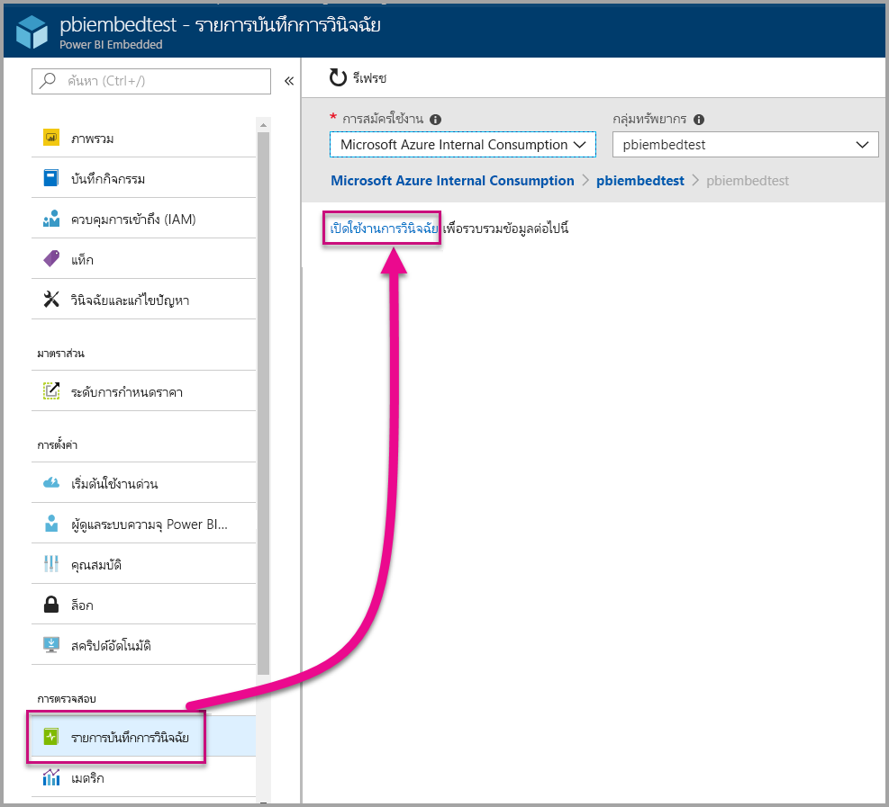
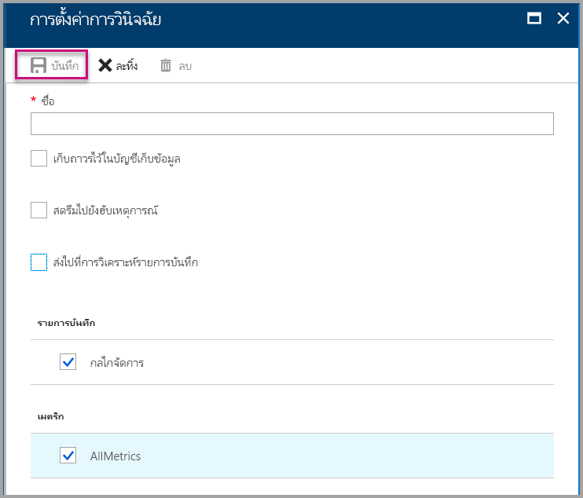
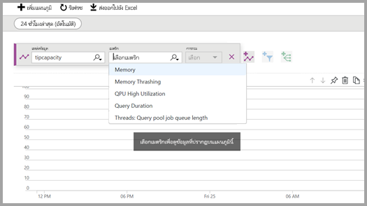
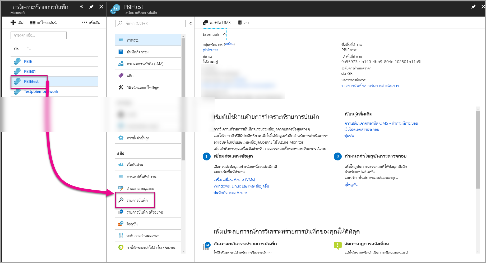
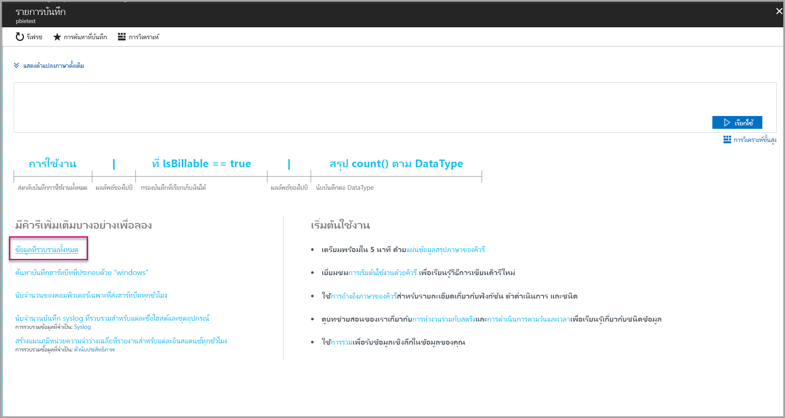
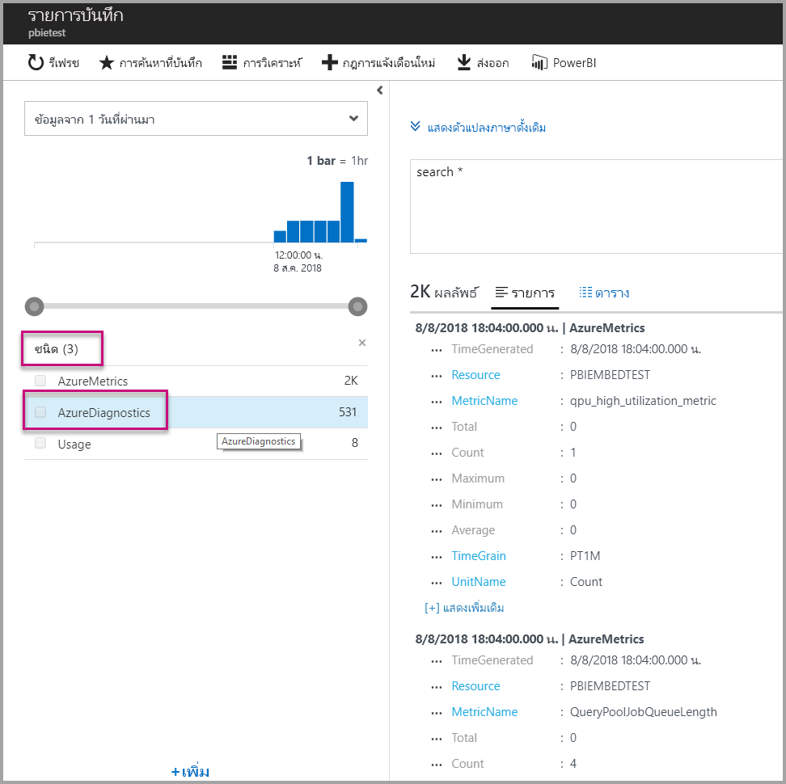
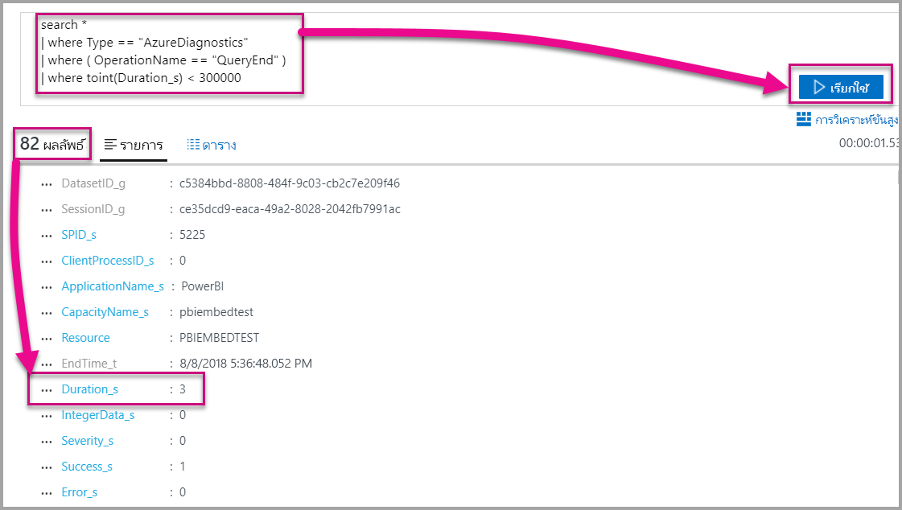
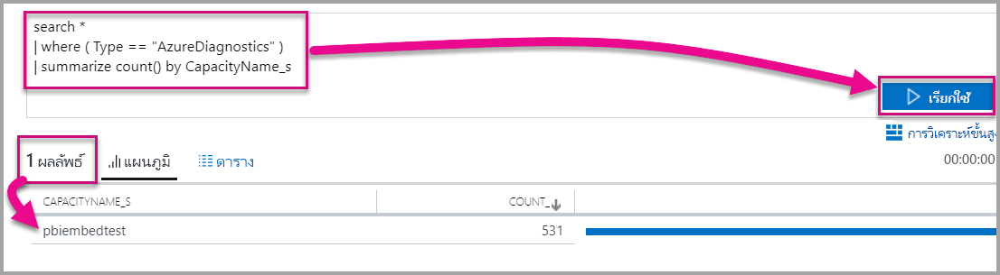

# <a name="diagnostic-logging-for-power-bi-embedded-in-azure"></a><span data-ttu-id="cba53-103">บันทึกการวินิจฉัยสำหรับ Power BI Embedded ใน Azure</span><span class="sxs-lookup"><span data-stu-id="cba53-103">Diagnostic logging for Power BI Embedded in Azure</span></span>

<span data-ttu-id="cba53-104">ด้วย[บันทึกการวินิจฉัยทรัพยากร Azure](/azure/monitoring-and-diagnostics/monitoring-overview-of-diagnostic-logs)คุณสามารถบันทึกเหตุการณ์มากมายจากความจุของคุณ เพิ่มเหตุการณ์เหล่านั้นลงในเครื่องมือการวิเคราะห์ และรับข้อมูลเชิงลึกเกี่ยวกับการทำงานของทรัพยากรของคุณ</span><span class="sxs-lookup"><span data-stu-id="cba53-104">With [Azure resource diagnostic logs](/azure/monitoring-and-diagnostics/monitoring-overview-of-diagnostic-logs), you can log many events from your capacity, pour them into an analytics tool and get insights into the behavior of your resource.</span></span>

<span data-ttu-id="cba53-105">ใช้การวินิจฉัยสามารถตอบสถานการณ์จำลองได้ เช่น:</span><span class="sxs-lookup"><span data-stu-id="cba53-105">Using Diagnostics can answer a few scenarios, such as:</span></span>

* <span data-ttu-id="cba53-106">ตรวจหาคิวรีที่ใช้งานเป็นเวลานานหรือมีปัญหา</span><span class="sxs-lookup"><span data-stu-id="cba53-106">Detection of long-running or problematic queries.</span></span>
* <span data-ttu-id="cba53-107">การจัดประเภทของ [เมตริกความจุ](https://powerbi.microsoft.com/blog/power-bi-developer-community-april-update/)</span><span class="sxs-lookup"><span data-stu-id="cba53-107">Derivation of [capacity metrics](https://powerbi.microsoft.com/blog/power-bi-developer-community-april-update/).</span></span>
* <span data-ttu-id="cba53-108">ติดตามการใช้งานของชุดข้อมูลแบบเฉพาะเจาะจง</span><span class="sxs-lookup"><span data-stu-id="cba53-108">Tracking usage of specific datasets.</span></span>

## <a name="set-up-diagnostics-logging"></a><span data-ttu-id="cba53-109">ตั้งค่าการบันทึกการวินิจฉัย</span><span class="sxs-lookup"><span data-stu-id="cba53-109">Set up diagnostics logging</span></span>

### <a name="azure-portal"></a><span data-ttu-id="cba53-110">พอร์ทัล Microsoft Azure</span><span class="sxs-lookup"><span data-stu-id="cba53-110">Azure portal</span></span>

1. <span data-ttu-id="cba53-111">ใน [พอร์ทัล Azure](https://portal.azure.com) > ทรัพยากร Power BI Embedded ให้เลือก **บันทึกการวินิจฉัย** ในบานหน้าต่างนำทาง แล้วเลือก **เปิดใช้งานการวินิจฉัย**</span><span class="sxs-lookup"><span data-stu-id="cba53-111">In [Azure portal](https://portal.azure.com) > Power BI Embedded resource, select **Diagnostic logs** in the nav pane, and then select **Turn on diagnostics**.</span></span>

    

2. <span data-ttu-id="cba53-113">ใน **ตั้งค่าการวินิจฉัย** ระบุตัวเลือกต่อไปนี้:</span><span class="sxs-lookup"><span data-stu-id="cba53-113">In **Diagnostic settings**, specify the following options:</span></span>

    * <span data-ttu-id="cba53-114">**ชื่อ**-ใส่ชื่อสำหรับการตั้งค่าการวินิจฉัยเพื่อสร้าง</span><span class="sxs-lookup"><span data-stu-id="cba53-114">**Name** - Enter a name for the diagnostics setting to create.</span></span>

    * <span data-ttu-id="cba53-115">**เก็บถาวรไปยังบัญชีที่เก็บข้อมูล**- การใช้ตัวเลือกนี้ คุณจำเป็นต้องเชื่อมต่อกับบัญชีเก็บข้อมูลที่มีอยู่</span><span class="sxs-lookup"><span data-stu-id="cba53-115">**Archive to a storage account** - To use this option, you need to connect to an existing storage account.</span></span> <span data-ttu-id="cba53-116">ดู[สร้างบัญชีเก็บข้อมูล](/azure/storage/common/storage-create-storage-account)และทำตามคำแนะนำเพื่อสร้างบัญชีเก็บข้อมูล</span><span class="sxs-lookup"><span data-stu-id="cba53-116">See [Create a storage account](/azure/storage/common/storage-create-storage-account), and follow the instructions to create a storage account.</span></span> <span data-ttu-id="cba53-117">หลังจากนั้นเลือกบัญชีที่เก็บข้อมูล โดยย้อนกลับไปยังหน้านี้ในพอร์ทัล</span><span class="sxs-lookup"><span data-stu-id="cba53-117">Then select your storage account by returning to this page in the portal.</span></span> <span data-ttu-id="cba53-118">ซึ่งอาจใช้เวลาสักครู่สำหรับบัญชีที่เก็บข้อมูลที่สร้างขึ้นใหม่เพื่อให้ปรากฏในเมนูดรอปดาวน์</span><span class="sxs-lookup"><span data-stu-id="cba53-118">It may take a few minutes for newly created storage accounts to appear in the drop-down menu.</span></span> <span data-ttu-id="cba53-119">ไฟล์บันทึกเก็บข้อมูลอยู่ในรูปแบบ JSON</span><span class="sxs-lookup"><span data-stu-id="cba53-119">Log file storage is in JSON format.</span></span>
    * <span data-ttu-id="cba53-120">**สตรีมไปยังฮับเหตุการณ์**- การใช้ตัวเลือกนี้ คุณจำเป็นต้องเชื่อมต่อกับอยู่ Event Hub namespace และเหตุการณ์ฮับ</span><span class="sxs-lookup"><span data-stu-id="cba53-120">**Stream to an event hub** - To use this option, you need to connect to an existing Event Hub namespace and event hub.</span></span> <span data-ttu-id="cba53-121">เมื่อต้องการเรียนรู้เพิ่มเติม ดู[สร้างมี namespace Event Hubs และฮับเหตุการณ์โดยใช้พอร์ทัล Azure](/azure/event-hubs/event-hubs-create)</span><span class="sxs-lookup"><span data-stu-id="cba53-121">To learn more, see [Create an Event Hubs namespace and an event hub using the Azure portal](/azure/event-hubs/event-hubs-create).</span></span>
    * <span data-ttu-id="cba53-122">**ส่งไปยัง Log Analytics** - การใช้ตัวเลือกนี้ ต้องใช้พื้นที่ทำงานที่มีอยู่ หรือสร้างพื้นที่ทำงาน Log Analytics ใหม่ โดยทำตามขั้นตอนในการ [สร้างพื้นที่ทำงานใหม่](/azure/log-analytics/log-analytics-quick-collect-azurevm#create-a-workspace)ในพอร์ทัล</span><span class="sxs-lookup"><span data-stu-id="cba53-122">**Send to Log Analytics** - To use this option, either use an existing workspace or create a new Log Analytics workspace by following the steps to [create a new workspace](/azure/log-analytics/log-analytics-quick-collect-azurevm#create-a-workspace) in the portal.</span></span> <span data-ttu-id="cba53-123">ใช้งาน[Azure Log Analytics](/azure/log-analytics/log-analytics-overview)ซึ่งมีความสามารถในการวิเคราะห์ การทำแดชบอร์ด และการแจ้งเตือนอยู่ภายใน</span><span class="sxs-lookup"><span data-stu-id="cba53-123">This leverages [Azure Log Analytics](/azure/log-analytics/log-analytics-overview), which provides built-in analysis, dashboarding and notification capabilities.</span></span> <span data-ttu-id="cba53-124">คุณสามารถใช้ Log Analytics เพื่อเชื่อมต่อข้อมูลเพิ่มเติมจากแหล่งข้อมูลอื่น ๆ และรับมุมมองเดียว ที่สมบูรณ์ของข้อมูลในแหล่งข้อมูลทั้งหมดของโปรแกรมประยุกต์</span><span class="sxs-lookup"><span data-stu-id="cba53-124">You can use Log Analytics to connect more data from other resources and get a single and complete view of data across all your application’s resources.</span></span> <span data-ttu-id="cba53-125">ซึ่งสามารถเชื่อมต่อกับ[Power BI ด้วยการคลิกครั้งเดียว](/azure/log-analytics/log-analytics-powerbi)ได้ด้วย</span><span class="sxs-lookup"><span data-stu-id="cba53-125">It can also be connected to [Power BI with a single click](/azure/log-analytics/log-analytics-powerbi).</span></span>
    <span data-ttu-id="cba53-126">สำหรับข้อมูลเพิ่มเติมเกี่ยวกับการดูบันทึกของคุณใน Log Analytics ดู[ดูบันทึกใน Log Analytics](/azure/log-analytics/log-analytics-activity)</span><span class="sxs-lookup"><span data-stu-id="cba53-126">For more information on viewing your logs in Log Analytics, see [View logs in Log Analytics](/azure/log-analytics/log-analytics-activity).</span></span>
    * <span data-ttu-id="cba53-127">**กลไกจัดการ** -เลือกตัวเลือกนี้เพื่อเข้าสู่ระบบชุดของกลไกจัดการ [เหตุการณ์ในรายการ](#whats-logged)ด้านล่าง</span><span class="sxs-lookup"><span data-stu-id="cba53-127">**Engine** - Select this option to log the set of engine [events listed](#whats-logged) below.</span></span>
    * <span data-ttu-id="cba53-128">**AllMetrics** -เลือกตัวเลือกนี้เพื่อจัดเก็บข้อมูลโดยละเอียดใน [เมตริก](/azure/analysis-services/analysis-services-monitor#server-metrics)</span><span class="sxs-lookup"><span data-stu-id="cba53-128">**AllMetrics** - Select this option to store verbose data in [Metrics](/azure/analysis-services/analysis-services-monitor#server-metrics).</span></span> <span data-ttu-id="cba53-129">ถ้าคุณเก็บถาวรไปยังบัญชีเก็บข้อมูล คุณสามารถเลือกระยะเวลาการเก็บข้อมูลสำหรับบันทึกการวินิจฉัยได้</span><span class="sxs-lookup"><span data-stu-id="cba53-129">If you are archiving to a storage account, you can select the retention period for the diagnostic logs.</span></span> <span data-ttu-id="cba53-130">บันทึกจะถูกลบโดยอัตโนมัติหลังจากรอบระยะเวลาเก็บข้อมูลหมดอายุลง</span><span class="sxs-lookup"><span data-stu-id="cba53-130">Logs are auto-deleted after the retention period expires.</span></span>

3. <span data-ttu-id="cba53-131">เลือก **บันทึก**</span><span class="sxs-lookup"><span data-stu-id="cba53-131">Select **Save**.</span></span>

    <span data-ttu-id="cba53-132">หากต้องการเปลี่ยนวิธีบันทึกของบันทึกการวินิจฉัย คุณสามารถกลับไปยังหน้านี้เพื่อปรับเปลี่ยนการตั้งค่า</span><span class="sxs-lookup"><span data-stu-id="cba53-132">To change how your diagnostic logs are saved, you can return to this page to modify settings.</span></span>

    

### <a name="using-powershell-to-enable-diagnostics"></a><span data-ttu-id="cba53-134">ใช้ PowerShell เพื่อเปิดใช้งานการวินิจฉัย</span><span class="sxs-lookup"><span data-stu-id="cba53-134">Using PowerShell to enable diagnostics</span></span>

<span data-ttu-id="cba53-135">เมื่อต้องการเปิดใช้งานเมตริกและเข้าสู่ระบบ โดยใช้ PowerShell การวินิจฉัย ให้ใช้คำสั่งต่อไปนี้:</span><span class="sxs-lookup"><span data-stu-id="cba53-135">To enable metrics and diagnostics logging by using PowerShell, use the following commands:</span></span>

* <span data-ttu-id="cba53-136">เมื่อต้องการเปิดใช้งานการเก็บข้อมูลของแฟ้มบันทึกการวินิจฉัยในบัญชีเก็บข้อมูล ให้ใช้คำสั่งนี้:</span><span class="sxs-lookup"><span data-stu-id="cba53-136">To enable storage of diagnostics logs in a storage account, use this command:</span></span>

    ```powershell
    Set-AzureRmDiagnosticSetting -ResourceId [your resource id] -StorageAccountId [your storage account id] -Enabled $true
    ```
    <span data-ttu-id="cba53-137">ID บัญชีที่เก็บข้อมูลเป็น ID ทรัพยากรสำหรับบัญชีเก็บข้อมูลที่คุณต้องการส่งบันทึก</span><span class="sxs-lookup"><span data-stu-id="cba53-137">The storage account ID is the resource ID for the storage account where you want to send the logs.</span></span>

* <span data-ttu-id="cba53-138">เมื่อต้องการเปิดใช้งานสตรีมของแฟ้มบันทึกการวินิจฉัยไปยังฮับเหตุการณ์ ให้ใช้คำสั่งนี้:</span><span class="sxs-lookup"><span data-stu-id="cba53-138">To enable streaming of diagnostics logs to an event hub, use this command:</span></span>

    ```powershell
    Set-AzureRmDiagnosticSetting -ResourceId [your resource id] -ServiceBusRuleId [your service bus rule id] -Enabled $true
    ```
* <span data-ttu-id="cba53-139">ID กฎ Azure Service Bus คือสตริงที่มีรูปแบบนี้:</span><span class="sxs-lookup"><span data-stu-id="cba53-139">The Azure Service Bus rule ID is a string with this format:</span></span>

    ```powershell
    {service bus resource ID}/authorizationrules/{key name}
    ```

* <span data-ttu-id="cba53-140">เมื่อต้องการเปิดใช้งานการส่งบันทึกการวินิจฉัยไปยังพื้นที่ทำงาน Log Analytics ให้ใช้คำสั่งนี้:</span><span class="sxs-lookup"><span data-stu-id="cba53-140">To enable sending diagnostics logs to a Log Analytics workspace, use this command:</span></span>

    ```powershell
        Set-AzureRmDiagnosticSetting -ResourceId [your resource id] -WorkspaceId [resource id of the log analytics workspace] -Enabled $true
    ```

* <span data-ttu-id="cba53-141">คุณสามารถขอรับ ID ทรัพยากรของพื้นที่ทำงาน Log Analytics ของคุณ โดยใช้คำสั่งต่อไปนี้:</span><span class="sxs-lookup"><span data-stu-id="cba53-141">You can obtain the resource ID of your Log Analytics workspace by using the following command:</span></span>

    ```powershell
    (Get-AzureRmOperationalInsightsWorkspace).ResourceId
    ```

<span data-ttu-id="cba53-142">คุณสามารถรวมพารามิเตอร์เหล่านี้เข้าด้วยกันเพื่อเปิดใช้งานผลลัพธ์หลายตัวเลือก</span><span class="sxs-lookup"><span data-stu-id="cba53-142">You can combine these parameters to enable multiple output options.</span></span>

### <a name="rest-api"></a><span data-ttu-id="cba53-143">REST API</span><span class="sxs-lookup"><span data-stu-id="cba53-143">REST API</span></span>

<span data-ttu-id="cba53-144">เรียนรู้วิธีการ[เปลี่ยนการตั้งค่าการวินิจฉัย โดยใช้ตัวตรวจสอบ REST API Azure](/rest/api/monitor/)</span><span class="sxs-lookup"><span data-stu-id="cba53-144">Learn how to [change diagnostics settings by using the Azure Monitor REST API](/rest/api/monitor/).</span></span> 

### <a name="resource-manager-template"></a><span data-ttu-id="cba53-145">เทมเพลต resource Manager</span><span class="sxs-lookup"><span data-stu-id="cba53-145">Resource Manager template</span></span>

<span data-ttu-id="cba53-146">เรียนรู้วิธีการ[เปิดใช้งานการตั้งค่าการวินิจฉัยที่สร้างทรัพยากร โดยใช้เทมเพลต Resource Manager](/azure/monitoring-and-diagnostics/monitoring-enable-diagnostic-logs-using-template)</span><span class="sxs-lookup"><span data-stu-id="cba53-146">Learn how to [enable diagnostics settings at resource creation by using a Resource Manager template](/azure/monitoring-and-diagnostics/monitoring-enable-diagnostic-logs-using-template).</span></span>

## <a name="whats-logged"></a><span data-ttu-id="cba53-147">บันทึกคืออะไร?</span><span class="sxs-lookup"><span data-stu-id="cba53-147">What's logged?</span></span>

<span data-ttu-id="cba53-148">คุณสามารถเลือกประเภท **กลไก** / **AllMetrics** ได้</span><span class="sxs-lookup"><span data-stu-id="cba53-148">You can select **Engine** and/or the **AllMetrics** categories.</span></span>

### <a name="engine"></a><span data-ttu-id="cba53-149">กลไกจัดการ</span><span class="sxs-lookup"><span data-stu-id="cba53-149">Engine</span></span>

<span data-ttu-id="cba53-150">ประเภทกลไกจัดการแนะนำทรัพยากรในการบันทึกเหตุการณ์ต่อไปนี้ และแต่ละเหตุการณ์มีคุณสมบัติ:</span><span class="sxs-lookup"><span data-stu-id="cba53-150">The engine category instructs the resource to log the following events, and on each of the events there are properties:</span></span>

|     <span data-ttu-id="cba53-151">ชื่อเหตุการณ์</span><span class="sxs-lookup"><span data-stu-id="cba53-151">Event Name</span></span>     |     <span data-ttu-id="cba53-152">คำอธิบายเหตุการณ์</span><span class="sxs-lookup"><span data-stu-id="cba53-152">Event Description</span></span>     |
|----------------------------|----------------------------------------------------------------------------------|
|    <span data-ttu-id="cba53-153">เข้าสู่ระบบการตรวจสอบ</span><span class="sxs-lookup"><span data-stu-id="cba53-153">Audit Login</span></span>    |    <span data-ttu-id="cba53-154">บันทึกการเชื่อมต่อใหม่ทั้งหมดลงในเหตุการณ์กลไกจัดการตั้งแต่เริ่มต้นใช้งานการติดตาม</span><span class="sxs-lookup"><span data-stu-id="cba53-154">Records all new connection to   the engine events since the trace started.</span></span>    |
|    <span data-ttu-id="cba53-155">เตรียมใช้งานเซสชัน</span><span class="sxs-lookup"><span data-stu-id="cba53-155">Session Initialize</span></span>    |    <span data-ttu-id="cba53-156">บันทึกเหตุการณ์เริ่มต้นเซสชันทั้งหมดตั้งแต่เริ่มต้นใช้งานการติดตาม</span><span class="sxs-lookup"><span data-stu-id="cba53-156">Records all session   initialization events since the trace started.</span></span>    |
|    <span data-ttu-id="cba53-157">เริ่มต้นคิวรี Vertipaq</span><span class="sxs-lookup"><span data-stu-id="cba53-157">Vertipaq Query Begin</span></span>    |    <span data-ttu-id="cba53-158">บันทึกเหตุการณ์เริ่มต้นคิวรี VertiPaq SE ทั้งหมด ตั้งแต่เริ่มต้นใช้งานการติดตาม</span><span class="sxs-lookup"><span data-stu-id="cba53-158">Records all VertiPaq SE query   begin events since the trace started.</span></span>    |
|    <span data-ttu-id="cba53-159">เริ่มต้นคิวรี</span><span class="sxs-lookup"><span data-stu-id="cba53-159">Query Begin</span></span>    |    <span data-ttu-id="cba53-160">บันทึกเหตุการณ์เริ่มต้นคิวรีทั้งหมด ตั้งแต่เริ่มต้นใช้งานการติดตาม</span><span class="sxs-lookup"><span data-stu-id="cba53-160">Records all query begin events   since the trace started.</span></span>    |
|    <span data-ttu-id="cba53-161">คิวรีสิ้นสุด</span><span class="sxs-lookup"><span data-stu-id="cba53-161">Query End</span></span>    |    <span data-ttu-id="cba53-162">บันทึกเหตุการณ์สิ้นสุดคิวรีทั้งหมด ตั้งแต่เริ่มต้นใช้งานการติดตาม</span><span class="sxs-lookup"><span data-stu-id="cba53-162">Records all query end events   since the trace started.</span></span>    |
|    <span data-ttu-id="cba53-163">คิวรี Vertipaq สิ้นสุด</span><span class="sxs-lookup"><span data-stu-id="cba53-163">Vertipaq Query End</span></span>    |    <span data-ttu-id="cba53-164">บันทึกเหตุการณ์สิ้นสุดคิวรี VertiPaq SE ทั้งหมด ตั้งแต่เริ่มต้นใช้งานการติดตาม</span><span class="sxs-lookup"><span data-stu-id="cba53-164">Records all VertiPaq SE query   end events since the trace started.</span></span>    |
|    <span data-ttu-id="cba53-165">ออกจากระบบการตรวจสอบ</span><span class="sxs-lookup"><span data-stu-id="cba53-165">Audit Logout</span></span>    |    <span data-ttu-id="cba53-166">บันทึกเหตุการณ์ยกเลิกการเชื่อมจากกลไกจัดการทั้งหมดตั้งแต่เริ่มต้นใช้งานการติดตาม</span><span class="sxs-lookup"><span data-stu-id="cba53-166">Records all disconnect from   engine events since the trace started.</span></span>    |
|    <span data-ttu-id="cba53-167">ข้อผิดพลาด</span><span class="sxs-lookup"><span data-stu-id="cba53-167">Error</span></span>    |    <span data-ttu-id="cba53-168">บันทึกเหตุการณ์ข้อผิดพลาดโปรแกรมทั้งหมดตั้งแต่เริ่มต้นใช้งานการติดตาม</span><span class="sxs-lookup"><span data-stu-id="cba53-168">Records all engine error   events since the trace started.</span></span>    |

<br>
<br>

| <span data-ttu-id="cba53-169">ชื่อคุณสมบัติ</span><span class="sxs-lookup"><span data-stu-id="cba53-169">Property Name</span></span> | <span data-ttu-id="cba53-170">ตัวอย่างสิ้นสุดคิวรี Vertipaq</span><span class="sxs-lookup"><span data-stu-id="cba53-170">Vertipaq Query End Example</span></span> | <span data-ttu-id="cba53-171">คำอธิบายคุณสมบัติ</span><span class="sxs-lookup"><span data-stu-id="cba53-171">Property Description</span></span> |
|-------------------|---------------------------------------------------------------------------------------------------------------------------------------------------------------------------------------------------------|--------------------------------------------------------------------------------------------------------------------------|
| <span data-ttu-id="cba53-172">EventClass</span><span class="sxs-lookup"><span data-stu-id="cba53-172">EventClass</span></span> | <span data-ttu-id="cba53-173">XM_SEQUERY_END</span><span class="sxs-lookup"><span data-stu-id="cba53-173">XM_SEQUERY_END</span></span> | <span data-ttu-id="cba53-174">คลาสเหตุการณ์ถูกใช้เพื่อจัดประเภทเหตุการณ์</span><span class="sxs-lookup"><span data-stu-id="cba53-174">Event Class is used to categorize events.</span></span> |
| <span data-ttu-id="cba53-175">EventSubclass</span><span class="sxs-lookup"><span data-stu-id="cba53-175">EventSubclass</span></span> | <span data-ttu-id="cba53-176">0</span><span class="sxs-lookup"><span data-stu-id="cba53-176">0</span></span> | <span data-ttu-id="cba53-177">เหตุการณ์คลาสย่อยกิจกรรมมีข้อมูลเพิ่มเติมเกี่ยวกับแต่ละคลาสกิจกรรม</span><span class="sxs-lookup"><span data-stu-id="cba53-177">Event Subclass provides additional information about each event class.</span></span> <span data-ttu-id="cba53-178">(ตัวอย่าง 0: สแกน VertiPaq)</span><span class="sxs-lookup"><span data-stu-id="cba53-178">(for example, 0: VertiPaq Scan)</span></span> |
| <span data-ttu-id="cba53-179">RootActivityId</span><span class="sxs-lookup"><span data-stu-id="cba53-179">RootActivityId</span></span> | <span data-ttu-id="cba53-180">ff217fd2-611d-43c0-9c12-19e202a94f70</span><span class="sxs-lookup"><span data-stu-id="cba53-180">ff217fd2-611d-43c0-9c12-19e202a94f70</span></span> | <span data-ttu-id="cba53-181">ID กิจกรรมราก</span><span class="sxs-lookup"><span data-stu-id="cba53-181">Root activity ID.</span></span> |
| <span data-ttu-id="cba53-182">CurrentTime</span><span class="sxs-lookup"><span data-stu-id="cba53-182">CurrentTime</span></span> | <span data-ttu-id="cba53-183">2018-04-06T18:30:11.9137358Z</span><span class="sxs-lookup"><span data-stu-id="cba53-183">2018-04-06T18:30:11.9137358Z</span></span> | <span data-ttu-id="cba53-184">เวลาที่เหตุการณ์เริ่มต้นเมื่อพร้อมใช้งาน</span><span class="sxs-lookup"><span data-stu-id="cba53-184">Time at which the event started when available.</span></span> |
| <span data-ttu-id="cba53-185">startTime</span><span class="sxs-lookup"><span data-stu-id="cba53-185">StartTime</span></span> | <span data-ttu-id="cba53-186">2018-04-06T18:30:11.9137358Z</span><span class="sxs-lookup"><span data-stu-id="cba53-186">2018-04-06T18:30:11.9137358Z</span></span> | <span data-ttu-id="cba53-187">เวลาที่เหตุการณ์เริ่มต้นเมื่อพร้อมใช้งาน</span><span class="sxs-lookup"><span data-stu-id="cba53-187">Time at which the event started when available.</span></span> |
| <span data-ttu-id="cba53-188">JobID</span><span class="sxs-lookup"><span data-stu-id="cba53-188">JobID</span></span> | <span data-ttu-id="cba53-189">0</span><span class="sxs-lookup"><span data-stu-id="cba53-189">0</span></span> | <span data-ttu-id="cba53-190">ID งานสำหรับความคืบหน้า</span><span class="sxs-lookup"><span data-stu-id="cba53-190">Job ID for progress.</span></span> |
| <span data-ttu-id="cba53-191">ObjectID</span><span class="sxs-lookup"><span data-stu-id="cba53-191">ObjectID</span></span> | <span data-ttu-id="cba53-192">464</span><span class="sxs-lookup"><span data-stu-id="cba53-192">464</span></span> | <span data-ttu-id="cba53-193">ID ของออบเจ็กต์</span><span class="sxs-lookup"><span data-stu-id="cba53-193">Object ID</span></span> |
| <span data-ttu-id="cba53-194">ObjectType</span><span class="sxs-lookup"><span data-stu-id="cba53-194">ObjectType</span></span> | <span data-ttu-id="cba53-195">802012</span><span class="sxs-lookup"><span data-stu-id="cba53-195">802012</span></span> | <span data-ttu-id="cba53-196">ObjectType</span><span class="sxs-lookup"><span data-stu-id="cba53-196">ObjectType</span></span> |
| <span data-ttu-id="cba53-197">เวลาสิ้นสุด</span><span class="sxs-lookup"><span data-stu-id="cba53-197">EndTime</span></span> | <span data-ttu-id="cba53-198">2018-04-06T18:30:11.9137358Z</span><span class="sxs-lookup"><span data-stu-id="cba53-198">2018-04-06T18:30:11.9137358Z</span></span> | <span data-ttu-id="cba53-199">เวลาที่เหตุการณ์สิ้นสุด</span><span class="sxs-lookup"><span data-stu-id="cba53-199">Time at which the event ended.</span></span> |
| <span data-ttu-id="cba53-200">ระยะเวลา</span><span class="sxs-lookup"><span data-stu-id="cba53-200">Duration</span></span> | <span data-ttu-id="cba53-201">0</span><span class="sxs-lookup"><span data-stu-id="cba53-201">0</span></span> | <span data-ttu-id="cba53-202">ระยะเวลา (ในหน่วยมิลลิวินาที) ที่ใช้โดยกิจกรรม</span><span class="sxs-lookup"><span data-stu-id="cba53-202">Amount of time (in milliseconds) taken by the event.</span></span> |
| <span data-ttu-id="cba53-203">SessionType</span><span class="sxs-lookup"><span data-stu-id="cba53-203">SessionType</span></span> | <span data-ttu-id="cba53-204">User</span><span class="sxs-lookup"><span data-stu-id="cba53-204">User</span></span> | <span data-ttu-id="cba53-205">ประเภทเซสชัน (เอนทิตีใดที่เป็นเหตุให้เกิดการดำเนินการ)</span><span class="sxs-lookup"><span data-stu-id="cba53-205">Session type (what entity caused the operation).</span></span> |
| <span data-ttu-id="cba53-206">ProgressTotal</span><span class="sxs-lookup"><span data-stu-id="cba53-206">ProgressTotal</span></span> | <span data-ttu-id="cba53-207">0</span><span class="sxs-lookup"><span data-stu-id="cba53-207">0</span></span> | <span data-ttu-id="cba53-208">ความคืบหน้าทั้งหมด</span><span class="sxs-lookup"><span data-stu-id="cba53-208">Progress total.</span></span> |
| <span data-ttu-id="cba53-209">IntegerData</span><span class="sxs-lookup"><span data-stu-id="cba53-209">IntegerData</span></span> | <span data-ttu-id="cba53-210">0</span><span class="sxs-lookup"><span data-stu-id="cba53-210">0</span></span> | <span data-ttu-id="cba53-211">ข้อมูลจำนวนเต็ม</span><span class="sxs-lookup"><span data-stu-id="cba53-211">Integer data.</span></span> |
| <span data-ttu-id="cba53-212">ความรุนแรง</span><span class="sxs-lookup"><span data-stu-id="cba53-212">Severity</span></span> | <span data-ttu-id="cba53-213">0</span><span class="sxs-lookup"><span data-stu-id="cba53-213">0</span></span> | <span data-ttu-id="cba53-214">ระดับความรุนแรงของข้อยกเว้น</span><span class="sxs-lookup"><span data-stu-id="cba53-214">Severity level of an exception.</span></span> |
| <span data-ttu-id="cba53-215">ความสำเร็จ</span><span class="sxs-lookup"><span data-stu-id="cba53-215">Success</span></span> | <span data-ttu-id="cba53-216">1</span><span class="sxs-lookup"><span data-stu-id="cba53-216">1</span></span> | <span data-ttu-id="cba53-217">1 = สำเร็จ</span><span class="sxs-lookup"><span data-stu-id="cba53-217">1 = success.</span></span> <span data-ttu-id="cba53-218">0 = ล้มเหลว (ตัวอย่างเช่น 1 หมายถึงการตรวจสอบสิทธิ์เสร็จเรียบร้อยแล้ว และ 0 หมายถึงการตรวจสอบล้มเหลว)</span><span class="sxs-lookup"><span data-stu-id="cba53-218">0 = failure (for example, a 1 means success of a permissions check and a 0 means a failure of that check).</span></span> |
| <span data-ttu-id="cba53-219">ข้อผิดพลาด</span><span class="sxs-lookup"><span data-stu-id="cba53-219">Error</span></span> | <span data-ttu-id="cba53-220">0</span><span class="sxs-lookup"><span data-stu-id="cba53-220">0</span></span> | <span data-ttu-id="cba53-221">จำนวนข้อผิดพลาดของกิจกรรมที่ให้ไว้</span><span class="sxs-lookup"><span data-stu-id="cba53-221">Error number of a given event.</span></span> |
| <span data-ttu-id="cba53-222">ConnectionID</span><span class="sxs-lookup"><span data-stu-id="cba53-222">ConnectionID</span></span> | <span data-ttu-id="cba53-223">3</span><span class="sxs-lookup"><span data-stu-id="cba53-223">3</span></span> | <span data-ttu-id="cba53-224">ID การเชื่อมต่อเฉพาะ</span><span class="sxs-lookup"><span data-stu-id="cba53-224">Unique connection ID.</span></span> |
| <span data-ttu-id="cba53-225">DatasetID</span><span class="sxs-lookup"><span data-stu-id="cba53-225">DatasetID</span></span> | <span data-ttu-id="cba53-226">5eaa550e-06ac-4adf-aba9-dbf0e8fd1527</span><span class="sxs-lookup"><span data-stu-id="cba53-226">5eaa550e-06ac-4adf-aba9-dbf0e8fd1527</span></span> | <span data-ttu-id="cba53-227">ID ของฐานข้อมูลที่คำสั่งของผู้ใช้กำลังทำงานอยู่</span><span class="sxs-lookup"><span data-stu-id="cba53-227">Id of the dataset in which the statement of the user is running.</span></span> |
| <span data-ttu-id="cba53-228">SessionID</span><span class="sxs-lookup"><span data-stu-id="cba53-228">SessionID</span></span> | <span data-ttu-id="cba53-229">3D063F66-A111-48EE-B960-141DEBDA8951</span><span class="sxs-lookup"><span data-stu-id="cba53-229">3D063F66-A111-48EE-B960-141DEBDA8951</span></span> | <span data-ttu-id="cba53-230">GUID เซสชัน</span><span class="sxs-lookup"><span data-stu-id="cba53-230">Session GUID.</span></span> |
| <span data-ttu-id="cba53-231">SPID</span><span class="sxs-lookup"><span data-stu-id="cba53-231">SPID</span></span> | <span data-ttu-id="cba53-232">180</span><span class="sxs-lookup"><span data-stu-id="cba53-232">180</span></span> | <span data-ttu-id="cba53-233">ID กระบวนการของเซิร์ฟเวอร์</span><span class="sxs-lookup"><span data-stu-id="cba53-233">Server process ID.</span></span> <span data-ttu-id="cba53-234">ซึ่งระบุเซสชันผู้ใช้โดยเฉพาะ</span><span class="sxs-lookup"><span data-stu-id="cba53-234">This uniquely identifies a user session.</span></span> <span data-ttu-id="cba53-235">ซึ่งสอดคล้องกับเซสชัน GUID ที่ใช้ โดย XML/a โดยตรง</span><span class="sxs-lookup"><span data-stu-id="cba53-235">This directly corresponds to the session GUID used by XML/A.</span></span> |
| <span data-ttu-id="cba53-236">ClientProcessID</span><span class="sxs-lookup"><span data-stu-id="cba53-236">ClientProcessID</span></span> | <span data-ttu-id="cba53-237">null</span><span class="sxs-lookup"><span data-stu-id="cba53-237">null</span></span> | <span data-ttu-id="cba53-238">ID กระบวนการของแอปพลิเคชันไคลเอ็นต์</span><span class="sxs-lookup"><span data-stu-id="cba53-238">The process ID of the client application.</span></span> |
| <span data-ttu-id="cba53-239">ApplicationName</span><span class="sxs-lookup"><span data-stu-id="cba53-239">ApplicationName</span></span> | <span data-ttu-id="cba53-240">null</span><span class="sxs-lookup"><span data-stu-id="cba53-240">null</span></span> | <span data-ttu-id="cba53-241">ชื่อของแอปพลิเคชันไคลเอ็นต์ที่สร้างการเชื่อมต่อกับเซิร์ฟเวอร์</span><span class="sxs-lookup"><span data-stu-id="cba53-241">Name of the client application that created the connection to the server.</span></span> |
| <span data-ttu-id="cba53-242">CapacityName</span><span class="sxs-lookup"><span data-stu-id="cba53-242">CapacityName</span></span> | <span data-ttu-id="cba53-243">pbi641fb41260f84aa2b778a85891ae2d97</span><span class="sxs-lookup"><span data-stu-id="cba53-243">pbi641fb41260f84aa2b778a85891ae2d97</span></span> | <span data-ttu-id="cba53-244">ชื่อของทรัพยากรความจุ Power BI Embedded</span><span class="sxs-lookup"><span data-stu-id="cba53-244">The name of the Power BI Embedded capacity resource.</span></span> |


### <a name="allmetrics"></a><span data-ttu-id="cba53-245">AllMetrics</span><span class="sxs-lookup"><span data-stu-id="cba53-245">AllMetrics</span></span>

<span data-ttu-id="cba53-246">ตรวจสอบตัวเลือก **AllMetrics** บันทึกข้อมูลของเมตริกทั้งหมดที่คุณสามารถใช้กับทรัพยากร Power BI Embedded</span><span class="sxs-lookup"><span data-stu-id="cba53-246">Checking the **AllMetrics** option logs the data of all the metrics that you can use with a Power BI Embedded resource.</span></span>

   

## <a name="manage-your-logs"></a><span data-ttu-id="cba53-248">จัดการบันทึกของคุณ</span><span class="sxs-lookup"><span data-stu-id="cba53-248">Manage your logs</span></span>

<span data-ttu-id="cba53-249">บันทึกจะพร้อมใช้งานโดยทั่วไปภายในสองสามชั่วโมงหลังจากการตั้งค่าการบันทึก</span><span class="sxs-lookup"><span data-stu-id="cba53-249">Logs are typically available within a couple of hours after setting up logging.</span></span> <span data-ttu-id="cba53-250">การจัดการบันทึกของคุณในบัญชีที่เก็บข้อมูลของคุณนั้นขึ้นอยู่กับคุณ:</span><span class="sxs-lookup"><span data-stu-id="cba53-250">It's up to you to manage your logs in your storage account:</span></span>

* <span data-ttu-id="cba53-251">ใช้วิธีการควบคุมการเข้าถึง Azure แบบมาตรฐานเพื่อรักษาความปลอดภัยบันทึกของคุณ โดยการจำกัดว่าใครสามารถเข้าถึงได้บ้าง</span><span class="sxs-lookup"><span data-stu-id="cba53-251">Use standard Azure access control methods to secure your logs by restricting who can access them.</span></span>
* <span data-ttu-id="cba53-252">ลบไฟล์บันทึกที่คุณไม่ต้องการเก็บไว้ในบัญชีที่เก็บข้อมูลของคุณ</span><span class="sxs-lookup"><span data-stu-id="cba53-252">Delete logs that you no longer want to keep in your storage account.</span></span>
* <span data-ttu-id="cba53-253">ตรวจสอบให้แน่ใจว่าได้ทำการตั้งค่าระยะเวลาการเก็บข้อมูล เพื่อบันทึกเก่าจะถูกลบออกจากบัญชีที่เก็บข้อมูลของคุณ</span><span class="sxs-lookup"><span data-stu-id="cba53-253">Be sure to set a retention period, so old logs are deleted from your storage account.</span></span>

## <a name="view-logs-in-log-analytics"></a><span data-ttu-id="cba53-254">มุมมองบันทึกใน Log Analytics</span><span class="sxs-lookup"><span data-stu-id="cba53-254">View logs in Log Analytics</span></span>

<span data-ttu-id="cba53-255">เหตุการณ์เมตริกและเซิร์ฟเวอร์ผสานเข้ากับ xEvents ใน Log Analytics สำหรับการวิเคราะห์แบบเปรียบเทียบกัน</span><span class="sxs-lookup"><span data-stu-id="cba53-255">Metrics and server events are integrated with xEvents in Log Analytics for side-by-side analysis.</span></span> <span data-ttu-id="cba53-256">นอกจากนี้ยังสามารถกำหนดค่า log Analytics เพื่อรับเหตุการณ์จากบริการอื่น ๆ ของ Azure ที่มีมุมมองภาพรวมของข้อมูลบันทึกการวินิจฉัยทั่วทั้งสถาปัตยกรรมของคุณ</span><span class="sxs-lookup"><span data-stu-id="cba53-256">Log Analytics can also be configured to receive events from other Azure services that provide a holistic view of diagnostic logging data across your architecture.</span></span>

<span data-ttu-id="cba53-257">เมื่อต้องการดูข้อมูลการวินิจฉัยของคุณใน Log Analytics ให้เปิดหน้า **บันทึก** จากเมนูทางด้านซ้ายหรือบริเวณการจัดการ ดังที่แสดงด้านล่าง</span><span class="sxs-lookup"><span data-stu-id="cba53-257">To view your diagnostic data in Log Analytics, open the **Logs** page from the left menu or the Management area, as shown below.</span></span>



<span data-ttu-id="cba53-259">หลังจากที่คุณได้เปิดใช้งานคอลเลกชันข้อมูล ใน **บันทึก** เลือก **ทั้งหมดรวบรวมข้อมูล**</span><span class="sxs-lookup"><span data-stu-id="cba53-259">Now that you've enabled data collection, in **Logs**, select **All collected data**.</span></span>



<span data-ttu-id="cba53-261">ใน **ชนิด** เลือก **AzureDiagnostics** และจากนั้น เลือก **นำไปใช้**</span><span class="sxs-lookup"><span data-stu-id="cba53-261">In **Type**, select **AzureDiagnostics**, and then select **Apply**.</span></span> <span data-ttu-id="cba53-262">AzureDiagnostics มีกลไกจัดการเหตุการณ์</span><span class="sxs-lookup"><span data-stu-id="cba53-262">AzureDiagnostics includes Engine events.</span></span> <span data-ttu-id="cba53-263">โปรดสังเกตว่า คิวรี Log Analytics ได้ถูกสร้างขึ้นในทันที</span><span class="sxs-lookup"><span data-stu-id="cba53-263">Notice a Log Analytics query is created on-the-fly.</span></span>



<span data-ttu-id="cba53-265">เลือก **EventClass\_s** หรือชื่อเหตุการณ์และ Log Analytics จะยังคงสร้างคิวรีต่อไป</span><span class="sxs-lookup"><span data-stu-id="cba53-265">Select **EventClass\_s** or one of the event names and Log Analytics continues constructing a query.</span></span> <span data-ttu-id="cba53-266">อย่าลืมบันทึกคิวรีของคุณเพื่อนำมาใช้ใหม่ในภายหลัง</span><span class="sxs-lookup"><span data-stu-id="cba53-266">Be sure to save your queries to reuse later.</span></span>

<span data-ttu-id="cba53-267">โปรดดู[Log Analytics](/azure/log-analytics/)ซึ่งมีเว็บไซต์กับคิวรีขั้นสูง การทำแดชบอร์ด และความสามารถในการแจ้งเตือนบนข้อมูลที่รวบรวม</span><span class="sxs-lookup"><span data-stu-id="cba53-267">Be sure to see [Log Analytics](/azure/log-analytics/), which provides a website with an enhanced query, dashboarding, and alerting capabilities on collected data.</span></span>

### <a name="queries"></a><span data-ttu-id="cba53-268">แบบสอบถาม</span><span class="sxs-lookup"><span data-stu-id="cba53-268">Queries</span></span>

<span data-ttu-id="cba53-269">มีหลายร้อยคิวรีที่คุณสามารถใช้ได้</span><span class="sxs-lookup"><span data-stu-id="cba53-269">There are hundreds of queries you can use.</span></span> <span data-ttu-id="cba53-270">นี่คือบางคิวรีที่คุณสามารถเริ่มใช้งานได้</span><span class="sxs-lookup"><span data-stu-id="cba53-270">Here are a few to get you started.</span></span> <span data-ttu-id="cba53-271">เมื่อต้องการเรียนรู้เพิ่มเติมเกี่ยวกับการใช้ภาษาคิวรีค้นหาบันทึกใหม่ ดู[ค้นหาบันทึกการทำความเข้าใจใน Log Analytics](/azure/log-analytics/log-analytics-log-search)</span><span class="sxs-lookup"><span data-stu-id="cba53-271">To learn more about using the new Log Search query language, see [Understanding log searches in Log Analytics](/azure/log-analytics/log-analytics-log-search).</span></span>

* <span data-ttu-id="cba53-272">คิวรีส่งกลับที่ใช้เวลาน้อยกว่าห้านาที (300,000 มิลลิวินาที) เพื่อทำให้เสร็จสมบูรณ์</span><span class="sxs-lookup"><span data-stu-id="cba53-272">Query return that took less than five minutes (300,000 milliseconds) to complete.</span></span>

    ```
    search *
    | where Type == "AzureDiagnostics"
    | where ( OperationName == "QueryEnd" )
    | where toint(Duration_s) < 300000
    ```

    

* <span data-ttu-id="cba53-274">ระบุชื่อกำลังการผลิต</span><span class="sxs-lookup"><span data-stu-id="cba53-274">Identify capacity names.</span></span>

    ```
    search *
    | where ( Type == "AzureDiagnostics" )
    | summarize count() by CapacityName_s 
    ```

    

## <a name="next-steps"></a><span data-ttu-id="cba53-276">ขั้นตอนถัดไป</span><span class="sxs-lookup"><span data-stu-id="cba53-276">Next steps</span></span>

<span data-ttu-id="cba53-277">คุณสามารถเรียนรู้เพิ่มเติมเกี่ยวกับบันทึกการวินิจฉัยทรัพยากร Azure</span><span class="sxs-lookup"><span data-stu-id="cba53-277">You can learn more about Azure resource diagnostic logging.</span></span>

> [!div class="nextstepaction"]
> [<span data-ttu-id="cba53-278">บันทึกการวินิจฉัยทรัพยากร azure</span><span class="sxs-lookup"><span data-stu-id="cba53-278">Azure resource diagnostic logging</span></span>](/azure/monitoring-and-diagnostics/monitoring-overview-of-diagnostic-logs)

> [!div class="nextstepaction"]
> [<span data-ttu-id="cba53-279">ชุด-AzureRmDiagnosticSetting</span><span class="sxs-lookup"><span data-stu-id="cba53-279">Set-AzureRmDiagnosticSetting</span></span>](/powershell/module/azurerm.insights/Set-AzureRmDiagnosticSetting)