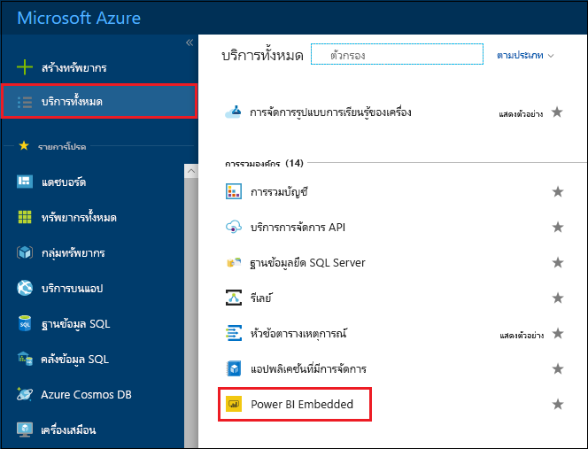
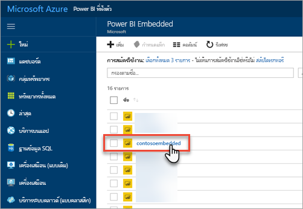
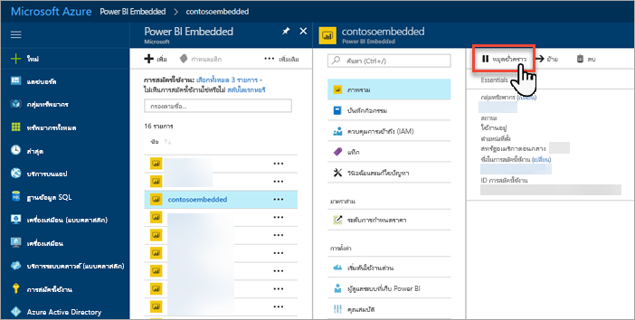
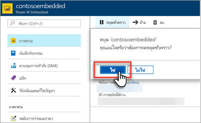
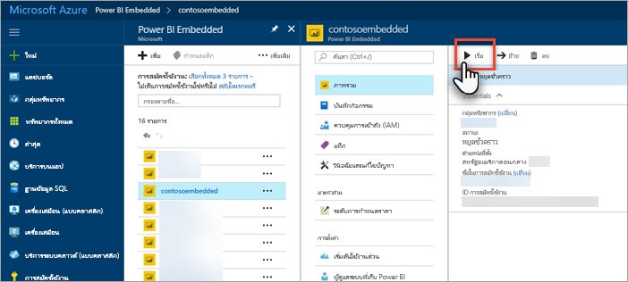
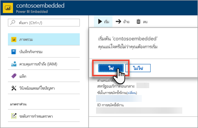

# เพื่อหยุดชั่วคราวและเริ่มต้นความจุ Power BI Embedded ในพอร์ทัล AzurePause and start your Power BI Embedded capacity in the Azure portal

บทความนี้แนะนำเกี่ยวกับวิธีการหยุดชั่วคราวและเริ่มต้น Power BI Embedded ใน Microsoft AzureThis article walks through how to pause and start a Power BI Embedded capacity in Microsoft Azure. ซึ่งถือว่า คุณได้สร้างขีดความจุ Power BI Embedded แล้วThis assumes you have created a Power BI Embedded capacity. หากคุณยังไม่ได้สร้าง ให้ดู[สร้างความจุ Power BI Embedded ในพอร์ทัล Azure](azure-pbie-create-capacity.md) เพื่อเริ่มใช้งานIf you have not, see [Create Power BI Embedded capacity in the Azure portal](azure-pbie-create-capacity.md) to get started.

ถ้าคุณยังไม่มีการสมัครใช้งาน Azure สร้าง[บัญชีฟรี](https://azure.microsoft.com/free/)ก่อนที่คุณจะเริ่มIf you don't have an Azure subscription, create a [free account](https://azure.microsoft.com/free/) before you begin.

## หยุดความจุของคุณชั่วคราวPause your capacity

การหยุดความจุของคุณชั่วคราวช่วยป้องกันไม่ให้คุณถูกเรียกเก็บเงินPausing your capacity prevents you from being billed. การหยุดความจุของคุณชั่วคราวจะเป็นเรื่องที่เยี่ยมยอด ่ถ้าคุณไม่จำเป็นต้องใช้ความจุเป็นระยะเวลาหนึ่งPausing your capacity is great if you do not need to use the capacity for a period of time. ใช้ขั้นตอนต่อไปนี้เพื่อหยุดความจุของคุณชั่วคราวUse the following steps to pause your capacity.

> [!NOTE]
> การหยุดความจุชั่วคราวอาจทำให้เนื้อหาไม่พร้อมใช้งานภายใน Power BIPausing a capacity may prevent content from being available within Power BI. ตรวจสอบว่าได้ยกเลิกการมอบหมายพื้นที่ทำงานจากความจุของคุณก่อนที่จะหยุดชั่วคราวเพื่อป้องกันไม่ให้ถูกขัดจังหวะMake sure to unassign workspaces from your capacity before pausing to prevent interruption.

1. ลงชื่อเข้าใช้[พอร์ทัล Azure](https://portal.azure.com/)Sign into the [Azure portal](https://portal.azure.com/).

2. เลือก **บริการทั้งหมด** > **Power BI Embedded** เพื่อดูความจุของคุณSelect **All services** > **Power BI Embedded** to see your capacities.

    

3. เลือกความจุที่คุณต้องการหยุดชั่วคราวSelect the capacity you want to pause.

    

4. เลือก **หยุดชั่วคราว** ภายในรายละเอียดความจุSelect **Pause** within the capacity details.

    

5. เลือก **ใช่** ซึ่งยืนยันว่าคุณต้องการหยุดความจุชั่วคราวSelect **Yes**, which confirms you want to pause the capacity.

    

## เริ่มต้นความจุของคุณชั่วคราวStart your capacity

กลับมาใช้งานโดยเริ่มต้นความจุของคุณอีกครั้งResume usage by starting your capacity. เริ่มต้นความจุของคุณ รวมถึงดำเนินการเรียกเก็บเงินต่ออีกด้วยStarting your capacity also resumes billing.

1. ลงชื่อเข้าใช้[พอร์ทัล Azure](https://portal.azure.com/)Sign into the [Azure portal](https://portal.azure.com/).

2. เลือก **บริการทั้งหมด** > **Power BI Embedded** เพื่อดูความจุของคุณSelect **All services** > **Power BI Embedded** to see your capacities.

    

3. เลือกความจุที่คุณต้องการเริ่มต้นSelect the capacity you want to start.

    

4. เลือก **เริ่มต้น** ภายในรายละเอียดความจุSelect **Start** within the capacity details.

    

5. เลือก **ใช่** ซึ่งยืนยันว่าคุณต้องกาเริ่มต้นความจุSelect **Yes**, which confirms you want to start the capacity.

    

หากมีการกำหนดเนื้อหาไปยังความจุนี้ เนื้อหาจะสามารถใช้งานได้เมื่อเริ่มต้นแล้วIf any content is assigned to this capacity, it is available once started.

## ขั้นตอนถัดไปNext steps

ถ้าคุณต้องการปรับขนาดความจุของคุณขึ้นหรือลงดู[ปรับขนาดความจุ Power BI Embedded ของคุณ](azure-pbie-scale-capacity.md)If you want to scale your capacity up or down, see [Scale your Power BI Embedded capacity](azure-pbie-scale-capacity.md).

ในการเริ่มต้นฝังเนื้อหา Power BI ในแอปพลิเคชันของคุณ โปรดดูที่[วิธีฝังแดชบอร์ด รายงาน และไทล์ใน Power BI ของคุณ](https://powerbi.microsoft.com/documentation/powerbi-developer-embedding-content/)To begin embedding Power BI content within your application, see [How to embed your Power BI dashboards, reports and tiles](https://powerbi.microsoft.com/documentation/powerbi-developer-embedding-content/).

มีคำถามเพิ่มเติมหรือไม่More questions? [ลองถามชุมชน Power BITry asking the Power BI Community](https://community.powerbi.com/)