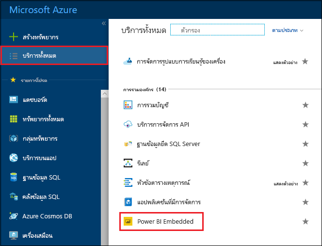
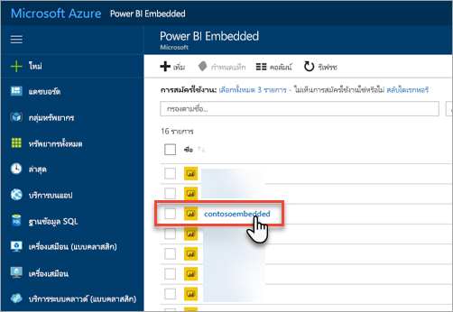
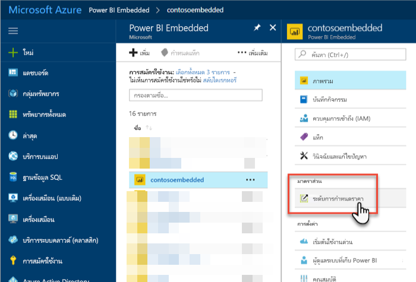
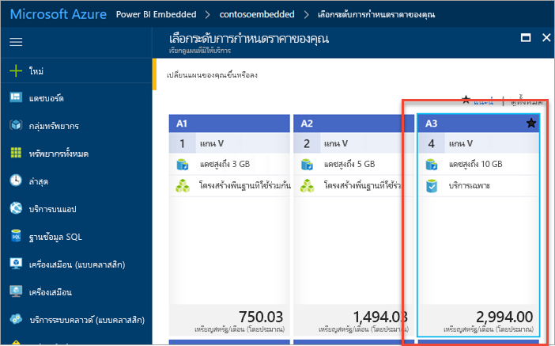
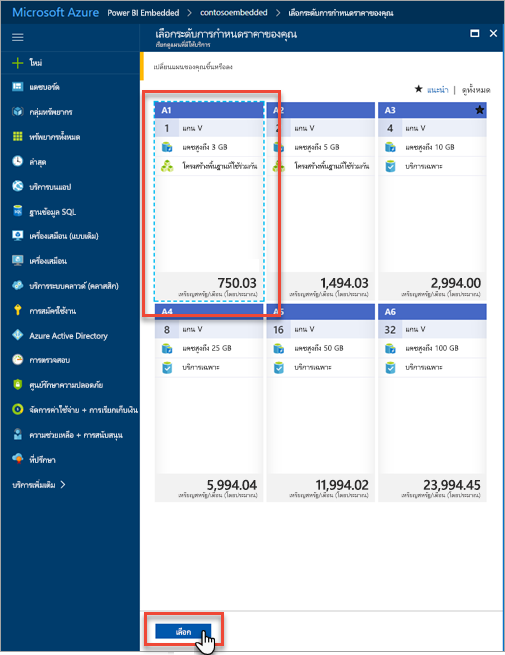
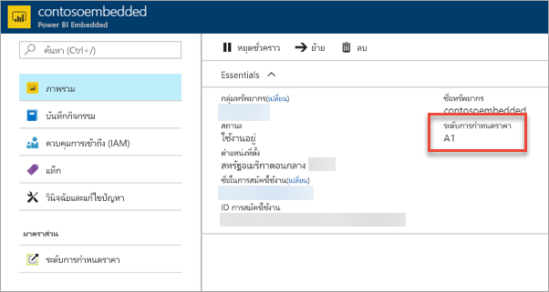

# ปรับขนาดความจุ Power BI Embedded ในพอร์ทัล AzureScale your Power BI Embedded capacity in the Azure portal

บทความนี้แนะนำเกี่ยวกับวิธีการปรับขนาดความจุ Power BI Embedded ใน Microsoft AzureThis article walks through how to scale a Power BI Embedded capacity in Microsoft Azure. การปรับขนาดช่วยให้คุณสามารถเพิ่มหรือลดขนาดความจุของคุณได้Scaling allows you to increase or decrease the size of your capacity.

ซึ่งถือว่า คุณได้สร้างขีดความจุ Power BI Embedded แล้วThis assumes you have created a Power BI Embedded capacity. หากคุณยังไม่ได้สร้าง ให้ดู[สร้างความจุ Power BI Embedded ในพอร์ทัล Azure](azure-pbie-create-capacity.md) เพื่อเริ่มใช้งานIf you have not, see [Create Power BI Embedded capacity in the Azure portal](azure-pbie-create-capacity.md) to get started.

> [!NOTE]
> การดำเนินการปรับขนาดอาจใช้เวลาประมาณหนึ่งนาทีA scaling operation can take about a minute. ในช่วงเวลานี้ จะไม่สามารถใช้งานความจุได้During this time, the capacity will not be available. การโหลดเนื้อหาแบบฝังตัวอาจล้มเหลวEmbedded content may fail to load.

## ปรับขนาดความจุScale a capacity

1. ลงชื่อเข้าใช้[พอร์ทัล Azure](https://portal.azure.com/)Sign into the [Azure portal](https://portal.azure.com/).

2. เลือก **บริการทั้งหมด** > **Power BI Embedded** เพื่อดูความจุของคุณSelect **All services** > **Power BI Embedded** to see your capacities.

    

3. เลือกความจุที่คุณต้องการปรับขนาดSelect the capacity you want to scale.

    

4. เลือก **ระดับราคา** ภายใต้ **มาตราส่วน** ภายในความจุของคุณSelect **Pricing tier** under **Scale** within your capacity.

    

    ระดับการกำหนดราคาปัจจุบันของคุณจะมีกรอบเป็นสีฟ้าYour current pricing tier is outlined in blue.

    

5. เมื่อต้องการปรับมาตราส่วนขึ้นหรือลง เลือกระดับใหม่เพื่อย้ายไปยังตำแหน่งที่ต้องการTo scale up or down, select the new tier to move to. การเลือกระดับใหม่จะวางเส้นขอบสีฟ้าล้อมรอบบริเวณที่เลือกไว้Selecting a new tier places a dashed blue outline around the selection. เลือก **เลือก** เพื่อปรับขนาดเป็นระดับใหม่Select **Select** to scale to the new tier.

    

    การปรับขนาดความจุของคุณอาจใช้เวลาสักครู่หรือสองนาทีจึงจะเสร็จสมบูรณ์Scaling your capacity may take a minute or two to complete.

6. ยืนยันระดับของคุณโดยดูจากแท็บภาพรวม ระดับการกำหนดราคาปัจจุบันจะแสดงอยู่ในรายการConfirm your tier by viewing the overview tab. The current pricing tier is listed.

    

## ขั้นตอนถัดไปNext steps

ในการหยุดชั่วคราวหรือเริ่มต้นความจุของคุณ ให้ดูที[่หยุดชั่วคราวและเริ่มต้นความจุ Power BI Embedded ในพอร์ทัล Azure](azure-pbie-pause-start.md)To pause or start your capacity, see [Pause and start your Power BI Embedded capacity in the Azure portal](azure-pbie-pause-start.md).

ในการเริ่มต้นฝังเนื้อหา Power BI ในแอปพลิเคชันของคุณ โปรดดูที่[วิธีฝังแดชบอร์ด รายงาน และไทล์ใน Power BI ของคุณ](https://powerbi.microsoft.com/documentation/powerbi-developer-embedding-content/)To begin embedding Power BI content within your application, see [How to embed your Power BI dashboards, reports, and tiles](https://powerbi.microsoft.com/documentation/powerbi-developer-embedding-content/).

มีคำถามเพิ่มเติมหรือไม่More questions? [ลองถามชุมชน Power BITry asking the Power BI Community](https://community.powerbi.com/)
