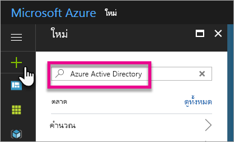
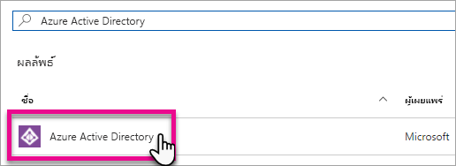
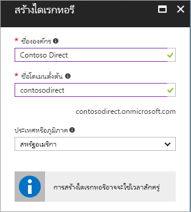
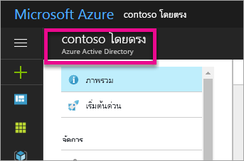
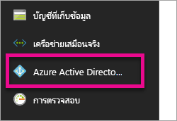
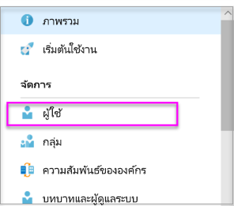
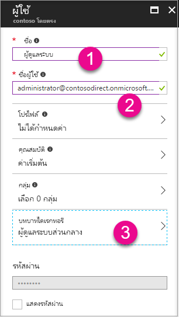
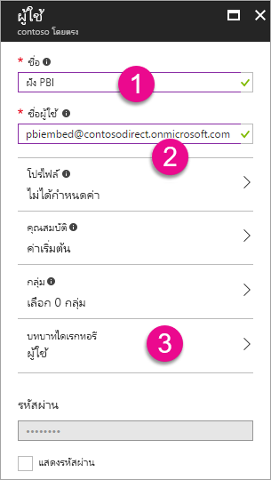
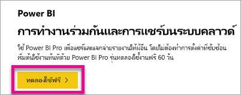

# สร้างผู้เช่า Azure Active Directory เพื่อใช้กับ Power BICreate an Azure Active Directory tenant to use with Power BI

เรียนรู้วิธีการสร้างผู้เช่า Azure Active Directory (Azure AD) ใหม่สำหรับแอปพลิเคชันแบบกำหนดเองที่เรียกใช้ [Power BI REST API](../automation/rest-api-reference.md)Learn how to create a new Azure Active Directory (Azure AD) tenant for a custom application that calls [Power BI REST APIs](../automation/rest-api-reference.md).

ผู้เช่าเป็นตัวแทนองค์กรใน Azure Active DirectoryA tenant represents an organization in Azure Active Directory. ซึ่งเป็นอินสแตนซ์เฉพาะของบริการ Azure AD ที่องค์กรได้รับและเป็นเจ้าของเมื่อลงทะเบียนสมัครใช้บริการระบบคลาวด์ของ Microsoft เช่น Azure  Microsoft Intune หรือ Microsoft 365It's a dedicated Azure AD service instance that an organization receives and owns when it signs up for a Microsoft cloud service such as Azure, Microsoft Intune, or Microsoft 365. ผู้เช่า Azure AD แต่ละรายจะแตกต่างกันและแยกต่างหากจากผู้เช่า Azure AD อื่น ๆEach Azure AD tenant is distinct and separate from other Azure AD tenants.

เมื่อมีผู้เช่า Azure AD คุณสามารถกำหนดแอปพลิเคชันและกำหนดสิทธิเพื่อให้แอปพลิเคชันของคุณสามารถเรียกใช้ [Power BI REST API](../automation/rest-api-reference.md) ได้Once you have an Azure AD tenant, you can define an application and assign it permissions so it can call [Power BI REST APIs](../automation/rest-api-reference.md).

องค์กรของคุณอาจมีผู้เช่า Azure AD ที่คุณสามารถใช้สำหรับแอปพลิเคชันของคุณอยู่แล้วYour organization may already have an Azure AD tenant that you can use for your application. นอกจากนี้คุณยังสามารถสร้างผู้เช่าใหม่เฉพาะสำหรับแอปพลิเคชันของคุณได้อีกด้วยYou can also create a new tenant specifically for your application. บทความนี้แสดงถึ่งวิธีการสร้างผู้เช่าใหม่This article shows how to create a new tenant.

## สร้างผู้เช่า Azure Active DirectoryCreate an Azure Active Directory tenant

เพื่อรวม Power BI ลงในแอปพลิเคชันแบบกำหนดเองของคุณ คุณจำเป็นต้องกำหนดแอปพลิเคชันภายใน Azure AD ซึ่งจำเป็นต้องมีไดเรกทอรีของ Azure ADTo integrate Power BI into your custom application, you need to define an application within Azure AD, which requires an Azure AD directory. ไดเรกทอรีนี้เป็น *ผู้เช่า* ของคุณThis directory is your *tenant*. ถ้าองค์กรของคุณยังไม่มีผู้เช่า เนื่องจากพวกเขาไม่ได้ใช้ Power BI หรือ Microsoft 365 [คุณต้องตั้งค่าเครื่องมือที่ช่วยพัฒนาโปรแกรม](/azure/active-directory/develop/active-directory-howto-tenant)If your organization doesn't have a tenant yet, because they aren't using Power BI or Microsoft 365, then [you need to set up a dev environment](/azure/active-directory/develop/active-directory-howto-tenant). นอกจากนี้ คุณยังต้องสร้างหนึ่งสภาพแวดล้อมถ้าไม่ต้องการให้แอปพลิเคชันของคุณผสมปะปนกับผู้เช่าขององค์กรของคุณ อนุญาตให้คุณเก็บสิ่งที่แยกออกมาต่างหากได้You also need to create one if you don't want your application mixing with your organization's tenant, allowing you to keep things isolated. หรือคุณอาจเพียงแค่ต้องการสร้างผู้เช่าเพื่อทำการทดสอบOr, you may just want to create a tenant for testing purposes.

เมื่อต้องสร้างผู้เช่า Azure AD ใหม่:To create a new Azure AD tenant:

1. เรียกดู [พอร์ทัล Azure](https://portal.azure.com)และลงชื่อเข้าใช้ด้วยบัญชีผู้ใช้ที่มีการสมัครใช้งาน AzureBrowse to the [Azure portal](https://portal.azure.com) and sign in with an account that has an Azure subscription.

2. เลือก **ไอคอนเครื่องหมายบวก (+)**  และค้นหา **Azure Active Directory**Select the **plus icon (+)** and search for **Azure Active Directory**.

    

3. เลือก **Azure Active Directory** ในผลลัพธ์การค้นหาSelect **Azure Active Directory** in the search results.

    

4. เลือก **สร้าง**Select **Create**.

5. ระบุ **ชื่อองค์กร** และ **ชื่อโดเมนเริ่มต้น**Provide an **Organization name** and an **Initial domain name**. แล้วเลือก **สร้าง**Then select **Create**. ไดเรกทอรีของคุณจะถูกสร้างขึ้นYour directory is created.

    

   > [!NOTE]
   > โดเมนเริ่มต้นของคุณคือ ส่วนหนึ่งของ onmicrosoft.comYour initial domain is part of onmicrosoft.com. คุณสามารถเพิ่มชื่อโดเมนอื่น ๆ ได้ในภายหลังYou can add other domain names later. ไดเรกทอรีผู้เช่าอาจมีได้หลายโดเมนที่กำหนดไว้A tenant directory can have multiple domains assigned to it.

6. หลังจากการสร้างไดเรกทอรีของคุณเสร็จสมบูรณ์ เลือกกล่องข้อมูลเพื่อจัดการไดเรกทอรีใหม่ของคุณAfter directory creation is complete, select the information box to manage your new directory.

ถัดไป คุณกำลังจะเพิ่มผู้ใช้ที่เป็นผู้เช่าNext, you're going to add tenant users.

## สร้างผู้ใช้ที่เป็นผู้เช่า Azure Active DirectoryCreate Azure Active Directory tenant users

ตอนนี้เรามีไดเรกทอรีแล้ว มาสร้างผู้ใช้อย่างน้อยสองรายกันNow that you have a directory, let's create at least two users. หนึ่งคือ ผู้ดูแลระบบส่วนกลางผู้เช่า และอีกรายคือ ผู้ใช้หลักสำหรับการฝังตัวOne is a tenant Global Admin and another is a master user for embedding. คุณสามารถนึกภาพหลังจากนั้นเป็นบัญชีบริการได้You can think of the latter as a service account.

1. ภายในพอร์ทัล Azure ตรวจสอบให้แน่ใจว่าคุณกำลังอยู่บน Azure Active Directory ที่ปรากฎขึ้นทางด้านข้างIn the Azure portal, make sure you are on the Azure Active Directory fly out.

    

    ถ้าไม่เป็นเช่นนั้น เลือกไอคอน Azure Active Directory จากแถบบริการทางด้านซ้ายIf not, select the Azure Active Directory icon from the left services navigation.

    

2. ภายใต้ **จัดการ** เลือก **ผู้ใช้**Under **Manage**, select **Users**.

    

3. เลือก **ผู้ใช้ทั้งหมด** แล้วเลือก **+ ผู้ใช้ใหม่**Select **All users** and then select **+ New user**.

4. ระบุ **ชื่อ** และ **ชื่อผู้ใช้** สำหรับผู้ดูแลระบบส่วนกลางผู้เช่าของคุณ เปลี่ยน **บทบาทไดเรกทอรี** ให้เป็น **ผู้ดูแลระบบส่วนกลาง**Provide a **Name** and **User name** for your tenant Global Admin. Change the **Directory role** to **Global administrator**. คุณยังสามารถแสดงรหัสผ่านชั่วคราวได้You can also show the temporary password. เมื่อคุณทำเสร็จแล้ว เลือก **สร้าง**When you're done, select **Create**.

    

5. ให้ทำแบบเดียวกันสำหรับผู้ใช้ที่เป็นผู้เช่าทั่วไปDo the same thing for a regular tenant user. คุณสามารถใช้บัญชีนี้สำหรับบัญชีฝังตัวหลักของคุณYou can use this account for your master embedding account. ในเวลานี้ สำหรับ **บทบาทไดเรกทอรี** ปล่อยให้เป็น **ผู้ใช้**This time, for **Directory role**, leave it as **User**. จดรหัสผ่าน จากนั้นเลือก **สร้าง**Note the password, then select **Create**.

    

6. ลงทะเบียนสมัครใช้สำหรับ Power BI ด้วยบัญชีผู้ใช้ที่คุณสร้างในขั้นตอนที่ 5Sign up for Power BI with the user account that you created in step 5. ไปที่ [powerbi.com](https://powerbi.microsoft.com/get-started/) และเลือก **ทดลองใช้ฟรี** ภายใต้ **Power BI - การทำงานร่วมกันและการแชร์บนระบบคลาวด์**Go to [powerbi.com](https://powerbi.microsoft.com/get-started/) and select **Try free** under **Power BI - Cloud collaboration and sharing**.

    

    เมื่อคุณลงทะเบียนสมัครใช้ คุณจะได้รับแจ้งให้ทดลองใช้ Power BI Pro ฟรีเป็นเวลา 60 วันWhen you sign up, you're prompted to try Power BI Pro free for 60 days. คุณสามารถเลือกเพื่อกลายเป็นผู้ใช้ระดับ Pro ซึ่งทำให้คุณมีตัวเลือกในการ[เริ่มต้นพัฒนาโซลูชันแบบฝังตัว](embed-sample-for-customers.md)ได้You can opt into that to become a Pro user, which gives you the option to [start developing an embedded solution](embed-sample-for-customers.md).

   > [!NOTE]
   > ตรวจสอบให้แน่ใจว่าคุณลงทะเบียนสมัครใช้ด้วยที่อยู่อีเมลของบัญชีผู้ใช้ของคุณMake sure you sign up with your user account's email address.

## ขั้นตอนถัดไปNext steps

ตอนนี้คุณมีผู้เช่า Azure AD แล้ว คุณสามารถใช้ผู้เช่านี้เพื่อทดสอบรายการภายใน Power BI ได้Now that you have an Azure AD tenant, you can use this tenant to test items within Power BI. คุณยังสามารถฝังแดชบอร์ด Power BI และรายงานในแอปพลิเคชันของคุณได้อีกด้วยYou can also embed Power BI dashboards and reports in your application. สำหรับข้อมูลเพิ่มเติม ดู [วิธีฝังแดชบอร์ด รายงานและไทล์ Power BI ของคุณ](embed-sample-for-customers.md)For more information, see [How to embed your Power BI dashboards, reports, and tiles](embed-sample-for-customers.md).

[แล้ว Azure Active Directory คืออะไร?What is an Azure Active directory?](/azure/active-directory/active-directory-whatis) 
 
[เริ่มต้นใช้งานด่วน: ตั้งค่าเครื่องมือที่ช่วยในการพัฒนาโปรแกรมQuickstart: Set up a dev environment](/azure/active-directory/develop/active-directory-howto-tenant)  

มีคำถามเพิ่มเติมหรือไม่More questions? [ลองถามชุมชน Power BITry asking the Power BI Community](https://community.powerbi.com/)