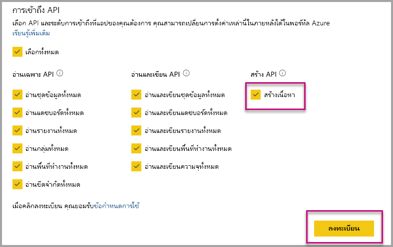

# ติดตั้งแอป Power BI อัตโนมัติเมื่อมีการฝังสำหรับองค์กรของคุณAuto-install Power BI apps when embedding for your organization

หากต้องการฝังเนื้อหาจากแอป ผู้ใช้ที่เป็นผู้ฝังจะต้องมี[สิทธิ์การเข้าถึงแอป](../../collaborate-share/service-create-distribute-apps.md)To embed content from an app, the user that is embedding must have [access to the app](../../collaborate-share/service-create-distribute-apps.md). ถ้าติดตั้งแอปสำหรับผู้ใช้แล้ว การฝังจะทำงานได้อย่างราบรื่นIf the app is installed for the user, then embedding works smoothly. สำหรับข้อมูลเพิ่มเติม โปรดดูที่[ฝังรายงานหรือแดชบอร์ดจากแอป](./index.yml)For more information, see [Embed reports or dashboards from app](./index.yml). คุณสามารถกำหนดใน PowerBI.com ที่ทุกแอปสามารถ[ติดตั้งได้โดยอัตโนมัติ](https://powerbi.microsoft.com/blog/automatically-install-apps/)It's possible to define in PowerBI.com that all apps can be [installed automatically](https://powerbi.microsoft.com/blog/automatically-install-apps/). อย่างไรก็ตาม การดำเนินการนี้จะต้องทำในระดับผู้เช่า และใช้กับทุกแอปHowever, this action is done at the tenant level and applies to all apps.

## ติดตั้งแอปโดยอัตโนมัติเมื่อมีการฝังAuto-install app on embedding

ถ้าผู้ใช้มีสิทธิ์เข้าถึงแอป แต่ยังไม่ได้ติดตั้งแอป การฝังจะล้มเหลวIf a user has access to an app, but the app isn't installed, then embedding fails. เพื่อหลีกเลี่ยงความล้มเหลวเหล่านี้เมื่อมีการฝังจากแอป คุณสามารถอนุญาตให้ติดตั้งแอปโดยอัตโนมัติ เมื่อมีการฝังได้So you can avoid these failures when embedding from an app, you can allow auto installation of the app upon embedding. การดำเนินการนี้หมายความว่า ถ้าไม่ได้ติดตั้งแอปที่ผู้ใช้พยายามที่จะฝัง ระบบจะติดตั้งให้คุณโดยอัตโนมัติThis action means if the app the user tries to embed isn't installed, it's automatically installed for you. ดังนั้น เนื้อหาคุณที่ต้องการจะถูกฝังทันที ซึ่งเป็นประสบการณ์การใช้งานที่ราบรื่นสำหรับผู้ใช้So the content you want gets embedded immediately, resulting in a smooth experience for the user.

## การฝังสำหรับผู้ใช้ Power BI (ผู้ใช้เป็นเจ้าของข้อมูล)Embed for Power BI users (User owns data)

หากต้องการอนุญาตให้ติดตั้งแอปโดยอัตโนมัติสำหรับผู้ใช้ของคุณ คุณจะต้องให้สิทธิ์ 'สร้างเนื้อหา' แก่แอปพลิเคชันของคุณเมื่อ[ลงทะเบียนแอปพลิเคชัน](register-app.md#register-an-azure-ad-app) หรือเพิ่ม ถ้าคุณลงทะเบียนแอปไว้อยู่แล้วTo allow auto install of apps for your users, you need to give your application the 'Content Create' permission when [registering your application](register-app.md#register-an-azure-ad-app), or add it if you already registered your app.

ถัดไป คุณจะต้องระบุ ID แอปใน URL ที่ฝังไว้Next, you need to provide the app ID in the embed URL. ในการให้ข้อมูล ID แอป ผู้สร้างแอปจะต้องติดตั้งแอปก่อน จากนั้นใช้การเรียกใช้ [Power BI Rest API](/rest/api/power-bi/) รายการใดรายการหนึ่งที่รองรับ - [รับรายงาน](/rest/api/power-bi/reports/getreports)หรือ[รับแดชบอร์ด](/rest/api/power-bi/dashboards/getdashboards)To provide the app ID, the app creator first needs to install the app then use one of the supported [Power BI Rest API](/rest/api/power-bi/) calls - [Get Reports](/rest/api/power-bi/reports/getreports) or [Get Dashboards](/rest/api/power-bi/dashboards/getdashboards). จากนั้น ผู้สร้างแอปจะต้องใช้ Url ที่ฝังไว้จากการตอบสนอง REST APIThen the app creator needs to take the embed Url from the REST API response. ID แอปจะปรากฏใน URL ถ้าเนื้อหามาจากแอปThe app ID appears in the URL if the content is from an app.  หลังจากที่คุณฝัง URL แล้ว คุณจะสามารถใช้เพื่อฝังได้อย่างสม่ำเสมอAfter you have the embed URL, you can use it to embed regularly.

## การฝังที่ปลอดภัยSecure Embed

หากต้องการใช้ติดตั้งแอปโดยอัตโนมัติ ผู้สร้างแอปจะต้องติดตั้งแอปก่อน จากนั้นไปที่แอปบน PowerBI.com นำทางไปยังรายงาน และรับลิงก์ตามปกติTo use auto install of apps, the app creator first needs to install the app then go to the app on PowerBI.com, navigate to the report, and get the link in a usual fashion. ผู้ใช้อื่น ๆ ทั้งหมดที่มีสิทธิ์การเข้าถึงแอปที่สามารถใช้ลิงก์จะสามารถฝังรายงานได้All other users with access to the app that can use the link can embed the report.

## ข้อควรพิจารณาและข้อจำกัดConsiderations and limitations

* คุณสามารถฝังรายงานและแดชบอร์ดสำหรับสถานการณ์นี้ได้เท่านั้นYou can only embed reports and dashboards for this scenario.

* ในขณะน้ี ระบบไม่รองรับคุณลักษณะนี้สำหรับแอปที่เป็นเจ้าของข้อมูล และสถานการณ์ที่ฝังใน SharePointThis feature is currently not supported for app owns data and SharePoint embed scenarios.