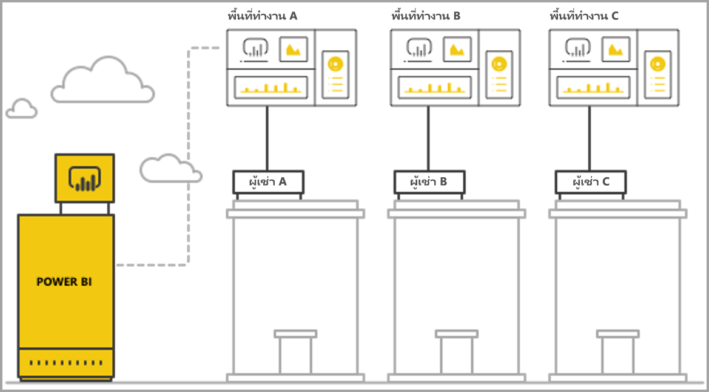
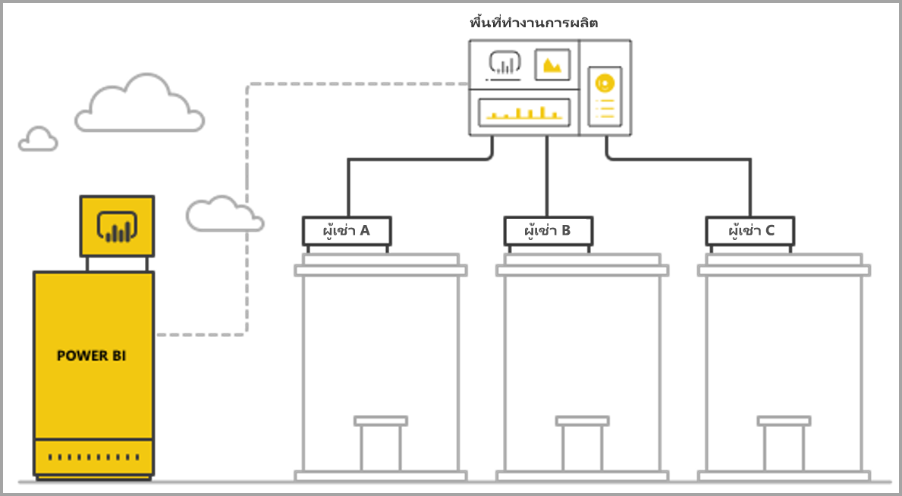

# จัดการการเช่าหลายรายการด้วยการวิเคราะห์ของ Power BI EmbeddedManage multi-tenancy with Power BI embedded analytics

เมื่อออกแบบแอปพลิเคชัน SaaS แบบหลายผู้เช่า คุณต้องเลือกแบบจำลองการเช่าอย่างระมัดระวังให้เหมาะสมกับความต้องการแอปพลิเคชัน SaaS ของคุณที่สุดWhen designing a multi-tenant SaaS application, you must carefully choose the tenancy model that best fits the needs of your SaaS application. กระบวนการนี้ยังใช้ได้กับ Power BI ในฐานะส่วนการวิเคราะห์แบบฝังตัวของแอปพลิเคชัน SaaS ของคุณThis process is also valid for Power BI as an embedded analytics part of your SaaS application. แบบจำลองการเช่าจะกำหนดวิธีการแมปและการจัดการข้อมูลของผู้เช่าแต่ละรายภายใน Power BI และบัญชีการจัดเก็บA tenancy model determines how each tenant's data is mapped and managed within Power BI and the storage account. แบบจำลองการเช่าของคุณจะมีผลต่อการออกแบบและการจัดการแอปพลิเคชันYour tenancy model impacts application design and management. สลับไปยังแบบจำลองอื่นในภายหลังอาจมีค่าใช้จ่ายสูงและเกิดความเสียหายได้Switching to a different model later may become costly and disruptive.

ด้วย Power BI Embedded มีแนวทางพื้นฐานหลักสองทางเพื่อรักษาการแยกระหว่างผู้เช่าWith Power BI Embedded, there are two main fundamental approaches to maintaining separation between tenants.

   1. **การแยกตามพื้นที่ทำงาน** - สร้างพื้นที่ทำงาน Power BI แยกต่างหากต่อผู้เช่า**Workspace-based isolation** - creating a separate Power BI Workspace per tenant.
   2. **การแยกตามการรักษาความปลอดภัยระดับแถว** - เมื่อใช้ข้อมูลเบื้องต้นเพื่อควบคุมและจัดการการเข้าถึงข้อมูลต่อผู้ใช้หรือกลุ่ม**Row-level security-based isolation** - where the underlying data is used to control and manage access to data per user or group.

บทความนี้อธิบายแนวทางที่แตกต่างกันและวิเคราะห์ตามเกณฑ์การประเมินหลายประการThis article describes the different approaches and analyzes them according to several evaluation criteria.

## แนวคิดและศัพท์เฉพาะConcepts and terminology

**[AAD](/azure/active-directory/fundamentals/active-directory-whatis)** - Azure Active Directory**[AAD](/azure/active-directory/fundamentals/active-directory-whatis)** - Azure Active Directory.

**แอปพลิเคชัน AAD** - ข้อมูลประจำตัวของแอปพลิเคชันใน AAD**AAD application** - An application identity in AAD. แอปพลิเคชัน AAD จำเป็นต้องมีการรับรองความถูกต้องAn AAD application is required for authentication.

**แอปพลิเคชัน SaaS (การให้บริการซอฟต์แวร์)** - องค์กรหรือ ISV เป็นผู้นำระบบมาใช้ โดยปกติแล้วจะเป็นบริการออนไลน์**SaaS application (software-as-a-service)** - A system implemented by an enterprise or ISV that is usually an online service. นอกจากนี้ยังเกี่ยวข้องกับระบบซอฟต์แวร์สำหรับการให้บริการผู้เช่าลูกค้าหลายราย (องค์กร)Its also related software systems for serving multiple customer tenants (organizations). สำหรับบทความนี้ **แอปพลิเคชัน SaaS ใช้ Power BI Embedded เพื่อวิเคราะห์ผู้เช่าที่แตกต่างกัน**For this article, **the SaaS application uses Power BI Embedded to serve analytics to its different tenants**. Power BI Embedded ยังสามารถทำงานให้กับแอปพลิเคชันทุกประเภท เมื่อแอปพลิเคชันเหล่านั้นมีการเชื่อมต่อออนไลน์Power BI Embedded can also work for all types of applications when they have an online connection.

**ผู้เช่า** - ลูกค้ารายเดียว (องค์กร) ที่ใช้แอปพลิเคชัน SaaS และทรัพยากรหรือแหล่งข้อมูลใด ๆ ที่ลูกค้านำมาใช้กับแอปพลิเคชัน SaaS**Tenant** – A single customer (organization) that uses the SaaS application and any resources or data that the customer brings to the SaaS application.

**[Power BI](../../fundamentals/power-bi-overview.md)** - บริการ Cloud ของ Power BI ที่ให้บริการเป็นแพลตฟอร์มสำหรับ Power BI Embedded**[Power BI](../../fundamentals/power-bi-overview.md)** - The Power BI cloud service that serves as a platform for Power BI Embedded.

**ผู้เช่า power BI** - คือชุดทรัพยากร Power BI ที่เกี่ยวข้องกับผู้เช่า AAD รายเดียว**Power BI tenant** - Is a set of Power BI resources associated with a single AAD tenant.

**[พื้นที่ทำงานของ Power BI](../../collaborate-share/service-create-workspaces.md)** - คอนเทนเนอร์สำหรับเนื้อหาใน Power BI**[Power BI workspace](../../collaborate-share/service-create-workspaces.md)** - A container for content in Power BI.

**วัตถุของ Power BI** - มีวัตถุของ Power BI หลายชิ้นในพื้นที่ทำงานของ Power BI เช่น แดชบอร์ด รายงาน ชุดข้อมูล และกระแสข้อมูล**Power BI artifacts** – There are several Power BI artifacts in Power BI workspaces such as dashboards, reports, datasets, and dataflows.

**[Power BI Embedded](azure-pbie-what-is-power-bi-embedded.md)** - ชุดของ API สาธารณะที่อนุญาตให้นักพัฒนาสร้างแอปพลิเคชันที่จัดการเนื้อหา Power BI และองค์ประกอบ Power BI ที่ฝังไว้**[Power BI Embedded](azure-pbie-what-is-power-bi-embedded.md)** - A set of public APIs that allow developers to build applications that manage Power BI content and embed Power BI elements.

**[การรักษาความปลอดภัยระดับแถว (RLS)](embedded-row-level-security.md)** - ช่วยให้สามารถควบคุมผู้ใช้เข้าถึงข้อมูลสำหรับแต่ละแถวในตาราง**[Row-level security (RLS)](embedded-row-level-security.md)** - Gives the ability to control user access to the data for individual rows in a table. คุณสามารถใช้การรักษาความปลอดภัยระดับแถวที่ระดับแหล่งข้อมูลหรือในแบบจำลองเชิงความหมายของ Power BIYou can implement row-level security at the data source level or in the Power BI semantic model.

**ผู้ใช้หลัก** - ข้อมูลประจำตัวที่แสดงถึงแอปพลิเคชัน SaaS ใน Power BI และแอปพลิเคชัน SaaS ดังกล่าวจะใช้เมื่อเรียกใช้ API ของ Power BI**Master user** - The identity that represents the SaaS application in Power BI and that the SaaS application uses when calling Power BI APIs. ต้องเป็นผู้ใช้ AAD พร้อมสิทธิ์การใช้งาน Power BI ProNeeds to be an AAD user with a Power BI Pro license.

**ผู้ใช้แอปพลิเคชัน AAD (บริการหลัก)** - ข้อมูลประจำตัวที่แสดงถึงแอปพลิเคชัน SaaS ใน Power BI และแอปพลิเคชัน SaaS ดังกล่าวจะใช้เมื่อเรียกใช้ API ของ Power BI**AAD Application user (service principal)** - The identity that represents the SaaS application in Power BI and that the SaaS application uses when calling Power BI APIs. ต้องเป็นแอปพลิเคชันบนเว็บ AADNeeds to be an AAD web application. สามารถใช้แทนผู้ใช้ *หลัก* เพื่อรับรองความถูกต้องกับ Power BI ได้Can replace the use of a *master* user to authenticate with Power BI.

**กำลังการผลิต** - ชุดของทรัพยากรที่ใช้ไปกับการให้บริการ Power BI**Capacity** - A set of resources dedicated to running the Power BI service. [กำลังการผลิตแบบพรีเมียมของ Power BI](../../admin/service-premium-what-is.md) มีไว้สำหรับ บริษัทองค์กรที่ใช้ Power BI แบบภายใน ส่วน[ความจุ Power BI Embedded](azure-pbie-create-capacity.md) มีไว้สำหรับนักพัฒนาแอปพลิเคชันเพื่อพัฒนาแอปพลิเคชัน SaaS ให้กับบุคคลที่สาม[Power BI Premium capacities](../../admin/service-premium-what-is.md) Intended for enterprise companies using Power BI internally, while [Power BI Embedded capacities](azure-pbie-create-capacity.md) intend for application developers to develop SaaS applications for third parties.

**[สิทธิ์การใช้งาน Power BI Pro](../../admin/service-admin-purchasing-power-bi-pro.md)** - สิทธิ์การใช้งานตามผู้ใช้ ซึ่งจะมีสิทธิ์ในการเผยแพร่เนื้อหาไปยังพื้นที่ทำงาน ใช้แอปโดยไม่ต้องมีความจุแบบพรีเมียม แชร์แดชบอร์ด และสมัครใช้งานแดชบอร์ดและรายงานได้**[Power BI Pro license](../../admin/service-admin-purchasing-power-bi-pro.md)** - A user-based license, which grants rights to publish content to workspaces, consume apps without Premium capacity, share dashboards, and subscribe to dashboards and reports.

**[โหมดการเชื่อมต่อข้อมูล](../../connect-data/desktop-directquery-about.md)** - เชื่อมต่อแหล่งข้อมูลไปยัง Power BI ที่สามารถทำได้ในโหมดที่แตกต่างกัน:**[Data connectivity modes](../../connect-data/desktop-directquery-about.md)** - Connecting data sources to Power BI that can be done in different modes:

   * นำเข้า - ซึ่งเป็นวิธีที่พบมากที่สุดในการรับข้อมูลImport - which is the most common way to get data.
   * DirectQuery - เชื่อมต่อโดยตรงไปยังข้อมูลในที่เก็บแหล่งข้อมูลDirectQuery - connect directly to the data in its source repository.
   * การเชื่อมต่อสด - โหมดอื่นที่เชื่อมต่อโดยตรงกับข้อมูล Analysis Services (ทั้ง Azure และภายในองค์กร)Live connection - another mode that connects directly to Analysis Services data (both Azure and on-premises).

## เกณฑ์การประเมินEvaluation criteria

ตัวเลือกที่เหมาะสมสำหรับแบบจำลองการเช่าที่ถูกต้องสำหรับแอปพลิเคชัน SaaS ของคุณจะแตกต่างกันตามธุรกิจเฉพาะ และข้อกำหนดด้านเทคนิค ข้อมูลสถาปัตยกรรม และอื่น ๆThe optimal choice for the right tenancy model for your SaaS application varies according to specific business and technical requirements, data architecture and more. การทำความเข้าใจอย่างลึกซึ้งถึงข้อกำหนดเหล่านี้พร้อมกับตัวเลือกแบบจำลองการเช่าและการแลกเปลี่ยนที่มีอยู่ สามารถช่วยกำหนดสถาปัตยกรรมที่มีเสถียรภาพ ประสิทธิภาพ คุ้มค่า และปรับขนาดได้สำหรับแอปพลิเคชัน SaaS ของคุณDeep understanding of these requirements along with available tenancy model options and trade-offs can help define robust, performant, cost-effective, and scalable architecture for your SaaS application.

ต่อไปนี้คือชุดของพื้นที่ที่ต้องพิจารณาเมื่อเลือกระหว่างแบบจำลองการเช่าที่แตกต่างกันThe following are a set of areas to consider when choosing between the different tenancy models.

### สถาปัตยกรรมข้อมูลData architecture

โดยปกติแล้ว นักพัฒนาที่สร้างแอปพลิเคชันด้วย Power BI Embedded จะมีฐานข้อมูลผู้เช่ารายเดียวหรือหลายผู้เช่าอยู่แล้วUsually, developers building applications with Power BI Embedded already have a single or multi-tenant database. จะเป็นการสะดวกกว่าหากใช้แบบจำลองการเช่าสำหรับ Power BI Embedded ซึ่งจะคล้ายกับแบบจำลองการเช่าของฐานข้อมูลIt's easier to use a tenancy model for Power BI Embedded which is similar to the tenancy model of the database. หากยังไม่ได้กำหนดแบบจำลองการเช่าฐานข้อมูล คุณอาจต้องพิจารณามุมมองอื่น ๆ ก่อนตัดสินใจเลือกสถาปัตยกรรมข้อมูลของคุณIf the database tenancy model hasn't been defined yet, you may want to consider other aspects before deciding on your data architecture.

### การแยกข้อมูลData Isolation

ข้อมูลที่จัดเก็บมีความละเอียดอ่อนมากน้อยเพียงใดHow sensitive is the data being stored? กรุณาระบุระดับการแยกที่คุณจำเป็นต้องแยกผู้เช่าลูกค้าที่แตกต่างกันWhat level of isolation do you need separating different customer tenants? คำตอบอาจแตกต่างกันไปตามอุตสาหกรรมต่าง ๆ หรือลูกค้าเฉพาะที่มีความต้องการบางอย่างThe answer might vary across different industries or specific customers that have certain requirements.

### ความสามารถในการขยายScalability

ในการค้นหาโซลูชันที่ดีที่สุด กำหนดมาตราส่วนที่คุณเข้าถึงในอนาคตที่คาดการณ์ได้To find the best solution, define the scale you reach in the foreseeable future. โปรดทราบว่าโซลูชันที่อาจเหมาะสมขณะนี้อาจไม่เพียงพอเมื่อมีการใช้งานและข้อมูลเพิ่มขึ้นRemember that a solution that might be suitable now might not suffice when usage and data scale up. เมื่อวิเคราะห์ความสามารถในการขยาย กรุณาพิจารณารายการต่อไปนี้:When analyzing scalability, consider the following list:

   * จำนวนผู้เช่า (ลูกค้า)Number of tenants (customers).
   * จำนวนรายงาน แดชบอร์ด และชุดข้อมูลสำหรับผู้เช่าแต่ละรายNumber of reports, dashboards, and datasets for each tenant.
   * ขนาดของข้อมูลในแต่ละชุดข้อมูลและความถี่ของการรีเฟรชSize of data on each dataset and frequency of refreshes.
   * จำนวนผู้ใช้Number of users.
   * จำนวนผู้ใช้พร้อมกันในเวลาสูงสุดNumber of concurrent users in peak times.

แอปพลิเคชัน SaaS บางส่วนอาจมีจำนวนลูกค้าต่ำและการใช้งานต่ำ แต่มีปริมาณข้อมูลจำนวนมากSome SaaS applications might have a low number of customers and low usage, but large amounts of data. แอปพลิเคชันอื่น ๆ อาจมีลูกค้าจำนวนมากและการใช้งานสูง แต่มีปริมาณข้อมูลและรายงานจำนวนน้อยสำหรับลูกค้าแต่ละรายOthers might have many customers and high usage, but a small amount of data and reports for each customer. จำนวนที่สูงในสถานการณ์เหล่านี้อาจส่งผลต่อต้นทุนในอนาคตและความซับซ้อนในการดำเนินงานHigh numbers in any of these situations can impact future costs and operational complexity.

### ระบบอัตโนมัติและความซับซ้อนในการดำเนินงานAutomation & operational complexity

ระบุกระบวนการที่เกิดขึ้นบ่อยซึ่งจำเป็นต้องใช้ระบบอัตโนมัติIdentify frequently occurring processes that need automation.

   * กรุณาระบุความถี่ของการเตรียมความพร้อมกับผู้เช่าใหม่What is the frequency of onboarding new tenants? การดำเนินการที่จำเป็นในการเตรียมความพร้อมทั้งหมดกับผู้เช่าแต่ละรายคืออะไรWhat actions are needed to fully onboard each one?
   * กรุณาระบุช่วงเวลาการนำออกใช้สำหรับเนื้อหา Power BI ใหม่หรือที่อัปเดตแล้ว ซึ่งจำเป็นต้องมีการปรับใช้What is the release cadence for new or updated Power BI content, that needs to be deployed?
   * มีการกำหนดการรักษาความปลอดภัยระดับแถวกี่บทบาทสำหรับผู้เช่าแต่ละรายHow many row-level security roles are defined for each tenant?  

การระบุกระบวนการเหล่านี้และวิธีการที่คุณจัดการปัญหา สามารถช่วยให้คุณเข้าใจความซับซ้อนในการดำเนินงานที่เกี่ยวข้องในการบำรุงรักษาแบบจำลองแต่ละรุ่นIdentifying these processes and how you address them can help you understand the operational complexity involved in maintaining each model.

### ความต้องการที่อยู่ข้อมูลและความต้องการในการสนับสนุนภูมิศาสตร์หลายแห่งData Residency Requirements and the need to support multiple geographies

Power BI Embedded สนับสนุนการปรับใช้แบบ multi-geo (คุณลักษณะตัวอย่าง)Power BI Embedded supports multi-geo deployment (preview feature). [Multi-Geo](embedded-multi-geo.md) ช่วยให้ทรัพยากรของ Power BI Embedded นำมาปรับใช้ในภูมิภาคต่าง ๆ ด้วยเนื้อหาเฉพาะที่กำหนดให้อยู่ในภูมิภาคที่เฉพาะเจาะจง[Multi-Geo](embedded-multi-geo.md) enables Power BI Embedded resources to be deployed in different regions with specific content assigned to reside in specific regions. คุณลักษณะนี้สามารถใช้ได้กับแบบจำลองทั้งหมด แต่อาจส่งผลต่อปริมาณของเนื้อหาในการจัดการและคำนวณต้นทุนThis feature can be used across all models, but can have an impact on the amount of content to manage and cost. ปัจจุบัน multi-geo ได้รับการออกแบบมาเพื่อตอบสนองความต้องการที่อยู่ข้อมูล และไม่ได้ปรับปรุงประสิทธิภาพโดยการย้ายข้อมูลเข้าใกล้ลูกค้ามากขึ้นCurrently multi-geo is designed for meeting data residency requirements and doesn't improve performance by moving data closer to consumers.

### ค่าใช้จ่ายCost

[Power BI Embedded](azure-pbie-what-is-power-bi-embedded.md) มีแบบจำลองการซื้อตามทรัพยากร เหมือนกับ **Power BI Premium**[Power BI Embedded](azure-pbie-what-is-power-bi-embedded.md) has a resource-based purchase model, like **Power BI Premium**. คุณซื้อหนึ่งกำลังการผลิตหรือมากกว่าพร้อมกำลังการประมวลผลและหน่วยความจำแบบคงที่You purchase one or more capacities with fixed computing power and memory. กำลังการผลิตนี้เป็นสินค้าต้นทุนหลักเมื่อทำงานกับ **Power BI Embedded**This capacity is the main cost item when working with **Power BI Embedded**. ไม่มีการจำกัดจำนวนของผู้ใช้ขณะที่ใช้กำลังการผลิตThere's no limit on the number of users using the capacity. มีข้อจำกัดเดียวคือประสิทธิภาพของกำลังการผลิตThe only limit is the performance of the capacity. ผู้ใช้ [หลัก](../../admin/service-admin-licensing-organization.md)แต่ละรายหรือหรือผู้ใช้ที่จำเป็นต้องเข้าถึงพอร์ทัล Power BI ต้องมี *สิทธิ์การใช้งาน Power BI Pro*A [Power BI Pro license](../../admin/service-admin-licensing-organization.md) is required for each *master* user, or specific users that need to access the Power BI portal.

เราขอแนะนำให้ทดสอบและวัดโหลดที่คาดไว้บนกำลังการผลิตของคุณ โดยการจำลองสภาพแวดล้อมและการใช้แบบสด ตลอดจนเรียกใช้การทดสอบโหลดบนกำลังการผลิตWe recommend testing and measuring the expected load on your capacity by simulating live environment and usage and run load testing on the capacity. คุณสามารถวัดโหลดและประสิทธิภาพด้วยเมตริกต่าง ๆ ที่พร้อมใช้งานในกำลังการผลิตของ Azure หรือ[แอปเมตริกกำลังการผลิตแบบพรีเมียม](../../admin/service-admin-premium-monitor-capacity.md)ได้You can measure the load and performance with the various Metrics available in the Azure capacity or [Premium capacity metrics app](../../admin/service-admin-premium-monitor-capacity.md).

### การปรับแก้และการเขียนแก้เนื้อหาContent customization and authoring

แอปพลิเคชัน SaaS มีสองแนวทางในการมอบความสามารถแก่ผู้ใช้ในการแก้ไขและสร้างรายงาน หรืออัปโหลดข้อมูลลงในบริการที่เป็นส่วนหนึ่งของโฟลว์:There are two approaches to SaaS applications that give users the ability to edit and create reports or upload data into the service as part of the flow:

   * [โหมดแก้ไข/สร้างใน iFrame แบบฝังตัว](https://github.com/Microsoft/PowerBI-JavaScript/wiki/Create-Report-in-Embed-View) - ผู้ใช้จะได้รับมุมมองรายงานหรือพื้นที่ว่างเปล่าใหม่ภายในแอปพลิเคชัน SaaS[Edit/Create mode in an embedded iFrame](https://github.com/Microsoft/PowerBI-JavaScript/wiki/Create-Report-in-Embed-View) - The user gets a view of the report or a new blank canvas inside the SaaS application. ด้วยวิธีนี้ สามารถใช้แถบเครื่องมือ Power BI เพื่อสร้างเนื้อหาตามชุดข้อมูลในพื้นที่ทำงานThis way they can use the Power BI toolbar to create content based on a dataset in the workspace. เราขอแนะนำตัวเลือกนี้ เนื่องจากอยู่ในบริบทของผู้ใช้ในสภาพแวดล้อมที่คุ้นเคยWe recommend this option since it's in the user's context in a familiar environment. ซึ่งสามารถเริ่มต้นทำงานและแก้ไขได้ง่ายกว่า และผู้ใช้สามารถสร้างรายงานที่แนบไปกับชุดข้อมูลที่มีอยู่ได้It's easier to get started working and editing, and the user creates a report attached to an existing dataset.

   * ใช้ Power BI Desktop เพื่อสร้างเนื้อหาและอัปโหลดผ่าน UI แอปพลิเคชัน SaaS ไปยังพื้นที่ทำงานUse Power BI Desktop to create content and upload it through the SaaS application UI to the workspace. ในแนวทางนี้ ผู้ใช้จะมีเครื่องมือมากขึ้นในการทำงานโดยใช้ Power BI DesktopIn this approach, users have more tools to work with using the Power BI Desktop. อย่างไรก็ตาม เราไม่แนะนำแนวทางนี้ เนื่องจากผู้ใช้จำเป็นต้องคุ้นเคยกับเครื่องมือเพิ่มเติมภายนอกบริบทของแอปพลิเคชัน SaaSHowever, we do not recommend this  approach since users need to be familiar with an additional tool outside of the SaaS application context. การอัปโหลดไฟล์ PBIX หมายถึง ผู้ใช้กำลังเพิ่มชุดข้อมูลเพิ่มเติม ซึ่งอาจเป็นรายการซ้ำของชุดข้อมูลที่มีอยู่แล้วในพื้นที่ทำงานUploading a PBIX file means the user is adding an additional dataset, that might be a duplicate of datasets already in the workspace.

## การแยกตามพื้นที่ทำงานของ power BIPower BI workspace-based isolation

ด้วยการแยกตามพื้นที่ทำงานของ Power BI แอปพลิเคชัน SaaS จะสนับสนุนหลายผู้เช่าจากผู้เช่า Power BI รายเดียวWith Power BI workspace-based isolation, the SaaS application supports multiple tenants from a single Power BI tenant. การแยกตามพื้นที่ทำงานประกอบด้วยเนื้อหา Power BI ทั้งหมดที่ผู้เช่าอื่นใช้Workspace-based isolation contains all the Power BI content that different tenants use. การแยกผู้เช่าจะดำเนินการเสร็จสิ้นในระดับพื้นที่ทำงานของ Power BI โดยการสร้างพื้นที่ทำงานหลายพื้นที่The separation of tenants is done at the Power BI workspace level, by creating multiple workspaces. พื้นที่ทำงานแต่ละแห่งประกอบด้วยชุดข้อมูล รายงาน และแดชบอร์ดที่เกี่ยวข้องกับผู้เช่าดังกล่าวEach workspace contains the relevant datasets, reports, and dashboards for that tenant. นอกจากนี้ พื้นที่ทำงานแต่ละแห่งเชื่อมต่อเฉพาะกับข้อมูลของผู้เช่าดังกล่าวAlso, each workspace is connected only to that tenant's data. หากคุณต้องดำเนินการแยกเพิ่มเติม คุณสามารถสร้างผู้ใช้ *หลัก* หรือบริการหลักสำหรับพื้นที่ทำงานแต่ละแห่งและเนื้อหาได้If you need additional isolation, you can create a *master* user or a service principal for each workspace and its content.

### สถาปัตยกรรมข้อมูลData architecture

มีสองแนวทางหลักในการจัดการข้อมูลของผู้เช่าThere are two main approaches to manage tenant's data.

* ฐานข้อมูลแยกต่อผู้เช่าA separate database per tenant
* ฐานข้อมูลเดียวแบบหลายผู้เช่าA single multi-tenant database

หากพื้นที่จัดเก็บของแอปพลิเคชัน SaaS กำลังจัดเก็บฐานข้อมูลแยกต่อผู้เช่าอยู่ ดังนั้น ตัวเลือกที่มีให้คือการใช้ชุดข้อมูลผู้เช่ารายเดียวใน Power BI ด้วยสตริงการเชื่อมต่อสำหรับแต่ละชุดข้อมูลที่ชี้ไปยังฐานข้อมูลที่ตรงกันIf the SaaS application storage is keeping a separate database per tenant, then the natural choice is to use single-tenant datasets in Power BI with the connection string for each dataset pointing to the matching database.

หากพื้นที่จัดเก็บของแอปพลิเคชัน SaaS กำลังใช้ฐานข้อมูลการเช่าหลายรายการสำหรับผู้เช่าทั้งหมด การแยกผู้เช่าตามพื้นที่ทำงานก็สามารถดำเนินการได้อย่างง่ายดายIf the SaaS application storage is using a multi-tenancy database for all tenants, it's easy to separate tenants by workspace. คุณสามารถกำหนดค่าการเชื่อมต่อฐานข้อมูลสำหรับชุดข้อมูล Power BI ด้วยคิวรีฐานข้อมูลที่มีการกำหนดพารามิเตอร์ซึ่งเรียกใช้เฉพาะข้อมูลของผู้เช่าเกี่ยวข้องYou can configure the database connection for the Power BI dataset with a parameterized database query that only retrieves the relevant tenant's data. คุณสามารถอัปเดตการเชื่อมต่อโดยใช้ [Power BI Desktop](../../transform-model/desktop-query-overview.md) หรือใช้ [API](/rest/api/power-bi/datasets/updatedatasourcesingroup) กับ[พารามิเตอร์](/rest/api/power-bi/datasets/updateparametersingroup)บนคิวรีYou can update the connection using the [Power BI Desktop](../../transform-model/desktop-query-overview.md) or using the [API](/rest/api/power-bi/datasets/updatedatasourcesingroup) with [parameters](/rest/api/power-bi/datasets/updateparametersingroup) on the query.

### การแยกข้อมูลData isolation

ข้อมูลในแบบจำลองการเช่านี้ถูกแยกจากกันในระดับพื้นที่ทำงานData in this tenancy model is separated at the workspace level. การแมปอย่างง่ายระหว่างพื้นที่ทำงานและผู้เช่าจะช่วยป้องกันไม่ให้ผู้ใช้จากผู้เช่าหนึ่งมองเห็นเนื้อหาจากผู้เช่าอื่นA simple mapping between a workspace and a tenant prevents users from one tenant seeing content from another tenant. ในการใช้ผู้ใช้ *หลัก* รายเดียว คุณต้องสามารถเข้าถึงพื้นที่ทำงานต่าง ๆ ได้ทั้งหมดUsing a single *master* user demands you to have access to all the different workspaces. มีการกำหนดค่าของข้อมูลที่จะแสดงให้ผู้ใช้ปลายทางดูในระหว่าง[การสร้างโทเค็นที่ฝังไว้](/rest/api/power-bi/embedtoken) ซึ่งเป็นกระบวนการเฉพาะส่วนหลังซึ่งผู้ใช้ปลายทางไม่สามารถดูหรือเปลี่ยนแปลงได้The configuration of which data to show an end user is defined during the [generation of the embed token](/rest/api/power-bi/embedtoken), a backend-only process which end users can't see, or change.

ในการเพิ่มการแยกเพิ่มเติม นักพัฒนาแอปพลิเคชันสามารถกำหนดผู้ใช้ *หลัก* หรือแอปพลิเคชันต่อพื้นที่ทำงานมากกว่าผู้ใช้ *หลัก* รายเดียว หรือแอปพลิเคชันที่สามารถเข้าถึงพื้นที่ทำงานได้หลายพื้นที่To add additional isolation, an application developer can define a *master* user or an application per workspace rather than a single *master* user or application with access to multiple workspaces. ด้วยวิธีนี้ คุณจะมั่นใจได้ว่าหากเกิดข้อผิดพลาดจากมนุษย์หรือการรั่วไหลของข้อมูลประจำตัว จะไม่ทำให้ข้อมูลของลูกค้าหลายรายถูกเปิดเผยThis way, you can ensure that any human error or credential leak does not cause multiple customers' data to be exposed.

### ความสามารถในการขยายScalability

ข้อดีประการหนึ่งของแบบจำลองนี้คือ การแยกข้อมูลเป็นชุดข้อมูลหลายชุดสำหรับผู้เช่าแต่ละรายจะไม่มีปัญหากับ[ขีดจำกัดขนาดของชุดข้อมูลเดียว ](../../admin/service-premium-what-is.md)(ความจุ 10 GB ในปัจจุบัน)One advantage of this model is that separating the data into multiple datasets for each tenant overcomes the [size limits of a single dataset](../../admin/service-premium-what-is.md) (currently 10 GB in a capacity). เมื่อความจุโอเวอร์โหลด สามารถลบชุดข้อมูลที่ไม่ได้ใช้เพื่อเพิ่มหน่วยความจำสำหรับชุดข้อมูลที่ใช้งานอยู่When the capacity is overloaded, it can evict unused datasets to free memory for active datasets. งานนี้ไม่สามารถใช้ชุดข้อมูลเดียวที่มีขนาดใหญ่This task isn't possible with a single large dataset. นอกจากนี้ การใช้ชุดข้อมูลหลายชุดยังสามารถแยกผู้เช่าเป็นกำลังการผลิต Power BI หลายรายการเมื่อจำเป็นUsing multiple datasets, it is also possible to separate tenants into multiple Power BI capacities if needed.

แม้ว่าจะมีข้อดีหลายประการ สิ่งหนึ่งที่ต้องพิจารณาคือมาตราส่วนที่แอปพลิเคชัน SaaS สามารถเข้าถึงในอนาคตDespite these advantages, one must consider the scale that the SaaS application can reach in the future. เช่น อาจถึงขีดจำกัดใกล้เคียงจำนวนวัตถุที่สามารถจัดการได้For example, one might reach limitations around the number of artifacts one can manage. ดู[ข้อจำกัด](#summary-comparison-of-the-different-approaches)การปรับใช้ในภายหลังในบทความนี้สำหรับรายละเอียดเพิ่มเติมSee deployment [limitations](#summary-comparison-of-the-different-approaches) later in this article for more details. SKU ของความจุที่ใช้แนะนำการจำกัดขนาดของหน่วยความจำที่ชุดข้อมูลที่จำเป็นต้องมีพอดี จำนวนการรีเฟรชที่สามารถเรียกใช้ได้พร้อมกัน และความถี่สูงสุดของการรีเฟรชข้อมูลThe capacity SKU used introduces a limit on the size of memory that datasets need to fit in, how many refreshes can run at the same time and the maximum frequency of data refreshes. เราขอแนะนำให้ดำเนินการทดสอบเมื่อจัดการชุดข้อมูลหลายร้อยหรือหลายพันชุดIt's recommended to test when managing hundreds or thousands of datasets. นอกจากนี้ยังแนะนำให้พิจารณาค่าเฉลี่ยและปริมาณสูงสุดของการใช้งาน ตลอดจนผู้เช่าที่เฉพาะเจาะจงใด ๆ ที่มีชุดข้อมูลขนาดใหญ่ หรือรูปแบบการใช้งานที่แตกต่างกัน ซึ่งจะได้รับการจัดการที่แตกต่างจากผู้เช่าอื่น ๆIt is also recommended to consider the average and peak volume of usage, as well as any specific tenants with large datasets, or different usage patterns, that are managed differently than other tenants.

### ระบบอัตโนมัติและความซับซ้อนในการดำเนินงานAutomation & operational complexity

ด้วยการแยกตามพื้นที่ทำงานของ Power BI นักพัฒนาแอปพลิเคชันอาจต้องจัดการวัตถุหลายร้อยหรือหลายพันชิ้นWith Power BI workspace-based isolation, an application developer might need to manage hundreds or thousands of artifacts. จึงจำเป็นต้องกำหนดกระบวนการที่เกิดขึ้นบ่อยครั้งในการจัดการวงจรชีวิตของแอปพลิเคชันของคุณ และเพื่อให้แน่ใจว่าคุณมีชุดเครื่องมือที่เหมาะสมกับการดำเนินการเหล่านี้ตามมาตราส่วนในแบบจำลองการเช่านี้It's essential to define the processes that frequently happen in your application lifecycle management, and ensure you have the right set of tools to perform these operations at scale in this tenancy model. การดำเนินการตัวอย่างบางส่วนรวมถึง:Some example operations include:

   * การเพิ่มผู้เช่าใหม่ (ลูกค้า)Adding a new tenant (customer)
   * การอัปเดตรายงานหรือแดชบอร์ดสำหรับผู้เช่าบางส่วนหรือทั้งหมดUpdating a report or dashboard for some or all the tenants
   * การอัปเดต schema ชุดข้อมูลสำหรับผู้เช่าบางส่วนหรือทั้งหมดUpdating the dataset schema for some or all the tenants
   * การปรับแก้ที่ไม่ได้วางแผนไว้สำหรับผู้เช่าเฉพาะUnplanned customizations for specific tenants
   * ความถี่ของการรีเฟรชชุดข้อมูลFrequency of dataset refreshes

ตัวอย่าง การสร้างพื้นที่ทำงานสำหรับผู้เช่าใหม่ถือว่าเป็นงานทั่วไป ซึ่งจำเป็นต้องใช้ระบบอัตโนมัติFor example, creating a workspace for a new tenant is a common task, which needs automation. ด้วย [Power BI REST API](/rest/api/power-bi/) คุณสามารถใช้งาน[ระบบอัตโนมัติได้อย่างเต็มรูปแบบเมื่อสร้างพื้นที่ทำงาน](https://powerbi.microsoft.com/blog/duplicate-workspaces-using-the-power-bi-rest-apis-a-step-by-step-tutorial/)With the [Power BI REST API](/rest/api/power-bi/), you can achieve [full automation when creating workspaces](https://powerbi.microsoft.com/blog/duplicate-workspaces-using-the-power-bi-rest-apis-a-step-by-step-tutorial/).

### ความต้องการของ Multi-GeoMulti-Geo needs

Multi-Geo เกี่ยวข้องกับการซื้อกำลังการผลิตในภูมิภาคที่ต้องการ และกำหนดพื้นที่ทำงานตามกำลังการผลิตดังกล่าวMulti-geo involves purchasing capacity in the desired regions and assigning a workspace to that capacity. หากคุณต้องการสนับสนุนผู้เช่าอื่นในภูมิภาคต่าง ๆ คุณจำเป็นต้องกำหนดพื้นที่ทำงานของผู้เช่าตามกำลังการผลิตในภูมิภาคที่ต้องการIf you need to support different tenants in different regions, you need to assign the tenant's workspace to a capacity in the desired region. งานนี้เป็นการดำเนินการอย่างง่ายและมีต้นทุนไม่เกินพื้นที่ทำงานทั้งหมดในกำลังการผลิตเดียวกันThis task is a simple operation and one where the cost is not more than having all workspaces in the same capacity. อย่างไรก็ตาม หากคุณมีผู้เช่าที่ต้องการที่อยู่ข้อมูลในหลายภูมิภาค จำเป็นต้องทำซ้ำวัตถุทั้งหมดในพื้นที่ทำงานในกำลังการผลิตแต่ละภูมิภาค ซึ่งทำให้มีต้นทุนและความซับซ้อนในการจัดการเพิ่มขึ้นHowever, if you have tenants that need data resident in multiple regions, all artifacts in the workspace need to be duplicated in each regional capacity, increasing both cost and management complexity.

### ค่าใช้จ่ายCost

นักพัฒนาแอปพลิเคชันที่ใช้ Power BI Embedded จำเป็นต้อง[ซื้อกำลังการผลิตของ Power BI Embedded เพื่อไปใช้ในการผลิต](move-to-production.md)Application developers using Power BI Embedded need to [purchase Power BI Embedded capacity to go to production](move-to-production.md).  ต้องทำความเข้าใจผลกระทบของแบบจำลองการแยกตามพื้นที่ทำงานและผลกระทบของกำลังการผลิตIt's important to understand the impact of workspace-based isolation model and their effect on capacities.

แบบจำลองการแยกตามพื้นที่ทำงานได้ดีกับกำลังการผลิตเนื่องจากเหตุผลต่อไปนี้:The workspace-based isolation model sits well with capacities for the following reasons:

   * คุณสามารถกำหนดวัตถุที่เล็กที่สุดให้กับกำลังการผลิตตามพื้นที่ทำงานได้อย่างอิสระ แต่ไม่สามารถกำหนดรายงานได้ ดังนั้น การแยกผู้เช่าด้วยพื้นที่ทำงาน คุณจะมีความยืดหยุ่นสูงในการจัดการผู้เช่าแต่ละรายและความต้องการด้านประสิทธิภาพ รวมถึงการใช้งานกำลังการผลิตที่ปรับให้เหมาะสมโดยปรับมาตราส่วนขึ้น/ลงThe smallest object you can independently assign to a capacity is a workspace that is, you can't assign a report, for example), so by separating tenants by workspaces, you get full flexibility in managing each tenant and its performance needs, and optimizing capacity utilization by scaling up/down. ตัวอย่าง สามารถจัดการผู้เช่ารายสำคัญขนาดใหญ่ที่มีปริมาณและความผันผวนสูงในกำลังการผลิตแยก เพื่อให้แน่ใจว่ามีระดับการบริการที่สอดคล้องกัน ขณะจัดกลุ่มผู้เช่าที่มีขนาดเล็กกว่าในกำลังการผลิตอื่นเพื่อปรับให้เหมาะสมกับต้นทุนFor example, large and essential tenants with high volume and volatility can be managed in a separate capacity to ensure a consistent service level, while grouping smaller tenants in another capacity to optimize costs.

   * นอกจากนี้ การแยกพื้นที่ทำงานยังหมายความถึงการแยกชุดข้อมูลระหว่างผู้เช่า เพื่อให้แบบจำลองข้อมูลกลายเป็นกลุ่มขนาดเล็กแทนชุดข้อมูลเดียวขนาดใหญ่Separating workspaces also means separating datasets between tenants so that data models can be in smaller chunks, rather than in a single large dataset. งานนี้จะช่วยให้กำลังการผลิตจัดการการใช้หน่วยความจำได้ดียิ่งขึ้น รวมถึงลบชุดข้อมูลขนาดเล็กและที่ไม่ได้ใช้เมื่อไม่จำเป็น ขณะที่ยังมอบความพึงพอใจแก่ผู้ใช้ในด้านประสิทธิภาพThis task allows the capacity to manage memory usage better, evicting small, and unused datasets when not needed, while keeping users satisfied with the performance.

นักพัฒนาแอปพลิเคชันต้องพิจารณาขีดจำกัดจำนวนการรีเฟรชพร้อมกัน เนื่องจากกระบวนการรีเฟรชอาจต้องใช้กำลังการผลิตเพิ่มเติมเมื่อคุณมีชุดข้อมูลหลายชุดApplication developers need to consider the limit on the number of parallel refreshes, as refresh processes might need extra capacity when you have multiple datasets.

### การปรับแก้และการเขียนแก้เนื้อหาContent customization and authoring

สำหรับกรณีการใช้หลักของการสร้างเนื้อหา นักพัฒนาแอปพลิเคชันต้องพิจารณาอย่างถี่ถ้วนว่า ผู้เช่ารายใดมีความสามารถในการแก้ไขได้ และผู้ใช้กี่คนในผู้เช่าแต่ละรายที่สามารถแก้ไขได้For the primary use cases of content creation, the application developer needs to carefully consider which tenants can have editing capabilities, and how many users in each tenant can edit. การอนุญาตให้ผู้ใช้หลายคนในผู้เช่าแต่ละรายแก้ไข อาจทำให้เกิดการสร้างเนื้อหามากมาย ซึ่งสามารถไปถึงข้อจำกัดของชุดข้อมูล เช่น จำนวนรายงานต่อชุดข้อมูล หรือจำนวนชุดข้อมูลในพื้นที่ทำงานPermitting multiple users in each tenant to edit can result in many contents being generated, that can reach a dataset limitation such as the number of reports per dataset, or the number of datasets in a workspace. หากคุณมอบความสามารถนี้แก่ผู้ใช้ เราขอแนะนำให้ตรวจสอบการสร้างเนื้อหาอย่างใกล้ชิด และปรับมาตราส่วนขึ้นตามความจำเป็นIf you give users this capability, we recommend monitoring the content generation closely and scale up as needed. ด้วยเหตุผลเดียวกันนี้ เราไม่แนะนำให้ใช้ความสามารถนี้สำหรับการตั้งค่าส่วนบุคคลของเนื้อหา เนื่องจากผู้ใช้แต่ละรายสามารถทำการเปลี่ยนแปลงเล็กน้อยกับรายงาน แล้วบันทึกเก็บไว้เป็นของตัวเองFor the same reasons, we don't recommend using this capability for content personalization, where each user can make small changes to a report and save it for themselves. หากแอปพลิเคชัน SaaS อนุญาตให้มีการตั้งค่าส่วนบุคคลของเนื้อหา ให้พิจารณานโยบายการเก็บข้อมูลพื้นที่ทำงานที่ใช้งานและสื่อสารสำหรับเนื้อหาเฉพาะผู้ใช้เพื่ออำนวยความสะดวกโฟลว์ของการลบเนื้อหา เมื่อผู้ใช้ปลายทางเลื่อนตำแหน่งใหม่ ลาออกจากบริษัท หรือไม่ได้ใช้แพลตฟอร์มแล้วIf the SaaS application allows content personalization, consider introducing and communicating workspace retention policies for user-specific content to facilitate the flow of content deletion when end users move to a new position, leaving the company or not using the platform anymore.

## การแยกตามการรักษาความปลอดภัยระดับแถวRow-level security-based isolation

ด้วยการแยกตามการรักษาความปลอดภัยระดับแถว แอปพลิเคชัน SaaS จะใช้พื้นที่ทำงานเดียวเพื่อโฮสต์ผู้เช่าหลายรายWith row-level security-based isolation, the SaaS application uses a single workspace to host multiple tenants. นั่นหมายความว่าแต่ละวัตถุ รายงาน แดชบอร์ด และชุดข้อมูลของ Power BI ถูกสร้างขึ้นเมื่อผู้เช่าทั้งหมดใช้งานIt means each Power BI artifact report, dashboard, & dataset, is created once all tenants use it. การแยกข้อมูลระหว่างผู้เช่าสามารถทำได้โดยใช้[การรักษาความปลอดภัยระดับแถว](embedded-row-level-security.md)ในชุดข้อมูลแบบหลายผู้เช่าData separation between tenants is accomplished using [row-level security](embedded-row-level-security.md) on the multi-tenant dataset. เมื่อผู้ใช้ปลายทางลงชื่อเข้าใช้แอปพลิเคชัน SaaS และเปิดเนื้อหา โทเค็นที่ฝังไว้จะถูกสร้างขึ้นสำหรับเซสชันของผู้ใช้ ซึ่งมีบทบาทและตัวกรองเพื่อให้แน่ใจว่าผู้ใช้เห็นเฉพาะข้อมูลที่อนุญาตให้เห็นWhen end users log into the SaaS application and open content, an Embed token is generated for that user's session, with the roles and filters that ensure the user only sees the data they are permitted to see. หากผู้ใช้จากผู้เช่าเดียวกันไม่ได้รับอนุญาตให้ดูข้อมูลเดียวกัน นักพัฒนาแอปพลิเคชันต้องใช้บทบาทตามลำดับชั้นกับทั้งผู้เช่าและภายในผู้เช่าเดียวกันIf users from the same tenant are not permitted to view the same data, the application developer needs to implement hierarchical roles both between tenants and within the same tenant.

### สถาปัตยกรรมข้อมูลData architecture

การใช้การแยกตามการรักษาความปลอดภัยระดับแถวจะมีความสะดวกที่สุดเมื่อข้อมูลของผู้เช่าทั้งหมดถูกจัดเก็บไว้ในคลังข้อมูลเดียวImplementing row-level security-based isolation is most comfortable when all tenants' data is stored in a single data warehouse. ในกรณีนี้ นักพัฒนาแอปพลิเคชันสามารถส่งข้อมูลที่เกี่ยวข้องจากคลังข้อมูลไปยังชุดข้อมูลของ Power BI เท่านั้น โดยใช้ Direct Query หรือการนำเข้าข้อมูลIn this case, the application developer can pass only the relevant data from the data warehouse into the Power BI dataset, either via Direct Query or data import. หากข้อมูลในฐานข้อมูลถูกแยกจากกันต่อผู้เช่า จำเป็นต้องรวมฐานข้อมูลเป็นฐานข้อมูลเดียว ซึ่งส่งผลให้มีระดับการแยกที่ต่ำลงระหว่างผู้เช่าที่มีอยู่ในฐานข้อมูลIf data in the database is separated per tenant, it needs to be combined into a single dataset, which results in a lower degree of separation between tenants that existed in the database.

### การแยกข้อมูลData isolation

การแยกตามการรักษาความปลอดภัยระดับแถว การแยกข้อมูลสามารถทำได้โดยใช้[ข้อกําหนดการรักษาความปลอดภัยระดับแถว](embedded-row-level-security.md)ในชุดข้อมูล ซึ่งหมายความว่าข้อมูลทั้งหมดมีอยู่ร่วมกันWith row-level security-based isolation, data separation is accomplished using [row-level security definitions](embedded-row-level-security.md) on the dataset, which means all the data coexist. การแยกข้อมูลรูปแบบนี้มีความเสี่ยงต่อการรั่วไหลของข้อมูลจากข้อผิดพลาดของนักพัฒนามากกว่าThis form of data separation is more susceptible to data leakage through developer error. แม้ว่าการรักษาความปลอดภัยระดับแถวจะทำได้บน backend และมีความปลอดภัยจากผู้ใช้ปลายทาง แต่หากข้อมูลมีความละเอียดอ่อนสูงหรือลูกค้าขอให้มีการแยกข้อมูล ควรใช้การแยกตามพื้นที่ทำงานจะเหมาะสมมากกว่าEven though row-level security is done on the backend and secured from an end user, if the data is highly sensitive or customers are asking for data separation, it might be better to use workspace-based isolation.

### ความสามารถในการขยายScalability

ด้วยการแยกตามการรักษาความปลอดภัยระดับแถว ข้อมูลต้องมีขนาดพอดีกับขีดจำกัดขนาดชุดข้อมูล ซึ่งก็คือ 10 GB ในปัจจุบันWith row-level security-based isolation, the data needs to fit within the dataset size limit, which is currently 10 GB. จากการนำ[การรีเฟรชแบบเพิ่มหน่วย](../../admin/service-premium-incremental-refresh.md)มาใช้และการนำออกใช้จุดสิ้นสุด XMLA ที่กำลังมาถึงสำหรับชุดข้อมูล Power BI ขีดจำกัดขนาดของชุดข้อมูลจะต้องเพิ่มขึ้นอย่างมากWith the introduction of [incremental refresh](../../admin/service-premium-incremental-refresh.md) and the upcoming release of an XMLA endpoint for Power BI datasets, the dataset size limit is expected to increase significantly. อย่างไรก็ตาม ข้อมูลยังต้องมีขนาดพอดีกับหน่วยความจำของกำลังการผลิต พร้อมหน่วยความจำที่เหลืออยู่มากพอสำหรับการรีเฟรชข้อมูลเพื่อใช้งานHowever, the data still needs to fit into the capacity's memory, with enough remaining memory for data refreshes to run. การปรับใช้ขนาดใหญ่จำเป็นต้องใช้ความจุขนาดใหญ่เพื่อหลีกเลี่ยงให้ผู้ใช้พบปัญหาต่าง ๆ เนื่องจากหน่วยความจำเกินขีดจำกัดของความจุปัจจุบันLarge-scale deployments need a large capacity to avoid users experiencing issues due to memory exceeding the limits of the current capacity. วิธีอื่นในการจัดการมาตราส่วนที่รวมการใช้ [การรวม](../../transform-model/desktop-aggregations.md) หรือเชื่อมต่อกับแหล่งข้อมูลโดยตรงโดยใช้ DirectQuery หรือการเชื่อมต่อสด แทนการแคชข้อมูลทั้งหมดในความจุ Power BIAlternative ways to handle scale include using [aggregations](../../transform-model/desktop-aggregations.md) or connecting to the data source directly using DirectQuery or Live connection, rather than caching all the data in the Power BI capacity.

### ระบบอัตโนมัติและความซับซ้อนในการดำเนินงานAutomation & operational complexity

การจัดการวัตถุจะมีความสะดวกมากกว่าเมื่อใช้การแยกตามการรักษาความปลอดภัยระดับแถวหากเทียบกับการแยกตามพื้นที่ทำงาน เนื่องจากมีวัตถุเพียงเวอร์ชันเดียวสำหรับแต่ละสภาพแวดล้อม (พัฒนา/ทดสอบ/การผลิต) แทนเวอร์ชันต่อผู้เช่าManaging artifacts is far more comfortable using row-level security-based isolation than with workspace-based isolation as there is only one version of an artifact for each environment (dev/test/production), instead of a version per tenant. ที่มาตราส่วนขนาดใหญ่ การจัดการวัตถุหมายถึง การจัดการและการอัปเดตวัตถุสิบชิ้น ไม่ใช่หนึ่งพันถึงหนึ่งหมื่นชิ้นAt a large scale, managing artifacts means managing and updating tens of artifacts, rather than thousands to ten-thousands.

Power BI ยังไม่มี API เพื่อปรับเปลี่ยนหรือสร้างบทบาทและกฎ RLSPower BI doesn't yet have an API to modify or create RLS roles and rules. การเพิ่มหรือการเปลี่ยนบทบาทสามารถทำได้ด้วยตนเองเท่านั้นใน Power BI DesktopAdding or changing roles can only be done manually in the Power BI Desktop. หากจำเป็นต้องใช้ลำดับชั้น RLS อาจมีความซับซ้อนและมีโอกาสเกิดข้อผิดพลาดในการจัดการหากคุณไม่วางแผนอย่างระมัดระวังIf an RLS hierarchy needs to be applied, it can be complicated and error-prone to manage if you don't plan it carefully.

หากนักพัฒนาแอปพลิเคชันจำเป็นต้องจัดการบทบาทและข้อกำหนดบทบาทหลายอย่างที่จำเป็นต้องสร้างหรืออัปเดตบ่อยครั้ง การแยกตามการรักษาความปลอดภัยระดับแถวจะปรับขนาดไม่ได้จากมุมมองความสามารถในการจัดการIf the application developer needs to manage many roles and role definitions that need to be created or updated frequently, row-level security-based isolation isn't scalable, from a manageability perspective.

ความซับซ้อนในการดำเนินงานอื่นจะต้องตรวจสอบการใช้หน่วยความจำอย่างใกล้ชิด และสร้างกลไกการแจ้งเตือนที่มีประสิทธิภาพ รวมถึงการปรับมาตราส่วนเพื่อให้แน่ใจว่าผู้ใช้ได้รับประสบการณ์ที่ราบรื่นAnother operational complexity is the need to closely monitor memory utilization and build a robust mechanism of alerts and scaling to ensure users get a smooth experience.  

### ความต้องการของ Multi-GeoMulti-Geo needs

เนื่องจากข้อมูลทั้งหมดถูกจัดเก็บอยู่ในชุดข้อมูลเดียว จึงเป็นสิ่งท้าทายที่ต้องตอบสนองความต้องการที่อยู่ข้อมูลที่จำเป็นต้องผูกข้อมูลบางอย่างกับตําแหน่งที่ตั้งเฉพาะSince all the data is stored in a single dataset, it is challenging to meet data residency requirements that require certain data to be bound to specific locations. นอกจากนี้ ยังเพิ่มต้นทุนอย่างมากในการใช้ในหลายภูมิภาค เนื่องจากมีการทำซ้ำและจัดเก็บข้อมูลทั้งหมดในแต่ละภูมิภาคIt can also significantly increase the cost of using multiple regions as all the data is replicated and stored in each region. หากมีผู้เช่าในจำนวนจำกัดเท่านั้นซึ่งจำเป็นต้องใช้ภูมิศาสตร์อื่น คุณสามารถเก็บเฉพาะข้อมูลของผู้เช่าเหล่านั้นในภูมิภาคอื่น โดยใช้แบบจำลองการแยกตามพื้นที่ทำงานตามที่อธิบายไว้ข้างต้นIf only a limited number of tenants need different geographies, you can keep only those tenants' data in a different region, using the workspace-based isolation model described above.

### ค่าใช้จ่ายCost

โปรแกรมควบคุมต้นทุนหลักที่มีการแยกการรักษาความปลอดภัยระดับแถวคือรอยเท้าหน่วยความจำของชุดข้อมูลThe primary cost driver with row-level security-based isolation is the memory footprint of the dataset. คุณต้องมีความจุเพียงพอเพื่อจัดเก็บชุดข้อมูลและเก็บบัฟเฟอร์หน่วยความจำเพิ่มเติมบางส่วนสำหรับจุดสูงสุดใด ๆ ในความต้องการหน่วยความจำYou need enough capacity to store the dataset and keep some additional memory buffer for any peaks in memory demand. วิธีหนึ่งในการลดสถานการณ์นี้คือการ จัดเก็บข้อมูลในฐานข้อมูล SQL Server หรือคิวบ์ SQL Server Analysis Services และใช้ Direct Query หรือการเชื่อมต่อสดเพื่อเรียกใช้ข้อมูลจากแหล่งข้อมูลในเวลาจริงOne way to mitigate this situation is to store the data in a SQL Server database or SQL Server Analysis Services cube and using Direct Query or a Live connection to retrieve the data from the data source in real time. วิธีนี้จะเพิ่มต้นทุนของแหล่งข้อมูล แต่จะลดความจำเป็นสำหรับความจุขนาดใหญ่เนื่องจากความต้องการของหน่วยความจำ ดังนั้น การลดต้นทุนของความจุ Power BIThis approach increases the cost of the data sources, but reduces the need for large capacity because of memory needs, hence reducing the cost of Power BI capacity.

### การปรับแก้และการเขียนแก้เนื้อหาContent customization and authoring

เนื่องจากผู้ใช้ปลายทางแก้ไขหรือสร้างรายงาน จึงสามารถใช้ชุดข้อมูลแบบหลายผู้เช่าสำหรับการผลิตAs end users edit or create reports, they can use the production multi-tenant dataset. ด้วยเหตุผลดังกล่าว เราขอแนะนำให้ใช้เฉพาะตัวเลือก iFrame แบบฝังตัวเพื่อแก้ไขหรือ[สร้างรายงาน](https://github.com/Microsoft/PowerBI-JavaScript/wiki/Create-Report-in-Embed-View) เนื่องจากต้องอาศัยชุดข้อมูลเดียวกันที่ใช้การรักษาความปลอดภัยระดับแถวFor that reason, we advise only using the embedded iFrame option to edit or [create reports](https://github.com/Microsoft/PowerBI-JavaScript/wiki/Create-Report-in-Embed-View), as it relies on the same dataset, with row-level security applied. เมื่อผู้ใช้อัปโหลดไฟล์ PBIX ที่มีชุดข้อมูลเพิ่มเติมอาจทำให้มีต้นทุนสูงและจัดการยากกับการแยกตามการรักษาความปลอดภัยระดับแถวHaving users uploading PBIX files with additional datasets can be costly and difficult to manage with row-level security-based isolation. นอกจากนี้ เมื่อผู้ใช้สร้างเนื้อหาใหม่ที่อยู่ในพื้นที่ทำงานเดียวกัน คุณต้องตรวจสอบให้แน่ใจว่าพื้นที่ทำงานการผลิตนั้นยังไม่ถึงขีดจำกัด และสร้างกลไกที่มีประสิทธิภาพเพื่อจำแนกว่าเนื้อหาใดเชื่อมต่อกับผู้เช่ารายใดAlso, when users generate new content that is in the same workspace, you need to make sure the production workspace doesn't hit its limits and build a robust mechanism to distinguish which content is connected to which tenant.

## สรุปการเปรียบเทียบวิธีที่แตกต่างกันSummary comparison of the different approaches

> [!Important]
> การวิเคราะห์ต่อไปนี้อ้างอิงตามสถานะปัจจุบันของผลิตภัณฑ์The following analysis is based on the current state of the product. ขณะที่เรากำลังเผยแพร่คุณลักษณะใหม่ในช่วงเวลาแบบรายเดือน เรายังมอบความสามารถและคุณลักษณะใหม่ ๆ ที่ช่วยแก้ไขข้อจำกัดและจุดอ่อนที่มีอยู่As we are releasing new features on a monthly cadence, we continue to provide new capabilities and features that answer existing limitations and weak spots. อย่าลืมตรวจสอบโพสต์ในบล็อกของเราทุกเดือนเพื่อดูว่ามีอะไรใหม่ และกลับมายังบทความนี้เพื่อดูคุณลักษณะใหม่ที่ส่งผลต่อคำแนะนำแบบจำลองการเช่าMake sure to check our monthly blog posts to see what's new and come back to this article to see how new features affect the tenancy model recommendation.

| เกณฑ์การประเมินEvaluation Criteria | ตามพื้นที่ทำงานWorkspace-based   | ตามการรักษาความปลอดภัยระดับแถวRow-level security-based  |
|---------------------|-------------------|---------------------------|
| สถาปัตยกรรมข้อมูลData architecture  | ใช้งานง่ายที่สุดเมื่อมีฐานข้อมูลแยกต่อผู้เช่าEasiest when there's a separate database per tenant  | ใช้งานง่ายที่สุดเมื่อข้อมูลทั้งหมดสำหรับผู้เช่าทั้งหมดอยู่ในคลังข้อมูลเดียวEasiest when all the data for all tenants are in a single data warehouse   |
| การแยกข้อมูลData isolation  | ดีGood. ผู้เช่าแต่ละรายมีชุดข้อมูลเฉพาะEach tenant has a dedicated dataset.  | ปานกลางModerate. ข้อมูลทั้งหมดอยู่ในชุดข้อมูลเดียวกันที่ใช้ร่วมกัน แต่มีการจัดการผ่านการควบคุมการเข้าถึงAll data is in the same shared dataset but managed through access-control.  |
| ความสามารถในการขยายScalability  | ปานกลางMedium. การแบ่งข้อมูลเป็นชุดข้อมูลหลายชุดจะเปิดใช้งานการปรับให้เหมาะสมที่สุดBreaking the data into multiple datasets enables optimization.  | ต่ำสุดLowest. จำกัดตามขีดจำกัดของชุดข้อมูลConstrained by dataset limits.  |
| ความต้องการของ Multi-GeoMulti-Geo needs  | พอดีเมื่อผู้เช่าส่วนใหญ่อยู่ในภูมิภาคเดียวกันGood fit when most tenants are only in one region.  | ไม่แนะนำNot recommended. จำเป็นต้องจัดเก็บชุดข้อมูลทั้งหมดในหลายภูมิภาคNeeds to keep the entire dataset stored in multiple regions.  |
| ระบบอัตโนมัติและความซับซ้อนในการดำเนินงานAutomation & operational complexity  | ระบบอัตโนมัติที่ดีสำหรับผู้เช่ารายบุคคลGood automation for the individual tenant.   ซับซ้อนในการจัดการวัตถุหลายอย่างในระดับมาตราส่วนComplex to manage many artifacts at scale.  | ง่ายต่อการจัดการวัตถุของ Power BI แต่ซับซ้อนในการจัดการ RLS ในระดับมาตราส่วนEasy to manage Power BI artifacts but complex to manage RLS at scale.  |
| ค่าใช้จ่ายCost  | ต่ำ-ปานกลางLow-medium. สามารถปรับการใช้งานให้เหมาะสมเพื่อลดต้นทุนต่อผู้เช่าCan optimize utilization to reduce cost-per-tenant.  อาจเพิ่มขึ้นเมื่อจำเป็นต้องรีเฟรชบ่อยครั้งMight increase when frequent refreshes are needed.  | ปานกลาง-สูงหากใช้โหมดการนำเข้าMedium- high if using Import mode.  ต่ำ-ปานกลางหากใช้โหมด Direct QueryLow- medium if using Direct Query mode.  |
| การปรับแก้และการเขียนแก้เนื้อหาContent customization and authoring  | พอดีGood fit. อาจถึงขีดจำกัดในระดับมาตราส่วนขนาดใหญ่Might hit limitations at large scale.  | การสร้างเนื้อหาใน iFrame แบบฝังตัวเท่านั้นContent generation in embedded iFrame only  |

## การพิจารณาการปรับใช้และข้อจำกัดDeployment considerations and limitations

**วัตถุของ Power BI จะจำกัด:****Power BI Artifact limits:**

* จำนวนพื้นที่ทำงาน V1 (กลุ่ม) ที่ผู้ใช้เดี่ยว/แอปพลิเคชันสามารถเป็นสมาชิก/ผู้ดูแลระบบคือ 250The number of workspaces V1 (groups) that a single user/application can be a member/admin of is 250.
* จำนวนพื้นที่ทำงาน V2 (โฟลเดอร์) ที่ผู้ใช้เดี่ยว/แอปพลิเคชันสามารถเป็นสมาชิก/ผู้ดูแลระบบคือ 1000The number of workspaces V2 (folders) that a single user/application can be a member/admin of is 1000.
* จำนวนชุดข้อมูลในพื้นที่ทำงานเดียวคือ 1,000The number of datasets in a single workspace is 1000.
* จำนวนรายงาน/แดชบอร์ดที่เชื่อมต่อกับชุดข้อมูลเดียวคือ 1,000The number of reports/dashboards connected to a single dataset is 1000.
* ขีดจำกัดของขนาดหน่วยความจำของชุดข้อมูลเพื่ออัปโหลดไฟล์ *.pbix* คือ 10 GBThe dataset memory size limit to upload a *.pbix* file is 10 GB.

**การพิจารณาและข้อจำกัดความจุ Power BI:****Power BI Capacity considerations and limitations:**

* แต่ละความจุสามารถใช้หน่วยความจำที่ได้รับการจัดสรรและแกน V เท่านั้น ตาม [SKU ที่ซื้อ](../../admin/service-premium-what-is.md)Each capacity can only use its allocated memory and V-cores, according to the [SKU purchased](../../admin/service-premium-what-is.md).
* ขนาดชุดข้อมูลที่แนะนำสำหรับแต่ละ SKU โปรดดู[ชุดข้อมูลขนาดใหญ่แบบพรีเมียม](../../admin/service-premium-what-is.md#large-datasets)For the recommended dataset size for each SKU, reference [Premium large datasets](../../admin/service-premium-what-is.md#large-datasets).
* ขนาดชุดข้อมูลสูงสุดในความจุคือ 10 GBThe max dataset size in a capacity is 10 GB.
* จำนวนการรีเฟรชตามกำหนดการสำหรับชุดข้อมูล *โหมดการนำเข้า* ในหนึ่งวันคือ 48The number of scheduled refreshes for an *import mode* dataset in a day is 48.
* เวลาระหว่างการรีเฟรชตามกำหนดการสำหรับชุดข้อมูล *โหมดการนำเข้า* คือ 30 นาทีThe time between scheduled refreshes for an *import mode* dataset is 30 minutes.
* สำหรับจำนวนการรีเฟรชที่สามารถเรียกใช้พร้อมกันบนความจุ โปรดดู[การจัดการทรัพยากรและการปรับให้เหมาะสม](../../admin/service-premium-what-is.md#capacity-nodes)For the number of refreshes that can run concurrently on a capacity, reference [resource management and optimization](../../admin/service-premium-what-is.md#capacity-nodes).
* เวลาเฉลี่ยของการปรับมาตราส่วนความจุอยู่ระหว่าง 1-2 นาทีThe average time of scaling a capacity is between 1-2 minutes. ในระหว่างเวลาดังกล่าว ความจุจะไม่พร้อมใช้งานDuring that time, the capacity isn't available. เราแนะนำให้ใช้วิธีปรับมาตราส่วนแบบแนวราบเพื่อ[หลีกเลี่ยงการหยุดทำงาน](https://powerbi.microsoft.com/blog/power-bi-developer-community-november-update-2018/#scale-script)We recommend using a scale-out approach to [avoid downtime](https://powerbi.microsoft.com/blog/power-bi-developer-community-november-update-2018/#scale-script).

## ขั้นตอนถัดไปNext steps

* [การวิเคราะห์แบบฝังตัวด้วย Power BIEmbedded analytics with Power BI](embedding.md)
* [Power BI EmbeddedPower BI Embedded](azure-pbie-what-is-power-bi-embedded.md)
* [Power BI PremiumPower BI Premium](../../admin/service-premium-what-is.md)
* [การรักษาความปลอดภัยระดับแถวRow-level security](embedded-row-level-security.md)