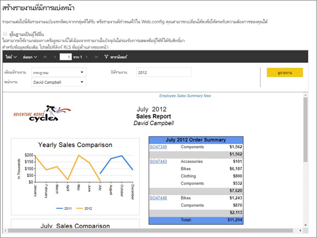
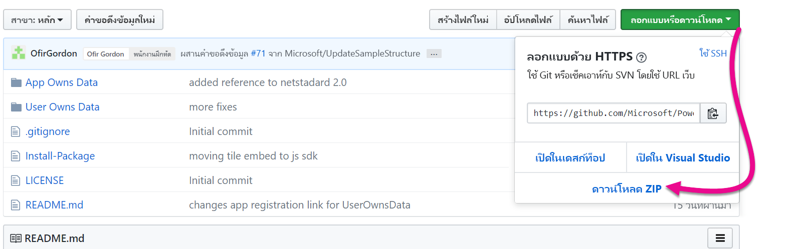
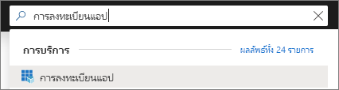
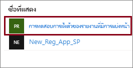
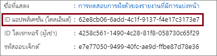
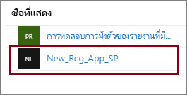
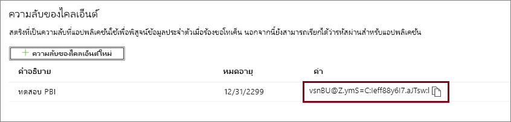
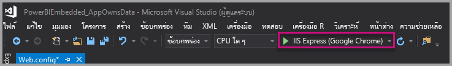
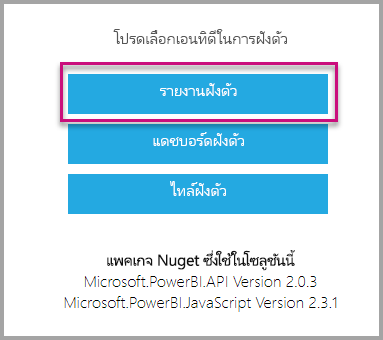

# <a name="tutorial-embed-power-bi-paginated-reports-into-an-application-for-your-customers"></a><span data-ttu-id="bf612-104">บทช่วยสอน: ฝังรายงานที่มีการแบ่งหน้าของ Power BI ในแอปพลิเคชันสำหรับลูกค้าของคุณ</span><span class="sxs-lookup"><span data-stu-id="bf612-104">Tutorial: Embed Power BI paginated reports into an application for your customers</span></span>

<span data-ttu-id="bf612-105">ด้วย **Power BI Embedded in Azure** หรือ **Power BI embedding in Office** คุณสามารถฝังรายงานที่มีการแบ่งหน้าลงในแอปพลิเคชันโดยใช้ข้อมูลที่แอปเป็นเจ้าของ</span><span class="sxs-lookup"><span data-stu-id="bf612-105">With **Power BI Embedded in Azure** or **Power BI embedding in Office**, you can embed paginated reports into an application using app owns data.</span></span> <span data-ttu-id="bf612-106">**แอปเป็นเจ้าของข้อมูล** เกี่ยวกับแอปพลิเคชันที่ใช้ Power BI เป็นแพลตฟอร์มการวิเคราะห์แบบฝังตัว</span><span class="sxs-lookup"><span data-stu-id="bf612-106">**App owns data** is about having an application that uses Power BI as its embedded analytics platform.</span></span> <span data-ttu-id="bf612-107">ในฐานะที่เป็น **ISV** หรือ **นักพัฒนา** คุณสามารถสร้างเนื้อหา Power BI ที่แสดงรายงานที่มีการแบ่งหน้าในแอปพลิเคชันที่รวมงานทั้งหมดไว้ด้วยกันและที่โต้ตอบได้ โดยผู้ใช้ไม่ต้องมีสิทธิ์การใช้งาน Power BI</span><span class="sxs-lookup"><span data-stu-id="bf612-107">As an **ISV** or a **developer**, you can create Power BI content that displays paginated reports in an application that is fully integrated and interactive, without requiring users to have a Power BI license.</span></span> <span data-ttu-id="bf612-108">บทช่วยสอนนี้สาธิตวิธีการรวมรายงานที่มีการแบ่งหน้าลงในแอปพลิเคชัน โดยใช้ Power BI SDK .NET กับ Power BI JavaScript API</span><span class="sxs-lookup"><span data-stu-id="bf612-108">This tutorial demonstrates how to integrate a paginated report into an application using the Power BI .NET SDK with the Power BI JavaScript API.</span></span>



<span data-ttu-id="bf612-110">ในบทช่วยสอนนี้ คุณจะเรียนรู้วิธีการ:</span><span class="sxs-lookup"><span data-stu-id="bf612-110">In this tutorial, you learn how to:</span></span>
> [!div class="checklist"]
> * <span data-ttu-id="bf612-111">ลงทะเบียนแอปพลิเคชันใน Azure</span><span class="sxs-lookup"><span data-stu-id="bf612-111">Register an application in Azure.</span></span>
> * <span data-ttu-id="bf612-112">ฝังรายงานที่มีการแบ่งหน้าของ Power BI ลงในแอปพลิเคชัน</span><span class="sxs-lookup"><span data-stu-id="bf612-112">Embed a Power BI paginated report into an application.</span></span>

## <a name="prerequisites"></a><span data-ttu-id="bf612-113">ข้อกำหนดเบื้องต้น</span><span class="sxs-lookup"><span data-stu-id="bf612-113">Prerequisites</span></span>

<span data-ttu-id="bf612-114">เมื่อต้องเริ่มต้นใช้งาน คุณจำเป็นต้องมี:</span><span class="sxs-lookup"><span data-stu-id="bf612-114">To get started, you're required to have:</span></span>

* <span data-ttu-id="bf612-115">[องค์ประกอบหลักของบริการ (โทเค็นเฉพาะแอป)](embed-service-principal.md)</span><span class="sxs-lookup"><span data-stu-id="bf612-115">A [service principal (app-only token)](embed-service-principal.md)</span></span>
* <span data-ttu-id="bf612-116">การสมัครใช้งาน [Microsoft Azure](https://azure.microsoft.com/)</span><span class="sxs-lookup"><span data-stu-id="bf612-116">A [Microsoft Azure](https://azure.microsoft.com/) subscription</span></span>
* <span data-ttu-id="bf612-117">การตั้งค่า [ผู้เช่า Azure Active Directory](create-an-azure-active-directory-tenant.md) ของคุณเอง</span><span class="sxs-lookup"><span data-stu-id="bf612-117">Your own [Azure Active Directory tenant](create-an-azure-active-directory-tenant.md) setup</span></span>
* <span data-ttu-id="bf612-118">[ความจุ](#create-a-capacity)อย่างน้อย A4 หรือ P1 โดยมีการเปิดใช้งานปริมาณงาน [รายงานที่มีการแบ่งหน้า](../../admin/service-admin-premium-workloads.md#paginated-reports)</span><span class="sxs-lookup"><span data-stu-id="bf612-118">At least an A4 or a P1 [capacity](#create-a-capacity), with [paginated reports](../../admin/service-admin-premium-workloads.md#paginated-reports) workload enabled</span></span>

<span data-ttu-id="bf612-119">ถ้าคุณยังไม่มีการสมัครใช้งาน Azure สร้าง[บัญชีฟรี](https://azure.microsoft.com/free/?WT.mc_id=A261C142F)ก่อนที่คุณจะเริ่ม</span><span class="sxs-lookup"><span data-stu-id="bf612-119">If you don't have an Azure subscription, create a [free account](https://azure.microsoft.com/free/?WT.mc_id=A261C142F) before you begin.</span></span>

> [!IMPORTANT]
> * <span data-ttu-id="bf612-120">คุณต้องใช้ **โครงร่างสำคัญของบริการ**</span><span class="sxs-lookup"><span data-stu-id="bf612-120">You must use a **service principal**.</span></span> <span data-ttu-id="bf612-121">ผู้ใช้หลักไม่ได้รับการสนับสนุน</span><span class="sxs-lookup"><span data-stu-id="bf612-121">Master user is not supported.</span></span>
>* <span data-ttu-id="bf612-122">ไม่รองรับ [Premium Per User (PPU)](../../admin/service-premium-per-user-faq.md)</span><span class="sxs-lookup"><span data-stu-id="bf612-122">[Premium Per User (PPU)](../../admin/service-premium-per-user-faq.md) is not supported.</span></span> <span data-ttu-id="bf612-123">คุณสามารถใช้ PPU เพื่อทดลองกับโซลูชันได้ แต่คุณจะไม่สามารถ[ย้ายไปที่การผลิต](move-to-production.md)ได้</span><span class="sxs-lookup"><span data-stu-id="bf612-123">You can use PPU to experiment with the solution, but you'll not be able to [move to production](move-to-production.md).</span></span>
> * <span data-ttu-id="bf612-124">แหล่งข้อมูลที่จำเป็นต้องมีการลงชื่อเข้าระบบครั้งเดียว (SSO) ไม่ได้รับการสนับสนุน</span><span class="sxs-lookup"><span data-stu-id="bf612-124">Datasources that require single sign-on (SSO), are not supported.</span></span> <span data-ttu-id="bf612-125">สำหรับรายการของชุดข้อมูลที่ได้รับการสนับสนุนและวิธีการรับรองความถูกต้อง โปรดดูที่ [แหล่งข้อมูลที่สนับสนุนสำหรับรายงานที่มีการแบ่งหน้า Power BI](../../paginated-reports/paginated-reports-data-sources.md)</span><span class="sxs-lookup"><span data-stu-id="bf612-125">For a list of supported datasets and their authentication methods, see [Supported data sources for Power BI paginated reports](../../paginated-reports/paginated-reports-data-sources.md).</span></span> 
> * <span data-ttu-id="bf612-126">ชุดข้อมูล Power BI ไม่ได้รับการสนับสนุนเป็น[แหล่งข้อมูล](../../connect-data/service-get-data.md)</span><span class="sxs-lookup"><span data-stu-id="bf612-126">Power BI dataset is not supported as a [datasource](../../connect-data/service-get-data.md).</span></span>

## <a name="set-up-your-power-bi-environment"></a><span data-ttu-id="bf612-127">ตั้งค่าสภาพแวดล้อม Power BI ของคุณ</span><span class="sxs-lookup"><span data-stu-id="bf612-127">Set up your Power BI environment</span></span>

<span data-ttu-id="bf612-128">การฝังรายงานที่มีการแบ่งหน้าต้องกำหนดพื้นที่ทำงานให้กับความจุก่อน และต้องอัปโหลดรายงานไปยังพื้นที่ทำงานด้วย</span><span class="sxs-lookup"><span data-stu-id="bf612-128">Embedding a paginated report requires assigning a workspace to a capacity, and uploading the report to the workspace.</span></span>

### <a name="create-an-app-workspace"></a><span data-ttu-id="bf612-129">สร้างพื้นที่ทำงานสำหรับแอป</span><span class="sxs-lookup"><span data-stu-id="bf612-129">Create an app workspace</span></span>

<span data-ttu-id="bf612-130">ถ้าคุณกำลังใช้ [องค์ประกอบหลักของบริการ](embed-service-principal.md) เพื่อเข้าสู่ระบบแอปพลิเคชันของคุณ คุณจำเป็นต้องใช้[พื้นที่ทำงานใหม่](../../collaborate-share/service-create-the-new-workspaces.md)</span><span class="sxs-lookup"><span data-stu-id="bf612-130">As you're using a [service principal](embed-service-principal.md) to sign into your application, you're required to use the [new workspaces](../../collaborate-share/service-create-the-new-workspaces.md).</span></span> <span data-ttu-id="bf612-131">ในฐานะที่เป็น *องค์ประกอบหลักของบริการ* คุณต้องเป็นผู้ดูแลระบบหรือสมาชิกของพื้นที่ทำงานแอปที่เกี่ยวข้องกับแอปพลิเคชันของคุณ</span><span class="sxs-lookup"><span data-stu-id="bf612-131">As a *service principal*, you must also be an admin or member of the app workspaces involved with your application.</span></span>

### <a name="create-a-capacity"></a><span data-ttu-id="bf612-132">สร้างความจุ</span><span class="sxs-lookup"><span data-stu-id="bf612-132">Create a capacity</span></span>

<span data-ttu-id="bf612-133">ก่อนที่คุณจะนำเข้าหรืออัปโหลดรรายงานที่มีการแบ่งหน้าเพื่อทำการฝัง คุณต้องกำหนดพื้นที่ทำงานที่มีรายงานอยู่ ให้มีความจุอยู่ในระดับอย่างน้อย A4 หรือ P1</span><span class="sxs-lookup"><span data-stu-id="bf612-133">Before you import or upload a paginated report to embed, the workspace containing the report must be assigned to at least an A4 or P1 capacity.</span></span> <span data-ttu-id="bf612-134">มีความจุสองชนิดที่คุณสามารถเลือกได้จาก:</span><span class="sxs-lookup"><span data-stu-id="bf612-134">There are two types of capacity you can choose from:</span></span>
* <span data-ttu-id="bf612-135">**Power BI Premium** - สำหรับการฝังรายงานที่มีการแบ่งหน้า ต้องการความจุ SKU ระดับ *P*</span><span class="sxs-lookup"><span data-stu-id="bf612-135">**Power BI Premium** - For embedding a paginated report, a *P* SKU capacity is required.</span></span> <span data-ttu-id="bf612-136">เมื่อมีการฝังเนื้อหา Power BI โซลูชันนี้เรียกว่า *การฝัง Power BI*</span><span class="sxs-lookup"><span data-stu-id="bf612-136">When embedding Power BI content, this solution is referred to as *Power BI embedding*.</span></span> <span data-ttu-id="bf612-137">สำหรับข้อมูลเพิ่มเติมเกี่ยวกับการสมัครสมาชิกนี้ โปรดดู [Power BI Premium คืออะไร](../../admin/service-premium-what-is.md)</span><span class="sxs-lookup"><span data-stu-id="bf612-137">For more information regarding this subscription, see [What is Power BI Premium?](../../admin/service-premium-what-is.md)</span></span>
* <span data-ttu-id="bf612-138">**Azure Power BI Embedded** - คุณสามารถซื้อความจุจาก [พอร์ทัล Microsoft Azure](https://portal.azure.com)</span><span class="sxs-lookup"><span data-stu-id="bf612-138">**Azure Power BI Embedded** - You can purchase a capacity from the [Microsoft Azure portal](https://portal.azure.com).</span></span> <span data-ttu-id="bf612-139">การสมัครสมาชิกนี้ใช้ SKU ระดับ *A*</span><span class="sxs-lookup"><span data-stu-id="bf612-139">This subscription uses the *A* SKUs.</span></span> <span data-ttu-id="bf612-140">สำหรับการฝังรรายงานที่มีการแบ่งหน้า คุณจำเป็นต้องมีการสมัครใช้งานอย่างน้อย *A4*</span><span class="sxs-lookup"><span data-stu-id="bf612-140">For embedding paginated reports you need at least an *A4* subscription.</span></span> <span data-ttu-id="bf612-141">สำหรับรายละเอียดเกี่ยวกับวิธีการสร้างความจุ Power BI Embedded โปรดดู[สร้างความจุ Power BI Embedded ในพอร์ทัล Azure](azure-pbie-create-capacity.md)</span><span class="sxs-lookup"><span data-stu-id="bf612-141">For details on how to create a Power BI Embedded capacity, see [Create Power BI Embedded capacity in the Azure portal](azure-pbie-create-capacity.md).</span></span>

    >[!NOTE]
    ><span data-ttu-id="bf612-142">Power BI Embedded ได้เผยแพร่เวอร์ชันใหม่ล่าสุดซึ่งเรียกว่า **Embedded Gen2**</span><span class="sxs-lookup"><span data-stu-id="bf612-142">Power BI Embedded recently released a new version, called **Embedded Gen2**.</span></span> <span data-ttu-id="bf612-143">Embedded Gen2 จะลดความซับซ้อนของการจัดการความจุแบบฝังตัว และปรับปรุงประสบการณ์การใช้งาน Power BI Embedded</span><span class="sxs-lookup"><span data-stu-id="bf612-143">Embedded Gen2 will simplify the management of embedded capacities, and improve the Power BI Embedded experience.</span></span> <span data-ttu-id="bf612-144">สำหรับข้อมูลเพิ่มเติม ให้ดทีู่ [Power BI Embedded Generation 2](power-bi-embedded-generation-2.md)</span><span class="sxs-lookup"><span data-stu-id="bf612-144">For more information, see [Power BI Embedded Generation 2](power-bi-embedded-generation-2.md).</span></span>

<span data-ttu-id="bf612-145">ตารางด้านล่างอธิบายแหล่งข้อมูลและขีดจำกัดของแต่ละ SKU</span><span class="sxs-lookup"><span data-stu-id="bf612-145">The table below describes the resources and limits of each SKU.</span></span> <span data-ttu-id="bf612-146">หากต้องการตรวจสอบความจุที่เหมาะสมที่สุดกับความต้องการของคุณ ให้ดูตาราง [SKU ใดที่ฉันควรซื้อสำหรับสถานการณ์ของฉัน](./embedded-faq.md#which-solution-should-i-choose)</span><span class="sxs-lookup"><span data-stu-id="bf612-146">To determine which capacity best fits your needs, see the [which SKU should I purchase for my scenario](./embedded-faq.md#which-solution-should-i-choose) table.</span></span>

| <span data-ttu-id="bf612-147">โหนดความจุ</span><span class="sxs-lookup"><span data-stu-id="bf612-147">Capacity Nodes</span></span> | <span data-ttu-id="bf612-148">วี-คอร์รวม</span><span class="sxs-lookup"><span data-stu-id="bf612-148">Total v-cores</span></span> | <span data-ttu-id="bf612-149">Backend v-cores</span><span class="sxs-lookup"><span data-stu-id="bf612-149">Backend v-cores</span></span> | <span data-ttu-id="bf612-150">RAM (GB)</span><span class="sxs-lookup"><span data-stu-id="bf612-150">RAM (GB)</span></span> | <span data-ttu-id="bf612-151">Frontend v-cores</span><span class="sxs-lookup"><span data-stu-id="bf612-151">Frontend v-cores</span></span> | 
| --- | --- | --- | --- | --- |
| <span data-ttu-id="bf612-152">A1 ที่มี [Embedded Gen2](power-bi-embedded-generation-2.md)</span><span class="sxs-lookup"><span data-stu-id="bf612-152">A1 with [Embedded Gen2](power-bi-embedded-generation-2.md)</span></span> | <span data-ttu-id="bf612-153">1</span><span class="sxs-lookup"><span data-stu-id="bf612-153">1</span></span> | <span data-ttu-id="bf612-154">0.5</span><span class="sxs-lookup"><span data-stu-id="bf612-154">0.5</span></span> | <span data-ttu-id="bf612-155">2.5</span><span class="sxs-lookup"><span data-stu-id="bf612-155">2.5</span></span> | <span data-ttu-id="bf612-156">0.5</span><span class="sxs-lookup"><span data-stu-id="bf612-156">0.5</span></span> |
| <span data-ttu-id="bf612-157">A2 ที่มี [Embedded Gen2](power-bi-embedded-generation-2.md)</span><span class="sxs-lookup"><span data-stu-id="bf612-157">A2 with [Embedded Gen2](power-bi-embedded-generation-2.md)</span></span> | <span data-ttu-id="bf612-158">2</span><span class="sxs-lookup"><span data-stu-id="bf612-158">2</span></span> | <span data-ttu-id="bf612-159">1</span><span class="sxs-lookup"><span data-stu-id="bf612-159">1</span></span> | <span data-ttu-id="bf612-160">5</span><span class="sxs-lookup"><span data-stu-id="bf612-160">5</span></span> | <span data-ttu-id="bf612-161">1</span><span class="sxs-lookup"><span data-stu-id="bf612-161">1</span></span> |
| <span data-ttu-id="bf612-162">A3 ที่มี [Embedded Gen2](power-bi-embedded-generation-2.md)</span><span class="sxs-lookup"><span data-stu-id="bf612-162">A3 with [Embedded Gen2](power-bi-embedded-generation-2.md)</span></span> | <span data-ttu-id="bf612-163">4</span><span class="sxs-lookup"><span data-stu-id="bf612-163">4</span></span> | <span data-ttu-id="bf612-164">2</span><span class="sxs-lookup"><span data-stu-id="bf612-164">2</span></span> | <span data-ttu-id="bf612-165">10</span><span class="sxs-lookup"><span data-stu-id="bf612-165">10</span></span> | <span data-ttu-id="bf612-166">2</span><span class="sxs-lookup"><span data-stu-id="bf612-166">2</span></span> |
| <span data-ttu-id="bf612-167">P1/A4</span><span class="sxs-lookup"><span data-stu-id="bf612-167">P1/A4</span></span> | <span data-ttu-id="bf612-168">8</span><span class="sxs-lookup"><span data-stu-id="bf612-168">8</span></span> | <span data-ttu-id="bf612-169">4</span><span class="sxs-lookup"><span data-stu-id="bf612-169">4</span></span> | <span data-ttu-id="bf612-170">25</span><span class="sxs-lookup"><span data-stu-id="bf612-170">25</span></span> | <span data-ttu-id="bf612-171">4</span><span class="sxs-lookup"><span data-stu-id="bf612-171">4</span></span> |
| <span data-ttu-id="bf612-172">P2/A5</span><span class="sxs-lookup"><span data-stu-id="bf612-172">P2/A5</span></span> | <span data-ttu-id="bf612-173">16</span><span class="sxs-lookup"><span data-stu-id="bf612-173">16</span></span> | <span data-ttu-id="bf612-174">8</span><span class="sxs-lookup"><span data-stu-id="bf612-174">8</span></span> | <span data-ttu-id="bf612-175">50</span><span class="sxs-lookup"><span data-stu-id="bf612-175">50</span></span> | <span data-ttu-id="bf612-176">8</span><span class="sxs-lookup"><span data-stu-id="bf612-176">8</span></span> |
| <span data-ttu-id="bf612-177">P3/A6</span><span class="sxs-lookup"><span data-stu-id="bf612-177">P3/A6</span></span> | <span data-ttu-id="bf612-178">32</span><span class="sxs-lookup"><span data-stu-id="bf612-178">32</span></span> | <span data-ttu-id="bf612-179">16</span><span class="sxs-lookup"><span data-stu-id="bf612-179">16</span></span> | <span data-ttu-id="bf612-180">100</span><span class="sxs-lookup"><span data-stu-id="bf612-180">100</span></span> | <span data-ttu-id="bf612-181">16</span><span class="sxs-lookup"><span data-stu-id="bf612-181">16</span></span> |
| | | | | |

### <a name="assign-an-app-workspace-to-a-capacity"></a><span data-ttu-id="bf612-182">กำหนดพื้นที่ทำงานของแอปไปยังความจุ</span><span class="sxs-lookup"><span data-stu-id="bf612-182">Assign an app workspace to a capacity</span></span>

<span data-ttu-id="bf612-183">เมื่อคุณสร้างความจุแล้ว คุณสามารถกำหนดพื้นที่ทำงานแอปไปยังความจุนั้นได้</span><span class="sxs-lookup"><span data-stu-id="bf612-183">Once you create a capacity, you can assign your app workspace to that capacity.</span></span>

<span data-ttu-id="bf612-184">เมื่อต้องกำหนดความจุกับพื้นที่ทำงานโดยใช้[บริการหลัก](embed-service-principal.md) ให้ใช้[Power BI REST API](/rest/api/power-bi/capacities/groups_assigntocapacity)</span><span class="sxs-lookup"><span data-stu-id="bf612-184">To assign a capacity to a workspace using [service principal](embed-service-principal.md), use the [Power BI REST API](/rest/api/power-bi/capacities/groups_assigntocapacity).</span></span> <span data-ttu-id="bf612-185">เมื่อคุณกำลังใช้ Power BI REST API ทำให้แน่ใจว่าใช้[ ID ออบเจ็กต์ของบริการหลัก](embed-service-principal.md)</span><span class="sxs-lookup"><span data-stu-id="bf612-185">When you are using the Power BI REST APIs, make sure to use the [service principal object ID](embed-service-principal.md).</span></span>

### <a name="create-and-upload-your-paginated-reports"></a><span data-ttu-id="bf612-186">สร้างและอัปโหลดรายงานที่มีการแบ่งหน้าของคุณ</span><span class="sxs-lookup"><span data-stu-id="bf612-186">Create and upload your paginated reports</span></span>

<span data-ttu-id="bf612-187">คุณสามารถสร้างรายงานที่มีการแบ่งหน้าโดยใช้ [เครื่องมือสร้างรายงาน Power BI](../../paginated-reports/paginated-reports-report-builder-power-bi.md#create-reports-in-power-bi-report-builder) จากนั้น [อัปโหลดรายงานไปยังบริการ](../../paginated-reports/paginated-reports-quickstart-aw.md#upload-the-report-to-the-service)</span><span class="sxs-lookup"><span data-stu-id="bf612-187">You can create your paginated report using [Power BI Report Builder](../../paginated-reports/paginated-reports-report-builder-power-bi.md#create-reports-in-power-bi-report-builder), and then [upload the report to the service](../../paginated-reports/paginated-reports-quickstart-aw.md#upload-the-report-to-the-service).</span></span>

<span data-ttu-id="bf612-188">คุณสามารถนำเข้ารายงานที่มีการแบ่งหน้าไปยังพื้นที่ทำงานใหม่ได้โดยใช้ [Power BI REST API](/rest/api/power-bi/imports/postimportingroup)</span><span class="sxs-lookup"><span data-stu-id="bf612-188">You can import paginated reports into the new workspaces using the [Power BI REST APIs](/rest/api/power-bi/imports/postimportingroup).</span></span>

## <a name="embed-content-using-the-sample-application"></a><span data-ttu-id="bf612-189">ฝังเนื้อหาโดยใช้แอปพลิเคชันตัวอย่าง</span><span class="sxs-lookup"><span data-stu-id="bf612-189">Embed content using the sample application</span></span>

<span data-ttu-id="bf612-190">ตัวอย่างนี้ถูกเก็บไว้อย่างตั้งใจเพื่อวัตถุประสงค์ในการสาธิต</span><span class="sxs-lookup"><span data-stu-id="bf612-190">This sample is deliberately kept simple for demonstration purposes.</span></span> <span data-ttu-id="bf612-191">ซึ่งขึ้นอยู่กับคุณหรือผู้พัฒนาของคุณเพื่อปกป้องความลับของแอปพลิเคชัน</span><span class="sxs-lookup"><span data-stu-id="bf612-191">It's up to you or your developers to protect the application secret.</span></span>

<span data-ttu-id="bf612-192">ทำตามขั้นตอนด้านล่างเพื่อเริ่มการฝังเนื้อหาของคุณโดยใช้แอปพลิเคชันตัวอย่าง</span><span class="sxs-lookup"><span data-stu-id="bf612-192">Follow the steps below to start embedding your content using the sample application.</span></span>

1. <span data-ttu-id="bf612-193">ดาวน์โหลด[Visual Studio](https://www.visualstudio.com/) (เวอร์ชัน 2013 หรือใหม่กว่า)</span><span class="sxs-lookup"><span data-stu-id="bf612-193">Download [Visual Studio](https://www.visualstudio.com/) (version 2013 or later).</span></span> <span data-ttu-id="bf612-194">ทำให้แน่ใจว่าได้ดาวน์โหลด[แพคเกจ NuGet](https://www.nuget.org/profiles/powerbi)ล่าสุด</span><span class="sxs-lookup"><span data-stu-id="bf612-194">Make sure to download the latest [NuGet package](https://www.nuget.org/profiles/powerbi).</span></span>

2. <span data-ttu-id="bf612-195">ดาวน์โหลด[ตัวอย่างแอปเป็นเจ้าของข้อมูล](https://github.com/Microsoft/PowerBI-Developer-Samples)จาก GitHub เพื่อเริ่มต้น</span><span class="sxs-lookup"><span data-stu-id="bf612-195">Download the [App Owns Data sample](https://github.com/Microsoft/PowerBI-Developer-Samples) from GitHub to get started.</span></span>

    

3. <span data-ttu-id="bf612-197">เปิดไฟล์ **Web.config** ในแอปพลิเคชันตัวอย่าง</span><span class="sxs-lookup"><span data-stu-id="bf612-197">Open the **Web.config** file in the sample application.</span></span> <span data-ttu-id="bf612-198">มีเขตข้อมูลที่คุณต้องกรอกข้อมูลเพื่อเรียกใช้แอปพลิเคชันให้สำเร็จ</span><span class="sxs-lookup"><span data-stu-id="bf612-198">There are fields you need to fill in to run the application.</span></span> <span data-ttu-id="bf612-199">เลือก **ServicePrincipal** สำหรับ **AuthenticationType**</span><span class="sxs-lookup"><span data-stu-id="bf612-199">Choose **ServicePrincipal** for the **AuthenticationType**.</span></span>

    <span data-ttu-id="bf612-200">กรอกข้อมูลในเขตข้อมูลต่อไปนี้:</span><span class="sxs-lookup"><span data-stu-id="bf612-200">Fill in the following fields:</span></span>
    * [<span data-ttu-id="bf612-201">applicationId</span><span class="sxs-lookup"><span data-stu-id="bf612-201">applicationId</span></span>](#application-id)
    * [<span data-ttu-id="bf612-202">workspaceId</span><span class="sxs-lookup"><span data-stu-id="bf612-202">workspaceId</span></span>](#workspace-id)
    * [<span data-ttu-id="bf612-203">reportId</span><span class="sxs-lookup"><span data-stu-id="bf612-203">reportId</span></span>](#report-id)
    * [<span data-ttu-id="bf612-204">applicationsecret</span><span class="sxs-lookup"><span data-stu-id="bf612-204">applicationsecret</span></span>](#application-secret)
    * [<span data-ttu-id="bf612-205">tenant</span><span class="sxs-lookup"><span data-stu-id="bf612-205">tenant</span></span>](#tenant)

    > [!Note]
    > <span data-ttu-id="bf612-206">**AuthenticationType** ค่าเริ่มต้นในตัวอย่างนี้คือ MasterUser</span><span class="sxs-lookup"><span data-stu-id="bf612-206">The default **AuthenticationType** in this sample is MasterUser.</span></span> <span data-ttu-id="bf612-207">ตรวจสอบให้แน่ใจว่าคุณได้เปลี่ยนเป็น **ServicePrincipal**</span><span class="sxs-lookup"><span data-stu-id="bf612-207">Make sure you change it to **ServicePrincipal**.</span></span> 


    

### <a name="application-id"></a><span data-ttu-id="bf612-209">รหัสแอปพลิเคชัน</span><span class="sxs-lookup"><span data-stu-id="bf612-209">Application ID</span></span>

<span data-ttu-id="bf612-210">ป้อนข้อมูล **applicationId** ด้วย **ID แอปพลิเคชัน** จาก **Azure**</span><span class="sxs-lookup"><span data-stu-id="bf612-210">Fill in the **applicationId** information with the **Application ID** from **Azure**.</span></span> <span data-ttu-id="bf612-211">แอปพลิเชันจะใช้ **applicationId** เพื่อระบุตัวเองไปยังผู้ใช้จากที่คุณกำลังขอสิทธิ์</span><span class="sxs-lookup"><span data-stu-id="bf612-211">The **applicationId** is used by the application to identify itself to the users from which you're requesting permissions.</span></span>

<span data-ttu-id="bf612-212">สำหรับวิธีรับ **applicationId** ให้ทำตามขั้นตอนต่อไปนี้:</span><span class="sxs-lookup"><span data-stu-id="bf612-212">To get the **applicationId**, follow these steps:</span></span>

1. <span data-ttu-id="bf612-213">ลงชื่อเข้าใช้[พอร์ทัล Azure](https://portal.azure.com)</span><span class="sxs-lookup"><span data-stu-id="bf612-213">Sign into the [Azure portal](https://portal.azure.com).</span></span>

2. <span data-ttu-id="bf612-214">ในบานหน้าต่างนำทางซ้ายมือ ให้เลือก **บริการทั้งหมด** และค้นหา **การลงทะเบียนแอป**</span><span class="sxs-lookup"><span data-stu-id="bf612-214">In the left-hand nav pane, select **All Services**, and search for **App Registrations**.</span></span>

    

3. <span data-ttu-id="bf612-216">เลือกแอปพลิเคชันที่ต้องใช้ **ApplicationID**</span><span class="sxs-lookup"><span data-stu-id="bf612-216">Select the application that needs the **applicationId**.</span></span>

    

4. <span data-ttu-id="bf612-218">มี **ID แอปพลิเคชัน** ที่แสดงในรูปของ GUID</span><span class="sxs-lookup"><span data-stu-id="bf612-218">There's an **Application ID** that is listed as a GUID.</span></span> <span data-ttu-id="bf612-219">ใช้ **ID แอปพลิเคชัน** นี้เป็น **applicationId** สำหรับแอปพลิเคชัน</span><span class="sxs-lookup"><span data-stu-id="bf612-219">Use this **Application ID** as the **applicationId** for the application.</span></span>

    

### <a name="workspace-id"></a><span data-ttu-id="bf612-221">ID พื้นที่ทำงาน</span><span class="sxs-lookup"><span data-stu-id="bf612-221">Workspace ID</span></span>

<span data-ttu-id="bf612-222">กรอกข้อมูล **workspaceId** ด้วย พื้นที่ทำงานแอป (กลุ่ม) GUID จาก Power BI</span><span class="sxs-lookup"><span data-stu-id="bf612-222">Fill in the **workspaceId** information with the app workspace (group) GUID from Power BI.</span></span> <span data-ttu-id="bf612-223">คุณสามารถดูข้อมูลนี้จาก URL เมื่อลงชื่อเข้าใช้บริการ Power BI หรือโดยการใช้ Powershell</span><span class="sxs-lookup"><span data-stu-id="bf612-223">You can get this information either from the URL when signed into the Power BI service or using PowerShell.</span></span>

<span data-ttu-id="bf612-224">URL</span><span class="sxs-lookup"><span data-stu-id="bf612-224">URL</span></span> <br>


<span data-ttu-id="bf612-226">PowerShell</span><span class="sxs-lookup"><span data-stu-id="bf612-226">PowerShell</span></span> <br>

```powershell
Get-PowerBIworkspace -name "Paginated Report Embed"
```

   

### <a name="report-id"></a><span data-ttu-id="bf612-228">รหัสรายงาน</span><span class="sxs-lookup"><span data-stu-id="bf612-228">Report ID</span></span>

<span data-ttu-id="bf612-229">กรอกข้อมูล **reportId** ด้วย GUID รายงานจาก Power BI</span><span class="sxs-lookup"><span data-stu-id="bf612-229">Fill in the **reportId** information with the report GUID from Power BI.</span></span> <span data-ttu-id="bf612-230">คุณสามารถดูข้อมูลนี้จาก URL เมื่อลงชื่อเข้าใช้บริการ Power BI หรือโดยการใช้ Powershell</span><span class="sxs-lookup"><span data-stu-id="bf612-230">You can get this information either from the URL when signed into the Power BI service or using PowerShell.</span></span>

<span data-ttu-id="bf612-231">URL</span><span class="sxs-lookup"><span data-stu-id="bf612-231">URL</span></span><br>


<span data-ttu-id="bf612-233">PowerShell</span><span class="sxs-lookup"><span data-stu-id="bf612-233">PowerShell</span></span> <br>

```powershell
Get-PowerBIworkspace -name "Paginated Report Embed" | Get-PowerBIReport
```


### <a name="application-secret"></a><span data-ttu-id="bf612-235">ข้อมูลลับของแอปพลิเคชัน</span><span class="sxs-lookup"><span data-stu-id="bf612-235">Application secret</span></span>

<span data-ttu-id="bf612-236">ป้อนข้อมูล **ApplicationSecret** จากส่วน **คีย์** ของส่วน **การลงทะเบียนแอปพลิเคชัน** ใน **Azure**</span><span class="sxs-lookup"><span data-stu-id="bf612-236">Fill in the **ApplicationSecret** information from the **Keys** section of your **App registrations** section in **Azure**.</span></span>

<span data-ttu-id="bf612-237">สำหรับวิธีรับ **ApplicationSecret** ให้ทำตามขั้นตอนต่อไปนี้:</span><span class="sxs-lookup"><span data-stu-id="bf612-237">To get the **ApplicationSecret**, follow these steps:</span></span>

1. <span data-ttu-id="bf612-238">ลงชื่อเข้าใช้ไปยัง [พอร์ทัล Azure](https://portal.azure.com)</span><span class="sxs-lookup"><span data-stu-id="bf612-238">Sign in to the [Azure portal](https://portal.azure.com).</span></span>

2. <span data-ttu-id="bf612-239">ในบานหน้าต่างนำทางซ้ายมือ ให้เลือก **บริการทั้งหมด** และค้นหา **การลงทะเบียนแอป**</span><span class="sxs-lookup"><span data-stu-id="bf612-239">In the left-hand nav pane, select **All services** and search for **App registrations**.</span></span>

    

3. <span data-ttu-id="bf612-241">เลือกแอปพลิเคชันที่ต้องใช้ **ApplicationSecret**</span><span class="sxs-lookup"><span data-stu-id="bf612-241">Select the application that needs to use the **ApplicationSecret**.</span></span>

    

4. <span data-ttu-id="bf612-243">เลือก **ใบรับรองและข้อมูลลับ** ภายใต้ **จัดการ**</span><span class="sxs-lookup"><span data-stu-id="bf612-243">Select **Certificates and secrets** under **Manage**.</span></span>

5. <span data-ttu-id="bf612-244">เลือก **ข้อมูลลับไคลเอ็นต์ใหม่**</span><span class="sxs-lookup"><span data-stu-id="bf612-244">Select **New client secrets**.</span></span>

6. <span data-ttu-id="bf612-245">ป้อนชื่อในกล่อง **Description** และเลือกระยะเวลา</span><span class="sxs-lookup"><span data-stu-id="bf612-245">Enter a name in the **Description** box and select a duration.</span></span> <span data-ttu-id="bf612-246">จากนั้นเลือก **บันทึก** เพื่อรับ **ค่า** สำหรับแอปพลิเคชัน</span><span class="sxs-lookup"><span data-stu-id="bf612-246">Then select **Save** to get the **Value** for your application.</span></span> <span data-ttu-id="bf612-247">เมื่อคุณเลือกบานหน้าต่าง **คีย์** หลังจากการบันทึกค่าคีย์แล้ว ช่องค่าจะถูกซ่อนเท่านั้น</span><span class="sxs-lookup"><span data-stu-id="bf612-247">When you close the **Keys** pane after saving the key value, the value field shows only as hidden.</span></span> <span data-ttu-id="bf612-248">ในขั้นตอนนี้คุณจะไม่สามารถเรียกดูค่าคีย์ได้</span><span class="sxs-lookup"><span data-stu-id="bf612-248">At that point, you aren't able to retrieve the key value.</span></span> <span data-ttu-id="bf612-249">หากคุณทำค่าคีย์หาย ให้สร้างใหม่ในพอร์ทัล Azure</span><span class="sxs-lookup"><span data-stu-id="bf612-249">If you lose the key value, create a new one in the Azure portal.</span></span>

    

### <a name="tenant"></a><span data-ttu-id="bf612-251">ผู้เช่า</span><span class="sxs-lookup"><span data-stu-id="bf612-251">Tenant</span></span>

<span data-ttu-id="bf612-252">กรอกข้อมูล **ผู้เช่า** ด้วย ID ผู้เช่า Azure ของคุณ</span><span class="sxs-lookup"><span data-stu-id="bf612-252">Fill in the **tenant** information with your Azure tenant ID.</span></span> <span data-ttu-id="bf612-253">คุณสามารถรับข้อมูลนี้ได้จาก[ศูนย์ผู้ดูแลระบบ Azure AD](/onedrive/find-your-office-365-tenant-id) เมื่อลงชื่อเข้าใช้บริการของ Power BI หรือใช้ Powershell</span><span class="sxs-lookup"><span data-stu-id="bf612-253">You can get this information from the [Azure AD admin center](/onedrive/find-your-office-365-tenant-id) when signed into the Power BI service or by using PowerShell.</span></span>

### <a name="run-the-application"></a><span data-ttu-id="bf612-254">เรียกใช้แอปพลิเคชัน</span><span class="sxs-lookup"><span data-stu-id="bf612-254">Run the application</span></span>

1. <span data-ttu-id="bf612-255">เลือก **เรียกใช้** ใน **Visual Studio**</span><span class="sxs-lookup"><span data-stu-id="bf612-255">Select **Run** in **Visual Studio**.</span></span>

    

2. <span data-ttu-id="bf612-257">จากนั้นเลือก **Embed Report**</span><span class="sxs-lookup"><span data-stu-id="bf612-257">Then select **Embed Report**.</span></span>

    

3. <span data-ttu-id="bf612-259">ตอนนี้ คุณสามารถดูรายงานในแอปพลิเคชันตัวอย่างได้แล้ว</span><span class="sxs-lookup"><span data-stu-id="bf612-259">Now you can view the report in the sample application.</span></span>

    

## <a name="embed-power-bi-paginated-reports-within-your-application"></a><span data-ttu-id="bf612-261">ฝังรายงานที่มีการแบ่งหน้าของ Power BI ภายในแอปพลิเคชันของคุณ</span><span class="sxs-lookup"><span data-stu-id="bf612-261">Embed Power BI paginated reports within your application</span></span>

<span data-ttu-id="bf612-262">แม้ว่าขั้นตอนในการฝังรายงานที่มีการแบ่งหน้าของคุณอาจทำได้ด้วย [Power BI REST API](/rest/api/power-bi/) แต่ตัวอย่างรหัสที่อธิบายในบทความนี้ถูกสร้างด้วย **.NET SDK**</span><span class="sxs-lookup"><span data-stu-id="bf612-262">Even though the steps to embed your Power BI paginated reports are done with the [Power BI REST APIs](/rest/api/power-bi/), the example codes described in this article are made with the **.NET SDK**.</span></span>

<span data-ttu-id="bf612-263">การฝังรายงานที่มีการแบ่งหน้าของ Power BI สำหรับลูกค้าของคุณภายในแอปพลิเคชันของคุณ คุณจะต้องมี **Azure AD**[องค์ประกอบหลักของบริการ](embed-service-principal.md) และได้รับ [โทเค็นการเข้าถึง Azure AD](get-azuread-access-token.md#access-token-for-non-power-bi-users-app-owns-data) สำหรับแอปพลิเคชัน Power BI ของคุณ ก่อนที่คุณจะทำการเรียกใช้ [Power BI REST APIs](/rest/api/power-bi/)</span><span class="sxs-lookup"><span data-stu-id="bf612-263">Embedding Power BI paginated reports for your customers within your application, requires you to have an **Azure AD** [service principal](embed-service-principal.md) and get an [Azure AD access token](get-azuread-access-token.md#access-token-for-non-power-bi-users-app-owns-data) for your Power BI application, before you make calls to the [Power BI REST APIs](/rest/api/power-bi/).</span></span>

<span data-ttu-id="bf612-264">หากต้องการสร้าง Power BI Client ด้วย **โทเค็นการเข้าถึง** ให้สร้างออบเจ็กต์ไคลเอ็นต์ Power BI ซึ่งช่วยให้คุณสามารถติดต่อกับ [Power BI REST APIs](/rest/api/power-bi/) ได้</span><span class="sxs-lookup"><span data-stu-id="bf612-264">To create the Power BI Client with your **access token**, create a Power BI client object, which allows you to interact with the [Power BI REST APIs](/rest/api/power-bi/).</span></span> <span data-ttu-id="bf612-265">คุณสร้างวัตถุไคลเอ็นต์ Power BI ได้โดยการคลุม **AccessToken** ด้วยวัตถุ \**_Microsoft.Rest.TokenCredentials_* _</span><span class="sxs-lookup"><span data-stu-id="bf612-265">You create the Power BI client object by wrapping the **AccessToken** with a \**_Microsoft.Rest.TokenCredentials_* _ object.</span></span>

```csharp
using Microsoft.IdentityModel.Clients.ActiveDirectory;
using Microsoft.Rest;
using Microsoft.PowerBI.Api.V2;

var tokenCredentials = new TokenCredentials(authenticationResult.AccessToken, "Bearer");

// Create a Power BI Client object. it's used to call Power BI APIs.
using (var client = new PowerBIClient(new Uri(ApiUrl), tokenCredentials))
{
    // Your code to embed items.
}
```

### <a name="get-the-paginated-report-you-want-to-embed"></a><span data-ttu-id="bf612-266">เตรียมรายงานที่มีการแบ่งหน้าที่คุณต้องการฝัง</span><span class="sxs-lookup"><span data-stu-id="bf612-266">Get the paginated report you want to embed</span></span>

<span data-ttu-id="bf612-267">คุณสามารถใช้วัตถุไคลเอ็นต์ Power BI เพื่อดึงตัวอ้างอิงไปยังเนื้อหาที่คุณต้องการฝังตัว</span><span class="sxs-lookup"><span data-stu-id="bf612-267">You can use the Power BI client object to retrieve a reference to the item you want to embed.</span></span>

<span data-ttu-id="bf612-268">นี่คือตัวอย่างรหัสวิธีการดึงรายงานตัวแรกจากพื้นที่ทำงานที่ระบุไว้</span><span class="sxs-lookup"><span data-stu-id="bf612-268">Here is a code sample of how to retrieve the first report from a given workspace.</span></span>

<span data-ttu-id="bf612-269">ตัวอย่างของการรับรายการเนื้อหาไม่ว่าจะเป็นรายงาน แดชบอร์ด หรือไทล์ที่คุณต้องการฝังจะมีให้ในไฟล์ Services\EmbedService.cs ใน[แอปพลิเคชันตัวอย่าง](https://github.com/Microsoft/PowerBI-Developer-Samples)\*</span><span class="sxs-lookup"><span data-stu-id="bf612-269">_A sample of getting a content item whether it's a report, dashboard, or tile that you want to embed is available within the Services\EmbedService.cs file in the [sample application](https://github.com/Microsoft/PowerBI-Developer-Samples).\*</span></span>

```csharp
using Microsoft.PowerBI.Api.V2;
using Microsoft.PowerBI.Api.V2.Models;

// You need to provide the workspaceId where the dashboard resides.
ODataResponseListReport reports = await client.Reports.GetReportsInGroupAsync(workspaceId);

// Get the first report in the group.
Report report = reports.Value.FirstOrDefault();
```

### <a name="create-the-embed-token"></a><span data-ttu-id="bf612-270">สร้างโทเค็นแบบฝังตัว</span><span class="sxs-lookup"><span data-stu-id="bf612-270">Create the embed token</span></span>

<span data-ttu-id="bf612-271">สร้างโทเค็นแบบฝัง ซึ่งสามารถใช้ได้จาก API ของ JavaScript</span><span class="sxs-lookup"><span data-stu-id="bf612-271">Generate an embed token, which can be used from the JavaScript API.</span></span> <span data-ttu-id="bf612-272">หากต้องการสร้างโทเค็นแบบฝังสำหรับการฝังรายงานที่มีการแบ่งหน้าของ Power BI ให้ใช้รายงาน API [Reports GenerateTokenInGroup](/rest/api/power-bi/embedtoken/reports_generatetokeningroup)</span><span class="sxs-lookup"><span data-stu-id="bf612-272">To create an embedded token for embedding Power BI paginated reports, use the [Reports GenerateTokenInGroup](/rest/api/power-bi/embedtoken/reports_generatetokeningroup) API.</span></span>

<span data-ttu-id="bf612-273">ตัวอย่างของการสร้างโทเค็นแบบฝังจะมีให้ในไฟล์ *Services\EmbedService.cs* ใน [แอปพลิเคชันตัวอย่าง](https://github.com/Microsoft/PowerBI-Developer-Samples)</span><span class="sxs-lookup"><span data-stu-id="bf612-273">A sample of creating an embed token is available within the *Services\EmbedService.cs* file in the [sample application](https://github.com/Microsoft/PowerBI-Developer-Samples).</span></span>

```csharp
using Microsoft.PowerBI.Api.V2;
using Microsoft.PowerBI.Api.V2.Models;

// Generate Embed Token.
var generateTokenRequestParameters = new GenerateTokenRequest(accessLevel: "view");
EmbedToken tokenResponse = client.Reports.GenerateTokenInGroup(workspaceId, report.Id, generateTokenRequestParameters);

// Generate Embed Configuration.
var embedConfig = new EmbedConfig()
{
    EmbedToken = tokenResponse,
    EmbedUrl = report.EmbedUrl,
    Id = report.Id
};
```

### <a name="load-an-item-using-javascript"></a><span data-ttu-id="bf612-274">โหลดเนื้อหาโดยใช้ JavaScript</span><span class="sxs-lookup"><span data-stu-id="bf612-274">Load an item using JavaScript</span></span>

<span data-ttu-id="bf612-275">คุณสามารถใช้ JavaScript เพื่อโหลดรายงานที่มีการแบ่งหน้าลงในองค์ประกอบ div บนเว็บเพจของคุณ</span><span class="sxs-lookup"><span data-stu-id="bf612-275">You can use JavaScript to load a paginated report into a div element on your web page.</span></span>

<span data-ttu-id="bf612-276">สำหรับตัวอย่างแบบเต็มของการใช้ JavaScript API คุณสามารถใช้[เครื่องมือ Playground](https://microsoft.github.io/PowerBI-JavaScript/demo) ได้</span><span class="sxs-lookup"><span data-stu-id="bf612-276">For a full sample of using the JavaScript API, you can use the [Playground tool](https://microsoft.github.io/PowerBI-JavaScript/demo).</span></span> <span data-ttu-id="bf612-277">เครื่องมือ Playground คือวิธีที่รวดเร็วเพื่อลองเล่นกับตัวอย่าง Power BI Embedded ชนิดต่าง ๆ กัน</span><span class="sxs-lookup"><span data-stu-id="bf612-277">The Playground tool is a quick way to play with different types of Power BI Embedded samples.</span></span> <span data-ttu-id="bf612-278">คุณยังสามารถรับข้อมูลเพิ่มเติมเกี่ยวกับ JavaScript API โดยเข้าดูที่หน้า [Powerbi-javascript wiki](https://github.com/Microsoft/powerbi-javascript/wiki) ได้</span><span class="sxs-lookup"><span data-stu-id="bf612-278">You can also get more Information about the JavaScript API by visiting the [PowerBI-JavaScript wiki](https://github.com/Microsoft/powerbi-javascript/wiki) page.</span></span>

## <a name="next-steps"></a><span data-ttu-id="bf612-279">ขั้นตอนถัดไป</span><span class="sxs-lookup"><span data-stu-id="bf612-279">Next steps</span></span>

<span data-ttu-id="bf612-280">ในบทช่วยสอนนี้ คุณจะได้เรียนรู้วิธีฝังรายงานที่มีการแบ่งหน้าของ Power BI ในแอปพลิเคชันสำหรับลูกค้าของคุณ</span><span class="sxs-lookup"><span data-stu-id="bf612-280">In this tutorial, you've learned how to embed Power BI paginated reports into an application for your customers.</span></span> <span data-ttu-id="bf612-281">นอกจากนี้ คุณยังสามารถลองฝังเนื้อหา Power BI สำหรับลูกค้าหรือองค์กรของคุณได้</span><span class="sxs-lookup"><span data-stu-id="bf612-281">You can also try to embed Power BI content for your customers or your organization.</span></span>

> [!div class="nextstepaction"]
>[<span data-ttu-id="bf612-282">ฝังเนื้อหาสำหรับลูกค้าของคุณ</span><span class="sxs-lookup"><span data-stu-id="bf612-282">Embed content for your customers</span></span>](embed-sample-for-customers.md)

> [!div class="nextstepaction"]
>[<span data-ttu-id="bf612-283">ฝังเนื้อหาสำหรับองค์กรของคุณ</span><span class="sxs-lookup"><span data-stu-id="bf612-283">Embed content for your organization</span></span>](embed-sample-for-your-organization.md)

<span data-ttu-id="bf612-284">มีคำถามเพิ่มเติมหรือไม่</span><span class="sxs-lookup"><span data-stu-id="bf612-284">More questions?</span></span> [<span data-ttu-id="bf612-285">ลองถามชุมชน Power BI</span><span class="sxs-lookup"><span data-stu-id="bf612-285">Try asking the Power BI Community</span></span>](https://community.powerbi.com/)