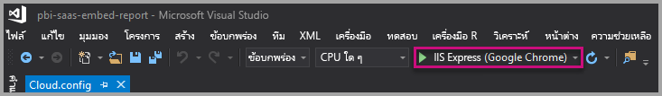
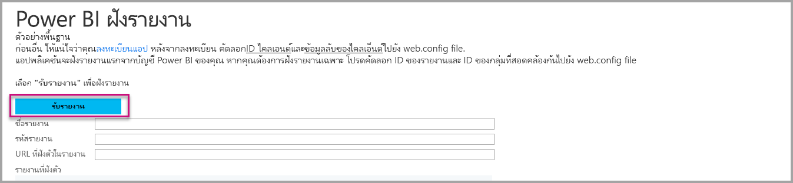

# <a name="tutorial-embed-power-bi-paginated-reports-into-an-application-for-your-organization"></a><span data-ttu-id="a1370-104">บทช่วยสอน: ฝังรายงานที่มีการแบ่งหน้าของ Power BI ในแอปพลิเคชันสำหรับองค์กรของคุณ</span><span class="sxs-lookup"><span data-stu-id="a1370-104">Tutorial: Embed Power BI paginated reports into an application for your organization</span></span>

<span data-ttu-id="a1370-105">ใน **Power BI** คุณสามารถฝังรายงานที่มีการแบ่งหน้าลงในแอปพลิเคชันสำหรับองค์กรของคุณโดยใช้สถานการณ์จำลอง *ผู้ใช้เป็นเจ้าของข้อมูล*</span><span class="sxs-lookup"><span data-stu-id="a1370-105">In **Power BI**, you can embed paginated reports into an application for your organization by using the *user owns data* scenario.</span></span>

<span data-ttu-id="a1370-106">รายงานแบบแบ่งหน้าคือรายงานที่ออกแบบมาสำหรับการพิมพ์ที่มีคุณภาพสูง</span><span class="sxs-lookup"><span data-stu-id="a1370-106">Paginated reports are reports designed for high-quality printing.</span></span> <span data-ttu-id="a1370-107">โดยทั่วไปรายงานเหล่านี้ประกอบด้วยข้อมูลจำนวนมากซึ่งแสดงในลักษณะที่ทำให้มีการพิมพ์หน้าให้พอดี</span><span class="sxs-lookup"><span data-stu-id="a1370-107">Usually these reports contain a lot of data, rendered in a way that makes it fit printed pages.</span></span>
<span data-ttu-id="a1370-108">หากต้องการทำความเข้าใจวิธีที่ Power BI รองรับรายงานที่มีการแบ่งหน้าดู [รายงานที่มีการแบ่งหน้าใน Power BI Premium คืออะไร](../../paginated-reports/paginated-reports-report-builder-power-bi.md)</span><span class="sxs-lookup"><span data-stu-id="a1370-108">To understand how Power BI supports paginated reports, see [What are paginated reports in Power BI Premium?](../../paginated-reports/paginated-reports-report-builder-power-bi.md)</span></span>

<span data-ttu-id="a1370-109">**ผู้ใช้ที่เป็นเจ้าของข้อมูล** ช่วยให้แอปพลิเคชันของคุณขยายบริการ Power BI เพื่อใช้การวิเคราะห์แบบฝังตัว</span><span class="sxs-lookup"><span data-stu-id="a1370-109">**User owns data** lets your application extend the Power BI service so it can use embedded analytics.</span></span> <span data-ttu-id="a1370-110">การสอนนี้จะแสดงวิธีวิธีการรวมรายงานที่มีการแบ่งหน้าเข้าไปในแอปพลิเคชัน</span><span class="sxs-lookup"><span data-stu-id="a1370-110">This tutorial demonstrates how to integrate a paginated report into an application.</span></span>

<span data-ttu-id="a1370-111">คุณใช้ Power BI .NET SDK กับ Power BI JavaScript API เพื่อฝัง Power BI เข้าไปในแอปพลิเคชันสำหรับองค์กรของคุณ</span><span class="sxs-lookup"><span data-stu-id="a1370-111">You use the Power BI .NET SDK with the Power BI JavaScript API to embed Power BI into an application for your organization.</span></span>


<span data-ttu-id="a1370-113">ในการสอนนี้ คุณจะได้เรียนรู้งานต่อไปนี้:</span><span class="sxs-lookup"><span data-stu-id="a1370-113">In this tutorial, you learn the following tasks:</span></span>
> [!div class="checklist"]
> * <span data-ttu-id="a1370-114">ลงทะเบียนแอปพลิเคชันใน Azure</span><span class="sxs-lookup"><span data-stu-id="a1370-114">Register an application in Azure.</span></span>
> * <span data-ttu-id="a1370-115">ฝังรายงานที่มีการแบ่งหน้า Power BI เข้าไปในแอปพลิเคชันโดยใช้ผู้เช่า Power BI ของคุณ</span><span class="sxs-lookup"><span data-stu-id="a1370-115">Embed a Power BI paginated report into an application using your Power BI tenant.</span></span>

## <a name="prerequisites"></a><span data-ttu-id="a1370-116">ข้อกำหนดเบื้องต้น</span><span class="sxs-lookup"><span data-stu-id="a1370-116">Prerequisites</span></span>
<span data-ttu-id="a1370-117">เมื่อต้องเริ่มต้นใช้งาน คุณจำเป็นต้องมี:</span><span class="sxs-lookup"><span data-stu-id="a1370-117">To get started, you're required to have:</span></span>

* <span data-ttu-id="a1370-118">[บัญชี Power BI Pro](../../admin/service-admin-purchasing-power-bi-pro.md)</span><span class="sxs-lookup"><span data-stu-id="a1370-118">A [Power BI Pro account](../../admin/service-admin-purchasing-power-bi-pro.md).</span></span>

* <span data-ttu-id="a1370-119">คุณจำเป็นต้องตั้งค่า[ผู้เช่า Azure Active Directory](create-an-azure-active-directory-tenant.md) ของคุณเอง</span><span class="sxs-lookup"><span data-stu-id="a1370-119">You need to have your own [Azure Active Directory tenant](create-an-azure-active-directory-tenant.md) setup.</span></span>

* <span data-ttu-id="a1370-120">ความจุ P1 อย่างน้อย</span><span class="sxs-lookup"><span data-stu-id="a1370-120">At least a P1 capacity.</span></span> <span data-ttu-id="a1370-121">ดู [ฉันต้องมีความจุพรีเมียมขนาดเท่าใดสำหรับรายงานแบบแบ่งหน้า](../../paginated-reports/paginated-reports-faq.md#what-size-premium-capacity-do-i-need-for-paginated-reports)</span><span class="sxs-lookup"><span data-stu-id="a1370-121">See [What size Premium capacity do I need for paginated reports?](../../paginated-reports/paginated-reports-faq.md#what-size-premium-capacity-do-i-need-for-paginated-reports)</span></span>

<span data-ttu-id="a1370-122">ถ้าคุณยังไม่ได้ลงทะเบียนสำหรับ **Power BI Pro**[ลงทะเบียนทดลองใช้ฟรี](https://powerbi.microsoft.com/pricing/)ก่อนที่คุณจะเริ่ม</span><span class="sxs-lookup"><span data-stu-id="a1370-122">If you're not signed up for **Power BI Pro**, [sign up for a free trial](https://powerbi.microsoft.com/pricing/) before you begin.</span></span>

>[!NOTE]
><span data-ttu-id="a1370-123">รองรับ [Premium Per User (PPU)](../../admin/service-premium-per-user-faq.md)</span><span class="sxs-lookup"><span data-stu-id="a1370-123">[Premium Per User (PPU)](../../admin/service-premium-per-user-faq.md) is supported.</span></span> <span data-ttu-id="a1370-124">อย่างไรก็ตามหากคุณกำลังใช้ PPU เฉพาะผู้ใช้ PPU ในองค์กรของคุณเท่านั้นที่จะสามารถเข้าถึงโซลูชันของคุณได้</span><span class="sxs-lookup"><span data-stu-id="a1370-124">However, if you're using PPU, only PPU users in your organization will be able to access your solution.</span></span>

## <a name="set-up-your-power-bi-environment"></a><span data-ttu-id="a1370-125">ตั้งค่าสภาพแวดล้อม Power BI ของคุณ</span><span class="sxs-lookup"><span data-stu-id="a1370-125">Set up your Power BI environment</span></span>

<span data-ttu-id="a1370-126">ทำตามคำแนะนำในส่วนนี้เพื่อตั้งค่า Power BI สำหรับการฝังรายงานที่มีการแบ่งหน้าของคุณ</span><span class="sxs-lookup"><span data-stu-id="a1370-126">Follow the instructions in this section to set up Power BI for embedding your paginated reports.</span></span>

### <a name="register-a-server-side-web-application-app"></a><span data-ttu-id="a1370-127">ลงทะเบียนแอปพลิเคชันเว็บฝั่งเซิร์ฟเวอร์</span><span class="sxs-lookup"><span data-stu-id="a1370-127">Register a server-side web application app</span></span>

<span data-ttu-id="a1370-128">ทำตามคำแนะนำใน [ลงทะเบียนแอปพลิเคชัน Azure AD เพื่อใช้กับ Power BI](register-app.md) ลงทะเบียนแอปพลิเคชันเว็บฝั่งเซิร์ฟเวอร์</span><span class="sxs-lookup"><span data-stu-id="a1370-128">Follow the instructions in [Register an Azure AD application to use with Power BI](register-app.md) to register a server-side web application app.</span></span>

>[!NOTE]
><span data-ttu-id="a1370-129">เมื่อลงทะเบียนแอปตรวจสอบให้แน่ใจว่าได้ทำดังต่อไปนี้:</span><span class="sxs-lookup"><span data-stu-id="a1370-129">When registering the app, make sure to do the following:</span></span>
>* <span data-ttu-id="a1370-130">รับความลับของแอปพลิเคชัน</span><span class="sxs-lookup"><span data-stu-id="a1370-130">Get the application secret</span></span>
>* <span data-ttu-id="a1370-131">ใช้สิทธิ์ **Report.ReadAll** (ขอบเขต) ไปยังแอปของคุณ</span><span class="sxs-lookup"><span data-stu-id="a1370-131">Apply the **Report.ReadAll** permissions (scope) to your app.</span></span>

### <a name="create-a-capacity"></a><span data-ttu-id="a1370-132">สร้างความจุ</span><span class="sxs-lookup"><span data-stu-id="a1370-132">Create a capacity</span></span>

<span data-ttu-id="a1370-133">เมื่อสร้างความจุ คุณสามารถใช้ประโยชน์จากการมีทรัพยากรจัดสรรไว้สำหรับเนื้อหาในพื้นที่ทำงานแอปของคุณ</span><span class="sxs-lookup"><span data-stu-id="a1370-133">By creating a capacity, you can take advantage of having a resource for the content in your app workspace.</span></span> <span data-ttu-id="a1370-134">สำหรับรายงานที่มีการแบ่งหน้า คุณต้องย้อนกลับพื้นที่ทำงานของแอปของคุณด้วยความจุ P1 อย่างน้อย</span><span class="sxs-lookup"><span data-stu-id="a1370-134">For paginated reports, you must back your app workspace with at least a P1 capacity.</span></span> <span data-ttu-id="a1370-135">คุณสามารถสร้างความจุโดยการใช้ [Power BI Premium](../../admin/service-premium-what-is.md)</span><span class="sxs-lookup"><span data-stu-id="a1370-135">You can create a capacity by using [Power BI Premium](../../admin/service-premium-what-is.md).</span></span>

<span data-ttu-id="a1370-136">ตารางต่อไปนี้แสดงรายการ Power BI Premium SKU ที่สามารถใช้เพื่อสร้างความจุสำหรับรายงานที่มีการแบ่งหน้าใน [Microsoft Office 365](../../admin/service-admin-premium-purchase.md):</span><span class="sxs-lookup"><span data-stu-id="a1370-136">The following table lists the Power BI Premium SKUs that can be used to create a capacity for paginated reports in [Microsoft Office 365](../../admin/service-admin-premium-purchase.md):</span></span>

| <span data-ttu-id="a1370-137">โหนดของความจุ</span><span class="sxs-lookup"><span data-stu-id="a1370-137">Capacity node</span></span> | <span data-ttu-id="a1370-138">vCores ทั้งหมด</span><span class="sxs-lookup"><span data-stu-id="a1370-138">Total vCores</span></span><br/><span data-ttu-id="a1370-139">(back end + front end)</span><span class="sxs-lookup"><span data-stu-id="a1370-139">(back end + front end)</span></span> | <span data-ttu-id="a1370-140">Back-end vCores</span><span class="sxs-lookup"><span data-stu-id="a1370-140">Back-end vCores</span></span> | <span data-ttu-id="a1370-141">Front-end vCores</span><span class="sxs-lookup"><span data-stu-id="a1370-141">Front-end vCores</span></span> | <span data-ttu-id="a1370-142">การจำกัดการเชื่อมต่อ DirectQuery/live</span><span class="sxs-lookup"><span data-stu-id="a1370-142">DirectQuery/live connection limits</span></span> |
| --- | --- | --- | --- | --- | --- |
| <span data-ttu-id="a1370-143">P1</span><span class="sxs-lookup"><span data-stu-id="a1370-143">P1</span></span> |<span data-ttu-id="a1370-144">8 vCores</span><span class="sxs-lookup"><span data-stu-id="a1370-144">8 vCores</span></span> |<span data-ttu-id="a1370-145">4 vCore, 25 GB ของ RAM</span><span class="sxs-lookup"><span data-stu-id="a1370-145">4 vCores, 25 GB of RAM</span></span> |<span data-ttu-id="a1370-146">4 vCores</span><span class="sxs-lookup"><span data-stu-id="a1370-146">4 vCores</span></span> |<span data-ttu-id="a1370-147">30 ต่อวินาที</span><span class="sxs-lookup"><span data-stu-id="a1370-147">30 per second</span></span> |
| <span data-ttu-id="a1370-148">P2</span><span class="sxs-lookup"><span data-stu-id="a1370-148">P2</span></span> |<span data-ttu-id="a1370-149">16 vCores</span><span class="sxs-lookup"><span data-stu-id="a1370-149">16 vCores</span></span> |<span data-ttu-id="a1370-150">8 vCores, 50 GB ของ RAM</span><span class="sxs-lookup"><span data-stu-id="a1370-150">8 vCores, 50 GB of RAM</span></span> |<span data-ttu-id="a1370-151">8 vCores</span><span class="sxs-lookup"><span data-stu-id="a1370-151">8 vCores</span></span> |<span data-ttu-id="a1370-152">60 ต่อวินาที</span><span class="sxs-lookup"><span data-stu-id="a1370-152">60 per second</span></span> |
| <span data-ttu-id="a1370-153">P3</span><span class="sxs-lookup"><span data-stu-id="a1370-153">P3</span></span> |<span data-ttu-id="a1370-154">32 vCores</span><span class="sxs-lookup"><span data-stu-id="a1370-154">32 vCores</span></span> |<span data-ttu-id="a1370-155">16 vCores, 100 GB ของ RAM</span><span class="sxs-lookup"><span data-stu-id="a1370-155">16 vCores, 100 GB of RAM</span></span> |<span data-ttu-id="a1370-156">16 vCores</span><span class="sxs-lookup"><span data-stu-id="a1370-156">16 vCores</span></span> |<span data-ttu-id="a1370-157">120 ต่อวินาที</span><span class="sxs-lookup"><span data-stu-id="a1370-157">120 per second</span></span> |
| <span data-ttu-id="a1370-158">P4</span><span class="sxs-lookup"><span data-stu-id="a1370-158">P4</span></span> |<span data-ttu-id="a1370-159">64 vCores</span><span class="sxs-lookup"><span data-stu-id="a1370-159">64 vCores</span></span> |<span data-ttu-id="a1370-160">32 vCores, 200 GB ของ RAM</span><span class="sxs-lookup"><span data-stu-id="a1370-160">32 vCores, 200 GB of RAM</span></span> |<span data-ttu-id="a1370-161">32 vCores</span><span class="sxs-lookup"><span data-stu-id="a1370-161">32 vCores</span></span> |<span data-ttu-id="a1370-162">240 ต่อวินาที</span><span class="sxs-lookup"><span data-stu-id="a1370-162">240 per second</span></span> |
| <span data-ttu-id="a1370-163">P5</span><span class="sxs-lookup"><span data-stu-id="a1370-163">P5</span></span> |<span data-ttu-id="a1370-164">128 vCores</span><span class="sxs-lookup"><span data-stu-id="a1370-164">128 vCores</span></span> |<span data-ttu-id="a1370-165">64 vCores, 400 GB ของ RAM</span><span class="sxs-lookup"><span data-stu-id="a1370-165">64 vCores, 400 GB of RAM</span></span> |<span data-ttu-id="a1370-166">64 vCores</span><span class="sxs-lookup"><span data-stu-id="a1370-166">64 vCores</span></span> |<span data-ttu-id="a1370-167">480 ต่อวินาที</span><span class="sxs-lookup"><span data-stu-id="a1370-167">480 per second</span></span> |
|||||

### <a name="enable-paginated-reports-workload"></a><span data-ttu-id="a1370-168">เปิดใช้งานเวิร์กโหลดรายงานที่มีการแบ่งหน้า</span><span class="sxs-lookup"><span data-stu-id="a1370-168">Enable paginated reports workload</span></span>

<span data-ttu-id="a1370-169">คุณจำเป็นต้องเปิดใช้งานรายงานที่มีการแบ่งหน้าบนความจุของคุณ</span><span class="sxs-lookup"><span data-stu-id="a1370-169">You need to enable the paginated report workload on your capacity.</span></span>

1. <span data-ttu-id="a1370-170">ลงชื่อเข้าใช้ [Power BI > พอร์ทัลผู้ดูแลระบบ > การตั้งค่าความจุ](https://app.powerbi.com/admin-portal/capacities)</span><span class="sxs-lookup"><span data-stu-id="a1370-170">Sign into [Power BI > Admin portal > Capacity settings](https://app.powerbi.com/admin-portal/capacities).</span></span>

2. <span data-ttu-id="a1370-171">เลือกความจุที่มีพื้นที่ทำงานที่คุณต้องการอัปโหลดรายงานที่มีการแบ่งหน้า</span><span class="sxs-lookup"><span data-stu-id="a1370-171">Select the capacity that has the workspace you want to upload the paginated report to.</span></span>

    

3. <span data-ttu-id="a1370-173">ขยาย **ปริมาณงาน**</span><span class="sxs-lookup"><span data-stu-id="a1370-173">Expand **Workloads**.</span></span>

    

4. <span data-ttu-id="a1370-175">เปิดใช้งานเวิร์กโหลดรายงานที่มีการแบ่งหน้า</span><span class="sxs-lookup"><span data-stu-id="a1370-175">Activate the paginated reports workload.</span></span>

    

### <a name="assign-an-app-workspace-to-a-capacity"></a><span data-ttu-id="a1370-177">กำหนดพื้นที่ทำงานของแอปไปยังความจุ</span><span class="sxs-lookup"><span data-stu-id="a1370-177">Assign an app workspace to a capacity</span></span>

<span data-ttu-id="a1370-178">หลังจากที่คุณสร้างความจุแล้ว คุณสามารถกำหนดพื้นที่ทำงานแอปไปยังความจุนั้นได้</span><span class="sxs-lookup"><span data-stu-id="a1370-178">After you create a capacity, you can assign your app workspace to that capacity.</span></span> <span data-ttu-id="a1370-179">สำหรับวิธีจบกระบวนการนี้ ให้ทำตามขั้นตอนต่อไปนี้:</span><span class="sxs-lookup"><span data-stu-id="a1370-179">To complete this process, follow these steps:</span></span>

1. <span data-ttu-id="a1370-180">ภายในบริการของ Power BI ให้ขยายพื้นที่ทำงานและเลือก **เพิ่มเติม** สำหรับพื้นที่ทำงานที่คุณกำลังใช้เพื่อการฝังเนื้อหา</span><span class="sxs-lookup"><span data-stu-id="a1370-180">Within the Power BI service, expand workspaces and select **More** for the workspace you're using for embedding your content.</span></span> <span data-ttu-id="a1370-181">จากนั้นเลือก **การตั้งค่าพื้นที่ทำงาน**</span><span class="sxs-lookup"><span data-stu-id="a1370-181">Then select **Workspace settings**.</span></span>

    

2. <span data-ttu-id="a1370-183">เลือก **Premium** และเปิดใช้งาน **ความจุ**</span><span class="sxs-lookup"><span data-stu-id="a1370-183">Select **Premium** and enable **Capacity**.</span></span> <span data-ttu-id="a1370-184">เลือกความจุที่คุณสร้าง</span><span class="sxs-lookup"><span data-stu-id="a1370-184">Select the capacity you created.</span></span> <span data-ttu-id="a1370-185">จากนั้นเลือก **บันทึก**</span><span class="sxs-lookup"><span data-stu-id="a1370-185">Then select **Save**.</span></span>

    

3. <span data-ttu-id="a1370-187">หลังจากเลือก **บันทึก** คุณควรจะเห็นรูปข้าวหลามตัดถัดจากชื่อพื้นที่ทำงานแอป</span><span class="sxs-lookup"><span data-stu-id="a1370-187">After you select **Save**, you should see a diamond next to the app workspace name.</span></span>

    

### <a name="create-and-publish-your-power-bi-paginated-reports"></a><span data-ttu-id="a1370-189">สร้าง และเผยแพร่รายงานที่มีการแบ่งหน้า Power BI ของคุณ</span><span class="sxs-lookup"><span data-stu-id="a1370-189">Create and publish your Power BI paginated reports</span></span>

<span data-ttu-id="a1370-190">คุณสามารถสร้างรายงานที่มีการแบ่งหน้าของคุณได้โดยใช้[ตัวสร้างรายงาน Power BI](../../paginated-reports/paginated-reports-report-builder-power-bi.md#create-reports-in-power-bi-report-builder)</span><span class="sxs-lookup"><span data-stu-id="a1370-190">You can create your paginated reports by using the [Power BI Report Builder](../../paginated-reports/paginated-reports-report-builder-power-bi.md#create-reports-in-power-bi-report-builder).</span></span> <span data-ttu-id="a1370-191">จากนั้นคุณสามารถ[อัปโหลดรายงาน](../../paginated-reports/paginated-reports-quickstart-aw.md#upload-the-report-to-the-service)ไปยังพื้นที่ทำงานของแอปที่กำหนดให้เป็นความจุ P1 อย่างน้อยและเปิด [ปริมาณงานรายงานที่มีการแบ่งหน้า](#enable-paginated-reports-workload)</span><span class="sxs-lookup"><span data-stu-id="a1370-191">Then you can [upload the report](../../paginated-reports/paginated-reports-quickstart-aw.md#upload-the-report-to-the-service) to an app workspace assigned to at least a P1 capacity, and turn on the [paginated reports workload](#enable-paginated-reports-workload).</span></span> <span data-ttu-id="a1370-192">การอัปโหลดของผู้ใช้ปลายทางจำเป็นต้องมีสิทธิ์การใช้งาน Power BI Pro เพื่อเผยแพร่ไปยังพื้นที่ทำงานแอป</span><span class="sxs-lookup"><span data-stu-id="a1370-192">The end user uploading the report must have a Power BI Pro license to publish to an app workspace.</span></span>
   
## <a name="embed-your-content-by-using-the-sample-application"></a><span data-ttu-id="a1370-193">ฝังเนื้อหาของคุณโดยการใช้แอปพลิเคชันตัวอย่าง</span><span class="sxs-lookup"><span data-stu-id="a1370-193">Embed your content by using the sample application</span></span>

<span data-ttu-id="a1370-194">ตัวอย่างนี้ถูกเก็บไว้อย่างตั้งใจเพื่อวัตถุประสงค์ในการสาธิต</span><span class="sxs-lookup"><span data-stu-id="a1370-194">This sample is deliberately kept simple for demonstration purposes.</span></span>

<span data-ttu-id="a1370-195">ทำตามขั้นตอนด้านล่างเพื่อเริ่มการฝังเนื้อหาของคุณโดยใช้แอปพลิเคชันตัวอย่าง</span><span class="sxs-lookup"><span data-stu-id="a1370-195">Follow the steps below to start embedding your content using the sample application.</span></span>

1. <span data-ttu-id="a1370-196">ดาวน์โหลด[Visual Studio](https://www.visualstudio.com/) (เวอร์ชัน 2013 หรือใหม่กว่า)</span><span class="sxs-lookup"><span data-stu-id="a1370-196">Download [Visual Studio](https://www.visualstudio.com/) (version 2013 or later).</span></span> <span data-ttu-id="a1370-197">ทำให้แน่ใจว่าได้ดาวน์โหลด[แพคเกจ NuGet](https://www.nuget.org/profiles/powerbi)ล่าสุด</span><span class="sxs-lookup"><span data-stu-id="a1370-197">Make sure to download the latest [NuGet package](https://www.nuget.org/profiles/powerbi).</span></span>

2. <span data-ttu-id="a1370-198">ดาวน์โหลด [PowerBI-Developer-Samples](https://github.com/Microsoft/PowerBI-Developer-Samples) และเปิด .NET Framework > ฝังสำหรับองค์กรของคุณ > Integration-web-app > **PBIWebApp**</span><span class="sxs-lookup"><span data-stu-id="a1370-198">Download [PowerBI-Developer-Samples](https://github.com/Microsoft/PowerBI-Developer-Samples), and open .NET Framework > Embed for your organization > integrate-web-app > **PBIWebApp**.</span></span>

    

3. <span data-ttu-id="a1370-200">เปิดไฟล์ **Cloud.config** ในแอปพลิเคชันตัวอย่างและกรอกข้อมูลในฟิลด์ต่อไปนี้เพื่อรันแอปพลิเคชันของคุณ:</span><span class="sxs-lookup"><span data-stu-id="a1370-200">Open the **Cloud.config** file in the sample application, and fill in the following fields to run your application:</span></span>
    * [<span data-ttu-id="a1370-201">รหัสแอปพลิเคชัน</span><span class="sxs-lookup"><span data-stu-id="a1370-201">Application ID</span></span>](#application-id)
    * [<span data-ttu-id="a1370-202">รหัสพื้นที่ทำงาน</span><span class="sxs-lookup"><span data-stu-id="a1370-202">Workspace ID</span></span>](#workspace-id)
    * [<span data-ttu-id="a1370-203">รหัสรายงาน</span><span class="sxs-lookup"><span data-stu-id="a1370-203">Report ID</span></span>](#report-id)
    * [<span data-ttu-id="a1370-204">AADAuthorityUrl</span><span class="sxs-lookup"><span data-stu-id="a1370-204">AADAuthorityUrl</span></span>](#aadauthorityurl)

    

### <a name="application-id"></a><span data-ttu-id="a1370-206">รหัสแอปพลิเคชัน</span><span class="sxs-lookup"><span data-stu-id="a1370-206">Application ID</span></span>

<span data-ttu-id="a1370-207">ป้อนข้อมูล **applicationId** ด้วย **ID แอปพลิเคชัน** จาก **Azure**</span><span class="sxs-lookup"><span data-stu-id="a1370-207">Fill in the **applicationId** information with the **Application ID** from **Azure**.</span></span> <span data-ttu-id="a1370-208">แอปพลิเชันจะใช้ **applicationId** เพื่อระบุตัวเองไปยังผู้ใช้จากที่คุณกำลังขอสิทธิ์</span><span class="sxs-lookup"><span data-stu-id="a1370-208">The **applicationId** is used by the application to identify itself to the users from which you're requesting permissions.</span></span>

<span data-ttu-id="a1370-209">สำหรับวิธีรับ **applicationId** ให้ทำตามขั้นตอนต่อไปนี้:</span><span class="sxs-lookup"><span data-stu-id="a1370-209">To get the **applicationId**, follow these steps:</span></span>

1. <span data-ttu-id="a1370-210">ลงชื่อเข้าใช้[พอร์ทัล Azure](https://portal.azure.com)</span><span class="sxs-lookup"><span data-stu-id="a1370-210">Sign into the [Azure portal](https://portal.azure.com).</span></span>

2. <span data-ttu-id="a1370-211">ในบานหน้าต่างนำทางซ้ายมือ เลือก **บริการทั้งหมด** และเลือก **การลงทะเบียนแอป**</span><span class="sxs-lookup"><span data-stu-id="a1370-211">In the left-hand navigation pane, select **All Services**, and select **App Registrations**.</span></span>

3. <span data-ttu-id="a1370-212">เลือกแอปพลิเคชันที่ต้องใช้ **ApplicationID**</span><span class="sxs-lookup"><span data-stu-id="a1370-212">Select the application that needs the **applicationId**.</span></span>

    

4. <span data-ttu-id="a1370-214">มี **ID แอปพลิเคชัน** ที่แสดงในรูปของ GUID</span><span class="sxs-lookup"><span data-stu-id="a1370-214">There's an **Application ID** that is listed as a GUID.</span></span> <span data-ttu-id="a1370-215">ใช้ **ID แอปพลิเคชัน** นี้เป็น **applicationId** สำหรับแอปพลิเคชัน</span><span class="sxs-lookup"><span data-stu-id="a1370-215">Use this **Application ID** as the **applicationId** for the application.</span></span>

    

### <a name="workspace-id"></a><span data-ttu-id="a1370-217">ID พื้นที่ทำงาน</span><span class="sxs-lookup"><span data-stu-id="a1370-217">Workspace ID</span></span>

<span data-ttu-id="a1370-218">กรอกข้อมูล **workspaceId** ด้วย พื้นที่ทำงานแอป (กลุ่ม) GUID จาก Power BI</span><span class="sxs-lookup"><span data-stu-id="a1370-218">Fill in the **workspaceId** information with the app workspace (group) GUID from Power BI.</span></span> <span data-ttu-id="a1370-219">คุณสามารถดูข้อมูลนี้จาก URL เมื่อลงชื่อเข้าใช้บริการ Power BI หรือโดยการใช้ Powershell</span><span class="sxs-lookup"><span data-stu-id="a1370-219">You can get this information either from the URL when signed into the Power BI service or using PowerShell.</span></span>

<span data-ttu-id="a1370-220">URL</span><span class="sxs-lookup"><span data-stu-id="a1370-220">URL</span></span> <br>


<span data-ttu-id="a1370-222">PowerShell</span><span class="sxs-lookup"><span data-stu-id="a1370-222">PowerShell</span></span> <br>

```powershell
Get-PowerBIworkspace -name "User Owns Embed Test"
```

   

### <a name="report-id"></a><span data-ttu-id="a1370-224">รหัสรายงาน</span><span class="sxs-lookup"><span data-stu-id="a1370-224">Report ID</span></span>

<span data-ttu-id="a1370-225">กรอกข้อมูล **reportId** ด้วย GUID รายงานจาก Power BI</span><span class="sxs-lookup"><span data-stu-id="a1370-225">Fill in the **reportId** information with the report GUID from Power BI.</span></span> <span data-ttu-id="a1370-226">คุณสามารถดูข้อมูลนี้จาก URL เมื่อลงชื่อเข้าใช้บริการ Power BI หรือโดยการใช้ Powershell</span><span class="sxs-lookup"><span data-stu-id="a1370-226">You can get this information either from the URL when signed into the Power BI service or using PowerShell.</span></span>


<span data-ttu-id="a1370-228">PowerShell</span><span class="sxs-lookup"><span data-stu-id="a1370-228">PowerShell</span></span> <br>

```powershell
Get-PowerBIworkspace -name "User Owns Embed Test" | Get-PowerBIReport -Name "Sales Paginated Report"
```


### <a name="aadauthorityurl"></a><span data-ttu-id="a1370-230">AADAuthorityUrl</span><span class="sxs-lookup"><span data-stu-id="a1370-230">AADAuthorityUrl</span></span>

<span data-ttu-id="a1370-231">กรอกข้อมูลใน **AADAuthorityUrl** พร้อม URL ที่อนุญาตให้คุณฝังภายในผู้เช่าองค์กรของคุณหรือฝังด้วยผู้ใช้ที่เป็นผู้เยี่ยมชม</span><span class="sxs-lookup"><span data-stu-id="a1370-231">Fill in the **AADAuthorityUrl** information with the URL that either allows you to embed within your organizational tenant or embed with a guest user.</span></span>

<span data-ttu-id="a1370-232">สำหรับการฝังกับผู้เช่าขององค์กรของคุณ กรุณาใช้ URL - *https://login.microsoftonline.com/common/oauth2/authorize*</span><span class="sxs-lookup"><span data-stu-id="a1370-232">For embedding with your organizational tenant, use the URL - *https://login.microsoftonline.com/common/oauth2/authorize*.</span></span>

<span data-ttu-id="a1370-233">สำหรับการฝังกับผู้เยี่ยมชม กรุณาใช้ URL - *`https://login.microsoftonline.com/report-owner-tenant-id`* - ที่ซึ่งคุณเพิ่มรหัสผู้เช่าของเจ้าของรายงานในการแทนที่ของ *report-owner-tenant-id*</span><span class="sxs-lookup"><span data-stu-id="a1370-233">For embedding with a guest, use the URL - *`https://login.microsoftonline.com/report-owner-tenant-id`* - where you add the tenant ID of the report owner in replacement of *report-owner-tenant-id*.</span></span>

### <a name="run-the-application"></a><span data-ttu-id="a1370-234">เรียกใช้แอปพลิเคชัน</span><span class="sxs-lookup"><span data-stu-id="a1370-234">Run the application</span></span>

1. <span data-ttu-id="a1370-235">เลือก **เรียกใช้** ใน **Visual Studio**</span><span class="sxs-lookup"><span data-stu-id="a1370-235">Select **Run** in **Visual Studio**.</span></span>

    

2. <span data-ttu-id="a1370-237">จากนั้นเลือก **Embed Report**</span><span class="sxs-lookup"><span data-stu-id="a1370-237">Then select **Embed Report**.</span></span> <span data-ttu-id="a1370-238">ขึ้นอยู่กับเนื้อหาที่คุณเลือกที่จะทดสอบ - รายงาน, แดชบอร์ด หรือไทล์ - แล้วเลือกตัวเลือกนั้นในแอปพลิเคชัน</span><span class="sxs-lookup"><span data-stu-id="a1370-238">Depending on which content you choose to test with - reports, dashboards or tiles - then select that option in the application.</span></span>

    

3. <span data-ttu-id="a1370-240">ตอนนี้ คุณสามารถดูรายงานในแอปพลิเคชันตัวอย่างได้แล้ว</span><span class="sxs-lookup"><span data-stu-id="a1370-240">Now you can view the report in the sample application.</span></span>

    

## <a name="next-steps"></a><span data-ttu-id="a1370-242">ขั้นตอนถัดไป</span><span class="sxs-lookup"><span data-stu-id="a1370-242">Next steps</span></span>

<span data-ttu-id="a1370-243">ในการสอนนี้ คุณจะได้เรียนรู้วิธีการฝังรายงานที่มีการแบ่งหน้า Power BI เข้าไปในแอปพลิเคชันโดยการใช้บัญชีองค์กร Power BI</span><span class="sxs-lookup"><span data-stu-id="a1370-243">In this tutorial, you learned how to embed Power BI paginated reports into an application by using your Power BI organization account.</span></span> 

> [!div class="nextstepaction"]
> [<span data-ttu-id="a1370-244">ฝังตัวจากแอป</span><span class="sxs-lookup"><span data-stu-id="a1370-244">Embed from apps</span></span>](./index.yml)

> [!div class="nextstepaction"]
>[<span data-ttu-id="a1370-245">ฝังเนื้อหา Power BI สำหรับลูกค้าของคุณ</span><span class="sxs-lookup"><span data-stu-id="a1370-245">Embed Power BI content for your customers</span></span>](embed-sample-for-customers.md)

> [!div class="nextstepaction"]
>[<span data-ttu-id="a1370-246">ฝังรายงานที่มีการแบ่งหน้าของ Power BI สำหรับลูกค้าของคุณ</span><span class="sxs-lookup"><span data-stu-id="a1370-246">Embed Power BI paginated reports for your customers</span></span>](embed-paginated-reports-customers.md)

<span data-ttu-id="a1370-247">หากมีข้อสงสัย [ลองถามชุมชน Power BI](http://community.powerbi.com/)</span><span class="sxs-lookup"><span data-stu-id="a1370-247">If you have more questions, [try asking the Power BI Community](http://community.powerbi.com/).</span></span>