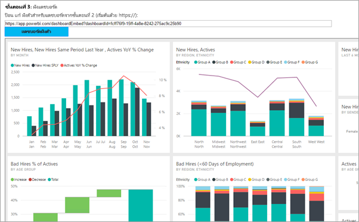
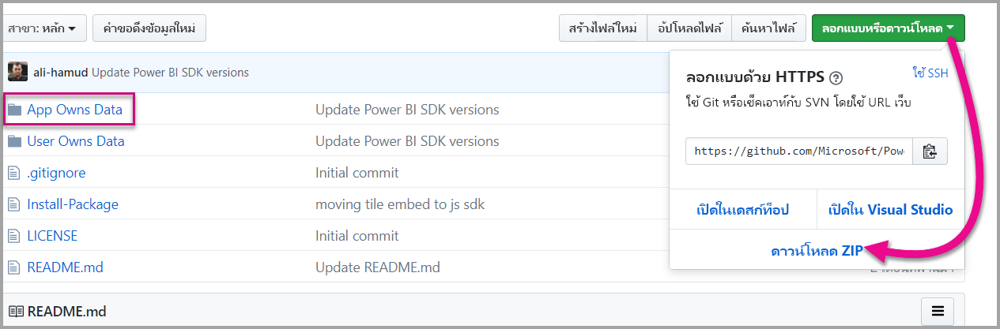

# <a name="tutorial-embed-a-power-bi-content-into-your-application-for-national-clouds"></a><span data-ttu-id="a3977-104">บทช่วยสอน: ฝังเนื้อหาของ Power BI ลงในแอปพลิเคชันสำหรับบริการคลาวด์แห่งชาติ</span><span class="sxs-lookup"><span data-stu-id="a3977-104">Tutorial: Embed a Power BI content into your application for national clouds</span></span>

<span data-ttu-id="a3977-105">เรียนรู้วิธีการฝังเนื้อหาวิเคราะห์ภายในองค์กรของคุณที่ดำเนินการสร้างแอปพลิเคชั่นสำหรับบริการคลาวด์แห่งชาติ</span><span class="sxs-lookup"><span data-stu-id="a3977-105">Learn how to embed analytical content within your business process applications for the national cloud.</span></span> <span data-ttu-id="a3977-106">คุณสามารถใช้ Power BI .NET SDK ด้วยกันกับ Power BI JavaScript API เพื่อฝังรายงาน แดชบอร์ด หรือ ไทล์ ลงในเว็บแอปพลิเคชันของคุณ</span><span class="sxs-lookup"><span data-stu-id="a3977-106">You can use the Power BI .NET SDK with the Power BI JavaScript API to embed a report, dashboard, or tile, into your web applications.</span></span>

<span data-ttu-id="a3977-107">Power BI ยังสนับสนุน[บริการคลาวด์แห่งชาติ](/azure/active-directory/develop/authentication-national-cloud)</span><span class="sxs-lookup"><span data-stu-id="a3977-107">Power BI also supports [national clouds](/azure/active-directory/develop/authentication-national-cloud).</span></span>

<span data-ttu-id="a3977-108">บริการคลาวด์แห่งชาติที่แตกต่างกันคือ:</span><span class="sxs-lookup"><span data-stu-id="a3977-108">The different national clouds are:</span></span>

* <span data-ttu-id="a3977-109">U.S. ชุมชน Cloud สำหรับรัฐบาล (GCC)</span><span class="sxs-lookup"><span data-stu-id="a3977-109">U.S. Government Community Cloud (GCC)</span></span>

* <span data-ttu-id="a3977-110">U.</span><span class="sxs-lookup"><span data-stu-id="a3977-110">U.</span></span> <span data-ttu-id="a3977-111">S.</span><span class="sxs-lookup"><span data-stu-id="a3977-111">S.</span></span> <span data-ttu-id="a3977-112">ชุมชน Cloud ระดับสูงสำหรับส่วนราชการ (GCC High):</span><span class="sxs-lookup"><span data-stu-id="a3977-112">Government Community Cloud High (GCC High)</span></span>

* <span data-ttu-id="a3977-113">U.</span><span class="sxs-lookup"><span data-stu-id="a3977-113">U.</span></span> <span data-ttu-id="a3977-114">S.</span><span class="sxs-lookup"><span data-stu-id="a3977-114">S.</span></span> <span data-ttu-id="a3977-115">ผู้รับเหมากองทัพ (DoDCON)</span><span class="sxs-lookup"><span data-stu-id="a3977-115">Military Contractors (DoDCON)</span></span>

* <span data-ttu-id="a3977-116">U.</span><span class="sxs-lookup"><span data-stu-id="a3977-116">U.</span></span> <span data-ttu-id="a3977-117">S.</span><span class="sxs-lookup"><span data-stu-id="a3977-117">S.</span></span> <span data-ttu-id="a3977-118">กองทัพ (DoD)</span><span class="sxs-lookup"><span data-stu-id="a3977-118">Military (DoD)</span></span>

* <span data-ttu-id="a3977-119">คลาวด์ Power BI สำหรับประเทศเยอรมนี</span><span class="sxs-lookup"><span data-stu-id="a3977-119">Power BI for Germany cloud</span></span>

* <span data-ttu-id="a3977-120">Power BI สำหรับคลาวด์ประเทศจีน</span><span class="sxs-lookup"><span data-stu-id="a3977-120">Power BI for China cloud</span></span>



<span data-ttu-id="a3977-122">เมื่อต้องการเริ่มต้นการฝึกปฏิบัตินี้ คุณต้องการ **บัญชี Power BI**</span><span class="sxs-lookup"><span data-stu-id="a3977-122">To get started with this walkthrough, you need a **Power BI account**.</span></span> <span data-ttu-id="a3977-123">ถ้าคุณไม่มีการตั้งค่าบัญชี คุณสามารถเลือกบริการคลาวด์สาธารณะที่เหมาะสมสำหรับคุณ ทั้งนี้ขึ้นอยู่กับชนิดของภาครัฐหรือแห่งชาติ</span><span class="sxs-lookup"><span data-stu-id="a3977-123">If you don't have an account set up, then depending on the type of government or country you can choose the right national cloud for you.</span></span> <span data-ttu-id="a3977-124">คุณสามารถ[ลงทะเบียนบัญชี Power BI สำหรับรัฐบาลสหรัฐ](../../admin/service-govus-signup.md) หรือ [บัญชี Power BI สำหรับผู้ใช้คลาวด์เยอรมนี](https://powerbi.microsoft.com/power-bi-germany/?ru=https%3A%2F%2Fapp.powerbi.de%2F%3FnoSignUpCheck%3D1) หรือ [Power BI สำหรับผู้ใช้คลาวด์ประเทศจีน](https://www.21vbluecloud.com/powerbi/)</span><span class="sxs-lookup"><span data-stu-id="a3977-124">You can sign up for a [U. S. government Power BI account](../../admin/service-govus-signup.md), a [Power BI for Germany cloud account](https://powerbi.microsoft.com/power-bi-germany/?ru=https%3A%2F%2Fapp.powerbi.de%2F%3FnoSignUpCheck%3D1) or a [Power BI for China cloud account](https://www.21vbluecloud.com/powerbi/).</span></span>

> [!NOTE]
> <span data-ttu-id="a3977-125">กำลังมองหาวิธีฝังแดชบอร์ดสำหรับองค์กรของคุณแทน</span><span class="sxs-lookup"><span data-stu-id="a3977-125">Looking to embed a dashboard for your organization instead?</span></span> <span data-ttu-id="a3977-126">ดูที่ [รวมแดชบอร์ดลงในแอปสำหรับองค์กรของคุณ](embed-sample-for-your-organization.md)</span><span class="sxs-lookup"><span data-stu-id="a3977-126">See, [Integrate a dashboard into an app for your organization](embed-sample-for-your-organization.md).</span></span>

<span data-ttu-id="a3977-127">เพื่อรวมแดชบอร์ดลงในเว็บแอป คุณใช้ **Power BI** API และ **โทเค็นการเข้าถึง** สำหรับรับรองตัวตนกับ Azure Active Directory (AD) เพื่อรับแดชบอร์ด</span><span class="sxs-lookup"><span data-stu-id="a3977-127">To integrate a dashboard into a web app, you use the **Power BI** API, and an Azure Active Directory (AD) authorization **access token** to get a dashboard.</span></span> <span data-ttu-id="a3977-128">หลังจากนั้น คุณโหลดแดชบอร์ดโดยใช้โทเค็นแบบฝังตัว</span><span class="sxs-lookup"><span data-stu-id="a3977-128">Then, you load the dashboard using an embed token.</span></span> <span data-ttu-id="a3977-129">**Power BI** API ให้การเข้าถึงทางการเขียนโปรแกรมสำหรับทรัพยากร **Power BI** เฉพาะ</span><span class="sxs-lookup"><span data-stu-id="a3977-129">The **Power BI** API provides programmatic access to specific **Power BI** resources.</span></span> <span data-ttu-id="a3977-130">สำหรับข้อมูลเพิ่มเติม โปรดดูที่ [Power BI REST API](/rest/api/power-bi/) [Power BI .NET SDK และ [Power BI JavaScript API](https://github.com/Microsoft/PowerBI-JavaScript)</span><span class="sxs-lookup"><span data-stu-id="a3977-130">For more information, see [Power BI REST API](/rest/api/power-bi/), [Power BI .NET SDK, and the [Power BI JavaScript API](https://github.com/Microsoft/PowerBI-JavaScript).</span></span>

## <a name="download-the-sample"></a><span data-ttu-id="a3977-131">ดาวน์โหลดตัวอย่าง</span><span class="sxs-lookup"><span data-stu-id="a3977-131">Download the sample</span></span>

<span data-ttu-id="a3977-132">บทความนี้แสดงรหัสที่ใช้ใน [ตัวอย่างการที่แอปเป็นเจ้าของข้อมูล](https://github.com/Microsoft/PowerBI-Developer-Samples) ใน GitHub</span><span class="sxs-lookup"><span data-stu-id="a3977-132">This article shows the code used in the [App Owns Data sample](https://github.com/Microsoft/PowerBI-Developer-Samples) on GitHub.</span></span> <span data-ttu-id="a3977-133">ถ้าต้องการทำตามการฝึกปฏิบัตินี้ คุณสามารถดาวน์โหลดตัวอย่าง</span><span class="sxs-lookup"><span data-stu-id="a3977-133">To follow along with this walkthrough, you can download the sample.</span></span> 



* <span data-ttu-id="a3977-135">ชุมชน Cloud สำหรับส่วนราชการ (GCC):</span><span class="sxs-lookup"><span data-stu-id="a3977-135">Government Community Cloud (GCC):</span></span>

    > [!NOTE]
    > <span data-ttu-id="a3977-136">การฝังเนื้อหา Power BI จากชุมชน Cloud สำหรับรัฐบาล (GCC) สามารถทำได้ด้วย Microsoft 365 SKU เท่านั้น</span><span class="sxs-lookup"><span data-stu-id="a3977-136">Embedding Power BI content from a Government Community Cloud (GCC), can only be done with a Microsoft 365 SKU.</span></span> <span data-ttu-id="a3977-137">ลูกค้าคลาวด์ระดับชาติอื่นๆ สามารถใช้ [Microsoft 365 หรือ Azure SKU](embedded-faq.md) ได้</span><span class="sxs-lookup"><span data-stu-id="a3977-137">Other national cloud customers can use [Microsoft 365 or Azure SKUs](embedded-faq.md).</span></span>

1. <span data-ttu-id="a3977-138">เขียนทับแฟ้ม Cloud.config ด้วยเนื้อหา GCCCloud.config</span><span class="sxs-lookup"><span data-stu-id="a3977-138">Overwrite Cloud.config file with GCCCloud.config content.</span></span>

2. <span data-ttu-id="a3977-139">อัปเดต applicationId (applicationId ของเนทีฟแอป), workspaceId, ผู้ใช้ (ผู้ใช้หลักของคุณ) และรหัสผ่านในไฟล์ Web.config</span><span class="sxs-lookup"><span data-stu-id="a3977-139">Update applicationId (Native app applicationId), workspaceId, the user (your master user), and password in Web.config file.</span></span>

3. <span data-ttu-id="a3977-140">เพิ่มพารามิเตอร์ GCC ในแฟ้ม web.config ดังนี้</span><span class="sxs-lookup"><span data-stu-id="a3977-140">Add the GCC parameters in the web.config file as follows.</span></span>

```xml
<add key="authorityUrl" value="https://login.microsoftonline.com/common/" />
<add key="resourceUrl" value="https://analysis.usgovcloudapi.net/powerbi/api" />
<add key="apiUrl" value="https://api.powerbigov.us/" />
<add key="embedUrlBase" value="https://app.powerbigov.us" />
```

* <span data-ttu-id="a3977-141">ผู้รับจ้างทางการทหาร (DoDCON):</span><span class="sxs-lookup"><span data-stu-id="a3977-141">Military Contractors (DoDCON):</span></span>

1. <span data-ttu-id="a3977-142">เขียนทับแฟ้ม Cloud.config ด้วยเนื้อหา TBCloud.config</span><span class="sxs-lookup"><span data-stu-id="a3977-142">Overwrite Cloud.config file with TBCloud.config content.</span></span>

2. <span data-ttu-id="a3977-143">อัปเดต applicationId (applicationId ของเนทีฟแอป), workspaceId, ผู้ใช้ (ผู้ใช้หลักของคุณ) และรหัสผ่านในไฟล์ Web.config</span><span class="sxs-lookup"><span data-stu-id="a3977-143">Update applicationId (Native app applicationId), workspaceId, the user (your master user), and password in Web.config file.</span></span>

3. <span data-ttu-id="a3977-144">เพิ่มพารามิเตอร์ DoDCON ในแฟ้ม web.config ดังนี้</span><span class="sxs-lookup"><span data-stu-id="a3977-144">Add the DoDCON parameters in the web.config file as follows.</span></span>

```xml
<add key="authorityUrl" value="https://login.microsoftonline.us/common/" />
<add key="resourceUrl" value="https://high.analysis.usgovcloudapi.net/powerbi/api" />
<add key="apiUrl" value="https://api.high.powerbigov.us/" />
<add key="embedUrlBase" value="https://app.high.powerbigov.us" />
```

* <span data-ttu-id="a3977-145">กองทัพ (DoD):</span><span class="sxs-lookup"><span data-stu-id="a3977-145">Military (DoD):</span></span>

1. <span data-ttu-id="a3977-146">เขียนทับแฟ้ม Cloud.config ด้วยเนื้อหา PFCloud.config</span><span class="sxs-lookup"><span data-stu-id="a3977-146">Overwrite Cloud.config file with PFCloud.config content.</span></span>

2. <span data-ttu-id="a3977-147">อัปเดต applicationId (applicationId ของเนทีฟแอป), workspaceId, ผู้ใช้ (ผู้ใช้หลักของคุณ) และรหัสผ่านในไฟล์ Web.config</span><span class="sxs-lookup"><span data-stu-id="a3977-147">Update applicationId (Native app applicationId), workspaceId, the user (your master user), and password in Web.config file.</span></span>

3. <span data-ttu-id="a3977-148">เพิ่มพารามิเตอร์ DoDCON ในแฟ้ม web.config ดังนี้</span><span class="sxs-lookup"><span data-stu-id="a3977-148">Add the DoDCON parameters in the web.config file as follows.</span></span>

```xml
<add key="authorityUrl" value="https://login.microsoftonline.us/common/" />
<add key="resourceUrl" value="https://mil.analysis.usgovcloudapi.net/powerbi/api" />
<add key="apiUrl" value="https://api.mil.powerbigov.us/" />
<add key="embedUrlBase" value="https://app.mil.powerbigov.us" />
```

* <span data-ttu-id="a3977-149">พารามิเตอร์ Power BI สำหรับคลาวด์ประเทศเยอรมนี</span><span class="sxs-lookup"><span data-stu-id="a3977-149">Power BI for Germany cloud parameters</span></span>

1. <span data-ttu-id="a3977-150">เขียนทับแฟ้ม Cloud.config ด้วยเนื้อหา Power BI สำหรับ cloud Germany</span><span class="sxs-lookup"><span data-stu-id="a3977-150">Overwrite Cloud.config file with Power BI for Germany cloud content.</span></span>

2. <span data-ttu-id="a3977-151">อัปเดต applicationId (applicationId ของเนทีฟแอป), workspaceId, ผู้ใช้ (ผู้ใช้หลักของคุณ) และรหัสผ่านในไฟล์ Web.config</span><span class="sxs-lookup"><span data-stu-id="a3977-151">Update applicationId (Native app applicationId), workspaceId, the user (your master user), and password in Web.config file.</span></span>

3. <span data-ttu-id="a3977-152">เพิ่มพารามิเตอร์ Power BI สำหรับคลาวด์เยอรมนีในแฟ้ม web.config ดังนี้</span><span class="sxs-lookup"><span data-stu-id="a3977-152">Add the Power BI for Germany cloud parameters in the web.config file as follows.</span></span>

```xml
<add key="authorityUrl" value="https://login.microsoftonline.de/common/" />
<add key="resourceUrl" value="https://analysis.cloudapi.de/powerbi/api" />
<add key="apiUrl" value="https://api.powerbi.de/" />
<add key="embedUrlBase" value="https://app.powerbi.de" />
```

* <span data-ttu-id="a3977-153">พารามิเตอร์ Power BI สำหรับคลาวด์ประเทศจีน</span><span class="sxs-lookup"><span data-stu-id="a3977-153">Power BI for China cloud parameters</span></span>

1. <span data-ttu-id="a3977-154">เขียนทับแฟ้ม Cloud.config ด้วย[เนื้อหา Power BI สำหรับคลาวด์ประเทศจีน](https://github.com/microsoft/PowerBI-Developer-Samples/blob/master/.NET%20Framework/Embed%20for%20your%20organization/CloudConfigs/Power%20BI%20operated%20by%2021Vianet%20in%20China/Cloud.config)</span><span class="sxs-lookup"><span data-stu-id="a3977-154">Overwrite Cloud.config file with [Power BI for China](https://github.com/microsoft/PowerBI-Developer-Samples/blob/master/.NET%20Framework/Embed%20for%20your%20organization/CloudConfigs/Power%20BI%20operated%20by%2021Vianet%20in%20China/Cloud.config) cloud content.</span></span>

2. <span data-ttu-id="a3977-155">อัปเดต applicationId (applicationId ของเนทีฟแอป), workspaceId, ผู้ใช้ (ผู้ใช้หลักของคุณ) และรหัสผ่านในไฟล์ Web.config</span><span class="sxs-lookup"><span data-stu-id="a3977-155">Update applicationId (Native app applicationId), workspaceId, the user (your master user), and password in Web.config file.</span></span>

3. <span data-ttu-id="a3977-156">เพิ่มพารามิเตอร์ Power BI สำหรับคลาวด์ประเทศจีนในแฟ้ม web.config ดังนี้</span><span class="sxs-lookup"><span data-stu-id="a3977-156">Add the Power BI for China cloud parameters in the web.config file as follows.</span></span>

```xml
<add key="authorityUrl" value="https://login.chinacloudapi.cn/common/" />
<add key="resourceUrl" value="https://analysis.chinacloudapi.cn/powerbi/api" />
<add key="apiUrl" value="https://api.powerbi.cn/" />
<add key="embedUrlBase" value="https://app.powerbi.cn" />
```

## <a name="step-1---register-an-app-in-azure-ad"></a><span data-ttu-id="a3977-157">ขั้นตอนที่ 1 - การลงทะเบียนแอปใน Azure AD</span><span class="sxs-lookup"><span data-stu-id="a3977-157">Step 1 - register an app in Azure AD</span></span>

<span data-ttu-id="a3977-158">ลงทะเบียนแอปพลิเคชันของคุณด้วย Azure AD เพื่อเรียกใช้ Rest API</span><span class="sxs-lookup"><span data-stu-id="a3977-158">Register your application with Azure AD to make REST API calls.</span></span> <span data-ttu-id="a3977-159">สำหรับข้อมูลเพิ่มเติม ดู[ลงทะเบียนแอป Azure AD เพื่อฝังเนื้อหา Power BI](register-app.md)</span><span class="sxs-lookup"><span data-stu-id="a3977-159">For more information, see [Register an Azure AD app to embed Power BI content](register-app.md).</span></span> <span data-ttu-id="a3977-160">เนื่องจากมีพันธมิตรบริการคลาวด์แห่งชาติที่แตกต่างกัน ดังนั้นจึงมี URL สำหรับลงทะเบียนแอปพลิเคชันของคุณที่แตกต่างกันออกไป</span><span class="sxs-lookup"><span data-stu-id="a3977-160">Since there are different national cloud affiliations, there are distinct URLs to register your application.</span></span>

* <span data-ttu-id="a3977-161">ชุมชน Cloud สำหรับรัฐบาล (GCC) - ```https://app.powerbigov.us/apps```</span><span class="sxs-lookup"><span data-stu-id="a3977-161">Government Community Cloud (GCC) - ```https://app.powerbigov.us/apps```</span></span>

* <span data-ttu-id="a3977-162">ผู้รับเหมากองทัพ (DoDCON) - ```https://app.high.powerbigov.us/apps```</span><span class="sxs-lookup"><span data-stu-id="a3977-162">Military Contractors (DoDCON) - ```https://app.high.powerbigov.us/apps```</span></span>

* <span data-ttu-id="a3977-163">กองทัพ (DoD) - ```https://app.mil.powerbigov.us/apps```</span><span class="sxs-lookup"><span data-stu-id="a3977-163">Military (DoD) - ```https://app.mil.powerbigov.us/apps```</span></span>

* <span data-ttu-id="a3977-164">Power BI สำหรับคลาวด์ประเทศเยอรมน - ี ```https://app.powerbi.de/apps```</span><span class="sxs-lookup"><span data-stu-id="a3977-164">Power BI for Germany cloud - ```https://app.powerbi.de/apps```</span></span>

* <span data-ttu-id="a3977-165">Power BI สำหรับคลาวด์ประเทศจีน - ```https://app.powerbi.cn/apps```</span><span class="sxs-lookup"><span data-stu-id="a3977-165">Power BI for China cloud - ```https://app.powerbi.cn/apps```</span></span>

<span data-ttu-id="a3977-166">ถ้าคุณได้ดาวน์โหลด [ตัวอย่างการฝังสำหรับลูกค้าของคุณ](https://github.com/microsoft/PowerBI-Developer-Samples/tree/master/.NET%20Core/Embed%20for%20your%20customers/AppOwnsData)ไว้ คุณจะได้ใช้ **applicationID** ที่คุณได้รับมา เพื่อให้ตัวอย่างสามารถยืนยันตัวตนกับ Azure AD ได้</span><span class="sxs-lookup"><span data-stu-id="a3977-166">If you downloaded the [Embedding for your customer sample](https://github.com/microsoft/PowerBI-Developer-Samples/tree/master/.NET%20Core/Embed%20for%20your%20customers/AppOwnsData), you would use the **applicationId** you get, so that the sample can authenticate to Azure AD.</span></span> <span data-ttu-id="a3977-167">ในการกำหนดค่าตัวอย่าง ให้เปลี่ยน **applicationId** ในไฟล์ *web.config*</span><span class="sxs-lookup"><span data-stu-id="a3977-167">To configure the sample, change the **applicationId** in the *web.config* file.</span></span>

## <a name="step-2---get-an-access-token-from-azure-ad"></a><span data-ttu-id="a3977-168">ขั้นตอนที่ 2 - รับโทเค็นเพื่อเข้า จาก Azure AD</span><span class="sxs-lookup"><span data-stu-id="a3977-168">Step 2 - get an access token from Azure AD</span></span>

<span data-ttu-id="a3977-169">ภายในแอปพลิเคชันของคุณ คุณจะต้องรับ **โทเค็นการเข้าถึง** จาก Azure AD ก่อนที่คุณสามารถเรียกใช้ Power BI REST API ได้</span><span class="sxs-lookup"><span data-stu-id="a3977-169">Within your application, you need to get an **access token**, from Azure AD, before you can make calls to the Power BI REST API.</span></span> <span data-ttu-id="a3977-170">สำหรับข้อมูลเพิ่มเติม ให้ดู[การรับรองตัวตนผู้ใช้และรับโทเค็นการเข้า Azure AD สำหรับแอป Power BI ของคุณ](get-azuread-access-token.md)</span><span class="sxs-lookup"><span data-stu-id="a3977-170">For more information, see [Authenticate users and get an Azure AD access token for your Power BI app](get-azuread-access-token.md).</span></span> <span data-ttu-id="a3977-171">เนื่องจากมีพันธมิตรบริการคลาวด์แห่งชาติที่แตกต่างกัน ดังนั้นจึงมี URL เพื่อเพื่อรับโทเค็นการเข้าถึงแอปพลิเคชันของคุณที่แตกต่างกันออกไป</span><span class="sxs-lookup"><span data-stu-id="a3977-171">Since there are different national cloud affiliations, there are distinct URLs to get an access token for your application.</span></span>

* <span data-ttu-id="a3977-172">ชุมชน Cloud สำหรับรัฐบาล (GCC) - ```https://login.microsoftonline.com```</span><span class="sxs-lookup"><span data-stu-id="a3977-172">Government Community Cloud (GCC) - ```https://login.microsoftonline.com```</span></span>

* <span data-ttu-id="a3977-173">ผู้รับเหมากองทัพ (DoDCON) - ```https://login.microsoftonline.us```</span><span class="sxs-lookup"><span data-stu-id="a3977-173">Military Contractors (DoDCON) - ```https://login.microsoftonline.us```</span></span>

* <span data-ttu-id="a3977-174">กองทัพ (DoD) - ```https://login.microsoftonline.us```</span><span class="sxs-lookup"><span data-stu-id="a3977-174">Military (DoD) - ```https://login.microsoftonline.us```</span></span>

* <span data-ttu-id="a3977-175">Power BI สำหรับคลาวด์ประเทศเยอรมน - ี ```https://login.microsoftonline.de```</span><span class="sxs-lookup"><span data-stu-id="a3977-175">Power BI for Germany cloud - ```https://login.microsoftonline.de```</span></span>

* <span data-ttu-id="a3977-176">Power BI สำหรับคลาวด์ประเทศจีน - ```https://login.chinacloudapi.cn```</span><span class="sxs-lookup"><span data-stu-id="a3977-176">Power BI for China cloud - ```https://login.chinacloudapi.cn```</span></span>

<span data-ttu-id="a3977-177">คุณสามารถดูตัวอย่างโทเค็นการเข้าใช้ในรายการเนื้อหาแต่ละงานได้ในไฟล์ **Controllers\HomeController.cs**</span><span class="sxs-lookup"><span data-stu-id="a3977-177">You can see examples of these access tokens within each content item task in the **Controllers\HomeController.cs** file.</span></span>

## <a name="step-3---get-a-content-item"></a><span data-ttu-id="a3977-178">ขั้นตอนที่ 3 รับเนื้อหา</span><span class="sxs-lookup"><span data-stu-id="a3977-178">Step 3 - get a content item</span></span>

<span data-ttu-id="a3977-179">เมื่อต้องฝังเนื้อหา Power BI ของคุณ คุณจะจำเป็นต้องทำสิ่งสองสิ่งนี้ให้แน่ใจว่า การฝังตัวนั้นถูกต้อง</span><span class="sxs-lookup"><span data-stu-id="a3977-179">To embed your Power BI content, you need to do a couple of things to make sure it embeds correctly.</span></span> <span data-ttu-id="a3977-180">ถึงแม้ว่าขั้นตอนเหล่านี้สามารถทำได้ใน REST API โดยตรง แอปพลิเคชันตัวอย่าง และตัวอย่างนี้จะใช้ .NET SDK</span><span class="sxs-lookup"><span data-stu-id="a3977-180">While all of these steps can be done with the REST API directly, the sample application and the examples here use the .NET SDK.</span></span>

### <a name="create-the-power-bi-client-with-your-access-token"></a><span data-ttu-id="a3977-181">สร้างไคลเอ็นต์ Power BI ด้วยโทเค็นการเข้าของคุณ</span><span class="sxs-lookup"><span data-stu-id="a3977-181">Create the Power BI Client with your access token</span></span>

<span data-ttu-id="a3977-182">ด้วยโทเค็นการเข้าใช้ของคุณ คุณสามารถสร้างวัตถุไคลเอ็นต์ Power BI ซึ่งทำให้คุณสามารถโต้ตอบกับ Power BI API ได้</span><span class="sxs-lookup"><span data-stu-id="a3977-182">With your access token, you want to create your Power BI client object, which allows you to interact with the Power BI APIs.</span></span> <span data-ttu-id="a3977-183">คุณสร้างวัตถุไคลเอ็นต์ Power BI ของคุณได้โดยการคลุม AccessToken ด้วยวัตถุ *Microsoft.Rest.TokenCredentials*</span><span class="sxs-lookup"><span data-stu-id="a3977-183">You create your Power BI client object by wrapping the AccessToken with a *Microsoft.Rest.TokenCredentials* object.</span></span>

```csharp
using Microsoft.IdentityModel.Clients.ActiveDirectory;
using Microsoft.Rest;
using Microsoft.PowerBI.Api.V2;

var tokenCredentials = new TokenCredentials(authenticationResult.AccessToken, "Bearer");

// Create a Power BI Client object. This is used to call the Power BI APIs.
using (var client = new PowerBIClient(new Uri(ApiUrl), tokenCredentials))
{
    // Your code to embed items.
}
```

### <a name="get-the-content-item-you-want-to-embed"></a><span data-ttu-id="a3977-184">รับเนื้อหาที่คุณต้องการฝังตัว</span><span class="sxs-lookup"><span data-stu-id="a3977-184">Get the content item you want to embed</span></span>

<span data-ttu-id="a3977-185">คุณใช้วัตถุไคลเอ็นต์ Power BI เพื่อดึงเอาตัวอ้างอิงไปยังเนื้อหา ที่คุณต้องการฝังตัว</span><span class="sxs-lookup"><span data-stu-id="a3977-185">Use the Power BI client object to retrieve a reference to the item you want to embed.</span></span> <span data-ttu-id="a3977-186">คุณสามารถฝังแดชบอร์ด ไทล์ หรือรายงานได้</span><span class="sxs-lookup"><span data-stu-id="a3977-186">You can embed dashboards, tiles, or reports.</span></span> <span data-ttu-id="a3977-187">นี่คือตัวอย่างของวิธีการเรียกแดชบอร์ด ไทล์ หรือรายงานตัวแรกจากพื้นที่ทำงานที่ให้ไว้</span><span class="sxs-lookup"><span data-stu-id="a3977-187">Here is an example of how to retrieve the first dashboard, tile, or report from a given workspace.</span></span>

<span data-ttu-id="a3977-188">มีตัวอย่างอยู่ใน **Controllers\HomeController.cs** ของ [ตัวอย่างการที่แอปเป็นเจ้าของข้อมูล](https://github.com/microsoft/PowerBI-Developer-Samples/tree/master/.NET%20Core/Embed%20for%20your%20customers/AppOwnsData)</span><span class="sxs-lookup"><span data-stu-id="a3977-188">A sample is available within **Controllers\HomeController.cs** of the [App Owns Data sample](https://github.com/microsoft/PowerBI-Developer-Samples/tree/master/.NET%20Core/Embed%20for%20your%20customers/AppOwnsData).</span></span>

#### <a name="reports"></a><span data-ttu-id="a3977-189">รายงาน</span><span class="sxs-lookup"><span data-stu-id="a3977-189">Reports</span></span>

```csharp
using Microsoft.PowerBI.Api.V2;
using Microsoft.PowerBI.Api.V2.Models;

// You need to provide the workspaceId where the dashboard resides.
ODataResponseListReport reports = client.Reports.GetReportsInGroupAsync(workspaceId);

// Get the first report in the group.
Report report = reports.Value.FirstOrDefault();
```

#### <a name="dashboards"></a><span data-ttu-id="a3977-190">แดชบอร์ด</span><span class="sxs-lookup"><span data-stu-id="a3977-190">Dashboards</span></span>

```csharp
using Microsoft.PowerBI.Api.V2;
using Microsoft.PowerBI.Api.V2.Models;

// You need to provide the workspaceId where the dashboard resides.
ODataResponseListDashboard dashboards = client.Dashboards.GetDashboardsInGroup(workspaceId);

// Get the first report in the group.
Dashboard dashboard = dashboards.Value.FirstOrDefault();
```

#### <a name="tiles"></a><span data-ttu-id="a3977-191">ไทล์</span><span class="sxs-lookup"><span data-stu-id="a3977-191">Tiles</span></span>

```csharp
using Microsoft.PowerBI.Api.V2;
using Microsoft.PowerBI.Api.V2.Models;

// To retrieve the tile, you first need to retrieve the dashboard.

// You need to provide the workspaceId where the dashboard resides.
ODataResponseListDashboard dashboards = client.Dashboards.GetDashboardsInGroup(workspaceId);

// Get the first report in the group.
Dashboard dashboard = dashboards.Value.FirstOrDefault();

// Get a list of tiles from a specific dashboard
ODataResponseListTile tiles = client.Dashboards.GetTilesInGroup(workspaceId, dashboard.Id);

// Get the first tile in the group.
Tile tile = tiles.Value.FirstOrDefault();
```

### <a name="create-the-embed-token"></a><span data-ttu-id="a3977-192">สร้างโทเค็นแบบฝังตัว</span><span class="sxs-lookup"><span data-stu-id="a3977-192">Create the embed token</span></span>

<span data-ttu-id="a3977-193">คุณสามารถสร้างโทเค็นการฝังได้โดยใช้ JavaScript API</span><span class="sxs-lookup"><span data-stu-id="a3977-193">Using the JavaScript API, you can generate an embed token.</span></span> <span data-ttu-id="a3977-194">โทเค็นแบบฝังตัวจะเป็นแบบเฉพาะเจาะจงกับรายการที่คุณจะฝัง</span><span class="sxs-lookup"><span data-stu-id="a3977-194">The embed token is specific to the item you're embedding.</span></span> <span data-ttu-id="a3977-195">ซึ่งหมายความว่า ทุกครั้งที่คุณต้องการฝังเนื้อหาของ Power BI ชิ้นหนึ่ง คุณต้องสร้างโทเค็นแบบฝังตัวใหม่ขึ้นมา</span><span class="sxs-lookup"><span data-stu-id="a3977-195">Anytime you embed a piece of Power BI content, you need to create a new embed token for it.</span></span> <span data-ttu-id="a3977-196">สำหรับข้อมูลเพิ่มเติม รวมไปถึง **accessLevel** ที่จะใช้ ดู [โทเค็นที่ฝัง](/rest/api/power-bi/embedtoken)</span><span class="sxs-lookup"><span data-stu-id="a3977-196">For more information, including which **accessLevel** to use, see [Embed Token](/rest/api/power-bi/embedtoken).</span></span>

> [!IMPORTANT]
> <span data-ttu-id="a3977-197">เนื่องจากโทเค็นแบบฝังตัวมีไว้สำหรับการทดสอบของนักพัฒนาเท่านั้น จำนวนโทเค็นแบบฝังตัวที่บัญชีหลักของ Power BI สร้างได้ มีได้จำกัด</span><span class="sxs-lookup"><span data-stu-id="a3977-197">Because embed tokens are intended for developer testing only, the number of embed tokens a Power BI master account can generate is limited.</span></span> <span data-ttu-id="a3977-198">[ต้องซื้อความจุ](./embedded-faq.md#technical) สำหรับสถานการณ์ที่มีการฝังในโปรดักชั่น</span><span class="sxs-lookup"><span data-stu-id="a3977-198">A [capacity must be purchased](./embedded-faq.md#technical) for production embedding scenarios.</span></span> <span data-ttu-id="a3977-199">ไม่จำกัดจำนวนโทเค็นแบบฝังตัวที่สร้างเมื่อซื้อความจุแล้ว</span><span class="sxs-lookup"><span data-stu-id="a3977-199">There is no limit to embed token generation when a capacity is purchased.</span></span>

<span data-ttu-id="a3977-200">มีตัวอย่างอยู่ใน **Controllers\HomeController.cs** ของ [ตัวอย่างการฝังสำหรับองค์กรของคุณ](https://github.com/microsoft/PowerBI-Developer-Samples/tree/master/.NET%20Core/Embed%20for%20your%20customers/AppOwnsData)</span><span class="sxs-lookup"><span data-stu-id="a3977-200">A sample is available within **Controllers\HomeController.cs** of the [Embedding for your organization sample](https://github.com/microsoft/PowerBI-Developer-Samples/tree/master/.NET%20Core/Embed%20for%20your%20customers/AppOwnsData).</span></span>

<span data-ttu-id="a3977-201">คลาสถูกสร้างให้สำหรับ **EmbedConfig** และ **TileEmbedConfig**</span><span class="sxs-lookup"><span data-stu-id="a3977-201">A class is created for **EmbedConfig** and **TileEmbedConfig**.</span></span> <span data-ttu-id="a3977-202">มีตัวอย่างอยู่ใน **Models\EmbedConfig.cs** และ **Models\TileEmbedConfig.cs**</span><span class="sxs-lookup"><span data-stu-id="a3977-202">A sample is available within **Models\EmbedConfig.cs** and **Models\TileEmbedConfig.cs**.</span></span>

#### <a name="reports"></a><span data-ttu-id="a3977-203">รายงาน</span><span class="sxs-lookup"><span data-stu-id="a3977-203">Reports</span></span>

```csharp
using Microsoft.PowerBI.Api.V2;
using Microsoft.PowerBI.Api.V2.Models;

// Generate Embed Token.
var generateTokenRequestParameters = new GenerateTokenRequest(accessLevel: "view");
EmbedToken tokenResponse = client.Reports.GenerateTokenInGroup(workspaceId, report.Id, generateTokenRequestParameters);

// Generate Embed Configuration.
var embedConfig = new EmbedConfig()
{
    EmbedToken = tokenResponse,
    EmbedUrl = report.EmbedUrl,
    Id = report.Id
};
```

#### <a name="dashboards"></a><span data-ttu-id="a3977-204">แดชบอร์ด</span><span class="sxs-lookup"><span data-stu-id="a3977-204">Dashboards</span></span>

```csharp
using Microsoft.PowerBI.Api.V2;
using Microsoft.PowerBI.Api.V2.Models;

// Generate Embed Token.
var generateTokenRequestParameters = new GenerateTokenRequest(accessLevel: "view");
EmbedToken tokenResponse = client.Dashboards.GenerateTokenInGroup(workspaceId, dashboard.Id, generateTokenRequestParameters);

// Generate Embed Configuration.
var embedConfig = new EmbedConfig()
{
    EmbedToken = tokenResponse,
    EmbedUrl = dashboard.EmbedUrl,
    Id = dashboard.Id
};
```

#### <a name="tiles"></a><span data-ttu-id="a3977-205">ไทล์</span><span class="sxs-lookup"><span data-stu-id="a3977-205">Tiles</span></span>

```csharp
using Microsoft.PowerBI.Api.V2;
using Microsoft.PowerBI.Api.V2.Models;

// Generate Embed Token for a tile.
var generateTokenRequestParameters = new GenerateTokenRequest(accessLevel: "view");
EmbedToken tokenResponse = client.Tiles.GenerateTokenInGroup(workspaceId, dashboard.Id, tile.Id, generateTokenRequestParameters);

// Generate Embed Configuration.
var embedConfig = new TileEmbedConfig()
{
    EmbedToken = tokenResponse,
    EmbedUrl = tile.EmbedUrl,
    Id = tile.Id,
    dashboardId = dashboard.Id
};
```

## <a name="step-4---load-an-item-using-javascript"></a><span data-ttu-id="a3977-206">ขั้นตอนที่ 4 - โหลดเนื้อหาโดยใช้ JavaScript</span><span class="sxs-lookup"><span data-stu-id="a3977-206">Step 4 - load an item using JavaScript</span></span>

<span data-ttu-id="a3977-207">คุณสามารถใช้ JavaScript เพื่อโหลดแดชบอร์ดลงใน องค์ประกอบ div บนเว็บเพจของคุณ</span><span class="sxs-lookup"><span data-stu-id="a3977-207">You can use JavaScript to load a dashboard into a div element on your web page.</span></span> <span data-ttu-id="a3977-208">ตัวอย่างนี้ใช้รูปแบบ EmbedConfig/TileEmbedConfig พร้อมกับมุมมองสำหรับแดชบอร์ด ไทล์ หรือรายงาน</span><span class="sxs-lookup"><span data-stu-id="a3977-208">The sample uses an EmbedConfig/TileEmbedConfig model along with views for a dashboard, tile, or report.</span></span> <span data-ttu-id="a3977-209">สำหรับตัวอย่างแบบเต็มของการใช้ JavaScript API คุณสามารถใช้ [ตัวอย่างแบบฝังตัวของ Microsoft Power BI](https://microsoft.github.io/PowerBI-JavaScript/demo)</span><span class="sxs-lookup"><span data-stu-id="a3977-209">For a full sample of using the JavaScript API, you can use the [Microsoft Power BI Embedded Sample](https://microsoft.github.io/PowerBI-JavaScript/demo).</span></span>

<span data-ttu-id="a3977-210">ตัวอย่างแอปพลิเคชันพร้อมใช้งานภายใน [การฝังสำหรับตัวอย่างองค์กรของคุณ](https://github.com/microsoft/PowerBI-Developer-Samples/tree/master/.NET%20Core/Embed%20for%20your%20customers/AppOwnsData)</span><span class="sxs-lookup"><span data-stu-id="a3977-210">An application sample is available within the [Embedding for your organization sample](https://github.com/microsoft/PowerBI-Developer-Samples/tree/master/.NET%20Core/Embed%20for%20your%20customers/AppOwnsData).</span></span>

### <a name="viewshomeembeddashboardcshtml"></a><span data-ttu-id="a3977-211">Views\Home\EmbedDashboard.cshtml</span><span class="sxs-lookup"><span data-stu-id="a3977-211">Views\Home\EmbedDashboard.cshtml</span></span>

```csharp
<script src="~/scripts/powerbi.js"></script>
<div id="dashboardContainer"></div>
<script>
    // Read embed application token from Model
    var accessToken = "@Model.EmbedToken.Token";

    // Read embed URL from Model
    var embedUrl = "@Html.Raw(Model.EmbedUrl)";

    // Read dashboard Id from Model
    var embedDashboardId = "@Model.Id";

    // Get models. models contains enums that can be used.
    var models = window['powerbi-client'].models;

    // Embed configuration used to describe the what and how to embed.
    // This object is used when calling powerbi.embed.
    // This also includes settings and options such as filters.
    // You can find more information at https://github.com/Microsoft/PowerBI-JavaScript/wiki/Embed-Configuration-Details.
    var config = {
        type: 'dashboard',
        tokenType: models.TokenType.Embed,
        accessToken: accessToken,
        embedUrl: embedUrl,
        id: embedDashboardId
    };

    // Get a reference to the embedded dashboard HTML element
    var dashboardContainer = $('#dashboardContainer')[0];

    // Embed the dashboard and display it within the div container.
    var dashboard = powerbi.embed(dashboardContainer, config);
</script>
```

### <a name="viewshomeembedtilecshtml"></a><span data-ttu-id="a3977-212">Views\Home\EmbedTile.cshtml</span><span class="sxs-lookup"><span data-stu-id="a3977-212">Views\Home\EmbedTile.cshtml</span></span>

```csharp
<script src="~/scripts/powerbi.js"></script>
<div id="tileContainer"></div>
<script>
    // Read embed application token from Model
    var accessToken = "@Model.EmbedToken.Token";

    // Read embed URL from Model
    var embedUrl = "@Html.Raw(Model.EmbedUrl)";

    // Read tile Id from Model
    var embedTileId = "@Model.Id";

    // Read dashboard Id from Model
    var embedDashboardId = "@Model.dashboardId";

    // Get models. models contains enums that can be used.
    var models = window['powerbi-client'].models;

    // Embed configuration used to describe the what and how to embed.
    // This object is used when calling powerbi.embed.
    // This also includes settings and options such as filters.
    // You can find more information at https://github.com/Microsoft/PowerBI-JavaScript/wiki/Embed-Configuration-Details.
    var config = {
        type: 'tile',
        tokenType: models.TokenType.Embed,
        accessToken: accessToken,
        embedUrl: embedUrl,
        id: embedTileId,
        dashboardId: embedDashboardId
    };

    // Get a reference to the embedded tile HTML element
    var tileContainer = $('#tileContainer')[0];

    // Embed the tile and display it within the div container.
    var tile = powerbi.embed(tileContainer, config);
</script>
```

### <a name="viewshomeembedreportcshtml"></a><span data-ttu-id="a3977-213">Views\Home\EmbedReport.cshtml</span><span class="sxs-lookup"><span data-stu-id="a3977-213">Views\Home\EmbedReport.cshtml</span></span>

```csharp
<script src="~/scripts/powerbi.js"></script>
<div id="reportContainer"></div>
<script>
    // Read embed application token from Model
    var accessToken = "@Model.EmbedToken.Token";

    // Read embed URL from Model
    var embedUrl = "@Html.Raw(Model.EmbedUrl)";

    // Read report Id from Model
    var embedReportId = "@Model.Id";

    // Get models. models contains enums that can be used.
    var models = window['powerbi-client'].models;

    // Embed configuration used to describe the what and how to embed.
    // This object is used when calling powerbi.embed.
    // This also includes settings and options such as filters.
    // You can find more information at https://github.com/Microsoft/PowerBI-JavaScript/wiki/Embed-Configuration-Details.
    var config = {
        type: 'report',
        tokenType: models.TokenType.Embed,
        accessToken: accessToken,
        embedUrl: embedUrl,
        id: embedReportId,
        permissions: models.Permissions.All,
        settings: {
            filterPaneEnabled: true,
            navContentPaneEnabled: true
        }
    };

    // Get a reference to the embedded report HTML element
    var reportContainer = $('#reportContainer')[0];

    // Embed the report and display it within the div container.
    var report = powerbi.embed(reportContainer, config);
</script>
```

## <a name="next-steps"></a><span data-ttu-id="a3977-214">ขั้นตอนถัดไป</span><span class="sxs-lookup"><span data-stu-id="a3977-214">Next steps</span></span>

* <span data-ttu-id="a3977-215">มีตัวอย่างแอปพลิเคชันบน GitHub ให้คุณได้ศึกษา</span><span class="sxs-lookup"><span data-stu-id="a3977-215">A sample application is available on GitHub for you to review.</span></span> <span data-ttu-id="a3977-216">ตัวอย่างต่างๆ ข้างบนมาจากตัวอย่างนั้น</span><span class="sxs-lookup"><span data-stu-id="a3977-216">The above examples are based on that sample.</span></span> <span data-ttu-id="a3977-217">สำหรับข้อมูลเพิ่มเติม ให้ดูการ[ฝังตัวเพื่อตัวอย่างขององค์กรของคุณ](https://github.com/microsoft/PowerBI-Developer-Samples/tree/master/.NET%20Core/Embed%20for%20your%20customers/AppOwnsData)</span><span class="sxs-lookup"><span data-stu-id="a3977-217">For more information, see [Embedding for your organization sample](https://github.com/microsoft/PowerBI-Developer-Samples/tree/master/.NET%20Core/Embed%20for%20your%20customers/AppOwnsData).</span></span>

* <span data-ttu-id="a3977-218">สำหรับข้อมูลเพิ่มเติมเกี่ยวกับ JavaScript API โปรดดูที่ [Power BI JavaScript API](https://github.com/Microsoft/PowerBI-JavaScript)</span><span class="sxs-lookup"><span data-stu-id="a3977-218">For more information about JavaScript API, reference [Power BI JavaScript API](https://github.com/Microsoft/PowerBI-JavaScript).</span></span>

* <span data-ttu-id="a3977-219">สำหรับข้อมูลเพิ่มเติมเกี่ยวกับ Power BI ของคลาวด์ประเทศเยอรมนี โปรดดูที่ [คำถามที่พบบ่อยเกี่ยวกับ Power BI ](../../admin/service-govde-faq.md)สำหรับคลาวด์ประเทศเยอรมนี</span><span class="sxs-lookup"><span data-stu-id="a3977-219">For more information about for Power BI for Germany cloud, reference [Power BI for Germany cloud FAQ](../../admin/service-govde-faq.md)</span></span>

* [<span data-ttu-id="a3977-220">วิธีการย้ายเนื้อหาจาก Power BI Workspace Collection ไปยัง Power BI</span><span class="sxs-lookup"><span data-stu-id="a3977-220">How to migrate Power BI Workspace Collection Workspace Collection content to Power BI</span></span>](migrate-from-powerbi-embedded.md)

<span data-ttu-id="a3977-221">ข้อควรพิจารณาและข้อจำกัด</span><span class="sxs-lookup"><span data-stu-id="a3977-221">Considerations and limitations</span></span>

<span data-ttu-id="a3977-222">มีคำถามเพิ่มเติมหรือไม่</span><span class="sxs-lookup"><span data-stu-id="a3977-222">More questions?</span></span> [<span data-ttu-id="a3977-223">ลองถามชุมชน Power BI</span><span class="sxs-lookup"><span data-stu-id="a3977-223">Try asking the Power BI Community</span></span>](https://community.powerbi.com/)
