# <a name="tutorial-embed-power-bi-content-into-an-application-for-your-organization"></a><span data-ttu-id="1e384-104">บทช่วยสอน: ฝังเนื้อหา Power BI ลงในแอปพลิเคชันสำหรับองค์กรของคุณ</span><span class="sxs-lookup"><span data-stu-id="1e384-104">Tutorial: Embed Power BI content into an application for your organization</span></span>

<span data-ttu-id="1e384-105">ใน **Power BI** คุณสามารถฝังรายงาน (Power BI หรือรายงานที่มีการแบ่งหน้า) แดชบอร์ด หรือไทล์เข้าไปในแอปพลิเคชันโดยการใช้ผู้ใช้ที่เป็นเจ้าของข้อมูล</span><span class="sxs-lookup"><span data-stu-id="1e384-105">In **Power BI**, you can embed reports (Power BI or Paginated), dashboards, or tiles into an application by using user owns data.</span></span> <span data-ttu-id="1e384-106">**ผู้ใช้ที่เป็นเจ้าของข้อมูล** ช่วยให้แอปพลิเคชันของคุณขยายบริการ Power BI เพื่อใช้การวิเคราะห์แบบฝังตัว</span><span class="sxs-lookup"><span data-stu-id="1e384-106">**User owns data** lets your application extend the Power BI service so it can use embedded analytics.</span></span> <span data-ttu-id="1e384-107">บทช่วยสอนนี้จะแสดงวิธีการรวมรายงาน (Power BI หรือรายงานที่มีการแบ่งหน้า) เข้าไปในแอปพลิเคชัน</span><span class="sxs-lookup"><span data-stu-id="1e384-107">This tutorial demonstrates how to integrate a report (Power BI or Paginated) into an application.</span></span> <span data-ttu-id="1e384-108">คุณใช้ Power BI .NET SDK กับ Power BI JavaScript API เพื่อฝัง Power BI เข้าไปในแอปพลิเคชันสำหรับองค์กรของคุณ</span><span class="sxs-lookup"><span data-stu-id="1e384-108">You use the Power BI .NET SDK with the Power BI JavaScript API to embed Power BI into an application for your organization.</span></span>

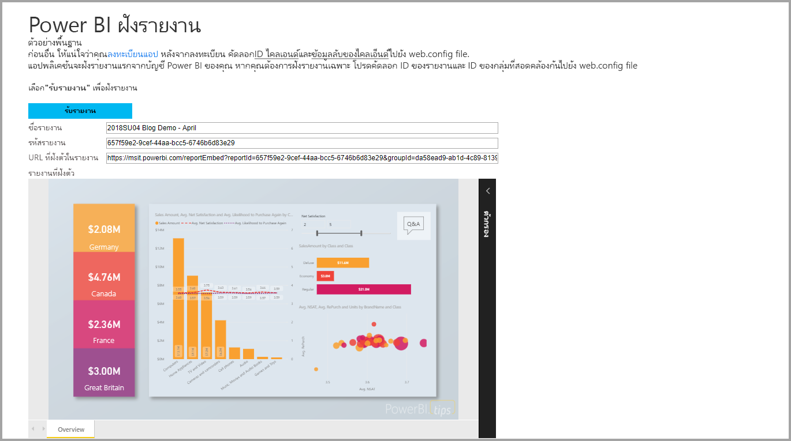

<span data-ttu-id="1e384-110">ในการสอนนี้ คุณจะได้เรียนรู้งานต่อไปนี้:</span><span class="sxs-lookup"><span data-stu-id="1e384-110">In this tutorial, you learn the following tasks:</span></span>
> [!div class="checklist"]
> * <span data-ttu-id="1e384-111">ลงทะเบียนแอปพลิเคชันใน Azure</span><span class="sxs-lookup"><span data-stu-id="1e384-111">Register an application in Azure.</span></span>
> * <span data-ttu-id="1e384-112">ฝังรายงาน Power BI หรือรายงานที่มีการแบ่งหน้าเข้าไปในแอปพลิเคชันโดยใช้ผู้เช่า Power BI ของคุณ</span><span class="sxs-lookup"><span data-stu-id="1e384-112">Embed a Power BI or Paginated report into an application using your Power BI tenant.</span></span>

## <a name="prerequisites"></a><span data-ttu-id="1e384-113">ข้อกำหนดเบื้องต้น</span><span class="sxs-lookup"><span data-stu-id="1e384-113">Prerequisites</span></span>

<span data-ttu-id="1e384-114">เมื่อต้องเริ่มต้นใช้งาน คุณจำเป็นต้องมี:</span><span class="sxs-lookup"><span data-stu-id="1e384-114">To get started, you're required to have:</span></span>

* <span data-ttu-id="1e384-115">[บัญชี Power BI Pro](../../fundamentals/service-self-service-signup-for-power-bi.md)</span><span class="sxs-lookup"><span data-stu-id="1e384-115">A [Power BI Pro account](../../fundamentals/service-self-service-signup-for-power-bi.md).</span></span>
* <span data-ttu-id="1e384-116">การสมัครใช้งาน [Microsoft Azure](https://azure.microsoft.com/)</span><span class="sxs-lookup"><span data-stu-id="1e384-116">A [Microsoft Azure](https://azure.microsoft.com/) subscription.</span></span>
* <span data-ttu-id="1e384-117">คุณจำเป็นต้องตั้งค่า[ผู้เช่า Azure Active Directory](create-an-azure-active-directory-tenant.md) ของคุณเอง</span><span class="sxs-lookup"><span data-stu-id="1e384-117">You need to have your own [Azure Active Directory tenant](create-an-azure-active-directory-tenant.md) setup.</span></span>
* <span data-ttu-id="1e384-118">สำหรับการฝังรายงานที่มีการแบ่งหน้า คุณจำเป็นต้องมีความจุอย่างน้อย P1 [โปรดดูว่าขนาดความจุพรีเมียมใดที่จำเป็นสำหรับรายงานที่มีการแบ่งหน้าของฉัน](../../paginated-reports/paginated-reports-faq.md#what-size-premium-capacity-do-i-need-for-paginated-reports)</span><span class="sxs-lookup"><span data-stu-id="1e384-118">For embedding paginated reports you need at least a P1 capacity [See What size Premium capacity do I need for paginated reports?](../../paginated-reports/paginated-reports-faq.md#what-size-premium-capacity-do-i-need-for-paginated-reports)</span></span>

<span data-ttu-id="1e384-119">ถ้าคุณยังไม่ได้ลงทะเบียนสำหรับ **Power BI Pro**[ลงทะเบียนทดลองใช้ฟรี](https://powerbi.microsoft.com/pricing/)ก่อนที่คุณจะเริ่ม</span><span class="sxs-lookup"><span data-stu-id="1e384-119">If you're not signed up for **Power BI Pro**, [sign up for a free trial](https://powerbi.microsoft.com/pricing/) before you begin.</span></span>

<span data-ttu-id="1e384-120">ถ้าคุณยังไม่มีการสมัครใช้งาน Azure สร้าง[บัญชีฟรี](https://azure.microsoft.com/free/?WT.mc_id=A261C142F)ก่อนที่คุณจะเริ่ม</span><span class="sxs-lookup"><span data-stu-id="1e384-120">If you don't have an Azure subscription, create a [free account](https://azure.microsoft.com/free/?WT.mc_id=A261C142F) before you begin.</span></span>

>[!NOTE]
><span data-ttu-id="1e384-121">รองรับ [Premium Per User (PPU)](../../admin/service-premium-per-user-faq.md)</span><span class="sxs-lookup"><span data-stu-id="1e384-121">[Premium Per User (PPU)](../../admin/service-premium-per-user-faq.md) is supported.</span></span> <span data-ttu-id="1e384-122">อย่างไรก็ตามหากคุณกำลังใช้ PPU เฉพาะผู้ใช้ PPU ในองค์กรของคุณเท่านั้นที่จะสามารถเข้าถึงโซลูชันของคุณได้</span><span class="sxs-lookup"><span data-stu-id="1e384-122">However, if you're using PPU, only PPU users in your organization will be able to access your solution.</span></span>

## <a name="set-up-your-embedded-analytics-development-environment"></a><span data-ttu-id="1e384-123">ตั้งค่าสภาพแวดล้อมการพัฒนาการวิเคราะห์แบบฝังตัวของคุณ</span><span class="sxs-lookup"><span data-stu-id="1e384-123">Set up your embedded analytics development environment</span></span>

<span data-ttu-id="1e384-124">ก่อนที่คุณจะเริ่มฝังรายการ, แดชบอร์ด หรือไทล์ลงในแอปพลิเคชันของคุณ คุณจำเป็นต้องตรวจสอบให้แน่ใจว่าสภาพแวดล้อมเอื้ออำนวยต่อการฝังด้วย Power BI</span><span class="sxs-lookup"><span data-stu-id="1e384-124">Before you start embedding reports, dashboard, or tiles into your application, you need to make sure your environment allows for embedding with Power BI.</span></span>

<span data-ttu-id="1e384-125">คุณสามารถเข้าถึง [เครื่องมือตั้งค่าการฝังตัว](https://app.powerbi.com/embedsetup) เพื่อให้คุณสามารถเริ่มต้นใช้งาน และดาวน์โหลดแอปพลิเคชันตัวอย่างที่ช่วยแนะนำคุณไปตามขั้นตอนการสร้างสภาพแวดล้อม และการฝังรายงานได้</span><span class="sxs-lookup"><span data-stu-id="1e384-125">You can go through the [Embedding setup tool](https://app.powerbi.com/embedsetup), so you can quickly get started and download a sample application that helps you walk through creating an environment and embedding a report.</span></span> <span data-ttu-id="1e384-126">ในกรณีของการฝังรายงานที่มีการแบ่งหน้า คุณจำเป็นต้องกำหนดความจุ P1 ให้กับพื้นที่ทำงานที่สร้างขึ้นเป็นอย่างน้อย</span><span class="sxs-lookup"><span data-stu-id="1e384-126">In the case of embedding a paginated report you need to assign at least a P1 capacity to the created workspace.</span></span>

<span data-ttu-id="1e384-127">แต่หากคุณเลือกที่จะตั้งค่าสภาพแวดล้อมด้วยตนเอง คุณสามารถดำเนินต่อตามด้านล่าง</span><span class="sxs-lookup"><span data-stu-id="1e384-127">If you choose to set up the environment manually, you can continue below.</span></span>

### <a name="register-an-application-in-azure-active-directory"></a><span data-ttu-id="1e384-128">ลงทะเบียนแอปพลิเคชันใน Azure Active Directory</span><span class="sxs-lookup"><span data-stu-id="1e384-128">Register an application in Azure Active Directory</span></span>

<span data-ttu-id="1e384-129">[ลงทะเบียนแอปพลิเคชัน](register-app.md)กับ Azure Active Directory เพื่ออนุญาตให้เข้าถึงแอปพลิเคชัน[Power BI REST ](/rest/api/power-bi/)</span><span class="sxs-lookup"><span data-stu-id="1e384-129">[Register your application](register-app.md) with Azure Active Directory to allow your application access to the [Power BI REST APIs](/rest/api/power-bi/).</span></span> <span data-ttu-id="1e384-130">การลงทะเบียนแอปพลิเคชันจะทำให้คุณสร้างอัตลักษณ์แอปพลิเคชันของคุณและระบุสิทธิ์ไปยังทรัพยากร Power BI REST</span><span class="sxs-lookup"><span data-stu-id="1e384-130">Registering your application allows you to establish an identity for your application and specify permissions to Power BI REST resources.</span></span>

>[!NOTE]
><span data-ttu-id="1e384-131">ในแอปพลิเคชันของคุณเอง คุณจะต้องไปที่ *การรับรองความถูกต้อง* และในเขตข้อมูล *URI เปลี่ยนเส้นทาง* ให้ใส่ที่อยู่สำหรับเปลี่ยนเส้นทาง</span><span class="sxs-lookup"><span data-stu-id="1e384-131">In your own application you'll need to navigate to *Authentication* and in the *Redirect URIs* field, insert the redirect address.</span></span>
<span data-ttu-id="1e384-132">หากต้องการเรียนรู้เพิ่มเติมเกี่ยวกับการเปลี่ยนเส้นทาง ให้ดู[ข้อจำกัดและขีดจำกัดของ URI เปลี่ยนเส้นทาง (URL ตอบกลับ)](/azure/active-directory/develop/reply-url)</span><span class="sxs-lookup"><span data-stu-id="1e384-132">To learn more about redirecting, see [Redirect URI (reply URL) restrictions and limitations](/azure/active-directory/develop/reply-url).</span></span>

## <a name="set-up-your-power-bi-environment"></a><span data-ttu-id="1e384-133">ตั้งค่าสภาพแวดล้อม Power BI ของคุณ</span><span class="sxs-lookup"><span data-stu-id="1e384-133">Set up your Power BI environment</span></span>

### <a name="create-a-workspace"></a><span data-ttu-id="1e384-134">สร้างพื้นที่ทำงาน</span><span class="sxs-lookup"><span data-stu-id="1e384-134">Create a workspace</span></span>

<span data-ttu-id="1e384-135">หากคุณกำลังฝังรายงาน, แดชบอร์ด หรือไทล์สำหรับลูกค้า คุณต้องวางเนื้อหาลงในพื้นที่ทำงาน</span><span class="sxs-lookup"><span data-stu-id="1e384-135">If you're embedding reports, dashboards, or tiles for your customers, then you have to place your content within a workspace.</span></span> <span data-ttu-id="1e384-136">พื้นที่ทำงานมีหลายประเภทที่คุณสามารถตั้งค่า: [พื้นที่ทำงานแบบดั้งเดิม](../../collaborate-share/service-create-workspaces.md)หรือ[พื้นที่ทำงานใหม่](../../collaborate-share/service-create-the-new-workspaces.md)</span><span class="sxs-lookup"><span data-stu-id="1e384-136">There are different types of workspaces that you can set up: the [traditional workspaces](../../collaborate-share/service-create-workspaces.md) or the [new workspaces](../../collaborate-share/service-create-the-new-workspaces.md).</span></span>

### <a name="create-and-publish-your-power-bi-reports"></a><span data-ttu-id="1e384-137">สร้าง และเผยแพร่รายงาน Power BI ของคุณ</span><span class="sxs-lookup"><span data-stu-id="1e384-137">Create and publish your Power BI reports</span></span>

<span data-ttu-id="1e384-138">คุณสามารถสร้างรายงานและชุดข้อมูลโดยการใช้ Power BI Desktop</span><span class="sxs-lookup"><span data-stu-id="1e384-138">You can create your reports and datasets by using Power BI Desktop.</span></span> <span data-ttu-id="1e384-139">จากนั้นคุณสามารถเผยแพร่รายงานเหล่านั้นไปยังพื้นที่ทำงาน</span><span class="sxs-lookup"><span data-stu-id="1e384-139">Then you can publish those reports to a workspace.</span></span> <span data-ttu-id="1e384-140">ผู้ใช้ปลายทางที่เผยแพร่รายงานจำเป็นต้องมีสิทธิ์การใช้งาน Power BI Pro เพื่อเผยแพร่ไปยังพื้นที่ทำงาน</span><span class="sxs-lookup"><span data-stu-id="1e384-140">The end user publishing the reports needs to have a Power BI Pro license to publish to a workspace.</span></span>

1. <span data-ttu-id="1e384-141">ดาวน์โหลดตัวอย่าง [การสาธิต](https://github.com/Microsoft/powerbi-desktop-samples) จาก GitHub</span><span class="sxs-lookup"><span data-stu-id="1e384-141">Download the sample [Demo](https://github.com/Microsoft/powerbi-desktop-samples) from GitHub.</span></span>

    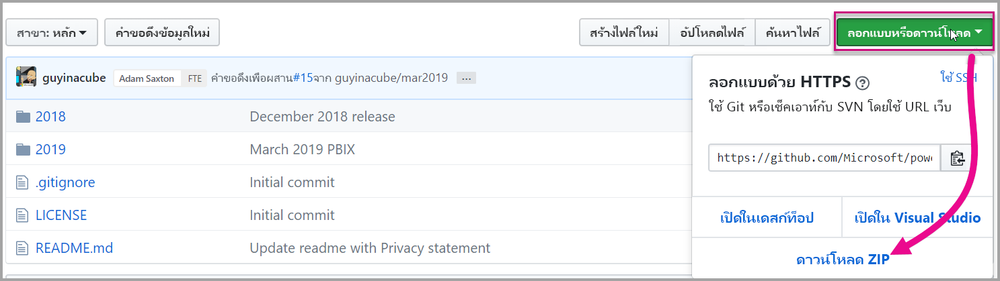

2. <span data-ttu-id="1e384-143">เปิดรายงานตัวอย่าง .pbix ใน Power BI Desktop</span><span class="sxs-lookup"><span data-stu-id="1e384-143">Open the sample .pbix report in Power BI Desktop.</span></span>

   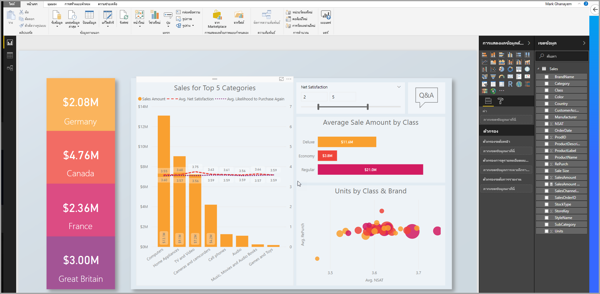

3. <span data-ttu-id="1e384-145">เผยแพร่ไปยังพื้นที่ทำงาน</span><span class="sxs-lookup"><span data-stu-id="1e384-145">Publish to the workspace.</span></span>

   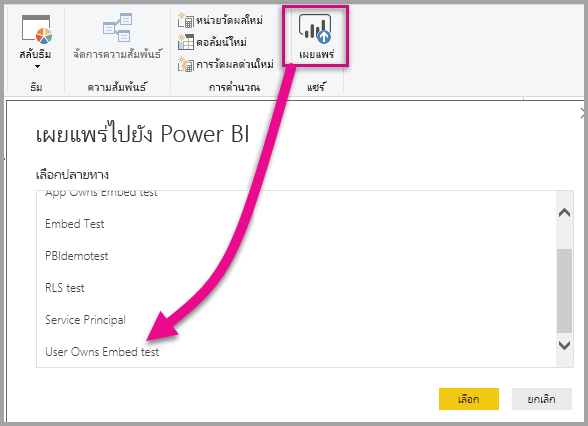

    <span data-ttu-id="1e384-147">ในตอนนี้ คุณสามารถดูรายงานในบริการของ Power BI แบบออนไลน์</span><span class="sxs-lookup"><span data-stu-id="1e384-147">Now you can view the report in the Power BI service online.</span></span>

   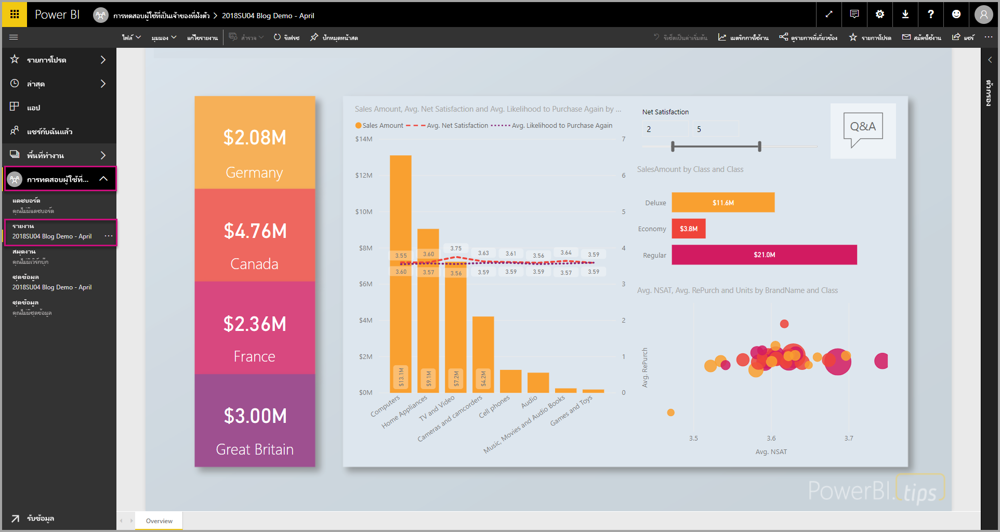
   
### <a name="create-and-publish-your-paginated-reports"></a><span data-ttu-id="1e384-149">สร้าง และเผยแพร่รายงานที่มีการแบ่งหน้าของคุณ</span><span class="sxs-lookup"><span data-stu-id="1e384-149">Create and publish your paginated reports</span></span>

<span data-ttu-id="1e384-150">คุณสามารถสร้างรายงานที่มีการแบ่งหน้าของคุณได้โดยใช้[ตัวสร้างรายงาน Power BI](../../paginated-reports/paginated-reports-report-builder-power-bi.md#create-reports-in-power-bi-report-builder)</span><span class="sxs-lookup"><span data-stu-id="1e384-150">You can create your paginated reports by using [Power BI Report Builder](../../paginated-reports/paginated-reports-report-builder-power-bi.md#create-reports-in-power-bi-report-builder).</span></span> <span data-ttu-id="1e384-151">จากนั้นคุณสามารถ[อัปโหลดรายงาน](../../paginated-reports/paginated-reports-quickstart-aw.md#upload-the-report-to-the-service)ไปยังพื้นที่ทำงานที่กำหนดให้เป็นความจุ P1 อย่างน้อย</span><span class="sxs-lookup"><span data-stu-id="1e384-151">Then you can [upload the report](../../paginated-reports/paginated-reports-quickstart-aw.md#upload-the-report-to-the-service) to a workspace assigned to at least a P1 capacity.</span></span> <span data-ttu-id="1e384-152">ผู้ใช้ปลายทางที่อัปโหลดรายงานจำเป็นต้องมีสิทธิ์การใช้งาน Power BI Pro เพื่อเผยแพร่ไปยังพื้นที่ทำงาน</span><span class="sxs-lookup"><span data-stu-id="1e384-152">The end-user uploading the report must have a Power BI Pro license to publish to a workspace.</span></span>
   
## <a name="embed-your-content-by-using-the-sample-application"></a><span data-ttu-id="1e384-153">ฝังเนื้อหาของคุณโดยการใช้แอปพลิเคชันตัวอย่าง</span><span class="sxs-lookup"><span data-stu-id="1e384-153">Embed your content by using the sample application</span></span>

<span data-ttu-id="1e384-154">ตัวอย่างนี้ถูกเก็บไว้อย่างตั้งใจเพื่อวัตถุประสงค์ในการสาธิต</span><span class="sxs-lookup"><span data-stu-id="1e384-154">This sample is deliberately kept simple for demonstration purposes.</span></span>

<span data-ttu-id="1e384-155">ทำตามขั้นตอนด้านล่างเพื่อเริ่มการฝังเนื้อหาของคุณโดยใช้แอปพลิเคชันตัวอย่าง</span><span class="sxs-lookup"><span data-stu-id="1e384-155">Follow the steps below to start embedding your content using the sample application.</span></span>

1. <span data-ttu-id="1e384-156">ดาวน์โหลด[Visual Studio](https://www.visualstudio.com/) (เวอร์ชัน 2013 หรือใหม่กว่า)</span><span class="sxs-lookup"><span data-stu-id="1e384-156">Download [Visual Studio](https://www.visualstudio.com/) (version 2013 or later).</span></span> <span data-ttu-id="1e384-157">ทำให้แน่ใจว่าได้ดาวน์โหลด[แพคเกจ NuGet](https://www.nuget.org/profiles/powerbi)ล่าสุด</span><span class="sxs-lookup"><span data-stu-id="1e384-157">Make sure to download the latest [NuGet package](https://www.nuget.org/profiles/powerbi).</span></span>

2. <span data-ttu-id="1e384-158">ดาวน์โหลด [ตัวอย่างผู้ใช้ที่เป็นเจ้าของข้อมูล](https://github.com/Microsoft/PowerBI-Developer-Samples) จาก GitHub เพื่อเริ่มต้นใช้งาน</span><span class="sxs-lookup"><span data-stu-id="1e384-158">Download the [User Owns Data sample](https://github.com/Microsoft/PowerBI-Developer-Samples) from GitHub to get started.</span></span>

    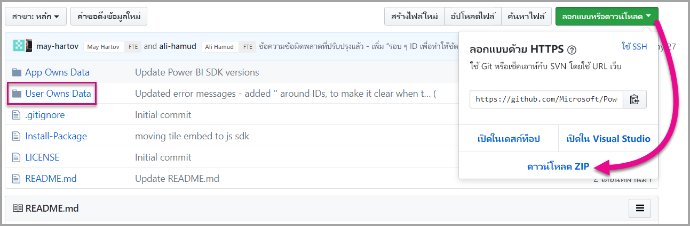

3. <span data-ttu-id="1e384-160">เปิดไฟล์ **Cloud.config** ในแอปพลิเคชันตัวอย่าง</span><span class="sxs-lookup"><span data-stu-id="1e384-160">Open the **Cloud.config** file in the sample application.</span></span>

    <span data-ttu-id="1e384-161">มีเขตข้อมูลที่คุณต้องกรอกข้อมูลเพื่อเรียกใช้แอปพลิเคชันให้สำเร็จ</span><span class="sxs-lookup"><span data-stu-id="1e384-161">There are fields you need to fill in to run the application.</span></span>

    | <span data-ttu-id="1e384-162">เขตข้อมูล</span><span class="sxs-lookup"><span data-stu-id="1e384-162">Field</span></span> |
    |--------------------|
    | <span data-ttu-id="1e384-163">**[รหัสแอปพลิเคชัน](#application-id)**</span><span class="sxs-lookup"><span data-stu-id="1e384-163">**[Application ID](#application-id)**</span></span> |
    | <span data-ttu-id="1e384-164">**[รหัสพื้นที่ทำงาน](#workspace-id)**</span><span class="sxs-lookup"><span data-stu-id="1e384-164">**[Workspace ID](#workspace-id)**</span></span> |
    | <span data-ttu-id="1e384-165">**[รหัสรายงาน](#report-id)**</span><span class="sxs-lookup"><span data-stu-id="1e384-165">**[Report ID](#report-id)**</span></span> |
    | <span data-ttu-id="1e384-166">**[AADAuthorityUrl](#aadauthorityurl)**</span><span class="sxs-lookup"><span data-stu-id="1e384-166">**[AADAuthorityUrl](#aadauthorityurl)**</span></span> |

    

### <a name="application-id"></a><span data-ttu-id="1e384-168">รหัสแอปพลิเคชัน</span><span class="sxs-lookup"><span data-stu-id="1e384-168">Application ID</span></span>

<span data-ttu-id="1e384-169">ป้อนข้อมูล **applicationId** ด้วย **ID แอปพลิเคชัน** จาก **Azure**</span><span class="sxs-lookup"><span data-stu-id="1e384-169">Fill in the **applicationId** information with the **Application ID** from **Azure**.</span></span> <span data-ttu-id="1e384-170">แอปพลิเชันจะใช้ **applicationId** เพื่อระบุตัวเองไปยังผู้ใช้จากที่คุณกำลังขอสิทธิ์</span><span class="sxs-lookup"><span data-stu-id="1e384-170">The **applicationId** is used by the application to identify itself to the users from which you're requesting permissions.</span></span>

<span data-ttu-id="1e384-171">สำหรับวิธีรับ **applicationId** ให้ทำตามขั้นตอนต่อไปนี้:</span><span class="sxs-lookup"><span data-stu-id="1e384-171">To get the **applicationId**, follow these steps:</span></span>

1. <span data-ttu-id="1e384-172">ลงชื่อเข้าใช้[พอร์ทัล Azure](https://portal.azure.com)</span><span class="sxs-lookup"><span data-stu-id="1e384-172">Sign into the [Azure portal](https://portal.azure.com).</span></span>

2. <span data-ttu-id="1e384-173">ในบานหน้าต่างนำทางซ้ายมือ เลือก **บริการทั้งหมด** และเลือก **การลงทะเบียนแอป**</span><span class="sxs-lookup"><span data-stu-id="1e384-173">In the left-hand nav pane, select **All Services**, and select **App Registrations**.</span></span>

3. <span data-ttu-id="1e384-174">เลือกแอปพลิเคชันที่ต้องใช้ **ApplicationID**</span><span class="sxs-lookup"><span data-stu-id="1e384-174">Select the application that needs the **applicationId**.</span></span>

    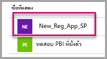

4. <span data-ttu-id="1e384-176">มี **ID แอปพลิเคชัน** ที่แสดงในรูปของ GUID</span><span class="sxs-lookup"><span data-stu-id="1e384-176">There's an **Application ID** that is listed as a GUID.</span></span> <span data-ttu-id="1e384-177">ใช้ **ID แอปพลิเคชัน** นี้เป็น **applicationId** สำหรับแอปพลิเคชัน</span><span class="sxs-lookup"><span data-stu-id="1e384-177">Use this **Application ID** as the **applicationId** for the application.</span></span>

    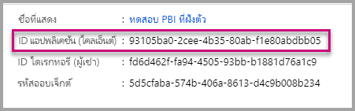

### <a name="workspace-id"></a><span data-ttu-id="1e384-179">ID พื้นที่ทำงาน</span><span class="sxs-lookup"><span data-stu-id="1e384-179">Workspace ID</span></span>

<span data-ttu-id="1e384-180">กรอกข้อมูล **workspaceId** ด้วย GUID พื้นที่ทำงาน (กลุ่ม) จาก Power BI</span><span class="sxs-lookup"><span data-stu-id="1e384-180">Fill in the **workspaceId** information with the workspace (group) GUID from Power BI.</span></span> <span data-ttu-id="1e384-181">คุณสามารถดูข้อมูลนี้จาก URL เมื่อลงชื่อเข้าใช้บริการ Power BI หรือโดยการใช้ Powershell</span><span class="sxs-lookup"><span data-stu-id="1e384-181">You can get this information either from the URL when signed into the Power BI service or using PowerShell.</span></span>

<span data-ttu-id="1e384-182">URL</span><span class="sxs-lookup"><span data-stu-id="1e384-182">URL</span></span> <br>


<span data-ttu-id="1e384-184">PowerShell</span><span class="sxs-lookup"><span data-stu-id="1e384-184">PowerShell</span></span> <br>

```powershell
Get-PowerBIworkspace -name "User Owns Embed Test"
```

   

### <a name="report-id"></a><span data-ttu-id="1e384-186">รหัสรายงาน</span><span class="sxs-lookup"><span data-stu-id="1e384-186">Report ID</span></span>

<span data-ttu-id="1e384-187">กรอกข้อมูล **reportId** ด้วย GUID รายงานจาก Power BI</span><span class="sxs-lookup"><span data-stu-id="1e384-187">Fill in the **reportId** information with the report GUID from Power BI.</span></span> <span data-ttu-id="1e384-188">คุณสามารถดูข้อมูลนี้จาก URL เมื่อลงชื่อเข้าใช้บริการ Power BI หรือโดยการใช้ Powershell</span><span class="sxs-lookup"><span data-stu-id="1e384-188">You can get this information either from the URL when signed into the Power BI service or using PowerShell.</span></span>

<span data-ttu-id="1e384-189">URL รายงาน Power BI</span><span class="sxs-lookup"><span data-stu-id="1e384-189">Power BI Report URL</span></span> <br>


<span data-ttu-id="1e384-191">URL รายงานที่มีการแบ่งหน้า</span><span class="sxs-lookup"><span data-stu-id="1e384-191">Paginated Report URL</span></span><br>


<span data-ttu-id="1e384-193">PowerShell</span><span class="sxs-lookup"><span data-stu-id="1e384-193">PowerShell</span></span> <br>

```powershell
Get-PowerBIworkspace -name "User Owns Embed Test" | Get-PowerBIReport
```


### <a name="aadauthorityurl"></a><span data-ttu-id="1e384-195">AADAuthorityUrl</span><span class="sxs-lookup"><span data-stu-id="1e384-195">AADAuthorityUrl</span></span>

<span data-ttu-id="1e384-196">กรอกข้อมูลใน **AADAuthorityUrl** พร้อม URL ที่อนุญาตให้คุณฝังภายในผู้เช่าองค์กรของคุณหรือฝังด้วยผู้ใช้ที่เป็นผู้เยี่ยมชม</span><span class="sxs-lookup"><span data-stu-id="1e384-196">Fill in the **AADAuthorityUrl** information with the URL that either allows you to embed within your organizational tenant or embed with a guest user.</span></span>

<span data-ttu-id="1e384-197">สำหรับการฝังกับผู้เช่าขององค์กรของคุณ กรุณาใช้ URL - *https://login.microsoftonline.com/common/oauth2/authorize*</span><span class="sxs-lookup"><span data-stu-id="1e384-197">For embedding with your organizational tenant, use the URL - *https://login.microsoftonline.com/common/oauth2/authorize*.</span></span>

<span data-ttu-id="1e384-198">สำหรับการฝังกับผู้เยี่ยมชม กรุณาใช้ URL - `https://login.microsoftonline.com/report-owner-tenant-id` - ที่ซึ่งคุณเพิ่มรหัสผู้เช่าของเจ้าของรายงานในการแทนที่ของ *report-owner-tenant-id*</span><span class="sxs-lookup"><span data-stu-id="1e384-198">For embedding with a guest, use the URL - `https://login.microsoftonline.com/report-owner-tenant-id` - where you add the tenant ID of the report owner in replacement of *report-owner-tenant-id*.</span></span>

### <a name="run-the-application"></a><span data-ttu-id="1e384-199">เรียกใช้แอปพลิเคชัน</span><span class="sxs-lookup"><span data-stu-id="1e384-199">Run the application</span></span>

1. <span data-ttu-id="1e384-200">เลือก **เรียกใช้** ใน **Visual Studio**</span><span class="sxs-lookup"><span data-stu-id="1e384-200">Select **Run** in **Visual Studio**.</span></span>

    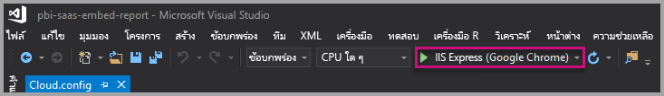

2. <span data-ttu-id="1e384-202">จากนั้นเลือก **Embed Report**</span><span class="sxs-lookup"><span data-stu-id="1e384-202">Then select **Embed Report**.</span></span> <span data-ttu-id="1e384-203">ขึ้นอยู่กับเนื้อหาที่คุณเลือกที่จะทดสอบ - รายงาน, แดชบอร์ด หรือไทล์ - แล้วเลือกตัวเลือกนั้นในแอปพลิเคชัน</span><span class="sxs-lookup"><span data-stu-id="1e384-203">Depending on which content you choose to test with - reports, dashboards or tiles - then select that option in the application.</span></span>

    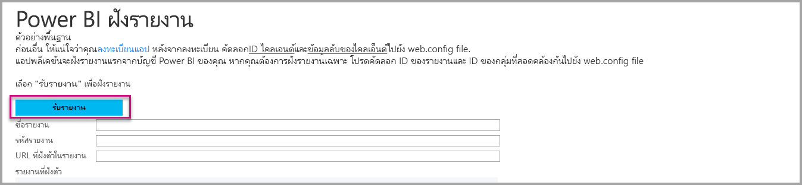

3. <span data-ttu-id="1e384-205">ตอนนี้ คุณสามารถดูรายงานในแอปพลิเคชันตัวอย่างได้แล้ว</span><span class="sxs-lookup"><span data-stu-id="1e384-205">Now you can view the report in the sample application.</span></span>

    

## <a name="embed-your-content-within-your-application"></a><span data-ttu-id="1e384-207">ฝังเนื้อหาของคุณภายในแอปพลิเคชันของคุณ</span><span class="sxs-lookup"><span data-stu-id="1e384-207">Embed your content within your application</span></span>

<span data-ttu-id="1e384-208">แม้ว่าขั้นตอนในการฝังเนื้อหาของคุณอาจทำได้ด้วย [Power BI REST APIs](/rest/api/power-bi/) แต่ตัวอย่างรหัสที่อธิบายในบทความนี้ถูกสร้างด้วย .NET SDK</span><span class="sxs-lookup"><span data-stu-id="1e384-208">Even though the steps to embed your content can be done with the [Power BI REST APIs](/rest/api/power-bi/), the example codes described in this article are made with the .NET SDK.</span></span>

<span data-ttu-id="1e384-209">วิธีรวมรายงานเข้าไปในเว็บแอป ให้ใช้ Power BI REST API หรือ Power BI C# SDK</span><span class="sxs-lookup"><span data-stu-id="1e384-209">To integrate a report into a web app, you use the Power BI REST API or the Power BI C# SDK.</span></span> <span data-ttu-id="1e384-210">และใช้โทเค็นการเข้าถึงคำอนุญาต Azure Active Directory เพื่อรับรายงาน</span><span class="sxs-lookup"><span data-stu-id="1e384-210">You also use an Azure Active Directory authorization access token to get a report.</span></span> <span data-ttu-id="1e384-211">จากนั้นโหลดรายงานโดยการใช้โทเค็นการเข้าถึงอันเดิม</span><span class="sxs-lookup"><span data-stu-id="1e384-211">Then you load the report by using the same access token.</span></span> <span data-ttu-id="1e384-212">Power BI Rest API จะให้การเข้าถึงแบบโปรแกรมเพื่อระบุทรัพยากร Power BI</span><span class="sxs-lookup"><span data-stu-id="1e384-212">The Power BI Rest API provides programmatic access to specific Power BI resources.</span></span> <span data-ttu-id="1e384-213">สำหรับข้อมูลเพิ่มเติม โปรดดู [Power BI REST APIs](/rest/api/power-bi/) และ [Power BI JavaScript API](https://github.com/Microsoft/PowerBI-JavaScript)</span><span class="sxs-lookup"><span data-stu-id="1e384-213">For more information, see [Power BI REST APIs](/rest/api/power-bi/) and the [Power BI JavaScript API](https://github.com/Microsoft/PowerBI-JavaScript).</span></span>

### <a name="get-an-access-token-from-azure-ad"></a><span data-ttu-id="1e384-214">รับโทเค็นการเข้าถึงจาก Azure AD</span><span class="sxs-lookup"><span data-stu-id="1e384-214">Get an access token from Azure AD</span></span>

<span data-ttu-id="1e384-215">ภายในแอปพลิเคชัน คุณจะต้องรับโทเค็นการเข้าถึงจาก Azure AD ก่อนที่คุณจะเรียกใช้ Power BI REST API</span><span class="sxs-lookup"><span data-stu-id="1e384-215">Within your application, you must get an access token from Azure AD before you can make calls to the Power BI REST API.</span></span> <span data-ttu-id="1e384-216">สำหรับข้อมูลเพิ่มเติม ให้ดู[การรับรองตัวตนผู้ใช้และรับโทเค็นการเข้า Azure AD สำหรับแอป Power BI ของคุณ](get-azuread-access-token.md)</span><span class="sxs-lookup"><span data-stu-id="1e384-216">For more information, see [Authenticate users and get an Azure AD access token for your Power BI app](get-azuread-access-token.md).</span></span>

### <a name="get-a-report"></a><span data-ttu-id="1e384-217">รับรายงาน</span><span class="sxs-lookup"><span data-stu-id="1e384-217">Get a report</span></span>

<span data-ttu-id="1e384-218">สำหรับการรับรายงาน Power BI หรือรายงานที่มีการแบ่งหน้า คุณสามารถใช้การดำเนินการ [รับรายงาน](/rest/api/power-bi/reports/getreports) ซึ่งจะรับรายการของรายงาน Power BI และรายงานที่มีการแบ่งหน้า</span><span class="sxs-lookup"><span data-stu-id="1e384-218">To get a Power BI or paginated report, you use the [Get Reports](/rest/api/power-bi/reports/getreports) operation, which gets a list of Power BI and paginated reports.</span></span> <span data-ttu-id="1e384-219">จากรายการรายงาน คุณสามารถรับ ID รายงาน</span><span class="sxs-lookup"><span data-stu-id="1e384-219">From the list of reports, you can get a report ID.</span></span>

### <a name="get-reports-by-using-an-access-token"></a><span data-ttu-id="1e384-220">รับรายงานโดยการใช้โทเค็นการเข้าถึง</span><span class="sxs-lookup"><span data-stu-id="1e384-220">Get reports by using an access token</span></span>

<span data-ttu-id="1e384-221">[Get Reports](/rest/api/power-bi/reports/getreports)operation จะส่งคืนค่ารายการของรายงาน</span><span class="sxs-lookup"><span data-stu-id="1e384-221">The [Get Reports](/rest/api/power-bi/reports/getreports) operation returns a list of reports.</span></span> <span data-ttu-id="1e384-222">จากรายการของรายงาน คุณสามารถรับรายงานชิ้นหนึ่ง</span><span class="sxs-lookup"><span data-stu-id="1e384-222">You can get a single report from the list of reports.</span></span>

<span data-ttu-id="1e384-223">เพื่อเรียกใช้ REST API คุณต้องใส่ส่วนหัว *Authorization* ในรูปแบบ *Bearer {โทเค็นการเข้าถึง}*</span><span class="sxs-lookup"><span data-stu-id="1e384-223">To make the REST API call, you must include an *Authorization* header in the format of *Bearer {access token}*.</span></span>

#### <a name="get-reports-with-the-rest-api"></a><span data-ttu-id="1e384-224">รับรายงาน ด้วย REST API</span><span class="sxs-lookup"><span data-stu-id="1e384-224">Get reports with the REST API</span></span>

<span data-ttu-id="1e384-225">ตัวอย่างรหัสต่อไปนี้จะแสดงวิธีการเรียกดูรายงานด้วย REST API:</span><span class="sxs-lookup"><span data-stu-id="1e384-225">The following code sample shows you how to retrieve reports with the REST API:</span></span>

> [!Note]
> <span data-ttu-id="1e384-226">ตัวอย่างของการรับรายการเนื้อหาที่คุณต้องการฝังมีให้บริการในไฟล์ Default.aspx.cs ซึ่งอยู่ใน [แอปพลิเคชันตัวอย่าง](https://github.com/Microsoft/PowerBI-Developer-Samples)</span><span class="sxs-lookup"><span data-stu-id="1e384-226">A sample of getting a content item that you want to embed is available in the Default.aspx.cs file in the [sample application](https://github.com/Microsoft/PowerBI-Developer-Samples).</span></span> <span data-ttu-id="1e384-227">ตัวอย่าง ได้แก่ รายงาน, แดชบอร์ด หรือไทล์</span><span class="sxs-lookup"><span data-stu-id="1e384-227">Examples are a report, dashboard, or tile.</span></span>

```csharp
using Newtonsoft.Json;

//Get a Report. In this sample, you get the first Report.
protected void GetReport(int index)
{
    //Configure Reports request
    System.Net.WebRequest request = System.Net.WebRequest.Create(
        String.Format("{0}/Reports",
        baseUri)) as System.Net.HttpWebRequest;

    request.Method = "GET";
    request.ContentLength = 0;
    request.Headers.Add("Authorization", String.Format("Bearer {0}", accessToken.Value));

    //Get Reports response from request.GetResponse()
    using (var response = request.GetResponse() as System.Net.HttpWebResponse)
    {
        //Get reader from response stream
        using (var reader = new System.IO.StreamReader(response.GetResponseStream()))
        {
            //Deserialize JSON string
            PBIReports Reports = JsonConvert.DeserializeObject<PBIReports>(reader.ReadToEnd());

            //Sample assumes at least one Report.
            //You could write an app that lists all Reports
            if (Reports.value.Length > 0)
            {
                var report = Reports.value[index];

                txtEmbedUrl.Text = report.embedUrl;
                txtReportId.Text = report.id;
                txtReportName.Text = report.name;
            }
        }
    }
}

//Power BI Reports used to deserialize the Get Reports response.
public class PBIReports
{
    public PBIReport[] value { get; set; }
}
public class PBIReport
{
    public string id { get; set; }
    public string reportType { get; set }
    public string name { get; set; }
    public string webUrl { get; set; }
    public string embedUrl { get; set; }
}
```

#### <a name="get-reports-by-using-the-net-sdk"></a><span data-ttu-id="1e384-228">รับตัวอย่างโดยการใช้ .NET SDK</span><span class="sxs-lookup"><span data-stu-id="1e384-228">Get reports by using the .NET SDK</span></span>

<span data-ttu-id="1e384-229">คุณสามารถใช้ .NET SDK เพื่อเรียกดูรายการของรายงานแทนที่จะเรียก REST API โดยตรง</span><span class="sxs-lookup"><span data-stu-id="1e384-229">You can use the .NET SDK to retrieve a list of reports instead of calling the REST API directly.</span></span> <span data-ttu-id="1e384-230">ตัวอย่างรหัสต่อไปนี้จะแสดงวิธีการลงรายการรายงาน:</span><span class="sxs-lookup"><span data-stu-id="1e384-230">The following code sample shows you how to list reports:</span></span>

```csharp
using Microsoft.IdentityModel.Clients.ActiveDirectory;
using Microsoft.PowerBI.Api.V2;
using Microsoft.PowerBI.Api.V2.Models;

var tokenCredentials = new TokenCredentials(<ACCESS TOKEN>, "Bearer");

// Create a Power BI Client object. It is used to call Power BI APIs.
using (var client = new PowerBIClient(new Uri(ApiUrl), tokenCredentials))
{
    // Get the first report all reports in that workspace
    ODataResponseListReport reports = client.Reports.GetReports();

    Report report = reports.Value.FirstOrDefault();

    var embedUrl = report.EmbedUrl;
}
```

### <a name="load-a-report-by-using-javascript"></a><span data-ttu-id="1e384-231">โหลดรายงานโดยการใช้ JavaScript</span><span class="sxs-lookup"><span data-stu-id="1e384-231">Load a report by using JavaScript</span></span>

<span data-ttu-id="1e384-232">คุณสามารถใช้ JavaScript เพื่อโหลดรายงานลงในองค์ประกอบ div บนเว็บเพจของคุณ</span><span class="sxs-lookup"><span data-stu-id="1e384-232">You can use JavaScript to load a report into a div element on your web page.</span></span> <span data-ttu-id="1e384-233">ตัวอย่างรหัสต่อไปนี้จะแสดงวิธีการเรียกดูรายงานจากพื้นที่ทำงานที่ระบุ:</span><span class="sxs-lookup"><span data-stu-id="1e384-233">The following code sample shows you how to retrieve a report from a given workspace:</span></span>

> [!NOTE]  
> <span data-ttu-id="1e384-234">ตัวอย่างของการโหลดรายการเนื้อหาที่คุณต้องการฝังมีให้บริการในไฟล์ **Default.aspx** ซึ่งอยู่ใน [แอปพลิเคชันตัวอย่าง](https://github.com/Microsoft/PowerBI-Developer-Samples)</span><span class="sxs-lookup"><span data-stu-id="1e384-234">A sample of loading a content item that you want to embed is available in the **Default.aspx** file in the [sample application](https://github.com/Microsoft/PowerBI-Developer-Samples).</span></span>

```javascript
<!-- Embed Report-->
<div> 
    <asp:Panel ID="PanelEmbed" runat="server" Visible="true">
        <div>
            <div><b class="step">Step 3</b>: Embed a report</div>

            <div>Enter an embed url for a report from Step 2 (starts with https://):</div>
            <input type="text" id="tb_EmbedURL" style="width: 1024px;" />
            <br />
            <input type="button" id="bEmbedReportAction" value="Embed Report" />
        </div>

        <div id="reportContainer"></div>
    </asp:Panel>
</div>
```

#### <a name="sitemaster"></a><span data-ttu-id="1e384-235">Site.master</span><span class="sxs-lookup"><span data-stu-id="1e384-235">Site.master</span></span>

```javascript
window.onload = function () {
    // client side click to embed a selected report.
    var el = document.getElementById("bEmbedReportAction");
    if (el.addEventListener) {
        el.addEventListener("click", updateEmbedReport, false);
    } else {
        el.attachEvent('onclick', updateEmbedReport);
    }

    // handle server side post backs, optimize for reload scenarios
    // show embedded report if all fields were filled in.
    var accessTokenElement = document.getElementById('MainContent_accessTokenTextbox');
    if (accessTokenElement !== null) {
        var accessToken = accessTokenElement.value;
        if (accessToken !== "")
            updateEmbedReport();
    }
};

// update embed report
function updateEmbedReport() {

    // check if the embed url was selected
    var embedUrl = document.getElementById('tb_EmbedURL').value;
    if (embedUrl === "")
        return;

    // get the access token.
    accessToken = document.getElementById('MainContent_accessTokenTextbox').value;

    // Embed configuration used to describe the what and how to embed.
    // This object is used when calling powerbi.embed.
    // You can find more information at https://github.com/Microsoft/PowerBI-JavaScript/wiki/Embed-Configuration-Details.
    var config = {
        type: 'report',
        accessToken: accessToken,
        embedUrl: embedUrl
    };

    // Grab the reference to the div HTML element that will host the report.
    var reportContainer = document.getElementById('reportContainer');

    // Embed the report and display it within the div container.
    var report = powerbi.embed(reportContainer, config);

    // report.on will add an event handler which prints to Log window.
    report.on("error", function (event) {
        var logView = document.getElementById('logView');
        logView.innerHTML = logView.innerHTML + "Error<br/>";
        logView.innerHTML = logView.innerHTML + JSON.stringify(event.detail, null, "  ") + "<br/>";
        logView.innerHTML = logView.innerHTML + "---------<br/>";
    }
  );
}
```

## <a name="using-a-power-bi-premium-capacity"></a><span data-ttu-id="1e384-236">การใช้ความจุ Power BI Premium</span><span class="sxs-lookup"><span data-stu-id="1e384-236">Using a Power BI Premium capacity</span></span>

<span data-ttu-id="1e384-237">ตอนนี้คุณได้พัฒนาแอปพลิเคชันของคุณเรียบร้อยแล้ว ก็ถึงเวลาที่จะต้องสนับสนุนพื้นที่ทำงานของคุณด้วยความจุ</span><span class="sxs-lookup"><span data-stu-id="1e384-237">Now that you've completed developing your application, it's time to back your workspace with a capacity.</span></span>

### <a name="create-a-capacity"></a><span data-ttu-id="1e384-238">สร้างความจุ</span><span class="sxs-lookup"><span data-stu-id="1e384-238">Create a capacity</span></span>

<span data-ttu-id="1e384-239">เมื่อสร้างความจุ คุณสามารถใช้ประโยชน์จากการมีทรัพยากรจัดสรรไว้สำหรับเนื้อหาในพื้นที่ทำงานของคุณ</span><span class="sxs-lookup"><span data-stu-id="1e384-239">By creating a capacity, you can take advantage of having a resource for the content in your workspace.</span></span> <span data-ttu-id="1e384-240">สำหรับรายงานที่มีการแบ่งหน้า คุณต้องสนับสนุนพื้นที่ทำงานของคุณด้วยความจุ P1 เป็นอย่างน้อย</span><span class="sxs-lookup"><span data-stu-id="1e384-240">For paginated reports you must back your workspace with at least a P1 capacity.</span></span> <span data-ttu-id="1e384-241">คุณสามารถสร้างความจุโดยการใช้ [Power BI Premium](../../admin/service-premium-what-is.md)</span><span class="sxs-lookup"><span data-stu-id="1e384-241">You can create a capacity by using [Power BI Premium](../../admin/service-premium-what-is.md).</span></span>

<span data-ttu-id="1e384-242">ตารางต่อไปนี้แสดงรายการ Power BI Premium SKU ที่พร้อมใช้งานใน [Microsoft 365](../../admin/service-admin-premium-purchase.md):</span><span class="sxs-lookup"><span data-stu-id="1e384-242">The following table lists the Power BI Premium SKUs available in [Microsoft 365](../../admin/service-admin-premium-purchase.md):</span></span>

| <span data-ttu-id="1e384-243">โหนดของความจุ</span><span class="sxs-lookup"><span data-stu-id="1e384-243">Capacity node</span></span> | <span data-ttu-id="1e384-244">vCores ทั้งหมด</span><span class="sxs-lookup"><span data-stu-id="1e384-244">Total vCores</span></span><br/><span data-ttu-id="1e384-245">(back end + front end)</span><span class="sxs-lookup"><span data-stu-id="1e384-245">(back end + front end)</span></span> | <span data-ttu-id="1e384-246">Back-end vCores</span><span class="sxs-lookup"><span data-stu-id="1e384-246">Back-end vCores</span></span> | <span data-ttu-id="1e384-247">Front-end vCores</span><span class="sxs-lookup"><span data-stu-id="1e384-247">Front-end vCores</span></span> | <span data-ttu-id="1e384-248">การจำกัดการเชื่อมต่อ DirectQuery/live</span><span class="sxs-lookup"><span data-stu-id="1e384-248">DirectQuery/live connection limits</span></span> |
| --- | --- | --- | --- | --- | --- |
| <span data-ttu-id="1e384-249">EM1</span><span class="sxs-lookup"><span data-stu-id="1e384-249">EM1</span></span> |<span data-ttu-id="1e384-250">1 vCore</span><span class="sxs-lookup"><span data-stu-id="1e384-250">1 vCore</span></span> |<span data-ttu-id="1e384-251">0.5 vCore, RAM 3 GB</span><span class="sxs-lookup"><span data-stu-id="1e384-251">0.5 vCore, 3 GB of RAM</span></span> |<span data-ttu-id="1e384-252">0.5 vCore</span><span class="sxs-lookup"><span data-stu-id="1e384-252">0.5 vCore</span></span> |<span data-ttu-id="1e384-253">3.75 ต่อวินาที</span><span class="sxs-lookup"><span data-stu-id="1e384-253">3.75 per second</span></span> |
| <span data-ttu-id="1e384-254">EM2</span><span class="sxs-lookup"><span data-stu-id="1e384-254">EM2</span></span> |<span data-ttu-id="1e384-255">2 vCores</span><span class="sxs-lookup"><span data-stu-id="1e384-255">2 vCores</span></span> |<span data-ttu-id="1e384-256">1 vCore, RAM 5 GB</span><span class="sxs-lookup"><span data-stu-id="1e384-256">1 vCore, 5 GB of RAM</span></span> |<span data-ttu-id="1e384-257">1 vCores</span><span class="sxs-lookup"><span data-stu-id="1e384-257">1 vCores</span></span> |<span data-ttu-id="1e384-258">7.5 ต่อวินาที</span><span class="sxs-lookup"><span data-stu-id="1e384-258">7.5 per second</span></span> |
| <span data-ttu-id="1e384-259">EM3</span><span class="sxs-lookup"><span data-stu-id="1e384-259">EM3</span></span> |<span data-ttu-id="1e384-260">4 vCores</span><span class="sxs-lookup"><span data-stu-id="1e384-260">4 vCores</span></span> |<span data-ttu-id="1e384-261">2 vCore, 10 GB ของ RAM</span><span class="sxs-lookup"><span data-stu-id="1e384-261">2 vCores, 10 GB of RAM</span></span> |<span data-ttu-id="1e384-262">2 vCores</span><span class="sxs-lookup"><span data-stu-id="1e384-262">2 vCores</span></span> |<span data-ttu-id="1e384-263">15 ต่อวินาที</span><span class="sxs-lookup"><span data-stu-id="1e384-263">15 per second</span></span> |
| <span data-ttu-id="1e384-264">P1</span><span class="sxs-lookup"><span data-stu-id="1e384-264">P1</span></span> |<span data-ttu-id="1e384-265">8 vCores</span><span class="sxs-lookup"><span data-stu-id="1e384-265">8 vCores</span></span> |<span data-ttu-id="1e384-266">4 vCore, 25 GB ของ RAM</span><span class="sxs-lookup"><span data-stu-id="1e384-266">4 vCores, 25 GB of RAM</span></span> |<span data-ttu-id="1e384-267">4 vCores</span><span class="sxs-lookup"><span data-stu-id="1e384-267">4 vCores</span></span> |<span data-ttu-id="1e384-268">30 ต่อวินาที</span><span class="sxs-lookup"><span data-stu-id="1e384-268">30 per second</span></span> |
| <span data-ttu-id="1e384-269">P2</span><span class="sxs-lookup"><span data-stu-id="1e384-269">P2</span></span> |<span data-ttu-id="1e384-270">16 vCores</span><span class="sxs-lookup"><span data-stu-id="1e384-270">16 vCores</span></span> |<span data-ttu-id="1e384-271">8 vCores, 50 GB ของ RAM</span><span class="sxs-lookup"><span data-stu-id="1e384-271">8 vCores, 50 GB of RAM</span></span> |<span data-ttu-id="1e384-272">8 vCores</span><span class="sxs-lookup"><span data-stu-id="1e384-272">8 vCores</span></span> |<span data-ttu-id="1e384-273">60 ต่อวินาที</span><span class="sxs-lookup"><span data-stu-id="1e384-273">60 per second</span></span> |
| <span data-ttu-id="1e384-274">P3</span><span class="sxs-lookup"><span data-stu-id="1e384-274">P3</span></span> |<span data-ttu-id="1e384-275">32 vCores</span><span class="sxs-lookup"><span data-stu-id="1e384-275">32 vCores</span></span> |<span data-ttu-id="1e384-276">16 vCores, 100 GB ของ RAM</span><span class="sxs-lookup"><span data-stu-id="1e384-276">16 vCores, 100 GB of RAM</span></span> |<span data-ttu-id="1e384-277">16 vCores</span><span class="sxs-lookup"><span data-stu-id="1e384-277">16 vCores</span></span> |<span data-ttu-id="1e384-278">120 ต่อวินาที</span><span class="sxs-lookup"><span data-stu-id="1e384-278">120 per second</span></span> |
| <span data-ttu-id="1e384-279">P4</span><span class="sxs-lookup"><span data-stu-id="1e384-279">P4</span></span> |<span data-ttu-id="1e384-280">64 vCores</span><span class="sxs-lookup"><span data-stu-id="1e384-280">64 vCores</span></span> |<span data-ttu-id="1e384-281">32 vCores, 200 GB ของ RAM</span><span class="sxs-lookup"><span data-stu-id="1e384-281">32 vCores, 200 GB of RAM</span></span> |<span data-ttu-id="1e384-282">32 vCores</span><span class="sxs-lookup"><span data-stu-id="1e384-282">32 vCores</span></span> |<span data-ttu-id="1e384-283">240 ต่อวินาที</span><span class="sxs-lookup"><span data-stu-id="1e384-283">240 per second</span></span> |
| <span data-ttu-id="1e384-284">P5</span><span class="sxs-lookup"><span data-stu-id="1e384-284">P5</span></span> |<span data-ttu-id="1e384-285">128 vCores</span><span class="sxs-lookup"><span data-stu-id="1e384-285">128 vCores</span></span> |<span data-ttu-id="1e384-286">64 vCores, 400 GB ของ RAM</span><span class="sxs-lookup"><span data-stu-id="1e384-286">64 vCores, 400 GB of RAM</span></span> |<span data-ttu-id="1e384-287">64 vCores</span><span class="sxs-lookup"><span data-stu-id="1e384-287">64 vCores</span></span> |<span data-ttu-id="1e384-288">480 ต่อวินาที</span><span class="sxs-lookup"><span data-stu-id="1e384-288">480 per second</span></span> |

> [!NOTE]
> - <span data-ttu-id="1e384-289">เมื่อคุณพยายามฝังด้วยแอป Microsoft Office คุณสามารถใช้ EM SKUs เพื่อเข้าถึงเนื้อหาด้วยสิทธิ์การใช้งานฟรีของ Power BI</span><span class="sxs-lookup"><span data-stu-id="1e384-289">When you're trying to embed with Microsoft Office apps, you can use EM SKUs to access content with a free Power BI license.</span></span> <span data-ttu-id="1e384-290">แต่จะไม่สามารถเข้าถึงเนื้อหาด้วยสิทธิ์การใช้งานฟรีของ Power BI หากคุณกำลังใช้ Powerbi.com หรือ Power BI mobile</span><span class="sxs-lookup"><span data-stu-id="1e384-290">But you can't access content with a free Power BI license when you're using Powerbi.com or Power BI mobile.</span></span>
> - <span data-ttu-id="1e384-291">เมื่อคุณพยายามฝังด้วยแอป Microsoft Office โดยการใข้ Powerbi.com หรือ Power BI mobile คุณสามารถเข้าถึงเนื้อหาด้วยสิทธิ์การใช้งานฟรีของ Power BI Power BI</span><span class="sxs-lookup"><span data-stu-id="1e384-291">When you're trying to embed with Microsoft Office apps by using Powerbi.com or Power BI mobile, you can access content with a free Power BI license.</span></span>

### <a name="assign-a-workspace-to-a-capacity"></a><span data-ttu-id="1e384-292">กำหนดพื้นที่ทำงานของแอปไปยังความจุ</span><span class="sxs-lookup"><span data-stu-id="1e384-292">Assign a workspace to a capacity</span></span>

<span data-ttu-id="1e384-293">หลังจากที่คุณสร้างความจุแล้ว คุณสามารถกำหนดพื้นที่ทำงานไปยังความจุนั้นได้</span><span class="sxs-lookup"><span data-stu-id="1e384-293">After you create a capacity, you can assign your workspace to that capacity.</span></span> <span data-ttu-id="1e384-294">สำหรับวิธีจบกระบวนการนี้ ให้ทำตามขั้นตอนต่อไปนี้:</span><span class="sxs-lookup"><span data-stu-id="1e384-294">To complete this process, follow these steps:</span></span>

1. <span data-ttu-id="1e384-295">ภายในบริการของ Power BI ให้ขยายพื้นที่ทำงานและเลือกจุดไข่ปลาสำหรับพื้นที่ทำงานที่คุณกำลังใช้เพื่อการฝังเนื้อหา</span><span class="sxs-lookup"><span data-stu-id="1e384-295">Within the Power BI service, expand workspaces and select the ellipsis for the workspace you're using for embedding your content.</span></span> <span data-ttu-id="1e384-296">แล้วเลือก **แก้ไขพื้นที่ทำงาน**</span><span class="sxs-lookup"><span data-stu-id="1e384-296">Then select **Edit workspaces**.</span></span>

    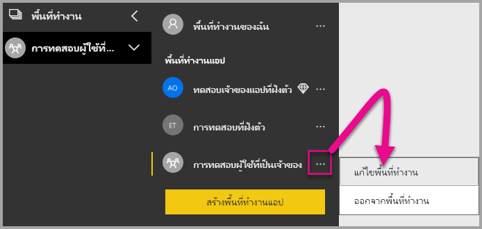

2. <span data-ttu-id="1e384-298">ขยาย **ขั้นสูง** และเปิดใช้งาน **ความจุ**</span><span class="sxs-lookup"><span data-stu-id="1e384-298">Expand **Advanced** and enable **Capacity**.</span></span> <span data-ttu-id="1e384-299">เลือกความจุที่คุณสร้าง</span><span class="sxs-lookup"><span data-stu-id="1e384-299">Select the capacity you created.</span></span> <span data-ttu-id="1e384-300">จากนั้นเลือก **บันทึก**</span><span class="sxs-lookup"><span data-stu-id="1e384-300">Then select **Save**.</span></span>

    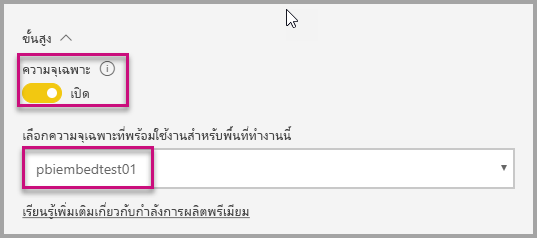

3. <span data-ttu-id="1e384-302">หลังจากเลือก **บันทึก** คุณควรจะเห็นรูปข้าวหลามตัดถัดจากชื่อพื้นที่ทำงาน</span><span class="sxs-lookup"><span data-stu-id="1e384-302">After you select **Save**, you should see a diamond next to the workspace name.</span></span>

    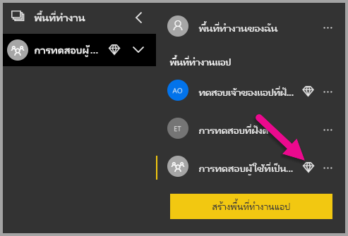

## <a name="admin-settings"></a><span data-ttu-id="1e384-304">การตั้งค่าผู้ดูแลระบบ</span><span class="sxs-lookup"><span data-stu-id="1e384-304">Admin settings</span></span>

<span data-ttu-id="1e384-305">ผู้ดูแลทั่วไปหรือผู้ดูแลบริการของ Power BI สามารถเปิด/ปิดความสามารถในการใช้ REST APIs ของผู้เช่าได้</span><span class="sxs-lookup"><span data-stu-id="1e384-305">Global admins or Power BI service administrators can turn the ability to use the REST APIs on or off for a tenant.</span></span> <span data-ttu-id="1e384-306">ผู้ดูแล Power BI สามารถตั้งการตั้งค่าสำหรับทั้งองค์กรหรือกลุ่มรักษาความปลอดภัยแยกต่างหากได้</span><span class="sxs-lookup"><span data-stu-id="1e384-306">Power BI admins can set this setting for the entire organization or for individual security groups.</span></span> <span data-ttu-id="1e384-307">เปิดใช้งานสำหรับทั้งองค์กรโดยค่าเริ่มต้น</span><span class="sxs-lookup"><span data-stu-id="1e384-307">It's enabled for the entire organization by default.</span></span> <span data-ttu-id="1e384-308">คุณสามารถแก้ไขเปลี่ยนแปลงได้ใน [พอร์ทัลผู้ดูแล Power BI](../../admin/service-admin-portal.md)</span><span class="sxs-lookup"><span data-stu-id="1e384-308">You can make these changes in the [Power BI admin portal](../../admin/service-admin-portal.md).</span></span>

## <a name="next-steps"></a><span data-ttu-id="1e384-309">ขั้นตอนถัดไป</span><span class="sxs-lookup"><span data-stu-id="1e384-309">Next steps</span></span>

<span data-ttu-id="1e384-310">ในการสอนนี้ คุณจะได้เรียนรู้วิธีการฝังเนื้อหา Power BI เข้าไปในแอปพลิเคชันโดยการใช้บัญชีองค์กร Power BI</span><span class="sxs-lookup"><span data-stu-id="1e384-310">In this tutorial, you learned how to embed Power BI content into an application by using your Power BI organization account.</span></span> <span data-ttu-id="1e384-311">คุณสามารถลองฝังเนื้อหา Power BI content เข้าไปในแอปพลิเคชันโดยการใช้แอปได้แล้ว</span><span class="sxs-lookup"><span data-stu-id="1e384-311">You can now try to embed Power BI content into an application by using apps.</span></span> <span data-ttu-id="1e384-312">นอกจากนี้คุณยังสามารถลองฝังเนื้อหา Power BI สำหรับลูกค้าของคุณ (ยังไม่ได้รับการสนับสนุนสำหรับการฝังรายงานที่มีการแบ่งหน้า):</span><span class="sxs-lookup"><span data-stu-id="1e384-312">You can also try to embed Power BI content for your customers (not supported yet for embedding paginated reports):</span></span>

> [!div class="nextstepaction"]
> [<span data-ttu-id="1e384-313">ฝังตัวจากแอป</span><span class="sxs-lookup"><span data-stu-id="1e384-313">Embed from apps</span></span>](./index.yml)

> [!div class="nextstepaction"]
>[<span data-ttu-id="1e384-314">ฝังสำหรับลูกค้าของคุณ</span><span class="sxs-lookup"><span data-stu-id="1e384-314">Embed for your customers</span></span>](embed-sample-for-customers.md)

<span data-ttu-id="1e384-315">หากมีข้อสงสัย [ลองถามชุมชน Power BI](https://community.powerbi.com/)</span><span class="sxs-lookup"><span data-stu-id="1e384-315">If you have more questions, [try asking the Power BI Community](https://community.powerbi.com/).</span></span>