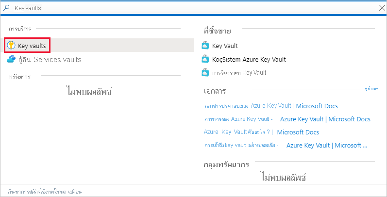
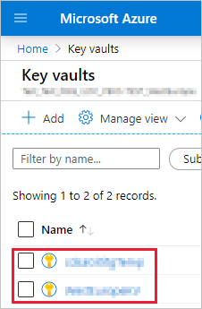
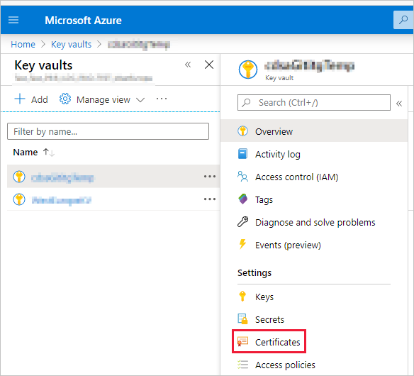
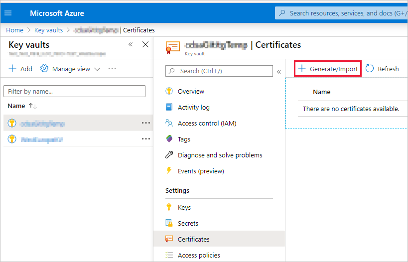
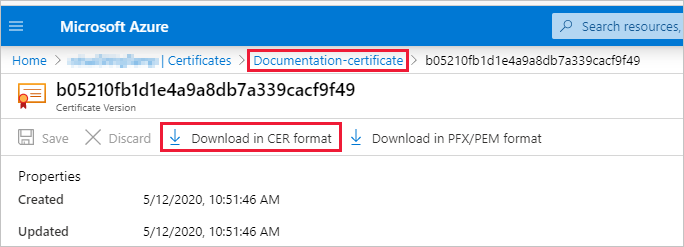
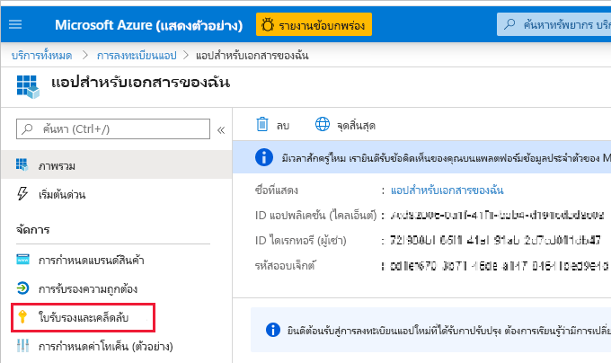
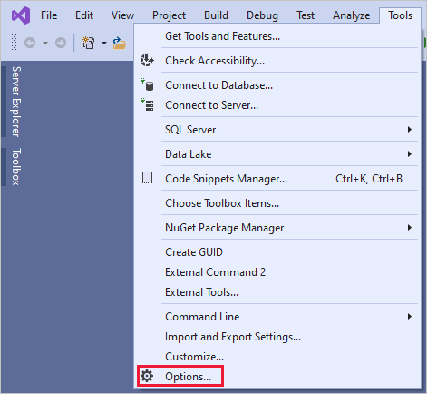
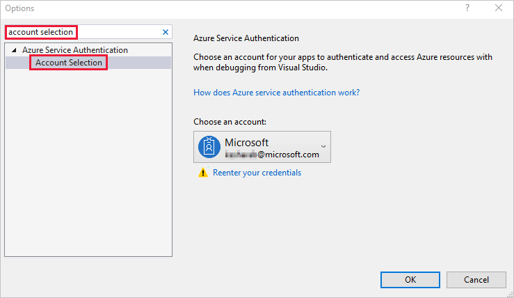

# <a name="embed-power-bi-content-with-service-principal-and-a-certificate"></a><span data-ttu-id="4dbc0-104">การฝังเนื้อหา Power BI ด้วยบริการหลักและใบรับรอง</span><span class="sxs-lookup"><span data-stu-id="4dbc0-104">Embed Power BI content with service principal and a certificate</span></span>

<span data-ttu-id="4dbc0-105">การรับรองความถูกต้องตามใบรับรองช่วยให้คุณได้รับการรับรองจาก Azure Active Directory (Azure AD) ที่มีใบรับรองไคลเอ็นต์บนอุปกรณ์ Windows, Android หรือ iOS หรือเก็บไว้ใน [Azure Key Vault](/azure/key-vault/basic-concepts)</span><span class="sxs-lookup"><span data-stu-id="4dbc0-105">Certificate-based authentication enables you to be authenticated by Azure Active Directory (Azure AD) with a client certificate on a Windows, Android or iOS device, or kept in an [Azure Key Vault](/azure/key-vault/basic-concepts).</span></span>

<span data-ttu-id="4dbc0-106">การใช้วิธีการรับรองความถูกต้องนี้อนุญาตให้จัดการใบรับรองจากจุดศูนย์กลางโดยใช้ CA สำหรับการสับเปลี่ยนหรือการเพิกถอน</span><span class="sxs-lookup"><span data-stu-id="4dbc0-106">Using this method of authentication allows managing certificates from a central place, using the CA, for rotation or revocation.</span></span>

<span data-ttu-id="4dbc0-107">คุณสามารถเรียนรู้เพิ่มเติมเกี่ยวกับใบรับรองใน Azure AD ได้จากหน้า [โฟลว์ข้อมูลประจำตัวของไคลเอ็นต์](https://github.com/AzureAD/microsoft-authentication-library-for-dotnet/wiki/Client-credential-flows) ใน GitHub</span><span class="sxs-lookup"><span data-stu-id="4dbc0-107">You can learn more about certificates in Azure AD in the [Client credential flows](https://github.com/AzureAD/microsoft-authentication-library-for-dotnet/wiki/Client-credential-flows) GitHub page.</span></span>

## <a name="method"></a><span data-ttu-id="4dbc0-108">วิธี</span><span class="sxs-lookup"><span data-stu-id="4dbc0-108">Method</span></span>

1. <span data-ttu-id="4dbc0-109">[ฝังเนื้อหาของคุณด้วยองค์ประกอบหลักของบริการ](embed-service-principal.md)</span><span class="sxs-lookup"><span data-stu-id="4dbc0-109">[Embed your content with service principal](embed-service-principal.md).</span></span>

2. <span data-ttu-id="4dbc0-110">[สร้างใบรับรอง](embed-service-principal-certificate.md#step-2---create-a-certificate)</span><span class="sxs-lookup"><span data-stu-id="4dbc0-110">[Create a certificate](embed-service-principal-certificate.md#step-2---create-a-certificate).</span></span>

3. <span data-ttu-id="4dbc0-111">[ตั้งค่าการรับรองความถูกต้องใบรับรอง](embed-service-principal-certificate.md#step-3---set-up-certificate-authentication)</span><span class="sxs-lookup"><span data-stu-id="4dbc0-111">[Set up certificate authentication](embed-service-principal-certificate.md#step-3---set-up-certificate-authentication).</span></span>

4. <span data-ttu-id="4dbc0-112">[รับใบรับรองจาก Azure Key Vault](embed-service-principal-certificate.md#step-4---get-the-certificate-from-azure-key-vault)</span><span class="sxs-lookup"><span data-stu-id="4dbc0-112">[Get the certificate from Azure Key Vault](embed-service-principal-certificate.md#step-4---get-the-certificate-from-azure-key-vault).</span></span>

5. <span data-ttu-id="4dbc0-113">[รับรองความถูกต้องโดยใช้องค์ประกอบหลักของบริการและใบรับรอง](embed-service-principal-certificate.md#step-5---authenticate-using-service-principal-and-a-certificate)</span><span class="sxs-lookup"><span data-stu-id="4dbc0-113">[Authenticate using service principal and a certificate](embed-service-principal-certificate.md#step-5---authenticate-using-service-principal-and-a-certificate).</span></span>

## <a name="step-1---embed-your-content-with-service-principal"></a><span data-ttu-id="4dbc0-114">ขั้นตอนที่ 1 - ฝังเนื้อหาของคุณด้วยองค์ประกอบหลักของบริการ</span><span class="sxs-lookup"><span data-stu-id="4dbc0-114">Step 1 - Embed your content with service principal</span></span>

<span data-ttu-id="4dbc0-115">หากต้องการฝังเนื้อหาของคุณด้วยองค์ประกอบหลักของบริการ ให้ทำตามคำแนะนำใน[ฝังเนื้อหา Power BI ด้วยองค์ประกอบหลักของบริการและข้อมูลลับของแอปพลิเคชัน](embed-service-principal.md)</span><span class="sxs-lookup"><span data-stu-id="4dbc0-115">To embed your content with service principal, follow the instructions in [Embed Power BI content with service principal and an application secret](embed-service-principal.md).</span></span>

>[!NOTE]
><span data-ttu-id="4dbc0-116">หากคุณมีเนื้อหาที่ฝังโดยใช้องค์ประกอบหลักของบริการอยู่แล้ว ให้ข้ามขั้นตอนนี้และไปยัง[ขั้นตอนที่ 2](embed-service-principal-certificate.md#step-2---create-a-certificate)</span><span class="sxs-lookup"><span data-stu-id="4dbc0-116">If you already have content that's embedded using a service principal, skip this step and advance to [step 2](embed-service-principal-certificate.md#step-2---create-a-certificate).</span></span>

## <a name="step-2---create-a-certificate"></a><span data-ttu-id="4dbc0-117">ขั้นตอนที่ 2 - สร้างใบรับรอง</span><span class="sxs-lookup"><span data-stu-id="4dbc0-117">Step 2 - Create a certificate</span></span>

<span data-ttu-id="4dbc0-118">คุณสามารถจัดหาใบรับรองจาก *ผู้ให้บริการออกใบรับรอง* ที่เชื่อถือได้ หรือสร้างใบรับรองด้วยตัวคุณเอง</span><span class="sxs-lookup"><span data-stu-id="4dbc0-118">You can procure a certificate from a trusted *Certificate Authority*, or generate a certificate yourself.</span></span>

<span data-ttu-id="4dbc0-119">ในส่วนนี้จะอธิบายการสร้างใบรับรองโดยใช้ [Azure Key Vault](/azure/key-vault/create-certificate) และดาวน์โหลดไฟล์ *.cer* ซึ่งประกอบด้วยคีย์สาธารณะ</span><span class="sxs-lookup"><span data-stu-id="4dbc0-119">This section describes creating a certificate using [Azure Key Vault](/azure/key-vault/create-certificate), and downloading the *.cer* file which contains the public key.</span></span>

1. <span data-ttu-id="4dbc0-120">ลงชื่อเข้าใช้ใน [Microsoft Azure](https://ms.portal.azure.com/#allservices)</span><span class="sxs-lookup"><span data-stu-id="4dbc0-120">Log into [Microsoft Azure](https://ms.portal.azure.com/#allservices).</span></span>

2. <span data-ttu-id="4dbc0-121">ค้นหา **ชุดเก็บคีย์** และคลิกที่ลิงก์ **ชุดเก็บคีย์**</span><span class="sxs-lookup"><span data-stu-id="4dbc0-121">Search for **Key Vaults** and click the **Key Vaults** link.</span></span>

    

3. <span data-ttu-id="4dbc0-123">คลิกชุดเก็บคีย์ที่คุณต้องการเพิ่มใบรับรอง</span><span class="sxs-lookup"><span data-stu-id="4dbc0-123">Click the key vault you want to add a certificate to.</span></span>

    

4. <span data-ttu-id="4dbc0-125">คลิก **ใบรับรอง**</span><span class="sxs-lookup"><span data-stu-id="4dbc0-125">Click **Certificates**.</span></span>

    

5. <span data-ttu-id="4dbc0-127">คลิก **สร้าง/นำเข้า**</span><span class="sxs-lookup"><span data-stu-id="4dbc0-127">Click **Generate/Import**.</span></span>

    

6. <span data-ttu-id="4dbc0-129">กำหนดค่างเขตข้อมูล **สร้างใบรับรอง** ดังนี้:</span><span class="sxs-lookup"><span data-stu-id="4dbc0-129">Configure the **Create a certificate** fields as follows:</span></span>

    * <span data-ttu-id="4dbc0-130">**วิธีการสร้างใบรับรอง** - ทั่วไป</span><span class="sxs-lookup"><span data-stu-id="4dbc0-130">**Method of Certificate Creation** - General</span></span>

    * <span data-ttu-id="4dbc0-131">**ชื่อใบรับรอง** - ป้อนชื่อสำหรับใบรับรองของคุณ</span><span class="sxs-lookup"><span data-stu-id="4dbc0-131">**Certificate Name** - Enter a name for your certificate</span></span>

    * <span data-ttu-id="4dbc0-132">**ชนิดของผู้ให้บริการออกใบรับรอง (CA)** - ใบรับรองแบบสร้างขึ้นมาเอง</span><span class="sxs-lookup"><span data-stu-id="4dbc0-132">**Type of Certificate Authority (CA)** - Self-signed certificate</span></span>

    * <span data-ttu-id="4dbc0-133">**หัวเรื่อง** - ชื่อจำเพาะ [X.500](https://wikipedia.org/wiki/X.500)</span><span class="sxs-lookup"><span data-stu-id="4dbc0-133">**Subject** - An [X.500](https://wikipedia.org/wiki/X.500) distinguished name</span></span>

    * <span data-ttu-id="4dbc0-134">**ชื่อ DNS** - ชื่อ DNS 0</span><span class="sxs-lookup"><span data-stu-id="4dbc0-134">**DNS Names** - 0 DNS names</span></span>

    * <span data-ttu-id="4dbc0-135">**ระยะเวลาการมีผลบังคับใช้ (เดือน)** - ป้อนระยะเวลาการมีผลบังคับใช้ของใบรับรอง</span><span class="sxs-lookup"><span data-stu-id="4dbc0-135">**Validity Period (in months)** - Enter the certificate's validity duration</span></span>

    * <span data-ttu-id="4dbc0-136">**ชนิดเนื้อหา** - PKCS #12</span><span class="sxs-lookup"><span data-stu-id="4dbc0-136">**Content Type** - PKCS #12</span></span>

    * <span data-ttu-id="4dbc0-137">**ชนิดการดำเนินการตลอดอายุการใช้** - ต่ออายุอัตโนมัติตามเปอร์เซ็นต์อายุการใช้งานที่ระบุ</span><span class="sxs-lookup"><span data-stu-id="4dbc0-137">**Lifetime Action Type** - Automatically renew at a given percentage lifetime</span></span>

    * <span data-ttu-id="4dbc0-138">**เปอร์เซ็นต์อายุการใช้งาน** - 80</span><span class="sxs-lookup"><span data-stu-id="4dbc0-138">**Percentage Lifetime** - 80</span></span>

    * <span data-ttu-id="4dbc0-139">**การกำหนดค่านโยบายขั้นสูง** - ไม่ได้กำหนดค่า</span><span class="sxs-lookup"><span data-stu-id="4dbc0-139">**Advanced Policy Configuration** - Not configured</span></span>

7. <span data-ttu-id="4dbc0-140">คลิก **สร้าง**</span><span class="sxs-lookup"><span data-stu-id="4dbc0-140">Click **Create**.</span></span> <span data-ttu-id="4dbc0-141">ใบรับรองที่สร้างขึ้นใหม่ถูกปิดใช้งานตามค่าเริ่มต้น</span><span class="sxs-lookup"><span data-stu-id="4dbc0-141">The newly created certificate is disabled by default.</span></span> <span data-ttu-id="4dbc0-142">อาจใช้เวลานานถึงห้านาทีในการเปิดใช้งาน</span><span class="sxs-lookup"><span data-stu-id="4dbc0-142">It can take up to five minutes to become enabled.</span></span>

8. <span data-ttu-id="4dbc0-143">เลือกใบรับรองที่คุณสร้างขึ้น</span><span class="sxs-lookup"><span data-stu-id="4dbc0-143">Select the certificate you created.</span></span>

9. <span data-ttu-id="4dbc0-144">คลิก **ดาวน์โหลดในรูปแบบ CER**</span><span class="sxs-lookup"><span data-stu-id="4dbc0-144">Click **Download in CER format**.</span></span> <span data-ttu-id="4dbc0-145">ไฟล์ที่ดาวน์โหลดประกอบด้วยคีย์สาธารณะ</span><span class="sxs-lookup"><span data-stu-id="4dbc0-145">The downloaded file contains the public key.</span></span>

    

## <a name="step-3---set-up-certificate-authentication"></a><span data-ttu-id="4dbc0-147">ขั้นตอนที่ 3 - ตั้งค่าการรับรองความถูกต้องใบรับรอง</span><span class="sxs-lookup"><span data-stu-id="4dbc0-147">Step 3 - Set up certificate authentication</span></span>

1. <span data-ttu-id="4dbc0-148">ในแอปพลิเคชัน Azure AD ของคุณ ให้คลิกที่แท็บ **ใบรับรอง & ความลับ**</span><span class="sxs-lookup"><span data-stu-id="4dbc0-148">In your Azure AD application, click the **Certificates & secrets** tab.</span></span>

     

2. <span data-ttu-id="4dbc0-150">คลิก **อัปโหลดใบรับรอง** และอัปโหลดไฟล์ *.cer* ที่คุณสร้างและดาวน์โหลดใน [ขั้นตอนที่ 2](#step-2---create-a-certificate) ของบทช่วยสอนนี้</span><span class="sxs-lookup"><span data-stu-id="4dbc0-150">Click **Upload certificate** and upload the *.cer* file you created and downloaded in [step 2](#step-2---create-a-certificate) of this tutorial.</span></span> <span data-ttu-id="4dbc0-151">ไฟล์ *.cer* ประกอบด้วยคีย์สาธารณะ</span><span class="sxs-lookup"><span data-stu-id="4dbc0-151">The *.cer* file contains the public key.</span></span>

## <a name="step-4---get-the-certificate-from-azure-key-vault"></a><span data-ttu-id="4dbc0-152">ขั้นตอนที่ 4 - รับใบรับรองจาก Azure Key Vault</span><span class="sxs-lookup"><span data-stu-id="4dbc0-152">Step 4 - Get the certificate from Azure Key Vault</span></span>

<span data-ttu-id="4dbc0-153">ใช้ข้อมูลประจำตัวของบริการที่มีการจัดการ (MSI) เพื่อรับใบรับรองจาก Azure Key Vault</span><span class="sxs-lookup"><span data-stu-id="4dbc0-153">Use Managed Service Identity (MSI) to get the certificate from Azure Key Vault.</span></span> <span data-ttu-id="4dbc0-154">กระบวนการนี้เกี่ยวข้องกับการรับใบรับรอง *.pfx* ที่ประกอบด้วยคีย์สาธารณะและส่วนตัว</span><span class="sxs-lookup"><span data-stu-id="4dbc0-154">This process involves getting the *.pfx* certificate that contains both the public and private keys.</span></span>

<span data-ttu-id="4dbc0-155">อ้างถึงตัวอย่างโค้ดสำหรับการอ่านใบรับรองจาก Azure Key Vault</span><span class="sxs-lookup"><span data-stu-id="4dbc0-155">Refer to the code example for reading the certificate from Azure Key Vault.</span></span> <span data-ttu-id="4dbc0-156">ถ้าคุณต้องการใช้ Visual Studio ให้อ้างอิงถึง [กำหนดค่า Visual Studio เพื่อใช้ MSI](#configure-visual-studio-to-use-msi)</span><span class="sxs-lookup"><span data-stu-id="4dbc0-156">If you want to use Visual Studio, refer to [Configure Visual Studio to use MSI](#configure-visual-studio-to-use-msi).</span></span>

```csharp
private X509Certificate2 ReadCertificateFromVault(string certName)
{
    var serviceTokenProvider = new AzureServiceTokenProvider();
    var keyVaultClient = new KeyVaultClient(new KeyVaultClient.AuthenticationCallback(serviceTokenProvider.KeyVaultTokenCallback));
    CertificateBundle certificate = null;
    SecretBundle secret = null;
    try
    {
        certificate = keyVaultClient.GetCertificateAsync($"https://{KeyVaultName}.vault.azure.net/", certName).Result;
        secret = keyVaultClient.GetSecretAsync(certificate.SecretIdentifier.Identifier).Result;
    }
    catch (Exception)
    {
        return null;
    }

    return new X509Certificate2(Convert.FromBase64String(secret.Value));
}
```

## <a name="step-5---authenticate-using-service-principal-and-a-certificate"></a><span data-ttu-id="4dbc0-157">ขั้นตอนที่ 5 - รับรองความถูกต้องโดยใช้บริการหลักและใบรับรอง</span><span class="sxs-lookup"><span data-stu-id="4dbc0-157">Step 5 - Authenticate using service principal and a certificate</span></span>

<span data-ttu-id="4dbc0-158">คุณสามารถรับรองความถูกต้องของแอปของคุณโดยใช้บริการหลักและใบรับรองที่จัดเก็บไว้ใน Azure Key Vault ได้โดยการเชื่อมต่อกับ Azure Key Vault</span><span class="sxs-lookup"><span data-stu-id="4dbc0-158">You can authenticate your app using service principal and a certificate that's stored in Azure Key Vault, by connecting to Azure Key Vault.</span></span>

<span data-ttu-id="4dbc0-159">หากต้องการเชื่อมต่อและอ่านใบรับรองจาก Azure Key Vault โปรดดูโค้ดด้านล่าง</span><span class="sxs-lookup"><span data-stu-id="4dbc0-159">To connect and read the certificate from Azure Key Vault, refer to the code below.</span></span>

>[!NOTE]
><span data-ttu-id="4dbc0-160">ถ้าคุณมีใบรับรองที่สร้างโดยองค์กรของคุณแล้ว ให้อัปโหลดไฟล์ *.pfx* ไปยัง Azure Key Vault</span><span class="sxs-lookup"><span data-stu-id="4dbc0-160">If you already have a certificate created by your organization, upload the *.pfx* file to Azure Key Vault.</span></span>

```csharp
// Preparing needed variables
var Scope = "https://analysis.windows.net/powerbi/api/.default"
var ApplicationId = "{YourApplicationId}"
var tenantSpecificURL = "https://login.microsoftonline.com/{YourTenantId}/"
X509Certificate2 certificate = ReadCertificateFromVault(CertificateName);

// Authenticating with a SP and a certificate
public async Task<AuthenticationResult> DoAuthentication(){
    IConfidentialClientApplication clientApp = null;
    clientApp = ConfidentialClientApplicationBuilder.Create(ApplicationId)
                                                    .WithCertificate(certificate)
                                                    .WithAuthority(tenantSpecificURL)
                                                    .Build();
    try
    {
        authenticationResult = await clientApp.AcquireTokenForClient(Scope).ExecuteAsync();
    }
    catch (MsalException)
    {
        throw;
    }
    return authenticationResult
}
```

## <a name="configure-visual-studio-to-use-msi"></a><span data-ttu-id="4dbc0-161">กำหนดค่า Visual Studio เพื่อใช้ MSI</span><span class="sxs-lookup"><span data-stu-id="4dbc0-161">Configure Visual Studio to use MSI</span></span>

<span data-ttu-id="4dbc0-162">เมื่อสร้างโซลูชันแบบฝังตัวของคุณ อาจเป็นประโยชน์ในการกำหนดค่า Visual Studio เพื่อใช้ข้อมูลประจำตัวของบริการที่มีการจัดการ (MSI)</span><span class="sxs-lookup"><span data-stu-id="4dbc0-162">When creating your embedded solution, it may be useful to configure Visual Studio to use Managed Service Identity (MSI).</span></span> <span data-ttu-id="4dbc0-163">[MSI](/azure/active-directory/managed-identities-azure-resources/overview) คือคุณลักษณะที่ช่วยให้คุณสามารถจัดการข้อมูลประจำตัว Azure AD ของคุณได้</span><span class="sxs-lookup"><span data-stu-id="4dbc0-163">[MSI](/azure/active-directory/managed-identities-azure-resources/overview) is a feature that enables you to manage your Azure AD identity.</span></span> <span data-ttu-id="4dbc0-164">เมื่อกำหนดค่าแล้ว จะอนุญาตให้ Visual Studio รับรองความถูกต้องเทียบกับ Azure Key Vault ของคุณ</span><span class="sxs-lookup"><span data-stu-id="4dbc0-164">Once configured, it will let Visual Studio authenticate against your Azure Key Vault.</span></span>

1. <span data-ttu-id="4dbc0-165">เปิดโครงการของคุณใน Visual Studio</span><span class="sxs-lookup"><span data-stu-id="4dbc0-165">Open your project in Visual Studio.</span></span>

2. <span data-ttu-id="4dbc0-166">คลิก **เครื่องมือ** > **ตัวเลือก**</span><span class="sxs-lookup"><span data-stu-id="4dbc0-166">Click **Tools** > **Options**.</span></span>

     

3. <span data-ttu-id="4dbc0-168">ค้นหา **การเลือกบัญชี** และคลิก **การเลือกบัญชี**</span><span class="sxs-lookup"><span data-stu-id="4dbc0-168">Search for **Account Selection** and click **Account Selection**.</span></span>

    

4. <span data-ttu-id="4dbc0-170">เพิ่มบัญชีที่สามารถเข้าถึง Azure Key Vault ของคุณ</span><span class="sxs-lookup"><span data-stu-id="4dbc0-170">Add the account that has access to your Azure Key Vault.</span></span>

## <a name="next-steps"></a><span data-ttu-id="4dbc0-171">ขั้นตอนถัดไป</span><span class="sxs-lookup"><span data-stu-id="4dbc0-171">Next steps</span></span>

>[!div class="nextstepaction"]
>[<span data-ttu-id="4dbc0-172">ลงทะเบียนแอป</span><span class="sxs-lookup"><span data-stu-id="4dbc0-172">Register an app</span></span>](register-app.md)

> [!div class="nextstepaction"]
>[<span data-ttu-id="4dbc0-173">Power BI Embedded สำหรับลูกค้าของคุณ</span><span class="sxs-lookup"><span data-stu-id="4dbc0-173">Power BI Embedded for your customers</span></span>](embed-sample-for-customers.md)

>[!div class="nextstepaction"]
>[<span data-ttu-id="4dbc0-174">แอปพลิเคชันและออบเจ็กต์บริการหลักใน Azure Active Directory</span><span class="sxs-lookup"><span data-stu-id="4dbc0-174">Application and service principal objects in Azure Active Directory</span></span>](/azure/active-directory/develop/app-objects-and-service-principals)

>[!div class="nextstepaction"]
>[<span data-ttu-id="4dbc0-175">ความปลอดภัยระดับแถวโดยใช้เกตเวย์ข้อมูลภายในองค์กรที่มีโครงร่างสำคัญของบริการ</span><span class="sxs-lookup"><span data-stu-id="4dbc0-175">Row-level security using on-premises data gateway with service principal</span></span>](embedded-row-level-security.md#on-premises-data-gateway-with-service-principal)