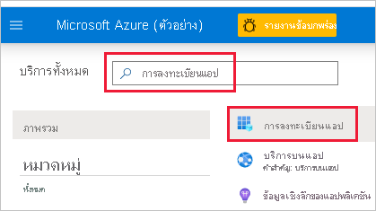
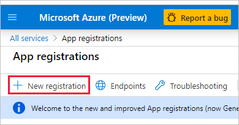
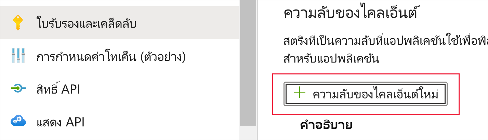
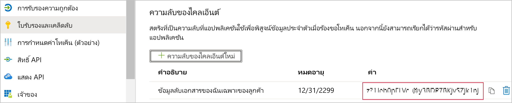

# <a name="embed-power-bi-content-with-service-principal-and-an-application-secret"></a><span data-ttu-id="e6f32-104">การฝังเนื้อหา Power BI ด้วยบริการหลักและความลับของแอปพลิเคชัน</span><span class="sxs-lookup"><span data-stu-id="e6f32-104">Embed Power BI content with service principal and an application secret</span></span>

<span data-ttu-id="e6f32-105">บริการหลักคือวิธีการรับรองความถูกต้องที่สามารถใช้เพื่ออนุญาตให้แอปพลิเคชัน  Azure AD เข้าถึงเนื้อหาบริการของ Power BI และ API</span><span class="sxs-lookup"><span data-stu-id="e6f32-105">Service principal is an authentication method that can be used to let an Azure AD application access Power BI service content and APIs.</span></span>

<span data-ttu-id="e6f32-106">เมื่อคุณสร้างแอป Azure Active Directory (Azure AD)  [วัตถุบริการหลัก](/azure/active-directory/develop/app-objects-and-service-principals#service-principal-object) จะถูกสร้างขึ้น</span><span class="sxs-lookup"><span data-stu-id="e6f32-106">When you create an Azure Active Directory (Azure AD) app, a [service principal object](/azure/active-directory/develop/app-objects-and-service-principals#service-principal-object) is created.</span></span> <span data-ttu-id="e6f32-107">วัตถุบริการหลัก ซึ่งเป็นที่รู้จักกันว่า *บริการหลัก* จะช่วยให้ Azure AD รับรองความถูกต้องของแอปของคุณ</span><span class="sxs-lookup"><span data-stu-id="e6f32-107">The service principal object, also known simply as *service principal*, allows Azure AD to authenticate your app.</span></span> <span data-ttu-id="e6f32-108">เมื่อรับรองความถูกต้องแล้ว แอปจะสามารถเข้าถึงแหล่งข้อมูลผู้เช่า Azure AD</span><span class="sxs-lookup"><span data-stu-id="e6f32-108">Once authenticated, the app can access Azure AD tenant resources.</span></span>

<span data-ttu-id="e6f32-109">ในการรับรองความถูกต้อง บริการหลักจะใช้ *รหัส แอปพลิเคชัน* ของแอป Azure AD และหนึ่งในรายการต่อไปนี้:</span><span class="sxs-lookup"><span data-stu-id="e6f32-109">To authenticate, the service principal uses the Azure AD app's *Application ID*, and one of the following:</span></span>

* <span data-ttu-id="e6f32-110">ใบรับรอง</span><span class="sxs-lookup"><span data-stu-id="e6f32-110">Certificate</span></span>
* <span data-ttu-id="e6f32-111">ข้อมูลลับของแอปพลิเคชัน</span><span class="sxs-lookup"><span data-stu-id="e6f32-111">Application secret</span></span>

<span data-ttu-id="e6f32-112">บทความนี้อธิบายการรับรองความถูกต้องของบริการหลักโดยใช้ *รหัสแอปพลิเคชัน* และ *ความลับของแอปพลิเคชัน*</span><span class="sxs-lookup"><span data-stu-id="e6f32-112">This article describes service principal authentication using *Application ID* and *Application secret*.</span></span>

>[!NOTE]
><span data-ttu-id="e6f32-113">Azure AD ขอแนะนำให้คุณรักษาความปลอดภัยบริการหลังบ้านของคุณโดยใช้ใบรับรอง แทนที่จะเป็นคีย์ลับ</span><span class="sxs-lookup"><span data-stu-id="e6f32-113">Azure AD recommends that you secure your backend services using certificates, rather than secret keys.</span></span>
>* <span data-ttu-id="e6f32-114">[เรียนรู้เพิ่มเติมเกี่ยวกับการรับโทเค็นการเข้าถึงจาก Azure AD โดยใช้คีย์ลับหรือใบรับรอง](/azure/architecture/multitenant-identity/client-assertion)</span><span class="sxs-lookup"><span data-stu-id="e6f32-114">[Learn more about getting access tokens from Azure AD using secret keys or certificates](/azure/architecture/multitenant-identity/client-assertion).</span></span>
>* <span data-ttu-id="e6f32-115">เมื่อต้องการรักษาความปลอดภัยโซลูชันของคุณโดยใช้ใบรับรอง ให้ทำตามคำแนะนำในบทความนี้จากนั้นทำตามขั้นตอนที่อธิบายไว้ใน[ฝังเนื้อหา Power BI ด้วยองค์ประกอบหลักของบริการและใบรับรอง](embed-service-principal-certificate.md)</span><span class="sxs-lookup"><span data-stu-id="e6f32-115">To secure your solution using a certificate, complete the instructions in this article and then follow the steps described in [Embed Power BI content with service principal and a certificate](embed-service-principal-certificate.md).</span></span>

## <a name="method"></a><span data-ttu-id="e6f32-116">วิธีการ</span><span class="sxs-lookup"><span data-stu-id="e6f32-116">Method</span></span>

<span data-ttu-id="e6f32-117">เมื่อต้องการใช้องค์ประกอบหลักและการวิเคราะห์แบบฝัง ID แอปพลิเคชัน ให้ทำตามขั้นตอนเหล่านี้:</span><span class="sxs-lookup"><span data-stu-id="e6f32-117">To use service principal and an application ID  embedded analytics, follow these steps:</span></span>

1. <span data-ttu-id="e6f32-118">สร้าง [แอป Azure AD](/azure/active-directory/manage-apps/what-is-application-management)</span><span class="sxs-lookup"><span data-stu-id="e6f32-118">Create an [Azure AD app](/azure/active-directory/manage-apps/what-is-application-management).</span></span>

    1. <span data-ttu-id="e6f32-119">สร้างความลับของแอป Azure AD</span><span class="sxs-lookup"><span data-stu-id="e6f32-119">Create the Azure AD app's secret.</span></span>
    
    2. <span data-ttu-id="e6f32-120">รับ *รหัสแอปพลิเคชัน* และ *ความลับของแอปพลิเคชัน* ของแอป</span><span class="sxs-lookup"><span data-stu-id="e6f32-120">Get the app's *Application ID* and *Application secret*.</span></span>

    >[!NOTE]
    ><span data-ttu-id="e6f32-121">ขั้นตอนเหล่านี้จะอธิบายไว้ใน **ขั้นตอนที่ 1**</span><span class="sxs-lookup"><span data-stu-id="e6f32-121">These steps are described in **step 1**.</span></span> <span data-ttu-id="e6f32-122">สำหรับข้อมูลเพิ่มเติมเกี่ยวกับการสร้างแอป Azure AD โปรดดูบทความ [สร้างแอป Azure AD](/azure/active-directory/develop/howto-create-service-principal-portal)</span><span class="sxs-lookup"><span data-stu-id="e6f32-122">For more information about creating an Azure AD app, see the [create an Azure AD app](/azure/active-directory/develop/howto-create-service-principal-portal) article.</span></span>

2. <span data-ttu-id="e6f32-123">สร้างกลุ่มความปลอดภัย Azure AD</span><span class="sxs-lookup"><span data-stu-id="e6f32-123">Create an Azure AD security group.</span></span>

3. <span data-ttu-id="e6f32-124">เปิดใช้งานการตั้งค่าการจัดการบริการของ Power BI</span><span class="sxs-lookup"><span data-stu-id="e6f32-124">Enable the Power BI service admin settings.</span></span>

4. <span data-ttu-id="e6f32-125">เพิ่มบริการหลักไปยังพื้นที่ทำงานของคุณ</span><span class="sxs-lookup"><span data-stu-id="e6f32-125">Add the service principal to your workspace.</span></span>

5. <span data-ttu-id="e6f32-126">ฝังเนื้อหาของคุณ</span><span class="sxs-lookup"><span data-stu-id="e6f32-126">Embed your content.</span></span>

> [!IMPORTANT]
> <span data-ttu-id="e6f32-127">เมื่อคุณเปิดใช้งานบริการหลักที่จะใช้กับ Power BI สิทธิ์ AD ของแอปพลิเคชันไม่มีผลบังคับใช้อีกต่อไป</span><span class="sxs-lookup"><span data-stu-id="e6f32-127">Once you enable service principal to be used with Power BI, the application's AD permissions don't take effect anymore.</span></span> <span data-ttu-id="e6f32-128">มีจัดการสิทธิ์ของแอปพลิเคชันแล้วผ่านทางพอร์ทัลผู้ดูแลระบบ Power BI</span><span class="sxs-lookup"><span data-stu-id="e6f32-128">The application's permissions are then managed through the Power BI admin portal.</span></span>

## <a name="step-1---create-an-azure-ad-app"></a><span data-ttu-id="e6f32-129">ขั้นตอนที่ 1 - สร้าง แอป Azure AD</span><span class="sxs-lookup"><span data-stu-id="e6f32-129">Step 1 - Create an Azure AD app</span></span>

<span data-ttu-id="e6f32-130">สร้างแอป Azure AD โดยใช้วิธีใดวิธีหนึ่งต่อไปนี้:</span><span class="sxs-lookup"><span data-stu-id="e6f32-130">Create an Azure AD app using one of these methods:</span></span>

* [<span data-ttu-id="e6f32-131">สร้างแอปในพอร์ทัล Microsoft Azure</span><span class="sxs-lookup"><span data-stu-id="e6f32-131">Create the app in the Microsoft Azure portal</span></span>](embed-service-principal.md#creating-an-azure-ad-app-in-the-microsoft-azure-portal)

* [<span data-ttu-id="e6f32-132">สร้างแอปโดยใช้ PowerShell</span><span class="sxs-lookup"><span data-stu-id="e6f32-132">Create the app using PowerShell</span></span>](embed-service-principal.md#creating-an-azure-ad-app-using-powershell)

### <a name="creating-an-azure-ad-app-in-the-microsoft-azure-portal"></a><span data-ttu-id="e6f32-133">การสร้างแอป Azure AD ในพอร์ทัล Microsoft Azure</span><span class="sxs-lookup"><span data-stu-id="e6f32-133">Creating an Azure AD app in the Microsoft Azure portal</span></span>

1. <span data-ttu-id="e6f32-134">ลงชื่อเข้าใช้ใน [Microsoft Azure](https://ms.portal.azure.com/#allservices)</span><span class="sxs-lookup"><span data-stu-id="e6f32-134">Log into [Microsoft Azure](https://ms.portal.azure.com/#allservices).</span></span>

2. <span data-ttu-id="e6f32-135">ค้นหา **การลงทะเบียนแอป** และคลิกลิงก์ **การลงทะเบียนแอป**</span><span class="sxs-lookup"><span data-stu-id="e6f32-135">Search for **App registrations** and click the **App registrations** link.</span></span>

    

3. <span data-ttu-id="e6f32-137">คลิก **การลงทะเบียนใหม่**</span><span class="sxs-lookup"><span data-stu-id="e6f32-137">Click **New registration**.</span></span>

    

4. <span data-ttu-id="e6f32-139">ระบุข้อมูลที่จำเป็น:</span><span class="sxs-lookup"><span data-stu-id="e6f32-139">Fill in the required information:</span></span>
    * <span data-ttu-id="e6f32-140">**ชื่อ** - กรอกชื่อสำหรับแอปพลิเคชันของคุณ</span><span class="sxs-lookup"><span data-stu-id="e6f32-140">**Name** - Enter a name for your application</span></span>
    * <span data-ttu-id="e6f32-141">**ชนิดบัญชีที่ได้รับการสนับสนุน** - เลือกประเภทบัญชีที่ได้รับการสนับสนุน</span><span class="sxs-lookup"><span data-stu-id="e6f32-141">**Supported account types** - Select supported account types</span></span>
    * <span data-ttu-id="e6f32-142">(ไม่บังคับ) **เปลี่ยนเส้นทาง URI** - กรอก URI ถ้าจำเป็น</span><span class="sxs-lookup"><span data-stu-id="e6f32-142">(Optional) **Redirect URI** - Enter a URI if needed</span></span>

5. <span data-ttu-id="e6f32-143">คลิก **ลงทะเบียน**</span><span class="sxs-lookup"><span data-stu-id="e6f32-143">Click **Register**.</span></span>

6. <span data-ttu-id="e6f32-144">หลังจากลงทะเบียนแล้ว *รหัสแอปพลิเคชัน* จะพร้อมใช้งานจากแท็บ **ภาพรวม** คัดลอกและบันทึก *รหัสแอปพลิเคชัน* สำหรับใช้งานในภายหลัง</span><span class="sxs-lookup"><span data-stu-id="e6f32-144">After registering, the *Application ID* is available from the **Overview** tab. Copy and save the *Application ID* for later use.</span></span>

    

7. <span data-ttu-id="e6f32-146">คลิกแท็บ **ใบรับรองและความลับ**</span><span class="sxs-lookup"><span data-stu-id="e6f32-146">Click the **Certificates & secrets** tab.</span></span>

     

8. <span data-ttu-id="e6f32-148">คลิก **ความลับของไคลเอ็นต์ใหม่**</span><span class="sxs-lookup"><span data-stu-id="e6f32-148">Click **New client secret**</span></span>

    

9. <span data-ttu-id="e6f32-150">ในหน้าต่าง *เพิ่มความลับของไคลเอ็นต์* กรอกคำอธิบาย ระบุเวลาที่คุณต้องการให้ความลับของไคลเอ็นต์หมดอายุ จากนั้นคลิก **เพิ่ม**</span><span class="sxs-lookup"><span data-stu-id="e6f32-150">In the *Add a client secret* window, enter a description, specify when you want the client secret to expire, and click **Add**.</span></span>

10. <span data-ttu-id="e6f32-151">คัดลอกและบันทึกค่า *ความลับของไคลเอ็นต์*</span><span class="sxs-lookup"><span data-stu-id="e6f32-151">Copy and save the *Client secret* value.</span></span>

    

    >[!NOTE]
    ><span data-ttu-id="e6f32-153">หลังจากที่คุณออกจากหน้าต่างนี้ ค่าความลับของไคลเอ็นต์จะถูกซ่อนอยู่และคุณจะไม่สามารถดูหรือคัดลอกอีกครั้งได้</span><span class="sxs-lookup"><span data-stu-id="e6f32-153">After you leave this window, the client secret value will be hidden, and you'll not be able to view or copy it again.</span></span>

### <a name="creating-an-azure-ad-app-using-powershell"></a><span data-ttu-id="e6f32-154">การสร้างแอป Azure AD โดยใช้ PowerShell</span><span class="sxs-lookup"><span data-stu-id="e6f32-154">Creating an Azure AD app using PowerShell</span></span>

<span data-ttu-id="e6f32-155">ส่วนนี้จะประกอบด้วยสคริปต์ตัวอย่างในการสร้างแอป Azure AD ใหม่โดยใช้ [PowerShell](/powershell/azure/create-azure-service-principal-azureps)</span><span class="sxs-lookup"><span data-stu-id="e6f32-155">This section includes a sample script to create a new Azure AD app using [PowerShell](/powershell/azure/create-azure-service-principal-azureps).</span></span>

```powershell
# The app ID - $app.appid
# The service principal object ID - $sp.objectId
# The app key - $key.value

# Sign in as a user that's allowed to create an app
Connect-AzureAD

# Create a new Azure AD web application
$app = New-AzureADApplication -DisplayName "testApp1" -Homepage "https://localhost:44322" -ReplyUrls "https://localhost:44322"

# Creates a service principal
$sp = New-AzureADServicePrincipal -AppId $app.AppId

# Get the service principal key
$key = New-AzureADServicePrincipalPasswordCredential -ObjectId $sp.ObjectId
```

## <a name="step-2---create-an-azure-ad-security-group"></a><span data-ttu-id="e6f32-156">ขั้นตอนที่ 2 - สร้างกลุ่มความปลอดภัย Azure AD</span><span class="sxs-lookup"><span data-stu-id="e6f32-156">Step 2 - Create an Azure AD security group</span></span>

<span data-ttu-id="e6f32-157">บริการหลักของคุณไม่มีสิทธิ์ในการเข้าถึงเนื้อหา Power BI และ API ของคุณ</span><span class="sxs-lookup"><span data-stu-id="e6f32-157">Your service principal doesn't have access to any of your Power BI content and APIs.</span></span> <span data-ttu-id="e6f32-158">ในการให้สิทธิ์การเข้าถึงบริการหลัก ให้สร้างกลุ่มความปลอดภัยใน Azure AD และเพิ่มบริการหลักที่คุณสร้างไว้ในกลุ่มความปลอดภัยนั้น</span><span class="sxs-lookup"><span data-stu-id="e6f32-158">To give the service principal access, create a security group in Azure AD, and add the service principal you created to that security group.</span></span>

<span data-ttu-id="e6f32-159">มีสองวิธีในการสร้างกลุ่มความปลอดภัยใน Azure AD:</span><span class="sxs-lookup"><span data-stu-id="e6f32-159">There are two ways to create an Azure AD security group:</span></span>
* [<span data-ttu-id="e6f32-160">ด้วยตนเอง (ใน Azure)</span><span class="sxs-lookup"><span data-stu-id="e6f32-160">Manually (in Azure)</span></span>](embed-service-principal.md#create-a-security-group-manually)
* [<span data-ttu-id="e6f32-161">การใช้ PowerShell</span><span class="sxs-lookup"><span data-stu-id="e6f32-161">Using PowerShell</span></span>](embed-service-principal.md#create-a-security-group-using-powershell)

### <a name="create-a-security-group-manually"></a><span data-ttu-id="e6f32-162">สร้างกลุ่มความปลอดภัยด้วยตนเอง</span><span class="sxs-lookup"><span data-stu-id="e6f32-162">Create a security group manually</span></span>

<span data-ttu-id="e6f32-163">หากต้องการสร้างกลุ่มความปลอดภัยใน Azure ด้วยตนเอง ให้ทำตามคำแนะนำในบทความ [สร้างกลุ่มพื้นฐานและเพิ่มสมาชิกโดยใช้ Azure Active Directory](/azure/active-directory/fundamentals/active-directory-groups-create-azure-portal)</span><span class="sxs-lookup"><span data-stu-id="e6f32-163">To create an Azure security group manually, follow the instructions in the [Create a basic group and add members using Azure Active Directory](/azure/active-directory/fundamentals/active-directory-groups-create-azure-portal) article.</span></span> 

### <a name="create-a-security-group-using-powershell"></a><span data-ttu-id="e6f32-164">สร้างกลุ่มความปลอดภัยโดยใช้ PowerShell</span><span class="sxs-lookup"><span data-stu-id="e6f32-164">Create a security group using PowerShell</span></span>

<span data-ttu-id="e6f32-165">ในด้านล่างจะแสดงสคริปต์ตัวอย่างในการสร้างกลุ่มความปลอดภัยใหม่ และการเพิ่มแอปไปยังกลุ่มความปลอดภัยนั้น</span><span class="sxs-lookup"><span data-stu-id="e6f32-165">Below is a sample script for creating a new security group, and adding an app to that security group.</span></span>

>[!NOTE]
><span data-ttu-id="e6f32-166">หากคุณต้องการเปิดใช้สิทธิ์การเข้าถึงบริการหลักสำหรับทั้งองค์กร โปรดข้ามขั้นตอนนี้</span><span class="sxs-lookup"><span data-stu-id="e6f32-166">If you want to enable service principal access for the entire organization, skip this step.</span></span>

```powershell
# Required to sign in as admin
Connect-AzureAD

# Create an Azure AD security group
$group = New-AzureADGroup -DisplayName <Group display name> -SecurityEnabled $true -MailEnabled $false -MailNickName notSet

# Add the service principal to the group
Add-AzureADGroupMember -ObjectId $($group.ObjectId) -RefObjectId $($sp.ObjectId)
```

## <a name="step-3---enable-the-power-bi-service-admin-settings"></a><span data-ttu-id="e6f32-167">ขั้นตอนที่ 3 - เปิดใช้งานการตั้งค่าการจัดการบริการของ Power BI</span><span class="sxs-lookup"><span data-stu-id="e6f32-167">Step 3 - Enable the Power BI service admin settings</span></span>

<span data-ttu-id="e6f32-168">เพื่อให้แอป Azure AD สามารถเข้าถึงเนื้อหา Power BI และ API ได้ ผู้ดูแลระบบ Power BI จำเป็นต้องเปิดใช้งานการเข้าถึงบริการหลักในพอร์ทัลผู้ดูแลระบบของ Power BI</span><span class="sxs-lookup"><span data-stu-id="e6f32-168">For an Azure AD app to be able to access the Power BI content and APIs, a Power BI admin needs to enable service principal access in the Power BI admin portal.</span></span>

<span data-ttu-id="e6f32-169">เพิ่มกลุ่มความปลอดภัยที่คุณสร้างใน Azure AD สำหรับส่วนกลุ่มความปลอดภัยเฉพาะใน **การตั้งค่านักพัฒนา**</span><span class="sxs-lookup"><span data-stu-id="e6f32-169">Add the security group you created in Azure AD, to the specific security group section in the **Developer settings**.</span></span>

>[!IMPORTANT]
><span data-ttu-id="e6f32-170">บริการหลักมีสิทธิ์เข้าถึงการตั้งค่าผู้เช่าใดๆ ที่เปิดใช้งานอยู่</span><span class="sxs-lookup"><span data-stu-id="e6f32-170">Service principals have access to any tenant settings they're enabled for.</span></span> <span data-ttu-id="e6f32-171">โดยจะรวมถึงกลุ่มความปลอดภัยเฉพาะหรือทั้งองค์กร ขึ้นอยู่กับการตั้งค่าผู้ดูแลระบบของคุณ</span><span class="sxs-lookup"><span data-stu-id="e6f32-171">Depending on your admin settings, this includes specific security groups or the entire organization.</span></span>
>
><span data-ttu-id="e6f32-172">เพื่อจำกัดการเข้าถึงบริการหลักของการตั้งค่าผู้เช่าเฉพาะ จะมีการอนุญาตให้เข้าถึงเพียงกลุ่มความปลอดภัยเฉพาะเท่านั้น</span><span class="sxs-lookup"><span data-stu-id="e6f32-172">To restrict service principal access to specific tenant settings, allow access only to specific security groups.</span></span> <span data-ttu-id="e6f32-173">อีกวิธีหนึ่งคือคุณสามารถสร้างกลุ่มความปลอดภัยเฉพาะสำหรับบริการหลัก และแยกออกไปจากการตั้งค่าผู้เช่าที่ต้องการได้</span><span class="sxs-lookup"><span data-stu-id="e6f32-173">Alternatively, you can create a dedicated security group for service principals, and exclude it from the desired tenant settings.</span></span>

>[!div class="mx-imgBorder"]
>:::image type="content" source="media/embed-service-principal/admin-portal.png" alt-text="สกรีนช็อตแสดงการตั้งค่าของนักพัฒนาในตัวเลือกผู้ดูแลระบบในบริการ Power BI":::

## <a name="step-4---add-the-service-principal-to-your-workspace"></a><span data-ttu-id="e6f32-175">ขั้นตอนที่ 4 - เพิ่มบริการหลักไปยังพื้นที่ทำงานของคุณ</span><span class="sxs-lookup"><span data-stu-id="e6f32-175">Step 4 - Add the service principal to your workspace</span></span>

<span data-ttu-id="e6f32-176">เมื่อต้องการเปิดใช้งานอาร์ติแฟกต์การเข้าถึงของแอป Azure AD ของคุณ เช่น รายงาน แดชบอร์ด และชุดข้อมูลในบริการ Power BI ให้เพิ่มเอนทิตีองค์ประกอบหลักของบริการ หรือกลุ่มความปลอดภัยที่มีองค์ประกอบหลักของบริการของคุณในฐานะสมาชิกหรือผู้ดูแลระบบในพื้นที่ทำงานของคุณ</span><span class="sxs-lookup"><span data-stu-id="e6f32-176">To enable your Azure AD app access artifacts such as reports, dashboards and datasets in the Power BI service, add the service principal entity, or the security group that includes your service principal, as a member or admin to your workspace.</span></span>

>[!NOTE]
><span data-ttu-id="e6f32-177">ส่วนนี้แสดงคำแนะนำของ UI</span><span class="sxs-lookup"><span data-stu-id="e6f32-177">This section provides UI instructions.</span></span> <span data-ttu-id="e6f32-178">คุณยังสามารถเพิ่มองค์ประกอบหลักของบริการหรือกลุ่มความปลอดภัยให้กับพื้นที่ทำงานโดยใช้[กลุ่ม - เพิ่ม API ของผู้ใช้กลุ่ม](/rest/api/power-bi/groups/addgroupuser)ได้อีกด้วย</span><span class="sxs-lookup"><span data-stu-id="e6f32-178">You can also add a service principal or a security group to a workspace, using the [Groups - add group user API](/rest/api/power-bi/groups/addgroupuser).</span></span>

1. <span data-ttu-id="e6f32-179">เลื่อนไปยังพื้นที่ทำงานที่คุณต้องการเปิดใช้งานการเข้าถึง และจากเมนู **เพิ่มเติม** เลือก **การเข้าถึงพื้นที่ทำงาน**</span><span class="sxs-lookup"><span data-stu-id="e6f32-179">Scroll to the workspace you want to enable access for, and from the **More** menu, select **Workspace access**.</span></span>

    :::image type="content" source="media/embed-service-principal/workspace-access.png" alt-text="สกรีนช็อตแสดงปุ่มการเข้าถึงพื้นที่ทำงานในเมนูเพิ่มเติมของพื้นที่ทำงาน Power BI":::

2. <span data-ttu-id="e6f32-181">ในบานหน้าต่าง **การเข้าถึง** กล่องข้อความ ให้เพิ่มรายการใดรายการหนึ่งต่อไปนี้:</span><span class="sxs-lookup"><span data-stu-id="e6f32-181">In the **Access** pane, text box, add one of the following:</span></span>

    * <span data-ttu-id="e6f32-182">**องค์ประกอบหลักของบริการ** ของคุณ</span><span class="sxs-lookup"><span data-stu-id="e6f32-182">Your **service principal**.</span></span> <span data-ttu-id="e6f32-183">ชื่อองค์ประกอบหลักของบริการของคุณคือ *ชื่อที่แสดง* ของแอป Azure AD ของคุณตามที่ปรากฏในแท็บภาพรวมของแอป Azure AD ของคุณ</span><span class="sxs-lookup"><span data-stu-id="e6f32-183">The name of your service principal is the *Display name* of your Azure AD app, as it appears in your Azure AD app's overview tab.</span></span>

    * <span data-ttu-id="e6f32-184">**กลุ่มความปลอดภัย** ที่รวมองค์ประกอบหลักของบริการของคุณ</span><span class="sxs-lookup"><span data-stu-id="e6f32-184">The **security group** that includes your service principal.</span></span>

3. <span data-ttu-id="e6f32-185">เลือก **สมาชิก** หรือ **ผู้ดูแล** จากเมนูดรอปดาวน์</span><span class="sxs-lookup"><span data-stu-id="e6f32-185">From the drop-down menu, select **Member** or **Admin**.</span></span>

4. <span data-ttu-id="e6f32-186">เลือก **เพิ่ม**</span><span class="sxs-lookup"><span data-stu-id="e6f32-186">Select **Add**.</span></span>

### <a name="add-a-service-principal-as-a-workspace-member-using-powershell"></a><span data-ttu-id="e6f32-187">เพิ่มหลักบริการเป็นสมาชิกพื้นที่ทำงานโดยใช้ PowerShell</span><span class="sxs-lookup"><span data-stu-id="e6f32-187">Add a service principal as a workspace member using PowerShell</span></span>

<span data-ttu-id="e6f32-188">ส่วนนี้ประกอบด้วยสคริปต์ตัวอย่างเพื่อเพิ่มหลักบริการเป็นสมาชิกพื้นที่ทำงานโดยใช้ [PowerShell](/powershell/azure/create-azure-service-principal-azureps)</span><span class="sxs-lookup"><span data-stu-id="e6f32-188">This section includes a sample script to add a service principal as a workspace member using [PowerShell](/powershell/azure/create-azure-service-principal-azureps).</span></span>

```powershell
Login-PowerBI

# Service Principal Object ID for the created Service Principal
$SPObjectId = 'XXXXXXXX-XXXX-XXXX-XXXX-XXXXXXXXXXXX'

$pbiWorkspace = Get-PowerBIWorkspace -Name "YourWorkspaceName"

Add-PowerBIWorkspaceUser -Id $pbiWorkspace.Id -AccessRight Member -PrincipalType App -Identifier $SPObjectId 

```

### <a name="add-a-security-group-as-a-workspace-member-using-powershell"></a><span data-ttu-id="e6f32-189">เพิ่มกลุ่มความปลอดภัยเป็นสมาชิกพื้นที่ทำงานโดยใช้ PowerShell</span><span class="sxs-lookup"><span data-stu-id="e6f32-189">Add a security group as a workspace member using PowerShell</span></span>

<span data-ttu-id="e6f32-190">ส่วนนี้ประกอบด้วยสคริปต์ตัวอย่างเพื่อเพิ่มกลุ่มความปลอดภัยเป็นสมาชิกพื้นที่ทำงานโดยใช้ [PowerShell](/powershell/azure/create-azure-service-principal-azureps)</span><span class="sxs-lookup"><span data-stu-id="e6f32-190">This section includes a sample script to add a security group as a workspace member using [PowerShell](/powershell/azure/create-azure-service-principal-azureps).</span></span>

```powershell
Login-PowerBI

# Security Group Object ID for the created Security Group
$SGObjectId = 'XXXXXXXX-XXXX-XXXX-XXXX-XXXXXXXXXXXX'

$pbiWorkspace = Get-PowerBIWorkspace -Name "YourWorkspaceName"

Add-PowerBIWorkspaceUser -Id $pbiWorkspace.Id -AccessRight Member -PrincipalType Group -Identifier $SGObjectId 

```

## <a name="step-5---embed-your-content"></a><span data-ttu-id="e6f32-191">ขั้นตอนที่ 5 - ฝังเนื้อหาของคุณ</span><span class="sxs-lookup"><span data-stu-id="e6f32-191">Step 5 - Embed your content</span></span>

<span data-ttu-id="e6f32-192">คุณสามารถ[ฝังเนื้อหาของคุณภายในแอปพลิเคชันตัวอย่าง](embed-sample-for-customers.md) หรือภายในแอปพลิเคชันของคุณเอง</span><span class="sxs-lookup"><span data-stu-id="e6f32-192">You can [embed your content within a sample application](embed-sample-for-customers.md), or within your own application.</span></span>

<span data-ttu-id="e6f32-193">หลังจากที่มีการฝังเนื้อหาของคุณแล้ว คุณก็พร้อมที่จะ [ย้ายไปยังการผลิต](move-to-production.md)</span><span class="sxs-lookup"><span data-stu-id="e6f32-193">Once your content is embedded, you're ready to [move to production](move-to-production.md).</span></span>

>[!NOTE]
><span data-ttu-id="e6f32-194">เมื่อต้องการรักษาความปลอดภัยเนื้อหาของคุณโดยใช้ใบรับรอง ให้ทำตามขั้นตอนที่อธิบายไว้ใน[ฝังเนื้อหา Power BI ด้วยองค์ประกอบหลักของบริการและใบรับรอง](embed-service-principal-certificate.md)</span><span class="sxs-lookup"><span data-stu-id="e6f32-194">To secure your content using a certificate, follow the steps described in [Embed Power BI content with service principal and a certificate](embed-service-principal-certificate.md).</span></span>

## <a name="considerations-and-limitations"></a><span data-ttu-id="e6f32-195">ข้อควรพิจารณาและข้อจำกัด</span><span class="sxs-lookup"><span data-stu-id="e6f32-195">Considerations and limitations</span></span>

* <span data-ttu-id="e6f32-196">บริการหลักจะทำงานร่วมกับ[พื้นที่ทำงานใหม่](../../collaborate-share/service-create-the-new-workspaces.md)เท่านั้น</span><span class="sxs-lookup"><span data-stu-id="e6f32-196">Service principal only works with [new workspaces](../../collaborate-share/service-create-the-new-workspaces.md).</span></span>
* <span data-ttu-id="e6f32-197">**ความจุเฉพาะของฉัน** ไม่ได้รับการสนับสนุนเมื่อใช้บริการหลัก</span><span class="sxs-lookup"><span data-stu-id="e6f32-197">**My Workspace** isn't supported when using service principal.</span></span>
* <span data-ttu-id="e6f32-198">ต้องใช้ความจุเมื่อย้ายไปยังการผลิต</span><span class="sxs-lookup"><span data-stu-id="e6f32-198">A capacity is required when moving to production.</span></span>
* <span data-ttu-id="e6f32-199">คุณไม่สามารถลงชื่อเข้าใช้พอร์ทัล Power BI ด้วยบริการหลัก</span><span class="sxs-lookup"><span data-stu-id="e6f32-199">You can't sign into the Power BI portal using service principal.</span></span>
* <span data-ttu-id="e6f32-200">คุณจำเป็นต้องมีสิทธิ์ของผู้ดูแลระบบ Power BI เพื่อเปิดใช้งานบริการหลักในการตั้งค่านักพัฒนาภายในพอร์ทัลผู้ดูแลระบบของ Power BI</span><span class="sxs-lookup"><span data-stu-id="e6f32-200">Power BI admin rights are required to enable service principal in developer settings within the Power BI admin portal.</span></span>
* <span data-ttu-id="e6f32-201">แอปพลิเคชัน [แบบฝังตัวสำหรับองค์กรของคุณ](embed-sample-for-your-organization.md) ไม่สามารถใช้บริการหลักได้</span><span class="sxs-lookup"><span data-stu-id="e6f32-201">[Embed for your organization](embed-sample-for-your-organization.md) applications can't use service principal.</span></span>
* <span data-ttu-id="e6f32-202">[Dataflows](../../transform-model/dataflows/dataflows-introduction-self-service.md) การจัดการไม่ได้รับการสนับสนุน</span><span class="sxs-lookup"><span data-stu-id="e6f32-202">[Dataflows](../../transform-model/dataflows/dataflows-introduction-self-service.md) management is not supported.</span></span>
* <span data-ttu-id="e6f32-203">ปัจจุบัน โครงร่างสำคัญของบริการไม่สนับสนุนผู้ดูแลระบบ APIs</span><span class="sxs-lookup"><span data-stu-id="e6f32-203">Service principal currently does not support any admin APIs.</span></span>
* <span data-ttu-id="e6f32-204">เมื่อใช้โครงร่างสำคัญของบริการด้วยแหล่งข้อมูล [Azure Analysis Services](/azure/analysis-services/analysis-services-overview) โครงร่างสำคัญของบริการจะต้องมีสิทธิ์อินสแตนซ์ Azure Analysis Services</span><span class="sxs-lookup"><span data-stu-id="e6f32-204">When using service principal with an [Azure Analysis Services](/azure/analysis-services/analysis-services-overview) data source, the service principal itself must have an Azure Analysis Services instance permissions.</span></span> <span data-ttu-id="e6f32-205">การใช้กลุ่มความปลอดภัยที่ประกอบด้วยโครงร่างสำคัญของบริการสำหรับวัตถุประสงค์นี้ไม่ได้ผล</span><span class="sxs-lookup"><span data-stu-id="e6f32-205">Using a security group that contains the service principal for this purpose, doesn't work.</span></span>

## <a name="next-steps"></a><span data-ttu-id="e6f32-206">ขั้นตอนถัดไป</span><span class="sxs-lookup"><span data-stu-id="e6f32-206">Next steps</span></span>

>[!div class="nextstepaction"]
>[<span data-ttu-id="e6f32-207">ลงทะเบียนแอป</span><span class="sxs-lookup"><span data-stu-id="e6f32-207">Register an app</span></span>](register-app.md)

> [!div class="nextstepaction"]
>[<span data-ttu-id="e6f32-208">Power BI Embedded สำหรับลูกค้าของคุณ</span><span class="sxs-lookup"><span data-stu-id="e6f32-208">Power BI Embedded for your customers</span></span>](embed-sample-for-customers.md)

>[!div class="nextstepaction"]
>[<span data-ttu-id="e6f32-209">ฝังโดยใช้องค์ประกอบหลักของบริการและใบรับรอง</span><span class="sxs-lookup"><span data-stu-id="e6f32-209">Embed using a service principal and a certificate</span></span>](embed-service-principal-certificate.md)

>[!div class="nextstepaction"]
>[<span data-ttu-id="e6f32-210">แอปพลิเคชันและออบเจ็กต์บริการหลักใน Azure Active Directory</span><span class="sxs-lookup"><span data-stu-id="e6f32-210">Application and service principal objects in Azure Active Directory</span></span>](/azure/active-directory/develop/app-objects-and-service-principals)

>[!div class="nextstepaction"]
>[<span data-ttu-id="e6f32-211">ความปลอดภัยระดับแถวโดยใช้เกตเวย์ข้อมูลภายในองค์กรที่มีโครงร่างสำคัญของบริการ</span><span class="sxs-lookup"><span data-stu-id="e6f32-211">Row-level security using on-premises data gateway with service principal</span></span>](embedded-row-level-security.md#on-premises-data-gateway-with-service-principal)