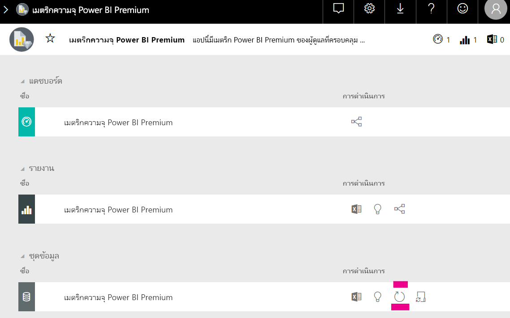

# ความจุและ SKU ในการวิเคราะห์แบบฝังของ Power BICapacity planning in Power BI embedded analytics

การคำนวณชนิดของความจุที่จำเป็นสำหรับการปรับใช้การวิเคราะห์แบบฝังของ Power BI อาจซับซ้อนได้Calculating what type of capacity is needed for a Power BI embedded analytics deployment, can be complicated. ทั้งนี้ เนื่องจากการคำนวณนี้จะขึ้นอยู่กับพารามิเตอร์หลายพารามิเตอร์ ซึ่งยากต่อการคาดการณ์บางส่วนThis is because this calculation is based on multiple parameters, some of them hard to predict.

บางสิ่งที่ต้องคำนึงถึงเมื่อวางแผนความจุของคุณ:Some of the things to take into consideration when planning your capacity are:

* รูปแบบข้อมูลที่คุณกำลังใช้The data models you're using
* ตัวเลขและความซับซ้อนของคิวรีที่จำเป็นThe number and complexity of required queries
* การแจกจ่ายรายชั่วโมงของการใช้งานแอปพลิเคชันของคุณThe hourly distribution of the usage of your application
* อัตราการรีเฟรชข้อมูลData refresh rates
* รูปแบบการใช้งานเพิ่มเติมที่ยากต่อการคาดการณ์Additional usage patterns that are hard to predict.

บทความนี้ออกแบบมาเพื่อทำให้การวางแผนกำลังการผลิตสำหรับการวิเคราะห์แบบฝังตัวของ Power BI ง่ายขึ้นโดยการแนะนำ [เครื่องมือประเมินการโหลดความจุ Power BI](https://github.com/microsoft/PowerBI-Tools-For-Capacities/tree/master/LoadTestingPowerShellTool/) ที่สร้างขึ้นสำหรับการทดสอบโหลดอัตโนมัติสำหรับความสามารถในการวิเคราะห์แบบฝังตัวของ Power BI (*A* *EM* หรือ *P* SKUs)This article is designed to make capacity planning for Power BI embedded analytics easier, by introducing the [Power BI Capacity Load Assessment Tool](https://github.com/microsoft/PowerBI-Tools-For-Capacities/tree/master/LoadTestingPowerShellTool/), created for automating load testing for Power BI embedded analytics capacities (*A*, *EM* or *P* SKUs).

## เครื่องมือการวางแผนPlanning tool

 [เครื่องมือการประเมินความจุของ Power BI](https://github.com/microsoft/PowerBI-Tools-For-Capacities/tree/master/LoadTestingPowerShellTool/) สามารถช่วยให้คุณเข้าใจว่าผู้ใช้โหลดความจุของคุณได้มากเพียงใดThe [Power BI Capacity Load Assessment Tool](https://github.com/microsoft/PowerBI-Tools-For-Capacities/tree/master/LoadTestingPowerShellTool/) can help you understand how much user load your capacity can handle. ใช้ PowerShell เพื่อสร้างการทดสอบการโหลดอัตโนมัติกับความจุของคุณ และช่วยให้คุณสามารถเลือกรายงานที่จะทดสอบและจำนวนผู้ใช้พร้อมกันหลายรายที่จะจำลองได้It uses PowerShell to create automated load tests against your capacities, and lets you choose which reports to test, and how many concurrent users to simulate.

เครื่องมือสร้างการโหลดความจุโดยการแสดงรายงานแต่ละครั้งอย่างต่อเนื่องด้วยค่าตัวกรองใหม่ (เพื่อป้องกันไม่ให้ประสิทธิภาพที่ดีเกินจริงรายงานแคช) จนโทเค็นที่จำเป็นสำหรับการตรวจสอบความถูกต้องของเครื่องมือกับบริการหมดอายุThe tool generates load on a capacity by continuously rendering each report with new filter values (to prevent unrealistically good performance due to report caching), until the token required for authenticating the tool against the service, expires.

### การใช้เครื่องมือการวางแผนUsing the planning tool

เมื่อเรียกใช้เครื่องมือ ให้ระวังการโหลดที่มีอยู่บนความจุของคุณและตรวจสอบให้แน่ใจว่าไม่ได้เรียกใช้การทดสอบการโหลดในช่วงเวลาการใช้งานสูงสุดWhen running the tool, be mindful of the existing load on your capacities and make sure not to run load tests during top usage times.

ต่อไปนี้คือตัวอย่างของวิธีที่คุณสามารถใช้เครื่องมือการวางแผนได้Here are some examples of how you can use the planning tool.

* ผู้ดูแลความจุสามารถรู้จำนวนผู้ใช้ที่สามารถจัดการได้ในรอบเวลาที่กำหนดได้ดีขึ้นได้Capacity administrators can get a better understanding of how many users their capacity can handle in a given time frame.
* ผู้เขียนรายงานสามารถทำความเข้าใจลักษณะการทำงานของการโหลด โดยใช้การวัดด้วย[ตัววิเคราะห์ประสิทธิภาพ](../../create-reports/desktop-performance-analyzer.md)ของ Power BI desktopReport authors can understand the user load effect, as measured with Power BI desktop's [Performance Analyzer](../../create-reports/desktop-performance-analyzer.md).
* คุณสามารถเห็นการแสดงผลที่เกิดขึ้นตามเวลาจริงบนเบราว์เซอร์ของคุณได้You can see renders happening in real time on your browser.
* ในการใช้ตัวสร้างโพรไฟล์ของ SQL Server คุณสามารถ[เชื่อมต่อกับปลายทาง XMLA](https://powerbi.microsoft.com/blog/power-bi-open-platform-connectivity-with-xmla-endpoints-public-preview/) ของความจุที่วัดเพื่อดูคิวรีที่กำลังดำเนินการได้Using SQL Server Profiler, you can [connect to the XMLA endpoints](https://powerbi.microsoft.com/blog/power-bi-open-platform-connectivity-with-xmla-endpoints-public-preview/) of the capacities being measured, to see the queries being executed.
* ผลการทดสอบการโหลดจะปรากฏในหน้าชุดข้อมูลแอปเมตริกของความจุแบบพรีเมียมThe load test effects are visible in the premium capacity metrics app's Datasets page. ผู้ดูแลความจุสามารถใช้เครื่องมือนี้เพื่อสร้างการโหลดและดูว่าการโหลดจะแสดงขึ้นได้อย่างไรได้Capacity admins can use this tool to generate load, and see how that load shows up.

### ตรวจทานผลการทดสอบReviewing the test results

หากต้องการดูผลกระทบของการทดสอบการโหลดในแอปเมตริกหลังจากการทดสอบ ให้ทำตามคำแนะนำด้านล่างTo see the effects of the load test in the metrics app after the test runs, follow the instructions below. คาดว่าจะมีความล่าช้า 15 นาทีตั้งแต่เวลาที่การทดสอบเริ่มสร้างการโหลด จนกว่าเวลาที่โหลดจะปรากฏในเมตริกExpect up to a 15 minutes lag from the time the test starts generating load, until the time the load is visible in the metrics.

1. ขยายแถบ **ชุดข้อมูล** ของหน้าเริ่มต้น [แอปเมตริก](../../admin/service-admin-premium-monitor-capacity.md)ของคุณExpand the **Datasets** tab of your [metrics app](../../admin/service-admin-premium-monitor-capacity.md) landing page.
2. เริ่มต้นการรีเฟรชตามความต้องการโดยการคลิก **รีเฟรชทันที**Initiate an on-demand refresh by clicking **refresh now**. ผู้ดูแลระบบควรAdmins should.

    

## เครื่องมือความจุของ Power BI ที่เก็บ GitHubPower BI capacity tools GitHub repository

เครื่องมือความจุของ [Power BI ที่เก็บ GitHub](https://github.com/microsoft/PowerBI-Tools-For-Capacities) ถูกสร้างขึ้นเพื่อโฮสต์เครื่องมือการวางแผนความจุและเครื่องมือและโปรแกรมอรรถประโยชน์อื่นๆ ในอนาคตThe [Power BI capacity tools GitHub repository](https://github.com/microsoft/PowerBI-Tools-For-Capacities) was created to host the capacity planning tool and other future tools and utilities.

ที่เก็บข้อมูลเป็นโอเพ่นซอร์สและผู้ใช้ควรได้รับการสนับสนุน มีส่วนร่วม เพิ่มเครื่องมือเพิ่มเติมที่เกี่ยวข้องกับ Power BI Premium และความสามารถในการฝังและปรับปรุงเครื่องมือเดิมที่มีอยู่The repository is open source and users are encouraged to contribute, add additional tools related to Power BI Premium and Embedded capacities, and improve the existing ones.

## ขั้นตอนถัดไปNext steps

> [!div class="nextstepaction"]
>[ความจุและ SKU ในการวิเคราะห์แบบฝังตัวของ Power BICapacity and SKUs in Power BI embedded analytics](embedded-capacity.md)

> [!div class="nextstepaction"]
>[แนวทางปฏิบัติที่ดีที่สุดเพื่อประสิทธิภาพการทำงานของ Power BI EmbeddedPower BI Embedded performance best practices](embedded-performance-best-practices.md)