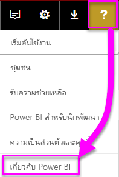
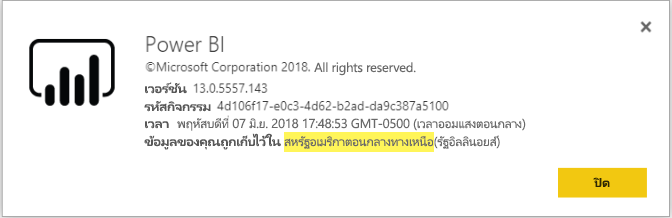

# <a name="frequently-asked-questions-about-power-bi-embedded"></a><span data-ttu-id="3e087-103">คำถามที่ถามบ่อยเกี่ยวกับ Power BI Embedded</span><span class="sxs-lookup"><span data-stu-id="3e087-103">Frequently asked questions about Power BI Embedded</span></span>

* <span data-ttu-id="3e087-104">ถ้าคุณมีคำถามอื่น [ลองถามชุมชน Power BI](https://community.powerbi.com/)</span><span class="sxs-lookup"><span data-stu-id="3e087-104">If you have other questions, [try asking the Power BI Community](https://community.powerbi.com/).</span></span>
* <span data-ttu-id="3e087-105">ยังคงมีปัญหาใช่หรือไม่?</span><span class="sxs-lookup"><span data-stu-id="3e087-105">Still have an issue?</span></span> <span data-ttu-id="3e087-106">โปรดเยี่ยมชม[หน้าการสนับสนุน Power BI](https://powerbi.microsoft.com/support/)</span><span class="sxs-lookup"><span data-stu-id="3e087-106">Visit the [Power BI support page](https://powerbi.microsoft.com/support/).</span></span>

## <a name="general"></a><span data-ttu-id="3e087-107">ทั่วไป</span><span class="sxs-lookup"><span data-stu-id="3e087-107">General</span></span>

### <a name="what-is-power-bi-embedded"></a><span data-ttu-id="3e087-108">Power BI Embedded คืออะไร?</span><span class="sxs-lookup"><span data-stu-id="3e087-108">What is Power BI Embedded?</span></span>

<span data-ttu-id="3e087-109">[Microsoft Power BI Embedded (PBIE)](azure-pbie-what-is-power-bi-embedded.md)อนุญาตให้นักพัฒนาแอปพลิเคชันฝังรายงานที่โต้ตอบได้อย่างน่าทึ่งลงในแอปพลิเคชัน โดยไม่ต้องสร้างภาพและการควบคุมของตัวเองใหม่ทั้งหมด</span><span class="sxs-lookup"><span data-stu-id="3e087-109">[Microsoft Power BI Embedded (PBIE)](azure-pbie-what-is-power-bi-embedded.md) allows application developers to embed stunning, fully interactive reports into their applications without having to build their own data visualizations and controls from scratch.</span></span>

### <a name="who-is-the-target-audience-for-power-bi-embedded"></a><span data-ttu-id="3e087-110">ใครคือกลุ่มเป้าหมายสำหรับ Power BI Embedded?</span><span class="sxs-lookup"><span data-stu-id="3e087-110">Who is the target audience for Power BI Embedded?</span></span>

<span data-ttu-id="3e087-111">นักพัฒนาและบริษัทซอฟต์แวร์ หรือที่เรียกกันว่า ผู้จัดจำหน่ายซอฟต์แวร์อิสระ (ISV) แอปพลิเคชันการเข้ารหัส</span><span class="sxs-lookup"><span data-stu-id="3e087-111">Developers and software companies, also known as independent software vendors (ISVs), coding applications.</span></span>

### <a name="how-is-power-bi-embedded-different-from-power-bi-the-service"></a><span data-ttu-id="3e087-112">Power BI Embedded แตกต่างจากบริการของ Power BI อย่างไร?</span><span class="sxs-lookup"><span data-stu-id="3e087-112">How is Power BI Embedded different from Power BI the service?</span></span>

<span data-ttu-id="3e087-113">Power BI คือโซลูชันการให้บริการซอฟต์แวร์การวิเคราะห์ ที่ช่วยให้องค์กรของพวกเขามีภาพเดียวกันสำหรับข้อมูลทางธุรกิจที่สำคัญที่สุดของพวกเขา</span><span class="sxs-lookup"><span data-stu-id="3e087-113">Power BI is a software-as-a-service analytics solution that gives organizations a single view of their most critical business data.</span></span>

<span data-ttu-id="3e087-114">Microsoft ที่พัฒนา Power BI Embedded สำหรับ ISV อาจต้องการฝังภาพลงในแอปพลิเคชันของตนเพื่อช่วยให้ลูกค้าสามารถทำการตัดสินใจเชิงวิเคราะห์ได้</span><span class="sxs-lookup"><span data-stu-id="3e087-114">Microsoft developed Power BI Embedded for ISVs wanting to embed visuals into their applications to help their customers make analytic decisions.</span></span> <span data-ttu-id="3e087-115">ส่วนนี้จะช่วยให้ ISV ไม่ต้องสร้างโซลูชันการวิเคราะห์ของตนเอง</span><span class="sxs-lookup"><span data-stu-id="3e087-115">This spares ISVs from having to build their own analytics' solution themselves.</span></span> <span data-ttu-id="3e087-116">[การวิเคราะห์ที่ฝังตัว](embedding.md) ช่วยให้ผู้ใช้ทางธุรกิจสามารถเข้าถึงข้อมูลธุรกิจ และดำเนินการสอบถามเพื่อสร้างข้อมูลเชิงลึกภายในแอปพลิเคชัน</span><span class="sxs-lookup"><span data-stu-id="3e087-116">[Embedded analytics](embedding.md) enables business users to access business data and execute queries against it to generate insights within the application.</span></span>

### <a name="what-is-the-difference-between-power-bi-premium-and-power-bi-embedded"></a><span data-ttu-id="3e087-117">อะไรคือความแตกต่างระหว่าง Power BI Premium และ Power BI Embedded?</span><span class="sxs-lookup"><span data-stu-id="3e087-117">What is the difference between Power BI Premium and Power BI Embedded?</span></span>

<span data-ttu-id="3e087-118">Power BI Premium มีความจุที่ปรับให้เหมาะกับองค์กร ที่ต้องการโซลูชัน BI ที่สมบูรณ์ ที่ให้มุมมองเดียวกันแก่ หน่วยงาน คู่ค้า ลูกค้า และผู้จัดหาสินค้าขององค์กร</span><span class="sxs-lookup"><span data-stu-id="3e087-118">Power BI Premium is capacity geared toward enterprises who want a complete BI solution that provides a single view of its organization, partners, customers, and suppliers.</span></span> <span data-ttu-id="3e087-119">Power BI Premium ช่วยให้องค์กรของคุณตัดสินใจ</span><span class="sxs-lookup"><span data-stu-id="3e087-119">Power BI Premium helps your organization make decisions.</span></span> <span data-ttu-id="3e087-120">Power BI Premium เป็นผลิตภัณฑ์ SaaS ที่ให้ผู้ใช้สามารถใช้เนื้อหาผ่านทางแอปสำหรับอุปกรณ์เคลื่อนที่ แอปที่พัฒนาขึ้นเองภายใน หรือที่พอร์ทัล Power BI</span><span class="sxs-lookup"><span data-stu-id="3e087-120">Power BI Premium is a SaaS product that allows users to consume content through mobile apps, internally developed apps, or at the Power BI portal.</span></span>

<span data-ttu-id="3e087-121">Power BI Embedded มีไว้สำหรับ ISV ที่ต้องการฝังภาพลงในแอปพลิเคชันของตน</span><span class="sxs-lookup"><span data-stu-id="3e087-121">Power BI Embedded is for ISVs who want to embed visuals into their applications.</span></span> <span data-ttu-id="3e087-122">Power BI Embedded ช่วยการตัดสินใจของลูกค้าคุณ เนื่องจาก Power BI Embedded ออกแบบมาสำหรับนักพัฒนาแอปพลิเคชัน ลูกค้าของแอปพลิเคชันนั้นสามารถใช้เนื้อหาที่เก็บไว้ในความจุของ Power BI Embedded รวมไปถึงทุกคนภายใน หรือภายนอกองค์กร</span><span class="sxs-lookup"><span data-stu-id="3e087-122">Power BI Embedded helps your customers make decisions because Power BI Embedded is for application developers, customers of that application can consume content stored on Power BI Embedded capacity, including anyone inside or outside the organization.</span></span> <span data-ttu-id="3e087-123">คุณไม่สามารถแชร์เนื้อหาความจุใน Power BI Embedded ผ่านการ การเผยแพร่ไปยังเว็บแบบคลิกเดียว หรือการเผยแพร่ไปยัง SharePoint แบบคลิกเดียว</span><span class="sxs-lookup"><span data-stu-id="3e087-123">You can't share Power BI Embedded capacity content through one-click publish to Web or one-click publish to SharePoint.</span></span>

### <a name="what-is-the-microsoft-recommendation-for-when-a-customer-should-buy-power-bi-premium-vs-power-bi-embedded"></a><span data-ttu-id="3e087-124">Microsoft จะแนะนำลูกค้าอย่างไร ว่าเมื่อไหร่ที่ลูกค้าควรซื้อ Power BI Embedded Premium เทียบกับ Power BI Embedded</span><span class="sxs-lookup"><span data-stu-id="3e087-124">What is the Microsoft recommendation for when a customer should buy Power BI Premium vs. Power BI Embedded?</span></span>

<span data-ttu-id="3e087-125">Microsoft แนะนำให้องค์กรซื้อ Power BI Premium ซึ่งเป็นโซลูชัน BI ระบบคลาวด์แบบบริการตนเองในระดับองค์กร</span><span class="sxs-lookup"><span data-stu-id="3e087-125">Microsoft recommends that enterprises buy Power BI Premium, an enterprise-grade, self-service cloud BI solution.</span></span> <span data-ttu-id="3e087-126">เราขอแนะนำให้ ISV ซื้อ Power BI Embedded สำหรับคอมโพเนนต์การวิเคราะห์ที่ฝังตัวระบบคลาวด์วิเคราะห์</span><span class="sxs-lookup"><span data-stu-id="3e087-126">We recommend ISVs buy Power BI Embedded for its cloud-powered embedded analytics components.</span></span> <span data-ttu-id="3e087-127">อย่างไรก็ตาม ลูกค้าไม่มีข้อจำกัดในการซื้อผลิตภัณฑ์ใด ๆ</span><span class="sxs-lookup"><span data-stu-id="3e087-127">However, a customer has no restriction on which product to buy.</span></span>

<span data-ttu-id="3e087-128">อาจมีบางกรณีที่ ISV (มักมีขนาดใหญ่) ต้องการใช้ P SKU เพื่อรับประโยชน์เพิ่มเติมของบริการของ Power BI ที่รวมให้อยู่แล้วภายในองค์กรของพวกเขา นอกเหนือจากการฝังแอป</span><span class="sxs-lookup"><span data-stu-id="3e087-128">There may be some cases where an ISV (typically large), in addition to app embedding, wants to use a P SKU to get the additional benefits of the pre-packaged Power BI service within their organization.</span></span> <span data-ttu-id="3e087-129">บางองค์กรอาจตัดสินใจที่จะใช้ A SKU ใน Azure หากพวกเขาสนใจเฉพาะการสร้างแอปพลิเคชันทางธุรกิจ และการฝังการวิเคราะห์ลงไป และไม่สนใจที่จะใช้บริการ Power BI ที่รวมให้อยู่แล้ว</span><span class="sxs-lookup"><span data-stu-id="3e087-129">Some enterprises may decide to use A SKUs in Azure if they're only interested in building line-of-business applications and embedding analytics into them and aren't interested in using the pre-packaged Power BI service.</span></span>

### <a name="how-many-embed-tokens-can-i-create"></a><span data-ttu-id="3e087-130">ฉันสามารถสร้างโทเค็นฝังตัวได้มากแค่ไหน?</span><span class="sxs-lookup"><span data-stu-id="3e087-130">How many embed tokens can I create?</span></span>

<span data-ttu-id="3e087-131">โทเค็นแบบฝังตัวที่มีใบอนุญาต PRO มีไว้สำหรับทดสอบการพัฒนา ดังนั้น บัญชีหลัก Power BI หรือ[โครงร่างสำคัญของบริการ](embed-service-principal.md) จึงสามารถสร้างจำนวนโทเค็นฝังตัวได้อย่างจำกัดเท่านั้น</span><span class="sxs-lookup"><span data-stu-id="3e087-131">Embed tokens with PRO license are intended for development testing, so a Power BI master account or [service principal](embed-service-principal.md) can only generate a limited number of tokens.</span></span> <span data-ttu-id="3e087-132">[ซื้อความจุ](#technical)สำหรับการฝังตัวในสภาพแวดล้อมการทำงานจริง</span><span class="sxs-lookup"><span data-stu-id="3e087-132">[Purchase a capacity](#technical) for embedding in a production environment.</span></span> <span data-ttu-id="3e087-133">ไม่มีข้อจำกัดเกี่ยวกับจำนวนโทเค็นฝังตัวที่คุณสามารถสร้างขึ้นเมื่อซื้อความจุแล้ว</span><span class="sxs-lookup"><span data-stu-id="3e087-133">There's no limit to how many embed tokens you can generate when you purchase a capacity.</span></span> <span data-ttu-id="3e087-134">ไปยัง[คุณลักษณะที่มี](/rest/api/power-bi/availablefeatures) เพื่อตรวจสอบค่าการใช้งาน ที่สามารถบอกได้ว่าปัจจุบันมีการใช้งานฝังตัวแล้วกี่เปอร์เซ็นต์</span><span class="sxs-lookup"><span data-stu-id="3e087-134">Go to [Available Features](/rest/api/power-bi/availablefeatures) to check the usage value that indicates the current embedded usage in percentage.</span></span>

## <a name="technical"></a><span data-ttu-id="3e087-135">ทางเทคนิค</span><span class="sxs-lookup"><span data-stu-id="3e087-135">Technical</span></span>

### <a name="where-can-i-learn-more-about-capacity-and-skus-in-power-bi-embedded-analytics"></a><span data-ttu-id="3e087-136">ฉันจะเรียนรู้เพิ่มเติมเกี่ยวกับความจุและ SKU ในการวิเคราะห์แบบฝังตัวด้วย Power BI ได้จากที่ใด</span><span class="sxs-lookup"><span data-stu-id="3e087-136">Where can I learn more about capacity and SKUs in Power BI embedded analytics?</span></span>

<span data-ttu-id="3e087-137">โปรดดูที่บทความ [ความจุและ SKU ในการวิเคราะห์แบบฝังตัวด้วย Power BI](embedded-capacity.md)</span><span class="sxs-lookup"><span data-stu-id="3e087-137">Refer to the [Capacity and SKUs in Power BI embedded analytics](embedded-capacity.md) article.</span></span>

### <a name="what-are-the-prerequisites-for-creating-a-pbie-capacity-in-azure"></a><span data-ttu-id="3e087-138">ข้อกำหนดเบื้องต้นในการสร้างความจุ PBIE ใน Azure มีอะไรบ้าง</span><span class="sxs-lookup"><span data-stu-id="3e087-138">What are the prerequisites for creating a PBIE capacity in Azure?</span></span>

* <span data-ttu-id="3e087-139">ลงชื่อเข้าใช้ไดเรกทอรีขององค์กรของคุณ (ไม่รองรับบัญชี Microsoft)</span><span class="sxs-lookup"><span data-stu-id="3e087-139">Sign in to your organizational directory (Microsoft accounts aren't supported).</span></span>
* <span data-ttu-id="3e087-140">คุณจำเป็นต้องมีผู้เช่า Power BI อย่างน้อยหนึ่งคนในไดเรกทอรีของคุณลงทะเบียนสำหรับ Power BI</span><span class="sxs-lookup"><span data-stu-id="3e087-140">You need to have a Power BI tenant, that is, at least one user in your directory has signed up for Power BI.</span></span> 
* <span data-ttu-id="3e087-141">คุณต้องมีการสมัครใช้งาน Azure ในไดเรกทอรีขององค์กรของคุณ</span><span class="sxs-lookup"><span data-stu-id="3e087-141">You need to have an Azure subscription in your organizational directory.</span></span>

### <a name="how-can-i-monitor-power-bi-embedded-capacity-consumption"></a><span data-ttu-id="3e087-142">ฉันสามารถตรวจสอบปริมาณการใช้ความจุของ Power BI Embedded ได้อย่างไร</span><span class="sxs-lookup"><span data-stu-id="3e087-142">How can I monitor Power BI Embedded capacity consumption?</span></span>

* <span data-ttu-id="3e087-143">ใช้[พอร์ทัลผู้ดูแลระบบ Power BI](../../admin/service-admin-portal.md#power-bi-embedded)</span><span class="sxs-lookup"><span data-stu-id="3e087-143">Using the [Power BI Admin portal](../../admin/service-admin-portal.md#power-bi-embedded).</span></span>

* <span data-ttu-id="3e087-144">ดาวน์โหลด[แอปเมตริก](../../admin/service-admin-premium-monitor-capacity.md)ใน Power BI</span><span class="sxs-lookup"><span data-stu-id="3e087-144">Downloading the [metric app](../../admin/service-admin-premium-monitor-capacity.md) in Power BI.</span></span>

* <span data-ttu-id="3e087-145">ใช้[การบันทึกการวินิจฉัย Azure](azure-pbie-diag-logs.md)</span><span class="sxs-lookup"><span data-stu-id="3e087-145">Using [Azure diagnostic logging](azure-pbie-diag-logs.md).</span></span>

### <a name="can-my-capacity-scale-automatically-to-adjust-to-my-app-consumption"></a><span data-ttu-id="3e087-146">ความจุของฉันสามารถปรับตามปริมาณการใช้แอปของฉันได้ตามอัตโนมัติหรือไม่</span><span class="sxs-lookup"><span data-stu-id="3e087-146">Can my capacity scale automatically to adjust to my app consumption?</span></span>

<span data-ttu-id="3e087-147">ขณะนี้ยังไม่มีการปรับขนาดโดยอัตโนมัติ แต่ API ทั้งหมดสามารถปรับขนาดได้ทุกเวลา</span><span class="sxs-lookup"><span data-stu-id="3e087-147">While there's no automatic scaling now, all the APIs are available to scale at any time.</span></span>

### <a name="why-creatingscalingresuming-a-capacity-results-in-putting-the-capacity-into-a-suspended-state"></a><span data-ttu-id="3e087-148">ทำไม การสร้าง/ปรับขนาด/กลับมาใช้ความจุทำให้ความจุอยู่ในสถานะถูกระงับชั่วคราว?</span><span class="sxs-lookup"><span data-stu-id="3e087-148">Why creating/scaling/resuming a capacity results in putting the capacity into a suspended state?</span></span>

<span data-ttu-id="3e087-149">การจัดความจุ (ปรับขนาด/กลับมาใช้/สร้าง) อาจล้มเหลว</span><span class="sxs-lookup"><span data-stu-id="3e087-149">Capacity provisioning (scale/resume/create) may fail.</span></span> <span data-ttu-id="3e087-150">คุณสามารถใช้ API รับรายละเอียดเพื่อตรวจสอบสถานะการจัดความจุได้: [ความจุ - รับรายละเอียด](/rest/api/power-bi-embedded/capacities/getdetails)</span><span class="sxs-lookup"><span data-stu-id="3e087-150">You can use the Get Details API to check a capacity's ProvisioningState: [Capacities - Get Details](/rest/api/power-bi-embedded/capacities/getdetails).</span></span>

### <a name="can-i-only-create-power-bi-embedded-capacities-in-a-specific-region"></a><span data-ttu-id="3e087-151">ฉันสามารถสร้างความจุแบบฝังตัวของ Power BI ในพื้นที่เฉพาะได้หรือไม่</span><span class="sxs-lookup"><span data-stu-id="3e087-151">Can I only create Power BI Embedded capacities in a specific region?</span></span>

<span data-ttu-id="3e087-152">ด้วยคุณลักษณะ[หลายภูมิศาสตร์ (ตัวอย่าง)](embedded-multi-geo.md) คุณสามารถซื้อ[ความจุแบบฝังตัวของ Power BI](azure-pbie-create-capacity.md) ในภูมิภาคอื่นนอกจากตำแหน่งที่ตั้งหลักของผู้เช่า Power BI ของคุณ</span><span class="sxs-lookup"><span data-stu-id="3e087-152">With the [Multi-geo (Preview)](embedded-multi-geo.md) feature, you can purchase a [Power BI Embedded capacity](azure-pbie-create-capacity.md) in a different region than your Power BI home tenant location</span></span>

### <a name="why-cant-i-see-a-workspace-although-i-have-permissions"></a><span data-ttu-id="3e087-153">ทำไมฉันจึงไม่เห็นพื้นที่ทำงานแม้ว่าฉันมีสิทธิ์ก็ตาม</span><span class="sxs-lookup"><span data-stu-id="3e087-153">Why can't I see a workspace although I have permissions?</span></span>

<span data-ttu-id="3e087-154">เมื่อผู้ใช้ได้รับสิทธิ์ในพื้นที่ทำงาน แอป หรือวัตถุ สิทธิ์นั้นอาจยังไม่พร้อมใช้งานทันทีผ่านการเรียกใช้ API</span><span class="sxs-lookup"><span data-stu-id="3e087-154">When a user is granted permissions to a workspace, app, or artifact, it might not be immediately available through API calls.</span></span>
<span data-ttu-id="3e087-155">ผลลัพธ์อาจเป็นวัตถุหายไปในการตอบสนอง API 'ได้รับ' หรือข้อผิดพลาดเมื่อพยายามใช้วัตถุ</span><span class="sxs-lookup"><span data-stu-id="3e087-155">The result can either be a missing artifact in a 'GET' API response, or an error when trying to use the artifact.</span></span>
<span data-ttu-id="3e087-156">ผู้ใช้สามารถแก้ไขปัญหานี้ได้โดยการเรียกใช้ [refreshUserPermissions API](/rest/api/power-bi/users/refreshuserpermissions) ซึ่งจะอัปเดตสิทธิ์ของผู้ใช้</span><span class="sxs-lookup"><span data-stu-id="3e087-156">The user can resolve this issue by calling [refreshUserPermissions API](/rest/api/power-bi/users/refreshuserpermissions), which updates the user permissions.</span></span>


### <a name="how-can-i-find-my-pbi-tenant-region"></a><span data-ttu-id="3e087-157">ฉันสามารถค้นหาภูมิภาคผู้เช่า PBI ของฉันได้อย่างไร</span><span class="sxs-lookup"><span data-stu-id="3e087-157">How can I find my PBI tenant region?</span></span>

<span data-ttu-id="3e087-158">คุณสามารถใช้พอร์ทัล PBI เพื่อค้นหาภูมิภาคผู้เช่า PBI ของคุณได้</span><span class="sxs-lookup"><span data-stu-id="3e087-158">You can use the PBI portal to find your PBI Tenant region.</span></span>

<span data-ttu-id="3e087-159">`https://app.powerbi.com/` > ?</span><span class="sxs-lookup"><span data-stu-id="3e087-159">`https://app.powerbi.com/` > ?</span></span> <span data-ttu-id="3e087-160">เกี่ยวกับ Power BI</span><span class="sxs-lookup"><span data-stu-id="3e087-160">> About Power BI</span></span>

<span data-ttu-id="3e087-161">
</span><span class="sxs-lookup"><span data-stu-id="3e087-161">
</span></span>

### <a name="what-does-the-cloud-solution-provider-csp-channel-support"></a><span data-ttu-id="3e087-162">สิ่งที่ได้รับการสนับสนุนช่อง Cloud Solution Provide (CSP) คืออะไร</span><span class="sxs-lookup"><span data-stu-id="3e087-162">What does the Cloud Solution Provider (CSP) channel support?</span></span>

* <span data-ttu-id="3e087-163">คุณสามารถสร้าง PBIE ให้ผู้เช่าของคุณด้วยการสมัครใช้งานชนิด CSP</span><span class="sxs-lookup"><span data-stu-id="3e087-163">You can create PBIE for your tenant with subscription type CSP</span></span>
* <span data-ttu-id="3e087-164">บัญชีคู่ค้าสามารถลงชื่อเข้าใช้ในนามผู้เช่าของลูกค้า และซื้อ PBIE สำหรับผู้เช่าของลูกค้า กำหนดให้ผู้ใช้ที่เป็นผู้เช่าของลูกค้าเป็นผู้ดูแลความจุ Power BI</span><span class="sxs-lookup"><span data-stu-id="3e087-164">Partner account can sign in to customer tenant and purchase PBIE for customer tenant, specify customer tenant user as Power BI capacity admin</span></span>

### <a name="why-do-i-get-an-unsupported-account-message"></a><span data-ttu-id="3e087-165">เหตุใดฉันจึงได้รับข้อความว่า เป็นบัญชีที่ไม่สนับสนุน</span><span class="sxs-lookup"><span data-stu-id="3e087-165">Why do I get an unsupported account message?</span></span>

<span data-ttu-id="3e087-166">Power BI ให้คุณต้องลงทะเบียนด้วยบัญชีผู้ใช้ขององค์กร</span><span class="sxs-lookup"><span data-stu-id="3e087-166">Power BI requires you to sign up with an organizational account.</span></span> <span data-ttu-id="3e087-167">ไม่รองรับการลงทะเบียน Power BI โดยใช้บัญชี Microsoft</span><span class="sxs-lookup"><span data-stu-id="3e087-167">Trying to sign up for Power BI using a Microsoft account isn't supported.</span></span>

### <a name="can-i-use-apis-to-create-and-manage-azure-capacities"></a><span data-ttu-id="3e087-168">ฉันสามารถใช้ API สร้างและจัดการความจุ Azure ได้หรือไม่</span><span class="sxs-lookup"><span data-stu-id="3e087-168">Can I use APIs to create and manage Azure capacities?</span></span>

<span data-ttu-id="3e087-169">ใช่ มีทั้ง PowerShell cmdlets และ Azure Resource Manager REST APIs ที่คุณสามารถใช้สร้างและจัดการทรัพยากร PBIE</span><span class="sxs-lookup"><span data-stu-id="3e087-169">Yes, there are PowerShell cmdlets and Azure Resource Manager REST APIs you can use to create and manage PBIE resources.</span></span>

* [<span data-ttu-id="3e087-170">REST API</span><span class="sxs-lookup"><span data-stu-id="3e087-170">Rest APIs</span></span>](/rest/api/power-bi-embedded/) 
* [<span data-ttu-id="3e087-171">cmdlets ของ PowerShell</span><span class="sxs-lookup"><span data-stu-id="3e087-171">PowerShell cmdlets</span></span>](/powershell/module/azurerm.powerbiembedded/)

### <a name="what-is-the-pbi-embedded-capacity-role-in-a-pbi-embedded-solution"></a><span data-ttu-id="3e087-172">บทบาทความจุแบบฝังตัวของ PBI ในโซลูชันแบบฝังตัวของ PBI คืออะไร</span><span class="sxs-lookup"><span data-stu-id="3e087-172">What is the PBI Embedded capacity role in a PBI Embedded solution?</span></span>

<span data-ttu-id="3e087-173">หากต้องการ [เลื่อนระดับโซลูชันของคุณเป็นการผลิต](move-to-production.md) คุณต้องกำหนดเนื้อหาของ Power BI (พื้นที่ทำงาน) ที่แอปพลิเคชันของคุณใช้กับความจุ Power BI Embedded (A SKU)</span><span class="sxs-lookup"><span data-stu-id="3e087-173">To [promote your solution to production](move-to-production.md), you need to assign the Power BI content (workspace) your application uses to a Power BI Embedded (A SKU) capacity.</span></span>

### <a name="in-what-azure-regions-is-pbi-embedded-available"></a><span data-ttu-id="3e087-174">ภูมิภาค Azure ใดที่การฝัง PBI สามารถใช้งานได้</span><span class="sxs-lookup"><span data-stu-id="3e087-174">In what Azure regions is PBI Embedded available?</span></span>

<span data-ttu-id="3e087-175">[PAM](https://ecosystemmanager.azurewebsites.net/home) (EcoManager) - ดูตัวจัดการความพร้อมใช้งานผลิตภัณฑ์</span><span class="sxs-lookup"><span data-stu-id="3e087-175">[PAM](https://ecosystemmanager.azurewebsites.net/home) (EcoManager) - see Product availability manager</span></span>

<span data-ttu-id="3e087-176">ภูมิภาคที่พร้อมใช้งาน (16 - ภูมิภาคเดียวกันกับ Power BI)</span><span class="sxs-lookup"><span data-stu-id="3e087-176">Available regions (16 - same regions as Power BI)</span></span>

* <span data-ttu-id="3e087-177">สหรัฐอเมริกา (6) - สหรัฐอเมริกาตะวันออก สหรัฐอเมริกาตะวันออก 2 สหรัฐอเมริกากลางเหนือ สหรัฐอเมริกากลางใต้สหรัฐอเมริกาตะวันตก สหรัฐอเมริกาตะวันตก 2</span><span class="sxs-lookup"><span data-stu-id="3e087-177">US (6) - East US, East US 2, North Central US, South Central US, West US, West US 2</span></span>
* <span data-ttu-id="3e087-178">ยุโรป (2) - ยุโรปเหนือ ยุโรปตะวันตก</span><span class="sxs-lookup"><span data-stu-id="3e087-178">Europe (2) - North Europe, West Europe</span></span>
* <span data-ttu-id="3e087-179">เอเชียแปซิฟิก (2) - เอเชียตะวันออกเฉียงใต้ เอเชียตะวันออก</span><span class="sxs-lookup"><span data-stu-id="3e087-179">Asia Pacific (2) - Southeast Asia, East Asia</span></span>
* <span data-ttu-id="3e087-180">บราซิล (1) - บราซิลใต้</span><span class="sxs-lookup"><span data-stu-id="3e087-180">Brazil (1) - Brazil South</span></span>
* <span data-ttu-id="3e087-181">ญี่ปุ่น (1) - ญี่ปุ่นตะวันออก</span><span class="sxs-lookup"><span data-stu-id="3e087-181">Japan (1) - Japan East</span></span>
* <span data-ttu-id="3e087-182">ออสเตรเลีย (1) - ออสเตรเลียตะวันออกเฉียงใต้</span><span class="sxs-lookup"><span data-stu-id="3e087-182">Australia (1) - Australia Southeast</span></span>
* <span data-ttu-id="3e087-183">อินเดีย (1) - อินเดียตะวันตก</span><span class="sxs-lookup"><span data-stu-id="3e087-183">India (1) - West India</span></span>
* <span data-ttu-id="3e087-184">แคนาดา (1) - แคนาดาตอนกลาง</span><span class="sxs-lookup"><span data-stu-id="3e087-184">Canada (1) - Canada Central</span></span>
* <span data-ttu-id="3e087-185">สหราชอาณาจักร (1) - สหราชอาณาจักรใต้</span><span class="sxs-lookup"><span data-stu-id="3e087-185">United Kingdom (1) - UK South</span></span>

### <a name="what-is-power-bi-embeddeds-authentication-model"></a><span data-ttu-id="3e087-186">รูปแบบการรับรองความถูกต้องของ Power BI Embedded คืออะไร</span><span class="sxs-lookup"><span data-stu-id="3e087-186">What is Power BI Embedded's authentication model?</span></span>

<span data-ttu-id="3e087-187">Power BI Embedded ยังคงใช้ Azure AD สำหรับการรับรองความถูกต้องของผู้ใช้หลัก (ผู้ใช้ Power BI Pro ที่ได้รับการกำหนดสิทธิ์) หรือด้วย[บริการหลัก](embed-service-principal.md) และการรับรองความถูกต้องแอปพลิเคชันภายใน Power BI</span><span class="sxs-lookup"><span data-stu-id="3e087-187">Power BI Embedded continues to use Azure AD for master user (a designated Power BI Pro licensed user) authentication, or with [service principal](embed-service-principal.md) for authenticating the application inside Power BI.</span></span>  

 <span data-ttu-id="3e087-188">ISV สามารถดำเนินการรับรองความถูกต้องและการอนุญาตแอปพลิเคชันของตนได้</span><span class="sxs-lookup"><span data-stu-id="3e087-188">An ISV can implement their own authentication and authorization for their applications.</span></span>

<span data-ttu-id="3e087-189">คุณสามารถใช้ไดเรกทอรีที่มีอยู่ของคุณ ถ้าคุณมีผู้เช่า Azure AD อยู่แล้ว</span><span class="sxs-lookup"><span data-stu-id="3e087-189">You can use your existing directory if you already have an Azure AD tenant.</span></span> <span data-ttu-id="3e087-190">คุณยังสามารถสร้างผู้เช่า Azure AD ใหม่สำหรับความปลอดภัยของเนื้อหาแอปพลิเคชันแบบฝังตัวได้</span><span class="sxs-lookup"><span data-stu-id="3e087-190">You can also create a new Azure AD tenant for your embedded application content security.</span></span>

<span data-ttu-id="3e087-191">เพื่อรับโทเค็น AAD คุณสามารถใช้ไลบรารี [Azure Active Directory Authentication ตัวใดตัวหนึ่ง](/azure/active-directory/develop/active-directory-authentication-libraries)</span><span class="sxs-lookup"><span data-stu-id="3e087-191">To get an AAD token, you can use one of the [Azure Active Directory Authentication Libraries](/azure/active-directory/develop/active-directory-authentication-libraries).</span></span> <span data-ttu-id="3e087-192">ไลบรารีเหล่านี้เป็นไลบรารีไคลเอ็นต์ ที่พร้อมใช้งานบนหลายแพลตฟอร์ม</span><span class="sxs-lookup"><span data-stu-id="3e087-192">There are client libraries available for multiple platforms.</span></span>

### <a name="my-application-already-uses-aad-for-user-authentication-how-can-we-use-this-identity-when-authenticating-to-power-bi-in-a-user-owns-data-scenario"></a><span data-ttu-id="3e087-193">แอปพลิเคชันของฉันใช้ AAD สำหรับการรับรองความถูกต้องผู้ใช้แล้ว</span><span class="sxs-lookup"><span data-stu-id="3e087-193">My Application already uses AAD for User Authentication.</span></span> <span data-ttu-id="3e087-194">เราสามารถใช้ข้อมูลประจำตัวนี้เมื่อรับรองความถูกต้องไปยัง Power BI ในสถานการณ์ "ผู้ใช้เป็นเจ้าของข้อมูล" ได้อย่างไร?</span><span class="sxs-lookup"><span data-stu-id="3e087-194">How can we use this Identity when authenticating to Power BI in a "User Owns Data" scenario?</span></span>

<span data-ttu-id="3e087-195">ถือเป็นโฟลว์ในนามของผู้ใช้ OAuth มาตรฐาน (<https://docs.microsoft.com/azure/active-directory/develop/web-api>)</span><span class="sxs-lookup"><span data-stu-id="3e087-195">It's standard OAuth on-behalf-of flow (<https://docs.microsoft.com/azure/active-directory/develop/web-api>).</span></span> <span data-ttu-id="3e087-196">คุณจะต้องกำหนดค่าแอปพลิเคชันเพื่อร้องขอสิทธิ์ในบริการของ Power BI (ตามขอบเขตที่ต้องการ)</span><span class="sxs-lookup"><span data-stu-id="3e087-196">You need to configure your application to require Power BI service (with the required scopes) permissions.</span></span> <span data-ttu-id="3e087-197">เมื่อมีโทเค็นผู้ใช้ในแอปแล้ว คุณเพียงแค่ใช้โทเค็นการเข้าใช้ของผู้ใช้เรียกไปยัง API AcquireTokenAsync ADAL และระบุ URL ทรัพยากร Power BI เป็น ID ทรัพยากร:</span><span class="sxs-lookup"><span data-stu-id="3e087-197">Once you have a user token to your app, you simply call to ADAL API AcquireTokenAsync using the user access token and specify the Power BI resource URL as the resource ID:</span></span>

```csharp
var context = new AD.AuthenticationContext(authorityUrl);
var userAssertion = new AD.UserAssertion(userAccessToken);
var clientAssertion = new AD.ClientAssertionCertificate(MyAppId, MyAppCertificate)
var authenticationResult = await context.AcquireTokenAsync(resourceId, clientAssertion, userAssertion);
```

### <a name="what-object-id-is-the-service-principal-object-id"></a><span data-ttu-id="3e087-198">ID ออบเจ็กต์ใดที่เป็น ID ออบเจ็กต์ของโครงร่างสำคัญของบริการ</span><span class="sxs-lookup"><span data-stu-id="3e087-198">What object ID is the service principal object ID?</span></span>

<span data-ttu-id="3e087-199">*ID ออบเจ็กต์* จากหน้าจอหลักของแอปที่ลงทะเบียนเป็น ID ออบเจ็กต์สำหรับแอป</span><span class="sxs-lookup"><span data-stu-id="3e087-199">The *Object ID* from the main screen of a registered app is the object ID for the app.</span></span>

<span data-ttu-id="3e087-200">ID ออบเจ็กต์ที่พบในส่วน *แอปพลิเคชันที่จัดการในไดเรกทอรีภายใน > คุณสมบัติ* คือ ID ็อบเจ็กต์หลักของโครงร่างสำคัญของบริการที่คุณต้องใช้</span><span class="sxs-lookup"><span data-stu-id="3e087-200">The object ID found in the *Managed application in local directory > Properties* section is the service principal object ID you need to use.</span></span> <span data-ttu-id="3e087-201">ID ออบเจ็กต์นี้ใช้เพื่ออ้างอิงโครงร่างสำคัญของบริการเพื่อดำเนินการ หรือทำการเปลี่ยนแปลง ID ออบเจ็กต์ของโครงร่างสำคัญของบริการ</span><span class="sxs-lookup"><span data-stu-id="3e087-201">This object ID is to reference a service principal for operations or to make changes to the service principal object ID.</span></span> <span data-ttu-id="3e087-202">เช่น การใช้โครงร่างสำคัญของบริการในฐานะผู้ดูแลระบบไปยังพื้นที่ทำงาน</span><span class="sxs-lookup"><span data-stu-id="3e087-202">Such as applying a service principal as an admin to a workspace.</span></span>

### <a name="how-is-power-bi-embedded-different-from-other-azure-services"></a><span data-ttu-id="3e087-203">Power BI Embedded แตกต่างจากบริการอื่น ๆ ของ Azure อย่างไร?</span><span class="sxs-lookup"><span data-stu-id="3e087-203">How is Power BI Embedded different from other Azure services?</span></span>

<span data-ttu-id="3e087-204">คุณต้องมีบัญชี Power BI ก่อนที่จะซื้อ Power BI Embedded ใน Azure</span><span class="sxs-lookup"><span data-stu-id="3e087-204">You must have a Power BI account before purchasing Power BI Embedded in Azure.</span></span> <span data-ttu-id="3e087-205">ภูมิภาคที่ปรับใช้งาน Power BI Embedded ของคุณจะกำหนดบัญชี Power BI ของคุณ</span><span class="sxs-lookup"><span data-stu-id="3e087-205">Your Power BI Embedded deployed region determines your Power BI account.</span></span> <span data-ttu-id="3e087-206">จัดการทรัพยากร Power BI Embedded ของคุณใน Azure เพื่อ:</span><span class="sxs-lookup"><span data-stu-id="3e087-206">Manage your Power BI Embedded resource in Azure to:</span></span>

* <span data-ttu-id="3e087-207">Scale up/down</span><span class="sxs-lookup"><span data-stu-id="3e087-207">Scale up/down</span></span>
* <span data-ttu-id="3e087-208">เพิ่มผู้ดูแลความจุ</span><span class="sxs-lookup"><span data-stu-id="3e087-208">Add capacity admins</span></span>
* <span data-ttu-id="3e087-209">หยุดบริการ/ทำงานต่อ</span><span class="sxs-lookup"><span data-stu-id="3e087-209">Pause/resume service</span></span>

<span data-ttu-id="3e087-210">ใช้ PowerBI.com เพื่อกำหนด/ยกเลิก การกำหนดพื้นที่ทำงานให้กับความจุ Power BI Embedded ของคุณ</span><span class="sxs-lookup"><span data-stu-id="3e087-210">Use PowerBI.com to assign/un-assign workspaces to your Power BI Embedded capacity.</span></span>

### <a name="what-content-pack-data-types-can-you-embed"></a><span data-ttu-id="3e087-211">คุณสามารถฝังข้อมูลชนิดใดของชุดเนื้อหา</span><span class="sxs-lookup"><span data-stu-id="3e087-211">What content pack data types can you embed?</span></span>

<span data-ttu-id="3e087-212">คุณ *ไม่สามารถ* ฝัง **แดชบอร์ด** และ **ไทล์** ที่สร้างขึ้นจากชุดข้อมูลของชุดเนื้อหาได้</span><span class="sxs-lookup"><span data-stu-id="3e087-212">You *can't* embed **Dashboards** and **tiles** built from content pack datasets.</span></span> <span data-ttu-id="3e087-213">อย่างไรก็ตาม คุณ *สามารถ* ฝัง **รายงาน** ที่สร้างขึ้นจากชุดข้อมูลของชุดเนื้อหาได้</span><span class="sxs-lookup"><span data-stu-id="3e087-213">However, you *can* embed **reports** built from a content pack dataset.</span></span>

### <a name="what-is-the-difference-between-using-row-level-security-rls-vs-javascript-filters"></a><span data-ttu-id="3e087-214">อะไรคือความแตกต่างระหว่างการใช้ความปลอดภัยระดับแถว (Row-level security, RLS) เปรียบเทียบกับ ตัวกรอง JavaScript?</span><span class="sxs-lookup"><span data-stu-id="3e087-214">What is the difference between using row-level security (RLS) vs. JavaScript filters?</span></span>

<span data-ttu-id="3e087-215">มักจะมีความสับสนเกี่ยวกับเวลาที่จะใช้ RLS กับตัวกรอง JavaScript สาเหตุเพราะวิธีหนึ่งเน้นควบคุมการมองเห็นของผู้ใช้ที่ถูกระบุเฉพาะ และอีกอันหนึ่งเน้นเกี่ยวกับการปรับมุมมองของผู้ใช้ให้เหมาะสม</span><span class="sxs-lookup"><span data-stu-id="3e087-215">There's often confusion around when to use RLS versus JavaScript filters, because one method is about controlling what a specific user can see, and the other is about optimizing the user's view.</span></span>

<span data-ttu-id="3e087-216">สำหรับ RLS นักพัฒนา ISV ควบคุมกรองให้เป็นส่วนหนึ่งของการสร้างแบบจำลองข้อมูล และสร้างโทเค็นฝังตัว</span><span class="sxs-lookup"><span data-stu-id="3e087-216">For RLS, the ISV developer controls the data filtering as part of the model creation and embed token generation.</span></span> <span data-ttu-id="3e087-217">ดังนั้นผู้ใช้งานปลายทางจึงจะได้เห็นข้อมูลเฉพาะสิ่งที่ ISV อนุญาตให้เห็นเท่านั้น</span><span class="sxs-lookup"><span data-stu-id="3e087-217">The end user sees only what the ISV allows the user to see.</span></span> <span data-ttu-id="3e087-218">ในกรณีนี้ ผู้ใช้สามารถเลือกดูข้อมูลที่อยู่ภายใต้สิ่งที่ถูกกรองมาแล้วเท่านั้น แต่จะไม่ได้รับอนุญาตหรือไม่สามารถดูข้อมูลที่อยู่นอกเหนือการกำหนดค่าโดย RLS ได้</span><span class="sxs-lookup"><span data-stu-id="3e087-218">In this case, the user can choose to see less than what's being filtered, but won't be able to bypass the RLS configuration and see more than what's allowed.</span></span>

<span data-ttu-id="3e087-219">สำหรับการกรองจากฝั่งลูกค้า (JavaScript) ISV อาจตัดสินใจว่า ผู้ใช้ปลายทางควรเห็นอะไรตั้งแต่เริ่มต้นการดูข้อมูล แต่ไม่สามารถควบคุมการเปลี่ยนแปลงที่ผู้ใช้ปลายทางอาจนำไปใช้กับมุมมองเอง</span><span class="sxs-lookup"><span data-stu-id="3e087-219">For client-side filtering (JavaScript), the ISV might decide what the end user sees at the initial view, but they can't control changes the end user might apply to the view itself.</span></span> <span data-ttu-id="3e087-220">เนื่องจากรหัสไคลเอ็นต์ JavaScript สำหรับผู้ใช้สามารถทริกเกอร์การกรองข้อมูลที่ Backend ได้ กรณีนี้จะไม่พิจารณาว่ามีความปลอดภัย</span><span class="sxs-lookup"><span data-stu-id="3e087-220">Since user JavaScript client code can trigger data filtering on the backend, it can't be considered secure.</span></span>

<span data-ttu-id="3e087-221">อ้างอิงข้อมูลเพิ่มเติมเกี่ยวกับ[RLS กับตัวกรอง JavaScript](embedded-row-level-security.md#using-rls-vs-javascript-filters)</span><span class="sxs-lookup"><span data-stu-id="3e087-221">Reference [RLS vs JavaScript filters](embedded-row-level-security.md#using-rls-vs-javascript-filters) for more details.</span></span>

### <a name="how-do-i-manage-permissions-for-service-principals-with-power-bi"></a><span data-ttu-id="3e087-222">ฉันสามารถจัดการสิทธิ์สำหรับบริการหลักด้วย Power BI ได้อย่างไร</span><span class="sxs-lookup"><span data-stu-id="3e087-222">How do I manage permissions for service principals with Power BI?</span></span>

<span data-ttu-id="3e087-223">เมื่อคุณเปิดใช้งาน[โครงร่างสำคัญของบริการ](embed-service-principal.md)ที่จะใช้กับ Power BI สิทธิ์ AD ของแอปพลิเคชันจะไม่มีผลบังคับใช้อีกต่อไป</span><span class="sxs-lookup"><span data-stu-id="3e087-223">Once you enable [service principal](embed-service-principal.md) to use with Power BI, the application's AD permissions don't take effect anymore.</span></span> <span data-ttu-id="3e087-224">มีจัดการสิทธิ์ของแอปพลิเคชันแล้วผ่านทางพอร์ทัลผู้ดูแลระบบ Power BI</span><span class="sxs-lookup"><span data-stu-id="3e087-224">The application's permissions are then managed through the Power BI admin portal.</span></span>

<span data-ttu-id="3e087-225">บริการหลักได้รับสิทธิ์สำหรับการตั้งค่าผู้เช่า Power BI ทั้งหมดจากกลุ่มความปลอดภัยของพวกเขา</span><span class="sxs-lookup"><span data-stu-id="3e087-225">Service principals inherit the permissions for all Power BI tenant settings from their security group.</span></span> <span data-ttu-id="3e087-226">เมื่อต้องการจำกัดสิทธิ์ ให้สร้างกลุ่มความปลอดภัยเฉพาะสำหรับบริการหลัก และเพิ่มลงในรายการ **ยกเว้นกลุ่มความปลอดภัยเฉพาะ** สำหรับการตั้งค่า Power BI ที่เกี่ยวข้องที่เปิดใช้งาน</span><span class="sxs-lookup"><span data-stu-id="3e087-226">To restrict permissions, create a dedicated security group for service principals and add it to the **Except specific security groups** list for the relevant, enabled Power BI settings.</span></span>

<span data-ttu-id="3e087-227">สถานการณ์นี้มีความสำคัญเมื่อคุณเพิ่มบริการหลักเป็น **ผู้ดูแลระบบ** ในพื้นที่ทำงานใหม่ที่คุณสร้างขึ้น</span><span class="sxs-lookup"><span data-stu-id="3e087-227">This situation matters when you add the service principal as an **admin** to the new workspace.</span></span> <span data-ttu-id="3e087-228">คุณสามารถจัดการงานนี้ผ่าน[API](/rest/api/power-bi/groups/addgroupuser)หรือด้วยบริการของ Power BI ได้</span><span class="sxs-lookup"><span data-stu-id="3e087-228">You can manage this task through the [APIs](/rest/api/power-bi/groups/addgroupuser) or with the Power BI service.</span></span>

### <a name="when-to-use-an-application-id-vs-a-service-principal-object-id"></a><span data-ttu-id="3e087-229">เมื่อไหร่ที่ต้องใช้ ID แอปพลิเคชันเทียบกับ ID ออบเจ็กต์ของบริการหลัก</span><span class="sxs-lookup"><span data-stu-id="3e087-229">When to use an application ID vs. a service principal object ID?</span></span>

<span data-ttu-id="3e087-230">**[ID แอปพลิเคชัน](embed-sample-for-customers.md#client-id)** หรือที่เรียกว่า *ID ไคลเอ็นต์* ถูกใช้เพื่อสร้างโทเค็นการเข้าถึงเมื่อส่งผ่าน ID แอปพลิเคชันสำหรับการรับรองความถูกต้อง</span><span class="sxs-lookup"><span data-stu-id="3e087-230">The **[application ID](embed-sample-for-customers.md#client-id)**, also known as *client ID*, is used to create the access token when passing the application ID for authentication.</span></span>

<span data-ttu-id="3e087-231">เมื่อต้องการอ้างอิงบริการหลักสำหรับการดำเนินการ หรือทำการเปลี่ยนแปลงที่คุณใช **[ID ออบเจ็กต์ของบริการหลัก](embed-service-principal.md)** — เช่น การใช้บริการหลักเป็นผู้ดูแลระบบในพื้นที่ทำงาน</span><span class="sxs-lookup"><span data-stu-id="3e087-231">To reference a service principal for operations or to make changes you use the **[service principal object ID](embed-service-principal.md)** — for example, applying a service principal as an admin to a workspace.</span></span>

### <a name="can-you-manage-an-on-premises-data-gateway-with-service-principal"></a><span data-ttu-id="3e087-232">คุณสามารถจัดการเกตเวย์ข้อมูลภายในองค์กรด้วยบริการหลักได้หรือไม่</span><span class="sxs-lookup"><span data-stu-id="3e087-232">Can you manage an On-premises data gateway with service principal?</span></span>

<span data-ttu-id="3e087-233">คุณไม่สามารถจัดการเกตเวย์ข้อมูลภายในองค์กร (เกตเวย์ข้อมูล) โดยใช้[บริการหลัก](embed-service-principal.md)เช่น คุณสามารถทำได้ด้วยบัญชีหลัก</span><span class="sxs-lookup"><span data-stu-id="3e087-233">You can't manage an On-premises data gateway (data gateway) using [service principal](embed-service-principal.md) like you can with a master account.</span></span>

<span data-ttu-id="3e087-234">ด้วยบัญชีหลัก คุณสามารถติดตั้งเกตเวย์ข้อมูล เพิ่มผู้ใช้ไปยังเกตเวย์ เชื่อมต่อกับแหล่งข้อมูล และทำงานดูแลระบบอื่น ๆ</span><span class="sxs-lookup"><span data-stu-id="3e087-234">With a master account, you can install a data gateway, add users to the gateway, connect to data sources, and do other administrative tasks.</span></span>

<span data-ttu-id="3e087-235">ด้วยบริการหลัก คุณสามารถกำหนดค่า[การรักษาความปลอดภัยระดับแถว (RLS)](embedded-row-level-security.md#on-premises-data-gateway-with-service-principal) โดยใช้แหล่งข้อมูลการเชื่อมต่อแบบสดภายในองค์กรของ SQL Server Analysis Services (SSAS)</span><span class="sxs-lookup"><span data-stu-id="3e087-235">With service principal, you can configure [row-level security (RLS)](embedded-row-level-security.md#on-premises-data-gateway-with-service-principal) using an SQL Server Analysis Services (SSAS) on-premises live connection data source.</span></span> <span data-ttu-id="3e087-236">ด้วยวิธีนี้ คุณสามารถจัดการผู้ใช้และการเข้าถึงข้อมูลของพวกเขาใน SSAS เมื่อรวมเข้ากับ **Power BI Embedded** โดยใช้บริการ</span><span class="sxs-lookup"><span data-stu-id="3e087-236">This way you can manage users and their access to data in SSAS when integrating with **Power BI Embedded** using a service principal.</span></span>

### <a name="can-you-sign-into-the-power-bi-service-with-service-principal"></a><span data-ttu-id="3e087-237">คุณสามารถลงชื่อเข้าบริการ Power BI ด้วยบริการหลักได้หรือไม่</span><span class="sxs-lookup"><span data-stu-id="3e087-237">Can you sign into the Power BI service with service principal?</span></span>

<span data-ttu-id="3e087-238">ไม่ คุณไม่สามารถลงชื่อเข้าใช้ Power BI ด้วยบริการหลัก</span><span class="sxs-lookup"><span data-stu-id="3e087-238">No - you can't sign into Power BI using service principal.</span></span>

<span data-ttu-id="3e087-239">นอกจากนี้ คุณยังไม่สามารถใช้เนื้อหาในฐานะที่เป็นผู้ใช้ในแอปพลิเคชันภายนอก (SaaS แบบฝังตัว) เฉพาะเมื่อคุณสร้างโทเค็นแบบฝังตัว</span><span class="sxs-lookup"><span data-stu-id="3e087-239">Also, you can't consume content as a user in external applications (SaaS embed), only when you generate an embed token.</span></span>

### <a name="what-are-the-best-practices-to-improve-performance"></a><span data-ttu-id="3e087-240">อะไรคือแนวทางปฏิบัติที่ดีที่สุดเพื่อปรับปรุงประสิทธิภาพการทำงาน?</span><span class="sxs-lookup"><span data-stu-id="3e087-240">What are the best practices to improve performance?</span></span>

[<span data-ttu-id="3e087-241">ประสิทธิภาพการทำงานของ Power BI Embedded</span><span class="sxs-lookup"><span data-stu-id="3e087-241">Power BI Embedded performance</span></span>](embedded-performance-best-practices.md)

## <a name="licensing"></a><span data-ttu-id="3e087-242">สิทธิ์การใช้งาน</span><span class="sxs-lookup"><span data-stu-id="3e087-242">Licensing</span></span>

### <a name="how-do-i-purchase-power-bi-embedded"></a><span data-ttu-id="3e087-243">ฉันซื้อ Power BI Embedded ได้อย่างไร</span><span class="sxs-lookup"><span data-stu-id="3e087-243">How do I purchase Power BI Embedded?</span></span>

<span data-ttu-id="3e087-244">Power BI Embedded มีให้ผ่านทาง Azure</span><span class="sxs-lookup"><span data-stu-id="3e087-244">Power BI Embedded is available through Azure.</span></span>

### <a name="what-happens-if-i-already-purchased-power-bi-premium-and-now-i-want-some-power-bi-embedded-in-azure-benefits"></a><span data-ttu-id="3e087-245">เกิดอะไรขึ้นถ้าฉันซื้อ Power BI Premium แล้ว และตอนนี้ฉันต้องการคุณสมบัติบางประการของ Power BI Embedded ใน Azure</span><span class="sxs-lookup"><span data-stu-id="3e087-245">What happens if I already purchased Power BI Premium and now I want some Power BI Embedded in Azure benefits?</span></span>

<span data-ttu-id="3e087-246">ลูกค้าจะยังคงต้องชำระเงินสำหรับการซื้อ Power BI Premium ใด ๆ ที่มีอยู่ จนกว่าจะถึงจุดสิ้นสุตตามข้อตกลงปัจจุบัน จากนั้นก็สามารถเปลี่ยนการซื้อ Power BI Premium ตามความจำเป็นเมื่อถึงเวลานั้น</span><span class="sxs-lookup"><span data-stu-id="3e087-246">Customers continue to pay for any existing Power BI Premium purchases until the end of their current agreement term and then, at that point, may switch their Power BI Premium purchases as necessary.</span></span>

### <a name="do-i-still-have-to-buy-power-bi-premium-to-get-access-to-power-bi-embedded"></a><span data-ttu-id="3e087-247">ฉันยังต้องซื้อ Power BI Premium เพื่อเข้าถึง Power BI Embedded หรือไม่?</span><span class="sxs-lookup"><span data-stu-id="3e087-247">Do I still have to buy Power BI Premium to get access to Power BI Embedded?</span></span>

<span data-ttu-id="3e087-248">ไม่ Power BI Embedded รวมความจุ Azure ที่คุณต้องปรับใช้ และแจกจ่ายโซลูชันของคุณไปยังลูกค้า</span><span class="sxs-lookup"><span data-stu-id="3e087-248">No, Power BI Embedded includes the Azure-based capacity that you need to deploy and distribute your solution to customers.</span></span>

### <a name="whats-the-purchase-commitment-for-power-bi-embedded"></a><span data-ttu-id="3e087-249">อะไรคือข้อผูกมัดการซื้อสำหรับ Power BI Embedded?</span><span class="sxs-lookup"><span data-stu-id="3e087-249">What's the purchase commitment for Power BI Embedded?</span></span>

<span data-ttu-id="3e087-250">ลูกค้าอาจเปลี่ยนแปลงการใช้งานของพวกเขาเป็นรายชั่วโมง</span><span class="sxs-lookup"><span data-stu-id="3e087-250">Customers may change their usage on an hourly basis.</span></span> <span data-ttu-id="3e087-251">ไม่มีข้อผูกมัดรายเดือน หรือรายปี สำหรับบริการ Power BI Embedded</span><span class="sxs-lookup"><span data-stu-id="3e087-251">There's no monthly or annual commitment for the Power BI Embedded service.</span></span>

### <a name="how-does-the-usage-of-power-bi-embedded-show-up-on-my-bill"></a><span data-ttu-id="3e087-252">ปริมาณการใช้ Power BI Embedded แสดงขึ้นมาบนใบเรียกเก็บเงินของฉันได้อย่างไร?</span><span class="sxs-lookup"><span data-stu-id="3e087-252">How does the usage of Power BI Embedded show up on my bill?</span></span>

<span data-ttu-id="3e087-253">Power BI Embedded เรียกเก็บเงินตามอัตรารายชั่วโมง ขึ้นกับชนิดของโหนดที่ปรับใช้</span><span class="sxs-lookup"><span data-stu-id="3e087-253">Power BI Embedded bills on a predictable hourly rate based on the type of node(s) deployed.</span></span> <span data-ttu-id="3e087-254">ตราบใดที่ทรัพยากรของคุณยังเปิดใช้งาน คุณจะถูกเรียกเก็บเงินแม้ว่าจะไม่มีการใช้งานก็ตาม</span><span class="sxs-lookup"><span data-stu-id="3e087-254">You are billed as long as your resource is active, even if there's no usage.</span></span> <span data-ttu-id="3e087-255">คุณจะต้องหยุดทรัพยากรของคุณเพื่อหยุดการเรียกเก็บเงิน</span><span class="sxs-lookup"><span data-stu-id="3e087-255">You need to pause your resource to stop billing.</span></span>

### <a name="who-needs-a-power-bi-pro-license-for-power-bi-embedded-and-why"></a><span data-ttu-id="3e087-256">ใครต้องมีสิทธิ์การใช้งาน Power BI Pro สำหรับ Power BI Embedded และทำไม?</span><span class="sxs-lookup"><span data-stu-id="3e087-256">Who needs a Power BI Pro license for Power BI Embedded and why?</span></span>

<span data-ttu-id="3e087-257">คุณต้องมีสิทธิการใช้งาน Power BI Pro หรือ[โครงร่างสำคัญของบริการ](embed-service-principal.md)เพื่อใช้ REST API</span><span class="sxs-lookup"><span data-stu-id="3e087-257">You need a Power BI Pro license or [service principal](embed-service-principal.md) to use REST APIs.</span></span> <span data-ttu-id="3e087-258">หากต้องการเพิ่มรายงานไปยังพื้นที่ทำงาน Power BI นักวิเคราะห์จะต้องมีสิทธิการใช้งาน Power BI Pro หรือโครงร่างสำคัญของบริการ</span><span class="sxs-lookup"><span data-stu-id="3e087-258">To add reports to a Power BI workspace, an analyst needs either a Power BI Pro license or service principal.</span></span> <span data-ttu-id="3e087-259">หากต้องการจัดการผู้เช่า Power BI และความจุ ผู้ดูแลระบบจะต้องมีสิทธิการใช้งาน Power BI Pro</span><span class="sxs-lookup"><span data-stu-id="3e087-259">To manage  Power BI tenant and capacity, an admin is required have a Power BI Pro license.</span></span>

<span data-ttu-id="3e087-260">เนื่องจาก Power BI Embedded อนุญาตให้ใช้พอร์ทัล Power BI สำหรับการจัดการ และตรวจสอบเนื้อหาแบบฝังตัว สิทธิ์การใช้งาน Power BI Pro เป็นสิ่งจำเป็นเพื่อรับรองความถูกต้องของแอปภายใน PowerBI.com เพื่อเข้าถึงรายงานในเก็บข้อมูลที่ถูกต้อง</span><span class="sxs-lookup"><span data-stu-id="3e087-260">Because Power BI Embedded allows Power BI portal use for managing and validating embedded content, the Power BI Pro license is required to authenticate the app inside PowerBI.com to get access to the reports in the right repositories.</span></span>

<span data-ttu-id="3e087-261">อย่างไรก็ตาม สำหรับ[สร้าง/แก้ไขรายงานแบบฝังตัว](https://github.com/Microsoft/PowerBI-JavaScript/wiki/Create-Report-in-Embed-View)ภายในของแอปพลิเคชันของคุณ ผู้ใช้ปลายทางไม่จำเป็นต้องมีใบอนุญาต Pro เนื่องจากผู้ใช้ไม่ต้องเป็นผู้ใช้ Power BI</span><span class="sxs-lookup"><span data-stu-id="3e087-261">However, for [creating/editing embedded reports](https://github.com/Microsoft/PowerBI-JavaScript/wiki/Create-Report-in-Embed-View) inside your application, the end user does not need a Pro license as the user isn't required to be a Power BI user at all.</span></span>

### <a name="can-i-get-started-for-free"></a><span data-ttu-id="3e087-262">ฉันสามารถเริ่มต้นใช้งานฟรีได้หรือไม่?</span><span class="sxs-lookup"><span data-stu-id="3e087-262">Can I get started for free?</span></span>

<span data-ttu-id="3e087-263">ได้ คุณสามารถใช้[เครดิต Azure](https://azure.microsoft.com/free/) ของคุณสำหรับ Power BI Embedded ได้</span><span class="sxs-lookup"><span data-stu-id="3e087-263">Yes, you can use your [Azure credits](https://azure.microsoft.com/free/) for Power BI Embedded.</span></span>

### <a name="can-i-get-a-trial-experience-for-power-bi-embedded-in-azure"></a><span data-ttu-id="3e087-264">ฉันสามารถทดลองใช้ Power BI Embedded ใน Azure ได้หรือไม่?</span><span class="sxs-lookup"><span data-stu-id="3e087-264">Can I get a trial experience for Power BI Embedded in Azure?</span></span>

<span data-ttu-id="3e087-265">เนื่องจาก Power BI Embedded เป็นส่วนหนึ่งของ Azure คุณสามารถใช้บริการด้วย[เครดิตจำนวน 200 ดอลลาร์สหรัฐฯ ที่คุณได้รับตอนลงทะเบียนสำหรับ Azure](https://azure.microsoft.com/free/)</span><span class="sxs-lookup"><span data-stu-id="3e087-265">Since Power BI Embedded is a part of Azure, it's possible to use the service with the [$200 credit received when signing up for Azure](https://azure.microsoft.com/free/).</span></span>

### <a name="is-power-bi-embedded-available-for-national-clouds-us-government-germany-china"></a><span data-ttu-id="3e087-266">Power BI Embedded มีสำหรับบริการคลาวด์แห่งชาติ (รัฐบาลสหรัฐ, เยอรมนี, จีน) หรือไม่?</span><span class="sxs-lookup"><span data-stu-id="3e087-266">Is Power BI Embedded available for national clouds (US Government, Germany, China)?</span></span>

<span data-ttu-id="3e087-267">Power BI Embedded จะพร้อมใช้งานสำหรับ [บริการคลาวด์แห่งชาติ](embed-sample-for-customers-national-clouds.md)</span><span class="sxs-lookup"><span data-stu-id="3e087-267">Power BI Embedded is also available for [national clouds](embed-sample-for-customers-national-clouds.md).</span></span>

### <a name="is-power-bi-embedded-available-for-non-profits-and-educational"></a><span data-ttu-id="3e087-268">Power BI Embedded มีให้สำหรับองค์กรไม่แสวงหากำไร และสถานศึกษาหรือไม่?</span><span class="sxs-lookup"><span data-stu-id="3e087-268">Is Power BI Embedded available for non-profits and educational?</span></span>

<span data-ttu-id="3e087-269">ไม่มีการกำหนดราคา Azure พิเศษสำหรับสถานศึกษาที่ไม่แสวงหากำไร</span><span class="sxs-lookup"><span data-stu-id="3e087-269">There's no special Azure pricing for non-profit and educational entities.</span></span>

## <a name="power-bi-workspace-collection"></a><span data-ttu-id="3e087-270">คอลเลกชันพื้นที่ทำงาน Power BI</span><span class="sxs-lookup"><span data-stu-id="3e087-270">Power BI Workspace Collection</span></span>

### <a name="what-is-power-bi-workspace-collection"></a><span data-ttu-id="3e087-271">คอลเลกชันพื้นที่ทำงาน Power BI คืออะไร?</span><span class="sxs-lookup"><span data-stu-id="3e087-271">What is Power BI Workspace Collection?</span></span>

<span data-ttu-id="3e087-272">**คอลเลกชันพื้นที่ทำงาน Power BI** (**Power BI Embedded** รุ่น 1) เป็นโซลูชันที่มาจาก **คอลเลกชันพื้นที่ทำงานของ Power BI** ของทรัพยากร Azure</span><span class="sxs-lookup"><span data-stu-id="3e087-272">**Power BI Workspace Collection** (**Power BI Embedded** Version 1) is a solution based on the **Power BI Workspace Collection** Azure resource.</span></span> <span data-ttu-id="3e087-273">โซลูชันนี้ช่วยให้คุณสามารถสร้างแอปพลิเคชัน **Power BI Embedded** สำหรับลูกค้าของคุณโดยใช้เนื้อหา Power BI ภายใต้ โซลูชัน **Power BI Workspace Collection** API เฉพาะและคอลเลกชันคีย์พื้นที่ทำงานเพื่อตรวจสอบสิทธิ์แอ็พพลิเคชันกับ Power BI</span><span class="sxs-lookup"><span data-stu-id="3e087-273">This solution allows you to create **Power BI Embedded** applications for your customers using Power BI content under the **Power BI Workspace Collection** solution, dedicated APIs, and workspace collection keys to authenticate the application to Power BI.</span></span>

### <a name="can-i-migrate-from-power-bi-workspace-collection-to-power-bi-embedded"></a><span data-ttu-id="3e087-274">ฉันสามารถย้ายจากคอลเลกชันพื้นที่ทำงาน Power BI ไปยัง Power BI Embedded ได้หรือไม่?</span><span class="sxs-lookup"><span data-stu-id="3e087-274">Can I migrate from Power BI Workspace Collection to Power BI Embedded?</span></span>

1. <span data-ttu-id="3e087-275">คุณสามารถใช้เครื่องมือการย้ายเพื่อโคลนเนื้อหา **คอลเลกชันพื้นที่ทำงานของ Power BI** ไปยัง Power BI - https://docs.microsoft.com/power-bi/developer/migrate-from-powerbi-embedded#content-migration ได้</span><span class="sxs-lookup"><span data-stu-id="3e087-275">You can use the migration tool to clone **Power BI Workspace Collection** content to Power BI - https://docs.microsoft.com/power-bi/developer/migrate-from-powerbi-embedded#content-migration.</span></span>

2. <span data-ttu-id="3e087-276">เริ่มต้นด้วยแอปพลิเคชัน POC **Power BI Embedded** ที่ใช้เนื้อหา Power BI</span><span class="sxs-lookup"><span data-stu-id="3e087-276">Start with the **Power BI Embedded** application POC that uses Power BI content.</span></span>

3. <span data-ttu-id="3e087-277">เมื่อคุณพร้อมสำหรับการใช้งานจริง ให้ซื้อความจุ **Power BI Embedded** และกำหนดเนื้อหา Power BI (พื้นที่ทำงาน) ของคุณลงในความจุนั้น</span><span class="sxs-lookup"><span data-stu-id="3e087-277">Once you are ready for production, purchase a **Power BI Embedded** capacity and assign your Power BI content (workspace) to that capacity.</span></span>

    > [!Note]
    > <span data-ttu-id="3e087-278">คุณยังสามารถใช้ **คอลเลกชันพื้นที่ทำงานของ Power BI** ต่อ ขณะที่สร้างโซลูชัน **Power BI Embedded** ไปพร้อม ๆ กันได้</span><span class="sxs-lookup"><span data-stu-id="3e087-278">You can continue to use **Power BI Workspace Collection** while building in parallel with a **Power BI Embedded** solution.</span></span> <span data-ttu-id="3e087-279">เมื่อคุณพร้อม คุณสามารถย้ายลูกค้าของคุณไปยังโซลูชัน **Power BI Embedded** ใหม่ และถอนโซลูชัน **คอลเลกชันพื้นที่ทำงานของ Power BI** ได้</span><span class="sxs-lookup"><span data-stu-id="3e087-279">Once you are ready, you can move your customer to the new **Power BI Embedded** solution and retire the **Power BI Workspace Collection** solution.</span></span>

<span data-ttu-id="3e087-280">สำหรับข้อมูลเพิ่มเติม โปรดอ้างอิง[วิธีการย้ายเนื้อหาคอลเลกชันพื้นที่ทำงานของ Power BI ไปยัง Power BI Embedded](./migrate-from-powerbi-embedded.md)</span><span class="sxs-lookup"><span data-stu-id="3e087-280">For more information,  please reference [How to migrate Power BI Workspace Collection content to Power BI Embedded](./migrate-from-powerbi-embedded.md)</span></span>

### <a name="is-power-bi-workspace-collection-on-a-deprecation-path"></a><span data-ttu-id="3e087-281">คอลเลกชันพื้นที่ทำงานของ Power BI อยู่ในเส้นทางที่ยกเลิกการสนับสนุนหรือไม่</span><span class="sxs-lookup"><span data-stu-id="3e087-281">Is Power BI Workspace Collection on a deprecation path?</span></span>

<span data-ttu-id="3e087-282">ใช่ แต่ลูกค้าที่กำลังใช้โซลูชัน **คอลเลกชันพื้นที่ทำงานของ Power BI** อยู่ สามารถใช้ได้จนกว่าจะถูกยกเลิก</span><span class="sxs-lookup"><span data-stu-id="3e087-282">Yes, but customers that are already using the **Power BI Workspace Collection** solution can continue to use it until deprecation.</span></span> <span data-ttu-id="3e087-283">ลูกค้ายังสามารถสร้างคอลเลกชันพื้นที่ทำงานใหม่ และสร้างแอปพลิเคชัน **Power BI Embedded** ที่ยังใช้โซลูชัน **คอลเลกชันพื้นที่ทำงานของ Power BI** ได้</span><span class="sxs-lookup"><span data-stu-id="3e087-283">Customers can also create new workspace collections and any **Power BI Embedded** applications that still use the **Power BI Workspace Collection** solution.</span></span>

<span data-ttu-id="3e087-284">อย่างไรก็ตาม กรณียังหมายความว่า ไม่มีการเพิ่มคุณลักษณะใหม่ใด ๆ ในโซลูชัน **คอลเลกชันพื้นที่ทำงาน Power BI**</span><span class="sxs-lookup"><span data-stu-id="3e087-284">However, this also means that new features aren't added to any **Power BI Workspace Collection** solutions.</span></span> <span data-ttu-id="3e087-285">เราขอแนะนำให้ลูกค้าวางแผนการโยกย้ายไปยังโซลูชัน **Power BI Embedded** ใหม่</span><span class="sxs-lookup"><span data-stu-id="3e087-285">We encourage customers to plan their migration to the new **Power BI Embedded** solution.</span></span>

### <a name="when-is-power-bi-workspace-collection-support-discontinued"></a><span data-ttu-id="3e087-286">เมื่อไรที่คอลเลกชันพื้นที่ทำงาน Power BI จะยกเลิกการสนับสนุน?</span><span class="sxs-lookup"><span data-stu-id="3e087-286">When is Power BI Workspace Collection support discontinued?</span></span>

<span data-ttu-id="3e087-287">ลูกค้าที่กำลังใช้โซลูชัน **คอลเลกชันพื้นที่ทำงาน Power BI** อยู่ สามารถใช้งานต่อจนถึงปลายเดือนมิถุนายน 2018 หรือจนถึงจุดสิ้นสุดของข้อตกลงการสนับสนุนของพวกเขา</span><span class="sxs-lookup"><span data-stu-id="3e087-287">Customers that are already using the **Power BI Workspace Collections** solution can continue to use it until the end of June 2018 or until the end of their support agreement.</span></span>

### <a name="in-what-regions-can-i-create-a-pbi-workspace-collection"></a><span data-ttu-id="3e087-288">ภูมิภาคใดที่ฉันสามารถสร้างคอลเลกชันพื้นที่ทำงาน PBI ได้</span><span class="sxs-lookup"><span data-stu-id="3e087-288">In what regions can I create a PBI Workspace Collection?</span></span>

<span data-ttu-id="3e087-289">ภูมิภาคที่มี ได้แก่ Australia Southeast, Brazil South, Canada Central, East US 2, Japan East, North Central US, North Europe, South Central US, Southeast Asia, UK South, West Europe, West India และ West US</span><span class="sxs-lookup"><span data-stu-id="3e087-289">The available regions are Australia Southeast, Brazil South, Canada Central, East US 2, Japan East, North Central US, North Europe, South Central US, Southeast Asia, UK South, West Europe, West India, and West US.</span></span>

### <a name="why-should-i-migrate-from-pbi-workspace-collection-to-power-bi-embedded"></a><span data-ttu-id="3e087-290">ทำไมฉันถึงต้องย้ายจากคอลเลกชันพื้นที่ทำงาน PBI ไปยัง Power BI Embedded?</span><span class="sxs-lookup"><span data-stu-id="3e087-290">Why should I migrate from PBI Workspace Collection to Power BI Embedded?</span></span>

<span data-ttu-id="3e087-291">มีคุณลักษณะใหม่บางอย่างและความจุในโซลูชัน **Power BI Embedded** ที่คุณไม่สามารถทำได้ด้วย **คอลเลกชันพื้นที่ทำงานของ Power BI**</span><span class="sxs-lookup"><span data-stu-id="3e087-291">There are some new **Power BI Embedded** solution features and capabilities  that you can't do with **Power BI Workspace Collection**.</span></span>

<span data-ttu-id="3e087-292">ตัวอย่างของคุณลักษณะ ได้แก่:</span><span class="sxs-lookup"><span data-stu-id="3e087-292">Some of the features are:</span></span>
* <span data-ttu-id="3e087-293">รองรับแหล่งข้อมูล PBI ทั้งหมด</span><span class="sxs-lookup"><span data-stu-id="3e087-293">All the PBI data sources are supported.</span></span> <span data-ttu-id="3e087-294">รองรับเฉพาะแหล่งข้อมูล **คอลเลกชันพื้นที่ทำงาน Power BI** สองรายการเท่านั้น</span><span class="sxs-lookup"><span data-stu-id="3e087-294">Only  two **Power BI Workspace Collection** data sources are supported.</span></span> 
* <span data-ttu-id="3e087-295">คุณลักษณะใหม่ ๆ เช่น Q&A การรีเฟรชบุ๊กมาร์ก การฝังหน้าแดชบอร์ดและเมนูแบบกำหนดเอง และเมนูที่กำหนดเองจะได้รับการสนับสนุนเฉพาะในโซลูชัน **Power BI Embedded**</span><span class="sxs-lookup"><span data-stu-id="3e087-295">New features such as Q&A, refresh, bookmarks, embedding dashboards & tiles, and custom menus are only supported in the **Power BI Embedded** solution.</span></span>
* <span data-ttu-id="3e087-296">รูปแบบการเรียกเก็บเงินตามความจุ</span><span class="sxs-lookup"><span data-stu-id="3e087-296">Capacity billing model.</span></span>

## <a name="embedding-setup-tool"></a><span data-ttu-id="3e087-297">เครื่องมือตั้งค่าการฝังตัว</span><span class="sxs-lookup"><span data-stu-id="3e087-297">Embedding setup tool</span></span>

### <a name="what-is-the-embedding-setup-tool"></a><span data-ttu-id="3e087-298">อะไรคือเครื่องมือตั้งค่าการฝังตัว</span><span class="sxs-lookup"><span data-stu-id="3e087-298">What is the Embedding setup tool?</span></span>

<span data-ttu-id="3e087-299">[เครื่องมือตั้งค่าการฝังตัว](https://app.powerbi.com/embedsetup) ช่วยให้คุณสามารถเริ่มต้นใช้งานได้อย่างรวดเร็ว และดาวน์โหลดแอปพลิเคชันตัวอย่างเพื่อเริ่มต้นการฝังตัวด้วย Power BI</span><span class="sxs-lookup"><span data-stu-id="3e087-299">The [Embedding setup tool](https://app.powerbi.com/embedsetup) allows you to quickly get started and download a sample application to begin embedding with Power BI.</span></span>

### <a name="which-solution-should-i-choose"></a><span data-ttu-id="3e087-300">ฉันควรจะเลือกโซลูชันใด?</span><span class="sxs-lookup"><span data-stu-id="3e087-300">Which solution should I choose?</span></span>

* <span data-ttu-id="3e087-301">[การฝังตัวสำหรับลูกค้าของคุณ](embedding.md#embedding-for-your-customers) จะมอบความสามารถในการฝังแดชบอร์ดและรายงานสำหรับผู้ใช้ที่ไม่มีบัญชี Power BI</span><span class="sxs-lookup"><span data-stu-id="3e087-301">[Embedding for your customers](embedding.md#embedding-for-your-customers) provides the ability to embed dashboards and reports to users who don't have an account for Power BI.</span></span> <span data-ttu-id="3e087-302">ใน [เครื่องมือตั้งค่าการฝังตัว](https://app.powerbi.com/embedsetup) ให้เรียกใช้โซลูชัน *ฝังตัวสำหรับลูกค้าของคุณ*</span><span class="sxs-lookup"><span data-stu-id="3e087-302">In the [Embedding setup tool](https://app.powerbi.com/embedsetup), run the *Embed for your customers* solution.</span></span>
* <span data-ttu-id="3e087-303">[การฝังตัวสำหรับองค์กรของคุณ](embedding.md#embedding-for-your-organization) ให้คุณสามารถขยายบริการของ Power BI</span><span class="sxs-lookup"><span data-stu-id="3e087-303">[Embedding for your organization](embedding.md#embedding-for-your-organization) allows you to extend the Power BI service.</span></span> <span data-ttu-id="3e087-304">ใน [เครื่องมือตั้งค่าการฝังตัว](https://app.powerbi.com/embedsetup) ให้เรียกใช้โซลูชัน *ฝังตัวสำหรับองค์กรของคุณ*</span><span class="sxs-lookup"><span data-stu-id="3e087-304">In the [Embedding setup tool](https://app.powerbi.com/embedsetup), run the *Embed for your organization* solution.</span></span>

### <a name="ive-downloaded-the-sample-app-which-solution-do-i-choose"></a><span data-ttu-id="3e087-305">ฉันได้ดาวน์โหลดแอปตัวอย่างแล้ว ฉันควรจะเลือกโซลูชันใด?</span><span class="sxs-lookup"><span data-stu-id="3e087-305">I've downloaded the sample app, which solution do I choose?</span></span>

<span data-ttu-id="3e087-306">ถ้าคุณกำลังทำงานกับประสบการณ์ **ฝังตัวสำหรับลูกค้าของคุณ** บันทึกและคลายการบีบอัดไฟล์ *PowerBI-Developer-Samples.zip*</span><span class="sxs-lookup"><span data-stu-id="3e087-306">If you're working with the **Embed for your customers** experience, save and unzip the *PowerBI-Developer-Samples.zip* file.</span></span> <span data-ttu-id="3e087-307">จากนั้น เปิดโฟลเดอร์ *PowerBI-Developer-Samples-master\App Owns Data* และเรียกใช้ไฟล์ *PowerBIEmbedded_AppOwnsData.sln*</span><span class="sxs-lookup"><span data-stu-id="3e087-307">Then open the *PowerBI-Developer-Samples-master\App Owns Data* folder and run the *PowerBIEmbedded_AppOwnsData.sln* file.</span></span>

<span data-ttu-id="3e087-308">ถ้าคุณกำลังทำงานกับประสบการณ์ **ฝังตัวสำหรับองค์กรของคุณ** บันทึกและคลายการบีบอัดไฟล์ *PowerBI-Developer-Samples.zip*</span><span class="sxs-lookup"><span data-stu-id="3e087-308">If you're working with the **Embed for your organization** experience, save and unzip the *PowerBI-Developer-Samples.zip* file.</span></span> <span data-ttu-id="3e087-309">จากนั้น เปิดโฟลเดอร์ *PowerBI-Developer-Samples-master\User Owns Data\integrate-report-web-app* และเรียกใช้ไฟล์ *pbi-saas-embed-report.sln*</span><span class="sxs-lookup"><span data-stu-id="3e087-309">Then open the *PowerBI-Developer-Samples-master\User Owns Data\integrate-report-web-app* folder and run the *pbi-saas-embed-report.sln* file.</span></span>

### <a name="how-can-i-edit-my-registered-application"></a><span data-ttu-id="3e087-310">ฉันสามารถแก้ไขแอปพลิเคชันของฉันที่ลงทะเบียนแล้วได้อย่างไร?</span><span class="sxs-lookup"><span data-stu-id="3e087-310">How can I edit my registered application?</span></span>

<span data-ttu-id="3e087-311">หากต้องการเรียนรู้วิธีการแก้ไขแอปพลิเคชัน  Azure AD ที่ลงทะเบียนไว้ โปรดดู [เริ่มต้นใช้งานด่วน: อัปเดตแอปพลิเคชันใน  Azure Active Directory](/azure/active-directory/develop/quickstart-v1-update-azure-ad-app)</span><span class="sxs-lookup"><span data-stu-id="3e087-311">To learn how to edit Azure AD-registered applications, see [Quickstart: Update an application in Azure Active Directory](/azure/active-directory/develop/quickstart-v1-update-azure-ad-app).</span></span>

### <a name="how-can-i-edit-my-power-bi-user-profile-or-data"></a><span data-ttu-id="3e087-312">ฉันสามารถแก้ไขโปรไฟล์หรือข้อมูลผู้ใช้ Power BI ของฉันได้อย่างไร?</span><span class="sxs-lookup"><span data-stu-id="3e087-312">How can I edit my Power BI user profile or data?</span></span>

<span data-ttu-id="3e087-313">คุณสามารถเรียนรู้วิธีการแก้ไขข้อมูล Power BI ของคุณได้[ที่นี่](../../fundamentals/service-basic-concepts.md)</span><span class="sxs-lookup"><span data-stu-id="3e087-313">You can learn how to edit your Power BI data [here](../../fundamentals/service-basic-concepts.md).</span></span>

<span data-ttu-id="3e087-314">สำหรับข้อมูลเพิ่มเติม ดู[การแก้ไขปัญหาแอปพลิเคชันแบบฝังตัวของคุณ](embedded-troubleshoot.md)</span><span class="sxs-lookup"><span data-stu-id="3e087-314">For more information, see [Troubleshooting your embedded application](embedded-troubleshoot.md).</span></span>

<span data-ttu-id="3e087-315">มีคำถามเพิ่มเติมหรือไม่</span><span class="sxs-lookup"><span data-stu-id="3e087-315">More questions?</span></span> [<span data-ttu-id="3e087-316">ลองไปที่ชุมชน Power BI</span><span class="sxs-lookup"><span data-stu-id="3e087-316">Try the Power BI Community</span></span>](https://community.powerbi.com/)