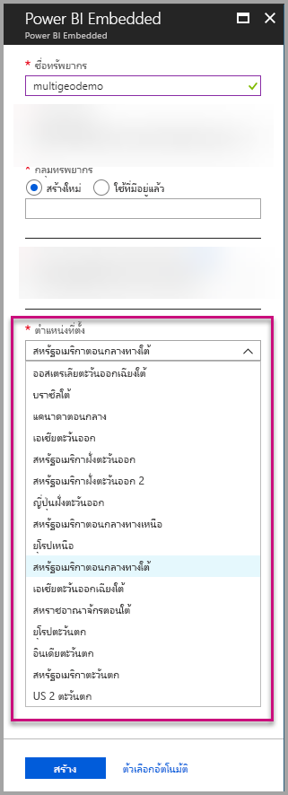
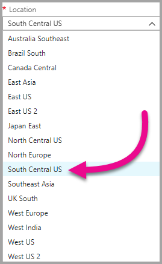
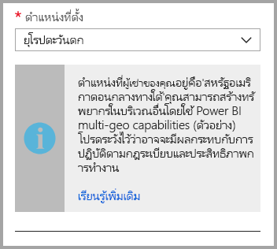
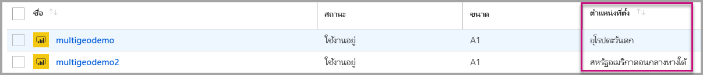
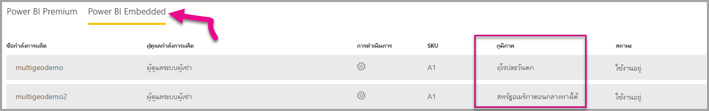

# การสนับสนุนหลายภูมิภาคสำหรับ Power BI EmbeddedMulti-Geo support for Power BI Embedded

**การสนับสนุนหลายภูมิภาคเพื่อ Power BI Embedded** หมายความว่า Isv และองค์กรที่สร้างแอปพลิเคชันโดยใช้ Power BI Embedded ฝังตัววิเคราะห์ลงในแอปของพวกเขา จะสามารถปรับใช้ข้อมูลของพวกเขาในภูมิภาคต่างๆ ได้ทั่วโลก**Multi-Geo support for Power BI Embedded** means that ISVs and organizations that build applications using Power BI Embedded to embed analytics into their apps can now deploy their data in different regions around the world.

ตอนนี้ลูกค้าที่ใช้ **Power BI Embedded** สามารถตั้งค่า **ความจุ** โดยใช้ตัวเลือก **หลายภูมิภาค** ตามคุณลักษณะและข้อจำกัดที่ [Power BI Premium สนับสนุน](../../admin/service-admin-premium-Multi-Geo.md)Now customers using **Power BI Embedded** can set up an **A capacity** using **Multi-Geo** options, based on the same features and limitations that [Power BI Premium supports using Multi-Geo](../../admin/service-admin-premium-Multi-Geo.md).

## สร้างทรัพยากรความจุ Power BI Embedded ใหม่ด้วย Multi-GeoCreating new Power BI Embedded Capacity resource with Multi-Geo

ในหน้าจอ **สร้างทรัพยากร** คุณจำเป็นต้องเลือกตำแหน่งที่ตั้งของความจุของคุณIn the **Create resource** screen, you need to choose the location of your capacity. จนถึงตอนนี้ ความจุจะถูกจำกัดไว้ที่ตำแหน่งที่ตั้งของผู้เช่า Power BI ของคุณเท่านั้น ดังนั้นจึงสามารถใช้งานได้เฉพาะสถานที่เดียวUntil now, it was limited only to the location of your Power BI tenant, so only a single location was available. ด้วย Multi-Geo คุณสามารถเลือกภูมิภาคต่างๆ เพื่อปรับใช้ความจุของคุณWith Multi-Geo, you can choose between different regions to deploy your capacity.

โปรดสังเกตว่า เมื่อเปิดเมนูดรอปดาวน์ตำแหน่งที่ตั้ง ตัวเลือกในค่าเริ่มต้นคือบ้านผู้เช่าNotice that when opening the location drop-down menu, your home tenant is the default selection.
  

เมื่อเลือกตำแหน่งที่ตั้งอื่น ข้อความจะพร้อมท์ให้คุณทราบถึงสิ่งที่เลือกWhen choosing a different location, a message prompts you to make sure you're aware of the selection.

## ดูตำแหน่งที่ตั้งความจุView Capacity location

คุณสามารถดูตำแหน่งที่ตั้งความจุของคุณได้อย่างง่ายดายเมื่อไปที่หน้าการจัดการ Power BI Embedded หลัก ในพอร์ทัล AzureYou can see your capacities location easily when going to the main Power BI Embedded management page in the Azure portal.

จะพร้อมใช้งานในพอร์ทัลผู้ดูแลระบบใน Powerbi.comIt's also available in the Admin Portal in Powerbi.com. ในพอร์ทัลผู้ดูแลระบบ เลือก 'ตั้งค่าความจุ' และจากนั้น สลับไปยังแท็บ 'Power BI Embedded 'In the Admin portal, choose 'Capacity settings,' and then switch to 'Power BI Embedded' tab.

[เรียนรู้เพิ่มเติมเกี่ยวกับการสร้างความจุด้วย Power BI EmbeddedLearn more about creating capacities with Power BI Embedded.](azure-pbie-create-capacity.md)

## จัดการตำแหน่งที่ตั้งความจุที่มีอยู่Manage existing capacities location

คุณไม่สามารถเปลี่ยนตำแหน่งที่ตั้งของทรัพยากรของ Power BI Embedded เมื่อคุณสร้างความจุใหม่You can't change a Power BI Embedded resource location once you've created a new capacity.

เมื่อต้องย้ายเนื้อหา Power BI ของคุณไปยังภูมิภาคอื่น ทำตามขั้นตอนเหล่านี้:To move your Power BI content to a different region, follow these steps:

1. [สร้างความจุใหม่](azure-pbie-create-capacity.md)ในภูมิภาคอื่น[Create a new capacity](azure-pbie-create-capacity.md) in a different region.

2. กำหนดพื้นที่ทำงานทั้งหมดจากความจุที่มีอยู่ให้กับความจุใหม่Assign all workspaces from the existing capacity to the new capacity.

3. ลบความจุเก่าหรือหยุดชั่วคราวDelete or pause the old capacity.

สิ่งสำคัญคือ ถ้าคุณตัดสินใจที่จะลบความจุโดยไม่กำหนดเนื้อหาของความจุนั้นใหม่ เนื้อหาทั้งหมดจะย้ายไปยังความจุที่แชร์ร่วมกัน ซึ่งอยู่ในภูมิภาคบ้านของคุณIt's important to note that if you decide to delete a capacity without reassigning its content, all the content in that capacity moves to a shared capacity, which is in your home region.

## การสนับสนุน API สำหรับ Multi-GeoAPI support for Multi-Geo

เพื่อสนับสนุนการจัดการความจุด้วย Multi-Geo ผ่าน API เราได้ทำการเปลี่ยนแปลง API ที่มีอยู่:To support management of capacities with Multi-Geo through API, we have made some changes to existing APIs:

1. **[รับความจุ](/rest/api/power-bi/capacities/getcapacities)** - API จะส่งกลับรายการความจุพร้อมด้วยการเข้าถึงให้แก่ผู้ใช้**[Get Capacities](/rest/api/power-bi/capacities/getcapacities)** - The API returns a list of capacities with access to the user. การตอบสนองตอนนี้มีคุณสมบัติเพิ่มเติมที่เรียกว่า 'ภูมิภาค' ที่ระบุตำแหน่งที่ตั้งของความจุThe response now includes an additional property called 'region,' that specifies the capacity's location.

2. **[กำหนดความจุ](/rest/api/power-bi/capacities)** - API จะอนุญาตให้กำหนดพื้นที่ทำงานให้กับความจุ**[Assign To Capacity](/rest/api/power-bi/capacities)** - The API allows assigning a given workspace to a capacity. การดำเนินการนี้ไม่อนุญาตให้คุณกำหนดพื้นที่ทำงานให้กับความจุภายนอกภูมิภาคบ้านของคุณ หรือย้ายพื้นที่ทำงานระหว่างความจุในภูมิภาคอื่นThis operation doesn't allow you to assign workspaces to a capacity outside of your home region or move workspaces between capacities in different regions. เมื่อต้องดำเนินการนี้ ผู้ใช้หรือ[บริการหลัก](embed-service-principal.md)ยังคงต้องใช้สิทธิ์ระดับผู้ดูแลระบบบนพื้นที่ทำงาน และจัดการและกำหนดสิทธิ์บนความจุเป้าหมายTo perform this operation, the user or [service principal](embed-service-principal.md) still needs admin permissions on the workspace, and admin or assign permissions on the target capacity.

3. **[ Azure Resource Manager API](/rest/api/power-bi-embedded/capacities)** - :ซึ่งเป็นตัวดำเนินการ API การจัดการทรัพยากร Azure ทั้งหมด รวมทั้ง *สร้าง* และ *ลบ* ให้การสนับสนุน Multi-Geo**[Azure Resource Manager API](/rest/api/power-bi-embedded/capacities)** - all of the Azure Resource Manager API operations, including *Create* and *Delete*, supports Multi-Geo.

## ข้อจำกัดและข้อควรพิจารณาLimitations and considerations

* ยืนยันว่า การโยกย้ายที่คุณเริ่มต้นระหว่างภูมิภาคปฏิบัติตามข้อบังคับของบริษัทและภาครัฐของก่อนเริ่มต้นการถ่ายโอนข้อมูลConfirm that any movement you initiate between regions follows all corporate and government compliance requirements before initiating data transfer.

* คิวรีที่ได้รับการแคชที่เก็บอยู่ในภูมิภาคระยะไกลจะพักอยู่ในภูมิภาคนั้นA cached query stored in a remote region stays in that region at rest. อย่างไรก็ตาม ข้อมูลอื่นๆ ในการส่งต่ออาจไปกลับมาระระหว่างพื้นที่ที่แตกต่างกันHowever, other data in transit may go back and forth between different geographies.

* เมื่อมีการย้ายข้อมูลจากภูมิภาคหนึ่งไปอีกภูมิภาคหนึ่งในสภาพแวดล้อมของ Multi-Geo ข้อมูลต้นทางอาจอยู่ในภูมิภาคที่ใช้เวลาย้ายนานถึง 30 วันWhen moving data from one region to another in a Multi-Geo environment, the source data may stay in the region from which the data was moved for up to 30 days. ในช่วงเวลาดังกล่าว ผู้ใช้ไม่สามารถเข้าถึงข้อมูลได้During that time, users don't have access to it. ข้อมูลจะถูกลบออกจากภูมิภาคและทำลายในระยะเวลา 30 วันนั้นIt's removed from this region and destroyed during the 30-day period.

* Multi-Geo ไม่ได้ส่งผลให้เกิดประสิทธิภาพที่ดีขึ้นโดยทั่วไปMulti-Geo doesn't result in better performance in general. การโหลดรายงานและแดชบอร์ดยังเกี่ยวข้องกับคำร้องขอเมต้าดาต้าไปยังภูมิภาคบ้านLoading reports and dashboards still involve requests to the home region for metadata.

* ในการฝังสำหรับสถานการณ์ลูกค้าของคุณข้อความคิวรีและผลลัพธ์คิวรีจะดำเนินการขนส่งต่อไปผ่านผู้เช่าหน้าแรกIn an embedding for your customers scenario, query text and query result continue to transit through the home tenant.

## ขั้นตอนถัดไปNext steps

เรียนรู้เพิ่มเติมเกี่ยวกับความจุ Power BI Embedded และตัวเลือก Multi-Geo สำหรับความจุทั้งหมด โดยอ้างอิงลิงก์ด้านล่างLearn more about Power BI Embedded capacities and Multi-Geo options for all capacities by referencing the links below.

* [Power BI Embedded คืออะไรWhat is Power BI Embedded?](azure-pbie-what-is-power-bi-embedded.md)

* [สร้างความจุ Power BI EmbeddedCreate a Power BI Embedded capacity](azure-pbie-create-capacity.md)

* [Multi-Geo ในความจุ Power BI PremiumMulti-Geo in Power BI Premium capacities](../../admin/service-admin-premium-multi-geo.md)

มีคำถามเพิ่มเติมหรือไม่More questions? [ลองถามชุมชน Power BITry asking the Power BI Community](https://community.powerbi.com/)