# <a name="row-level-security-with-power-bi-embedded"></a><span data-ttu-id="19f15-104">การรักษาความปลอดภัยระดับแถวด้วย Power BI Embedded</span><span class="sxs-lookup"><span data-stu-id="19f15-104">Row-level security with Power BI Embedded</span></span>

<span data-ttu-id="19f15-105">**การรักษาความปลอดภัยระดับแถว (RLS)** สามารถใช้เพื่อจำกัดการเข้าถึงข้อมูลภายในแดชบอร์ด ไทล์ รายงาน และชุดข้อมูลของผู้ใช้</span><span class="sxs-lookup"><span data-stu-id="19f15-105">**Row-level security (RLS)** can be used to restrict user access to data within dashboards, tiles, reports, and datasets.</span></span> <span data-ttu-id="19f15-106">ผู้ใช้ที่แตกต่างกันสามารถทำงานกับวัตถุเดียวกันทั้งหมดเหล่านั้นในขณะที่ดูข้อมูลที่แตกต่างกันได้</span><span class="sxs-lookup"><span data-stu-id="19f15-106">Different users can work with those same artifacts all while seeing different data.</span></span> <span data-ttu-id="19f15-107">การฝัง RLS ที่สนับสนุน</span><span class="sxs-lookup"><span data-stu-id="19f15-107">Embedding supports RLS.</span></span>

<span data-ttu-id="19f15-108">ถ้าคุณกำลังฝังสำหรับผู้ใช้ที่ไม่ใช่ผู้ใช้ Power BI (แอปเป็นเจ้าของข้อมูล) ซึ่งโดยปกติคือสถานการณ์ ISV บทความนี้เหมาะสำหรับคุณ</span><span class="sxs-lookup"><span data-stu-id="19f15-108">If you're embedding for non-Power BI users (app owns data), which is typically an ISV scenario, then this article is for you!</span></span> <span data-ttu-id="19f15-109">กำหนดค่าโทเค็นแบบฝังลงในบัญชีสำหรับผู้ใช้และบทบาท</span><span class="sxs-lookup"><span data-stu-id="19f15-109">Configure the embed token to account for the user and role.</span></span>

<span data-ttu-id="19f15-110">ถ้าคุณกำลังฝังสำหรับผู้ใช้ Power BI (ผู้ใช้เป็นเจ้าของข้อมูล) ภายในองค์กรของคุณ RLS จะทำงานแบบเดียวกับที่ทำงานในบริการ Power BI โดยตรง</span><span class="sxs-lookup"><span data-stu-id="19f15-110">If you're embedding to Power BI users (user owns data), within your organization, RLS works the same as it does within the Power BI service directly.</span></span> <span data-ttu-id="19f15-111">คุณไม่จำเป็นต้องทำอะไรเพิ่มเติมในแอปพลิเคชันอีก</span><span class="sxs-lookup"><span data-stu-id="19f15-111">There's nothing more you need to do in your application.</span></span> <span data-ttu-id="19f15-112">สำหรับข้อมูลเพิ่มเติม โปรดดู[การรักษาความปลอดภัยระดับแถว (RLS) ด้วย Power BI](../../admin/service-admin-rls.md)</span><span class="sxs-lookup"><span data-stu-id="19f15-112">For more information, see [Row-Level security (RLS) with Power BI](../../admin/service-admin-rls.md).</span></span>


<span data-ttu-id="19f15-114">เป็นสิ่งสำคัญที่คุณจะต้องทำความเข้าใจแนวคิดหลักสามแนวคิด ซึ่งได้แก่ ผู้ใช้ บทบาท และกฎเพื่อใช้ประโยชน์จาก RLS</span><span class="sxs-lookup"><span data-stu-id="19f15-114">To take advantage of RLS, it's important you understand three main concepts; Users, Roles, and Rules.</span></span> <span data-ttu-id="19f15-115">ลองมาดูแนวคิดเหล่านี้อย่างละเอียดกันเถอะ:</span><span class="sxs-lookup"><span data-stu-id="19f15-115">Let's take a closer look at these concepts:</span></span>

<span data-ttu-id="19f15-116">**ผู้ใช้**– ผู้ใช้ปลายทางดูอาร์ทิแฟกต์ (แดชบอร์ด ไทล์ รายงาน หรือชุดข้อมูล)</span><span class="sxs-lookup"><span data-stu-id="19f15-116">**Users** – End users viewing the artifact (dashboard, tile, report, or dataset).</span></span> <span data-ttu-id="19f15-117">ใน Power BI Embedded ผู้ใช้จะถูกระบุโดยพร็อพเพอร์ตี้ชื่อผู้ใช้ในโทเค็นที่ฝัง</span><span class="sxs-lookup"><span data-stu-id="19f15-117">In Power BI Embedded, users are identified by the username property in an embed token.</span></span>

<span data-ttu-id="19f15-118">**บทบาท** – ผู้ใช้จะมีสิทธิ์ตามบทบาท</span><span class="sxs-lookup"><span data-stu-id="19f15-118">**Roles** – Users belong to roles.</span></span> <span data-ttu-id="19f15-119">บทบาทเป็นคอนเทนเนอร์สำหรับกฎและสามารถตั้งชื่อ เช่น *ผู้จัดการฝ่ายขาย* หรือ *พนักงานขาย* ได้ คุณสร้างบทบาทภายใน Power BI Desktop</span><span class="sxs-lookup"><span data-stu-id="19f15-119">A role is a container for rules and can be named something like *Sales Manager* or *Sales Rep*. You create roles within Power BI Desktop.</span></span> <span data-ttu-id="19f15-120">สำหรับข้อมูลเพิ่มเติม โปรดดู[การรักษาความปลอดภัยระดับแถว (RLS) ด้วย Power BI Desktop](../../create-reports/desktop-rls.md)</span><span class="sxs-lookup"><span data-stu-id="19f15-120">For more information, see [Row-level security (RLS) with Power BI Desktop](../../create-reports/desktop-rls.md).</span></span>

<span data-ttu-id="19f15-121">**กฎ** – บทบาทจะมีกฎ และกฎเหล่านั้นคือตัวกรองจริงที่กำลังจะถูกนำไปใช้กับข้อมูลนั้น</span><span class="sxs-lookup"><span data-stu-id="19f15-121">**Rules** – Roles have rules, and those rules are the actual filters that are going to be applied to the data.</span></span> <span data-ttu-id="19f15-122">กฏอาจจะเป็นคำง่ายๆ เช่น "Country = USA" หรือคำที่เป็นแบบไดนามิกมากขึ้น</span><span class="sxs-lookup"><span data-stu-id="19f15-122">The rules could be as simple as "Country = USA" or something much more dynamic.</span></span>
<span data-ttu-id="19f15-123">สำหรับส่วนที่เหลือของบทความนี้ มีตัวอย่างของการเขียน RLS และการใช้งาน RLS ภายในแอปพลิเคชันแบบฝังตัว</span><span class="sxs-lookup"><span data-stu-id="19f15-123">For the rest of this article, there's an example of authoring RLS, and then consuming that within an embedded application.</span></span> <span data-ttu-id="19f15-124">ตัวอย่างของเราใช้ไฟล์ PBIX [ตัวอย่างการวิเคราะห์ด้านการขายปลีก](https://go.microsoft.com/fwlink/?LinkID=780547)</span><span class="sxs-lookup"><span data-stu-id="19f15-124">Our example uses the [Retail Analysis Sample](https://go.microsoft.com/fwlink/?LinkID=780547) PBIX file.</span></span>


## <a name="adding-roles-with-power-bi-desktop"></a><span data-ttu-id="19f15-126">การเพิ่มบทบาทด้วย Power BI Desktop</span><span class="sxs-lookup"><span data-stu-id="19f15-126">Adding roles with Power BI Desktop</span></span>

<span data-ttu-id="19f15-127">**ตัวอย่างการวิเคราะห์ด้านการขายปลีก** ของเราแสดงยอดขายสำหรับร้านค้าทั้งหมดในกลุ่มร้านค้าปลีก</span><span class="sxs-lookup"><span data-stu-id="19f15-127">Our **Retail Analysis sample** shows sales for all the stores in a retail chain.</span></span> <span data-ttu-id="19f15-128">หากไม่มี RLS ผู้จัดการสาขาทุกคนที่ลงชื่อเข้าใช้และดูรายงานจะเห็นข้อมูลเดียวกัน</span><span class="sxs-lookup"><span data-stu-id="19f15-128">Without RLS, no matter which district manager signs in and views the report, they all see the same data.</span></span> <span data-ttu-id="19f15-129">ผู้จัดการอาวุโสที่ได้กำหนดผู้จัดการเขตแต่ละรายแล้วควรจะเห็นยอดขายสำหรับการร้านค้าที่พวกเขาจัดการเท่านั้น</span><span class="sxs-lookup"><span data-stu-id="19f15-129">Senior management has determined each district manager should only see the sales for the stores they manage.</span></span> <span data-ttu-id="19f15-130">ใช้ RLS ในการอนุญาตให้ผู้จัดการอาวุโสสามารถจำกัดฐานข้อมูลได้ตามผู้จัดการเขต</span><span class="sxs-lookup"><span data-stu-id="19f15-130">Using RLS allows Senior management to restrict data based on a district manager.</span></span>

<span data-ttu-id="19f15-131">RLS ถูกเขียนใน Power BI Desktop</span><span class="sxs-lookup"><span data-stu-id="19f15-131">RLS is authored in Power BI Desktop.</span></span> <span data-ttu-id="19f15-132">เมื่อเปิดชุดข้อมูลและรายงาน เราจะสามารถสลับไปยังมุมมองไดอะแกรมเพื่อดู Schema ได้:</span><span class="sxs-lookup"><span data-stu-id="19f15-132">When the dataset and report are opened, we can switch to diagram view to see the schema:</span></span>


<span data-ttu-id="19f15-134">นี่คือบางสิ่งบางอย่างที่ควรสังเกตสำหรับ Schema นี้:</span><span class="sxs-lookup"><span data-stu-id="19f15-134">Here are a few things to notice with this schema:</span></span>

* <span data-ttu-id="19f15-135">หน่วยวัดทั้งหมด เช่น **ยอดขายรวม** จะเก็บไว้ในตาราง **ยอดขาย** จริง</span><span class="sxs-lookup"><span data-stu-id="19f15-135">All measures, like **Total Sales**, are stored in the **Sales** fact table.</span></span>
* <span data-ttu-id="19f15-136">มีตารางมิติที่เกี่ยวข้องเพิ่มเติมสี่ตาราง: **รายการ** **เวลา** **ร้านค้า** และ **เขต**</span><span class="sxs-lookup"><span data-stu-id="19f15-136">There are four additional related dimension tables: **Item**, **Time**, **Store**, and **District**.</span></span>
* <span data-ttu-id="19f15-137">ลูกศรบนเส้นของความสัมพันธ์จะระบุวิธีที่ตัวกรองดำเนินการจากตารางหนึ่งไปอีกตาราง</span><span class="sxs-lookup"><span data-stu-id="19f15-137">The arrows on the relationship lines indicate which way filters can flow from one table to another.</span></span> <span data-ttu-id="19f15-138">ตัวอย่างเช่น ถ้าตัวกรองถูกใช้กับ **เวลา[วันที่]** ใน Schema ปัจจุบัน ตัวกรองนี้จะกรองค่าในตาราง **ยอดขาย** เท่านั้น</span><span class="sxs-lookup"><span data-stu-id="19f15-138">For example, if a filter is placed on **Time[Date]**, in the current schema it would only filter down values in the **Sales** table.</span></span> <span data-ttu-id="19f15-139">ตารางอื่นๆ จะไม่ได้รับผลกระทบจากตัวกรองนี้เนื่องจากลูกศรทั้งหมดในเส้นของความสัมพันธ์ชี้ไปยังตารางยอดขายเท่านั้น</span><span class="sxs-lookup"><span data-stu-id="19f15-139">No other tables are affected by this filter since all the arrows on the relationship lines point to the sales table and not away.</span></span>
* <span data-ttu-id="19f15-140">ตาราง **สาขา** จะบ่งชี้ว่าใครเป็นผู้จัดการแต่ละสาขา:</span><span class="sxs-lookup"><span data-stu-id="19f15-140">The **District** table indicates who the manager is for each district:</span></span>
  
    

<span data-ttu-id="19f15-142">ตาม schema นี้ ถ้าเราใช้ตัวกรองกับคอลัมน์ **ผู้จัดการเขต** ในตาราง **เขต** และถ้าตัวกรองนั้นตรงกับผู้ใช้ที่ดูรายงาน ตัวกรองนั้นจะกรองตาราง **ร้านค้า** และ **ยอดขาย** เพื่อแสดงข้อมูลสำหรับผู้จัดการเขตคนนั้น</span><span class="sxs-lookup"><span data-stu-id="19f15-142">Based on this schema, if we apply a filter to the **District Manager** column in the **District** table, and if that filter matches the user viewing the report, that filter down the **Store** and **Sales** tables to show data for that district manager.</span></span>

<span data-ttu-id="19f15-143">ต่อไปนี้คือวิธีการ:</span><span class="sxs-lookup"><span data-stu-id="19f15-143">Here's how:</span></span>

1. <span data-ttu-id="19f15-144">บนแท็บ **การวางรูปแบบ** ให้เลือก **จัดการบทบาท**</span><span class="sxs-lookup"><span data-stu-id="19f15-144">On the **Modeling** tab, select **Manage Roles**.</span></span>

    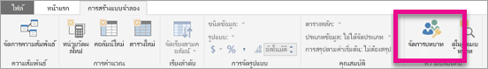
2. <span data-ttu-id="19f15-146">สร้างบทบาทใหม่ที่ชื่อว่า **ผู้จัดการ**</span><span class="sxs-lookup"><span data-stu-id="19f15-146">Create a new role called **Manager**.</span></span>

    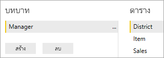
3. <span data-ttu-id="19f15-148">ในตาราง **สาขา** ให้ใส่นิพจน์ DAX: **[ผู้จัดการสาขา] = ชื่อผู้ใช้()**</span><span class="sxs-lookup"><span data-stu-id="19f15-148">In the **District** table, enter this DAX expression: **[District Manager] = USERNAME()**.</span></span>

    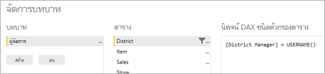
4. <span data-ttu-id="19f15-150">ถ้าต้องการตรวจสอบให้แน่ใจว่ากฎกำลังทำงานอย่างถูกต้อง บนแท็บ **การวางรูปแบบ** ให้เลือก **มุมมองบทบาท** แล้วเลือกทั้งบทบาท **ผู้จัดการ** ที่คุณสร้างและ **ผู้ใช้อื่นๆ**</span><span class="sxs-lookup"><span data-stu-id="19f15-150">To make sure the rules are working, on the **Modeling** tab, select **View as Roles**, and then select both the **Manager** role you created, along with **Other users**.</span></span> <span data-ttu-id="19f15-151">ใส่ **Andrew Ma** สำหรับผู้ใช้</span><span class="sxs-lookup"><span data-stu-id="19f15-151">Enter **Andrew Ma** for the user.</span></span>

    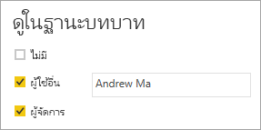

    <span data-ttu-id="19f15-153">รายงานจะแสดงข้อมูลเหมือนกับว่าคุณได้ลงชื่อเข้าใช้ในฐานะ **Andrew Ma**</span><span class="sxs-lookup"><span data-stu-id="19f15-153">The reports show data as if you're signed in as **Andrew Ma**.</span></span>

<span data-ttu-id="19f15-154">การใช้ตัวกรองอย่างที่เราได้ทำที่นี่ จะกรองระเบียนทั้งหมดในตาราง **เขต**, **ร้าน** และ **ยอดขาย**</span><span class="sxs-lookup"><span data-stu-id="19f15-154">Applying the filter, the way we did here, filters down all records in the **District**, **Store**, and **Sales** tables.</span></span> <span data-ttu-id="19f15-155">อย่างไรก็ตาม เนื่องจากทิศทางของตัวกรองกับความสัมพันธ์ระหว่าง **ยอดขาย** และ **เวลา** จะไม่มีการกรองตาราง **ยอดขาย** และ **สินค้า** และ **สินค้า** และ **เวลา**</span><span class="sxs-lookup"><span data-stu-id="19f15-155">However, because of the filter direction on the relationships between **Sales** and **Time**, **Sales** and **Item**, and **Item** and **Time** tables aren't filtered down.</span></span> <span data-ttu-id="19f15-156">เมื่อต้องการเรียนรู้เพิ่มเติมเกี่ยวกับการกรองสองทิศทางแบบไขว้ โปรดดาวน์โหลดเอกสารทางเทคนิคเรื่อง[การกรองสองทิศทางแบบไขว้ใน SQL Server Analysis Services 2016 และ Power BI Desktop](https://download.microsoft.com/download/2/7/8/2782DF95-3E0D-40CD-BFC8-749A2882E109/Bidirectional%20cross-filtering%20in%20Analysis%20Services%202016%20and%20Power%20BI.docx)</span><span class="sxs-lookup"><span data-stu-id="19f15-156">To learn more about bidirectional cross-filtering, download the [Bidirectional cross-filtering in SQL Server Analysis Services 2016 and Power BI Desktop](https://download.microsoft.com/download/2/7/8/2782DF95-3E0D-40CD-BFC8-749A2882E109/Bidirectional%20cross-filtering%20in%20Analysis%20Services%202016%20and%20Power%20BI.docx) whitepaper.</span></span>

## <a name="applying-user-and-role-to-an-embed-token"></a><span data-ttu-id="19f15-157">การนำผู้ใช้และบทบาทไปใช้กับโทเค็นที่ฝัง</span><span class="sxs-lookup"><span data-stu-id="19f15-157">Applying user and role to an embed token</span></span>

<span data-ttu-id="19f15-158">หลังจากที่คุณกำหนดค่าบทบาท Power BI Desktop แล้ว คุณจำเป็นต้องทำงานบางอย่างให้เสร็จในแอปพลิเคชันเพื่อใช้ประโยชน์จากบทบาท</span><span class="sxs-lookup"><span data-stu-id="19f15-158">Now that you have your Power BI Desktop roles configured, some more work needs to be done in your application to take advantage of the roles.</span></span>

<span data-ttu-id="19f15-159">ผู้ใช้จะได้รับการรับรองความถูกต้องและได้รับอนุญาตโดยแอปพลิเคชัน และโทเค็นที่ฝังจะถูกใช้เพื่ออนุญาตให้ผู้ใช้เข้าถึงรายงาน Power BI Embedded ที่เฉพาะเจาะจง</span><span class="sxs-lookup"><span data-stu-id="19f15-159">Users are authenticated and authorized by your application and embed tokens are used to grant a user access to a specific Power BI Embedded report.</span></span> <span data-ttu-id="19f15-160">Power BI Embedded ไม่มีข้อมูลที่ระบุได้ว่าผู้ใช้ของคุณคือใคร</span><span class="sxs-lookup"><span data-stu-id="19f15-160">Power BI Embedded doesn't have any specific information on who your user is.</span></span> <span data-ttu-id="19f15-161">คุณจำเป็นต้องส่งบริบทเพิ่มเติมบางอย่างเป็นส่วนหนึ่งของโทเค็นที่ฝังในรูปแบบข้อมูลประจำตัวเพื่อให้ RLS ทำงาน</span><span class="sxs-lookup"><span data-stu-id="19f15-161">For RLS to work, you need to pass some additional context as part of your embed token in the form of identities.</span></span> <span data-ttu-id="19f15-162">คุณสามารถส่งข้อมูลประจำตัว โดยใช้[โทเค็นที่ฝัง](/rest/api/power-bi/embedtoken)API ได้</span><span class="sxs-lookup"><span data-stu-id="19f15-162">You can pass the identities by using the [Embed Token](/rest/api/power-bi/embedtoken) API.</span></span>

<span data-ttu-id="19f15-163">API รับรายการของข้อมูลประจำตัว ที่ระบุชุดข้อมูลที่เกี่ยวข้อง</span><span class="sxs-lookup"><span data-stu-id="19f15-163">The API accepts a list of identities with indication of the relevant datasets.</span></span> <span data-ttu-id="19f15-164">เพื่อให้ RLS ทำงานได้ คุณจำเป็นต้องส่งข้อมูลด้านล่างนี้เพื่อให้เป็นส่วนหนึ่งของข้อมูลประจำตัว</span><span class="sxs-lookup"><span data-stu-id="19f15-164">For RLS to work, you need to pass the below pieces as part of the identity.</span></span>

* <span data-ttu-id="19f15-165">**ชื่อผู้ใช้ (จำเป็น)** – สตริงที่สามารถใช้เพื่อช่วยในการระบุตัวตนผู้ใช้เมื่อนำกฎ RLS ไปใช้</span><span class="sxs-lookup"><span data-stu-id="19f15-165">**username (mandatory)** – A string that can be used to help identify the user when applying RLS rules.</span></span> <span data-ttu-id="19f15-166">ผู้ใช้รายเดียวเท่านั้นที่สามารถอยู่ในรายการได้</span><span class="sxs-lookup"><span data-stu-id="19f15-166">Only a single user can be listed.</span></span> <span data-ttu-id="19f15-167">ชื่อผู้ใช้ของคุณสามารถใช้อักขระ *ASCII* ได้</span><span class="sxs-lookup"><span data-stu-id="19f15-167">Your username can be created with *ASCII* characters.</span></span>
* <span data-ttu-id="19f15-168">**บทบาท (จำเป็น)** – สตริงที่ประกอบด้วยบทบาทที่เลือกเมื่อนำกฎการรักษาความปลอดภัยระดับแถวไปใช้</span><span class="sxs-lookup"><span data-stu-id="19f15-168">**roles (mandatory)** – A string containing the roles to select when applying Row Level Security rules.</span></span> <span data-ttu-id="19f15-169">ถ้าส่งบทบาทมากกว่าหนึ่งรายการ คุณควรส่งเป็นอาร์เรย์แบบสตริง</span><span class="sxs-lookup"><span data-stu-id="19f15-169">If passing more than one role, they should be passed as a string array.</span></span>
* <span data-ttu-id="19f15-170">**ชุดข้อมูล (จำเป็น)** – ชุดข้อมูลที่สามารถใช้ได้กับวัตถุที่คุณจะฝัง</span><span class="sxs-lookup"><span data-stu-id="19f15-170">**dataset (mandatory)** – The dataset that is applicable for the artifact you're embedding.</span></span>

<span data-ttu-id="19f15-171">คุณสามารถสร้างโทเค็นที่ฝังได้โดยใช้เมธอด **GenerateTokenInGroup** บน **PowerBIClient.Reports**</span><span class="sxs-lookup"><span data-stu-id="19f15-171">You can create the embed token by using the **GenerateTokenInGroup** method on **PowerBIClient.Reports**.</span></span>

<span data-ttu-id="19f15-172">ตัวอย่างเช่น คุณสามารถเปลี่ยนตัวอย่าง \*[PowerBI-นักพัฒนา-ตัวอย่าง](https://github.com/Microsoft/PowerBI-Developer-Samples)  > .NET Framework > แบบฝังตัวสำหรับลูกค้าของคุณ > **PowerBIEmbedded_AppOwnsData** _ sample ได้</span><span class="sxs-lookup"><span data-stu-id="19f15-172">For example, you could change the \*[PowerBI-Developer-Samples](https://github.com/Microsoft/PowerBI-Developer-Samples) > .NET Framework > Embed for your customers > **PowerBIEmbedded_AppOwnsData** _ sample.</span></span>

<span data-ttu-id="19f15-173">_ *ก่อนการเปลี่ยนแปลง*\*</span><span class="sxs-lookup"><span data-stu-id="19f15-173">_ *Before the change*\*</span></span>

```csharp
// Generate Embed Token with effective identities.
generateTokenRequestParameters = new GenerateTokenRequest(accessLevel: "view", identities: new List<EffectiveIdentity> { rls });

// Generate Embed Token for reports without effective identities.
generateTokenRequestParameters = new GenerateTokenRequest(accessLevel: "view");
```

<span data-ttu-id="19f15-174">**หลังการเปลี่ยนแปลง**</span><span class="sxs-lookup"><span data-stu-id="19f15-174">**After the change**</span></span>

```csharp
var generateTokenRequestParameters = new GenerateTokenRequest("View", null, identities: new List<EffectiveIdentity> { new EffectiveIdentity(username: "username", roles: new List<string> { "roleA", "roleB" }, datasets: new List<string> { "datasetId" }) });

var tokenResponse = await client.Reports.GenerateTokenInGroupAsync("groupId", "reportId", generateTokenRequestParameters);
```

<span data-ttu-id="19f15-175">ถ้าคุณกำลังเรียกใช้ REST API แล้ว ตอนนี้ API ที่อัปเดตจะยอมรับอาร์เรย์ JSON เพิ่มเติม รวมถึง **ข้อมูลประจำตัว** ที่มีชื่อที่ประกอบด้วยชื่อผู้ใช้ รายการบทบาทสตริง และรายการชุดข้อมูลสตริง</span><span class="sxs-lookup"><span data-stu-id="19f15-175">If you're calling the REST API, the updated API now accepts an additional JSON array, named **identities**, containing a username, list of string roles and list of string datasets.</span></span> 

<span data-ttu-id="19f15-176">ใช้รหัสด้านล่างต่อไปนี้เป็นตัวอย่าง:</span><span class="sxs-lookup"><span data-stu-id="19f15-176">Use the following code below as an example:</span></span>

```json
{
    "accessLevel": "View",
    "identities": [
        {
            "username": "EffectiveIdentity",
            "roles": [ "Role1", "Role2" ],
            "datasets": [ "fe0a1aeb-f6a4-4b27-a2d3-b5df3bb28bdc" ]
        }
    ]
}
```

<span data-ttu-id="19f15-177">ตอนนี้เมื่อมีส่วนประกอบทั้งหมดแล้ว เมื่อมีคนเข้าสู่ระบบแอปพลิเคชันของคุณเพื่อดูอาร์ทิแฟกต์นี้ พวกเขาจะสามารถดูข้อมูลที่ได้รับอนุญาตให้ดูเท่านั้นตามที่กำหนดไว้โดยการรักษาความปลอดภัยระดับแถวของเรา</span><span class="sxs-lookup"><span data-stu-id="19f15-177">Now, with all the pieces together, when someone logs into your application to view this artifact, they'll only see the data that they're allowed to see, as defined by our row-level security.</span></span>

## <a name="working-with-analysis-services-live-connections"></a><span data-ttu-id="19f15-178">การทำงานกับการเชื่อมต่อแบบสดของ Analysis Services</span><span class="sxs-lookup"><span data-stu-id="19f15-178">Working with Analysis Services live connections</span></span>

<span data-ttu-id="19f15-179">การรักษาความปลอดภัยระดับแถวสามารถใช้กับการเชื่อมต่อแบบสดของ Analysis Services สำหรับเซิร์ฟเวอร์ภายในองค์กร</span><span class="sxs-lookup"><span data-stu-id="19f15-179">Row-level security can be used with Analysis Services live connections for on-premises servers.</span></span> <span data-ttu-id="19f15-180">มีแนวคิดเฉพาะบางอย่างที่คุณควรทำความเข้าใจเมื่อใช้การเชื่อมต่อประเภทนี้</span><span class="sxs-lookup"><span data-stu-id="19f15-180">There are a few specific concepts that you should understand when using this type of connection.</span></span>

<span data-ttu-id="19f15-181">ข้อมูลประจำตัวที่มีผลบังคับใช้ที่ระบุไว้สำหรับพร็อพเพอร์ตี้ชื่อผู้ใช้จะต้องเป็นผู้ใช้ Windows ที่มีสิทธิ์บนเซิร์ฟเวอร์ Analysis Services</span><span class="sxs-lookup"><span data-stu-id="19f15-181">The effective identity that is provided for the username property must be a Windows user with permissions on the Analysis Services server.</span></span>

>[!NOTE]
> <span data-ttu-id="19f15-182">เมื่อใช้โครงร่างสำคัญของบริการด้วยแหล่งข้อมูล [Azure Analysis Services](/azure/analysis-services/analysis-services-overview) โครงร่างสำคัญของบริการจะต้องมีสิทธิ์อินสแตนซ์ Azure Analysis Services</span><span class="sxs-lookup"><span data-stu-id="19f15-182">When using service principal with an [Azure Analysis Services](/azure/analysis-services/analysis-services-overview) data source, the service principal itself must have an Azure Analysis Services instance permissions.</span></span> <span data-ttu-id="19f15-183">การใช้กลุ่มความปลอดภัยที่ประกอบด้วยโครงร่างสำคัญของบริการสำหรับวัตถุประสงค์นี้ไม่ได้ผล</span><span class="sxs-lookup"><span data-stu-id="19f15-183">Using a security group that contains the service principal for this purpose, doesn't work.</span></span>

### <a name="on-premises-data-gateway-configuration"></a><span data-ttu-id="19f15-184">การกำหนดค่าเกตเวย์ข้อมูลภายในองค์กร</span><span class="sxs-lookup"><span data-stu-id="19f15-184">On-premises data gateway configuration</span></span>

<span data-ttu-id="19f15-185">[เกตเวย์ข้อมูลภายในองค์กร](../../connect-data/service-gateway-onprem.md)จะถูกใช้เมื่อทำงานกับการเชื่อมต่อแบบสดของ Analysis Services</span><span class="sxs-lookup"><span data-stu-id="19f15-185">An [On-premises data gateway](../../connect-data/service-gateway-onprem.md) is used when working with Analysis Services live connections.</span></span> <span data-ttu-id="19f15-186">เมื่อสร้างโทเค็นที่ฝังด้วยข้อมูลประจำตัวที่อยู่ในรายการ บัญชีผู้ใช้หลักจำเป็นต้องอยู่ในรายการในฐานะผู้ดูแลระบบเกตเวย์</span><span class="sxs-lookup"><span data-stu-id="19f15-186">When generating an embed token, with an identity listed, the master account needs to be listed as an admin of the gateway.</span></span> <span data-ttu-id="19f15-187">ถ้าบัญชีผู้ใช้หลักไม่ได้อยู่ในรายการ จะไม่ใช้ความปลอดภัยระดับแถวกับคุณสมบัติของข้อมูล</span><span class="sxs-lookup"><span data-stu-id="19f15-187">If the master account isn't listed, the row-level security isn't applied to the property of the data.</span></span> <span data-ttu-id="19f15-188">ผู้ใช้ที่ไม่ใช่ผู้ดูแลระบบเกตเวย์สามารถระบุบทบาทได้ แต่ต้องระบุชื่อผู้ใช้ของตนเองสำหรับข้อมูลประจำตัวที่มีผลบังคับใช้</span><span class="sxs-lookup"><span data-stu-id="19f15-188">A non-admin of the gateway can provide roles, but must specify its own username for the effective identity.</span></span>

### <a name="use-of-roles"></a><span data-ttu-id="19f15-189">ใช้บทบาท</span><span class="sxs-lookup"><span data-stu-id="19f15-189">Use of roles</span></span>

<span data-ttu-id="19f15-190">สามารถกำหนดบทบาทด้วยข้อมูลประจำตัวในโทเค็นฝังตัว</span><span class="sxs-lookup"><span data-stu-id="19f15-190">Roles can be provided with the identity in an embed token.</span></span> <span data-ttu-id="19f15-191">ถ้าไม่มีการระบุบทบาท สามารถใช้ชื่อผู้ใช้ที่ระบุพื่อแก้ไขปัญหาบทบาทเกี่ยวข้อง</span><span class="sxs-lookup"><span data-stu-id="19f15-191">If no role is provided, the username that was provided can be used to resolve the associated roles.</span></span>

### <a name="using-the-customdata-feature"></a><span data-ttu-id="19f15-192">ใช้ฟีเจอร์ CustomData</span><span class="sxs-lookup"><span data-stu-id="19f15-192">Using the CustomData feature</span></span>

<span data-ttu-id="19f15-193">ฟีเจอร์ CustomData จะทำงานสำหรับแบบจำลองที่อยู่ใน **Azure Analysis Services** เท่านั้นและจะทำงานเฉพาะในโหมด **ถ่ายทอดสด**</span><span class="sxs-lookup"><span data-stu-id="19f15-193">The CustomData feature only works for models that lie in **Azure Analysis Services**, and it only works in **Connect live** mode.</span></span> <span data-ttu-id="19f15-194">คุณลักษณะข้อมูลแบบกำหนดเองไม่สามารถตั้งค่าภายในไฟล์ .pbix ได้ซึ่งต่างจากผู้ใช้และบทบาท</span><span class="sxs-lookup"><span data-stu-id="19f15-194">Unlike users and roles, the Custom data feature can't be set inside a .pbix file.</span></span> <span data-ttu-id="19f15-195">เมื่อสร้างโทเค็นด้วยคุณลักษณะข้อมูลแบบกำหนดเอง คุณต้องมีชื่อผู้ใช้</span><span class="sxs-lookup"><span data-stu-id="19f15-195">When generating a token with the Custom data feature, you need to have a username.</span></span>

>[!NOTE]
><span data-ttu-id="19f15-196">ชื่อผู้ใช้ CustomData สามารถมีความยาวได้ 256 อักขระเท่านั้น</span><span class="sxs-lookup"><span data-stu-id="19f15-196">The CustomData username can only be 256 characters long.</span></span>

<span data-ttu-id="19f15-197">ฟีเจอร์ CustomData อนุญาตให้คุณเพิ่มตัวกรองแถวเมื่อดูข้อมูล Power BI ในแอปพลิเคชันของคุณเมื่อใช้ **Azure Analysis Services** เป็นแหล่งข้อมูลของคุณ (ดูข้อมูล Power BI ที่เชื่อมต่อกับ Azure Analysis Services ในแอปพลิเคชันของคุณ ).</span><span class="sxs-lookup"><span data-stu-id="19f15-197">The CustomData feature allows you to add a Row filter when viewing Power BI data in your application when using **Azure Analysis Services** as your data source (viewing Power BI data connected to Azure Analysis Services in your application).</span></span>

<span data-ttu-id="19f15-198">ฟีเจอร์ CustomData อนุญาตให้ส่งข้อความอิสระ (สตริง) โดยใช้พร็อพเพอร์ตี้สตริงการเชื่อมต่อ CustomData</span><span class="sxs-lookup"><span data-stu-id="19f15-198">The CustomData feature allows passing free text (string) using the CustomData connection string property.</span></span> <span data-ttu-id="19f15-199">Analysis Services ใช้ค่านี้ผ่านทางฟังก์ชัน *CUSTOMDATA()*</span><span class="sxs-lookup"><span data-stu-id="19f15-199">Analysis Services uses this value via the *CUSTOMDATA()* function.</span></span>

<span data-ttu-id="19f15-200">วิธีเดียวที่จะมี RLS แบบไดนามิกได้ (ซึ่งใช้การประเมินค่าไดนามิกตัวกรอง) ใน **Azure Analysis Services** คือต้องใช้ฟังก์ชัน *CUSTOMDATA()*</span><span class="sxs-lookup"><span data-stu-id="19f15-200">The only way to have dynamic RLS (which uses dynamic values for filter evaluation) in **Azure Analysis Services**, is using the *CUSTOMDATA()* function.</span></span>

<span data-ttu-id="19f15-201">คุณสามารถใช้ภายในคิวรี DAX บทบาท และคุณสามารถใช้ได้โดยไม่ต้องมีบทบาทใดๆ ในคิวรี DAX หน่วยวัด</span><span class="sxs-lookup"><span data-stu-id="19f15-201">You can use it inside the role DAX query, and you can use it without any role in a measure DAX query.</span></span>
<span data-ttu-id="19f15-202">ฟีเจอร์ CustomData เป็นส่วนหนึ่งของฟังก์ชันการสร้างโทเค็นสำหรับวัตถุต่อไปนี้: แดชบอร์ด รายงาน และไทล์</span><span class="sxs-lookup"><span data-stu-id="19f15-202">CustomData feature is part of our token generation functionality for the following artifacts: dashboard, report, and tile.</span></span> <span data-ttu-id="19f15-203">แดชบอร์ดสามารถมีข้อมูลประจำตัว CustomData ได้หลายรายการ (1 รายการต่อไทล์/แบบจำลอง)</span><span class="sxs-lookup"><span data-stu-id="19f15-203">Dashboards can have multiple CustomData identities (one per tile/model).</span></span>

#### <a name="customdata-sdk-additions"></a><span data-ttu-id="19f15-204">การเพิ่ม CustomData SDK</span><span class="sxs-lookup"><span data-stu-id="19f15-204">CustomData SDK Additions</span></span>

<span data-ttu-id="19f15-205">พร็อพเพอร์ตี้สตริง CustomData ถูกเพิ่มลงในข้อมูลประจำตัวที่มีผลบังคับใช้ของเราในสถานการณ์การสร้างโทเค็น</span><span class="sxs-lookup"><span data-stu-id="19f15-205">The CustomData string property was added to our effective identity in the token generation scenario.</span></span>

```json
[JsonProperty(PropertyName = "customData")]
public string CustomData { get; set; }
```

<span data-ttu-id="19f15-206">ข้อมูลประจำตัวสามารถสร้างขึ้นด้วยข้อมูลแบบกำหนดเองโดยใช้การเรียกใช้ต่อไปนี้:</span><span class="sxs-lookup"><span data-stu-id="19f15-206">The identity can be created with custom data using the following call:</span></span>

```csharp
public EffectiveIdentity(string username, IList<string> datasets, IList<string> roles = null, string customData = null);
```

#### <a name="customdata-sdk-usage"></a><span data-ttu-id="19f15-207">การใช้งาน CustomData SDK</span><span class="sxs-lookup"><span data-stu-id="19f15-207">CustomData SDK Usage</span></span>

<span data-ttu-id="19f15-208">ถ้าคุณกำลังเรียกใช้ REST API คุณจะสามารถเพิ่มข้อมูลแบบกำหนดเองภายในข้อมูลประจำตัวแต่ละรายการได้</span><span class="sxs-lookup"><span data-stu-id="19f15-208">If you're calling the REST API, you can add custom data inside each identity, for example:</span></span>

```json
{
    "accessLevel": "View",
    "identities": [
        {
            "username": "EffectiveIdentity",
            "roles": [ "Role1", "Role2" ],
            "customData": "MyCustomData",
            "datasets": [ "fe0a1aeb-f6a4-4b27-a2d3-b5df3bb28bdc" ]
        }
    ]
}
```

<span data-ttu-id="19f15-209">ต่อไปนี้คือขั้นตอนในการเริ่มต้นตั้งค่าฟีเจอร์ของ customdata ()กับแอปพลิเคชัน Power BI Embedded</span><span class="sxs-lookup"><span data-stu-id="19f15-209">Here are the steps to begin setting up the CustomData() feature with your Power BI Embedded application.</span></span>

1. <span data-ttu-id="19f15-210">สร้างฐานข้อมูล Azure Analysis Services</span><span class="sxs-lookup"><span data-stu-id="19f15-210">Create your Azure Analysis Services database.</span></span> <span data-ttu-id="19f15-211">แล้วลงชื่อเข้าใช้ในเซิร์ฟเวอร์ Azure Analysis Services ของคุณผ่านทาง[SQL Server Management Studio](/sql/ssms/download-sql-server-management-studio-ssms)</span><span class="sxs-lookup"><span data-stu-id="19f15-211">Then sign in to your Azure Analysis Services server via [SQL Server Management Studio](/sql/ssms/download-sql-server-management-studio-ssms).</span></span>

    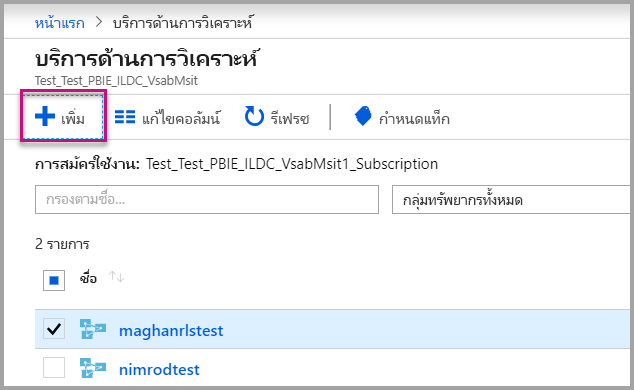

    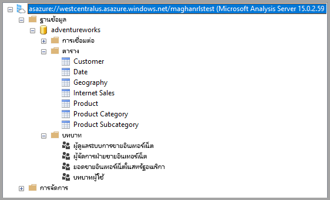

2. <span data-ttu-id="19f15-214">กำหนดบทบาทในเซิร์ฟเวอร์ Analysis Services</span><span class="sxs-lookup"><span data-stu-id="19f15-214">Create a Role in the Analysis Services server.</span></span>

    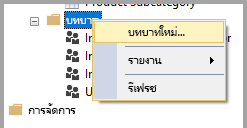

3. <span data-ttu-id="19f15-216">ตั้ง **ค่าทั่วไป** ของคุณ</span><span class="sxs-lookup"><span data-stu-id="19f15-216">Set your **General** settings.</span></span>  <span data-ttu-id="19f15-217">ในส่วนนี้คุณสามารถตั้ง **ชื่อบทบาท** และตั้งค่าการอนุญาตให้เข้าถึงฐานข้อมูลเป็น **อ่าน** เท่านั้น</span><span class="sxs-lookup"><span data-stu-id="19f15-217">Here you give the **Role Name** and set the database permissions to **Read** only.</span></span>

    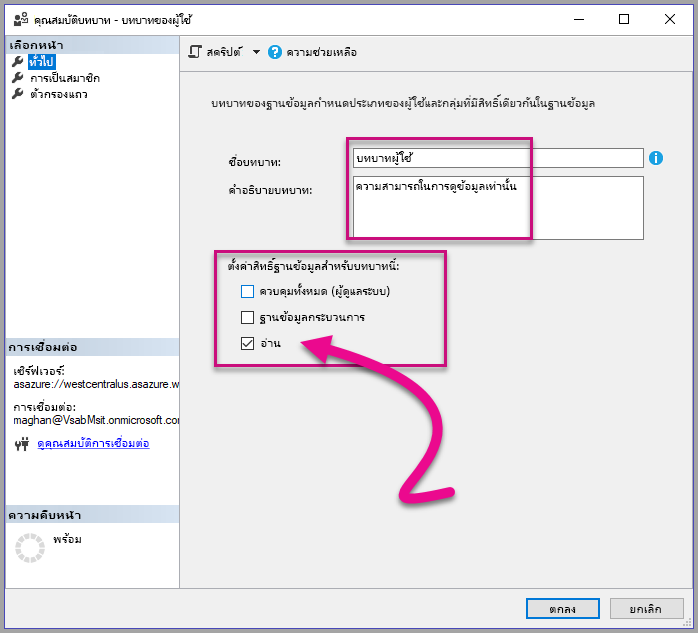

4. <span data-ttu-id="19f15-219">ตั้งค่า **การเป็นสมาชิก**</span><span class="sxs-lookup"><span data-stu-id="19f15-219">Set the **Membership** settings.</span></span> <span data-ttu-id="19f15-220">ในส่วนนี้คุณสามารถเพิ่มผู้ใช้ที่ได้รับผลจากบทบาทนี้</span><span class="sxs-lookup"><span data-stu-id="19f15-220">Here you add te users that are affected by this role.</span></span>

    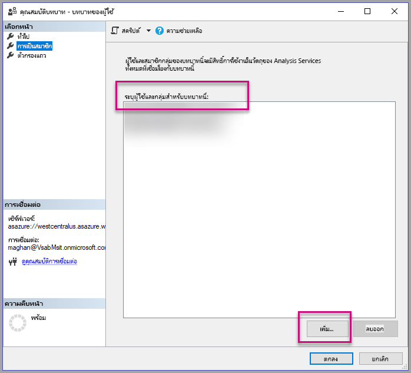

5. <span data-ttu-id="19f15-222">ตั้งค่า **แถวตัวกรอง** ของคุณโดยใช้ใช้คิวรี DAX *customdata ()* ฟังก์ชัน</span><span class="sxs-lookup"><span data-stu-id="19f15-222">Set your **Row filters** DAX query using the *CUSTOMDATA()* function.</span></span>

    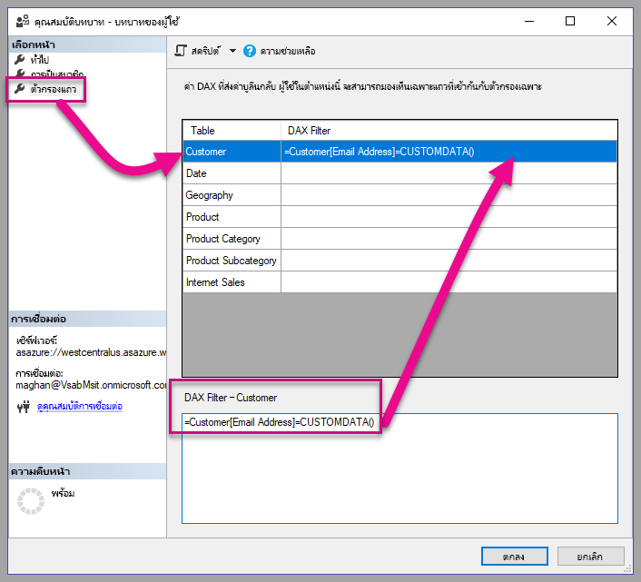

6. <span data-ttu-id="19f15-224">สร้างรายงาน PBI และเผยแพร่ไปยังพื้นที่ทำงานที่มีความจุ</span><span class="sxs-lookup"><span data-stu-id="19f15-224">Build a PBI report and publish it to a workspace with capacity.</span></span>

    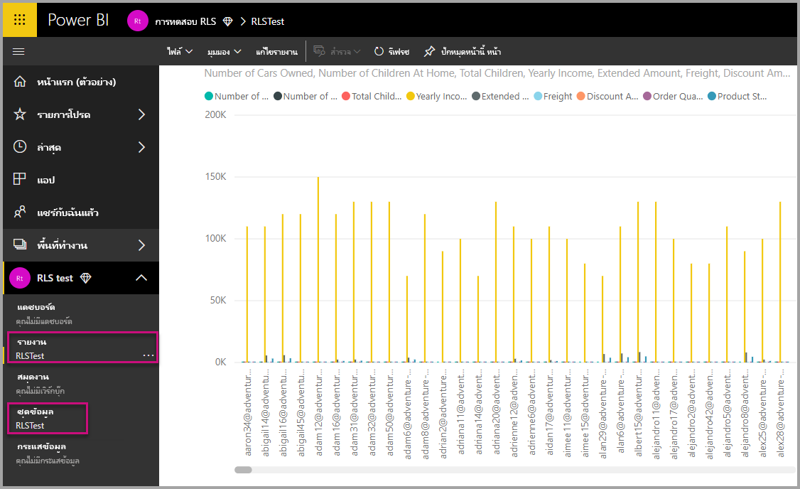

7. <span data-ttu-id="19f15-226">ใช้ Power BI API เพื่อใช้ฟีเจอร์ CustomData ในแอปพลิเคชันของคุณ</span><span class="sxs-lookup"><span data-stu-id="19f15-226">Use the Power BI APIs to use the CustomData feature in your application.</span></span>  <span data-ttu-id="19f15-227">เมื่อสร้างโทเค็นด้วยคุณลักษณะข้อมูลแบบกำหนดเอง คุณต้องมีชื่อผู้ใช้</span><span class="sxs-lookup"><span data-stu-id="19f15-227">When generating a token with the Custom data feature, you need to have a username.</span></span> <span data-ttu-id="19f15-228">ชื่อผู้ใช้ต้องตรงกันกับ UPN ของผู้ใช้หลัก</span><span class="sxs-lookup"><span data-stu-id="19f15-228">The username must be equal to the UPN of the master user.</span></span> <span data-ttu-id="19f15-229">ผู้ใช้หลักต้องเป็นสมาชิกของบทบาทคุณสร้างขึ้น</span><span class="sxs-lookup"><span data-stu-id="19f15-229">The master user must be a member of the role(s) you created.</span></span> <span data-ttu-id="19f15-230">ทุกบทบาทของผู้ใช้หลักที่เข้าเป็นสมาชิกจะถูกประเมินโดย RLS ถ้าไม่มีการกำหนดบทบาทอย่างชัดเจน</span><span class="sxs-lookup"><span data-stu-id="19f15-230">If no role(s) are specified, then all the roles the master user is a member of are used for RLS evaluation.</span></span>

    <span data-ttu-id="19f15-231">เมื่อทำงานกับ[โครงร่างสำคัญของบริการ](embed-service-principal.md) คุณยังจำเป็นต้องทำตามขั้นตอนข้างต้นโดยใช้บัญชีผู้ใช้หลัก</span><span class="sxs-lookup"><span data-stu-id="19f15-231">When working with a [service principal](embed-service-principal.md), you also need to do the above steps in place of using a master account.</span></span> <span data-ttu-id="19f15-232">เมื่อสร้างโทเค็นแบบฝัง ให้ใช้ [ID ออบเจ็กต์โครงร่างสำคัญของบริการ](embed-service-principal.md)เป็นชื่อผู้ใช้</span><span class="sxs-lookup"><span data-stu-id="19f15-232">When generating embed token, use the [service principal object ID](embed-service-principal.md) as the username.</span></span>

    > [!Note]
    > <span data-ttu-id="19f15-233">เมื่อคุณพร้อมที่จะให้แอปพลิเคชันของคุณเข้าสู่กระบวนการผลิต ข้อมูลบัญชีของผู้ใช้หลักจะต้องไม่ให้ผู้ใช้ปลายทางสามารถมองเห็นได้</span><span class="sxs-lookup"><span data-stu-id="19f15-233">When you're ready to deploy your application to production, the master user account field or option should not be visible to the end user.</span></span>

    <span data-ttu-id="19f15-234">ดู[โค้ด](#customdata-sdk-additions)เมื่อต้องเพิ่มฟีเจอร์ใน CustomData</span><span class="sxs-lookup"><span data-stu-id="19f15-234">View the [code](#customdata-sdk-additions) to add the CustomData feature.</span></span>

8. <span data-ttu-id="19f15-235">ตอนนี้คุณสามารถดูรายงานในแอปพลิเคชันก่อนที่จะใช้ค่าข้อมูลแบบกำหนดเองเพื่อดูข้อมูลทั้งหมดที่อยู่ในรายงานของคุณ</span><span class="sxs-lookup"><span data-stu-id="19f15-235">Now you can view the report in your application before applying the Custom data value(s) to see all the data your report holds.</span></span>

    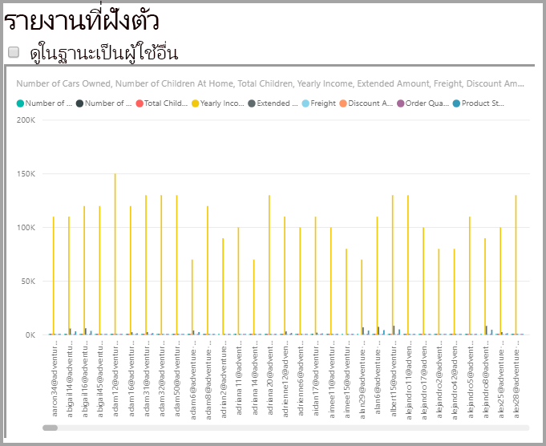

    <span data-ttu-id="19f15-237">แล้วใช้ค่าข้อมูลแบบกำหนดเองเพื่อดูว่ารายงานแสดงชุดข้อมูลที่แตกต่างกันอื่น ๆ อย่างไร</span><span class="sxs-lookup"><span data-stu-id="19f15-237">Then apply the Custom data value(s) to see how the report displays a different set of data.</span></span>
    <span data-ttu-id="19f15-238">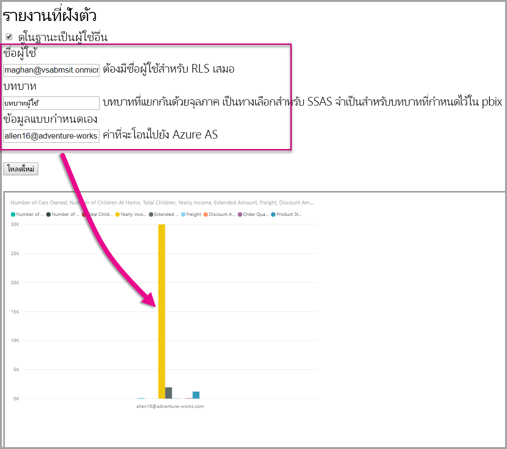</span><span class="sxs-lookup"><span data-stu-id="19f15-238"></span></span>

## <a name="using-rls-vs-javascript-filters"></a><span data-ttu-id="19f15-239">ใช้ RLS เทียบกับ ตัวกรอง JavaScript</span><span class="sxs-lookup"><span data-stu-id="19f15-239">Using RLS vs. JavaScript filters</span></span>

<span data-ttu-id="19f15-240">เมื่อตัดสินใจกรองข้อมูลในรายงานของคุณ คุณสามารถใช้ **ระดับแถวความปลอดภัย (RLS)** หรือ **ตัวกรอง JavaScript** ได้</span><span class="sxs-lookup"><span data-stu-id="19f15-240">When deciding on filtering your data in a report, you can use **row-level security (RLS)** or **JavaScript filters**.</span></span>

<span data-ttu-id="19f15-241">[ความปลอดภัยระดับแถว](../../admin/service-admin-rls.md)เป็นคุณลักษณะที่กรองข้อมูลในระดับแบบจำลองข้อมูล</span><span class="sxs-lookup"><span data-stu-id="19f15-241">[Row-level security](../../admin/service-admin-rls.md) is a feature that filters data at the data model level.</span></span> <span data-ttu-id="19f15-242">แหล่งข้อมูล backend ควบคุมการตั้งค่า RLS ของคุณ</span><span class="sxs-lookup"><span data-stu-id="19f15-242">Your backend data source controls your RLS settings.</span></span> <span data-ttu-id="19f15-243">อ้างอิงจากแบบจำลองข้อมูลของคุณ โทเค็นฝังตัวเป็นตัวกำหนดชื่อผู้ใช้และบทบาทสำหรับเซสชัน</span><span class="sxs-lookup"><span data-stu-id="19f15-243">Based on your data model, the embed token generation sets the username and the roles for the session.</span></span> <span data-ttu-id="19f15-244">ซึ่งไม่สามารถถูกบันทึกแทน ลบ หรือควบคุมโดยโค้ดฝั่งลูกค้าได้ และนั่นคือเหตุผลว่าทำไมระบบจึงปลอดภัย</span><span class="sxs-lookup"><span data-stu-id="19f15-244">It cannot be overridden, removed, or controlled by the client-side code and that's why it's considered secure.</span></span> <span data-ttu-id="19f15-245">เราขอแนะนำให้ใช้ RLS สำหรับการกรองข้อมูลได้อย่างปลอดภัย</span><span class="sxs-lookup"><span data-stu-id="19f15-245">We recommend using RLS for filtering data securely.</span></span> <span data-ttu-id="19f15-246">คุณสามารถกรองข้อมูล ด้วย RLS โดยใช้หนึ่งในตัวเลือกด้านล่าง</span><span class="sxs-lookup"><span data-stu-id="19f15-246">You can filter data with RLS by using one of the options below.</span></span>

* <span data-ttu-id="19f15-247">[กำหนดบทบาทในรายงาน Power BI](../../create-reports/desktop-rls.md)</span><span class="sxs-lookup"><span data-stu-id="19f15-247">[Configuring roles in a Power BI report](../../create-reports/desktop-rls.md).</span></span>
* <span data-ttu-id="19f15-248">กำหนดบทบาทที่ระดับแหล่งข้อมูล (Analysis Services ซึ่งเชื่อมต่อสดเท่านั้น)</span><span class="sxs-lookup"><span data-stu-id="19f15-248">Configuring roles at the data source level (Analysis Services live connection only).</span></span>
* <span data-ttu-id="19f15-249">ด้วยการเขียนโปรแกรมด้วย[ใช้](/rest/api/power-bi/embedtoken/datasets_generatetokeningroup)โทเค็นที่ฝัง`EffectiveIdentity`</span><span class="sxs-lookup"><span data-stu-id="19f15-249">Programmatically with an [Embed Token](/rest/api/power-bi/embedtoken/datasets_generatetokeningroup) using `EffectiveIdentity`.</span></span> <span data-ttu-id="19f15-250">เมื่อใช้โทเค็นที่ฝัง ตัวกรองจริงจะผ่านโทเค็นฝังตัวสำหรับเซสชันที่เฉพาะ</span><span class="sxs-lookup"><span data-stu-id="19f15-250">When using an embed token, the actual filter passes through the embed token for a specific session.</span></span>

<span data-ttu-id="19f15-251">[ตัวกรอง JavaScript](https://github.com/Microsoft/PowerBI-JavaScript/wiki/Filters#page-level-and-visual-level-filters)ใช้เพื่ออนุญาตให้ผู้ใช้งานสามารถลด จำกัด หรือกรองมุมมองในการดูข้อมูล</span><span class="sxs-lookup"><span data-stu-id="19f15-251">[JavaScript filters](https://github.com/Microsoft/PowerBI-JavaScript/wiki/Filters#page-level-and-visual-level-filters) are used to allow the user to consume reduced, scoped, or a filtered view of the data.</span></span> <span data-ttu-id="19f15-252">อย่างไรก็ตาม ผู้ใช้ยังคงสามารถเข้าถึงแบบจำลองแบบตาราง คอลัมน์ และหน่วยวัด และอาจจะสามารถเข้าถึงข้อมูลใด ๆ ที่นั่นได้</span><span class="sxs-lookup"><span data-stu-id="19f15-252">However, the user still has access to the model schema tables, columns, and measures and potentially can access any data there.</span></span> <span data-ttu-id="19f15-253">จำกัดการเข้าถึงข้อมูลสามารถใช้ได้เฉพาะกับ RLS และไม่ผ่านตัวกรอง API จากฝั่งลูกค้า</span><span class="sxs-lookup"><span data-stu-id="19f15-253">Restricted access to the data can only be applied with RLS and not through client-side filtering APIs.</span></span>

## <a name="token-based-identity-with-azure-sql-database"></a><span data-ttu-id="19f15-254">ข้อมูลประจำตัวที่ใช้โทเค็นพร้อมฐานข้อมูล Azure SQL</span><span class="sxs-lookup"><span data-stu-id="19f15-254">Token-based Identity with Azure SQL Database</span></span>

<span data-ttu-id="19f15-255">**ข้อมูลประจำตัวที่ใช้โทเค็น** ช่วยให้คุณระบุข้อมูลประจำตัวที่มีผลบังคับใช้สำหรับโทเค็นที่ฝังไว้โดยใช้โทเค็นการเข้าถึงของ **Azure Active Directory (AAD)** สำหรับ **ฐานข้อมูล Azure SQL**</span><span class="sxs-lookup"><span data-stu-id="19f15-255">The **token-based identity** allows you to specify the effective identity for an embed token using **Azure Active Directory (AAD)** access token for an **Azure SQL Database**.</span></span>

<span data-ttu-id="19f15-256">ลูกค้าที่เก็บข้อมูลไว้ใน **ฐานข้อมูล Azure SQL** สามารถเพลิดเพลินกับความสามารถใหม่ในการจัดการผู้ใช้และการเข้าถึงข้อมูลใน Azure SQL เมื่อรวมกับ **Power BI Embedded**</span><span class="sxs-lookup"><span data-stu-id="19f15-256">Customers that hold their data in **Azure SQL Database** can now enjoy a new capability to manage users and their access to data in Azure SQL when integrating with **Power BI Embedded**.</span></span>

<span data-ttu-id="19f15-257">เมื่อคุณกำลังสร้างโทเค็นที่ฝังไว้ คุณสามารถระบุข้อมูลประจำตัวที่มีผลบังคับใช้ของผู้ใช้ใน Azure SQL</span><span class="sxs-lookup"><span data-stu-id="19f15-257">When you're generating the embed token, you can specify the effective identity of a user in Azure SQL.</span></span> <span data-ttu-id="19f15-258">คุณสามารถระบุข้อมูลประจำตัวที่มีผลบังคับใช้ของผู้ใช้ โดยผ่านโทเค็นการเข้าถึง AAD ไปยังเซิร์ฟเวอร์</span><span class="sxs-lookup"><span data-stu-id="19f15-258">You can specify the effective identity of a user by passing the AAD access token to the server.</span></span> <span data-ttu-id="19f15-259">โทเค็นการเข้าถึงจะใช้เพื่อดึงเฉพาะข้อมูลที่เกี่ยวข้องสำหรับผู้ใช้จาก Azure SQL สำหรับเซสชันเฉพาะดังกล่าว</span><span class="sxs-lookup"><span data-stu-id="19f15-259">The access token is used to pull only the relevant data for that user from Azure SQL, for that specific session.</span></span>

<span data-ttu-id="19f15-260">ซึ่งสามารถใช้เพื่อจัดการแต่ละมุมมองของผู้ใช้ใน Azure SQL หรือเพื่อลงชื่อเข้าใช้ Azure SQL ในฐานะลูกค้าเฉพาะในฐานข้อมูลแบบหลายผู้เช่า</span><span class="sxs-lookup"><span data-stu-id="19f15-260">It can be used to manage each user's view in Azure SQL or to sign in to Azure SQL as a specific customer in a multi-tenant DB.</span></span> <span data-ttu-id="19f15-261">ซึ่งยังสามารถนำไปใช้กับการรักษาความปลอดภัยระดับแถวบนเซสชันดังกล่าวใน Azure SQL และเรียกใช้เฉพาะข้อมูลที่เกี่ยวข้องสำหรับเซสชันดังกล่าว เพื่อลดภาระการจัดการ RLS ใน Power BI</span><span class="sxs-lookup"><span data-stu-id="19f15-261">It can also apply row-level security on that session in Azure SQL and retrieve only the relevant data for that session, removing the need to manage RLS in Power BI.</span></span>

<span data-ttu-id="19f15-262">ปัญหาข้อมูลประจำตัวที่มีผลบังคับใช้ดังกล่าวจะนำไปใช้กับกฎ RLS บน Azure SQL Server โดยตรง</span><span class="sxs-lookup"><span data-stu-id="19f15-262">Such effective identity issues apply to RLS rules directly on the Azure SQL Server.</span></span> <span data-ttu-id="19f15-263">Power BI Embedded จะใช้โทเค็นการเข้าถึงที่มีให้เมื่อสอบถามข้อมูลจาก Azure SQL Server</span><span class="sxs-lookup"><span data-stu-id="19f15-263">Power BI Embedded uses the provided access token when querying data from the Azure SQL Server.</span></span> <span data-ttu-id="19f15-264">สามารถเข้าถึง UPN ของผู้ใช้ได้ (ในกรณีที่มีโทเค็นการเข้าถึง) เนื่องจากฟังก์ชัน USER_NAME() SQL</span><span class="sxs-lookup"><span data-stu-id="19f15-264">The UPN of the user (for which the access token was provided) is accessible as a result of the USER_NAME() SQL function.</span></span>

<span data-ttu-id="19f15-265">ข้อมูลประจำตัวที่ใช้โทเค็นใช้งานได้เฉพาะกับแบบจำลอง DirectQuery ที่มีความจุซึ่งเชื่อมต่อกับฐานข้อมูล Azure SQL ซึ่งได้รับการกำหนดค่าให้อนุญาตการรับรองความถูกต้อง AAD ([เรียนรู้เพิ่มเติมเกี่ยวกับการรับรองความถูกต้อง AAD สำหรับฐานข้อมูล Azure SQL](/azure/sql-database/sql-database-manage-logins))</span><span class="sxs-lookup"><span data-stu-id="19f15-265">The token-based identity only works for DirectQuery models on a capacity - connected to an Azure SQL Database, which is configured to allow AAD authentication ([learn more about AAD authentication for Azure SQL Database](/azure/sql-database/sql-database-manage-logins)).</span></span> <span data-ttu-id="19f15-266">แหล่งข้อมูลของชุดข้อมูลต้องได้รับการกำหนดค่าเพื่อใช้ข้อมูลประจำตัว OAuth2 ของผู้ใช้ปลายทาง เพื่อใช้ข้อมูลประจำตัวที่ใช้โทเค็น</span><span class="sxs-lookup"><span data-stu-id="19f15-266">The dataset's data source must be configured to use end users' OAuth2 credentials, to use a token-based identity.</span></span>

   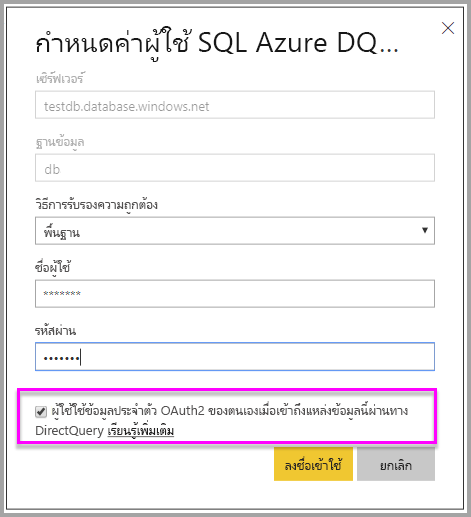

### <a name="token-based-identity-sdk-additions"></a><span data-ttu-id="19f15-268">การเพิ่ม SDK ของข้อมูลประจำตัวที่ใช้โทเค็น</span><span class="sxs-lookup"><span data-stu-id="19f15-268">Token-based Identity SDK additions</span></span>

<span data-ttu-id="19f15-269">คุณสมบัติ blob ของข้อมูลประจำตัวถูกเพิ่มลงในข้อมูลประจำตัวที่มีผลบังคับใช้ของเราในสถานการณ์จำลองการสร้างโทเค็น</span><span class="sxs-lookup"><span data-stu-id="19f15-269">The identity blob property was added to our effective identity in the token generation scenario.</span></span>

```JSON
[JsonProperty(PropertyName = "identityBlob")]
public IdentityBlob IdentityBlob { get; set; }
```

<span data-ttu-id="19f15-270">ประเภทของ Blob ของข้อมูลประจำตัวจะเป็นโครงสร้าง JSON อย่างง่าย ซึ่งจะเก็บคุณสมบัติค่าสตริงไว้</span><span class="sxs-lookup"><span data-stu-id="19f15-270">The IdentityBlob type is a simple JSON structure holding a value string property</span></span>

```JSON
[JsonProperty(PropertyName = "value")]
public string value { get; set; }
```

<span data-ttu-id="19f15-271">สามารถสร้างข้อมูลประจำตัวที่มีผลบังคับใช้ด้วย blob ของข้อมูลประจำตัวโดยใช้การเรียกใช้ต่อไปนี้:</span><span class="sxs-lookup"><span data-stu-id="19f15-271">The EffectiveIdentity can be created with identity blob using the following call:</span></span>

```C#
public EffectiveIdentity(string username, IList<string> datasets, IList<string> roles = null, string customData = null, IdentityBlob identityBlob = null);
```

<span data-ttu-id="19f15-272">สามารถสร้าง blob ของข้อมูลประจำตัวโดยใช้การเรียกใช้ต่อไปนี้</span><span class="sxs-lookup"><span data-stu-id="19f15-272">Identity blob can be created using the following call.</span></span>

```C#
public IdentityBlob(string value);
```

### <a name="token-based-identity-rest-api-usage"></a><span data-ttu-id="19f15-273">การใช้ REST API ของข้อมูลประจำตัวที่ใช้โทเค็น</span><span class="sxs-lookup"><span data-stu-id="19f15-273">Token-based Identity REST API Usage</span></span>

<span data-ttu-id="19f15-274">ถ้าคุณกำลังเรียกใช้ [REST API](/rest/api/power-bi/embedtoken/reports_generatetokeningroup#definitions) คุณสามารถเพิ่ม blob ของข้อมูลประจำภายในข้อมูลประจำตัวแต่ละรายการได้</span><span class="sxs-lookup"><span data-stu-id="19f15-274">If you're calling the [REST API](/rest/api/power-bi/embedtoken/reports_generatetokeningroup#definitions), you can add identity blob inside each identity.</span></span>

```JSON
{
    "accessLevel": "View",
    "identities": [
        {
            "datasets": ["fe0a1aeb-f6a4-4b27-a2d3-b5df3bb28bdc"],
        "identityBlob": {
            "value": "eyJ0eXAiOiJKV1QiLCJh…."
         }
        }
    ]
}
```

<span data-ttu-id="19f15-275">ค่าที่มีให้ใน blob ข้อมูลประจำตัวควรเป็นโทเค็นการเข้าถึงที่ถูกต้องสำหรับ Azure SQL Server (มี URL ทรัพยากรของ (<https://database.windows.net/>)</span><span class="sxs-lookup"><span data-stu-id="19f15-275">The value provided in the identity blob should be a valid access token to Azure SQL Server (with a resource URL of (<https://database.windows.net/>).</span></span>

   > [!Note]
   > <span data-ttu-id="19f15-276">ในการสร้างโทเค็นการเข้าถึงสำหรับ Azure SQL นั้น แอปพลิเคชันต้องมี **ฐานข้อมูล Azure SQL การเข้าถึงและคลังข้อมูล** ที่มอบหมายสิทธิ์แก่ API ของ **ฐานข้อมูล Azure SQL** ในการกำหนดค่าการลงทะเบียนแอป AAD ในพอร์ทัล Azure</span><span class="sxs-lookup"><span data-stu-id="19f15-276">To be able to create an access token for Azure SQL, the application must have **Access Azure SQL DB and Data Warehouse** delegated permission to **Azure SQL Database** API on AAD app registration configuration in the Azure portal.</span></span>

   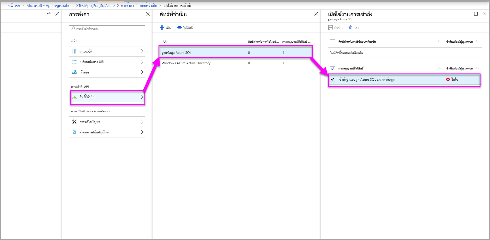

## <a name="on-premises-data-gateway-with-service-principal"></a><span data-ttu-id="19f15-278">เกตเวย์ข้อมูลภายในองค์กรด้วยโครงร่างสำคัญของบริการ</span><span class="sxs-lookup"><span data-stu-id="19f15-278">On-premises data gateway with service principal</span></span>

<span data-ttu-id="19f15-279">ลูกค้าที่กำลังใช้แหล่งข้อมูลการเชื่อมต่อสดภายในองค์กรของ SQL Server Analysis Services (SSAS) สามารถใช้งานความสามารถของ [บริการหลัก](embed-service-principal.md)เพื่อจัดการผู้ใช้และการเข้าถึงข้อมูลใน SSAS ของพวกเขาได้อย่างเต็มที่ เมื่อรวมเข้ากับ **Power BI Embedded**</span><span class="sxs-lookup"><span data-stu-id="19f15-279">Customers that are using SQL Server Analysis Services (SSAS) on-premises live connection data source, can enjoy the [service principal](embed-service-principal.md) capability to manage users and their access to data in SSAS when integrating with **Power BI Embedded**.</span></span>

<span data-ttu-id="19f15-280">การใช้[Power BI REST API](/rest/api/power-bi/) ช่วยให้คุณสามารถระบุข้อมูลประจำตัวที่มีผลบังคับใช้สำหรับการเชื่อมต่อแบบสดภายในองค์กรของ SSAS สำหรับโทเค็นแบบฝังโดยใช้[ออบเจ็กต์ของบริการหลัก](/azure/active-directory/develop/app-objects-and-service-principals#service-principal-object)</span><span class="sxs-lookup"><span data-stu-id="19f15-280">Using [Power BI REST APIs](/rest/api/power-bi/), allows you to specify the effective identity for SSAS on-premises live connections for an embed token using a [service principal object](/azure/active-directory/develop/app-objects-and-service-principals#service-principal-object).</span></span>

<span data-ttu-id="19f15-281">จนถึงตอนนี้ เพื่อให้สามารถระบุข้อมูลประจำตัวที่มีผลบังคับใช้สำหรับการเชื่อมต่อแบบสดภายในองค์กรของ SSAS *ผู้ใช้หลัก* ที่สร้างโทเค็นแบบฝังตัวต้องเป็นผู้ดูแลระบบเกตเวย์ ตอนนี้ แทนที่จะต้องเป็นผู้ดูแลระบบเกตเวย์ ผู้ดูแลระบบเกตเวย์สามารถให้สิทธิ์เฉพาะแก่ผู้ใช้สำหรับแหล่งข้อมูลนั้นที่อนุญาตให้ผู้ใช้สามารถเขียนทับข้อมูลประจำตัวที่มีผลบังคับใช้เมื่อสร้างโทเค็นแบบฝังตัว</span><span class="sxs-lookup"><span data-stu-id="19f15-281">Until now, to be able to specify the effective identity for SSAS on-premises live connection, the *master user* generating the embed token had to be a gateway admin. Now, instead of requiring the user to be gateway admin, the gateway admin can give the user dedicated permission to that data source, that allows the user to override the effective identity when generating the embed token.</span></span> <span data-ttu-id="19f15-282">ความสามารถใหม่นี้จะเปิดใช้งานการฝังด้วยบริการหลักสำหรับการเชื่อมต่อแบบสดของ SSAS</span><span class="sxs-lookup"><span data-stu-id="19f15-282">This new ability enables embedding with service principal for a live SSAS connection.</span></span>

<span data-ttu-id="19f15-283">เมื่อต้องการเปิดใช้งานสถานการณ์สมมตินี้ ผู้ดูแลระบบเกตเวย์สามารถใช้ [เพิ่ม REST API ของผู้ใช้แหล่งข้อมูล](/rest/api/power-bi/gateways/adddatasourceuser) เพื่อให้สิทธิ์ *ReadOverrideEffectiveIdentity* ของบริการหลักสำหรับแหล่งข้อมูล SSAS ได้</span><span class="sxs-lookup"><span data-stu-id="19f15-283">To enable this scenario, the gateway admin uses the [Add Datasource User REST API](/rest/api/power-bi/gateways/adddatasourceuser) to give the service principal the *ReadOverrideEffectiveIdentity* permission for the SSAS data source.</span></span>

<span data-ttu-id="19f15-284">คุณไม่สามารถตั้งค่าสิทธิ์นี้โดยใช้พอร์ทัลผู้ดูแลระบบ</span><span class="sxs-lookup"><span data-stu-id="19f15-284">You can't set this permission using the admin portal.</span></span> <span data-ttu-id="19f15-285">สิทธิ์นี้สามารถตั้งค่าได้เฉพาะด้วย API เท่านั้น</span><span class="sxs-lookup"><span data-stu-id="19f15-285">This permission is only set with the API.</span></span> <span data-ttu-id="19f15-286">ในพอร์ทัลผู้ดูแลระบบ คุณเห็นการระบุสำหรับผู้ใช้และ SPN ที่มีสิทธิ์ดังกล่าว</span><span class="sxs-lookup"><span data-stu-id="19f15-286">In the admin portal, you see an indication for users and SPNs with such permissions.</span></span>

>[!NOTE]
><span data-ttu-id="19f15-287">หากคุณเชื่อมต่อกับฐานข้อมูล SSAS โดยไม่ได้กำหนดค่า RLS ไว้ในนั้น คุณยังต้องระบุข้อมูลประจำตัวที่มีผลบังคับใช้ (ข้อมูลประจำตัวของผู้ดูแลระบบเซิร์ฟเวอร์ SSAS) ในการเรียกใช้การสร้างโทเค็นแบบฝังตัว</span><span class="sxs-lookup"><span data-stu-id="19f15-287">If you are connected to an SSAS database without RLS configured on it, you still need to supply an effective identity (the identity of the SSAS server admin) in the embed token generation call.</span></span>

## <a name="considerations-and-limitations"></a><span data-ttu-id="19f15-288">ข้อควรพิจารณาและข้อจำกัด</span><span class="sxs-lookup"><span data-stu-id="19f15-288">Considerations and limitations</span></span>

* <span data-ttu-id="19f15-289">การกำหนดบทบาทให้ผู้ใช้ภายในบริการ Power BI จะไม่ส่งผลต่อ RLS เมื่อใช้โทเค็นที่ฝัง</span><span class="sxs-lookup"><span data-stu-id="19f15-289">Assignment of users to roles within the Power BI service doesn't affect RLS when using an embed token.</span></span>
* <span data-ttu-id="19f15-290">แม้ว่าบริการ Power BI จะไม่ใช้การตั้งค่า RLS กับผู้ดูแลระบบหรือสมาชิกที่มีสิทธิ์แก้ไข แต่เมื่อคุณใส่ข้อมูลประจำตัวที่มีโทเค็นที่ฝังไว้ การตั้งค่าดังกล่าวจะนำไปใช้กับข้อมูล</span><span class="sxs-lookup"><span data-stu-id="19f15-290">While the Power BI service doesn't apply RLS setting to admins or members with edit permissions, when you supply an identity with an embed token, it applies to the data.</span></span>
* <span data-ttu-id="19f15-291">การเชื่อมต่อแบบสดของ Analysis Services ได้รับการสนับสนุนสำหรับเซิร์ฟเวอร์ภายในองค์กร</span><span class="sxs-lookup"><span data-stu-id="19f15-291">Analysis Services live connections are supported for on-premises servers.</span></span>
* <span data-ttu-id="19f15-292">การเชื่อมต่อแบบสดของ Azure Analysis Services Azure สนับสนุนการกรองด้วยบทบาท</span><span class="sxs-lookup"><span data-stu-id="19f15-292">Azure Analysis Services live connections support filtering by roles.</span></span> <span data-ttu-id="19f15-293">การกรองแบบไดนามิกสามารถทำได้โดยใช้ CustomData</span><span class="sxs-lookup"><span data-stu-id="19f15-293">Dynamic filtering can be done using CustomData.</span></span>
* <span data-ttu-id="19f15-294">ถ้าชุดข้อมูลพื้นฐานไม่จำเป็นต้องใช้ RLS คำขอ GenerateToken ต้อง **ไม่มี** ข้อมูลประจำตัวที่มีผลบังคับใช้</span><span class="sxs-lookup"><span data-stu-id="19f15-294">If the underlying dataset doesn't require RLS, the GenerateToken request must **not** contain an effective identity.</span></span>
* <span data-ttu-id="19f15-295">ถ้าชุดข้อมูลพื้นฐานคือแบบจำลองบนคลาวด์ (แบบจำลองที่แคชหรือ DirectQuery) ข้อมูลประจำตัวที่มีผลบังคับใช้ต้องมีอย่างน้อยหนึ่งบทบาท มิฉะนั้นการมอบหมายบทบาทจะไม่เกิดขึ้น</span><span class="sxs-lookup"><span data-stu-id="19f15-295">If the underlying dataset is a cloud model (cached model or DirectQuery), the effective identity must include at least one role, otherwise role assignment doesn't occur.</span></span>
* <span data-ttu-id="19f15-296">รายการข้อมูลประจำตัวจะเปิดใช้โทเค็นข้อมูลประจำตัวสำหรับการฝังแดชบอร์ด</span><span class="sxs-lookup"><span data-stu-id="19f15-296">A list of identities enables multiple identity tokens for dashboard embedding.</span></span> <span data-ttu-id="19f15-297">สำหรับวัตถุอื่นๆ ทั้งหมด รายการจะประกอบด้วยข้อมูลประจำตัวรายการเดียว</span><span class="sxs-lookup"><span data-stu-id="19f15-297">For all others artifacts, the list contains a single identity.</span></span>

### <a name="token-based-identity-limitations"></a><span data-ttu-id="19f15-298">การจำกัดข้อมูลประจำตัวที่ใช้โทเค็น</span><span class="sxs-lookup"><span data-stu-id="19f15-298">Token-based Identity limitations</span></span>

* <span data-ttu-id="19f15-299">คุณสามารถใช้ RLS ได้ก็ต่อเมื่อคุณมีความจุเท่านั้น</span><span class="sxs-lookup"><span data-stu-id="19f15-299">You can use RLS only if you have a capacity.</span></span>
* <span data-ttu-id="19f15-300">RLS จะใช้ไม่ได้กับ SQL Server ภายในองค์กร</span><span class="sxs-lookup"><span data-stu-id="19f15-300">RLS doesn't work with SQL Server on-premises.</span></span>

<span data-ttu-id="19f15-301">มีคำถามเพิ่มเติมหรือไม่</span><span class="sxs-lookup"><span data-stu-id="19f15-301">More questions?</span></span> [<span data-ttu-id="19f15-302">ลองถามชุมชน Power BI</span><span class="sxs-lookup"><span data-stu-id="19f15-302">Try asking the Power BI Community</span></span>](https://community.powerbi.com/)
