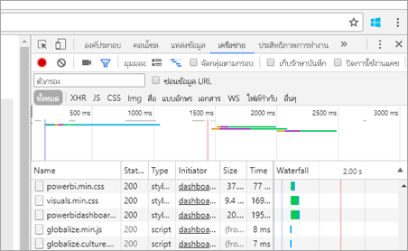
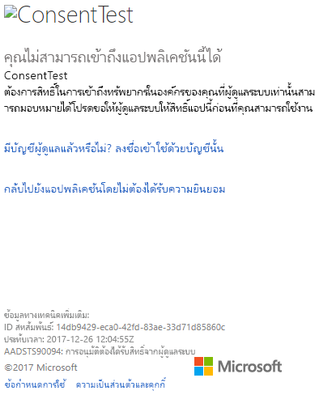
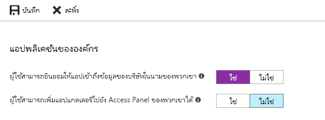

# <a name="troubleshoot-your-embedded-application"></a><span data-ttu-id="90dc2-104">แก้ไขปัญหาแอปพลิเคชันแบบฝังตัวของคุณ</span><span class="sxs-lookup"><span data-stu-id="90dc2-104">Troubleshoot your embedded application</span></span>

<span data-ttu-id="90dc2-105">บทความนี้อธิบายถึงปัญหาทั่วไปที่คุณอาจพบเมื่อฝังเนื้อหาจาก Power BI</span><span class="sxs-lookup"><span data-stu-id="90dc2-105">This article discusses some common issues you may get when embedding content from Power BI.</span></span>

## <a name="tools-to-troubleshoot"></a><span data-ttu-id="90dc2-106">เครื่องมือการแก้ไขปัญหา</span><span class="sxs-lookup"><span data-stu-id="90dc2-106">Tools to troubleshoot</span></span>

### <a name="fiddler-trace"></a><span data-ttu-id="90dc2-107">ติดตาม fiddler</span><span class="sxs-lookup"><span data-stu-id="90dc2-107">Fiddler Trace</span></span>

<span data-ttu-id="90dc2-108">[Fiddler](https://www.telerik.com/fiddler)เป็นเครื่องมือฟรีจาก Telerik ที่ติดตามการส่งข้อมูล HTTP</span><span class="sxs-lookup"><span data-stu-id="90dc2-108">[Fiddler](https://www.telerik.com/fiddler) is a free tool from Telerik that monitors HTTP traffic.</span></span>  <span data-ttu-id="90dc2-109">คุณสามารถดูปริมาณการใช้งานได้ด้วย Power BI API จากเครื่องของลูกค้า</span><span class="sxs-lookup"><span data-stu-id="90dc2-109">You can see the traffic with the Power BI APIs from the client machine.</span></span> <span data-ttu-id="90dc2-110">ซึ่งอาจจะแสดงข้อผิดพลาดและข้อมูลอื่น ๆ ที่เกี่ยวข้อง</span><span class="sxs-lookup"><span data-stu-id="90dc2-110">This tool may show errors and other related information.</span></span>


### <a name="f12-in-browser-for-front-end-debugging"></a><span data-ttu-id="90dc2-112">F12 ในเบราว์เซอร์สำหรับการแก้ไขปัญหาโปรแกรมเสริมหน้า (Front-end)</span><span class="sxs-lookup"><span data-stu-id="90dc2-112">F12 in Browser for front-end debugging</span></span>

<span data-ttu-id="90dc2-113">F12 จะเปิดใช้หน้าต่างผู้พัฒนาภายในเบราว์เซอร์ของคุณ</span><span class="sxs-lookup"><span data-stu-id="90dc2-113">F12 launches the developer window within your browser.</span></span> <span data-ttu-id="90dc2-114">ซึ่งมีความสามารถในการดูปริมาณการใช้งานเครือข่ายและข้อมูลอื่น ๆ</span><span class="sxs-lookup"><span data-stu-id="90dc2-114">This tool provides the ability to look at network traffic and other information.</span></span>



### <a name="extract-error-details-from-power-bi-response"></a><span data-ttu-id="90dc2-116">แยกรายละเอียดข้อผิดพลาดจากคำตอบของ Power BI</span><span class="sxs-lookup"><span data-stu-id="90dc2-116">Extract error details from Power BI response</span></span>

<span data-ttu-id="90dc2-117">ส่วนของรหัสนี้แสดงวิธีการแยกรายละเอียดข้อผิดพลาดจากข้อยกเว้น HTTP:</span><span class="sxs-lookup"><span data-stu-id="90dc2-117">This code snippet shows how to extract the error details from HTTP exception:</span></span>

```csharp
public static string GetExceptionText(this HttpOperationException exc)
{
    var errorText = string.Format("Request: {0}\r\nStatus: {1} ({2})\r\nResponse: {3}",
    exc.Request.Content, exc.Response.StatusCode, (int)exc.Response.StatusCode, exc.Response.Content);
    if (exc.Response.Headers.ContainsKey("RequestId"))
    {
        var requestId = exc.Response.Headers["RequestId"].FirstOrDefault();
        errorText += string.Format("\r\nRequestId: {0}", requestId);
    }

    return errorText;
}
```

<span data-ttu-id="90dc2-118">เราแนะนำให้บันทึกรหัสคำขอ (และรายละเอียดข้อผิดพลาดสำหรับการแก้ไขปัญหา)</span><span class="sxs-lookup"><span data-stu-id="90dc2-118">We recommend logging the Request ID (and error details for troubleshooting).</span></span>
<span data-ttu-id="90dc2-119">โปรดระบุรหัสคำขอเมื่อติดต่อฝ่ายสนับสนุนของ Microsoft</span><span class="sxs-lookup"><span data-stu-id="90dc2-119">Provide the Request ID when approaching Microsoft support.</span></span>

## <a name="app-registration"></a><span data-ttu-id="90dc2-120">การลงทะเบียนแอปฯ</span><span class="sxs-lookup"><span data-stu-id="90dc2-120">App registration</span></span>

### <a name="app-registration-failure"></a><span data-ttu-id="90dc2-121">ความล้มเหลวในการลงทะเบียนแอปฯ</span><span class="sxs-lookup"><span data-stu-id="90dc2-121">App registration failure</span></span>

<span data-ttu-id="90dc2-122">ข้อความข้อผิดพลาดภายในพอร์ทัล Azure หรือหน้าการลงทะเบียนแอป Power BI จะบอกถึงสิทธิ์ที่ไม่เพียงพอ</span><span class="sxs-lookup"><span data-stu-id="90dc2-122">Error messages within the Azure portal or the Power BI app registration page mention insufficient privileges.</span></span> <span data-ttu-id="90dc2-123">หากต้องการลงทะเบียนแอปพลิเคชัน คุณต้องเป็นผู้ดูแลระบบในผู้เช่า Azure AD หรือต้องเปิดใช้งานการลงทะเบียนแอปพลิเคชันสำหรับผู้ใช้ที่ไม่ใช่ผู้ดูแลระบบ</span><span class="sxs-lookup"><span data-stu-id="90dc2-123">To register an application, you must be an admin in the Azure AD tenant or application registrations must be enabled for non-admin users.</span></span>

### <a name="power-bi-service-doesnt-appear-in-the-azure-portal-when-registering-a-new-app"></a><span data-ttu-id="90dc2-124">บริการ Power BI ไม่ปรากฏในพอร์ทัล Azure เมื่อลงทะเบียนแอปใหม่</span><span class="sxs-lookup"><span data-stu-id="90dc2-124">Power BI Service doesn't appear in the Azure portal when registering a new App</span></span>

<span data-ttu-id="90dc2-125">ต้องมีผู้ใช้อย่างน้อยหนึ่งรายลงทะเบียนสำหรับ Power BI</span><span class="sxs-lookup"><span data-stu-id="90dc2-125">At least one user must be signed up for Power BI.</span></span> <span data-ttu-id="90dc2-126">ถ้าคุณไม่เห็น **บริการ Power BI** แสดงอยู่ภายในรายการ API แสดงว่าไม่มีผู้ใช้ที่ลงทะเบียนสำหรับ Power BI</span><span class="sxs-lookup"><span data-stu-id="90dc2-126">If you don't see **Power BI Service** listed within the API list, no user is signed up for Power BI.</span></span>

## <a name="rest-api"></a><span data-ttu-id="90dc2-127">REST API</span><span class="sxs-lookup"><span data-stu-id="90dc2-127">REST API</span></span>

### <a name="api-call-returning-401"></a><span data-ttu-id="90dc2-128">API เรียกให้ส่งกลับ 401</span><span class="sxs-lookup"><span data-stu-id="90dc2-128">API call returning 401</span></span>

<span data-ttu-id="90dc2-129">อาจต้องมีการจับภาพ Fiddler เพื่อการตรวจสอบเพิ่มเติม</span><span class="sxs-lookup"><span data-stu-id="90dc2-129">A fiddler capture may be required to investigate further.</span></span> <span data-ttu-id="90dc2-130">ขอบเขตการอนุญาตสิทธิ์ที่จำเป็นอาจสูญหายสำหรับแอปพลิเคชันที่ลงทะเบียนไว้ภายใน Azure AD</span><span class="sxs-lookup"><span data-stu-id="90dc2-130">The required permission scope may be missing for the registered application within Azure AD.</span></span> <span data-ttu-id="90dc2-131">ตรวจสอบให้แน่ใจว่าขอบเขตที่จำเป็นต้องมีปรากฏอยู่ภายในการลงทะเบียนแอปฯสำหรับ Azure AD ภายในพอร์ทัล Azure</span><span class="sxs-lookup"><span data-stu-id="90dc2-131">Verify the required scope is present within the app registration for Azure AD within the Azure portal.</span></span>

### <a name="api-call-returning-403"></a><span data-ttu-id="90dc2-132">API เรียกให้ส่งกลับ 403</span><span class="sxs-lookup"><span data-stu-id="90dc2-132">API call returning 403</span></span>

<span data-ttu-id="90dc2-133">อาจต้องมีการจับภาพ Fiddler เพื่อการตรวจสอบเพิ่มเติม</span><span class="sxs-lookup"><span data-stu-id="90dc2-133">A fiddler capture may be required to investigate further.</span></span> <span data-ttu-id="90dc2-134">อาจมีหลายสาเหตุสำหรับข้อผิดพลาด 403</span><span class="sxs-lookup"><span data-stu-id="90dc2-134">There could be several reasons for a 403 error.</span></span>

* <span data-ttu-id="90dc2-135">ผู้ใช้มีจำนวนโทเค็นแบบฝังเกินจำนวนที่สามารถสร้างขึ้นได้ในความจุที่ใช้ร่วมกัน</span><span class="sxs-lookup"><span data-stu-id="90dc2-135">The user has exceeded the amount of embed token that can be generated on a shared capacity.</span></span> <span data-ttu-id="90dc2-136">ซื้อความจุ Azure เพื่อสร้างโทเค็นแบบฝัง และกำหนดพื้นที่ทำงานให้กับขีดความจุนั้น</span><span class="sxs-lookup"><span data-stu-id="90dc2-136">Purchase Azure capacities to generate embed tokens and assign the workspace to that capacity.</span></span> <span data-ttu-id="90dc2-137">ดู[ขีดความสามารถในการสร้าง Power BI แบบฝังในพอร์ทัล Azure](/azure/power-bi-embedded/create-capacity)</span><span class="sxs-lookup"><span data-stu-id="90dc2-137">See [Create Power BI Embedded capacity in the Azure portal](/azure/power-bi-embedded/create-capacity).</span></span>
* <span data-ttu-id="90dc2-138">โทเค็นรับรองความถูกต้องของ Azure AD หมดอายุแล้ว</span><span class="sxs-lookup"><span data-stu-id="90dc2-138">The Azure AD auth token expired.</span></span>
* <span data-ttu-id="90dc2-139">ผู้ใช้ที่ได้รับการรับรองความถูกต้องไม่เป็นสมาชิกของกลุ่ม (พื้นที่ทำงาน)</span><span class="sxs-lookup"><span data-stu-id="90dc2-139">The authenticated user isn't a member of the group (workspace).</span></span>
* <span data-ttu-id="90dc2-140">ผู้ใช้ที่ได้รับการรับรองความถูกต้องไม่เป็นผู้ดูแลระบบของกลุ่ม (พื้นที่ทำงาน)</span><span class="sxs-lookup"><span data-stu-id="90dc2-140">The authenticated user isn't an admin of the group (workspace).</span></span>
* <span data-ttu-id="90dc2-141">ผู้ใช้ที่ผ่านการรับรองความถูกต้องแล้วไม่มีสิทธิ์</span><span class="sxs-lookup"><span data-stu-id="90dc2-141">The authenticated user doesn't have permissions.</span></span> <span data-ttu-id="90dc2-142">จะสามารถอัปเดตสิทธิ์ได้โดยใช้[refreshUserPermissions API](/rest/api/power-bi/users/refreshuserpermissions)</span><span class="sxs-lookup"><span data-stu-id="90dc2-142">Permissions can be updated using [refreshUserPermissions API](/rest/api/power-bi/users/refreshuserpermissions)</span></span>
* <span data-ttu-id="90dc2-143">หัวข้อการรับรองความถูกต้องอาจไม่อยู่ในรายการอย่างถูกต้อง</span><span class="sxs-lookup"><span data-stu-id="90dc2-143">The authorization header may not be listed correctly.</span></span> <span data-ttu-id="90dc2-144">ตรวจสอบให้แน่ใจว่าไม่มีการพิมพ์ผิด</span><span class="sxs-lookup"><span data-stu-id="90dc2-144">Make sure there are no typos.</span></span>

<span data-ttu-id="90dc2-145">ส่วนหลังของแอปพลิเคชันอาจจำเป็นต้องรีเฟรชโทเค็นการรับรองความถูกต้องก่อนที่จะเรียก GenerateToken</span><span class="sxs-lookup"><span data-stu-id="90dc2-145">The backend of the application may need to refresh the auth token before calling GenerateToken.</span></span>

```console
GET https://wabi-us-north-central-redirect.analysis.windows.net/metadata/cluster HTTP/1.1
Host: wabi-us-north-central-redirect.analysis.windows.net
...
Authorization: Bearer eyJ0eXAiOi...
...

HTTP/1.1 403 Forbidden
...

{"error":{"code":"TokenExpired","message":"Access token has expired, resubmit with a new access token"}}
```

## <a name="authentication"></a><span data-ttu-id="90dc2-146">การรับรองความถูกต้อง</span><span class="sxs-lookup"><span data-stu-id="90dc2-146">Authentication</span></span>

### <a name="authentication-failed-with-aadsts90002-tenant-authorize-not-found"></a><span data-ttu-id="90dc2-147">การรับรองความถูกต้องล้มเหลวเนื่องจาก AADSTS90002 ไม่พบผู้เช่าที่ได้รับ 'การอนุญาต'</span><span class="sxs-lookup"><span data-stu-id="90dc2-147">Authentication failed with AADSTS90002: Tenant 'authorize' not found</span></span>

 <span data-ttu-id="90dc2-148">หากคุณได้รับข้อความการเข้าสู่ระบบ เช่น \***error: invalid_request, error_description: AADSTS90002: ไม่พบผู้เช่าที่ได้รับ 'การอนุญาต'** _, เนื่องจากไม่สนับสนุน ADAL 4.x "https://login.microsoftonline.com/{Tenant}/oauth2/authorize/" เป็น url ที่มีสิทธิ์</span><span class="sxs-lookup"><span data-stu-id="90dc2-148">If you're receiving messages logging in such as \***error: invalid_request, error_description: AADSTS90002: Tenant 'authorize' not found** _, that is because ADAL 4.x doesn't support "https://login.microsoftonline.com/{Tenant}/oauth2/authorize/" as an authority url.</span></span>
 
<span data-ttu-id="90dc2-149">ในการแก้ไขปัญหานี้คุณควรตัด "oauth2/authorize/" จากท้าย URL ผู้มีสิทธิ์ของคุณ โปรดดู [ตัวอย่างนักพัฒนา Power BI](https://github.com/Microsoft/PowerBI-Developer-Samples) สำหรับการอ้างอิง</span><span class="sxs-lookup"><span data-stu-id="90dc2-149">To resolve this issue you should trim "oauth2/authorize/" from the end of your authority url, see [Power BI Developer Samples](https://github.com/Microsoft/PowerBI-Developer-Samples) for reference.</span></span>

 <span data-ttu-id="90dc2-150">ตรวจสอบ [การตรวจสอบความถูกต้องผู้มีสิทธิ์ที่ดีขึ้น](https://github.com/AzureAD/azure-activedirectory-library-for-dotnet/wiki/Changes-adalnet-4.0#better-authority-validation) จากบันทึกย่อประจำรุ่น ADAL 4.x</span><span class="sxs-lookup"><span data-stu-id="90dc2-150">Check [Better Authority validation](https://github.com/AzureAD/azure-activedirectory-library-for-dotnet/wiki/Changes-adalnet-4.0#better-authority-validation) from ADAL 4.x release notes.</span></span>

### <a name="authentication-failed-with-aadsts70002-or-aadsts50053"></a><span data-ttu-id="90dc2-151">การรับรองความถูกต้องล้มเหลวเนื่องจาก AADSTS70002 หรือ AADSTS50053</span><span class="sxs-lookup"><span data-stu-id="90dc2-151">Authentication failed with AADSTS70002 or AADSTS50053</span></span>

<span data-ttu-id="90dc2-152">_\*_ (AADSTS70002: ข้อมูลประจำตัวที่ตรวจสอบผิดพลาด</span><span class="sxs-lookup"><span data-stu-id="90dc2-152">_\*_(AADSTS70002: Error validating credentials.</span></span> <span data-ttu-id="90dc2-153">AADSTS50053: คุณได้พยายามลงชื่อเข้าใช้หลายครั้งเกินไปด้วยรหัสผู้ใช้หรือรหัสผ่านที่ไม่ถูกต้อง)_\*\*</span><span class="sxs-lookup"><span data-stu-id="90dc2-153">AADSTS50053: You've tried to sign in too many times with an incorrect User ID or password)_\*\*</span></span>

<span data-ttu-id="90dc2-154">หากคุณกำลังใช้ Power BI Embedded และใช้การรับรองความถูกต้อง Azure AD Direct และคุณได้รับข้อความการเข้าสู่ระบบ เช่น \**_error:unauthorized_client, error_description:AADSTS70002: ข้อมูลประจำตัวที่ตรวจสอบผิดพลาด AADSTS50053: คุณได้พยายามลงชื่อเข้าใช้หลายครั้งเกินไปด้วยรหัสผู้ใช้หรือรหัสผ่านที่ไม่ถูกต้อง_* _, เนื่องจากการรับรองความถูกต้องโดยตรงไม่สามารถใช้งานได้ตั้งแต่วันที่ 14 มิถุนายน 2018 ตามค่าเริ่มต้น</span><span class="sxs-lookup"><span data-stu-id="90dc2-154">If you're using Power BI Embedded and using Azure AD Direct authentication, and you're receiving messages logging in such as \**_error:unauthorized_client, error_description:AADSTS70002: Error validating credentials. AADSTS50053: You've tried to sign in too many times with an incorrect User ID or password_* _, that is because direct authentication is no longer in use since June 14, 2018 by default.</span></span>

<span data-ttu-id="90dc2-155">นั่นคือวิธีการเปลี่ยนไปใช้ [นโยบาย Azure AD ](/azure/active-directory/manage-apps/configure-authentication-for-federated-users-portal#enable-direct-authentication-for-legacy-applications)ที่กำหนดขอบเขตสำหรับองค์กรหรือ[ผู้ให้บริการหลัก](/azure/active-directory/develop/active-directory-application-objects#service-principal-object)</span><span class="sxs-lookup"><span data-stu-id="90dc2-155">There's a way to turn this back on using an [Azure AD Policy](/azure/active-directory/manage-apps/configure-authentication-for-federated-users-portal#enable-direct-authentication-for-legacy-applications) that is scoped to the organization or a [service principal](/azure/active-directory/develop/active-directory-application-objects#service-principal-object).</span></span>

<span data-ttu-id="90dc2-156">เราขอแนะนำให้คุณเปิดใช้งานนโยบายนี้เป็นแบบต่อแอปเท่านั้น</span><span class="sxs-lookup"><span data-stu-id="90dc2-156">We recommend you enable this policy only as a per-app basis.</span></span>

<span data-ttu-id="90dc2-157">เมื่อต้องสร้างนโยบายนี้ คุณจำเป็นต้องเป็น_ *ผู้ดูแลระบบส่วนกลาง*\* สำหรับไดเรกทอรีที่คุณกำลังสร้างนโยบายและกำหนดสิ่งต่าง ๆ</span><span class="sxs-lookup"><span data-stu-id="90dc2-157">To create this policy, you need to be a _ *Global Administrator*\* for the directory where you're creating the policy and assigning.</span></span> <span data-ttu-id="90dc2-158">นี่คือสคริปต์ตัวอย่างสำหรับการสร้างนโยบาย และกำหนดนโยบายให้กับ SP สำหรับแอปพลิเคชันนี้:</span><span class="sxs-lookup"><span data-stu-id="90dc2-158">Here is a sample script for creating the policy and assigning it to the SP for this application:</span></span>

1. <span data-ttu-id="90dc2-159">ติดตั้ง[การแสดงโมดูล Powershell ของ Azure AD](/powershell/azure/active-directory/install-adv2)</span><span class="sxs-lookup"><span data-stu-id="90dc2-159">Install the [Azure AD Preview PowerShell Module](/powershell/azure/active-directory/install-adv2).</span></span>

2. <span data-ttu-id="90dc2-160">เรียกใช้คำสั่ง Powershell แบบบรรทัดต่อบรรทัดต่อไปนี้ (ตรวจสอบให้แน่ใจว่าตัวแปร $sp ไม่มีแอปพลิเคชันมากกว่าหนึ่งรายการเป็นผลลัพธ์)</span><span class="sxs-lookup"><span data-stu-id="90dc2-160">Run the following PowerShell commands line-by-line (making sure the variable $sp doesn't have more than one application as a result).</span></span>

```powershell
Connect-AzureAD
```

```powershell
$sp = Get-AzureADServicePrincipal -SearchString "Name_Of_Application"
```

```powershell
$policy = New-AzureADPolicy -Definition @("{`"HomeRealmDiscoveryPolicy`":{`"AllowCloudPasswordValidation`":true}}") -DisplayName EnableDirectAuth -Type HomeRealmDiscoveryPolicy -IsOrganizationDefault $false
```

```powershell
Add-AzureADServicePrincipalPolicy -Id $sp.ObjectId -RefObjectId $policy.Id 
```

<span data-ttu-id="90dc2-161">หลังจากกำหนดนโยบาย โปรดรอประมาณ 15-20 วินาทีสำหรับการเผยแพร่ก่อนการทดสอบ</span><span class="sxs-lookup"><span data-stu-id="90dc2-161">After assigning the policy, wait approximately 15-20 seconds for propagation before testing.</span></span>

### <a name="generate-token-fails-when-providing-effective-identity"></a><span data-ttu-id="90dc2-162">การสร้างโทเค็นล้มเหลวเมื่อระบุข้อมูลประจำตัวที่ใช้ได้</span><span class="sxs-lookup"><span data-stu-id="90dc2-162">Generate token fails when providing effective identity</span></span>

<span data-ttu-id="90dc2-163">GenerateToken สามารถล้มเหลวได้เมื่อใช้งานข้อมูลประจำตัวที่ให้มาด้วยเหตุผลสองสามประการ</span><span class="sxs-lookup"><span data-stu-id="90dc2-163">GenerateToken can fail, with effective identity supplied, for a few different reasons.</span></span>

* <span data-ttu-id="90dc2-164">ชุดข้อมูลไม่รองรับข้อมูลประจำตัวที่ใช้ได้</span><span class="sxs-lookup"><span data-stu-id="90dc2-164">Dataset doesn't support effective identity</span></span>
* <span data-ttu-id="90dc2-165">ไม่ได้ระบุชื่อผู้ใช้</span><span class="sxs-lookup"><span data-stu-id="90dc2-165">Username wasn't provided</span></span>
* <span data-ttu-id="90dc2-166">ไม่ได้ระบุบทบาท</span><span class="sxs-lookup"><span data-stu-id="90dc2-166">Role wasn't provided</span></span>
* <span data-ttu-id="90dc2-167">ไม่ได้ระบุรหัสชุดข้อมูล</span><span class="sxs-lookup"><span data-stu-id="90dc2-167">DatasetId wasn't provided</span></span>
* <span data-ttu-id="90dc2-168">ผู้ใช้ไม่มีสิทธิ์ที่ถูกต้อง</span><span class="sxs-lookup"><span data-stu-id="90dc2-168">User doesn't have the correct permissions</span></span>

<span data-ttu-id="90dc2-169">เพื่่อตรวจสอบว่ามีสาเหตุจากอะไร ให้ลองทำตามขั้นตอนต่อไปนี้</span><span class="sxs-lookup"><span data-stu-id="90dc2-169">To verify which it is, try the steps below.</span></span>

* <span data-ttu-id="90dc2-170">ดำเนินการ[รับชุดข้อมูล](/rest/api/power-bi/datasets)</span><span class="sxs-lookup"><span data-stu-id="90dc2-170">Execute [get dataset](/rest/api/power-bi/datasets).</span></span> <span data-ttu-id="90dc2-171">คุณสมบัติ IsEffectiveIdentityRequired เป็นจริงหรือไม่?</span><span class="sxs-lookup"><span data-stu-id="90dc2-171">Is the property IsEffectiveIdentityRequired true?</span></span>
* <span data-ttu-id="90dc2-172">ชื่อผู้ใช้เป็นข้อบังคับสำหรับ EffectiveIdentity ใด ๆ</span><span class="sxs-lookup"><span data-stu-id="90dc2-172">Username is mandatory for any EffectiveIdentity.</span></span>
* <span data-ttu-id="90dc2-173">ถ้า IsEffectiveIdentityRolesRequired เป็นจริง ดังนั้นต้องมีบทบาท</span><span class="sxs-lookup"><span data-stu-id="90dc2-173">If IsEffectiveIdentityRolesRequired is true, Role is required.</span></span>
* <span data-ttu-id="90dc2-174">รหัสชุดข้อมูลเป็นข้อบังคับสำหรับ EffectiveIdentity ใด ๆ</span><span class="sxs-lookup"><span data-stu-id="90dc2-174">DatasetId is mandatory for any EffectiveIdentity.</span></span>
* <span data-ttu-id="90dc2-175">สำหรับ Analysis Services ผู้ใช้หลักจะต้องเป็นผู้ดูแลระบบเกตเวย์</span><span class="sxs-lookup"><span data-stu-id="90dc2-175">For Analysis Services, the master user has to be a gateway admin.</span></span>

### <a name="aadsts90094-the-grant-requires-admin-permission"></a><span data-ttu-id="90dc2-176">AADSTS90094: การอนุมัติต้องใช้สิทธิของผู้ดูแลระบบ</span><span class="sxs-lookup"><span data-stu-id="90dc2-176">AADSTS90094: The grant requires admin permission</span></span>

<span data-ttu-id="90dc2-177">**_ปัญหา:_**</span><span class="sxs-lookup"><span data-stu-id="90dc2-177">**_Symptoms:_**</span></span><br>
<span data-ttu-id="90dc2-178">เมื่อผู้ใช้ที่ไม่ใช่ผู้ดูแลระบบพยายามลงชื่อเข้าใช้แอปพลิเคชันเป็นครั้งแรกในขณะที่ให้การยินยอม จากนั้นจะเกิดข้อผิดพลาดอย่างใดอย่างหนึ่งต่อไปนี้:</span><span class="sxs-lookup"><span data-stu-id="90dc2-178">When a non-admin user tries to sign in to an application for the first time while granting consent, then gets one of the following errors:</span></span>

* <span data-ttu-id="90dc2-179">ConsentTest ต้องการสิทธิ์ในการเข้าถึงทรัพยากรในองค์กรของคุณที่ผู้ดูแลระบบเท่านั้นสามารถมอบหมายได้</span><span class="sxs-lookup"><span data-stu-id="90dc2-179">ConsentTest needs permission to access resources in your organization that only an admin can grant.</span></span> <span data-ttu-id="90dc2-180">สอบถามผู้ดูแลระบบเพื่อขอสิทธิการใช้งานแอปนี้ก่อนที่คุณสามารถใช้งาน</span><span class="sxs-lookup"><span data-stu-id="90dc2-180">Ask an admin to grant permission to this app before you can use it.</span></span>
* <span data-ttu-id="90dc2-181">AADSTS90094: การอนุมัติต้องได้รับสิทธิ์จากผู้ดูแลระบบ</span><span class="sxs-lookup"><span data-stu-id="90dc2-181">AADSTS90094: The grant requires admin permission.</span></span>

    

<span data-ttu-id="90dc2-183">ผู้ใช้ที่เป็นผู้ดูแลระบบสามารถลงชื่อเข้าใช้ และให้การยินยอมเรียบร้อยแล้ว</span><span class="sxs-lookup"><span data-stu-id="90dc2-183">An admin user can sign in and grant consent successfully.</span></span>

<span data-ttu-id="90dc2-184">**_สาเหตุ:_**</span><span class="sxs-lookup"><span data-stu-id="90dc2-184">**_Root cause:_**</span></span><br>
<span data-ttu-id="90dc2-185">การอนุมัติของผู้ใช้ถูกปิดใช้งานสำหรับผู้เช่า</span><span class="sxs-lookup"><span data-stu-id="90dc2-185">User consent is disabled for the tenant.</span></span>

<span data-ttu-id="90dc2-186">**_แก้ไขปัญหาได้ดังนี้้:_**</span><span class="sxs-lookup"><span data-stu-id="90dc2-186">**_Several fixes are possible:_**</span></span>

<span data-ttu-id="90dc2-187">*เปิดใช้งานการอนุมัติของผู้ใข้สำหรับผู้เช่าทั้งหมด (ผู้ใช้ทั้งหมด แอปพลิเคชั้นทั้งหมด)*</span><span class="sxs-lookup"><span data-stu-id="90dc2-187">*Enable user consent for the entire tenant (all users, all applications)*</span></span>

1. <span data-ttu-id="90dc2-188">ในพอร์ทัล Azure ไปที่ "Azure Active Directory" = > "ผู้ใช้และกลุ่ม" = > "การตั้งค่าผู้ใช้"</span><span class="sxs-lookup"><span data-stu-id="90dc2-188">In the Azure portal, navigate to "Azure Active Directory" => "Users and groups" => "User settings"</span></span>
2. <span data-ttu-id="90dc2-189">เปิดใช้งานการตั้งค่า “ผู้ใช้สามารถยินยอมให้แอปเข้าถึงข้อมูลของบริษัทในนามของพวกเขา” แล้วเลือก บันทึก การเปลี่ยนแปลง</span><span class="sxs-lookup"><span data-stu-id="90dc2-189">Enable the "Users can consent to apps accessing company data on their behalf" setting and save the changes</span></span>

    

<span data-ttu-id="90dc2-191">*ให้สิทธิ* ในแอปพลิเคชันโดยผู้ดูแลระบบบ - สำหรับผู้เช่าทั้งหมดหรือผู้ใช้ที่ระบุ</span><span class="sxs-lookup"><span data-stu-id="90dc2-191">*Grant permissions* to the application by an admin - either for the entire tenant or a specific user.</span></span>

### <a name="cs1061-error"></a><span data-ttu-id="90dc2-192">ข้อผิดพลาด CS1061</span><span class="sxs-lookup"><span data-stu-id="90dc2-192">CS1061 error</span></span>

<span data-ttu-id="90dc2-193">ดาวน์โหลด [Microsoft.IdentityModel.Clients.ActiveDirectory](https://www.nuget.org/packages/Microsoft.IdentityModel.Clients.ActiveDirectory/2.22.302111727) ถ้าคุณพบข้อผิดพลาด "'AuthenticationContext' ไม่มีคำจำกัดความของ 'AcquireToken' และไม่พบการเข้าถึง 'AcquireToken' ที่ยอมรับอาร์กิวเมนต์แรกในประเภท 'AuthenticationContext' (คุณไม่ได้ใช้คำสั่งหรือการอ้างอิงแอสเซมบลีใช่ไหม)"</span><span class="sxs-lookup"><span data-stu-id="90dc2-193">Download [Microsoft.IdentityModel.Clients.ActiveDirectory](https://www.nuget.org/packages/Microsoft.IdentityModel.Clients.ActiveDirectory/2.22.302111727) if you experience an "'AuthenticationContext' does not contain a definition for 'AcquireToken' and no accessible 'AcquireToken' accepting a first argument of type 'AuthenticationContext' could be found (are you missing a using directive or an assembly reference?)" error.</span></span>

## <a name="data-sources"></a><span data-ttu-id="90dc2-194">แหล่งข้อมูล</span><span class="sxs-lookup"><span data-stu-id="90dc2-194">Data sources</span></span>

### <a name="isv-wants-to-have-different-credentials-for-the-same-data-source"></a><span data-ttu-id="90dc2-195">ISV ต้องการข้อมูลประจำตัวอื่นสำหรับแหล่งข้อมูลเดียวกัน</span><span class="sxs-lookup"><span data-stu-id="90dc2-195">ISV wants to have different credentials for the same data source</span></span>

<span data-ttu-id="90dc2-196">แหล่งข้อมูลสามารถมีหนึ่งชุดข้อมูลประจำตัวสำหรับผู้ใช้หลักหนึ่งราย</span><span class="sxs-lookup"><span data-stu-id="90dc2-196">A data source can have a single set of credentials for one master user.</span></span> <span data-ttu-id="90dc2-197">ถ้าคุณจำเป็นต้องใช้ข้อมูลประจำตัวอื่น ให้สร้างผู้ใช้หลักเพิ่มเติม</span><span class="sxs-lookup"><span data-stu-id="90dc2-197">If you need to use different credentials, create additional master users.</span></span> <span data-ttu-id="90dc2-198">จากนั้น กำหนดข้อมูลประจำตัวอื่นในบริบทผู้ใช้หลักแต่ละคน จากนั้นฝังโดยใช้โทเค็น Azure AD ของผู้ใช้นั้น</span><span class="sxs-lookup"><span data-stu-id="90dc2-198">Then, assign the different credentials in each of the master users contexts, and embed using the Azure AD token of that user.</span></span>

## <a name="troubleshoot-your-embedded-application-with-the-ierror-object"></a><span data-ttu-id="90dc2-199">แก้ไขปัญหาแอปพลิเคชันแบบฝังตัวของคุณด้วยออบเจ็กต์ IError</span><span class="sxs-lookup"><span data-stu-id="90dc2-199">Troubleshoot your embedded application with the IError object</span></span>

<span data-ttu-id="90dc2-200">ใช้ [**วัตถุ IError** ถูกส่งกลับด้วยเหตุการณ์ *ข้อผิดพลาด* จาก **JavaScript SDK**](https://github.com/Microsoft/PowerBI-JavaScript/wiki/Troubleshooting-and-debugging-of-embedded-parts)เพื่อแก้จุดบกพร่องของแอปพลิเคชันของคุณ และทำความเข้าใจสาเหตุของข้อผิดพลาดของคุณได้ดียิ่งขึ้น</span><span class="sxs-lookup"><span data-stu-id="90dc2-200">Use the [**IError object** returned by the *error* event from the **JavaScript SDK**](https://github.com/Microsoft/PowerBI-JavaScript/wiki/Troubleshooting-and-debugging-of-embedded-parts) to debug your application and better understand the cause of your errors.</span></span>

<span data-ttu-id="90dc2-201">หลังจากการรับวัตถุ IError คุณควรดูที่ตารางข้อผิดพลาดทั่วไปที่เหมาะสมกับชนิดฝังตัวที่คุณกำลังใช้</span><span class="sxs-lookup"><span data-stu-id="90dc2-201">After acquiring the IError object, you should look at the appropriate common errors table that fits the embed type you're using.</span></span> <span data-ttu-id="90dc2-202">เปรียบเทียบ **คุณสมบัติ IError** ด้วยคุณสมบัติที่อยู่ในตารางและค้นหาเหตุผลสำหรับความล้มเหลวที่เป็นไปได้</span><span class="sxs-lookup"><span data-stu-id="90dc2-202">Compare the **IError properties** with the ones in the table and find the possible reason(s) for the failure.</span></span>

### <a name="typical-errors-when-embedding-for-power-bi-users"></a><span data-ttu-id="90dc2-203">ข้อผิดพลาดทั่วไปเมื่อมีการฝังสำหรับผู้ใช้ Power BI</span><span class="sxs-lookup"><span data-stu-id="90dc2-203">Typical errors when embedding for Power BI users</span></span>

| <span data-ttu-id="90dc2-204">ข้อความ</span><span class="sxs-lookup"><span data-stu-id="90dc2-204">Message</span></span> | <span data-ttu-id="90dc2-205">ข้อความรายละเอียด</span><span class="sxs-lookup"><span data-stu-id="90dc2-205">Detailed Message</span></span> | <span data-ttu-id="90dc2-206">รหัสข้อผิดพลาด</span><span class="sxs-lookup"><span data-stu-id="90dc2-206">Error Code</span></span> | <span data-ttu-id="90dc2-207">เหตุผลที่เป็นไปได้</span><span class="sxs-lookup"><span data-stu-id="90dc2-207">Possible reason(s)</span></span> |
|-------------------------------------------------------|-----------------------------------------------------------------------------------------------------------------------------|-----------|--------------------------------------------------------|
| <span data-ttu-id="90dc2-208">TokenExpired</span><span class="sxs-lookup"><span data-stu-id="90dc2-208">TokenExpired</span></span> | <span data-ttu-id="90dc2-209">โทเค็นการเข้าถึงหมดอายุแล้ว ส่งอีกครั้งด้วยโทเค็นการเข้าถึงใหม่</span><span class="sxs-lookup"><span data-stu-id="90dc2-209">Access token has expired, resubmit with a new access token</span></span> | <span data-ttu-id="90dc2-210">403</span><span class="sxs-lookup"><span data-stu-id="90dc2-210">403</span></span> | <span data-ttu-id="90dc2-211">โทเค็นหมดอายุแล้ว</span><span class="sxs-lookup"><span data-stu-id="90dc2-211">Expired token</span></span>  |
| <span data-ttu-id="90dc2-212">PowerBIEntityNotFound</span><span class="sxs-lookup"><span data-stu-id="90dc2-212">PowerBIEntityNotFound</span></span> | <span data-ttu-id="90dc2-213">รับรายงานล้มเหลว</span><span class="sxs-lookup"><span data-stu-id="90dc2-213">Get report failed</span></span> | <span data-ttu-id="90dc2-214">404</span><span class="sxs-lookup"><span data-stu-id="90dc2-214">404</span></span> | <li> <span data-ttu-id="90dc2-215">รหัสรายงานผิด</span><span class="sxs-lookup"><span data-stu-id="90dc2-215">Wrong Report ID</span></span> <li> <span data-ttu-id="90dc2-216">ไม่มีรายงาน</span><span class="sxs-lookup"><span data-stu-id="90dc2-216">Report doesn't exist</span></span>  |
| <span data-ttu-id="90dc2-217">พารามิเตอร์ไม่ถูกต้อง</span><span class="sxs-lookup"><span data-stu-id="90dc2-217">Invalid parameters</span></span> | <span data-ttu-id="90dc2-218">ไม่ได้ระบุพารามิเตอร์ powerbiToken</span><span class="sxs-lookup"><span data-stu-id="90dc2-218">powerbiToken parameter not specified</span></span> | <span data-ttu-id="90dc2-219">N/A</span><span class="sxs-lookup"><span data-stu-id="90dc2-219">N/A</span></span> | <li> <span data-ttu-id="90dc2-220">ไม่มีโทเค็นการเข้าถึงให้</span><span class="sxs-lookup"><span data-stu-id="90dc2-220">No access token provided</span></span> <li> <span data-ttu-id="90dc2-221">ไม่มีรหัสรายงานให้</span><span class="sxs-lookup"><span data-stu-id="90dc2-221">No Report ID provided</span></span> |
| <span data-ttu-id="90dc2-222">LoadReportFailed</span><span class="sxs-lookup"><span data-stu-id="90dc2-222">LoadReportFailed</span></span> | <span data-ttu-id="90dc2-223">การเตรียมใช้งานล้มเหลว - ไม่สามารถแก้ไขคลัสเตอร์ได้</span><span class="sxs-lookup"><span data-stu-id="90dc2-223">Fail to initialize - Couldn't resolve cluster</span></span> | <span data-ttu-id="90dc2-224">403</span><span class="sxs-lookup"><span data-stu-id="90dc2-224">403</span></span> | <span data-ttu-id="90dc2-225">\* โทเค็นการเข้าถึงไม่ดี \* ชนิดที่ฝังไม่ตรงกับชนิดของโทเค็น</span><span class="sxs-lookup"><span data-stu-id="90dc2-225">\* Bad access token \* Embed type doesn't match token type</span></span> |
| <span data-ttu-id="90dc2-226">PowerBINotAuthorizedException</span><span class="sxs-lookup"><span data-stu-id="90dc2-226">PowerBINotAuthorizedException</span></span> | <span data-ttu-id="90dc2-227">รับรายงานล้มเหลว</span><span class="sxs-lookup"><span data-stu-id="90dc2-227">Get report failed</span></span> | <span data-ttu-id="90dc2-228">401</span><span class="sxs-lookup"><span data-stu-id="90dc2-228">401</span></span> | <li> <span data-ttu-id="90dc2-229">รหัสกลุ่มไม่ถูกต้อง</span><span class="sxs-lookup"><span data-stu-id="90dc2-229">Wrong group ID</span></span> <li> <span data-ttu-id="90dc2-230">กลุ่มที่ไม่ได้รับอนุญาต</span><span class="sxs-lookup"><span data-stu-id="90dc2-230">Unauthorized group</span></span> |
| <span data-ttu-id="90dc2-231">TokenExpired</span><span class="sxs-lookup"><span data-stu-id="90dc2-231">TokenExpired</span></span> | <span data-ttu-id="90dc2-232">โทเค็นการเข้าถึงหมดอายุ ให้ส่งอีกครั้งด้วยโทเค็นการเข้าถึงใหม่</span><span class="sxs-lookup"><span data-stu-id="90dc2-232">Access token has expired, resubmit with a new access token.</span></span> <span data-ttu-id="90dc2-233">ไม่สามารถแสดงชื่อเรื่องภาพรายงานได้: <visual title></span><span class="sxs-lookup"><span data-stu-id="90dc2-233">Couldn't render a report visual titled: <visual title></span></span> | <span data-ttu-id="90dc2-234">N/A</span><span class="sxs-lookup"><span data-stu-id="90dc2-234">N/A</span></span> | <span data-ttu-id="90dc2-235">โทเค็นที่หมดอายุแล้วของข้อมูลการสอบถาม</span><span class="sxs-lookup"><span data-stu-id="90dc2-235">Query data Expired token</span></span> |
| <span data-ttu-id="90dc2-236">OpenConnectionError</span><span class="sxs-lookup"><span data-stu-id="90dc2-236">OpenConnectionError</span></span> | <span data-ttu-id="90dc2-237">ไม่สามารถแสดงภาพได้</span><span class="sxs-lookup"><span data-stu-id="90dc2-237">Can't display the visual.</span></span> <span data-ttu-id="90dc2-238">ไม่สามารถแสดงชื่อเรื่องภาพรายงานได้: <visual title></span><span class="sxs-lookup"><span data-stu-id="90dc2-238">Couldn't render a report visual titled: <visual title></span></span> | <span data-ttu-id="90dc2-239">N/A</span><span class="sxs-lookup"><span data-stu-id="90dc2-239">N/A</span></span> | <span data-ttu-id="90dc2-240">หยุดกำลังการผลิตชั่วคราว หรือลบในขณะที่รายงานที่เกี่ยวข้องกับความจุถูกเปิดในเซสชัน</span><span class="sxs-lookup"><span data-stu-id="90dc2-240">Capacity paused or deleted while a report related to the capacity was open in a session</span></span> |
| <span data-ttu-id="90dc2-241">ExplorationContainer_FailedToLoadModel_DefaultDetails</span><span class="sxs-lookup"><span data-stu-id="90dc2-241">ExplorationContainer_FailedToLoadModel_DefaultDetails</span></span> | <span data-ttu-id="90dc2-242">ไม่สามารถโหลด schema สำหรับโมเดลที่เกี่ยวข้องกับรายงานนี้</span><span class="sxs-lookup"><span data-stu-id="90dc2-242">Couldn't load the model schema associated with this report.</span></span> <span data-ttu-id="90dc2-243">ตรวจสอบให้แน่ใจว่าคุณมีการเชื่อมต่อไปยังเซิร์ฟเวอร์ แล้วลองอีกครั้ง</span><span class="sxs-lookup"><span data-stu-id="90dc2-243">Make sure you have a connection to the server and try again.</span></span> | <span data-ttu-id="90dc2-244">N/A</span><span class="sxs-lookup"><span data-stu-id="90dc2-244">N/A</span></span> | <li> <span data-ttu-id="90dc2-245">หยุดกำลังการผลิตชั่วคราว</span><span class="sxs-lookup"><span data-stu-id="90dc2-245">Capacity paused</span></span> <li> <span data-ttu-id="90dc2-246">ลบกำลังการผลิต</span><span class="sxs-lookup"><span data-stu-id="90dc2-246">Capacity deleted</span></span> |

### <a name="typical-errors-when-embedding-for-non-power-bi-users-using-an-embed-token"></a><span data-ttu-id="90dc2-247">เกิดข้อผิดพลาดทั่วไปเมื่อมีการฝังสำหรับผู้ใช้ที่ไม่ใช่ Power BI (โดยใช้โทเค็นแบบฝัง)</span><span class="sxs-lookup"><span data-stu-id="90dc2-247">Typical errors when embedding for non-Power BI users (using an Embed Token)</span></span>

| <span data-ttu-id="90dc2-248">ข้อความ</span><span class="sxs-lookup"><span data-stu-id="90dc2-248">Message</span></span> | <span data-ttu-id="90dc2-249">ข้อความรายละเอียด</span><span class="sxs-lookup"><span data-stu-id="90dc2-249">Detailed Message</span></span> | <span data-ttu-id="90dc2-250">รหัสข้อผิดพลาด</span><span class="sxs-lookup"><span data-stu-id="90dc2-250">Error Code</span></span> | <span data-ttu-id="90dc2-251">เหตุผล</span><span class="sxs-lookup"><span data-stu-id="90dc2-251">Reason(s)</span></span> |
|-------------------------------------------------------|-------------------------------------------------------------------------------------------------------------------------------|------------|-------------------------------------------------|
| <span data-ttu-id="90dc2-252">TokenExpired</span><span class="sxs-lookup"><span data-stu-id="90dc2-252">TokenExpired</span></span> | <span data-ttu-id="90dc2-253">โทเค็นการเข้าถึงหมดอายุแล้ว ส่งอีกครั้งด้วยโทเค็นการเข้าถึงใหม่</span><span class="sxs-lookup"><span data-stu-id="90dc2-253">Access token has expired, resubmit with a new access token</span></span> | <span data-ttu-id="90dc2-254">403</span><span class="sxs-lookup"><span data-stu-id="90dc2-254">403</span></span> | <span data-ttu-id="90dc2-255">โทเค็นหมดอายุแล้ว</span><span class="sxs-lookup"><span data-stu-id="90dc2-255">Expired token</span></span>  |
| <span data-ttu-id="90dc2-256">LoadReportFailed</span><span class="sxs-lookup"><span data-stu-id="90dc2-256">LoadReportFailed</span></span> | <span data-ttu-id="90dc2-257">รับรายงานล้มเหลว</span><span class="sxs-lookup"><span data-stu-id="90dc2-257">Get report failed</span></span> | <span data-ttu-id="90dc2-258">404</span><span class="sxs-lookup"><span data-stu-id="90dc2-258">404</span></span> | <li> <span data-ttu-id="90dc2-259">รหัสรายงานผิด</span><span class="sxs-lookup"><span data-stu-id="90dc2-259">Wrong Report ID</span></span> <li> <span data-ttu-id="90dc2-260">ไม่มีรายงาน</span><span class="sxs-lookup"><span data-stu-id="90dc2-260">Report doesn't exist</span></span>  |
| <span data-ttu-id="90dc2-261">LoadReportFailed</span><span class="sxs-lookup"><span data-stu-id="90dc2-261">LoadReportFailed</span></span> | <span data-ttu-id="90dc2-262">รับรายงานล้มเหลว</span><span class="sxs-lookup"><span data-stu-id="90dc2-262">Get report failed</span></span> | <span data-ttu-id="90dc2-263">403</span><span class="sxs-lookup"><span data-stu-id="90dc2-263">403</span></span> | <span data-ttu-id="90dc2-264">รหัสรายงานไม่ตรงกับโทเค็น</span><span class="sxs-lookup"><span data-stu-id="90dc2-264">Report ID doesn't match token</span></span> |
| <span data-ttu-id="90dc2-265">LoadReportFailed</span><span class="sxs-lookup"><span data-stu-id="90dc2-265">LoadReportFailed</span></span> | <span data-ttu-id="90dc2-266">รับรายงานล้มเหลว</span><span class="sxs-lookup"><span data-stu-id="90dc2-266">Get report failed</span></span> | <span data-ttu-id="90dc2-267">500</span><span class="sxs-lookup"><span data-stu-id="90dc2-267">500</span></span> | <span data-ttu-id="90dc2-268">รหัสที่ระบุในรายงานไม่ใช่รหัสเฉพาะ</span><span class="sxs-lookup"><span data-stu-id="90dc2-268">Report provided ID isn't a guid</span></span> |
| <span data-ttu-id="90dc2-269">พารามิเตอร์ไม่ถูกต้อง</span><span class="sxs-lookup"><span data-stu-id="90dc2-269">Invalid parameters</span></span> | <span data-ttu-id="90dc2-270">ไม่ได้ระบุพารามิเตอร์ powerbiToken</span><span class="sxs-lookup"><span data-stu-id="90dc2-270">powerbiToken parameter not specified</span></span> | <span data-ttu-id="90dc2-271">N/A</span><span class="sxs-lookup"><span data-stu-id="90dc2-271">N/A</span></span> | <li> <span data-ttu-id="90dc2-272">ไม่มีโทเค็นการเข้าถึงให้</span><span class="sxs-lookup"><span data-stu-id="90dc2-272">No access token provided</span></span> <li> <span data-ttu-id="90dc2-273">ไม่มีรหัสรายงานให้</span><span class="sxs-lookup"><span data-stu-id="90dc2-273">No Report ID provided</span></span> |
| <span data-ttu-id="90dc2-274">LoadReportFailed</span><span class="sxs-lookup"><span data-stu-id="90dc2-274">LoadReportFailed</span></span> | <span data-ttu-id="90dc2-275">การเตรียมใช้งานล้มเหลว - ไม่สามารถแก้ไขคลัสเตอร์ได้</span><span class="sxs-lookup"><span data-stu-id="90dc2-275">Fail to initialize - Couldn't resolve cluster</span></span> | <span data-ttu-id="90dc2-276">403</span><span class="sxs-lookup"><span data-stu-id="90dc2-276">403</span></span> | <span data-ttu-id="90dc2-277">ชนิดโทเค็นไม่ถูกต้อง โทเค็นไม่เหมาะสม</span><span class="sxs-lookup"><span data-stu-id="90dc2-277">Wrong token type, Bad Token</span></span> |
| <span data-ttu-id="90dc2-278">PowerBINotAuthorizedException</span><span class="sxs-lookup"><span data-stu-id="90dc2-278">PowerBINotAuthorizedException</span></span> | <span data-ttu-id="90dc2-279">การรับรายงานล้มเหลว</span><span class="sxs-lookup"><span data-stu-id="90dc2-279">Get   report failed</span></span> | <span data-ttu-id="90dc2-280">401</span><span class="sxs-lookup"><span data-stu-id="90dc2-280">401</span></span> | <span data-ttu-id="90dc2-281">รหัสกลุ่มไม่ถูกต้อง/ไม่ได้รับอนุญาต</span><span class="sxs-lookup"><span data-stu-id="90dc2-281">Wrong/unauthorize group ID</span></span> |
| <span data-ttu-id="90dc2-282">TokenExpired</span><span class="sxs-lookup"><span data-stu-id="90dc2-282">TokenExpired</span></span> | <span data-ttu-id="90dc2-283">โทเค็นการเข้าถึงหมดอายุ ให้ส่งอีกครั้งด้วยโทเค็นการเข้าถึงใหม่</span><span class="sxs-lookup"><span data-stu-id="90dc2-283">Access token has expired, resubmit with a new access token.</span></span> <span data-ttu-id="90dc2-284">ไม่สามารถแสดงชื่อเรื่องภาพรายงานได้: <visual title></span><span class="sxs-lookup"><span data-stu-id="90dc2-284">Couldn't render a report visual titled: <visual title></span></span> | <span data-ttu-id="90dc2-285">N/A</span><span class="sxs-lookup"><span data-stu-id="90dc2-285">N/A</span></span> | <span data-ttu-id="90dc2-286">โทเค็นที่หมดอายุแล้วของข้อมูลการสอบถาม</span><span class="sxs-lookup"><span data-stu-id="90dc2-286">Query data Expired token</span></span> |
| <span data-ttu-id="90dc2-287">OpenConnectionError</span><span class="sxs-lookup"><span data-stu-id="90dc2-287">OpenConnectionError</span></span> | <span data-ttu-id="90dc2-288">ไม่สามารถแสดงภาพได้</span><span class="sxs-lookup"><span data-stu-id="90dc2-288">Can't display the visual.</span></span> <span data-ttu-id="90dc2-289">ไม่สามารถแสดงชื่อเรื่องภาพรายงานได้: <visual title></span><span class="sxs-lookup"><span data-stu-id="90dc2-289">Couldn't render a report visual titled: <visual title></span></span> | <span data-ttu-id="90dc2-290">N/A</span><span class="sxs-lookup"><span data-stu-id="90dc2-290">N/A</span></span> | <span data-ttu-id="90dc2-291">หยุดกำลังการผลิตชั่วคราว หรือลบในขณะที่รายงานที่เกี่ยวข้องกับความจุถูกเปิดในเซสชัน</span><span class="sxs-lookup"><span data-stu-id="90dc2-291">Capacity paused or deleted while a report related to the capacity was open in a session</span></span> |
| <span data-ttu-id="90dc2-292">ExplorationContainer_FailedToLoadModel_DefaultDetails</span><span class="sxs-lookup"><span data-stu-id="90dc2-292">ExplorationContainer_FailedToLoadModel_DefaultDetails</span></span> | <span data-ttu-id="90dc2-293">ไม่สามารถโหลด schema สำหรับโมเดลที่เกี่ยวข้องกับรายงานนี้</span><span class="sxs-lookup"><span data-stu-id="90dc2-293">Couldn't load the model schema associated with this report.</span></span> <span data-ttu-id="90dc2-294">ตรวจสอบให้แน่ใจว่าคุณมีการเชื่อมต่อไปยังเซิร์ฟเวอร์ แล้วลองอีกครั้ง</span><span class="sxs-lookup"><span data-stu-id="90dc2-294">Make sure you have a connection to the server and try again.</span></span> | <span data-ttu-id="90dc2-295">N/A</span><span class="sxs-lookup"><span data-stu-id="90dc2-295">N/A</span></span> | <li> <span data-ttu-id="90dc2-296">หยุดกำลังการผลิตชั่วคราว</span><span class="sxs-lookup"><span data-stu-id="90dc2-296">Capacity paused</span></span> <li> <span data-ttu-id="90dc2-297">ลบกำลังการผลิต</span><span class="sxs-lookup"><span data-stu-id="90dc2-297">Capacity deleted</span></span> |

## <a name="content-rendering"></a><span data-ttu-id="90dc2-298">แสดงเนื้อหา</span><span class="sxs-lookup"><span data-stu-id="90dc2-298">Content rendering</span></span>

### <a name="performance"></a><span data-ttu-id="90dc2-299">ประสิทธิภาพการทำงาน</span><span class="sxs-lookup"><span data-stu-id="90dc2-299">Performance</span></span>

[<span data-ttu-id="90dc2-300">ประสิทธิภาพการทำงานของ Power BI Embedded</span><span class="sxs-lookup"><span data-stu-id="90dc2-300">Power BI Embedded performance</span></span>](embedded-performance-best-practices.md)

### <a name="rendering-or-consumption-of-embedded-content-fails-or-times-out"></a><span data-ttu-id="90dc2-301">การแสดงหรือการใช้เนื้อหาแบบฝังตัวล้มเหลวหรือหมดเวลา</span><span class="sxs-lookup"><span data-stu-id="90dc2-301">Rendering, or consumption, of embedded content, fails or times out</span></span>

<span data-ttu-id="90dc2-302">ตรวจสอบให้แน่ใจว่าโทเค็นฝังตัวไม่หมดอายุ</span><span class="sxs-lookup"><span data-stu-id="90dc2-302">Make sure the embed token did not expire.</span></span> <span data-ttu-id="90dc2-303">ตรวจสอบให้แน่ใจว่าคุณกำลังตรวจสอบวันหมดอายุของโทเค็นแบบฝังตัวและรีเฟรชโทเค็น</span><span class="sxs-lookup"><span data-stu-id="90dc2-303">Make sure you're checking the embed token expiration and refreshing it.</span></span> <span data-ttu-id="90dc2-304">สำหรับข้อมูลเพิ่มเติม ดู[รีเฟรชโทเค็นโดยใช้ JavaScript SDK](https://github.com/Microsoft/PowerBI-JavaScript/wiki/Refresh-token-using-JavaScript-SDK-example)</span><span class="sxs-lookup"><span data-stu-id="90dc2-304">For more information, see [Refresh token using JavaScript SDK](https://github.com/Microsoft/PowerBI-JavaScript/wiki/Refresh-token-using-JavaScript-SDK-example).</span></span>

### <a name="report-or-dashboard-doesnt-load"></a><span data-ttu-id="90dc2-305">รายงานหรือแดชบอร์ดไม่โหลด</span><span class="sxs-lookup"><span data-stu-id="90dc2-305">Report or dashboard doesn't load</span></span>

<span data-ttu-id="90dc2-306">ถ้าผู้ใช้ไม่สามารถดูรายงานหรือแดชบอร์ดได้ ตรวจสอบให้แน่ใจว่ารายงานหรือแดชบอร์ดโหลดอย่างถูกต้องภายใน powerbi.com</span><span class="sxs-lookup"><span data-stu-id="90dc2-306">If the user is unable to see the report or dashboard, make sure the report or dashboard loads correctly within powerbi.com.</span></span> <span data-ttu-id="90dc2-307">รายงานหรือแดชบอร์ดจะไม่ทำงานภายในแอปพลิเคชันของคุณหากไม่โหลดภายใน powerbi.com</span><span class="sxs-lookup"><span data-stu-id="90dc2-307">The report or dashboard doesn't work within your application if it doesn't load within powerbi.com.</span></span>

### <a name="report-or-dashboard-is-performing-slowly"></a><span data-ttu-id="90dc2-308">รายงานหรือแดชบอร์ดทำงานช้า</span><span class="sxs-lookup"><span data-stu-id="90dc2-308">Report or dashboard is performing slowly</span></span>

<span data-ttu-id="90dc2-309">เปิดไฟล์จาก Power BI Desktop หรือภายใน powerbi.com และตรวจสอบว่าประสิทธิภาพการทำงานนั้นยอมรับได้สำหรับการไม่รวมปัญหากับแอปพลิเคชันของคุณหรือ API ที่ฝัง</span><span class="sxs-lookup"><span data-stu-id="90dc2-309">Open the file from Power BI Desktop, or within powerbi.com, and verify that performance is acceptable to rule out issues with your application or the embedding APIs.</span></span>

## <a name="embed-setup-tool"></a><span data-ttu-id="90dc2-310">เครื่องมือตั้งค่าแบบฝัง</span><span class="sxs-lookup"><span data-stu-id="90dc2-310">Embed setup tool</span></span>

<span data-ttu-id="90dc2-311">คุณสามารถเข้าถึง[เครื่องมือตั้งค่าการฝังตัว](https://aka.ms/embedsetup) เพื่อดาวน์โหลดแอปพลิเคชันตัวอย่างได้อย่างรวดเร็ว</span><span class="sxs-lookup"><span data-stu-id="90dc2-311">You can go through the [Embedding setup tool](https://aka.ms/embedsetup) to quickly download a sample application.</span></span> <span data-ttu-id="90dc2-312">จากนั้น คุณสามารถเปรียบเทียบแอปพลิเคชันของคุณกับตัวอย่าง</span><span class="sxs-lookup"><span data-stu-id="90dc2-312">Then you can compare your application to the sample.</span></span>

### <a name="prerequisites"></a><span data-ttu-id="90dc2-313">ข้อกำหนดเบื้องต้น</span><span class="sxs-lookup"><span data-stu-id="90dc2-313">Prerequisites</span></span>

<span data-ttu-id="90dc2-314">ตรวจสอบว่าคุณผ่านข้อกำหนดเบื้องต้นทั้งหมด ก่อนที่จะใช้เครื่องมือตั้งค่าการฝังตัว</span><span class="sxs-lookup"><span data-stu-id="90dc2-314">Verify that you have all the proper prerequisites before using the Embedding setup tool.</span></span> <span data-ttu-id="90dc2-315">คุณต้องมีบัญชี **Power BI Pro** และการสมัครใช้งาน **Microsoft Azure**</span><span class="sxs-lookup"><span data-stu-id="90dc2-315">You need a **Power BI Pro** account and a **Microsoft Azure** subscription.</span></span>

* <span data-ttu-id="90dc2-316">ถ้าคุณยังไม่ได้ลงทะเบียนสำหรับ **Power BI Pro**[ลงทะเบียนทดลองใช้ฟรี](https://powerbi.microsoft.com/pricing/)ก่อนที่คุณจะเริ่ม</span><span class="sxs-lookup"><span data-stu-id="90dc2-316">If you're not signed up for **Power BI Pro**, [sign up for a free trial](https://powerbi.microsoft.com/pricing/) before you begin.</span></span>
* <span data-ttu-id="90dc2-317">ถ้าคุณยังไม่มีการสมัครใช้งาน Azure สร้าง[บัญชีฟรี](https://azure.microsoft.com/free/?WT.mc_id=A261C142F)ก่อนที่คุณจะเริ่ม</span><span class="sxs-lookup"><span data-stu-id="90dc2-317">If you don't have an Azure subscription, create a [free account](https://azure.microsoft.com/free/?WT.mc_id=A261C142F) before you begin.</span></span>
* <span data-ttu-id="90dc2-318">คุณจำเป็นต้องตั้งค่า[ผู้เช่า Azure Active Directory](create-an-azure-active-directory-tenant.md) ของคุณเอง</span><span class="sxs-lookup"><span data-stu-id="90dc2-318">You need to have your own [Azure Active Directory tenant ](create-an-azure-active-directory-tenant.md) setup.</span></span>
* <span data-ttu-id="90dc2-319">คุณต้องติดตั้ง [Visual Studio](https://www.visualstudio.com/) (เวอร์ชัน 2013 หรือใหม่กว่า)</span><span class="sxs-lookup"><span data-stu-id="90dc2-319">You need [Visual Studio](https://www.visualstudio.com/) installed (version 2013 or later).</span></span>

### <a name="common-issues"></a><span data-ttu-id="90dc2-320">ปัญหาที่พบบ่อย</span><span class="sxs-lookup"><span data-stu-id="90dc2-320">Common Issues</span></span>

<span data-ttu-id="90dc2-321">ปัญหาทั่วไปที่คุณอาจพบขณะทดสอบเครื่องมือตั้งค่าแบบฝังตัวคือ:</span><span class="sxs-lookup"><span data-stu-id="90dc2-321">Some common issues you might encounter while testing with the Embed setup tool are:</span></span>

#### <a name="using-the-embed-for-your-customers-sample-application"></a><span data-ttu-id="90dc2-322">การใช้แอปพลิเคชันตัวอย่าง การฝังตัวสำหรับของลูกค้าคุณ</span><span class="sxs-lookup"><span data-stu-id="90dc2-322">Using the Embed for your customers sample application</span></span>

<span data-ttu-id="90dc2-323">ถ้าคุณกำลังทำงานกับประสบการณ์ **ฝังตัวสำหรับลูกค้าของคุณ** บันทึกและคลายการบีบอัดไฟล์ *PowerBI-Developer-Samples.zip*</span><span class="sxs-lookup"><span data-stu-id="90dc2-323">If you're working with the **Embed for your customers** experience, save and unzip the *PowerBI-Developer-Samples.zip* file.</span></span> <span data-ttu-id="90dc2-324">จากนั้น เปิดโฟลเดอร์ *PowerBI-Developer-Samples-master\App Owns Data* และเรียกใช้ไฟล์ *PowerBIEmbedded_AppOwnsData.sln*</span><span class="sxs-lookup"><span data-stu-id="90dc2-324">Then open the *PowerBI-Developer-Samples-master\App Owns Data* folder and run the *PowerBIEmbedded_AppOwnsData.sln* file.</span></span>

<span data-ttu-id="90dc2-325">เมื่อเลือก **ให้สิทธิ์** (ขั้นตอนการให้สิทธิ์) คุณได้รับข้อผิดพลาดต่อไปนี้:</span><span class="sxs-lookup"><span data-stu-id="90dc2-325">When selecting **Grant permissions** (the Grant permissions step), you get the following error:</span></span>

```output
AADSTS70001: Application with identifier <client ID> wasn't found in the directory <directory ID>
```

<span data-ttu-id="90dc2-326">ทางแก้คือ ปิดหน้าต่างที่ผุดขึ้น รอสักครู่ แล้วลองอีกครั้ง</span><span class="sxs-lookup"><span data-stu-id="90dc2-326">The solution is to close the popup, wait a few seconds and try again.</span></span> <span data-ttu-id="90dc2-327">คุณอาจต้องทำซ้ำหลายครั้ง</span><span class="sxs-lookup"><span data-stu-id="90dc2-327">You might need to repeat this action a few times.</span></span> <span data-ttu-id="90dc2-328">ระยะเวลาจากการเสร็จสิ้นกระบวนการลงทะเบียนแอปพลิเคชันจนถึงเวลาที่พร้อมใช้งานสำหรับ API ภายนอกคือต้นเหตุของปัญหา</span><span class="sxs-lookup"><span data-stu-id="90dc2-328">A time interval causes the issue from completing the application registration process to when it's available to external APIs.</span></span>

<span data-ttu-id="90dc2-329">ข้อผิดพลาดต่อไปนี้ปรากฏขึ้นเมื่อเรียกใช้แอปตัวอย่าง:</span><span class="sxs-lookup"><span data-stu-id="90dc2-329">The following error message appears when running the sample app:</span></span>

```output
Password is empty. Please fill password of Power BI username in web.config.
```

<span data-ttu-id="90dc2-330">ข้อผิดพลาดนี้เกิดขึ้นเนื่องจากค่ารหัสผ่านผู้ใช้ของคุณยังไม่ได้ใส่เข้าไปในแอปพลิเคชันตัวอย่าง</span><span class="sxs-lookup"><span data-stu-id="90dc2-330">This error occurs because the only value that isn't being injected into the sample application is your user password.</span></span> <span data-ttu-id="90dc2-331">เปิดแฟ้ม Web.config ในโซลูชัน และกรอกเขตข้อมูล pbiPassword ด้วยรหัสผ่านผู้ใช้ของคุณ</span><span class="sxs-lookup"><span data-stu-id="90dc2-331">Open the Web.config file in the solution and fill the pbiPassword field with your user's password.</span></span>

<span data-ttu-id="90dc2-332">ถ้าคุณได้รับข้อผิดพลาด - AADSTS50079: ผู้ใช้จะต้องใช้การรับรองความถูกต้องแบบหลายปัจจัย</span><span class="sxs-lookup"><span data-stu-id="90dc2-332">If you get the error - AADSTS50079: The user is required to use multi-factor authentication.</span></span>

<span data-ttu-id="90dc2-333">จำเป็นต้องใช้บัญชี AAD ที่ไม่ได้เปิดใช้งาน MFA</span><span class="sxs-lookup"><span data-stu-id="90dc2-333">Need to use an AAD account that doesn't have MFA enabled.</span></span>

#### <a name="using-the-embed-for-your-organization-sample-application"></a><span data-ttu-id="90dc2-334">การใช้แอปพลิเคชันตัวอย่าง การฝังตัวสำหรับองค์กรของคุณ</span><span class="sxs-lookup"><span data-stu-id="90dc2-334">Using the Embed for your organization sample application</span></span>

<span data-ttu-id="90dc2-335">ถ้าคุณกำลังทำงานกับประสบการณ์ **ฝังตัวสำหรับองค์กรของคุณ** บันทึกและคลายการบีบอัดไฟล์ *PowerBI-Developer-Samples.zip*</span><span class="sxs-lookup"><span data-stu-id="90dc2-335">If you're working with the **Embed for your organization** experience, save and unzip the *PowerBI-Developer-Samples.zip* file.</span></span> <span data-ttu-id="90dc2-336">จากนั้น เปิดโฟลเดอร์ *PowerBI-Developer-Samples-master\User Owns Data\integrate-report-web-app* และเรียกใช้ไฟล์ *pbi-saas-embed-report.sln*</span><span class="sxs-lookup"><span data-stu-id="90dc2-336">Then open the *PowerBI-Developer-Samples-master\User Owns Data\integrate-report-web-app* folder and run the *pbi-saas-embed-report.sln* file.</span></span>

<span data-ttu-id="90dc2-337">เมื่อคุณเรียกใช้แอปตัวอย่าง **ฝังตัวสำหรับองค์กรของคุณ** คุณได้รับข้อผิดพลาดต่อไปนี้:</span><span class="sxs-lookup"><span data-stu-id="90dc2-337">When you run the **Embed for your organization** sample app, you get the following error:</span></span>

```output
AADSTS50011: The reply URL specified in the request doesn't match the reply URLs configured for the application: <client ID>
```

<span data-ttu-id="90dc2-338">ข้อผิดพลาดนี้เกิดจาก URL เปลี่ยนเส้นทางที่ระบุสำหรับเว็บเซิร์ฟเวอร์แอปพลิเคชันแตกต่างจาก URL ของตัวอย่าง</span><span class="sxs-lookup"><span data-stu-id="90dc2-338">This error is because the redirect URL specified for the web-server application is different from the sample's URL.</span></span> <span data-ttu-id="90dc2-339">ถ้าคุณต้องการลงทะเบียนแอปพลิเคชันตัวอย่าง ใช้ `https://localhost:13526/` เป็น URL เปลี่ยนเส้นทาง</span><span class="sxs-lookup"><span data-stu-id="90dc2-339">If you want to register the sample application, then use `https://localhost:13526/` as the redirect URL.</span></span>

<span data-ttu-id="90dc2-340">หากคุณต้องการแก้ไขแอปพลิเคชันที่ลงทะเบียนไว้ ให้เรียนรู้วิธี [อัปเดตแอปพลิเคชัน  Azure AD ที่ลงทะเบียนไว้](/azure/active-directory/develop/quickstart-v1-update-azure-ad-app) เพื่อที่แอปพลิเคชันจะสามารถให้สิทธิ์เข้าถึง API ของเว็บได้</span><span class="sxs-lookup"><span data-stu-id="90dc2-340">If you'd like to edit the registered application, then learn how to [update the Azure AD-registered application](/azure/active-directory/develop/quickstart-v1-update-azure-ad-app), so the application can provide access to the web APIs.</span></span>

<span data-ttu-id="90dc2-341">ถ้าคุณต้องการแก้ไขโปรไฟล์หรือข้อมูลผู้ใช้ Power BI ของคุณ เรียนรู้วิธีการแก้ไข[ข้อมูล Power BI](../../fundamentals/service-basic-concepts.md) ของคุณ</span><span class="sxs-lookup"><span data-stu-id="90dc2-341">If you would like to edit your Power BI user profile or data, then learn how to edit your [Power BI data](../../fundamentals/service-basic-concepts.md).</span></span>

<span data-ttu-id="90dc2-342">ถ้าคุณได้รับข้อผิดพลาด - AADSTS50079: ผู้ใช้จะต้องใช้การรับรองความถูกต้องแบบหลายปัจจัย</span><span class="sxs-lookup"><span data-stu-id="90dc2-342">If you get the error - AADSTS50079: The user is required to use multi-factor authentication.</span></span>

<span data-ttu-id="90dc2-343">จำเป็นต้องใช้บัญชี AAD ที่ไม่ได้เปิดใช้งาน MFA</span><span class="sxs-lookup"><span data-stu-id="90dc2-343">Need to use an AAD account that doesn't have MFA enabled.</span></span>

<span data-ttu-id="90dc2-344">สำหรับข้อมูลเพิ่มเติม โปรดดู [คำถามที่ถามบ่อยของ Power BI Embedded](embedded-faq.md)</span><span class="sxs-lookup"><span data-stu-id="90dc2-344">For more information, please see [Power BI Embedded FAQ](embedded-faq.md).</span></span>

<span data-ttu-id="90dc2-345">มีคำถามเพิ่มเติมหรือไม่</span><span class="sxs-lookup"><span data-stu-id="90dc2-345">More questions?</span></span> [<span data-ttu-id="90dc2-346">ลองไปที่ชุมชน Power BI</span><span class="sxs-lookup"><span data-stu-id="90dc2-346">Try the Power BI Community</span></span>](https://community.powerbi.com/)

<span data-ttu-id="90dc2-347">หากคุณต้องการความช่วยเหลือเพิ่มเติม โปรด [ติดต่อฝ่ายสนับสนุน](https://powerbi.microsoft.com/support/pro/?Type=documentation&q=power+bi+embedded) หรือ [สร้างตั๋วการสนับสนุนผ่านพอร์ทัล Azure](https://ms.portal.azure.com/#blade/Microsoft_Azure_Support/HelpAndSupportBlade/newsupportrequest) และระบุข้อความแสดงข้อผิดพลาดที่คุณพบ</span><span class="sxs-lookup"><span data-stu-id="90dc2-347">If you require further assistance, then [contact support](https://powerbi.microsoft.com/support/pro/?Type=documentation&q=power+bi+embedded) or [create a support ticket via the Azure portal](https://ms.portal.azure.com/#blade/Microsoft_Azure_Support/HelpAndSupportBlade/newsupportrequest) and provide the error messages you encounter.</span></span>

## <a name="next-steps"></a><span data-ttu-id="90dc2-348">ขั้นตอนถัดไป</span><span class="sxs-lookup"><span data-stu-id="90dc2-348">Next steps</span></span>

<span data-ttu-id="90dc2-349">สำหรับข้อมูลเพิ่มเติม ให้ดู [คำถามที่พบบ่อย](embedded-faq.md)</span><span class="sxs-lookup"><span data-stu-id="90dc2-349">For more information, see [FAQs](embedded-faq.md).</span></span>

<span data-ttu-id="90dc2-350">มีคำถามเพิ่มเติมหรือไม่</span><span class="sxs-lookup"><span data-stu-id="90dc2-350">More questions?</span></span> [<span data-ttu-id="90dc2-351">ลองไปที่ชุมชน Power BI</span><span class="sxs-lookup"><span data-stu-id="90dc2-351">Try the Power BI Community</span></span>](https://community.powerbi.com/)