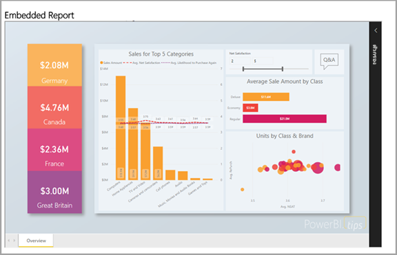
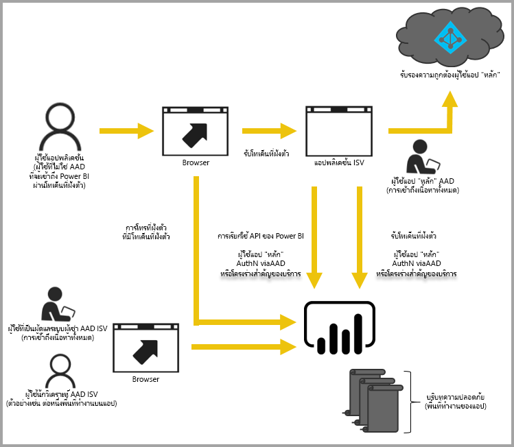

# การวิเคราะห์แบบฝังตัวด้วย Power BIEmbedded analytics with Power BI

บริการ Power BI (SaaS) และบริการ Power BI Embedded ใน Azure (PaaS) มี API สำหรับการฝังสำหรับแดชบอร์ดและรายงานThe Power BI service (SaaS) and the Power BI Embedded service in Azure (PaaS) have APIs for embedding your dashboards and reports. เมื่อทำการฝังเนื้อหา คุณจะสามารถเข้าถึงคุณลักษณะล่าสุดของ Power BI เช่น แดชบอร์ด เกตเวย์ และพื้นที่ทำงานWhen embedding content, this gives you access to the latest Power BI features such as dashboards, gateways, and workspaces.

คุณสามารถเข้าถึง[เครื่องมือตั้งค่าการฝังตัว](https://aka.ms/embedsetup)เพื่อเริ่มต้นใช้งานได้อย่างรวดเร็ว และดาวน์โหลดแอปพลิเคชันตัวอย่างได้You can go through the [Embedding setup tool](https://aka.ms/embedsetup) to quickly get started and download a sample application.

เลือกโซลูชันที่เหมาะกับคุณ:Choose the solution that is right for you:

* [การฝังตัวสำหรับองค์กรของคุณ](embedding.md#embedding-for-your-organization) ให้คุณสามารถขยายบริการของ Power BI[Embedding for your organization](embedding.md#embedding-for-your-organization) allows you to extend the Power BI service. เมื่อต้องการทำเช่นนี้ ให้ใช้โซลูชัน *ฝังตัวสำหรับองค์กรของคุณ* ใน [เครื่องมือตั้งค่าการฝังตัว](https://app.powerbi.com/embedsetup)To do this, in the [Embedding setup tool](https://app.powerbi.com/embedsetup), implement the *Embed for your organization* solution.
* [การฝังสำหรับลูกค้าของคุณ](embedding.md#embedding-for-your-customers)ช่วยให้คุณสามารถฝังแดชบอร์ดและรายงานสำหรับผู้ใช้ที่ไม่มีบัญชี Power BI[Embedding for your customers](embedding.md#embedding-for-your-customers) allows you to embed dashboards and reports to users who don't have a Power BI account. เมื่อต้องการทำเช่นนี้ ให้ใช้โซลูชัน *ฝังตัวสำหรับลูกค้าของคุณ* ใน [เครื่องมือตั้งค่าการฝังตัว](https://app.powerbi.com/embedsetup)To do this, in the [Embedding setup tool](https://app.powerbi.com/embedsetup), implement the *Embed for your customers* solution.

## ใช้ APIUse APIs

มีสองสถานการณ์หลักสำหรับการฝังเนื้อหา Power BI:There are two main scenarios for embedding Power BI content:
- การฝังสำหรับผู้ใช้ขององค์กรของคุณ (ที่มีสิทธิการใช้งาน Power BI)Embedding for your organization's users (who have Power BI licenses). 
 
- การฝังสำหรับผู้ใช้และลูกค้าของคุณโดยไม่จำเป็นต้องมีสิทธิการใช้งาน Power BIEmbedding for your users and customers without requiring Power BI licenses. 

[Power BI REST API](/rest/api/power-bi/) ใช้ได้สำหรับทั้งสองสถานการณ์The [Power BI REST API](/rest/api/power-bi/) allows for both scenarios.

สำหรับลูกค้าและผู้ใช้ที่มีใบอนุญาต Power BI คุณสามารถฝังแดชบอร์ดและรายงานลงในแอปพลิเคชันแบบกำหนดเองโดยใช้ API เดียวกันเพื่อให้บริการแก่องค์กรหรือลูกค้าของคุณFor customers and users without Power BI licenses, you can embed dashboards and reports into your custom application, using the same API to either service your organization or your customers. ลูกค้าของคุณจะเห็นข้อมูลที่จัดการโดยแอปพลิเคชันYour customers see the application-managed data. นอกจากนี้ ผู้ใช้ Power BI ในองค์กรของคุณจะมีทางเลือกเพิ่มเติมในการดู *ข้อมูลของพวกเขา* ได้โดยตรงใน Power BI หรือบริบทของแอปพลิเคชันแบบฝังAlso, your organization's Power BI users have additional options to view *their data* directly in Power BI or in the  embedded application's context. คุณสามารถใช้ประโยชน์สูงสุดจาก JavaScript และ REST API สำหรับความต้องการในการฝังของคุณYou can take full advantage of the JavaScript and REST APIs for your embedding needs.

เมื่อต้องการทำความเข้าใจวิธีการทำงานของการฝัง โปรดดู[ตัวอย่างการฝัง JavaScript](https://microsoft.github.io/PowerBI-JavaScript/demo/)To understand how embedding works, see the [JavaScript embed sample](https://microsoft.github.io/PowerBI-JavaScript/demo/).

## การฝังสำหรับองค์กรของคุณEmbedding for your organization

**การฝังตัวสำหรับองค์กรของคุณ** ให้คุณสามารถขยายบริการของ Power BI**Embedding for your organization** allows you to extend the Power BI service. การฝังประเภทนี้ต้องการให้ผู้ใช้แอปพลิเคชันของคุณลงชื่อเข้าใช้บริการ Power BI เพื่อดูเนื้อหาThis type of embedding requires your application's users sign into the Power BI service to view the content. เมื่อบุคคลใดบุคคลหนึ่งในองค์กรลงชื่อเข้าใช้ พวกเขาสามารถเข้าถึงแดชบอร์ดและรายงานที่พวกเขาเป็นเจ้าของ หรือที่แชร์กับบุคคลเหล่านั้นในบริการ Power BI เท่านั้นOnce someone in your organization signs in, they only have access to dashboards and reports that they own or that someone shared with them in the Power BI service.

ตัวอย่างการฝังสำหรับองค์กรรวมถึงแอปพลิเคชันภายใน เช่น [SharePoint Online](https://powerbi.microsoft.com/blog/integrate-power-bi-reports-in-sharepoint-online/)[การทำงานร่วมกับ Microsoft Teams (คุณต้องมีสิทธิผู้ดูแลระบบ)](https://powerbi.microsoft.com/blog/power-bi-teams-up-with-microsoft-teams/) และ [Microsoft Dynamics](/dynamics365/customer-engagement/basics/add-edit-power-bi-visualizations-dashboard)Organization embedding examples include internal applications such as [SharePoint Online](https://powerbi.microsoft.com/blog/integrate-power-bi-reports-in-sharepoint-online/), [Microsoft Teams integration (you must have Admin rights)](https://powerbi.microsoft.com/blog/power-bi-teams-up-with-microsoft-teams/), and [Microsoft Dynamics](/dynamics365/customer-engagement/basics/add-edit-power-bi-visualizations-dashboard).

เมื่อต้องฝังสำหรับองค์กรของคุณ ดู[บทช่วยสอน: ฝังเนื้อหา Power BI ลงในแอปพลิเคชันสำหรับองค์กรของคุณ](embed-sample-for-your-organization.md)To embed for your organization, see [Tutorial: Embed Power BI content into an application for your organization](embed-sample-for-your-organization.md).

ความสามารถในการทำงานด้วยตนเอง เช่น แก้ไข บันทึก และอื่นๆ จะพร้อมใช้งานผ่าน [JavaScript API](https://github.com/Microsoft/PowerBI-JavaScript) เมื่อมีการฝังสำหรับผู้ใช้ Power BISelf-service capabilities, such as edit, save, and more, are available through the [JavaScript API](https://github.com/Microsoft/PowerBI-JavaScript) when embedding for Power BI users.

คุณสามารถใช้[เครื่องมือตั้งค่าการฝัง](https://app.powerbi.com/embedsetup)เพื่อเริ่มต้นและดาวน์โหลดแอปพลิเคชันตัวอย่างที่จะนำคุณไปสู่การรวมรายงานสำหรับองค์กรของคุณYou can go through the [Embedding setup tool](https://app.powerbi.com/embedsetup) to get started and download a sample application that walks you through integrating a report for your organization.

## การฝังสำหรับลูกค้าของคุณEmbedding for your customers

**การฝังสำหรับลูกค้าของคุณ** ช่วยให้คุณสามารถฝังแดชบอร์ดและรายงานสำหรับผู้ใช้ที่ไม่มีบัญชี Power BI**Embedding for your customers** lets you embed dashboards and reports for users who don't have a Power BI account. การฝังประเภทนี้ยังเรียกว่า *Power BI Embedded* ด้วยThis type of embedding is also known as *Power BI Embedded*.

[Power BI Embedded](azure-pbie-what-is-power-bi-embedded.md) เป็นบริการของ **Microsoft Azure** ที่ช่วยให้นักพัฒนาและผู้จำหน่ายซอฟต์แวร์อิสระ (ISV) ฝังภาพ รายงาน และแดชบอร์ดลงในแอปพลิเคชันได้อย่างรวดเร็ว[Power BI Embedded](azure-pbie-what-is-power-bi-embedded.md) is a **Microsoft Azure** service that lets independent software vendors (ISVs) and developers quickly embed visuals, reports, and dashboards into an application. การฝังนี้สามารถทำผ่านแบบจำลองการวัดผลรายชั่วโมงตามความจุThis embedding is done through a capacity-based, hourly metered model.

Power BI Embedded มีประโยชน์สำหรับ ISV นักพัฒนาซอฟต์แวร์ และลูกค้าPower BI Embedded has benefits for an ISV, their developers, and customers. ตัวอย่างเช่น ISV สามารถเริ่มต้นสร้างภาพฟรีด้วย Power BI DesktopFor example, an ISV can start creating visuals for free with Power BI Desktop. ISV สามารถบรรลุเวลาในการทำตลาดได้เร็วขึ้นโดยลดความพยายามในการพัฒนาเชิงวิเคราะห์ทางภาพให้เหลือน้อยที่สุดและโดดเด่นท่ามกลางการแข่งขันด้วยประสบการณ์ด้านข้อมูลที่แตกต่างกันBy minimizing visual analytic development efforts, ISVs achieve faster time to market and stand out from competitors with differentiated data experiences. ISV ยังสามารถเลือกการชำระค่าบริการระดับพรีเมียมสำหรับค่าเพิ่มเติมที่สร้างโดยระบบการวิเคราะห์ที่ฝังมาด้วยISVs can also opt to charge a premium for the additional value they create with embedded analytics.

ด้วย Power BI Embedded ลูกค้าของคุณไม่จำเป็นต้องทราบอะไรเลยเกี่ยวกับ Power BIWith Power BI Embedded, your customers don't need to know anything about Power BI. คุณสามารถใช้สองวิธีการที่แตกต่างกันเพื่อสร้างแอปพลิเคชันแบบฝังตัวYou can use two different methods to create an embedded application:
- บัญชี Power BI ProPower BI Pro account 
- โครงร่างสำคัญของบริการService principal 

บัญชี Power BI Pro ทำหน้าที่เป็นบัญชีหลักสำหรับแอปพลิเคชัน (ให้คิดว่านี่เป็นบัญชีพร็อกซี)The Power BI Pro account acts as your application's master account (think of it as a proxy account). บัญชีนี้ช่วยให้คุณสามารถสร้างโทเค็นแบบฝังที่มีการเข้าถึงแดชบอร์ดและรายงาน Power BI ของแอปพลิเคชั่นThis account allows you to generate embed tokens that provide access to your application's Power BI dashboards and reports.

[บริการหลัก](embed-service-principal.md)สามารถฝังเนื้อหา Power BI ลงในแอปพลิเคชันโดยใช้โทเค็น **เฉพาะแอป** เท่านั้น[Service principal](embed-service-principal.md) can embed Power BI content into an application using an **app-only** token. นอกจากนี้ยังช่วยให้คุณสามารถสร้างโทเค็นแบบฝังที่มีการเข้าถึงแดชบอร์ดและรายงาน Power BI ของแอปพลิเคชั่นIt also allows you to generate embed tokens that provide access to your application's Power BI dashboards and reports.

นักพัฒนาที่ใช้ Power BI Embedded สามารถเน้นการสร้างฟังก์ชันการทำงานหลักของแอปพลิเคชันแทนที่จะใช้เวลาพัฒนาภาพและการวิเคราะห์Developers using Power BI Embedded can spend time focused on building their application's core functionality rather than spending time developing visuals and analytics. ซึ่งสามารถตอบสนองความต้องการด้านรายงานและแดชบอร์ดของลูกค้าได้อย่างรวดเร็วและสามารถฝังได้ง่ายด้วย API และ SDK ที่ได้รับการจัดทำขึ้นเป็นเอกสารอย่างครบถ้วนThey can rapidly meet customer report and dashboard demands and embed easily with fully documented APIs and SDKs. การเปิดใช้งานการสำรวจข้อมูลที่ค้นหาได้ง่ายในแอปทำให้ ISV ช่วยให้ลูกค้าทำการตัดสินใจได้อย่างรวดเร็วเนื่องจากมีข้อมูลจากอุปกรณ์By enabling easy-to-navigate data exploration in apps, ISVs allow customers to make quick, data-driven decisions in context from any device.

> [!IMPORTANT]
> ในขณะที่การฝังจำเป็นต้องใช้บริการของ Power BI ลูกค้าของคุณไม่จำเป็นต้องมีบัญชี Power BI เพื่อดูเนื้อหาแบบฝังตัวของแอปพลิเคชั่นWhile embedding requires the Power BI service, your customers do not need to have a Power BI account to view your application's embedded content.

เมื่อคุณพร้อมที่จะย้ายไปยังการผลิต พื้นที่ทำงานของคุณจะต้องถูกกำหนดให้เป็นความจุWhen you're ready to move to production, your workspace must be assigned to a capacity. [สร้างความจุ Power BI Embedded](azure-pbie-create-capacity.md) ใน Microsoft Azure เพื่อใช้กับแอปพลิเคชันของคุณ[Create a Power BI Embedded capacity](azure-pbie-create-capacity.md) in Microsoft Azure, to use with your applications.

สำหรับรายละเอียดการฝัง ดู[วิธีการฝังเนื้อหา Power BI](embed-sample-for-customers.md)For embedding details, see [How to embed Power BI content](embed-sample-for-customers.md).

## ขั้นตอนถัดไปNext steps

ตอนนี้คุณสามารถลองฝังเนื้อหา Power BI ไปยังแอปพลิเคชัน หรือลองฝังเนื้อหา Power BI สำหรับลูกค้าของคุณYou can now try to embed Power BI content into an application, or try to embed Power BI content for your customers.

> [!div class="nextstepaction"]
> [ฝังตัวสำหรับองค์กรของคุณEmbed for your organization](embed-sample-for-your-organization.md)

> [!div class="nextstepaction"]
> [Power BI Embedded คืออะไรWhat is Power BI Embedded?](azure-pbie-what-is-power-bi-embedded.md)

> [!div class="nextstepaction"]
>[ฝังสำหรับลูกค้าของคุณEmbed for your customers](embed-sample-for-customers.md)

มีคำถามเพิ่มเติมหรือไม่More questions? [ลองถามชุมชน Power BITry asking the Power BI Community](https://community.powerbi.com/)