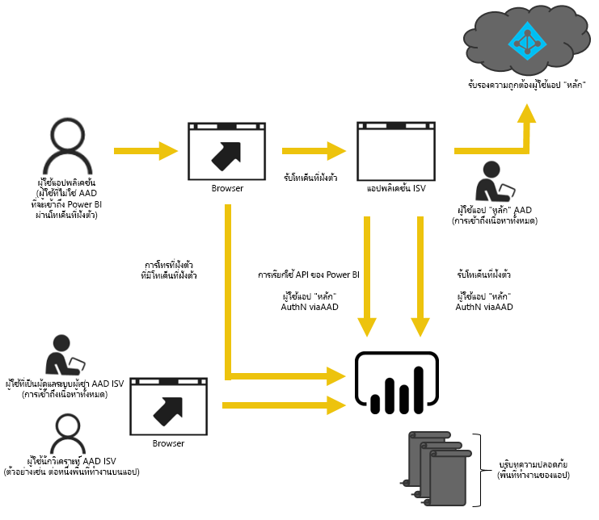
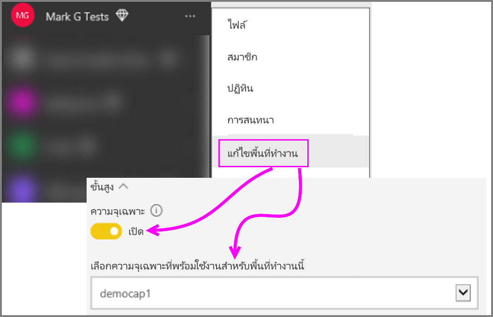

# วิธีการย้ายเนื้อหาจาก Power BI Workspace Collection ไปยัง Power BI EmbeddedHow to migrate Power BI Workspace Collection content to Power BI Embedded

เรียนรู้วิธีการโยกย้ายจาก Power BI Workspace Collection ไปยัง Power BI Embedded และใช้ประโยชน์การพัฒนาเพื่อการฝังในแอปLearn how to migrate from Power BI Workspace Collection to Power BI Embedded and leverage advances for embedding in apps.

เมื่อไม่นานมานี้ Microsoft [ประกาศเปิดตัว Power BI Embedded](https://powerbi.microsoft.com/blog/power-bi-embedded-capacity-based-skus-coming-to-azure/) ซึ่งเป็นแบบจำลองิ์ความสามารถใหม่่ที่ให้สิทธเพื่อเพิ่มวิธีที่ผู้ใช้เข้าถึง แชร์ และแจกจ่ายเนื้อหาMicrosoft recently [announced Power BI Embedded](https://powerbi.microsoft.com/blog/power-bi-embedded-capacity-based-skus-coming-to-azure/), a new capacity-based licensing model that increases flexibility for how users access, share and distribute content. นอกจากนียังทำให้ปรับขนาดและทำงานเพิ่มเติมได้อีกด้วยThe offering also delivers additional scalability and performance.

ซึ่งหมายความว่า ด้วย Power BI Embedded คุณจะมี API surface ซึ่งเป็นชุดความสามารถและการเข้าถึงคุณสมบัติล่าสุดของ Power BI – เช่น แดชบอร์ด เกตเวย์ และพื้นที่ทำงาน – เมื่อทำการฝังเนื้อหาของคุณWith Power BI Embedded, you will have one API surface, a consistent set of capabilities and access to the latest Power BI features – such as dashboards, gateways and workspaces – when embedding your content. ดำเนินการในขั้นตอนต่อไป แล้วคุณจะสามารถเริ่มต้นใช้งาน Power BI Desktop และย้ายไปใช้ Power BI EmbeddedMoving forward you'll be able to start with Power BI Desktop and move to deployment with Power BI Embedded.

Power BI Workspace Collection รุ่นปัจจุบันจะยังคงมีให้ใช้งานในช่วงเวลาที่จำกัดThe current Power BI Workspace Collection will continue to be available for a limited time. ลูกค้าภายใต้ข้อตกลงขององค์กรจะสามารถใช้งานได้จนกว่าข้อตกลงที่มีอยู่จะหมดอายุ ลูกค้าที่ได้ซื้อ Power BI Workspace Collection ทางช่องทาง Direct หรือ CSP จะยังคงใช้งานได้อีกหนึ่งปีนับจากเปิดตัว Power BI EmbeddedCustomers under an Enterprise Agreement will have access through the expiration of their existing agreements; customers that acquired Power BI Workspace Collection through Direct or CSP channels will maintain access for one year from the General Availability release of Power BI Embedded.  บทความนี้จะให้คำแนะนำบางอย่างสำหรับการโยกย้ายเนื้อหาจาก Power BI Workspace Collection ไปยัง Power BI Embedded และการเปลี่ยนแปลงใหม่ๆที่คาดได้ในแอปของคุณThis article will provide some guidance for migrating from Power BI Workspace Collection to the new Power BI Embedded experience and what to expect for changes in your application.

> [!IMPORTANT]
> ในขณะที่การโยกย้ายเนื้อหาจะขึ้นอยู่กับ Power BI Embedded ผู้ใช้แอปของคุณจะไม่จำเป็นต้องใช้ Power BI เมื่อใช้ **โทเค็นการฝัง**While the migration will take a dependency on Power BI Embedded, there is not a dependency on Power BI for the users of your application when using an **embed token**. พวกเขาจึงไม่ต้องลงทะเบียนใช้งาน Power BI เพื่อดูเนื้อหาที่ฝังในแอปของคุณThey do not need to sign up for Power BI to view the embedded content in your application. คุณสามารถใช้วิธีฝังนี้กับผู้ใช้ที่ไม่ใช้ Power BIYou can use this embedding approach to Embedded non-Power BI users.

ก่อนที่คุณจะเริ่มต้นย้ายไปยัง Power BI Embedded ใหม่ คุณสามารถไปยังคำแนะนำที่ช่วยให้คุณตั้งค่าสภาพแวดล้อม Power BI Embedded ใหม่ของคุณ โดยใช้[เครื่องมือตั้งค่าการฝังตัว](https://aka.ms/embedsetup)ได้Before you get started migrating to the new Power BI Embedded, you can quickly go through a walkthrough that helps you set up your new Power BI Embedded environment using the [Embedding setup tool](https://aka.ms/embedsetup).

เลือกโซลูชันที่เหมาะกับคุณ:Choose the solution that is right for you:
* **การฝังตัวสำหรับลูกค้าของคุณ** - เมื่อคุณกำลังสนใจโซลูชันที่ *แอปเป็นเจ้าของข้อมูล***Embed for your customers** - when you are interested in an *app owns data* solution. [การฝังตัวสำหรับลูกค้าของคุณ](embedding.md#embedding-for-your-customers) จะมอบความสามารถในการฝังแดชบอร์ดและรายงานสำหรับผู้ใช้ที่ไม่มีบัญชี Power BI[Embedding for your customers](embedding.md#embedding-for-your-customers) provides the ability to embed dashboards and reports to users who don't have an account for Power BI. 

* **การฝังตัวสำหรับองค์กรของคุณ** - เมื่อคุณกำลังสนใจโซลูชันที่ *ผู้ใช้เป็นเจ้าของข้อมูล***Embed for your organization** - when you are interested in a *user owns data* solution. [การฝังตัวสำหรับองค์กรของคุณ](embedding.md#embedding-for-your-organization) ให้คุณสามารถขยายบริการของ Power BI[Embedding for your organization](embedding.md#embedding-for-your-organization) allows you to extend the Power BI service.

## เตรียมพร้อมสำหรับการโยกย้ายเนื้อหาPrepare for the migration

มีบางสิ่งที่คุณจำเป็นต้องทำเพื่อเตรียมพร้อมสำหรับการโยกย้ายเนื้อหาจาก Power BI Workspace Collection ไปยัง Power BI EmbeddedThere are a few things you need to do to prepare for migrating from Power BI Workspace Collection to Power BI Embedded. คุณจะต้องมีผู้เช่าที่พร้อมใช้งาน พร้อมกับผู้ใช้ที่มีสิทธิ์การใช้งาน Power BI ProYou will need a tenant available, along with a user that has a Power BI Pro license.

1. ตรวจสอบให้แน่ใจว่า คุณสามารถเข้าถึงผู้เช่าของ Azure Active Directory (Azure AD) ได้Make sure you have access to an Azure Active Directory (Azure AD) tenant.

    คุณจำเป็นต้องระบุการตั้งค่าผู้เช่าเมื่อต้องใช้You need to determine which tenant setup to use.

   * ใช้ผู้เช่าของ Power BI ขององค์กรของคุณที่มีอยู่ได้อย่างไรUse your existing corporate Power BI tenant?
   * ใช้ผู้เช่าที่แยกต่างหากสำหรับแอปพลิเคชันของคุณ?Use a separate tenant for your application?
   * ใช้ผู้เช่าที่แยกต่างหากสำหรับลูกค้าแต่ละรายการได้อย่างไรUse a separate tenant for each customer?

     ถ้าคุณตัดสินใจที่จะสร้างผู้เช่าใหม่สำหรับแอปของคุณหรือสำหรับลูกค้าแต่ละราย ดู[สร้างผู้เช่า Azure Active Directory](create-an-azure-active-directory-tenant.md) หรือ[วิธีการได้รับผู้เช่า Azure Active Directory](/azure/active-directory/develop/active-directory-howto-tenant)If you decide to create a new tenant for your application, or each customer, see [Create an Azure Active Directory tenant](create-an-azure-active-directory-tenant.md) or [How to get an Azure Active Directory tenant](/azure/active-directory/develop/active-directory-howto-tenant).
2. สร้างผู้ใช้ภายในผู้เช่าใหม่นี้ซึ่งจะทำหน้าที่เป็นบัญชีแอป "หลัก" ของคุณCreate a user within this new tenant that will act as your application "master" account. บัญชีผู้ใช้นี้จำเป็นต้องลงทะเบียนใน Power BI และจำเป็นต้องมีสิทธิ์การใช้งานใน Power BI ProThat account needs to sign up for Power BI and needs to have a Power BI Pro license assigned to it.

## บัญชีผู้ใช้ภายใน Azure ADAccounts within Azure AD

บัญชีผู้ใช้ต่อไปนี้จะต้องอยูในผู้เช่าของคุณThe following accounts will need to exist within your tenant.

> [!NOTE]
> บัญชีเหล่านี้จะต้องมีสิทธิ์การใช้งาน Power BI Pro เพื่อใช้งานพื้นที่ทำงานThese accounts will need to have Power BI Pro licenses in order to use workspaces.

1. ผู้ดูแลระบบ Power BIA Power BI admin.

    ขอแนะนำให้ผู้ใช้รายนี้เป็นสมาชิกของพื้นที่ทำงานทั้งหมดที่สร้างขึ้นเพื่อการฝังIt is recommended that this user be a member of all workspaces created for the purpose of embedding.

2. บัญชีผู้ใช้สำหรับนักวิเคราะห์ที่จะสร้างเนื้อหาAccounts for analysts that will create content.

    ผู้ใช้เหล่านี้ควรที่จะกำหนดไว้สำหรับพื้นที่ทำงานตามความจำเป็นThese users should be assigned to workspaces as needed.

3. บัญชีผู้ใช้ *หลัก* หรือบัญชีผู้ใช้แบบฝังตัวAn application *master* user account, or Embedded account.

    Backend แอปพลิเคชันจะจัดเก็บข้อมูลประจำตัวสำหรับบัญชีนี้ และใช้บัญชีนี้ขอรับโทเค็น Azure AD เพื่อใช้กับ Power BI REST APIThe applications backend will store the credentials for this account and use it for acquiring an Azure AD token for use with the Power BI REST APIs. บัญชีนี้จะถูกใช้เพื่อสร้างโทเค็นฝังตัวสำหรับแอปThis account will be used to generate the embed token for the application. บัญชีนี้ยังต้องเป็นผู้ดูแลระบบของพื้นที่ทำงานที่สร้างขึ้นสำหรับการฝังด้วยThis account also needs to be an admin of the workspaces created for embedding.

> [!NOTE]
> นี่คือบัญชีผู้ใช้ทั่วไปในองค์กรของคุณที่จะถูกใช้เพื่อทำการฝัง(embedding)This is just a regular user account in your organization that will be used for the purposes of embedding.

## การลงทะเบียนแอปและสิทธิ์App registration and permissions

คุณจะต้องลงทะเบียนแอปภายใน Azure AD และให้สิทธิ์บางอย่างYou will need to register an application within Azure AD and grant certain permissions.

### ลงทะเบียนแอปพลิเคชันRegister an application

คุณจะต้องลงทะเบียนแอปพลิเคชันของคุณกับ Azure AD เพื่อเรียกใช้ REST APIYou will need to register your application with Azure AD in order to make REST API calls. ซึ่งรวมถึงการไปยังพอร์ทัล Azure เพื่อใช้ค่าคอนฟิกเพิ่มเติมนอกเหนือจากไปหน้าการลงทะเบียนแอป Power BIThis includes going to the Azure portal to apply additional configuration in addition to the Power BI app registration page. สำหรับข้อมูลเพิ่มเติม ดู[ลงทะเบียนแอป Azure AD เมื่อต้องการฝังเนื้อหา Power BI](register-app.md)For more information, see [Register an Azure AD app to embed Power BI content](register-app.md).

คุณควรลงทะเบียนแอปด้วยบัญชีแอป **หลัก**You should register the application using the application **master** account.

## สร้างพื้นที่ทำงาน (จำเป็น)Create workspaces (Required)

คุณสามารถใช้ประโยชน์จากพื้นที่ทำงานเพื่อทำการแบ่งแยกให้ดีขึ้นหากแอปพลิเคชันของคุณให้บริการลูกค้าหลายรายYou can take advantage of workspaces to provide better isolation if your application is servicing multiple customers. ลูกค้าแต่ละรายของคุณจะได้รับแดชบอร์ดและรายงานที่ต่างกันDashboards and reports would be isolated between your customers. จากนั้นคุณสามารถใช้บัญชี Power BI ต่อพื้นที่ทำงานเพื่อทำให้ลูกค้าแต่ละรายได้รับประสบการณ์ในการใช้งานแอปพลิเคชันแตกต่างกันYou could then use a Power BI account per workspace to further isolate application experiences between your customers.

> [!IMPORTANT]
> คุณไม่สามารถใช้พื้นที่ทำงานส่วนบุคคลเพื่อใช้งานการฝังสำหรับผู้ใช้ที่ไม่ใช่ Power BIYou cannot use a personal workspace to take advantage of embedding to non-Power BI users.

คุณจะต้องเป็นผู้ใช้ที่มีสิทธิ์การใช้งานรุ่น Pro เมื่อต้องสร้างพื้นที่ทำงานภายใน Power BIYou will need a user that has a Pro license in order to create a workspace within Power BI. ผู้ใช้ Power BI ที่สร้างพื้นที่ทำงานจะเป็นผู้ดูแลระบบของพื้นที่ทำงานนั้นตามค่าเริ่มต้นThe Power BI user that creates the workspace will be an admin of that workspace by default.

> [!NOTE]
> บัญชีแอป *หลัก* ต้องเป็นผู้ดูแลระบบของพื้นที่ทำงานThe application *master* account needs to be an admin of the workspace.

## การโยกย้ายเนื้อหาContent migration

การย้ายเนื้อหาของคุณจากคอลเลกชันพื้นที่ทำงานของคุณไปยัง Power BI Embedded สามารถทำได้ควบคู่ไปกับโซลูชันปัจจุบันของคุณ และไม่จำเป็นต้องหยุดการทำงานใดๆMigrating your content from your workspace collections to Power BI Embedded can be done in parallel to your current solution and doesn't require any downtime.

**เครื่องมือการโยกย้าย** จะพร้อมใช้งานเพื่อช่วยคุณคัดลอกเนื้อหาจาก Power BI Workspace Collection ไปยัง Power BI EmbeddedA **migration tool** is available for you to use in order to assist with copying content from Power BI Workspace Collection to Power BI Embedded. โดยเฉพาะอย่างยิ่ง ถ้าคุณมีเนื้อหาจำนวนมากEspecially if you have a lot of content. สำหรับข้อมูลเพิ่มเติม ดู[เครื่องมือการโยกย้ายของ Power BI Embedded](migrate-tool.md)For more information, see [Power BI Embedded migration tool](migrate-tool.md).

การโยกย้ายเนื้อหามักใช้ API สองตัวContent migration relies mainly on two APIs.

1. ดาวน์โหลด PBIX - API นี้สามารถดาวน์โหลดไฟล์ PBIX ซึ่งถูกอัปโหลดไปยัง Power BI หลังจากเดือนตุลาคม 2016Download PBIX - this API can download PBIX files which were uploaded to Power BI after October 2016.
2. นำเข้า PBIX - API นี้อัปโหลดไฟล์ PBIX ใดๆ ไปยัง Power BIImport PBIX - this API uploads any PBIX to Power BI.

สำหรับรหัสชุดย่อยที่เกี่ยวข้องบางอย่าง ดู[รหัสชุดย่อยเพื่อการโยกย้ายเนื้อหาจาก Power BI Workspace Collection](migrate-code-snippets.md)For some related code snippets, see [Code snippets for migrating content from Power BI Workspace Collection](migrate-code-snippets.md).

### ชนิดของรายงานReport types

มีรายงานหลายชนิด แต่ละชนิดใช้โฟลว์การโยกย้ายที่แตกต่างกันThere are several types of reports, each requiring a somewhat different migration flow.

#### ชุดข้อมูลและรายงานที่แคชไว้Cached dataset & report

ชุดข้อมูลที่แคชหมายถึงไฟล์ PBIX ที่มีข้อมูลนำเข้าซึ่งตรงกันข้ามกับการเชื่อมต่อแบบสดหรือการเชื่อมต่อของ DirectQueryCached datasets refer to PBIX files that had imported data as opposed to a live connection or DirectQuery connection.

**ขั้นตอน****Flow**

1. เรียก ดาวน์โหลด PBIX API จากพื้นที่ทำงาน PaaSCall Download PBIX API from PaaS workspace.
2. บันทึก PBIXSave PBIX.
3. เรียก นำเข้า PBIX ไปยังพื้นที่ทำงาน SaaSCall Import PBIX to SaaS workspace.

#### ชุดข้อมูลและรายงาน DirectQueryDirectQuery dataset & report

**ขั้นตอน****Flow**

1. เรียก รับ `https://api.powerbi.com/v1.0/collections/{collection_id}/workspaces/{wid}/datasets/{dataset_id}/Default.GetBoundGatewayDataSources` และบันทึกสตริงการเชื่อมต่อที่ได้รับCall GET `https://api.powerbi.com/v1.0/collections/{collection_id}/workspaces/{wid}/datasets/{dataset_id}/Default.GetBoundGatewayDataSources` and save connection string received.
2. เรียก ดาวน์โหลด PBIX API จากพื้นที่ทำงาน PaaSCall Download PBIX API from PaaS workspace.
3. บันทึก PBIXSave PBIX.
4. เรียก นำเข้า PBIX ไปยังพื้นที่ทำงาน SaaSCall Import PBIX to SaaS workspace.
5. อัปเดตสตริงการเชื่อมต่อโดยการเรียก - โพสต์  `https://api.powerbi.com/v1.0/myorg/datasets/{dataset_id}/Default.SetAllConnections`Update connection string by calling - POST  `https://api.powerbi.com/v1.0/myorg/datasets/{dataset_id}/Default.SetAllConnections`
6. รับ GW และตัวระบุแหล่งข้อมูลโดยการเรียก - รับ `https://api.powerbi.com/v1.0/myorg/datasets/{dataset_id}/Default.GetBoundGatewayDataSources`Get GW and datasource identifiers by calling - GET `https://api.powerbi.com/v1.0/myorg/datasets/{dataset_id}/Default.GetBoundGatewayDataSources`
7. ปรับปรุงข้อมูลประจำตัวของผู้ใช้โดยการเรียก - โปรแกรมแก้ไข `https://api.powerbi.com/v1.0/myorg/gateways/{gateway_id}/datasources/{datasource_id}`Update user's credentials by calling - PATCH `https://api.powerbi.com/v1.0/myorg/gateways/{gateway_id}/datasources/{datasource_id}`

#### ชุดข้อมูลและรายงานเก่าOld dataset & reports

ต่อไปนี้เป็นชุดข้อมูล/รายงานที่สร้างขึ้นก่อนเดือนตุลาคม 2016These are datasets/reports created before October 2016. ดาวน์โหลด PBIX ไม่สนับสนุนไฟล์ PBIXs ซึ่งถูกอัปโหลดก่อนเดือนตุลาคม 2016Download PBIX doesn't support PBIXs which were uploaded before October 2016

**ขั้นตอน****Flow**

1. รับ PBIX จากสภาพแวดล้อมการพัฒนาของคุณ (ตัวควบคุมแหล่งข้อมูลภายในของคุณ)Get PBIX from your development environment (your internal source control).
2. เรียก นำเข้า PBIX ไปยังพื้นที่ทำงาน SaaSCall Import PBIX to SaaS workspace.

#### พุช (Push) ชุดข้อมูลและรายงานPush Dataset & report

ดาวน์โหลด PBIX ไม่สนับสนุนชุดข้อมูล *API พุช*Download PBIX doesn't support *Push API* datasets. ข้อมูลของชุดข้อมูล API พุชไม่สามารถโอนย้ายจาก PaaS ไปยัง SaaS ได้Push API dataset data can't be ported from PaaS to SaaS.

**ขั้นตอน****Flow**

1. เรียก "สร้างชุดข้อมูล" API ด้วยชุดข้อมูล json เมื่อต้องสร้างชุดข้อมูลในพื้นที่ทำงาน SaaSCall "Create dataset" API with dataset Json to create dataset in SaaS workspace.
2. สร้างรายงานอีกครั้งสำหรับชุดข้อมูลที่ถูกสร้าง\*Rebuild report for the created dataset\*.

โดยใช้วิธีแก้ไขปัญหาบางอย่าง คุณสามารถโยกย้ายรายงาน API พุชจาก PaaS ไปยัง SaaS ด้วยการทำต่อไปนี้It is possible, using some workarounds, to migrate the push api report from PaaS to SaaS by trying the following.

1. อัปโหลด PBIX บางตัวอย่างไปยังพื้นที่ทำงาน PaaSUploading some dummy PBIX to PaaS workspace.
2. โคลนรายงาน API พุชและผูกกับ PBIX ตัวอย่างจากขั้นตอนที่ 1Clone the push api report and bind it to the dummy PBIX from step 1.
3. ดาวน์โหลดรายงาน API พุชด้วย PBIX ตัวอย่างDownload push API report with the dummy PBIX.
4. อัปโหลด PBIX ตัวอย่างไปยังพื้นที่ทำงานของ SaaSUpload dummy PBIX to your SaaS workspace.
5. สร้างชุดข้อมูลแบบพุชในพื้นที่ทำงาน SaaS ของคุณCreate push dataset in your SaaS workspace.
6. ผูกรายงานกับชุดข้อมูล API พุชอีกครั้งRebind report to push api dataset.

## สร้างและอัปโหลดรายงานใหม่Create and upload new reports

นอกเหนือจากเนื้อหาที่คุณโยกย้ายจากคอลเลกชันพื้นที่ทำงานของ Power BI คุณสามารถสร้างรายงานและชุดข้อมูลโดยใช้ Power BI Desktop แล้วเผยแพร่รายงานเหล่านั้นไปยังพื้นที่ทำงานIn addition to the content you migrated from the Power BI Workspace Collection, you can create your reports and datasets using Power BI Desktop and then publish those reports to a workspace. ผู้ใช้ปลายทางที่เผยแพร่รายงานจำเป็นต้องมีสิทธิ์การใช้งาน Power BI Pro เพื่อเผยแพร่ไปยังพื้นที่ทำงานThe end user publishing the reports need to have a Power BI Pro license in order to publish to a workspace.

## สร้างแอปพลิเคชันของคุณอีกครั้งRebuild your application

1. คุณจะต้องปรับเปลี่ยนแอปของคุณเมื่อต้องใช้ Power BI REST API และตำแหน่งที่ตั้งของรายงานภายใน powerbi.comYou will need to modify your application to use the Power BI REST APIs and the report location inside powerbi.com.
2. สร้างการรับรองสิทธิ์ AuthN/AuthZ ของคุณอีกครั้งโดยใช้บัญชีผู้ใช้ *หลัก* ของแอปของคุณRebuild your AuthN/AuthZ authentication using the *master* account for your application. คุณสามารถใช้[โทเค็นการฝัง](/rest/api/power-bi/embedtoken)เพื่ออนุญาตให้ผู้ใช้รายนี้ดำเนินการในนามของผู้ใช้อื่นได้You can take advantage of using an [embed token](/rest/api/power-bi/embedtoken) to allow this user to act on behalf of other users.
3. ฝังรายงานของคุณจาก powerbi.com ลงในแอปของคุณEmbed your reports from powerbi.com into your application.

## แมปผู้ใช้ของคุณให้กับผู้ใช้ Power BIMap your users to a Power BI user

ภายในแอปของคุณ คุณจะแมปผู้ใช้ที่คุณจัดการภายในแอปไปยังข้อมูลประจำตัว *หลัก* ของ Power BI เพื่อใช้งานแอปพลิเคชันของคุณWithin your application, you will map users that you manage within the application to a *master* Power BI credential for the purposes of your application. ข้อมูลประจำตัวสำหรับบัญชี *หลัก* Power BI นี้ีจะถูกเก็บไว้ภายในแอปพลิเคชันของคุณ และใช้เพื่อสร้างโทเค็นแบบฝังThe credentials for this Power BI *master* account will be stored within your application and be used to creating embed tokens.

## สิ่งที่ต้องทำเมื่อคุณพร้อมสำหรับการผลิตWhat to do when you are ready for production

เมื่อคุณพร้อมที่จะทำการผลิต คุณจะต้องทำสิ่งต่อไปนี้When you are ready to move to production, you will need to do the following.

* ถ้าคุณกำลังใช้ผู้เช่าที่แยกต่างหากเพื่อการทำงานนี้ คุณจะต้องตรวจสอบให้แน่ใจว่าพื้นที่ทำงานของคุณ และแดชบอร์ดและรายงานพร้อมใช้งานในสภาพแวดล้อมการผลิตของคุณIf you are using a separate tenant for development, then you will need to make sure your workspaces, along with dashboards and reports, are available in your production environment. นอกจากนี้ คุณจะจำเป็นต้องตรวจสอบให้แน่ใจว่าคุณได้สร้างแอปใน Azure AD สำหรับผู้เช่าการผลิตของคุณ และกำหนดสิทธิ์ app ที่เหมาะสมตามที่ระบุในขั้นตอนที่ 1You will also need to make sure that you created the application in Azure AD for your production tenant and assigned the proper app permissions as indicated in Step 1.
* ซื้อความสามารถการผลิต (capacity) ที่เหมาะสมกับความต้องการของคุณPurchase a capacity that fits your needs. เพื่อให้เข้าใจว่าคุณต้องใช้ปริมาณและชนิดของความสามารถการผลิตอย่างไร ดูเอกสารทางเทคนิคเรื่องการวางแผนความสามารถวิเคราะห์ของ[Power BI Embedded](./embedded-capacity-planning.md)To better understand how the amount and type of capacity you need, see the [Power BI Embedded analytics capacity planning whitepaper](./embedded-capacity-planning.md). คุณสามารถ[ซื้อความสามารถการผลิต](https://portal.azure.com/#create/Microsoft.PowerBIDedicated)ใน Azure ได้You can [purchase capacity](https://portal.azure.com/#create/Microsoft.PowerBIDedicated) in Azure.
* แก้ไขพื้นที่ทำงาน และกำหนดพื้นที่นี้เป็นความจุแบบพรีเมียมภายใต้ขั้นสูงEdit the workspace and assign it to a Premium capacity under advanced.

    

* ปรับใช้แอปของคุณที่อัปเดตแล้วกับการผลิต และเริ่มต้นฝังรายงานจาก Power BI EmbeddedDeploy your updated application to production and begin embedding reports from the Power BI Embedded.

## หลังจากการโยกย้ายAfter migration

คุณควรทำการล้างข้อมูลบางอย่างภายใน AzureYou should do some cleanup within Azure.

* ลบพื้นที่ทำงานทั้งหมดออกจากโซลูชันที่ถูกใช้ภายใน Azure Embedded ของ Power BI Workspace CollectionRemove all workspaces off of the deployed solution within the Azure Embedded of Power BI Workspace Collection.
* ลบคอลเลกชันพื้นที่ทำงานใดๆ ที่มีอยู่ภายใน AzureDelete any Workspace Collections that exist within Azure.

## ขั้นตอนถัดไปNext steps

[ฝังด้วย Power BIEmbedding with Power BI](embedding.md)  
[เครื่องมือการโยกย้ายเนื้อหาของ Power BI Worksapce CollectionPower BI Workspace Collection migration tool](migrate-tool.md)  
[รหัสชุดย่อยสำหรับการโยกย้ายเนื้อหาจาก Power BI Workspace CollectionCode snippets for migrating content from Power BI Workspace Collection](migrate-code-snippets.md)  
[วิธีฝัง แดชบอร์ด รายงาน และไทล์ Power BI ของคุณHow to embed your Power BI dashboards, reports and tiles](embed-sample-for-your-organization.md)  
[Power BI Premium คืออะไรPower BI Premium - what is it?](../../admin/service-premium-what-is.md)  
[JavaScript API Git repoJavaScript API Git repo](https://github.com/Microsoft/PowerBI-JavaScript)  
[Power BI C# Git repoPower BI C# Git repo](https://github.com/Microsoft/PowerBI-CSharp)  
[ตัวอย่างการฝัง JavaScriptJavaScript embed sample](https://microsoft.github.io/PowerBI-JavaScript/demo/)  
[เอกสารทางเทคนิคเรื่องการวางแผนความสามารถวิเคราะห์ของ Workspace CollectionWorkspace Collection analytics capacity planning whitepaper](./embedded-capacity-planning.md)  
[เอกสารบรรยายแนวความคิดของ Power BI PremiumPower BI Premium whitepaper](https://aka.ms/pbipremiumwhitepaper)  

มีคำถามเพิ่มเติมหรือไม่More questions? [ลองถามชุมชน Power BITry asking the Power BI Community](https://community.powerbi.com/)