# <a name="power-bi-embedded-migration-tool"></a><span data-ttu-id="3986a-104">เครื่องมือการย้าย Power BI แบบฝัง</span><span class="sxs-lookup"><span data-stu-id="3986a-104">Power BI Embedded migration tool</span></span>

<span data-ttu-id="3986a-105">เครื่องมือการย้ายนี้สามารถใช้เพื่อคัดลอกรายงานของคุณจากบริการ Azure แบบฝังของ Power BI (PaaS) ไปยังบริการ Power BI (SaaS)</span><span class="sxs-lookup"><span data-stu-id="3986a-105">This migration tool can be used to copy your reports from the Power BI Embedded Azure service (PaaS) to the Power BI service (SaaS).</span></span>

<span data-ttu-id="3986a-106">การย้ายเนื้อหาของคุณจากคอลเลกชันพื้นที่ทำงานของคุณไปยังบริการ Power BI สามารถทำได้ควบคู่ไปกับโซลูชันปัจจุบันของคุณ และไม่จำเป็นต้องหยุดการทำงานใด ๆ</span><span class="sxs-lookup"><span data-stu-id="3986a-106">Migrating your content from your workspace collections to the Power BI service can be done in parallel to your current solution and doesn't require any downtime.</span></span>

## <a name="limitations"></a><span data-ttu-id="3986a-107">ข้อจำกัด</span><span class="sxs-lookup"><span data-stu-id="3986a-107">Limitations</span></span>

* <span data-ttu-id="3986a-108">ไม่สามารถดาวน์โหลดชุดข้อมูลที่ส่ง และจะต้องได้รับการสร้างขึ้นใหม่โดยใช้ Power BI REST APIs สำหรับบริการ Power BI</span><span class="sxs-lookup"><span data-stu-id="3986a-108">Pushed datasets cannot be downloaded and will need to be recreated using the Power BI REST APIs for the Power BI service.</span></span>
* <span data-ttu-id="3986a-109">ไฟล์ PBIX ได้รับการนำเข้าก่อนวันที่ 26 พฤศจิกายน 2016 และจะไม่สามารถดาวน์โหลดได้</span><span class="sxs-lookup"><span data-stu-id="3986a-109">PBIX files imported before November 26, 2016 will not be downloadable.</span></span>

## <a name="download"></a><span data-ttu-id="3986a-110">ดาวน์โหลด</span><span class="sxs-lookup"><span data-stu-id="3986a-110">Download</span></span>

<span data-ttu-id="3986a-111">คุณสามารถดาวน์โหลดตัวอย่างเครื่องมือการย้ายจาก[GitHub](https://github.com/Microsoft/powerbi-migration-sample)ได้</span><span class="sxs-lookup"><span data-stu-id="3986a-111">You can download the migration tool sample from [GitHub](https://github.com/Microsoft/powerbi-migration-sample).</span></span> <span data-ttu-id="3986a-112">คุณสามารถดาวน์โหลด zip ของพื้นที่เก็บข้อมูล หรือคุณสามารถโคลนภายในเครื่อง</span><span class="sxs-lookup"><span data-stu-id="3986a-112">You can either download a zip of the repository, or you can clone it locally.</span></span> <span data-ttu-id="3986a-113">เมื่อดาวน์โหลดแล้ว คุณสามารถเปิด *powerbi-migration-sample.sln* ใน Visual Studio เพื่อสร้าง และเรียกใช้เครื่องมือการย้ายได้</span><span class="sxs-lookup"><span data-stu-id="3986a-113">Once downloaded, you can open *powerbi-migration-sample.sln* within Visual Studio to build and run the migration tool.</span></span>

## <a name="migration-plans"></a><span data-ttu-id="3986a-114">แผนการย้าย</span><span class="sxs-lookup"><span data-stu-id="3986a-114">Migration Plans</span></span>

<span data-ttu-id="3986a-115">แผนการย้ายของคุณเป็นเพียงแค่เมตาดาต้าที่จัดหมวดหมู่เนื้อหาภายใน Power BI แบบฝัง และคุณต้องการเผยแพร่ไปยังบริการ Power BI ด้วยวิธีใด</span><span class="sxs-lookup"><span data-stu-id="3986a-115">Your migration plan is just metadata that catalogs the content within Power BI Embedded and how you want to publish them to the Power BI service.</span></span>

### <a name="start-with-a-new-migration-plan"></a><span data-ttu-id="3986a-116">เริ่มต้นด้วยแผนการย้ายใหม่</span><span class="sxs-lookup"><span data-stu-id="3986a-116">Start with a new migration plan</span></span>

<span data-ttu-id="3986a-117">แผนการย้ายเป็นเมตาดาต้าของรายการที่พร้อมใช้งานใน Power BI แบบฝังที่คุณต้องการย้ายไปยังบริการ Power BI</span><span class="sxs-lookup"><span data-stu-id="3986a-117">A migration plan is the metadata of the items available in Power BI Embedded that you then want to move over to the Power BI service.</span></span> <span data-ttu-id="3986a-118">แผนการย้ายที่ถูกจัดเก็บเป็นไฟล์ XML</span><span class="sxs-lookup"><span data-stu-id="3986a-118">The migration plan is stored as an XML file.</span></span>

<span data-ttu-id="3986a-119">คุณจะต้องการเริ่มต้นโดยการสร้างแผนการย้ายใหม่</span><span class="sxs-lookup"><span data-stu-id="3986a-119">You will want to start by creating a new migration plan.</span></span> <span data-ttu-id="3986a-120">เมื่อต้องสร้างแผนการย้ายใหม่ ทำตามขั้นตอนต่อไปนี้</span><span class="sxs-lookup"><span data-stu-id="3986a-120">To create a new migration plan, do the following.</span></span>

1. <span data-ttu-id="3986a-121">เลือก **”ไฟล์”**  >  **”แผนการย้ายใหม่”**</span><span class="sxs-lookup"><span data-stu-id="3986a-121">Select **File** > **New Migration Plan**.</span></span>

    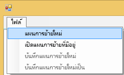

2. <span data-ttu-id="3986a-123">ในการ **เลือกกล่องโต้ตอบ กลุ่มทรัพยากร Power BI แบบฝัง** คุณจะต้องเลือกเมนูแบบเลื่อนลงของ Environment และเลือก prod</span><span class="sxs-lookup"><span data-stu-id="3986a-123">In the **Select Power BI Embedded Resource Group**  dialog, you will want to select the Environment dropdown and select prod.</span></span>

3. <span data-ttu-id="3986a-124">คุณจะได้รับแจ้งให้ลงชื่อเข้าใช้</span><span class="sxs-lookup"><span data-stu-id="3986a-124">You will be prompted to sign in.</span></span> <span data-ttu-id="3986a-125">คุณเข้าสู่ระบบการสมัครใช้งาน Azure ของคุณ</span><span class="sxs-lookup"><span data-stu-id="3986a-125">You will use your Azure subscription login.</span></span>

   > [!IMPORTANT]
   > <span data-ttu-id="3986a-126">บัญชีนี้ **ไม่ใช่** บัญชีองค์กรของคุณที่คุณใช้เพื่อลงชื่อเข้าใช้ Power BI</span><span class="sxs-lookup"><span data-stu-id="3986a-126">This is **not** your organizational account that you sign into Power BI with.</span></span>

4. <span data-ttu-id="3986a-127">เลือกการสมัครใช้งาน Azure ซึ่งเก็บคอลเลกชันพื้นที่ทำงาน Power BI แบบฝังของคุณ</span><span class="sxs-lookup"><span data-stu-id="3986a-127">Select the Azure subscription which stores your Power BI Embedded workspace collections.</span></span>

    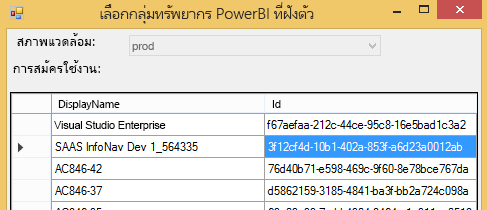
5. <span data-ttu-id="3986a-129">ด้านล่างรายการสมัครใช้งาน เลือก **”กลุ่มทรัพยากร”** ที่ประกอบด้วยคอลเลกชันพื้นที่ทำงานของคุณแล้วเลือก **”เลือก”**</span><span class="sxs-lookup"><span data-stu-id="3986a-129">Below the subscription list, select the **Resource Group** that contains your workspace collections and select **Select**.</span></span>

    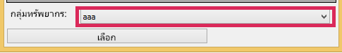

6. <span data-ttu-id="3986a-131">เลือก **”วิเคราะห์”**</span><span class="sxs-lookup"><span data-stu-id="3986a-131">Select **Analyze**.</span></span> <span data-ttu-id="3986a-132">ซึ่งจะได้รับสินค้าคงคลังในการสมัครใช้งาน Azure เพื่อให้คุณสามารถเริ่มแผนของคุณ</span><span class="sxs-lookup"><span data-stu-id="3986a-132">This will get an inventory of the items within your Azure subscription for you to begin your plan.</span></span>

    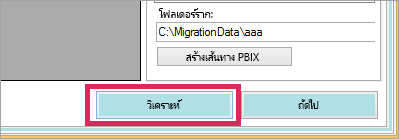

   > [!NOTE]
   > <span data-ttu-id="3986a-134">กระบวนการวิเคราะห์อาจใช้เวลาหลายนาที ขึ้นอยู่กับจำนวนของคอลเลกชันพื้นที่ทำงานและปริมาณของเนื้อหาที่มีอยู่ในคอลเลกชันพื้นที่ทำงาน</span><span class="sxs-lookup"><span data-stu-id="3986a-134">The analyze process could take several minutes depending on the number of Workspace collections and how much content exists in the workspace collection.</span></span>

7. <span data-ttu-id="3986a-135">เมื่อ **วิเคราะห์** เสร็จสมบูรณ์ จะมีการแจ้งให้คุณบันทึกแผนการย้ายของคุณ</span><span class="sxs-lookup"><span data-stu-id="3986a-135">When **Analyze** is complete, it will prompt you to save your migration plan.</span></span>

<span data-ttu-id="3986a-136">ณ จุดนี้ คุณได้เชื่อมต่อแผนการย้ายของคุณกับการสมัครใช้งาน Azure แล้ว</span><span class="sxs-lookup"><span data-stu-id="3986a-136">At this point, you have connected your migration plan to your Azure subscription.</span></span> <span data-ttu-id="3986a-137">อ่านด้านล่างเพื่อทำความเข้าใจขั้นตอนของวิธีการทำงานกับแผนการย้ายของคุณ</span><span class="sxs-lookup"><span data-stu-id="3986a-137">Read below to understand the flow of how to work with your migration plan.</span></span> <span data-ttu-id="3986a-138">ซึ่งรวมถึงการวิเคราะห์และการย้ายแผน การดาวน์โหลด การสร้างกลุ่ม และการอัปโหลด</span><span class="sxs-lookup"><span data-stu-id="3986a-138">This includes Analyze & Plan Migration, Download, Create Groups and Upload.</span></span>

### <a name="save-your-migration-plan"></a><span data-ttu-id="3986a-139">บันทึกแผนการย้ายของคุณ</span><span class="sxs-lookup"><span data-stu-id="3986a-139">Save your migration plan</span></span>

<span data-ttu-id="3986a-140">คุณสามารถบันทึกแผนการย้ายของคุณสำหรับการใช้งานในภายหลัง</span><span class="sxs-lookup"><span data-stu-id="3986a-140">You can save your migration plan for use later.</span></span> <span data-ttu-id="3986a-141">การดำเนินการนี้จะสร้างไฟล์ XML ที่จะเก็บข้อมูลทั้งหมดในแผนการย้ายของคุณ</span><span class="sxs-lookup"><span data-stu-id="3986a-141">This will create an XML file that contained all the information in your migration plan.</span></span>

<span data-ttu-id="3986a-142">เมื่อต้องบันทึกแผนการย้ายของคุณ ทำตามขั้นตอนต่อไปนี้</span><span class="sxs-lookup"><span data-stu-id="3986a-142">To save your migration plan, do the following.</span></span>

1. <span data-ttu-id="3986a-143">เลือก **”ไฟล์”**  > **บันทึกแผนการย้าย**</span><span class="sxs-lookup"><span data-stu-id="3986a-143">Select **File** > **Save Migration Plan**.</span></span>

    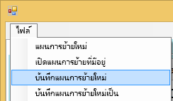

2. <span data-ttu-id="3986a-145">ตั้งชื่อไฟล์ของคุณ หรือใช้ชื่อไฟล์ที่สร้างขึ้น แล้วเลือก **”บันทึก”**</span><span class="sxs-lookup"><span data-stu-id="3986a-145">Give your file a name or use the generated file name and select **Save**.</span></span>

### <a name="open-an-existing-migration-plan"></a><span data-ttu-id="3986a-146">เปิดแผนการย้ายที่มีอยู่</span><span class="sxs-lookup"><span data-stu-id="3986a-146">Open an existing migration plan</span></span>

<span data-ttu-id="3986a-147">คุณสามารถเปิดแผนการย้ายที่บันทึกไว้เพื่อการดำเนินการย้ายต่อ</span><span class="sxs-lookup"><span data-stu-id="3986a-147">You can open a saved migration plan to continue working on your migration.</span></span>

<span data-ttu-id="3986a-148">เมื่อต้องเปิดแผนการย้ายของคุณที่มีอยู่ ทำตามขั้นตอนต่อไปนี้</span><span class="sxs-lookup"><span data-stu-id="3986a-148">To open your existing migration plan, do the following.</span></span>

1. <span data-ttu-id="3986a-149">เลือก **ไฟล์** > **เปิดแผนการย้ายที่มีอยู่**</span><span class="sxs-lookup"><span data-stu-id="3986a-149">Select **File** > **Open Existing Migration Plan**.</span></span>

    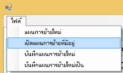

2. <span data-ttu-id="3986a-151">เลือกไฟล์การย้ายของคุณ แล้วเลือก **”เปิด”**</span><span class="sxs-lookup"><span data-stu-id="3986a-151">Select your migration file and select **Open**.</span></span>

## <a name="step-1-analyze--plan-migration"></a><span data-ttu-id="3986a-152">ขั้นตอนที่ 1: การวิเคราะห์และการวางแผนการย้าย</span><span class="sxs-lookup"><span data-stu-id="3986a-152">Step 1: Analyze & Plan Migration</span></span>

<span data-ttu-id="3986a-153">แท็บ **วิเคราะห์และวางแผนการย้าย** จะทำให้คุณสามารถมองเห็นสิ่งที่อยู่ในกลุ่มทรัพยากรของการสมัครใช้งาน Azure ในขณะนั้น</span><span class="sxs-lookup"><span data-stu-id="3986a-153">The **Analyze & Plan Migration** tab gives you a view of what is currently in your Azure subscription's resource group.</span></span>

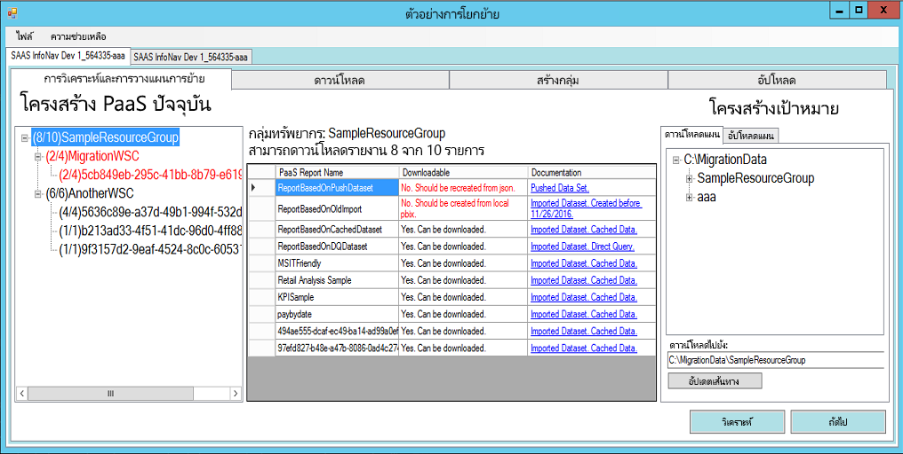

<span data-ttu-id="3986a-155">เราจะดู *SampleResourceGroup* เป็นตัวอย่าง</span><span class="sxs-lookup"><span data-stu-id="3986a-155">We will look at the *SampleResourceGroup* as an example.</span></span>

### <a name="paas-topology"></a><span data-ttu-id="3986a-156">โทโพโลยี PaaS</span><span class="sxs-lookup"><span data-stu-id="3986a-156">PaaS Topology</span></span>

<span data-ttu-id="3986a-157">นี่คือรายการ *กลุ่มทรัพยากร > คอลเลกชันพื้นที่ทำงาน > พื้นที่ทำงาน* ของคุณ</span><span class="sxs-lookup"><span data-stu-id="3986a-157">This is a listing of your *Resource Group > Workspace collections > Workspaces*.</span></span> <span data-ttu-id="3986a-158">กลุ่มทรัพยากรและคอลเลกชันพื้นที่ทำงานจะแสดงชื่อที่เรียกง่าย</span><span class="sxs-lookup"><span data-stu-id="3986a-158">The resource group and workspace collections will show a friendly name.</span></span> <span data-ttu-id="3986a-159">พื้นที่ทำงานจะแสดง GUID</span><span class="sxs-lookup"><span data-stu-id="3986a-159">The workspaces will show a GUID.</span></span>

<span data-ttu-id="3986a-160">นอกจากนี้รายการจะแสดงสีและตัวเลขในรูปแบบของ (#/#)</span><span class="sxs-lookup"><span data-stu-id="3986a-160">The items in the list will also display a color and a number in the format of (#/#).</span></span> <span data-ttu-id="3986a-161">ซึ่งระบุหมายเลขของรายงานที่สามารถดาวน์โหลดได้</span><span class="sxs-lookup"><span data-stu-id="3986a-161">This indicates the number of reports that can be downloaded.</span></span>
<span data-ttu-id="3986a-162">สีดำหมายความว่าคุณสามารถดาวน์โหลดรายงานทั้งหมด</span><span class="sxs-lookup"><span data-stu-id="3986a-162">A black color means that all reports can be downloaded.</span></span>

<span data-ttu-id="3986a-163">สีแดงหมายความว่าไม่สามารถดาวน์โหลดบางรายงานได้</span><span class="sxs-lookup"><span data-stu-id="3986a-163">A red color means that some reports cannot be downloaded.</span></span> <span data-ttu-id="3986a-164">หมายเลขด้านซ้ายจะระบุจำนวนรวมของรายงานที่สามารถดาวน์โหลดได้</span><span class="sxs-lookup"><span data-stu-id="3986a-164">The left number will indicate the total number of reports that can be downloaded.</span></span> <span data-ttu-id="3986a-165">หมายเลขทางด้านขวาจะระบุจำนวนรวมของรายงานภายในการจัดกลุ่ม</span><span class="sxs-lookup"><span data-stu-id="3986a-165">The number on the right indicates the total number of reports within the grouping.</span></span>

<span data-ttu-id="3986a-166">คุณสามารถเลือกรายการภายในโทโพโลยี PaaS เพื่อแสดงรายงานในส่วนของรายงาน</span><span class="sxs-lookup"><span data-stu-id="3986a-166">You can select an item within the PaaS topology to display the reports in the reports section.</span></span>

### <a name="reports"></a><span data-ttu-id="3986a-167">รายงาน</span><span class="sxs-lookup"><span data-stu-id="3986a-167">Reports</span></span>

<span data-ttu-id="3986a-168">ส่วนของรายงานจะแสดงรายงานที่พร้อมใช้งาน และจะระบุว่าสามารถดาวน์โหลดหรือไม่</span><span class="sxs-lookup"><span data-stu-id="3986a-168">The reports section will list out the reports available and indicates whether it can be downloaded or not.</span></span>


### <a name="target-structure"></a><span data-ttu-id="3986a-170">โครงสร้างเป้าหมาย</span><span class="sxs-lookup"><span data-stu-id="3986a-170">Target structure</span></span>

<span data-ttu-id="3986a-171">โครงสร้าง **เป้าหมาย** คือตำแหน่งที่คุณบอกเครื่องมือว่าสิ่งต่างๆจะถูกดาวน์โหลดไปที่ใดและวิธีการอัปโหลด</span><span class="sxs-lookup"><span data-stu-id="3986a-171">The **Target structure** is where you tell the tool where things will be downloaded to and how to upload them.</span></span>

#### <a name="download-plan"></a><span data-ttu-id="3986a-172">ดาวน์โหลดแผน</span><span class="sxs-lookup"><span data-stu-id="3986a-172">Download Plan</span></span>

<span data-ttu-id="3986a-173">เส้นทางจะถูกสร้างขึ้นสำหรับคุณโดยอัตโนมัติ</span><span class="sxs-lookup"><span data-stu-id="3986a-173">A path will automatically be created for you.</span></span> <span data-ttu-id="3986a-174">คุณสามารถเปลี่ยนเส้นทางนี้ได้ถ้าคุณต้องการ</span><span class="sxs-lookup"><span data-stu-id="3986a-174">You can change this path if you wish.</span></span> <span data-ttu-id="3986a-175">ถ้าคุณเปลี่ยนเส้นทาง คุณจะต้องเลือก **”อัปเดตเส้นทาง”**</span><span class="sxs-lookup"><span data-stu-id="3986a-175">If you do change the path, you will need to select **Update paths**.</span></span>

> [!NOTE]
> <span data-ttu-id="3986a-176">ซึ่งไม่ได้ทำการดาวน์โหลด</span><span class="sxs-lookup"><span data-stu-id="3986a-176">This does not actually perform the download.</span></span> <span data-ttu-id="3986a-177">เพียงแค่ระบุโครงสร้างของสถานที่ที่รายงานจะถูกดาวน์โหลดไปไว้</span><span class="sxs-lookup"><span data-stu-id="3986a-177">This is only specifying the structure of where the reports will be downloaded to.</span></span>

#### <a name="upload-plan"></a><span data-ttu-id="3986a-178">อัปโหลดแผน</span><span class="sxs-lookup"><span data-stu-id="3986a-178">Upload Plan</span></span>

<span data-ttu-id="3986a-179">คุณสามารถระบุคำนำหน้าที่นี่เพื่อใช้สำหรับพื้นที่ทำงาน ซึ่งจะถูกสร้างขึ้นภายในบริการของ Power BI</span><span class="sxs-lookup"><span data-stu-id="3986a-179">Here you can specify a prefix to be used for the workspaces that will be created within the Power BI service.</span></span> <span data-ttu-id="3986a-180">หลังจากคำนำหน้าจะเป็น GUID สำหรับพื้นที่ทำงานที่มีอยู่ใน Azure</span><span class="sxs-lookup"><span data-stu-id="3986a-180">After the prefix will be the GUID for the workspace that existed in Azure.</span></span>

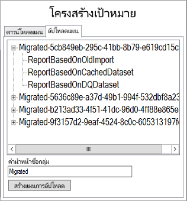

> [!NOTE]
> <span data-ttu-id="3986a-182">ซึ่งไม่ได้สร้างกลุ่มภายในบริการ Power BI</span><span class="sxs-lookup"><span data-stu-id="3986a-182">This does not actually create the groups within the Power BI service.</span></span> <span data-ttu-id="3986a-183">แต่เพียงแค่กำหนดโครงสร้างการตั้งชื่อสำหรับกลุ่มเท่านั้น</span><span class="sxs-lookup"><span data-stu-id="3986a-183">This only defines the naming structure for the groups.</span></span>

<span data-ttu-id="3986a-184">ถ้าคุณเปลี่ยนคำนำหน้า คุณจะต้องเลือก **”สร้างการอัปโหลดแผน”**</span><span class="sxs-lookup"><span data-stu-id="3986a-184">If you change the prefix, you will need to select **Generate Upload Plan**.</span></span>

<span data-ttu-id="3986a-185">ถ้าคุณต้องการ คุณสามารถคลิกขวาบนกลุ่ม และเลือกเพื่อเปลี่ยนชื่อกลุ่มใน “แผนการอัปโหลด” โดยตรง</span><span class="sxs-lookup"><span data-stu-id="3986a-185">You can right click on a group and choose to rename the group within the Upload plan directly, if desired.</span></span>

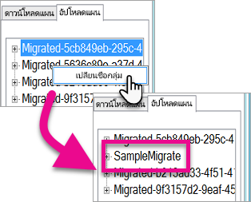

> [!NOTE]
> <span data-ttu-id="3986a-187">ชื่อของ *กลุ่ม* ต้องไม่ประกอบด้วยช่องว่างหรืออักขระที่ไม่ถูกต้อง</span><span class="sxs-lookup"><span data-stu-id="3986a-187">The name of the *group* must not contain spaces or invalid characters.</span></span>

## <a name="step-2-download"></a><span data-ttu-id="3986a-188">ขั้นตอนที่ 2: ดาวน์โหลด</span><span class="sxs-lookup"><span data-stu-id="3986a-188">Step 2: Download</span></span>

<span data-ttu-id="3986a-189">ในแท็บ **ดาวน์โหลด** คุณจะเห็นรายการของรายงานและเมตาดาต้าที่เกี่ยวข้อง</span><span class="sxs-lookup"><span data-stu-id="3986a-189">On the **Download** tab, you will see the list of reports and associated metadata.</span></span> <span data-ttu-id="3986a-190">คุณสามารถดูสถานะการส่งออกและสถานะการส่งออกก่อนหน้านี้</span><span class="sxs-lookup"><span data-stu-id="3986a-190">You can see what the export status is along with the previous export status.</span></span>

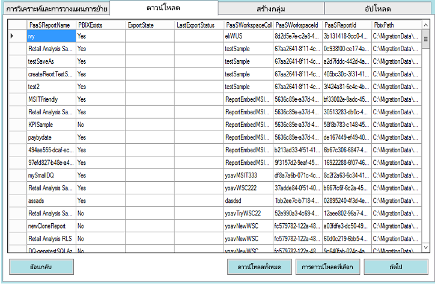

<span data-ttu-id="3986a-192">คุณมีสองตัวเลือก</span><span class="sxs-lookup"><span data-stu-id="3986a-192">You have two options.</span></span>

* <span data-ttu-id="3986a-193">เลือกรายงาน แล้วเลือก **ดาวน์โหลดที่เลือก**</span><span class="sxs-lookup"><span data-stu-id="3986a-193">Select specific reports and select **Download Selected**</span></span>
* <span data-ttu-id="3986a-194">เลือก **ดาวน์โหลดทั้งหมด**</span><span class="sxs-lookup"><span data-stu-id="3986a-194">Select **Download All**.</span></span>

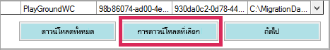

<span data-ttu-id="3986a-196">หากการดาวน์โหลดเสร็จสมบูรณ์ คุณจะเห็นสถานะ *”เสร็จสิ้น”* ซึ่งแสดงว่ามี ไฟล์ PBIX อยู่</span><span class="sxs-lookup"><span data-stu-id="3986a-196">For a successful download, you will see a status of *Done* and it will reflect that the PBIX file exists.</span></span>

<span data-ttu-id="3986a-197">หลังจากการดาวน์โหลดเสร็จสมบูรณ์ เลือกแท็บ **”สร้างกลุ่ม”**</span><span class="sxs-lookup"><span data-stu-id="3986a-197">After the download is completed, select the **Create Groups** tab.</span></span>

## <a name="step-3-create-groups"></a><span data-ttu-id="3986a-198">ขั้นตอนที่ 3: สร้างกลุ่ม</span><span class="sxs-lookup"><span data-stu-id="3986a-198">Step 3: Create Groups</span></span>

<span data-ttu-id="3986a-199">หลังจากที่คุณดาวน์โหลดรายงานที่พร้อมใช้งานแล้ว คุณสามารถไปที่แท็บ **”สร้างกลุ่ม”** แท็บนี้จะสร้างพื้นที่ทำงานภายในบริการของ Power BI ตามแผนการย้ายที่คุณสร้างขึ้น</span><span class="sxs-lookup"><span data-stu-id="3986a-199">After you have downloaded the reports that are available, you can go to the **Create Groups** tab. This tab will create the workspaces within the Power BI service based on the migration plan that you created.</span></span> <span data-ttu-id="3986a-200">ซึ่งจะสร้างพื้นที่ทำงานพร้อมกับชื่อที่คุณตั้งในแท็บ **อัปโหลด** ใน **การวิเคราะห์และการวางแผนการย้าย**</span><span class="sxs-lookup"><span data-stu-id="3986a-200">It will create the workspace with the name you provided on the **Upload** tab within **Analyze & Plan Migration**.</span></span>

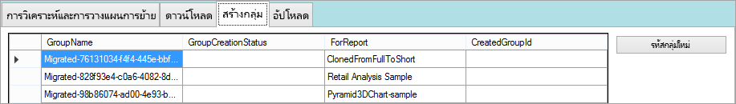

<span data-ttu-id="3986a-202">เมื่อต้องการสร้างพื้นที่ทำงาน คุณสามารถเลือกว่าจะ **สร้างกลุ่มที่เลือก** หรือ **สร้างกลุ่มที่หายไปทั้งหมด** ได้</span><span class="sxs-lookup"><span data-stu-id="3986a-202">To create the workspaces, you can select either **Create Selected Groups** or **Create All Missing Groups**.</span></span>

<span data-ttu-id="3986a-203">เมื่อคุณเลือกตัวเลือกเหล่านี้อย่างใดอย่างหนึ่ง คุณจะได้รับการแจ้งให้ลงชื่อเข้าใช้</span><span class="sxs-lookup"><span data-stu-id="3986a-203">When you select either of these options, you will be prompted to sign in.</span></span> <span data-ttu-id="3986a-204">*คุณจะต้องใช้ข้อมูลประจำตัวของคุณสำหรับบริการของ Power BI ที่คุณต้องการสร้างพื้นที่ทำงาน*</span><span class="sxs-lookup"><span data-stu-id="3986a-204">*You will want to use your credentials for the Power BI service that you want to create the workspaces on.*</span></span>

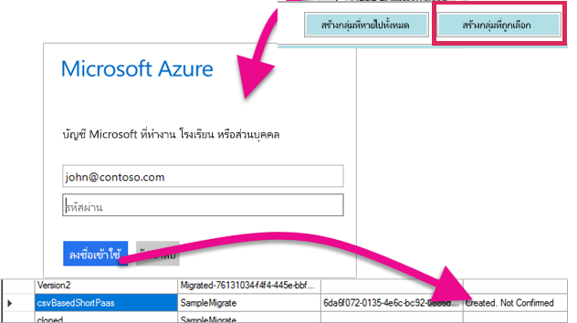

<span data-ttu-id="3986a-206">ซึ่งจะสร้างพื้นที่ทำงานภายในบริการของ Power BI</span><span class="sxs-lookup"><span data-stu-id="3986a-206">This will create the workspace within the Power BI service.</span></span> <span data-ttu-id="3986a-207">และจะไม่อัปโหลดรายงานไปยังพื้นที่ทำงาน</span><span class="sxs-lookup"><span data-stu-id="3986a-207">This does not upload the reports to the workspace.</span></span>

<span data-ttu-id="3986a-208">คุณสามารถตรวจสอบว่าพื้นที่ทำงานถูกสร้างขึ้นโดยการลงชื่อเข้าใช้ Power BI และตรวจสอบว่ามีพื้นที่ทำงานอยู่หรือไม่</span><span class="sxs-lookup"><span data-stu-id="3986a-208">You can verify that the workspace was created by signing into Power BI and validating that the workspace exists.</span></span> <span data-ttu-id="3986a-209">คุณจะสังเกตเห็นว่า ไม่มีสิ่งใดในพื้นที่ทำงาน</span><span class="sxs-lookup"><span data-stu-id="3986a-209">You will notice that nothing is in the workspace.</span></span>

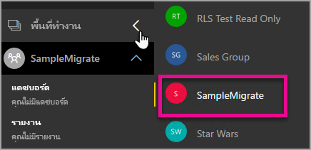

<span data-ttu-id="3986a-211">หลังจากที่มีการสร้างพื้นที่ทำงาน คุณสามารถย้ายไปยังแท็บ **อัปโหลด** ได้</span><span class="sxs-lookup"><span data-stu-id="3986a-211">After the workspace is created, you can move onto the **Upload** tab.</span></span>

## <a name="step-4-upload"></a><span data-ttu-id="3986a-212">ขั้นตอนที่ 4: อัปโหลด</span><span class="sxs-lookup"><span data-stu-id="3986a-212">Step 4: Upload</span></span>

<span data-ttu-id="3986a-213">ในแท็บ **”อัปโหลด”** จะอัปโหลดรายงานไปยังบริการ Power BI</span><span class="sxs-lookup"><span data-stu-id="3986a-213">On the **Upload** tab, this will upload the reports to the Power BI service.</span></span> <span data-ttu-id="3986a-214">คุณจะเห็นรายการของรายงานที่เราดาวน์โหลดบนแท็บ “ดาวน์โหลด” พร้อมกับชื่อกลุ่มเป้าหมายที่ยึดตามแผนการย้ายของคุณ</span><span class="sxs-lookup"><span data-stu-id="3986a-214">You will see a list of the reports that we downloaded on the Download tab along with the target group name based on your migration plan.</span></span>

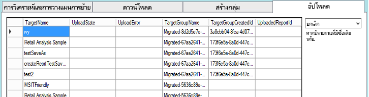

<span data-ttu-id="3986a-216">คุณสามารถอัปโหลดรายงานที่เลือก หรือคุณสามารถอัปโหลดรายงานทั้งหมด</span><span class="sxs-lookup"><span data-stu-id="3986a-216">You can upload selected reports, or you could upload all the reports.</span></span> <span data-ttu-id="3986a-217">นอกจากนี้คุณยังสามารถรีเซ็ตสถานะอัปโหลดให้เป็นรายการอัปโหลดใหม่</span><span class="sxs-lookup"><span data-stu-id="3986a-217">You can also reset the upload status to re-upload items.</span></span>

<span data-ttu-id="3986a-218">นอกจากนี้คุณยังมีตัวเลือกในการเลือกสิ่งที่ต้องทำ ถ้ามีรายงานที่มีชื่อเดียวกันอยู่</span><span class="sxs-lookup"><span data-stu-id="3986a-218">You also have the option of selecting what to do if a report with the same name exists.</span></span> <span data-ttu-id="3986a-219">คุณสามารถเลือกระหว่าง **ยกเลิก**, **ละเว้น** และ **เขียนทับ** ได้</span><span class="sxs-lookup"><span data-stu-id="3986a-219">You can choose between **Abort**, **Ignore** and **Overwrite**.</span></span>

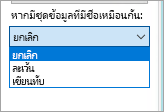

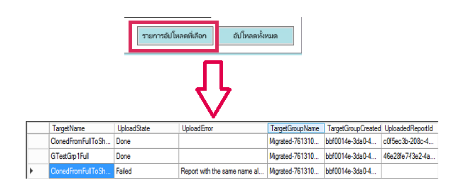

### <a name="duplicate-report-names"></a><span data-ttu-id="3986a-222">ชื่อรายงานซ้ำ</span><span class="sxs-lookup"><span data-stu-id="3986a-222">Duplicate report names</span></span>

<span data-ttu-id="3986a-223">ถ้าคุณมีรายงานที่มีชื่อเดียวกัน แต่คุณทราบว่ารายงานนั้นแตกต่างกัน คุณจะต้องเปลี่ยนการ **”ชื่อเป้าหมาย”** ของรายงาน</span><span class="sxs-lookup"><span data-stu-id="3986a-223">If you have a report that has the same name, but you know it is a different report, you will need to change the **TargetName** of the report.</span></span> <span data-ttu-id="3986a-224">คุณสามารถเปลี่ยนชื่อโดยการแก้ไข XML แผนการย้ายด้วยตนเอง</span><span class="sxs-lookup"><span data-stu-id="3986a-224">You can change the name by manually editing the migration plan XML.</span></span>

<span data-ttu-id="3986a-225">คุณจะต้องปิดเครื่องมือการย้ายเพื่อทำการเปลี่ยนแปลง จากนั้นเปิดเครื่องมือและแผนการย้ายอีกครั้ง</span><span class="sxs-lookup"><span data-stu-id="3986a-225">You will need to close the migration tool to make the change and then re-open the tool and the migration plan.</span></span>

<span data-ttu-id="3986a-226">ในตัวอย่างข้างต้น หนึ่งในรายงานที่ถูกโคลนล้มเหลวในการระบุรายงานที่มีชื่อเดียวกัน</span><span class="sxs-lookup"><span data-stu-id="3986a-226">In the above example, one of the cloned reports failed indicating a report with the same name existed.</span></span> <span data-ttu-id="3986a-227">เราจะเห็นสิ่งต่อไปนี้ ถ้าเราดูที่ XML แผนการย้าย</span><span class="sxs-lookup"><span data-stu-id="3986a-227">If we go look at the migration plan XML, we will see the following.</span></span>

```xml
<ReportMigrationData>
    <PaaSWorkspaceCollectionName>SampleWorkspaceCollection</PaaSWorkspaceCollectionName>
    <PaaSWorkspaceId>4c04147b-d8fc-478b-8dcb-bcf687149823</PaaSWorkspaceId>
    <PaaSReportId>525a8328-b8cc-4f0d-b2cb-c3a9b4ba2efe</PaaSReportId>
    <PaaSReportLastImportTime>1/3/2017 2:10:19 PM</PaaSReportLastImportTime>
    <PaaSReportName>cloned</PaaSReportName>
    <IsPushDataset>false</IsPushDataset>
    <IsBoundToOldDataset>false</IsBoundToOldDataset>
    <PbixPath>C:\MigrationData\SampleResourceGroup\SampleWorkspaceCollection\4c04147b-d8fc-478b-8dcb-bcf687149823\cloned-525a8328-b8cc-4f0d-b2cb-c3a9b4ba2efe.pbix</PbixPath>
    <ExportState>Done</ExportState>
    <LastExportStatus>OK</LastExportStatus>
    <SaaSTargetGroupName>SampleMigrate</SaaSTargetGroupName>
    <SaaSTargetGroupId>6da6f072-0135-4e6c-bc92-0886d8aeb79d</SaaSTargetGroupId>
    <SaaSTargetReportName>cloned</SaaSTargetReportName>
    <SaaSImportState>Failed</SaaSImportState>
    <SaaSImportError>Report with the same name already exists</SaaSImportError>
</ReportMigrationData>
```

<span data-ttu-id="3986a-228">สำหรับรายการที่ล้มเหลว เราสามารถเปลี่ยนชื่อของ SaaSTargetReportName ได้</span><span class="sxs-lookup"><span data-stu-id="3986a-228">For the failed item, we can change the name of the SaaSTargetReportName.</span></span>

```xml
<SaaSTargetReportName>cloned2</SaaSTargetReportName>
```

<span data-ttu-id="3986a-229">จากนั้นเราจะสามารถเปิดแผนและอัปโหลดรายงานที่ล้มเหลวในเครื่องมือการย้ายใหม่อีกครั้ง</span><span class="sxs-lookup"><span data-stu-id="3986a-229">We can then re-open the plan, in the migration tool, and upload the failed report.</span></span>

<span data-ttu-id="3986a-230">เมื่อกลับไปยัง Power BI เราจะเห็นว่ารายงานและชุดข้อมูลได้รับการอัปโหลดลงในพื้นที่ทำงานแล้ว</span><span class="sxs-lookup"><span data-stu-id="3986a-230">Going back to Power BI, we can see that the reports and datasets have been uploaded in the workspace.</span></span>

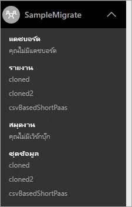

<a name="upload-local-file"></a>

### <a name="upload-a-local-pbix-file"></a><span data-ttu-id="3986a-232">อัปโหลดไฟล์ PBIX ภายในเครื่อง</span><span class="sxs-lookup"><span data-stu-id="3986a-232">Upload a local PBIX file</span></span>

<span data-ttu-id="3986a-233">คุณสามารถอัปโหลดไฟล์ Power BI Desktop รุ่นภายในเครื่องได้</span><span class="sxs-lookup"><span data-stu-id="3986a-233">You can upload a local version of a Power BI Desktop file.</span></span> <span data-ttu-id="3986a-234">คุณจะต้องปิดเครื่องมือ แก้ไข XML และใส่เส้นทางแบบเต็มไปยัง PBIX ภายในเครื่องของคุณในคุณสมบัติ **PbixPath**</span><span class="sxs-lookup"><span data-stu-id="3986a-234">You will have to close the tool, edit the XML and put the full path to your local PBIX in the **PbixPath** property.</span></span>

```xml
<PbixPath>[Full Path to PBIX file]</PbixPath>
```

<span data-ttu-id="3986a-235">หลังจากที่คุณแก้ไข xml แล้ว เปิดแผนในเครื่องมือการย้ายใหม่อีกครั้ง และอัปโหลดรายงาน</span><span class="sxs-lookup"><span data-stu-id="3986a-235">After you have edited the xml, re-open the plan within the migration tool and upload the report.</span></span>

<a name="directquery-reports"></a>

### <a name="directquery-reports"></a><span data-ttu-id="3986a-236">รายงาน DirectQuery</span><span class="sxs-lookup"><span data-stu-id="3986a-236">DirectQuery reports</span></span>

<span data-ttu-id="3986a-237">คุณจะต้องอัปเดตเพื่อปรับปรุงสตริงการเชื่อมต่อสำหรับรายงาน DirectQuery</span><span class="sxs-lookup"><span data-stu-id="3986a-237">You will need to update to update the connection string for DirectQuery reports.</span></span> <span data-ttu-id="3986a-238">ซึ่งสามารถทำได้ใน *powerbi.com* หรือคุณสามารถค้นหาสตริงการเชื่อมต่อจาก Power BI แบบฝัง (PaaS) ทางโปรแกรมได้</span><span class="sxs-lookup"><span data-stu-id="3986a-238">This can be done within *powerbi.com*, or you can programmatically query the connection string from Power BI Embedded (PaaS).</span></span> <span data-ttu-id="3986a-239">สำหรับตัวอย่าง ดูที่[สตริงการเชื่อมต่อ “DirectQuery ที่แยกออก” จากรายงาน PaaS](migrate-code-snippets.md#extract-directquery-connection-string-from-paas-report)</span><span class="sxs-lookup"><span data-stu-id="3986a-239">For an example, see [Extract DirectQuery connection string from PaaS report](migrate-code-snippets.md#extract-directquery-connection-string-from-paas-report).</span></span>

<span data-ttu-id="3986a-240">จากนั้นคุณจะสามารถอัปเดตสตริงการเชื่อมต่อสำหรับชุดข้อมูลในบริการ Power BI (SaaS) และตั้งค่าข้อมูลประจำตัวสำหรับแหล่งข้อมูล</span><span class="sxs-lookup"><span data-stu-id="3986a-240">You can then update the connection string for the dataset within the Power BI service (SaaS) and set the credentials for the data source.</span></span> <span data-ttu-id="3986a-241">คุณสามารถดูตัวอย่างต่อไปนี้เพื่อดูวิธีการทำ</span><span class="sxs-lookup"><span data-stu-id="3986a-241">You can look at the following examples to see how to do this.</span></span>

* [<span data-ttu-id="3986a-242">การอัปเดตสตริงเชื่อมต่อ DirectQuery คือ พื้นที่ทำงาน SaaS</span><span class="sxs-lookup"><span data-stu-id="3986a-242">Update DirectQuery connection string is SaaS workspace</span></span>](migrate-code-snippets.md#update-directquery-connection-string-is-saas-workspace)
* [<span data-ttu-id="3986a-243">ตั้งค่าข้อมูลประจำตัวของ DirectQuery ในพื้นที่ทำงาน SaaS</span><span class="sxs-lookup"><span data-stu-id="3986a-243">Set DirectQuery credentials in SaaS workspace</span></span>](migrate-code-snippets.md#set-directquery-credentials-in-saas-workspace)

## <a name="embedding"></a><span data-ttu-id="3986a-244">การฝังตัว</span><span class="sxs-lookup"><span data-stu-id="3986a-244">Embedding</span></span>

<span data-ttu-id="3986a-245">ในตอนนี้รายงานของคุณได้ถูกย้ายจากบริการ Azure แบบฝัง Power BI ไปยังบริการ Power BI คุณสามารถอัปเดตแอปพลิเคชันของคุณได้เดี๋ยวนี้ และเริ่มการฝังรายงานในพื้นที่ทำงานนี้</span><span class="sxs-lookup"><span data-stu-id="3986a-245">Now that your reports have been migrated from the Power BI Embedded Azure service to the Power BI service, you can now update your application and begin embedding the reports in this workspace.</span></span>

<span data-ttu-id="3986a-246">สำหรับข้อมูลเพิ่มเติม ดูที่[วิธีการย้ายเนื้อหาคอลเลกชันพื้นที่ทำงานแบบฝัง Power BI ไปยัง Power BI](migrate-from-powerbi-embedded.md)</span><span class="sxs-lookup"><span data-stu-id="3986a-246">For more information, see [How to migrate Power BI Embedded workspace collection content to Power BI](migrate-from-powerbi-embedded.md).</span></span>

## <a name="next-steps"></a><span data-ttu-id="3986a-247">ขั้นตอนถัดไป</span><span class="sxs-lookup"><span data-stu-id="3986a-247">Next steps</span></span>

[<span data-ttu-id="3986a-248">การฝังด้วย Power BI</span><span class="sxs-lookup"><span data-stu-id="3986a-248">Embedding with Power BI</span></span>](embedding.md)  
[<span data-ttu-id="3986a-249">วิธีการย้ายเนื้อหาคอลเลกชันพื้นที่ทำงานแบบฝัง Power BI ไปยัง Power BI</span><span class="sxs-lookup"><span data-stu-id="3986a-249">How to migrate Power BI Embedded workspace collection content to Power BI</span></span>](migrate-from-powerbi-embedded.md)  
[<span data-ttu-id="3986a-250">Power BI Premium คืออะไร</span><span class="sxs-lookup"><span data-stu-id="3986a-250">Power BI Premium - what is it?</span></span>](../../admin/service-premium-what-is.md)  
[<span data-ttu-id="3986a-251">JavaScript API Git repo</span><span class="sxs-lookup"><span data-stu-id="3986a-251">JavaScript API Git repo</span></span>](https://github.com/Microsoft/PowerBI-JavaScript)  
[<span data-ttu-id="3986a-252">Power BI C# Git repo</span><span class="sxs-lookup"><span data-stu-id="3986a-252">Power BI C# Git repo</span></span>](https://github.com/Microsoft/PowerBI-CSharp)  
[<span data-ttu-id="3986a-253">ตัวอย่างการฝัง JavaScript</span><span class="sxs-lookup"><span data-stu-id="3986a-253">JavaScript embed sample</span></span>](https://microsoft.github.io/PowerBI-JavaScript/demo/)  
[<span data-ttu-id="3986a-254">เอกสารบรรยายแนวความคิดของ Power BI Premium</span><span class="sxs-lookup"><span data-stu-id="3986a-254">Power BI Premium whitepaper</span></span>](https://aka.ms/pbipremiumwhitepaper)  

<span data-ttu-id="3986a-255">มีคำถามเพิ่มเติมหรือไม่</span><span class="sxs-lookup"><span data-stu-id="3986a-255">More questions?</span></span> [<span data-ttu-id="3986a-256">ลองถามชุมชน Power BI</span><span class="sxs-lookup"><span data-stu-id="3986a-256">Try asking the Power BI Community</span></span>](https://community.powerbi.com/)