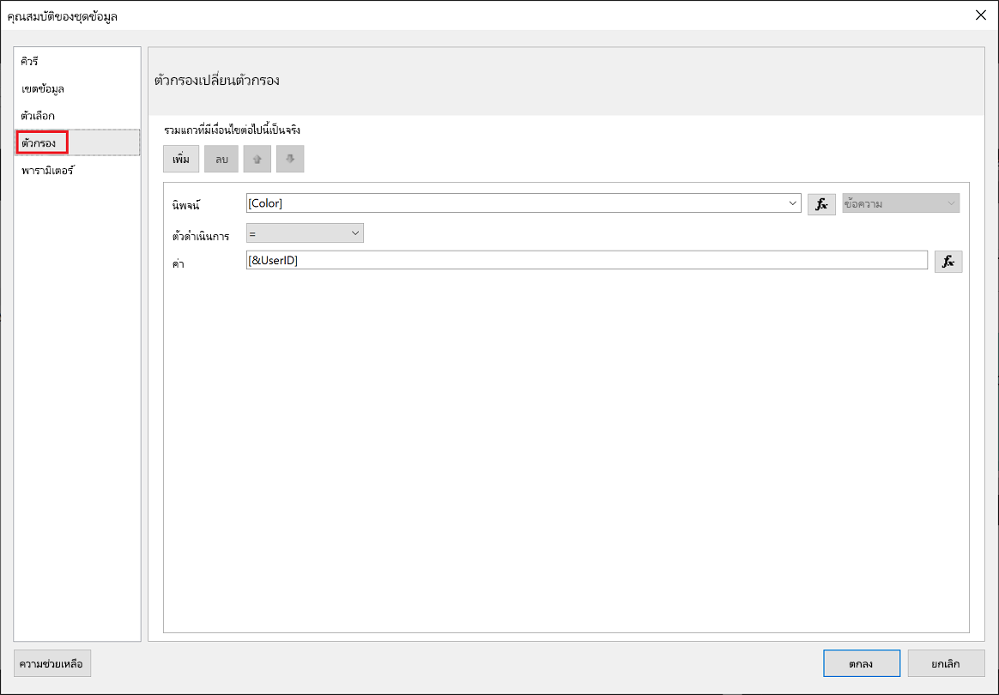
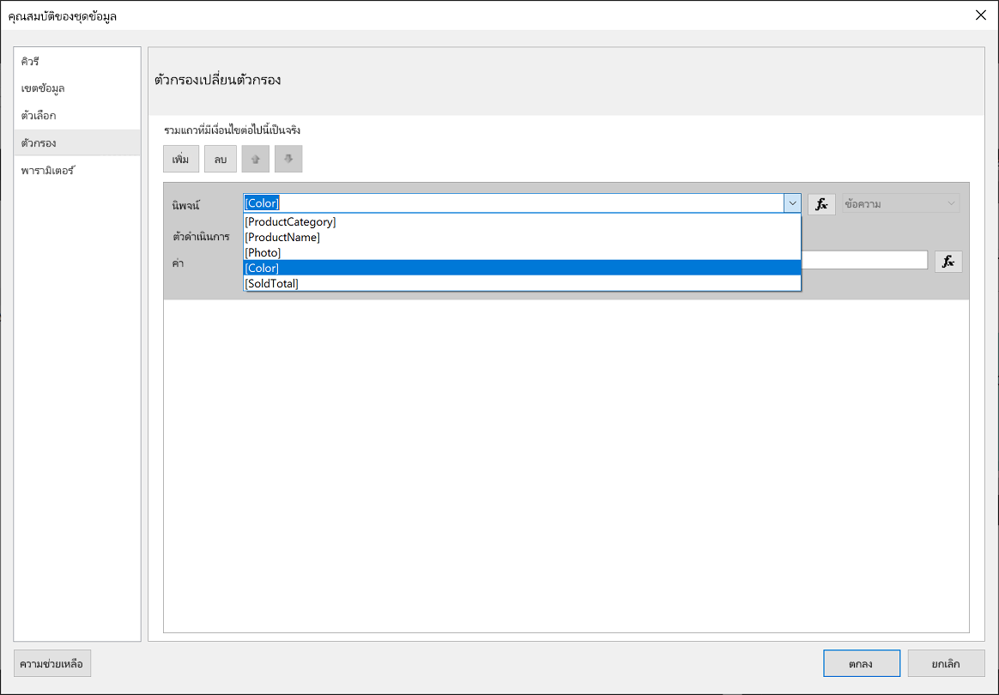
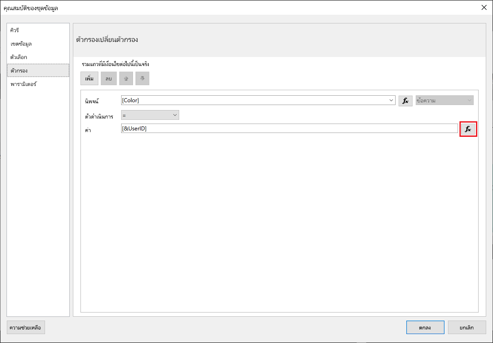
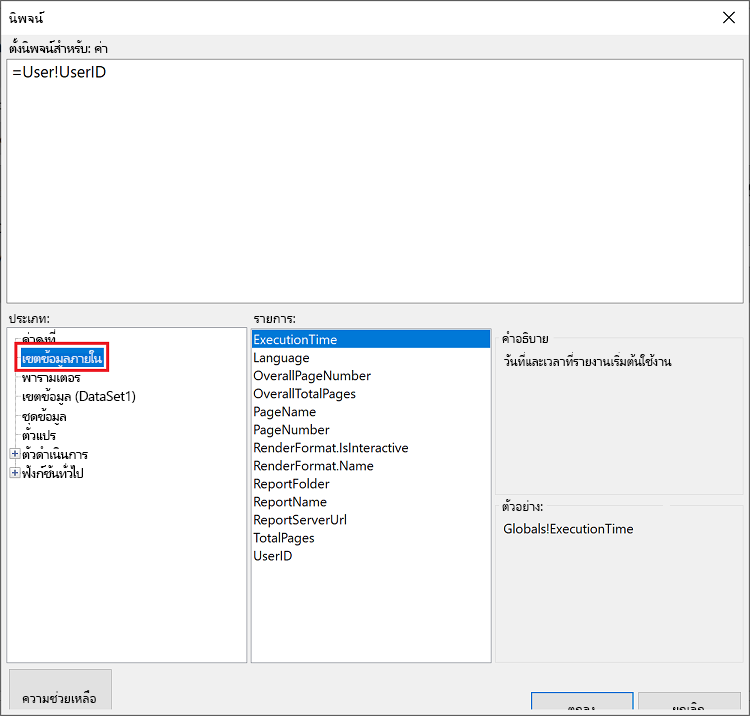
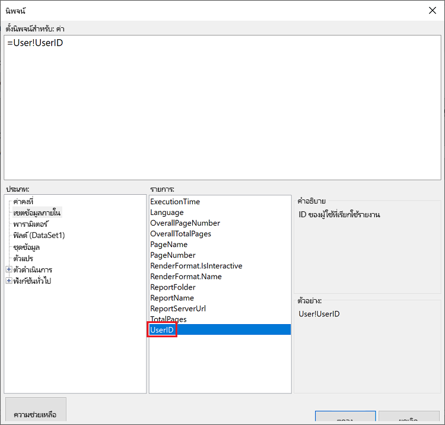
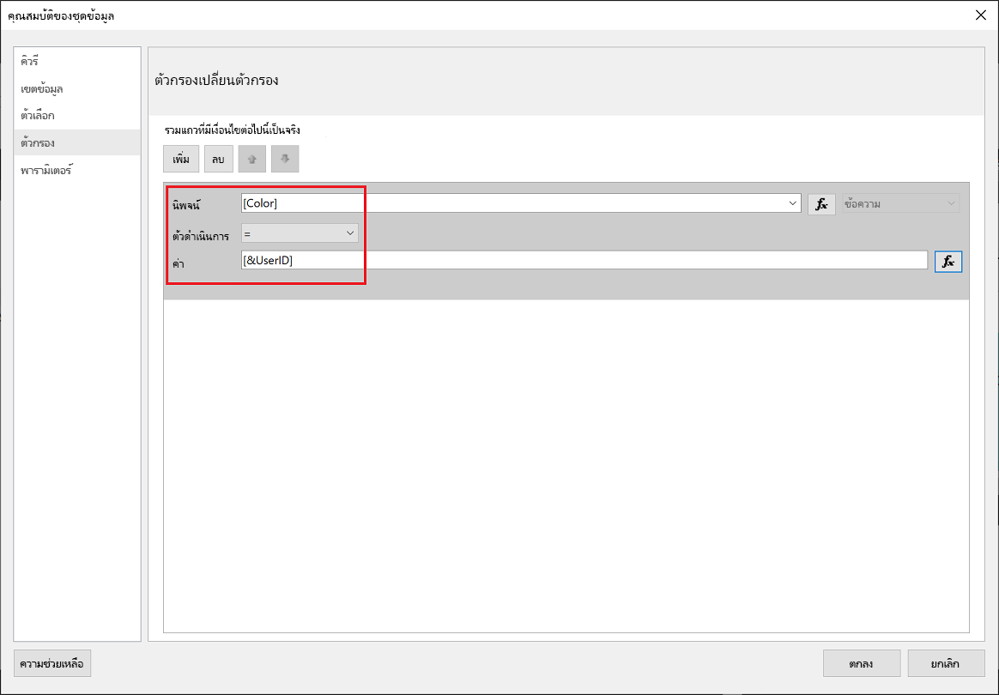
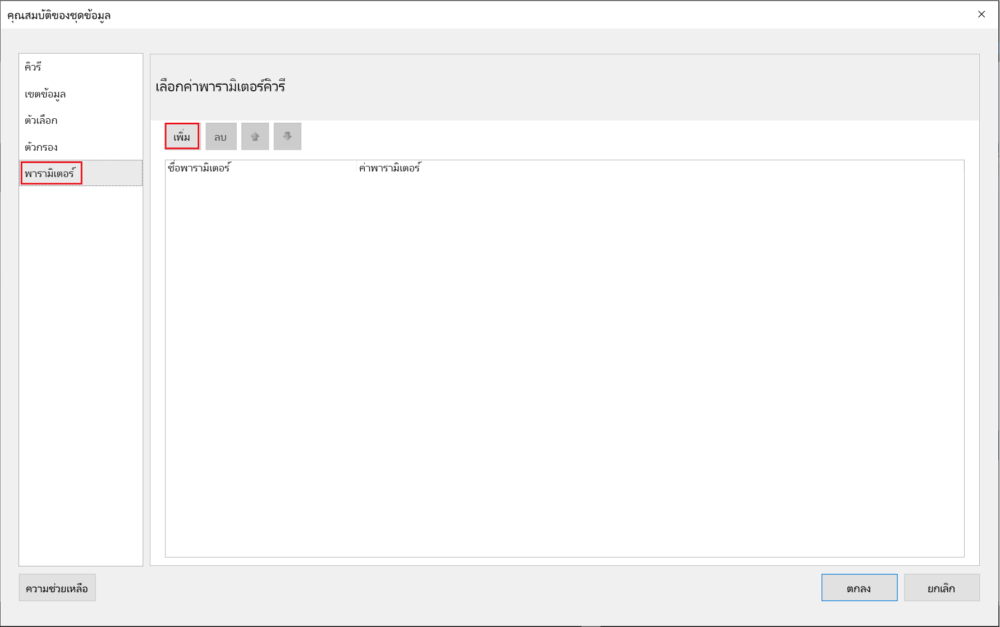
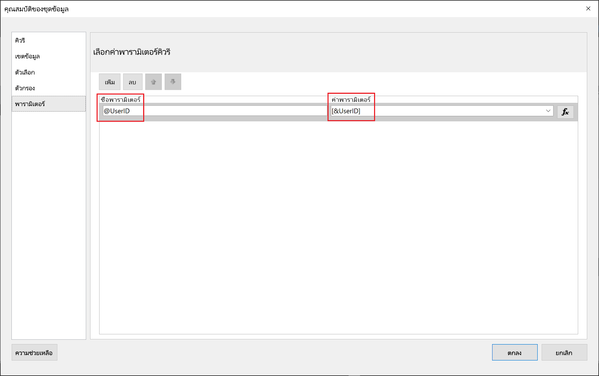
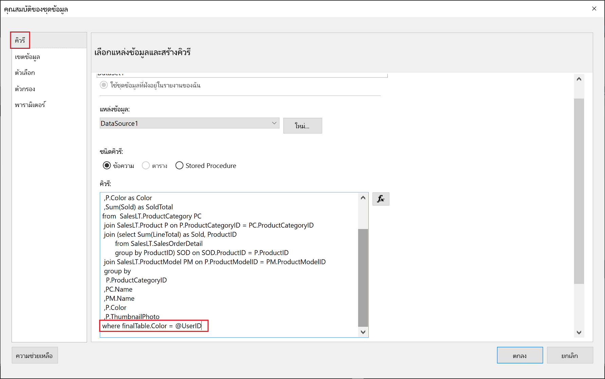

# <a name="implementing-row-level-security-in-embedded-paginated-reports"></a><span data-ttu-id="caa9a-103">การใช้การรักษาความปลอดภัยระดับแถวในรายงานที่มีเลขหน้า</span><span class="sxs-lookup"><span data-stu-id="caa9a-103">Implementing row-level security in embedded paginated reports</span></span>

<span data-ttu-id="caa9a-104">เมื่อคุณฝังรายงานที่มีการแบ่งหน้า คุณสามารถควบคุมว่าจะแสดงข้อมูลใด</span><span class="sxs-lookup"><span data-stu-id="caa9a-104">When you embed a paginated report, you can control which data is displayed.</span></span> <span data-ttu-id="caa9a-105">ซึ่งช่วยปรับแต่งข้อมูลที่แสดงให้เหมาะสมสำหรับผู้ใช้แต่ละราย</span><span class="sxs-lookup"><span data-stu-id="caa9a-105">This allows tailoring the displayed information per user.</span></span> <span data-ttu-id="caa9a-106">ตัวอย่างเช่น ถ้าคุณมีรายงานที่มีการแบ่งหน้าของ Power BI ที่มีผลการขายทั่วโลก คุณสามารถฝังข้อมูลดังกล่าวเพื่อให้แสดงเฉพาะผลการขายจากบางภูมิภาคเท่านั้นได้</span><span class="sxs-lookup"><span data-stu-id="caa9a-106">For example, if you have a Power BI paginated report that includes global sale results, you can embed it so that only the sale results from a certain region are available.</span></span>

<span data-ttu-id="caa9a-107">คุณลักษณะนี้เป็นวิธีที่ปลอดภัยในการแสดงข้อมูลชุดย่อยในลักษณะที่ไม่ทำให้ข้อมูลที่เหลือด้อยลง</span><span class="sxs-lookup"><span data-stu-id="caa9a-107">This feature provides a secure way of displaying a subset of the data, in a way that doesn't compromise the rest of data.</span></span> <span data-ttu-id="caa9a-108">คล้ายกับคุณลักษณะ [การรักษาความปลอดภัยระดับแถว (RLS)](embedded-row-level-security.md) ซึ่งเป็นวิธีที่ปลอดภัยในการแสดงข้อมูลในรายงาน Power BI (ที่ไม่ได้แบ่งหน้า) แดชบอร์ด ไทล์ และชุดข้อมูล</span><span class="sxs-lookup"><span data-stu-id="caa9a-108">It resembles the [Row Level Security (RLS)](embedded-row-level-security.md) feature, which provides a secure way of displaying data in Power BI reports (that are not paginated), dashboards, tiles, and datasets.</span></span>  

> [!NOTE]
> <span data-ttu-id="caa9a-109">คุณลักษณะนี้ทำงานร่วมกับการฝังรายงานที่มีการแบ่งหน้าสำหรับลูกค้า</span><span class="sxs-lookup"><span data-stu-id="caa9a-109">This feature works with embedding paginated reports for customers.</span></span>

## <a name="configuring-a-parameter-to-filter-the-dataset"></a><span data-ttu-id="caa9a-110">กำหนดค่าพารามิเตอร์เพื่อกรองชุดข้อมูล</span><span class="sxs-lookup"><span data-stu-id="caa9a-110">Configuring a parameter to filter the dataset</span></span>

<span data-ttu-id="caa9a-111">เมื่อใช้การรักษาความปลอดภัยระดับแถวกับรายงานที่มีการแบ่งหน้าของ Power BI คุณจำเป็นต้องกำหนดแอตทริบิวต์ [พารามิเตอร์](../../paginated-reports/report-builder-parameters.md) เป็น **UserID**</span><span class="sxs-lookup"><span data-stu-id="caa9a-111">When applying row-level security to a Power BI paginated report, you need to assign a [parameter](../../paginated-reports/report-builder-parameters.md) to the **UserID** attribute.</span></span> <span data-ttu-id="caa9a-112">พารามิเตอร์นี้จะจำกัดข้อมูลที่ดึงมาจากชุดข้อมูล ก่อนทำการฝังรายงาน</span><span class="sxs-lookup"><span data-stu-id="caa9a-112">This parameter will restrict the data pulled from the dataset, before the report is embedded.</span></span>

<span data-ttu-id="caa9a-113">หลังจากกำหนดพารามิเตอร์ให้กับ **UserID** ให้ใช้ API [Reports GenerateTokenInGroup](/rest/api/power-bi/embedtoken/reports_generatetokeningroup) เพื่อรับโทเค็นที่ฝังอยู่</span><span class="sxs-lookup"><span data-stu-id="caa9a-113">After assigning the parameter to **UserID**, use the [Reports GenerateTokenInGroup](/rest/api/power-bi/embedtoken/reports_generatetokeningroup) API to get the embed token.</span></span>

## <a name="use-userid-as-a-filter-at-report-or-query-level"></a><span data-ttu-id="caa9a-114">ใช้ UserID เป็นตัวกรองที่ระดับรายงานหรือคิวรี</span><span class="sxs-lookup"><span data-stu-id="caa9a-114">Use UserID as a filter at report or query level</span></span>

<span data-ttu-id="caa9a-115">คุณสามารถใช้ **UserId** เป็น *ตัวกรอง* หรือใน *แบบสอบถาม* กับแหล่งข้อมูลใน [ตัวช่วยสร้างรายของ Power BI](../../paginated-reports/report-builder-power-bi.md)</span><span class="sxs-lookup"><span data-stu-id="caa9a-115">You can use **UserId** as a *filter* or in a *query* to the datasource in [Power BI Report Builder](../../paginated-reports/report-builder-power-bi.md).</span></span>

### <a name="using-the-filter"></a><span data-ttu-id="caa9a-116">ใช้ตัวกรอง</span><span class="sxs-lookup"><span data-stu-id="caa9a-116">Using the filter</span></span>

1. <span data-ttu-id="caa9a-117">ในหน้าต่าง **คุณสมบัติของชุดข้อมูล** จากบานหน้าต่างด้านซ้าย ให้เลือก **ตัวกรอง**</span><span class="sxs-lookup"><span data-stu-id="caa9a-117">In the **Dataset Properties** window, from the left pane, select **Filter**.</span></span>

    

2. <span data-ttu-id="caa9a-119">จากเมนูดรอปดาวน์ **นิพจน์** ให้เลือกพารามิเตอร์ที่คุณต้องการใช้สำหรับการกรองข้อมูล</span><span class="sxs-lookup"><span data-stu-id="caa9a-119">From the **Expression** dropdown menu, select the parameter you want to use for filtering the data.</span></span>

     

3. <span data-ttu-id="caa9a-121">คลิกปุ่มฟังก์ชัน **ค่า**</span><span class="sxs-lookup"><span data-stu-id="caa9a-121">Click the **Value** function button.</span></span> 

    

4. <span data-ttu-id="caa9a-123">ในหน้าต่าง **นิพจน์** จากรายการ **หมวดหมู่** ให้เลือก **เขตข้อมูลที่มีอยู่แล้วภายใน**</span><span class="sxs-lookup"><span data-stu-id="caa9a-123">In the **Expression** window, from the **Category** list, select **Built-in Fields**.</span></span>

    

5. <span data-ttu-id="caa9a-125">จากรายการ **หน่วยข้อมูล** ให้เลือก **UserID** และคลิก **ตกลง**</span><span class="sxs-lookup"><span data-stu-id="caa9a-125">From the **Item** list, select **UserID** and click **OK**.</span></span>

    

6. <span data-ttu-id="caa9a-127">ในหน้าต่าง **คุณสมบัติชุดข้อมูล** ให้ตรวจสอบว่านิพจน์คือ *พารามิเตอร์ที่คุณเลือก = UserID* และคลิก **ตกลง**</span><span class="sxs-lookup"><span data-stu-id="caa9a-127">In the **Dataset Properties** window, verify that the expression is *your selected parameter = UserID*, and click **OK**.</span></span>

    

### <a name="using-a-query"></a><span data-ttu-id="caa9a-129">การใช้คิวรี</span><span class="sxs-lookup"><span data-stu-id="caa9a-129">Using a query</span></span>

1. <span data-ttu-id="caa9a-130">ในหน้าต่าง **คุณสมบัติของชุดข้อมูล** จากบานหน้าต่างด้านซ้าย ให้เลือก **พารามิเตอร์** และคลิก **เพิ่ม**</span><span class="sxs-lookup"><span data-stu-id="caa9a-130">In the **Dataset Properties** window, from the left pane, select **Parameters** and click **Add**.</span></span>

    

2. <span data-ttu-id="caa9a-132">ใน **ชื่อพารามิเตอร์** ให้ป้อน **\@UserID** และใน **ค่าพารามิเตอร์** ให้เพิ่ม **[&UserID]**</span><span class="sxs-lookup"><span data-stu-id="caa9a-132">In the **Parameter Name** enter **\@UserID**, and in the **Parameter Value** add **[&UserID]**.</span></span>

     

3. <span data-ttu-id="caa9a-134">จากบานหน้าต่างด้านซ้าย ให้เลือก **คิวรี** ในคิวรี ให้เพิ่มพารามิเตอร์ **UserID** เป็นส่วนหนึ่งของคิวรีของคุณ และคลิก **ตกลง**</span><span class="sxs-lookup"><span data-stu-id="caa9a-134">From the left pane, select  **Query**, in the Query add the **UserID** parameter as part of your query, and click **OK**.</span></span>
    > [!NOTE]
    > <span data-ttu-id="caa9a-135">ในภาพหน้าจอด้านล่างเป็นการแสดงตัวอย่าง การใช้งานพารามิเตอร์สี (whereFinalTable.Color = @UserID)</span><span class="sxs-lookup"><span data-stu-id="caa9a-135">In the screenshot below the color parameter is used as an example (whereFinalTable.Color = @UserID).</span></span> <span data-ttu-id="caa9a-136">ถ้าจำเป็น คุณสามารถสร้างคิวรีที่ซับซ้อนมากขึ้นได้</span><span class="sxs-lookup"><span data-stu-id="caa9a-136">If needed, it is possible to create a more complex query.</span></span>

    

## <a name="passing-the-configured-parameter-using-the-embed-token"></a><span data-ttu-id="caa9a-138">การส่งผ่านพารามิเตอร์ที่กำหนดค่าโดยใช้โทเค็นแบบฝังตัว</span><span class="sxs-lookup"><span data-stu-id="caa9a-138">Passing the configured parameter using the embed token</span></span>

<span data-ttu-id="caa9a-139">เมื่อทำการฝังรายงานที่มีการแบ่งหน้าสำหรับลูกค้าของคุณ จะมีการใช้ API [Reports GenerateTokenForCreateInGroup](/rest/api/power-bi/embedtoken/reports_generatetokeningroup) เพื่อรับโทเค็นที่ฝังอยู่</span><span class="sxs-lookup"><span data-stu-id="caa9a-139">When embedding a paginated report for your customers, the [Reports GenerateTokenInGroup](/rest/api/power-bi/embedtoken/reports_generatetokeningroup) API is used to get the embed token.</span></span> <span data-ttu-id="caa9a-140">โทเค็นนี้ยังสามารถใช้เพื่อกรองข้อมูลบางส่วนที่ถูกดึงออกจากรายงานที่มีการแบ่งหน้าได้อีกด้วย</span><span class="sxs-lookup"><span data-stu-id="caa9a-140">This token can also be used to filter some of the data that is pulled out of the paginated report.</span></span>

<span data-ttu-id="caa9a-141">หากต้องการเปิดเผยข้อมูลเพียงบางส่วน ให้กำหนดเขตข้อมูล `username` ด้วยข้อมูลที่คุณต้องการให้แสดง</span><span class="sxs-lookup"><span data-stu-id="caa9a-141">To expose only some of the data, assign the `username` field with the information you want to be displayed.</span></span> <span data-ttu-id="caa9a-142">ตัวอย่างเช่น ในรายงานที่มีการแบ่งหน้าซึ่งมีพารามิเตอร์สี ถ้าคุณป้อน *สีเขียว* ในเขตข้อมูล `username` โทเค็นแบบฝังตัวจะจำกัดข้อมูลที่ถูกฝังเพื่อแสดงเฉพาะข้อมูลที่มีค่า *สีเขียว* ในคอลัมน์สี</span><span class="sxs-lookup"><span data-stu-id="caa9a-142">For example, in a paginated report that has a color parameter, if you enter *green* in the `username` field, the embed token will restrict the embedded data to display only the data that has the *green* value in the color column.</span></span>

```JSON
{
    "accessLevel": "View",
    "reportId": "cfafbeb1-8037-4d0c-896e-a46fb27ff229",
    "identities": [
            {
                    // Replace the 'username' with a paginated report parameter
                    "username":     "...",
                    "reports: [
                        "cfafbeb1-8037-4d0c-896e-a46fb27ff229"
                    ]
            }
    ]
}
```