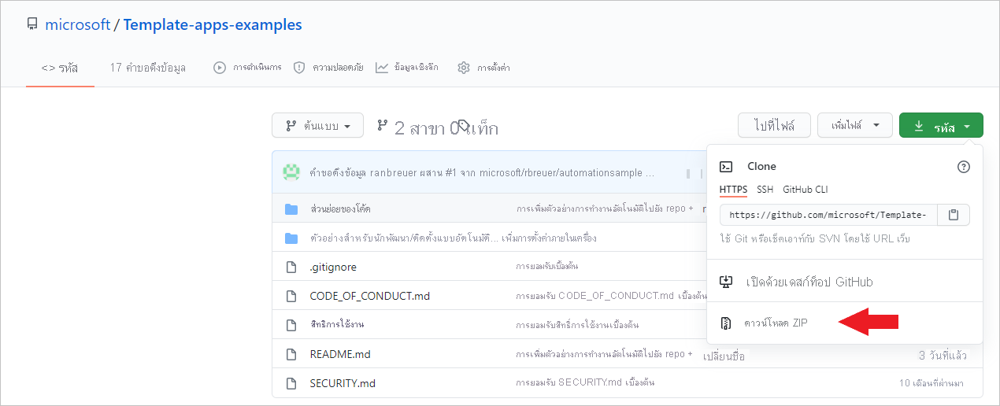
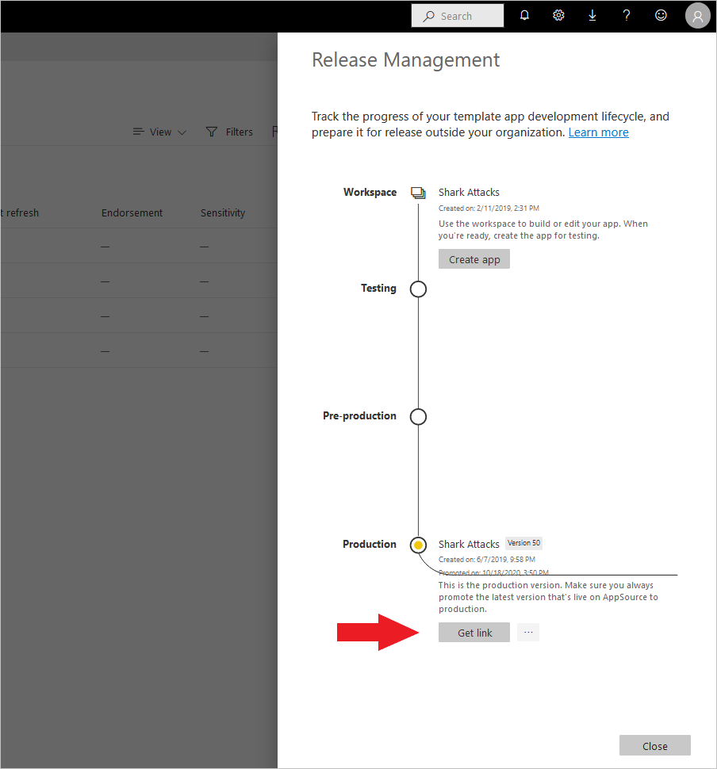
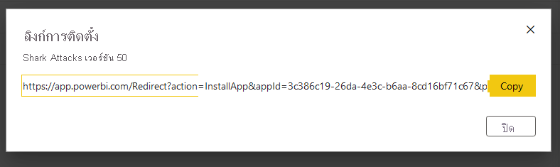
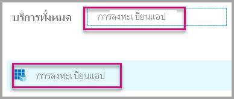
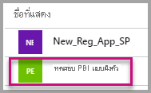
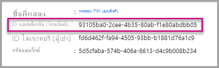
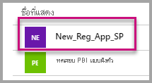
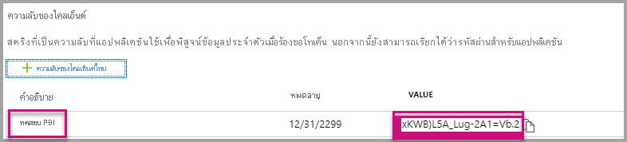

# <a name="tutorial-automate-configuration-of-template-app-installation-using-an-azure-function"></a>บทช่วยสอน: ทำให้การกำหนดค่าการติดตั้งแอปเทมเพลตเป็นแบบอัตโนมัติโดยใช้ Azure Function

แอปเทมเพลตเป็นวิธีที่ยอดเยี่ยมสำหรับลูกค้าในการเริ่มรับข้อมูลเชิงลึกจากข้อมูลของตน แอปเทมเพลตช่วยให้แอปเหล่านี้ทำงานได้อย่างรวดเร็วโดยการเชื่อมต่อกับข้อมูล แอปเทมเพลตจะให้รายงานที่สร้างไว้ล่วงหน้าแก่ลูกค้าซึ่งพวกเขาสามารถปรับแต่งได้ตามต้องการ

ลูกค้ามักไม่คุ้นเคยกับรายละเอียดของวิธีการเชื่อมต่อกับข้อมูลของพวกเขา การให้รายละเอียดเหล่านี้ในขณะที่พวกเขาติดตั้งแอปเทมเพลต จะสร้างความยุ่งยากให้

หากคุณเป็นผู้ให้บริการข้อมูลและได้สร้างแอปเทมเพลตเพื่อช่วยให้ลูกค้าเริ่มต้นใช้งานข้อมูลในบริการของคุณ คุณสามารถทำให้พวกเขาติดตั้งแอปเทมเพลตของคุณได้ง่ายขึ้น คุณสามารถทำให้การกำหนดค่าพารามิเตอร์ของแอปเทมเพลตเป็นแบบอัตโนมัติ

เมื่อลูกค้าลงชื่อเข้าใช้พอร์ทัลของคุณ พวกเขาจะเลือกลิงก์พิเศษที่คุณเตรียมไว้ ลิงก์นี้:

- เปิดการทำงานอัตโนมัติ ซึ่งรวบรวมข้อมูลที่ต้องการ
- กำหนดค่าพารามิเตอร์แอปเทมเพลตไว้ล่วงหน้า
- เปลี่ยนเส้นทางลูกค้าไปยังบัญชี Power BI ของพวกเขาซึ่งพวกเขาสามารถติดตั้งแอปได้

สิ่งที่พวกเขาต้องทำคือเลือก **ติดตั้ง** และรับรองความถูกต้องเทียบกับแหล่งข้อมูลของพวกเขา เท่านี้ก็เรียบร้อย!

ประสบการณ์ของลูกค้านี้แสดงเป็นภาพประกอบไว้ที่นี่


ในบทช่วยสอนนี้ คุณจะใช้ตัวอย่าง Azure Function สำหรับการติดตั้งอัตโนมัติที่เราสร้างขึ้นเพื่อกำหนดค่าล่วงหน้าและติดตั้งแอปเทมเพลตของคุณ ตัวอย่างนี้ถูกเก็บไว้อย่างตั้งใจเพื่อวัตถุประสงค์ในการสาธิต ซึ่งย่อส่วนการตั้งค่าของ Azure Function เพื่อใช้ Power BI API สำหรับการติดตั้งแอปเทมเพลตและกำหนดค่าให้กับผู้ใช้ของคุณโดยอัตโนมัติ

สำหรับข้อมูลเพิ่มเติมเกี่ยวกับโฟลว์การทำงานโดยอัตโนมัติแบบทั่วไปและ API ที่แอปใช้ โปรดดู[ทำให้การกำหนดค่าการติดตั้งแอปเทมเพลตเป็นแบบอัตโนมัติ](template-apps-auto-install.md)

แอปพลิเคชันแบบง่ายของเราใช้ Azure Function สำหรับข้อมูลเพิ่มเติมเกี่ยวกับ Azure Function โปรดดูที่[เอกสารเกี่ยวกับ Azure Function](/azure/azure-functions/)

## <a name="basic-flow"></a>โฟลว์พื้นฐาน

ขั้นตอนพื้นฐานต่อไปนี้แสดงสิ่งที่แอปพลิเคชันทำเมื่อลูกค้าเปิดใช้งานโดยการเลือกที่ลิงก์บนพอร์ทัลของคุณ

1. ผู้ใช้ลงชื่อเข้าใช้พอร์ทัลของ ISV และเลือกลิงก์ที่ให้มา การดำเนินการนี้จะเริ่มใช้โฟลว์ พอร์ทัลของ ISV เตรียมการกำหนดค่าเฉพาะของผู้ใช้ในลำดับขั้นนี้

1. ISV ได้รับโทเค็น *เฉพาะแอป* ตาม [องค์ประกอบหลักของบริการ (โทเค็นเฉพาะแอป)](../embedded/embed-service-principal.md) ที่ลงทะเบียนในผู้เช่าของ ISV

1. ด้วยการใช้ [Power BI REST APIs](/rest/api/power-bi/) ISV จะสร้าง *ตั๋วการติดตั้ง* ซึ่งมีการกำหนดค่าพารามิเตอร์เฉพาะของผู้ใช้ตามที่ ISV เตรียมไว้

1. ISV เปลี่ยนเส้นทางผู้ใช้ไปยัง Power BI โดยใช้วิธีการเปลี่ยนเส้นทาง ```POST``` ที่มีตั๋วการติดตั้ง

1. ผู้ใช้จะถูกเปลี่ยนเส้นทางไปยังบัญชี Power BI ของพวกเขาด้วยตั๋วการติดตั้งและได้รับพร้อมท์แจ้งให้ติดตั้งแอปเทมเพลต เมื่อผู้ใช้เลือก **ติดตั้ง** แอปเทมเพลตจะถูกติดตั้งสำหรับพวกเขา

>[!Note]
>แม้ว่าค่าพารามิเตอร์จะถูกกำหนดโดย ISV ในกระบวนการสร้างตั๋วการติดตั้ง แต่ข้อมูลประจำตัวที่เกี่ยวข้องกับแหล่งข้อมูลจะถูกจัดเตรียมโดยผู้ใช้ในขั้นตอนสุดท้ายของการติดตั้งเท่านั้น การดำเนินการนี้จะป้องกันไม่ให้มีการเปิดเผยข้อมูลประจำตัวกับบุคคลที่สาม และทำให้มั่นใจได้ว่าการเชื่อมต่อระหว่างผู้ใช้และแหล่งข้อมูลของแอปเทมเพลตมีความปลอดภัย

## <a name="prerequisites"></a>สิ่งที่จำเป็นต้องมี

* ตั้งค่าผู้เช่า Azure Active Directory (Azure AD) ของคุณเอง สำหรับคำแนะนำเกี่ยวกับวิธีการตั้งค่า โปรดดูที่[สร้างผู้เช่า Azure AD](../embedded/create-an-azure-active-directory-tenant.md)
* [องค์ประกอบหลักของบริการ (โทเค็นเฉพาะแอป)](../embedded/embed-service-principal.md) ที่ลงทะเบียนในผู้เช่าก่อนหน้านี้
* [แอปเทมเพลต](../../connect-data/service-template-apps-overview.md)แบบกำหนดพารามิเตอร์ที่พร้อมสำหรับการติดตั้ง ต้องสร้างแอปเทมเพลตในผู้เช่าเดียวกันกับที่คุณลงทะเบียนแอปพลิเคชันของคุณใน Azure AD สำหรับข้อมูลเพิ่มเติม โปรดดูที่[เคล็ดลับแอปเทมเพลต](../../connect-data/service-template-apps-tips.md)หรือ[สร้างแอปเทมเพลตใน Power BI](../../connect-data/service-template-apps-create.md)
* สิทธิการใช้งาน Power BI Pro หากคุณยังไม่ได้สมัคร Power BI Pro ให้ [สมัครทดลองใช้งานฟรี](https://powerbi.microsoft.com/pricing/) ก่อนที่คุณจะเริ่ม

## <a name="set-up-your-template-apps-automation-development-environment"></a>ตั้งค่าสภาพแวดล้อมการพัฒนาเพื่อทำให้แอปเทมเพลตของคุณเป็นแบบอัตโนมัติ

ก่อนที่คุณจะดำเนินการตั้งค่าแอปพลิเคชันของคุณต่อไป ให้ทำตามคำแนะนำใน [เริ่มต้นใช้งานด่วน: สร้างแอป Azure Functions ด้วย Azure App Configuration](/azure/azure-app-configuration/quickstart-azure-functions-csharp) เพื่อพัฒนาฟังก์ชัน Azure พร้อมกับการกำหนดค่าแอป Azure สร้างการกำหนดค่าแอปของคุณตามที่อธิบายไว้ในบทความ

### <a name="register-an-application-in-azure-ad"></a>ลงทะเบียนแอปพลิเคชันใน Azure AD

สร้างองค์ประกอบหลักของบริการตามที่อธิบายไว้ใน[ฝังเนื้อหา Power BI ด้วยองค์ประกอบหลักของบริการและข้อมูลลับของแอปพลิเคชัน](../embedded/embed-service-principal.md)

ตรวจสอบให้แน่ใจว่าได้ลงทะเบียนแอปพลิเคชันเป็นแอปแบบ **เว็บแอปพลิเคชันฝั่งเซิร์ฟเวอร์** คุณลงทะเบียนแอปพลิเคชันเว็บฝั่งเซิร์ฟเวอร์เพื่อสร้างเป็นความลับของแอปพลิเคชัน

บันทึก *ID แอปพลิเคชัน* (ID ไคลเอ็นต์) และ *ข้อมูลลับของแอปพลิเคชัน* (ข้อมูลลับของไคลเอ็นต์) สำหรับขั้นตอนต่อไป

คุณสามารถเข้าถึง[เครื่องมือตั้งค่าการฝังตัว](https://aka.ms/embedsetup/AppOwnsData)เพื่อเริ่มต้นสร้างการลงทะเบียนแอปได้อย่างรวดเร็ว หากคุณกำลังใช้ [เครื่องมือการลงทะเบียนแอป Power BI](https://app.powerbi.com/embedsetup) ให้เลือกตัวเลือก **ฝังตัวสำหรับลูกค้าของคุณ**

## <a name="template-app-preparation"></a>การเตรียมแอปเทมเพลต

หลังจากคุณได้สร้างแอปเทมเพลตของคุณและพร้อมสำหรับการติดตั้งแล้ว ให้บันทึกข้อมูลต่อไปนี้สำหรับขั้นตอนต่อไป:

* *App ID*, *Package Key* และ *Owner ID* ตามที่ปรากฏใน URL การติดตั้งในตอนท้ายของกระบวนการ [กำหนดคุณสมบัติของแอปเทมเพลต](../../connect-data/service-template-apps-create.md#define-the-properties-of-the-template-app)เมื่อสร้างแอปขึ้นแล้ว

    คุณยังสามารถรับลิงก์เดียวกันได้โดยเลือกที่ **รับลิงก์** ใน [บานหน้าต่างการจัดการนำไปใช้งานจริง](../../connect-data/service-template-apps-create.md#manage-the-template-app-release)ของแอปเทมเพลต

* *ชื่อพารามิเตอร์* ตามที่กำหนดไว้ในชุดข้อมูลของแอปเทมเพลต ชื่อพารามิเตอร์เป็นสตริงที่ต้องตรงตามตัวพิมพ์ใหญ่-เล็ก ซึ่งยังสามารถดึงชื่อดังกล่าวได้จากแท็บ **การตั้งค่าพารามิเตอร์** เมื่อคุณ [กำหนดคุณสมบัติของแอปเทมเพลต](../../connect-data/service-template-apps-create.md#define-the-properties-of-the-template-app) หรือจากการตั้งค่าชุดข้อมูลใน Power BI

>[!NOTE]
>คุณสามารถทดสอบแอปพลิเคชันการติดตั้งที่กำหนดค่าไว้ล่วงหน้าบนแอปเทมเพลตของคุณได้หากแอปเทมเพลตพร้อมสำหรับการติดตั้งแม้ว่าจะยังไม่พร้อมใช้งานแบบสาธารณะใน AppSource ก็ตาม เพื่อให้ผู้ใช้ภายนอกผู้เช่าของคุณสามารถใช้แอปพลิเคชันการติดตั้งอัตโนมัติเพื่อติดตั้งแอปเทมเพลตของคุณได้ แอปเทมเพลตจะต้องพร้อมใช้งานแบบสาธารณะใน [Power BI Apps marketplace](https://app.powerbi.com/getdata/services) ก่อนที่คุณจะแจกจ่ายแอปเทมเพลตของคุณโดยใช้แอปพลิเคชันการติดตั้งอัตโนมัติที่คุณกำลังสร้างขึ้น อย่าลืมเผยแพร่ไปยัง[ศูนย์พันธมิตร](/azure/marketplace/partner-center-portal/create-power-bi-app-offer)ก่อน


## <a name="install-and-configure-your-template-app"></a>ติดตั้งและกำหนดค่าแอปเทมเพลตของคุณ

ในส่วนนี้ คุณจะใช้ตัวอย่าง Azure Function สำหรับการติดตั้งอัตโนมัติที่เราสร้างขึ้นเพื่อกำหนดค่าล่วงหน้าและติดตั้งแอปเทมเพลตของคุณ ตัวอย่างนี้ถูกเก็บไว้อย่างตั้งใจเพื่อวัตถุประสงค์ในการสาธิต ซึ่งช่วยให้คุณสามารถใช้ [ฟังก์ชัน Azure](/azure/azure-functions/functions-overview) และ[การกำหนดค่าแอป Azure](/azure/azure-app-configuration/overview) เพื่อปรับใช้และใช้งาน API การติดตั้งอัตโนมัติสำหรับแอปเทมเพลตของคุณได้อย่างง่ายดาย

### <a name="download-visual-studio-version-2017-or-later"></a>ดาวน์โหลด [Visual Studio](https://www.visualstudio.com/) (เวอร์ชัน 2017 หรือใหม่กว่า)

ดาวน์โหลด [Visual Studio](https://www.visualstudio.com/) (เวอร์ชัน 2017 หรือใหม่กว่า) ทำให้แน่ใจว่าได้ดาวน์โหลด[แพคเกจ NuGet](https://www.nuget.org/profiles/powerbi)ล่าสุด

### <a name="download-the-automated-installation-azure-functions-sample"></a>ดาวน์โหลดตัวอย่างฟังก์ชัน Azure สำหรับการติดตั้งอัตโนมัติ

ดาวน์โหลด[ตัวอย่างฟังก์ชัน Azure สำหรับการติดตั้งอัตโนมัติ](https://github.com/microsoft/Template-apps-examples/tree/master/Developer%20Samples/Automated%20Install%20Azure%20Function)จาก GitHub เพื่อเริ่มต้นใช้งาน



### <a name="set-up-your-azure-app-configuration"></a>ติดตั้งการกำหนดค่าแอป Azure ของคุณ

เมื่อต้องการเรียกใช้ตัวอย่างนี้ คุณต้องตั้งค่าการกำหนดค่าแอป Azure ของคุณด้วยค่าและคีย์ตามที่อธิบายไว้ที่นี่ คีย์คือ **ID แอปพลิเคชัน** **ข้อมูลลับของแอปพลิเคชัน** และ **AppId** **PackageKey** และค่า **OwnerId** ของแอปเทมเพลตของคุณ ดูส่วนต่อไปนี้สำหรับข้อมูลเกี่ยวกับวิธีการรับค่าเหล่านี้

นอกจากนี้ยังมีการกำหนดคีย์ไว้ในไฟล์ **Constants.cs** อีกด้วย

| คีย์การกำหนดค่า | ความหมาย           |
|---------------    |-------------------|
| TemplateAppInstall:Application:AppId | **AppId** จาก [URL การติดตั้ง](#get-the-template-app-properties) |
| TemplateAppInstall:Application:PackageKey | **PackageKey** จาก [URL การติดตั้ง](#get-the-template-app-properties) |
| TemplateAppInstall:Application:OwnerId | **OwnerId** จาก [URL การติดตั้ง](#get-the-template-app-properties) |
| TemplateAppInstall:ServicePrincipal:ClientId | [ID แอปพลิเคชัน](#get-the-application-id)สำหรับองค์ประกอบหลักของบริการ |
| TemplateAppInstall:ServicePrincipal:ClientSecret | [ข้อมูลลับของแอปพลิเคชัน](#get-the-application-secret)สำหรับองค์ประกอบหลักของบริการ |
|||


ไฟล์ **Constants.cs** จะแสดงที่นี่


#### <a name="get-the-template-app-properties"></a>รับคุณสมบัติแอปเทมเพลต

กรอกคุณสมบัติของแอปเทมเพลตที่เกี่ยวข้องทั้งหมดตามที่กำหนดไว้เมื่อสร้างแอป คุณสมบัติเหล่านี้คือ **AppId**, **PackageKey** และ **OwnerId** ของแอปเทมเพลต

เมื่อต้องการรับค่าก่อนหน้า ให้ทำตามขั้นตอนเหล่านี้:

1. ลงชื่อเข้าใช้ [Power BI](https://app.powerbi.com)

1. ไปยังพื้นที่ทำงานเดิมของแอปพลิเคชัน

1. เปิดบานหน้าต่าง **การจัดการนำไปใช้งานจริง**

    

1. เลือกเวอร์ชันแอปและรับลิงก์การติดตั้ง

    

1. คัดลอกลิงก์ไปยังคลิปบอร์ด

    

1. URL การติดตั้งนี้จะเก็บพารามิเตอร์ URL สามค่าที่คุณต้องการ ใช้ค่า **appId**, **packageKey** และ **ownerId** สำหรับแอปพลิเคชัน URL ตัวอย่างจะคล้ายกับที่แสดงที่นี่

    ```html
    https://app.powerbi.com/Redirect?action=InstallApp&appId=3c386...16bf71c67&packageKey=b2df4b...dLpHIUnum2pr6k&ownerId=72f9...1db47&buildVersion=5
    ```

#### <a name="get-the-application-id"></a>รับ ID แอปพลิเคชัน

ป้อนข้อมูลช่อง **applicationId** ด้วย ID แอปพลิเคชันจาก Azure แอปพลิเชันจะใช้ค่า **applicationId** เพื่อระบุตัวเองไปยังผู้ใช้จากที่คุณกำลังขอสิทธิ์

สำหรับวิธีรับ ID แอปพลิเคชัน ให้ทำตามขั้นตอนต่อไปนี้:

1. ลงชื่อเข้าใช้ไปยัง [พอร์ทัล Azure](https://portal.azure.com)

1. ในบานหน้าต่างด้านซ้าย ให้เลือก **บริการทั้งหมด** > **การลงทะเบียนแอป**

    

1. เลือกแอปพลิเคชันที่ต้องใช้ **ID แอปพลิเคชัน**

    

1. มี ID แอปพลิเคชันที่แสดงในรูปของ GUID ใช้ ID แอปพลิเคชันนี้เป็นค่า **applicationId** สำหรับแอปพลิเคชัน

    

#### <a name="get-the-application-secret"></a>รับความลับของแอปพลิเคชัน

ป้อนข้อมูล **ApplicationSecret** จากส่วน **คีย์** ของส่วน **การลงทะเบียนแอปพลิเคชัน** ใน Azure แอตทริบิวต์นี้ทำงานเมื่อคุณใช้[องค์ประกอบหลักของบริการ](../embedded/embed-service-principal.md)

สำหรับวิธีรับข้อมูลลับของแอปพลิเคชัน ให้ทำตามขั้นตอนต่อไปนี้:

 1. ลงชื่อเข้าใช้ไปยัง [พอร์ทัล Azure](https://portal.azure.com)

 1. ในบานหน้าต่างด้านซ้าย ให้เลือก **บริการทั้งหมด** > **การลงทะเบียนแอป**

    

1. เลือกแอปพลิเคชันที่ต้องใช้ **ข้อมูลลับของแอปพลิเคชัน**

    

1. เลือก **ใบรับรองและข้อมูลลับ** ภายใต้ **จัดการ**

1. เลือก **ข้อมูลลับไคลเอ็นต์ใหม่**

1. ป้อนชื่อในกล่อง **คำอธิบาย** และเลือกระยะเวลา จากนั้นเลือก **บันทึก** เพื่อรับค่าสำหรับแอปพลิเคชัน เมื่อคุณเลือกบานหน้าต่าง **คีย์** หลังจากคุณบันทึกค่าคีย์แล้ว ช่อง **ค่า** จะถูกซ่อนเท่านั้น ในขั้นตอนนี้คุณจะไม่สามารถเรียกดูค่าคีย์ได้ หากคุณทำค่าคีย์หาย ให้สร้างใหม่ในพอร์ทัล Azure

    

## <a name="test-your-function-locally"></a>ทดสอบฟังก์ชันของคุณภายในเครื่อง

ทำตามขั้นตอนตามที่อธิบายไว้ใน[เรียกใช้ฟังก์ชันภายในเครื่อง](/azure/azure-functions/functions-create-your-first-function-visual-studio#run-the-function-locally)เพื่อเรียกใช้ฟังก์ชันของคุณ

กำหนดค่าพอร์ทัลของคุณเพื่อส่งคำขอ ```POST``` ไปยัง URL ของฟังก์ชัน ตัวอย่างคือ ```POST http://localhost:7071/api/install``` เนื้อความคำขอควรเป็นออบเจ็กต์ JSON ที่อธิบายถึงคู่ค่าคีย์ คีย์คือ *ชื่อพารามิเตอร์* ตามที่กำหนดใน Power BI Desktop ค่าคือค่าที่ต้องการตั้งสำหรับแต่ละพารามิเตอร์ในแอปเทมเพลต

>[!Note]
> ในการผลิต ค่าพารามิเตอร์จะถูกอนุมานสำหรับผู้ใช้แต่ละรายโดยตรรกะที่เตรียมเอาไว้ของพอร์ทัลของคุณ

โฟลว์ที่ต้องการควรเป็น:

1. พอร์ทัลจัดเตรียมคำขอ ต่อผู้ใช้หรือเซสชัน
1. มีการส่งคำขอ ```POST /api/install``` ไปยังฟังก์ชัน Azure ของคุณ เนื้อความคำขอประกอบด้วยคู่ค่าคีย์ คีย์คือชื่อพารามิเตอร์ ค่านี้เป็นค่าที่ต้องการตั้ง
1. หากกำหนดค่าทั้งหมดอย่างถูกต้องแล้ว เบราว์เซอร์ควรเปลี่ยนเส้นทางไปยังบัญชี Power BI ของลูกค้าโดยอัตโนมัติและแสดงโฟลว์การติดตั้งแบบอัตโนมัติ
1. เมื่อติดตั้งแล้ว ค่าพารามิเตอร์จะถูกตั้งค่าตามที่กำหนดไว้ในขั้นตอนที่ 1 และ 2
 
## <a name="next-steps"></a>ขั้นตอนถัดไป

### <a name="publish-your-project-to-azure"></a>เผยแพร่โครงการของคุณไปยัง Azure

หากต้องการเผยแพร่โครงการของคุณไปยัง Azure ให้ทำตามคำแนะนำใน[เอกสารของฟังก์ชัน Azure](/azure/azure-functions/functions-create-your-first-function-visual-studio#publish-the-project-to-azure) จากนั้นคุณสามารถรวม API การติดตั้งอัตโนมัติของแอปเทมเพลตเข้ากับผลิตภัณฑ์ของคุณและเริ่มทดสอบในสภาพแวดล้อมการผลิต