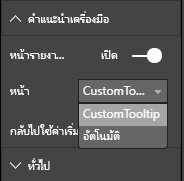

# <a name="tooltips-in-power-bi-visuals"></a><span data-ttu-id="af116-104">คำแนะนำเครื่องมือในวิชวล Power BI</span><span class="sxs-lookup"><span data-stu-id="af116-104">Tooltips in Power BI visuals</span></span>

<span data-ttu-id="af116-105">ขณะนี้วิชวลสามารถใช้ประโยชน์จากการสนับสนุนคำแนะนำเครื่องมือของ Power BI ได้แล้ว</span><span class="sxs-lookup"><span data-stu-id="af116-105">Visuals can now make use of Power BI tooltip support.</span></span> <span data-ttu-id="af116-106">คำแนะนำเครื่องมือ Power BI จะจัดการการโต้ตอบต่อไปนี้:</span><span class="sxs-lookup"><span data-stu-id="af116-106">Power BI tooltips handle the following interactions:</span></span>

* <span data-ttu-id="af116-107">แสดงคำแนะนำเครื่องมือ</span><span class="sxs-lookup"><span data-stu-id="af116-107">Show a tooltip.</span></span>
* <span data-ttu-id="af116-108">ซ่อนคำแนะนำเครื่องมือ</span><span class="sxs-lookup"><span data-stu-id="af116-108">Hide a tooltip.</span></span>
* <span data-ttu-id="af116-109">ย้ายคำแนะนำเครื่องมือ</span><span class="sxs-lookup"><span data-stu-id="af116-109">Move a tooltip.</span></span>

<span data-ttu-id="af116-110">คำแนะนำเครื่องมือสามารถแสดงองค์ประกอบที่เป็นข้อความพร้อมชื่อเรื่อง ค่าในสีที่กำหนดไว้ และความทึบไว้ในชุดพิกัดที่ระบุได้</span><span class="sxs-lookup"><span data-stu-id="af116-110">Tooltips can display a textual element with a title, a value in a given color, and opacity at a specified set of coordinates.</span></span> <span data-ttu-id="af116-111">ข้อมูลนี้จะถูกกำหนดไว้สำหรับ API และโฮสต์ Power BI จะแสดงผลในลักษณะเดียวกันกับที่แสดงคำแนะนำเครื่องมือสำหรับวิชวลต้นฉบับ</span><span class="sxs-lookup"><span data-stu-id="af116-111">This data is provided to the API, and the Power BI host renders it the same way it renders tooltips for native visuals.</span></span>

<span data-ttu-id="af116-112">คำแนะนำเครื่องมือในแผนภูมิแท่งตัวอย่างจะแสดงในรูปภาพต่อไปนี้:</span><span class="sxs-lookup"><span data-stu-id="af116-112">A tooltip in a sample bar chart is shown in the following image:</span></span>


<span data-ttu-id="af116-114">คำแนะนำเครื่องมือก่อนหน้านี้แสดงหมวดหมู่และค่าของแท่งเดียว</span><span class="sxs-lookup"><span data-stu-id="af116-114">The preceding tooltip image illustrates a single bar category and value.</span></span> <span data-ttu-id="af116-115">คุณสามารถขยายคำแนะนำเครื่องมือเดียวเพื่อแสดงหลายค่าได้</span><span class="sxs-lookup"><span data-stu-id="af116-115">You can extend a single tooltip to display multiple values.</span></span>

## <a name="manage-tooltips"></a><span data-ttu-id="af116-116">จัดการคำแนะนำเครื่องมือ</span><span class="sxs-lookup"><span data-stu-id="af116-116">Manage tooltips</span></span>

<span data-ttu-id="af116-117">อินเทอร์เฟซที่คุณจัดการคำแนะนำเครื่องมือคือ "ITooltipService"</span><span class="sxs-lookup"><span data-stu-id="af116-117">The interface through which you manage tooltips is the "ITooltipService."</span></span> <span data-ttu-id="af116-118">ซึ่งอินเทอร์เฟซใช้เพื่อแจ้งโฮสต์ว่าจำเป็นต้องแสดง ลบ หรือย้ายคำแนะนำเครื่องมือ</span><span class="sxs-lookup"><span data-stu-id="af116-118">It's used to notify the host that a tooltip needs to be displayed, removed, or moved.</span></span>

```typescript
    interface ITooltipService {
        enabled(): boolean;
        show(options: TooltipShowOptions): void;
        move(options: TooltipMoveOptions): void;
        hide(options: TooltipHideOptions): void;
    }
```

<span data-ttu-id="af116-119">วิชวลของคุณต้องรอการติดต่อจากกิจกรรมการใช้งานของเมาส์ภายในวิชวล และเรียกใช้ผู้รับมอบสิทธิ์ `show()`, `move()` และ`hide()` คนตามที่จำเป็นด้วยเนื้อหาที่เหมาะสมที่เติมใน `Tooltip****Options` ออบเจ็กต์</span><span class="sxs-lookup"><span data-stu-id="af116-119">Your visual needs to listen to the mouse events within your visual and call the `show()`, `move()`, and `hide()` delegates, as needed, with the appropriate content populated in the `Tooltip****Options` objects.</span></span>
<span data-ttu-id="af116-120">`TooltipShowOptions` และ `TooltipHideOptions` จะกำหนดสิ่งที่จะแสดงและวิธีการทำงานในกิจกรรมเหล่านี้ตามลำดับ</span><span class="sxs-lookup"><span data-stu-id="af116-120">`TooltipShowOptions` and `TooltipHideOptions` would in turn define what to display and how to behave in these events.</span></span>

<span data-ttu-id="af116-121">เนื่องจากการเรียกใช้วิธีการเหล่านี้เกี่ยวข้องกับกิจกรรมของผู้ใช้ เช่น กิจกรรมการย้ายเมาส์หรือการสัมผัส ซึ่งถือเป็นความคิดที่ดีที่จะสร้างตัวรอรับการติดต่อสำหรับกิจกรรมเหล่านี้ซึ่งจะเรียกใช้งานสมาชิก `TooltipService` รายตามลำดับ</span><span class="sxs-lookup"><span data-stu-id="af116-121">Because calling these methods involves user events such as mouse moves and touch events, it's a good idea to create listeners for these events, which would in turn invoke the `TooltipService` members.</span></span>
<span data-ttu-id="af116-122">การรวมตัวอย่างของเราในคลาสที่เรียกว่า `TooltipServiceWrapper`</span><span class="sxs-lookup"><span data-stu-id="af116-122">Our sample aggregates in a class called `TooltipServiceWrapper`.</span></span>

### <a name="the-tooltipservicewrapper-class"></a><span data-ttu-id="af116-123">คลาส TooltipServiceWrapper</span><span class="sxs-lookup"><span data-stu-id="af116-123">The TooltipServiceWrapper class</span></span>

<span data-ttu-id="af116-124">แนวคิดพื้นฐานที่อยู่เบื้องหลังคลาสนี้คือการระงับอินสแตนซ์ของ `TooltipService` การรอรับติดต่อจากกิจกรรมการใช้งานของเมาส์ D3 ผ่านองค์ประกอบที่เกี่ยวข้องและการเรียกใช้งานองค์ประกอบ `show()` และ `hide()` เมื่อจำเป็น</span><span class="sxs-lookup"><span data-stu-id="af116-124">The basic idea behind this class is to hold the instance of the `TooltipService`, listen to D3 mouse events over relevant elements, and then make the calls to `show()` and `hide()` the elements when needed.</span></span>

<span data-ttu-id="af116-125">คลาสจะระงับและจัดการสถานะและตรรกะใดก็ตามที่เกี่ยวข้องสำหรับกิจกรรมณ์เหล่านี้ ซึ่งโดยส่วนใหญ่จะเปลี่ยนการอินเทอร์เฟซกับรหัส D3 พื้นฐานให้เหมาะสม</span><span class="sxs-lookup"><span data-stu-id="af116-125">The class holds and manages any relevant state and logic for these events, which are mostly geared at interfacing with the underlying D3 code.</span></span> <span data-ttu-id="af116-126">การอินเทอร์เฟซและการแปลง D3 อยู่นอกขอบเขตสำหรับบทความนี้</span><span class="sxs-lookup"><span data-stu-id="af116-126">The D3 interfacing and conversion is out of scope for this article.</span></span>

<span data-ttu-id="af116-127">คุณสามารถค้นหารหัสตัวอย่างฉบับสมบูรณ์ได้ใน [พื้นที่เก็บวิชวล SampleBarChart](https://github.com/Microsoft/PowerBI-visuals-sampleBarChart/commit/981b021612d7b333adffe9f723ab27783c76fb14)</span><span class="sxs-lookup"><span data-stu-id="af116-127">You can find the full sample code in [SampleBarChart visual repository](https://github.com/Microsoft/PowerBI-visuals-sampleBarChart/commit/981b021612d7b333adffe9f723ab27783c76fb14).</span></span>

### <a name="create-tooltipservicewrapper"></a><span data-ttu-id="af116-128">สร้าง TooltipServiceWrapper</span><span class="sxs-lookup"><span data-stu-id="af116-128">Create TooltipServiceWrapper</span></span>

<span data-ttu-id="af116-129">ตอนนี้ คอนสตรักเตอร์ของแผนภูมิแท่งมีสมาชิก `TooltipServiceWrapper` หนึ่งราย ซึ่งมีการสร้างอินสแตนซ์ในคอนสตรักเตอร์ด้วยอินสแตนซ์ `tooltipService` ของโฮสต์</span><span class="sxs-lookup"><span data-stu-id="af116-129">The bar chart constructor now has a `TooltipServiceWrapper` member, which is instantiated in the constructor with the host `tooltipService` instance.</span></span>

```typescript
        private tooltipServiceWrapper: ITooltipServiceWrapper;

        this.tooltipServiceWrapper = createTooltipServiceWrapper(this.host.tooltipService, options.element);
```

<span data-ttu-id="af116-130">คลาส `TooltipServiceWrapper` จะระงับ อินสแตนซ์ `tooltipService` ซึ่งเป็นองค์ประกอบของ D3 ระดับสูงของวิชวลและพารามิเตอร์การสัมผัส</span><span class="sxs-lookup"><span data-stu-id="af116-130">The `TooltipServiceWrapper` class holds the `tooltipService` instance, also as the root D3 element of the visual and touch parameters.</span></span>

```typescript
    class TooltipServiceWrapper implements ITooltipServiceWrapper {
        private handleTouchTimeoutId: number;
        private visualHostTooltipService: ITooltipService;
        private rootElement: Element;
        private handleTouchDelay: number;

        constructor(tooltipService: ITooltipService, rootElement: Element, handleTouchDelay: number) {
            this.visualHostTooltipService = tooltipService;
            this.handleTouchDelay = handleTouchDelay;
            this.rootElement = rootElement;
        }
        .
        .
        .
    }
```

<span data-ttu-id="af116-131">จุดเข้าใช้งานเดียวสำหรับคลาสนี้เพื่อลงทะเบียนตัวรอรับการติดต่อของกิจกรรม `addTooltip` เมธอด</span><span class="sxs-lookup"><span data-stu-id="af116-131">The single entry point for this class to register event listeners is the `addTooltip` method.</span></span>

### <a name="the-addtooltip-method"></a><span data-ttu-id="af116-132">เมธอด addTooltip</span><span class="sxs-lookup"><span data-stu-id="af116-132">The addTooltip method</span></span>

```typescript
        public addTooltip<T>(
            selection: d3.Selection<Element>,
            getTooltipInfoDelegate: (args: TooltipEventArgs<T>) => VisualTooltipDataItem[],
            getDataPointIdentity: (args: TooltipEventArgs<T>) => ISelectionId,
            reloadTooltipDataOnMouseMove?: boolean): void {

            if (!selection || !this.visualHostTooltipService.enabled()) {
                return;
            }
        ...
        ...
        }
```

* <span data-ttu-id="af116-133">**การเลือก: d3.Selection<Element>** : องค์ประกอบ d3 ที่จัดการคำแนะนำเครื่องมือ</span><span class="sxs-lookup"><span data-stu-id="af116-133">**selection: d3.Selection<Element>**: The d3 elements over which tooltips are handled.</span></span>

* <span data-ttu-id="af116-134">**getTooltipInfoDelegate: (args: TooltipEventArgs<T>) => VisualTooltipDataItem[]** : การมอบสิทธิ์สำหรับการเติมเนื้อหาคำแนะนำเครื่องมือ (สิ่งที่จะแสดง) ต่อบริบท</span><span class="sxs-lookup"><span data-stu-id="af116-134">**getTooltipInfoDelegate: (args: TooltipEventArgs<T>) => VisualTooltipDataItem[]**: The delegate for populating the tooltip content (what to display) per context.</span></span>

* <span data-ttu-id="af116-135">**getDataPointIdentity: (args: TooltipEventArgs<T>) => ISelectionId**: การมอบสิทธิ์สำหรับการเรียกใช้ ID จุดข้อมูล (ไม่ได้ใช้ในตัวอย่างนี้)</span><span class="sxs-lookup"><span data-stu-id="af116-135">**getDataPointIdentity: (args: TooltipEventArgs<T>) => ISelectionId**: The delegate for retrieving the data point ID (unused in this sample).</span></span> 

* <span data-ttu-id="af116-136">**reloadTooltipDataOnMouseMove? boolean**: บูลีนที่ระบุว่าจะรีเฟรชข้อมูลคำแนะนำเครื่องมือในระหว่างกิจกรรม MouseMove (ไม่ได้ใช้ในตัวอย่างนี้)</span><span class="sxs-lookup"><span data-stu-id="af116-136">**reloadTooltipDataOnMouseMove? boolean**: A Boolean that indicates whether to refresh the tooltip data during a MouseMove event (unused in this sample).</span></span>

<span data-ttu-id="af116-137">ในขณะที่คุณสามารถดูได้ `addTooltip` จะออกจากระบบโดยไม่มีการดำเนินการถ้าปิดใช้งาน `tooltipService` อยู่หรือไม่มีการเลือกที่แท้จริง</span><span class="sxs-lookup"><span data-stu-id="af116-137">As you can see, `addTooltip` exits with no action if the `tooltipService` is disabled or there's no real selection.</span></span>

### <a name="call-the-show-method-to-display-a-tooltip"></a><span data-ttu-id="af116-138">เรียกใช้เมธอดการแสดงเพื่อแสดงคำแนะนำเครื่องมือ</span><span class="sxs-lookup"><span data-stu-id="af116-138">Call the show method to display a tooltip</span></span>

<span data-ttu-id="af116-139">เมธอด `addTooltip` ถัดไปจะรอรับติดต่อจากกิจกรรม `mouseover` ของ D3 ดังแสดงในโค้ดต่อไปนี้:</span><span class="sxs-lookup"><span data-stu-id="af116-139">The `addTooltip` method next listens to the D3 `mouseover` event, as shown in the following code:</span></span>

```typescript
        ...
        ...
        selection.on("mouseover.tooltip", () => {
            // Ignore mouseover while handling touch events
            if (!this.canDisplayTooltip(d3.event))
                return;

            let tooltipEventArgs = this.makeTooltipEventArgs<T>(rootNode, true, false);
            if (!tooltipEventArgs)
                return;

            let tooltipInfo = getTooltipInfoDelegate(tooltipEventArgs);
            if (tooltipInfo == null)
                return;

            let selectionId = getDataPointIdentity(tooltipEventArgs);

            this.visualHostTooltipService.show({
                coordinates: tooltipEventArgs.coordinates,
                isTouchEvent: false,
                dataItems: tooltipInfo,
                identities: selectionId ? [selectionId] : [],
            });
        });
```

* <span data-ttu-id="af116-140">**makeTooltipEventArgs**: แยกบริบทจากองค์ประกอบที่เลือกของ D3 เป็น tooltipEventArgs</span><span class="sxs-lookup"><span data-stu-id="af116-140">**makeTooltipEventArgs**: Extracts the context from the D3 selected elements into a tooltipEventArgs.</span></span> <span data-ttu-id="af116-141">ซึ่งจะคำนวณพิกัดเช่นกัน</span><span class="sxs-lookup"><span data-stu-id="af116-141">It calculates the coordinates as well.</span></span>

* <span data-ttu-id="af116-142">**getTooltipInfoDelegate**: จากนั้นสร้างเนื้อหาของคำแนะนำเครื่องมือจาก tooltipEventArgs</span><span class="sxs-lookup"><span data-stu-id="af116-142">**getTooltipInfoDelegate**: It then builds the tooltip content from the tooltipEventArgs.</span></span> <span data-ttu-id="af116-143">ซึ่งเป็นการเรียกกลับไปยังคลาส BarChart เพราะว่าเป็นตรรกะของวิชวล</span><span class="sxs-lookup"><span data-stu-id="af116-143">It's a callback to the BarChart class, because it is the visual's logic.</span></span> <span data-ttu-id="af116-144">นี่คือเนื้อหาข้อความจริงที่จะแสดงในคำแนะนำเครื่องมือ</span><span class="sxs-lookup"><span data-stu-id="af116-144">It's the actual text content to display in the tooltip.</span></span>

* <span data-ttu-id="af116-145">**getDataPointIdentity**: ไม่ได้ใช้ในตัวอย่างนี้</span><span class="sxs-lookup"><span data-stu-id="af116-145">**getDataPointIdentity**: Unused in this sample.</span></span>

* <span data-ttu-id="af116-146">**this.visualHostTooltipService.show**: การเรียกเพื่อแสดงคำแนะนำเครื่องมือ</span><span class="sxs-lookup"><span data-stu-id="af116-146">**this.visualHostTooltipService.show**: The call to display the tooltip.</span></span>  

<span data-ttu-id="af116-147">สามารถพบการจัดการเพิ่มเติมได้ในตัวอย่างสำหรับกิจกรรม `mouseout` และ `mousemove`</span><span class="sxs-lookup"><span data-stu-id="af116-147">Additional handling can be found in the sample for `mouseout` and `mousemove` events.</span></span>

<span data-ttu-id="af116-148">สำหรับข้อมูลเพิ่มเติม ให้ดู [ที่เก็บวิชวล SampleBarChart](https://github.com/Microsoft/PowerBI-visuals-sampleBarChart/commit/981b021612d7b333adffe9f723ab27783c76fb14)</span><span class="sxs-lookup"><span data-stu-id="af116-148">For more information, see the [SampleBarChart visual repository](https://github.com/Microsoft/PowerBI-visuals-sampleBarChart/commit/981b021612d7b333adffe9f723ab27783c76fb14).</span></span>

### <a name="populate-the-tooltip-content-by-the-gettooltipdata-method"></a><span data-ttu-id="af116-149">เติมเนื้อหาคำแนะนำเครื่องมือตามเมธอด getTooltipData</span><span class="sxs-lookup"><span data-stu-id="af116-149">Populate the tooltip content by the getTooltipData method</span></span>

<span data-ttu-id="af116-150">คลาส BarChart ถูกเพิ่มเข้ามาพร้อมกับสมาชิก `getTooltipData` ที่เพียงแค่แยก `category`, `value` และ `color`ของจุดข้อมูลเป็นองค์ประกอบของ VisualTooltipDataItem []</span><span class="sxs-lookup"><span data-stu-id="af116-150">The BarChart class was added with a `getTooltipData` member, which simply extracts the `category`, `value`, and `color` of the data point into a VisualTooltipDataItem[] element.</span></span>

```typescript
        private static getTooltipData(value: any): VisualTooltipDataItem[] {
            return [{
                displayName: value.category,
                value: value.value.toString(),
                color: value.color,
                header: 'ToolTip Title'
            }];
        }
```

<span data-ttu-id="af116-151">ในการนำไปใช้งานก่อนหน้านี้ สมาชิก `header` แต่คุณสามารถใช้สำหรับการดำเนินการที่ซับซ้อนมากขึ้น ซึ่งจำเป็นต้องมีข้อมูลแบบไดนามิก</span><span class="sxs-lookup"><span data-stu-id="af116-151">In the preceding implementation, the `header` member is constant, but you can use it for more complex implementations, which require dynamic values.</span></span> <span data-ttu-id="af116-152">คุณสามารถเติมข้อมูล `VisualTooltipDataItem[]` ที่มีมากกว่าหนึ่งองค์ประกอบได้ ซึ่งจะเพิ่มหลายบรรทัดในคำแนะนำเครื่องมือ</span><span class="sxs-lookup"><span data-stu-id="af116-152">You can populate the `VisualTooltipDataItem[]` with more than one element, which adds multiple lines to the tooltip.</span></span> <span data-ttu-id="af116-153">จะมีประโยชน์ในวิชวล เช่น แผนภูมิแท่งแบบเรียงซ้อน ซึ่งคำแนะนำเครื่องมืออาจแสดงข้อมูลจากมากกว่าจุดข้อมูลเดียว</span><span class="sxs-lookup"><span data-stu-id="af116-153">It can be useful in visuals such as stacked bar charts where the tooltip may display data from more than a single data point.</span></span>

### <a name="call-the-addtooltip-method"></a><span data-ttu-id="af116-154">เรียกใช้เมธอด addTooltip</span><span class="sxs-lookup"><span data-stu-id="af116-154">Call the addTooltip method</span></span>

<span data-ttu-id="af116-155">ขั้นตอนสุดท้ายคือการเรียกใช้เมธอด `addTooltip` เมื่อข้อมูลจริงอาจเปลี่ยนแปลง</span><span class="sxs-lookup"><span data-stu-id="af116-155">The final step is to call the `addTooltip` method when the actual data might change.</span></span> <span data-ttu-id="af116-156">การเรียกใช้นี้เกิดขึ้นในเมธอด `BarChart.update()`</span><span class="sxs-lookup"><span data-stu-id="af116-156">This call takes place in the `BarChart.update()` method.</span></span> <span data-ttu-id="af116-157">การเรียกใช้ถูกสร้างขึ้นเพื่อตรวจสอบการเลือกองค์ประกอบ 'แท่ง' ทั้งหมด ซึ่งส่งผ่านเฉพาะ `BarChart.getTooltipData()` ดังที่กล่าวถึงข้างต้นเท่านั้น</span><span class="sxs-lookup"><span data-stu-id="af116-157">A call is made to monitor the selection of all the 'bar' elements, passing only the `BarChart.getTooltipData()`, as mentioned previously.</span></span>

```typescript
        this.tooltipServiceWrapper.addTooltip(this.barContainer.selectAll('.bar'),
            (tooltipEvent: TooltipEventArgs<number>) => BarChart.getTooltipData(tooltipEvent.data),
            (tooltipEvent: TooltipEventArgs<number>) => null);
```

## <a name="add-report-page-tooltips"></a><span data-ttu-id="af116-158">เพิ่มคำแนะนำเครื่องมือของหน้ารายงาน</span><span class="sxs-lookup"><span data-stu-id="af116-158">Add report page tooltips</span></span>

<span data-ttu-id="af116-159">หากต้องการเพิ่มคำแนะนำเครื่องมือของหน้ารายงาน คุณจะพบการเปลี่ยนแปลงส่วนใหญ่ในไฟล์ *capabilities.json*</span><span class="sxs-lookup"><span data-stu-id="af116-159">To add report page tooltips support, you'll find most changes in the *capabilities.json* file.</span></span>

<span data-ttu-id="af116-160">ตัวอย่าง Schema คือ</span><span class="sxs-lookup"><span data-stu-id="af116-160">A sample schema is</span></span>

```json
{
    "tooltips": {
        "supportedTypes": {
            "default": true,
            "canvas": true
        },
        "roles": [
            "tooltips"
        ]
    }
}
```

<span data-ttu-id="af116-161">คุณสามารถกำหนดคำแนะนำเครื่องมือของหน้ารายงานในบานหน้าต่าง **รูปแบบ** ได้</span><span class="sxs-lookup"><span data-stu-id="af116-161">You can define report page tooltips in the **Format** pane.</span></span>



* <span data-ttu-id="af116-163">`supportedTypes`: การกำหนดค่าคำแนะนำเครื่องมือที่วิชวลรองรับและจะปรากฏบนช่องเขตข้อมูลดังกล่าว</span><span class="sxs-lookup"><span data-stu-id="af116-163">`supportedTypes`: The tooltip configuration that's supported by the visual and reflected in the fields well.</span></span> 
   * <span data-ttu-id="af116-164">`default`: ระบุว่ามีการสนับสนุนการผูกคำแนะนำเครื่องมือ "อัตโนมัติ" ผ่านเขตข้อมูลหรือไม่</span><span class="sxs-lookup"><span data-stu-id="af116-164">`default`: Specifies whether the "automatic" tooltips binding via the data field is supported.</span></span> 
   * <span data-ttu-id="af116-165">`canvas`: ระบุว่าคำแนะนำเครื่องมือของหน้ารายงานได้รับการสนับสนุนหรือไม่</span><span class="sxs-lookup"><span data-stu-id="af116-165">`canvas`: Specifies whether the report page tooltips are supported.</span></span>

* <span data-ttu-id="af116-166">`roles`: (เป็นทางเลือก) หลังจากกำหนดแล้ว ให้แนะนำบทบาทข้อมูลที่จะผูกไว้กับตัวเลือกคำแนะนำเครื่องมือที่เลือกในช่องเขตข้อมูลดังกล่าว</span><span class="sxs-lookup"><span data-stu-id="af116-166">`roles`: (Optional) After it's defined, it instructs what data roles are bound to the selected tooltip option in the fields well.</span></span>

<span data-ttu-id="af116-167">สำหรับข้อมูลเพิ่มเติม ให้ดู [คำแนะนำในการใช้งานคำแนะนำเครื่องมือของหน้ารายงาน](https://powerbi.microsoft.com/blog/power-bi-desktop-march-2018-feature-summary/#tooltips)</span><span class="sxs-lookup"><span data-stu-id="af116-167">For more information, see [Report page tooltips usage guidelines](https://powerbi.microsoft.com/blog/power-bi-desktop-march-2018-feature-summary/#tooltips).</span></span>

<span data-ttu-id="af116-168">เมื่อต้องการแสดงคำแนะนำเครื่องมือของหน้ารายงาน หลังจากโฮสต์ Power BI เรียกใช้ `ITooltipService.Show(options: TooltipShowOptions)` หรือ `ITooltipService.Move(options: TooltipMoveOptions)` แล้วจะใช้ selectionId (คุณสมบัติ `identities` ของอาร์กิวเมนต์ `options` ก่อนหน้า)</span><span class="sxs-lookup"><span data-stu-id="af116-168">To display the report page tooltip, after the Power BI host calls `ITooltipService.Show(options: TooltipShowOptions)` or `ITooltipService.Move(options: TooltipMoveOptions)`, it consumes the selectionId (`identities` property of the preceding `options` argument).</span></span> <span data-ttu-id="af116-169">เมื่อต้องการเรียกใช้คำแนะนำเครื่องมือ SelectionId ควรแสดงข้อมูลที่เลือกไว้ (ประเภท, ชุดข้อมูล และอื่นๆ) ของรายการที่คุณวางเมาส์อยู่เหนือ</span><span class="sxs-lookup"><span data-stu-id="af116-169">To be retrieved by the tooltip, SelectionId should represent the selected data (category, series, and so on) of the item you hovered over.</span></span>

<span data-ttu-id="af116-170">ตัวอย่างของการส่ง selectionId ไปยังการเรียกแสดงคำแนะนำเครื่องมือแสดงในโค้ดต่อไปนี้:</span><span class="sxs-lookup"><span data-stu-id="af116-170">An example of sending the selectionId to tooltip display calls is shown in the following code:</span></span>

```typescript
    this.tooltipServiceWrapper.addTooltip(this.barContainer.selectAll('.bar'),
        (tooltipEvent: TooltipEventArgs<number>) => BarChart.getTooltipData(tooltipEvent.data),
        (tooltipEvent: TooltipEventArgs<number>) => tooltipEvent.data.selectionID);
```
