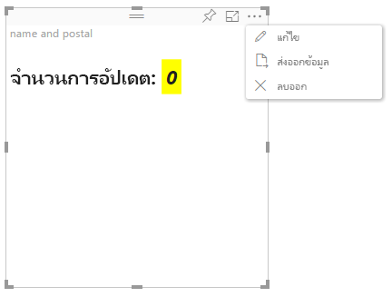

# โหมดการแก้ไขขั้นสูงในวิชวล Power BIAdvanced edit mode in Power BI visuals

หากคุณต้องการการควบคุม UI ขั้นสูงในวิชวล Power BI คุณสามารถใช้ประโยชน์จากโหมดแก้ไขขั้นสูงได้If you require advanced UI controls in your Power BI visual, you can take advantage of advanced edit mode. เมื่อคุณอยู่ในโหมดแก้ไขรายงาน ให้คุณเลือกปุ่ม **แก้ไข** เพื่อตั้งโหมดแก้ไขเป็น **ขั้นสูง**When you're in report editing mode, you select an **Edit** button to set the edit mode to **Advanced**. ภาพสามารถใช้ค่าสถานะ `EditMode` เพื่อพิจารณาว่าควรแสดงการควบคุม UI นี้หรือไม่The visual can use the `EditMode` flag to determine whether it should display this UI control.

ตามค่าเริ่มต้น วิชวลไม่สนับสนุนโหมดการแก้ไขขั้นสูงBy default, the visual doesn't support advanced edit mode. คุณสามารถระบุสิ่งนี้ได้อย่างชัดเจนในไฟล์ *capabilities.json* ของวิชวลโดยการตั้งค่าคุณสมบัติ `advancedEditModeSupport`If a different behavior is required, you can explicitly state this in the visual's *capabilities.json* file by setting the `advancedEditModeSupport` property.

ค่าที่เป็นไปได้คือ:The possible values are:

- `0` - NotSupported`0` - NotSupported

- `1` - SupportedNoAction`1` - SupportedNoAction

- `2` - SupportedInFocus`2` - SupportedInFocus

## ป้อนโหมดการแก้ไขขั้นสูงEnter advanced edit mode

ปุ่ม **แก้ไข** จะแสดงขึ้นมาถ้า:An **Edit** button is displayed if:

* คุณสมบัติ `advancedEditModeSupport` ถูกตั้งค่าในไฟล์ *capabilities.json* เป็น `SupportedNoAction` หรือ `SupportedInFocus`The `advancedEditModeSupport` property is set in the *capabilities.json* file to either `SupportedNoAction` or `SupportedInFocus`.

* แสดงผลวิชวลในโหมดการแก้ไขรายงานThe visual is viewed in report editing mode.

หากคุณสมบัติ `advancedEditModeSupport` หายไปจากไฟล์ *capabilities.json* หรือตั้งค่าเป็น `NotSupported` ปุ่ม **แก้ไข** จะไม่ปรากฏขึ้นIf `advancedEditModeSupport` property is missing from the *capabilities.json* file or set to `NotSupported`, the **Edit** button is not displayed.

เมื่อคุณเลือก **แก้ไข** วิชวลจะทำการเรียกใช้ update() โดยมีการตั้งค่า EditMode เป็น `Advanced`When you select **Edit**, the visual gets an update() call with EditMode set to `Advanced`. ขึ้นอยู่กับค่าที่ตั้งไว้ในไฟล์ *capabilities.json* การดำเนินการต่อไปนี้เกิดขึ้น:Depending on the value that's set in the *capabilities.json* file, the following actions occur:

* `SupportedNoAction`: ไม่ต้องการการดำเนินการเพิ่มเติมจากโฮสต์`SupportedNoAction`: No further action is required by the host.
* `SupportedInFocus`: โฮสต์จะเปิดหน้าต่างวิชวลใหม่ในโหมดโฟกัส`SupportedInFocus`: The host pops out the visual into in focus mode.

## ออกจากโหมดการแก้ไขขั้นสูงExit advanced edit mode

ปุ่ม **กลับไปยังรายงาน** จะปรากฏขึ้น ถ้า:The **Back to report** button is displayed if:

* คุณสมบัติ `advancedEditModeSupport` ถูกตั้งค่าในไฟล์ *capabilities.json* เป็น `SupportedInFocus`The `advancedEditModeSupport` property is set in the *capabilities.json* file to `SupportedInFocus`.
